# [💡Basic Training] Setting a Map
 
 
 

## Video Timeline
- You can follow along by using the timeline under the training video.
- Understanding Map Types: `00:01:29`
 

## Learning Goals
- Learn about MapleStory Worlds's map methods and select what kind of map method you will need when making a world.
- Learn to identify which components can interact with platform tiles on the map based on each map's method.
- Learn about the KinematicBodyComponent for interactions with the RectTileMap.
- Learn how to place tiles on the RectTileMap and formulate a map.
 

## Practical Exercises to Do After Watching the Video
- Changing the Map format to a RectTileMap for the creation of a shooting world map.
- Create a TileSet.
- Use the created TileSet to create an interactable Map.
 

## Map Types

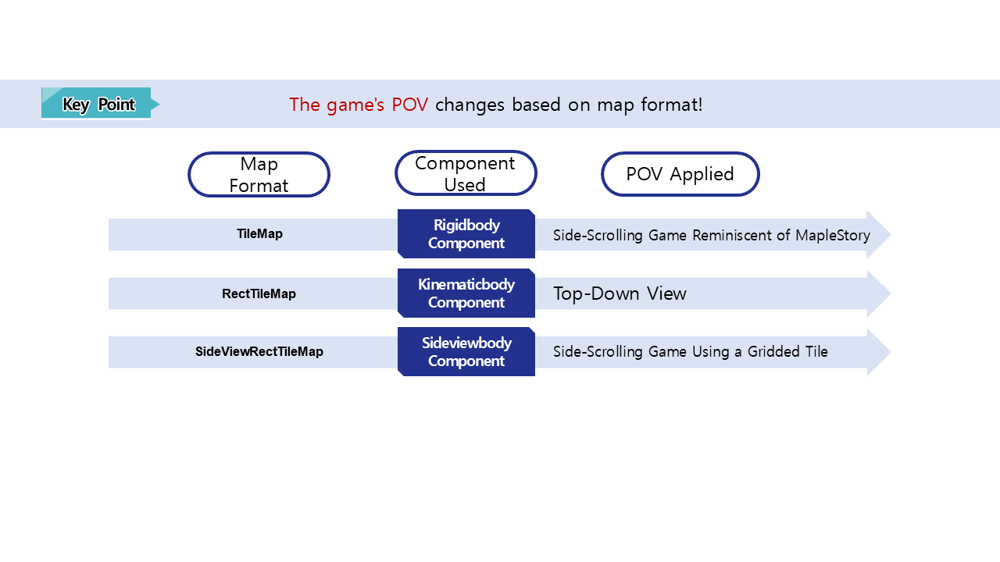

 

### TileMap

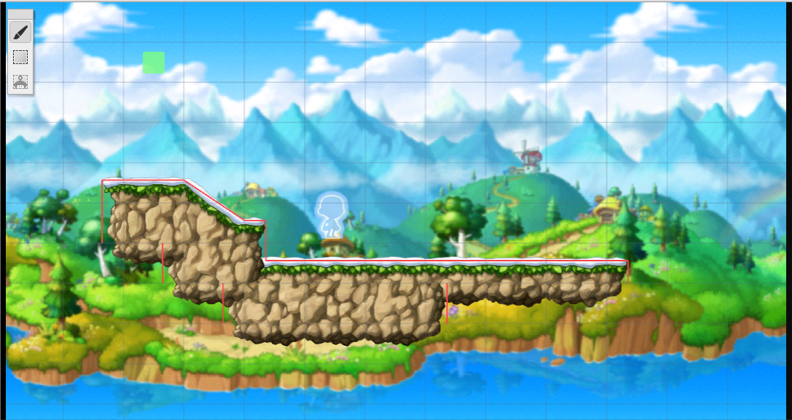

- A map format that is set up as the default when creating a world for the first time in MapleStory Worlds.
- A world that is best suited for the feel of MapleStory.
- Formulate a map by utilizing Tiles provided by MapleStory Worlds to create platforms and place entities.
- Create a ramp based on how the tiles are placed.
- A useful map format when you want to make a side scrolling-type game reminiscent of MapleStory.
 

### RectTileMap

- A map format that is effective in making top-down view type games.
- Create your own tile sets or use the tile set resources provided by MapleStory Worlds to formulate a map.
- You can formulate a map by placing tiles in a gridded format.
- You can create mobile and immobile areas through each tile.
- Create a game where you can move in 4 or 8 directions, unlike with the TileMap and SideViewRectTileMap methods.
 

### SideViewRectTileMap

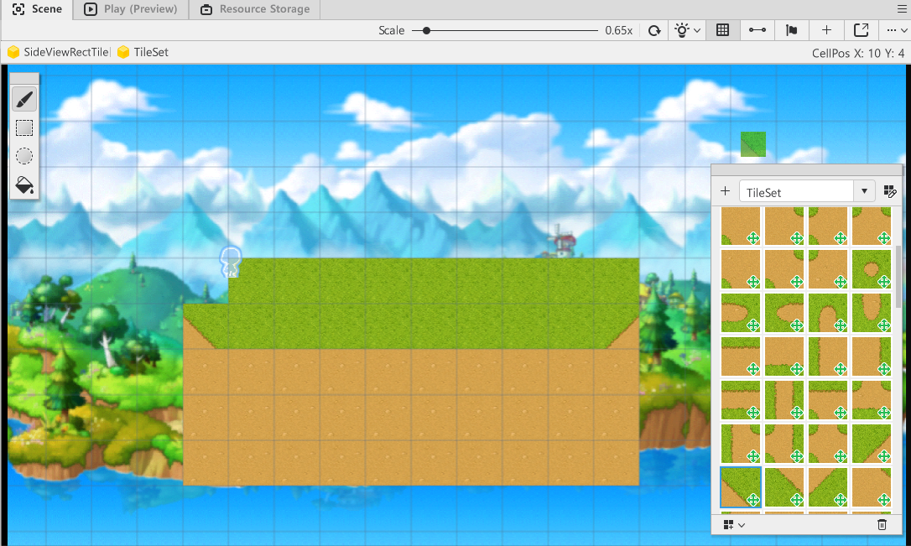

- A map format that is effective in making side scrolling-type games.
- Create your own tile sets or use the tile set resources provided by MapleStory Worlds to formulate a map.
- You can formulate a map by placing tiles in a gridded format.
- The character moves **through** tiles if the tile set doesn't prevent it, unlike with RectTileMap.
- So if you formulate a map with SideViewRectTileMap, the tile set that prevents movement must be used to create **platforms**.

 

## BodyComponent

- The BodyComponent is required to interact with tiles that are platforms in MapleStory Worlds.
- Different BodyComponents are needed based on the map type.
- There are 3 main types of BodyComponents.
 

### RigidBodyComponent

- Controls the character's physics with MapleStory Worlds's TileMap method.
- If the map is a TileMap but doesn't have a RigidBodyComponent, the character and tiles will not interact.
- Provides various physics property values that control the jumps, gravity, and more for characters within RigidBodyComponent.
- The target values can be changed to change the physics methods.
 

### KinematicBodyComponent

- Controls the character's physics for the MapleStory Worlds's RectTileMap type.
- If the map is RectTileMap but there is no KinematicBodyComponent, no interactions will happen with the RectTileMap tiles.
- You can adjust the speed, jump availability, shadow status, etc. for characters within KinematicBodyComponent.
 

### SideViewRectTileMap

- Controls the character's physics if MapleStory Worlds is using the SideViewRectTileMap method.
- If this component doesn't exist, the character won't be able to interact with the map's tiles.
- Controls the character's jump speed and gravitational acceleration.

 

## Changing Map Formats

- Right-click the map you want to change from the Hierarchy window.
- Click Switch To RectTileMap or Switch To SideViewRectTileMap.
    - If the current map isn't a TileMap, Swith To TileMap will be visible and the conversion to the current map state will be hidden.
- Click on Switch To RectTileMap to convert the map to RectTileMap to create a shooting world.
 

## Exploring KinematicBodyComponent Elements

- **SpeedFactor**: The value that controls the character's speed. Control the horizontal or vertical speed based on the X and Y values.
- **EnableJump**: Set whether characters can jump. If this value is un-checked, the character won't be able to jump.
- **JumpSpeed**: Control the character's jump speed. The larger the value, the higher and faster the character can jump.
- **JumpDrag**: Control the character's gravitational acceleration. The smaller the value, the weaker gravity becomes, which makes the character return to the ground more slowly.
- **ApplyClimbableRotation**: A value that determines whether the character is spun when the character interacts with elements like ladders and ropes based on whether the ladder or rope is rotated.
- **EnableShadow**: Sets whether the character shadow is visible. When the value is removed, the character's shadow is removed.
- **ShadowColor**: Change the color of the shadow.
- **ShadowOffset**: Change the output position of the shadow.
- **ShadowSize**: Set the size of the shadow.
- **ShadowScalingRatio**: Change how much the shadow shrinks when the character jumps. The smaller the value, the smaller the shadow becomes.
- **EnableTileCollision**: The character will be able to **ignore** RectTileMap tiles that prevent movement.
 

## Placing Tiles on RectTileMap
- A RectTileMap must be placed to set the movement area for a shooting world.
- If it is being changed to a RectTileMap for the first time, a tile set is required to place tiles.
- For the sample world, we will create a tile set by using resources provided by MapleStory Worlds.
- If you already have resources you've created or want to use, you can create a tile set yourself for use.
 

### Creating Tile Sets

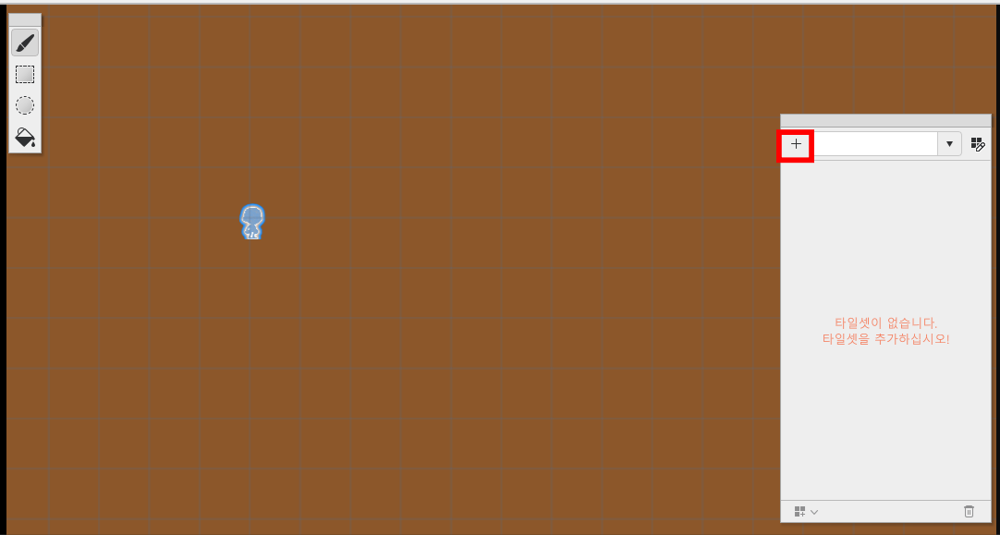

- Click the `+` button on the tile set editor screen in RectTileMap mode.

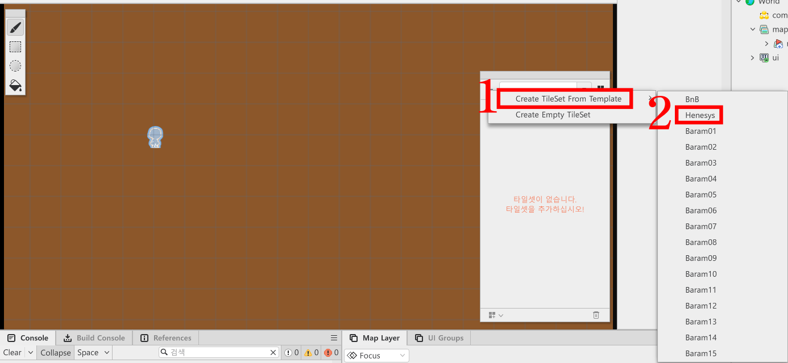

- Click Create TileSetFrom Template.
- Select the desired resource.
    - The sample world used Henesys.
- If there is a separate resource you want to use as a tile set, you can create a tile set yourself through Create Empty TileSet.

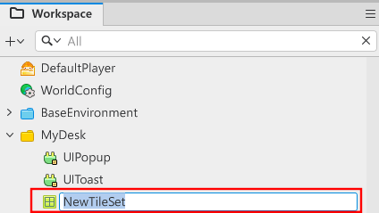

- Change the name of the NewTileSet that was added to Workspace to finish tile set creation.

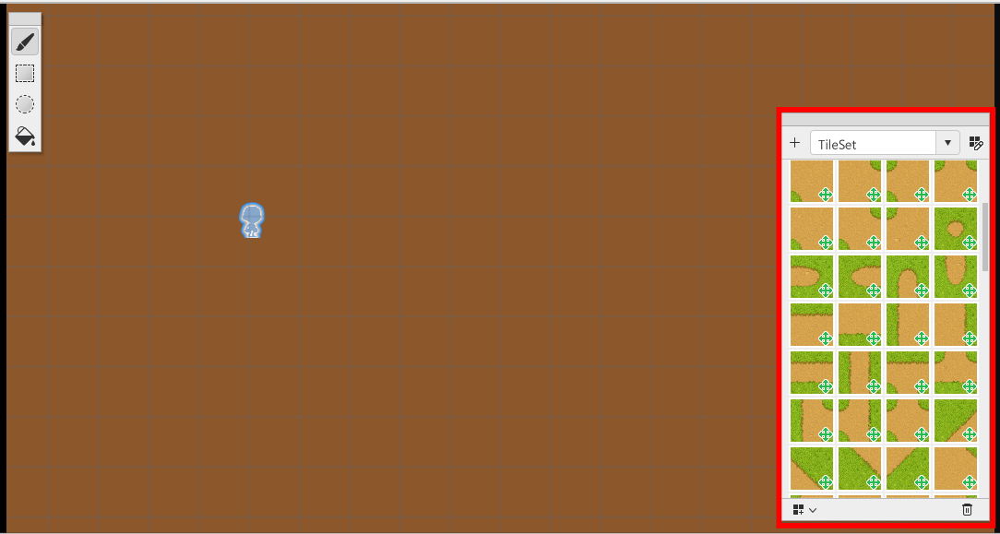

- If tile set creation was finished normally, placeable tiles will be visible in the tile set editor screen.
 

### Changing the Movability of Tiles

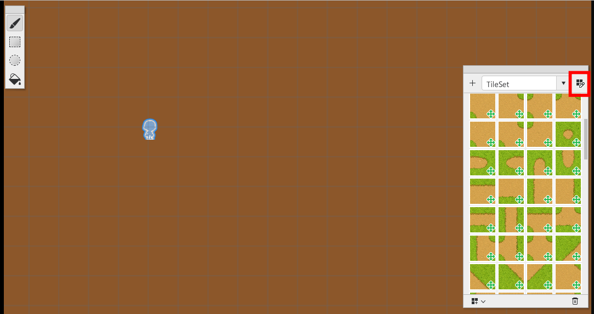

- Click the edit tile button on the right side of the editor screen.

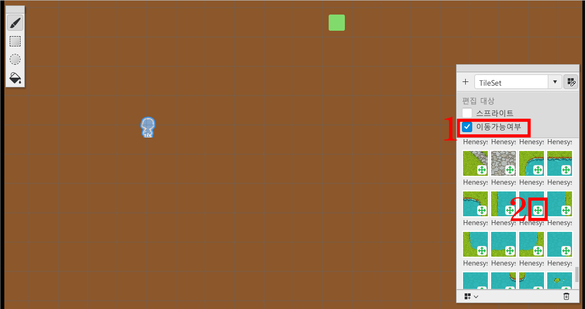

- Click on movability for the target you want to edit.
- Click on the green cross UI to change it to the red cross UI for the tile you want to make not movable.

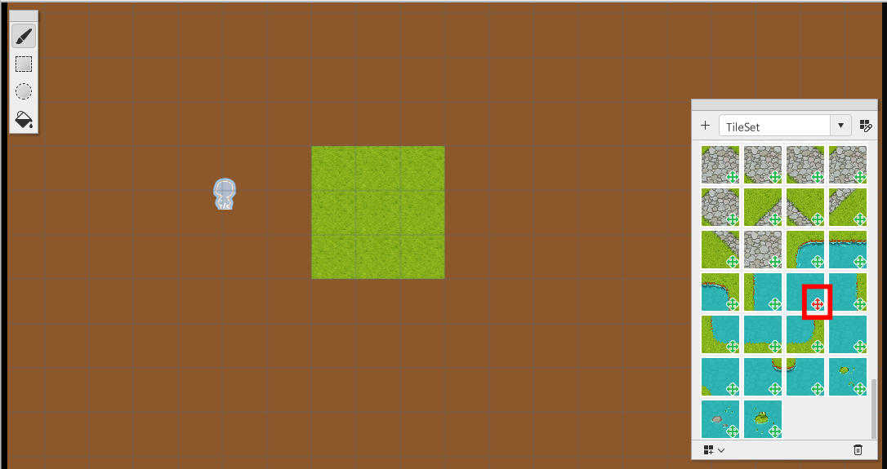

- If the change went through, the UI will change into a red cross while in tile placement mode.
- Place the tile on the map and then confirm that the character can't move normally through test play.
 

### Hide Placed Tiles on the Map

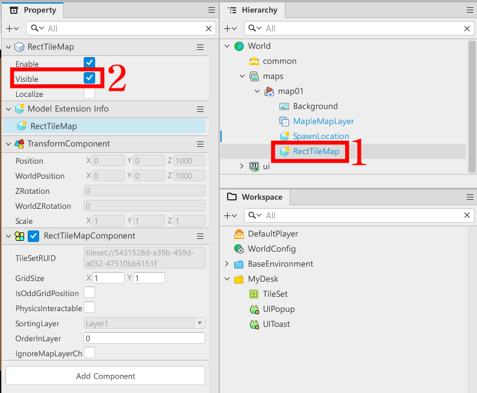

- Find RectTileMap in the Hierarchy window and click it.
- Click Visible in the Property window and **un-check** it.

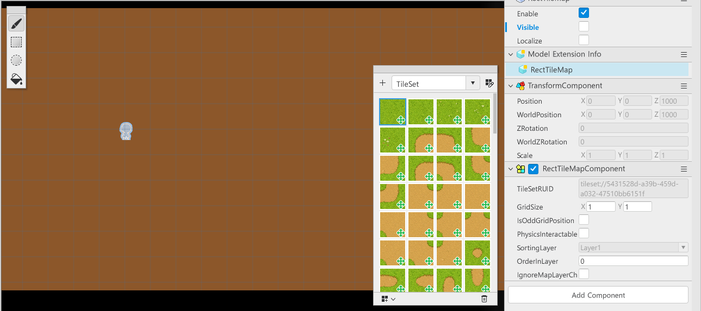

- When Visible is removed normally, then the Scene screen will show the screen where the tiles have been hidden.
 

### Changing Backgrounds

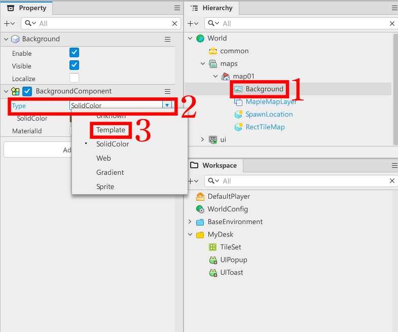

- Find Background in the Hierarchy window and click it.
- Find the BackgroundComponent in the Property window.
- Click Type.
- Change from SolidColor to Template.

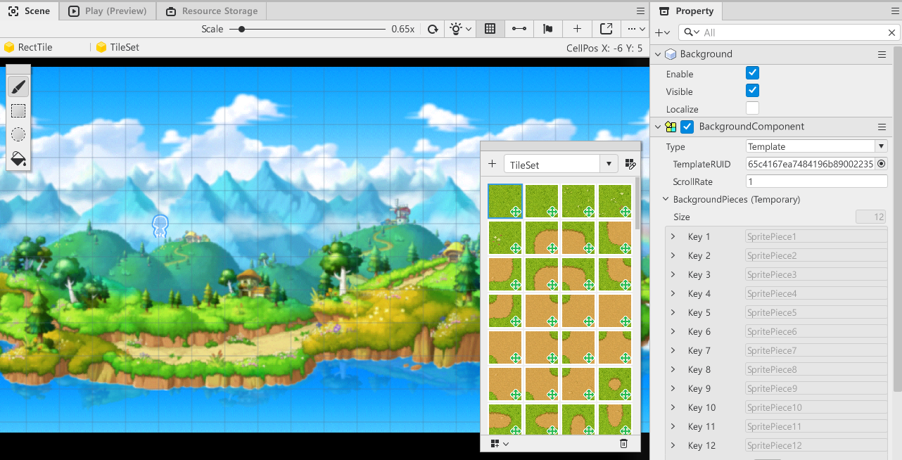

- If the change went through, the Scene screen will change from a single color background to one provided by MapleStory Worlds.

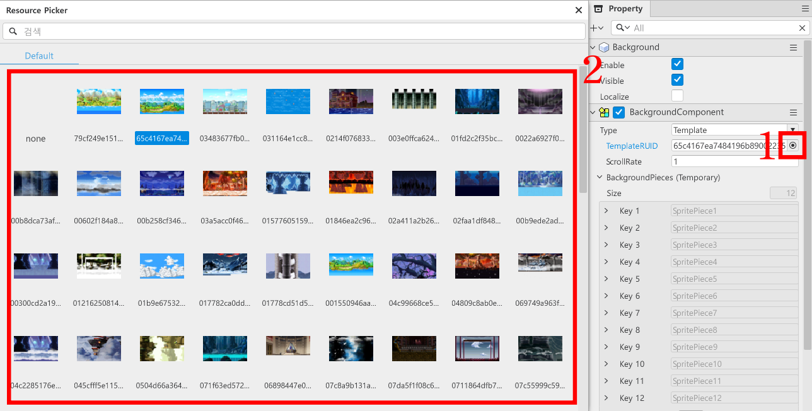

- If you want to use a different background, find BackgroundComponent in the Property window.
- Click on the Resource Picker button under TemplateRUID.
- Look for the background of choice and click on it to change the background.

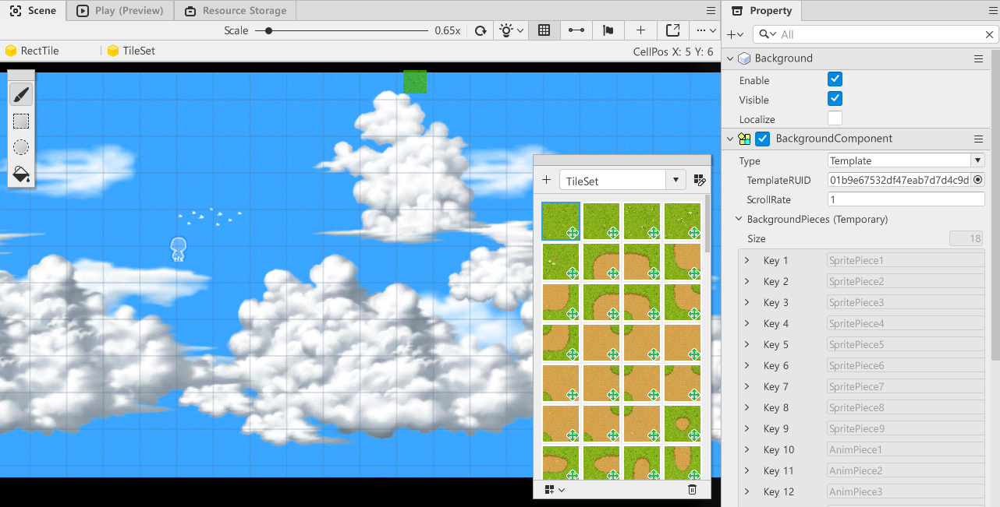

- If the change went through, the Scene screen will show the newly-applied background.
 

## Minimum Implementation Standards
- Create a map for a shooting world for proper use.
    - You need to categorize areas with mobility and areas without mobility by using TileSet.
 

## Usage and Extension Direction
- When using resources provided by MapleStory Worlds, you will create your own resources, followed by a TileSet using those resources.
- Use the created TileSet to use a created map that can be used instead of a MapleStory Worlds resource.
- Learn about CameraComponent to find a way to fix the POV, so it doesn't follow the character.
    - MapleStory Worlds Official Document, Player Camera Control Document [Link](https://maplestoryworlds-creators.nexon.com/ko/docs?postId=72)