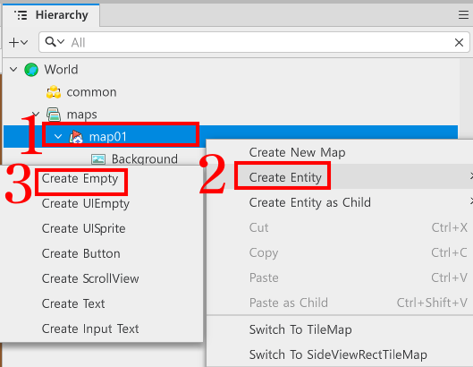
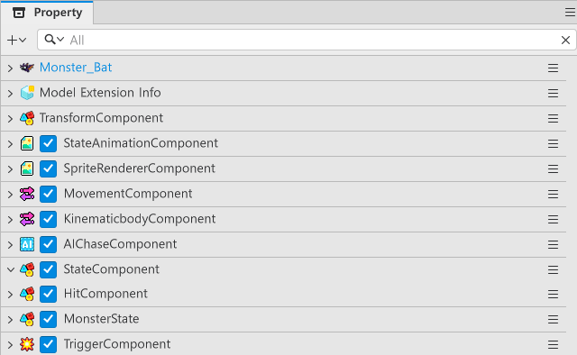
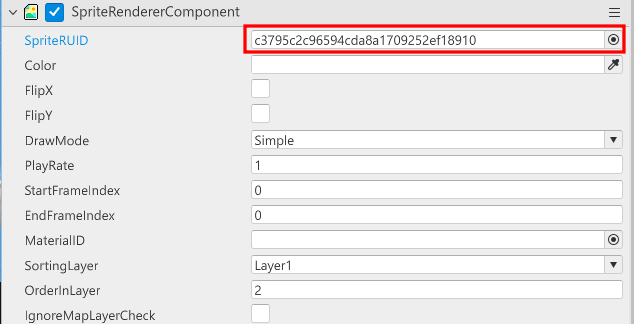
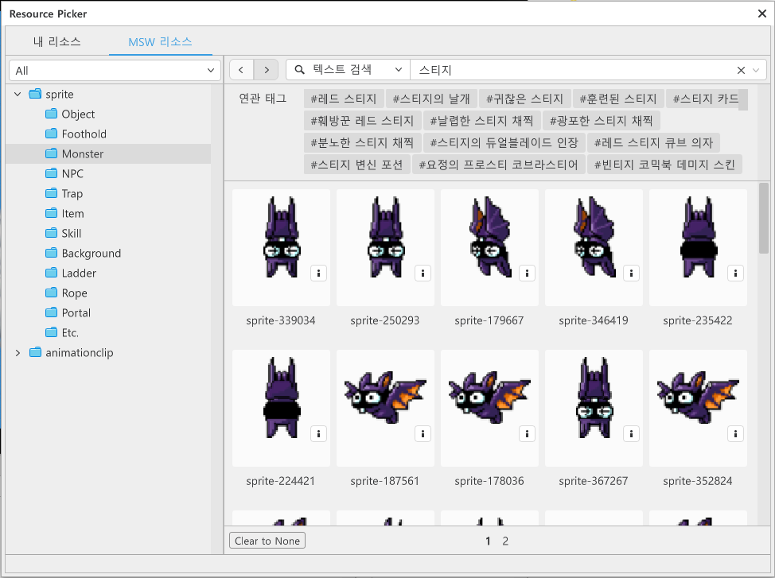
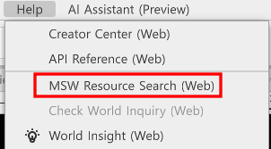
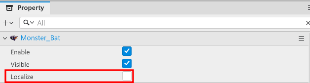
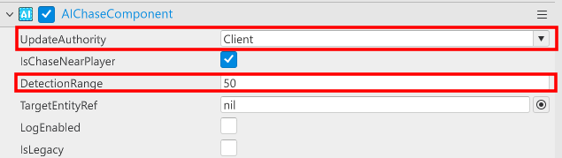
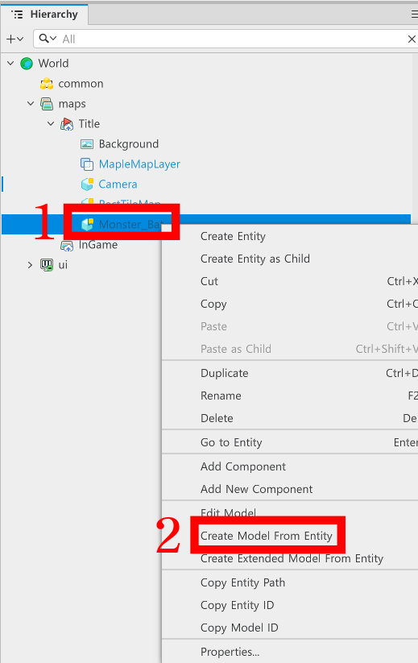
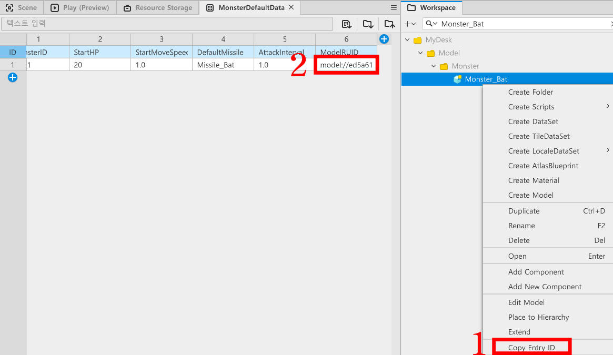

# [💡Basic Training] Creating Monsters
<br>
<br>
<br>

## Video Timeline
- You can follow along by using the timeline under the training video.
- Creating Monsters: `01:21:22`
<br>

## Learning Goals
- Create enemies that are threats to the player to create a sense of tension.
- Create an entity and add Components to compose the enemy.
- Utilize Components provided by MapleStory Worlds and implement a function that makes enemies chase the player.
<br>

## Practical Exercises to Do After Watching the Video
- Create an empty entity and add the needed Components to create a Model.
- Create Monsters of various appearances based on what you need.
- Manage the Monster values from a DataSet and make it so they have different stats.
<br>

## Composing a MonsterDataSet

- Create a DataSet used to save information related to Monsters.
- The name of the DataSet in the sample world is `MonsterDefaultData`.
- If you don't know how to make a DataSet, make one by referencing the PlayerCharacter from the relevant document.
<br>

### Composing Elements of MonsterDefaultData

<table class="tg">
  <thead>
    <tr>
      <th class="tg-c3ow">Name</th>
      <th class="tg-c3ow">Description</th>
    </tr>
  </thead>
  <tbody>
    <tr>
      <td class="tg-lboi">MonsterID</td>
      <td class="tg-lboi">The ID value needed to classify Monsters. You can classify monsters and load data based on this value.</td>
    </tr>
    <tr>
      <td class="tg-lboi">StartHP</td>
      <td class="tg-lboi">The value needed to set the Monster's HP when it is spawned in the game.</td>
    </tr>
    <tr>
      <td class="tg-lboi">StartMoveSpeed</td>
      <td class="tg-lboi">The value needed to set the Monster's default speed when it is spawned in the game.</td>
    </tr>
    <tr>
      <td class="tg-lboi">DefaultMissile</td>
      <td class="tg-lboi">The value needed to set the Monster's default projectile.</td>
    </tr>
    <tr>
      <td class="tg-lboi">AttackInterval</td>
      <td class="tg-lboi">The value needed to set the Monster's attack delay. The smaller the value, the faster the fire speed.</td>
    </tr>
    <tr>
      <td class="tg-lboi">ModelRUID</td>
      <td class="tg-lboi">The value needed to set the created Monster Model's RUID. The Model can be copied based on this value from MonsterSpawnManager in future.</td>
    </tr>
  </tbody>
</table>

<br>

## Composing Monsters Entities

<p align="center">

</p>

- Right-click map01 from Hierarchy.
- Click Create Entity.
- Click Create Empty to create an empty entity as the child entity of map01.
- You can change the name of the created entity.
- The sample world named it `Monster_Bat` to use as an example.

<p align="center">

</p>

- Add the following Components to the created entities.
- **SpriteRendererComponent**: A Component used to output the Monster's image.
- **MovementComponent**: A Component needed for the Monster to move. The AIChaseComponent uses this Component to chase the player.
- **KinematicBodyComponent**: Makes it so that the monster can move in a RectTileMap. Change the Monster's EnableTileCollision value to false, so there aren't any areas that limit its movement.
- **AIChaseComponent**: A Component provided by MapleStory Worlds. Entities with this Component can chase the player.
- **HitComponent**: A Component needed for damage calculations when hit by a projectile.
- **MonsterState**: A Component that needs to be created directly. This Component contains Monster data or manages functions like attacks or death similar to PlayerState.
- **TriggerComponent**: A Component that sets a Monster's collision area. Set the Monster's collision area with this Component and check the collision status of projectiles or skills.
<br>

## Changing Monster Images
- Change and apply the SpriteRUID under SpriteRendererComponent to change a monster's image.

<p align="center">

</p>

- Change the SpriteRUID value to change a monster's image.
- Use Resource Picker on the right to search and use other images.

<p align="center">

</p>

- Use resources provided by MapleStory Worlds by searching resources in the Resource Picker.

<p align="center">

</p>

- If using the Resource Picker is too difficult, search for resources through Help on the top of the editor.

## Composing a Monster that Chases the Player
- The following elements must be applied to make the monster chase the player.

<p align="center">

</p>
- Localize must be activated from Property.
    - The sample world is built based on the fact that it is client-driven. So Localize must be checked to ensure the Entity can function in local.

<p align="center">

</p>

- Change the UpdateAuthority under AIChaseComponent to Client.
    - If this value is Server, the monster may not chase the player as intended in the sample world that is client-driven.
- Increase the DetectionRange value as needed to increase the enemy's player detection range.


## Composing a MonsterState Component

- Write the code of the MonsterState Component that was added to the Model.
- The Monster can now search for MonsterDefaultData and receive the value through this code.
- Write the following code.
- This code is written based on Plain Text.

```lua
@Component
script MonsterState extends Component

property number currentHP = 0 -- Property that manages the monster's current HP.

property number attackInterval = 0 -- Property that saves the monster's attack delay.

property boolean isAlive = true -- Property that checks the monster's survival.

property string defaultMissile = "" -- Property that saves the ID of the projectile fired by a monster.

property ProjectileManager projectileManager = nil

property Vector2 firePos = Vector2(0,0) -- Property that sets the position where the projectile is being fired from.

property number deltaTimer = 0 -- Property that calculates the monster's missile fire delay.

property number itemDropRate = 0 --Property that calculates the item drop rate when a monster is defeated.

property string mustDropItemValue = "" -- Property that determines which item is dropped if the monster must drop an item.

@ExecSpace("Client")
method void InitData(table MonsterData, number ItemDropRate, string MustDropItem)
-- Determines whether the received MonsterData is nil.
if MonsterData == nil or next(MonsterData) == nil then
	log("The received table MonsterData is nil!")
	return
end

-- Determines whether the required elements from the received MonsterData have normal values.
if MonsterData.StartHP == nil or MonsterData.DefaultMissile == nil  or MonsterData.DefaultMissile == "" then
	log("The monster's starting HP and missile type aren't set!")
end
self:FindProjectileManager()


-- Starts reset if the required values are included.
-- Resets the monster's current HP to the max HP upon starting.
self.currentHP = MonsterData.StartHP
-- Resets the monster's starting projectile ID.
self.defaultMissile = MonsterData.DefaultMissile
-- Sets the monster's attack delay. If the loaded value is nil, then resets it to 1.0 second.
self.attackInterval = MonsterData.AttackInterval or 1.0
-- Resets the monster's survival state to true.
self.isAlive = true
-- Resets the item's drop rate.
self.itemDropRate = ItemDropRate
-- Resets the target value if there is an item that must be dropped.
self.mustDropItemValue = MustDropItem
-- Resets the monster's speed.
self.Entity.MovementComponent.InputSpeed = MonsterData.StartMoveSpeed
end

method void ShowMonster()
-- Changes the monster's Enable state to true.
self.Entity.Enable = true
end

@ExecSpace("ClientOnly")
method void OnUpdate(number delta)
-- Immediately exits the code if the game's state isn't set to Play. 
if not _GameLogic.IsStillPlay then
	self.Entity.MovementComponent.Enable = false
	return
end
-- Starts processing if the monster is currently alive and the game's state is set to Play.
if self.isAlive and _GameLogic.IsStillPlay then
	-- Activates a monster's MovementComponent if it was previously inactive.
	if self.Entity.MovementComponent.Enable == false then
		self.Entity.MovementComponent.Enable = true
	end
	-- Adds the flow of time equal to delta to the deltaTimer.
	self.deltaTimer = self.deltaTimer + delta
	-- Fires the projectile and resets the deltaTimer to 0 if the deltaTimer is larger than the attack delay.
	if self.deltaTimer >= self.attackInterval then
		self:FireMissile()
		self.deltaTimer = 0
	end
end
end

@ExecSpace("Client")
method void FindProjectileManager()
    -- Searches for a MissileManager entity that exists in the InGame map.
	local currentMap = self.Entity.CurrentMapName
    local poolEntity = _EntityService:GetEntityByPath("/maps/"..currentMap.."/ProjectileManager")
    -- Resets the missileManager to poolEntity if the poolEntity was found.
    if isvalid(poolEntity) then
        self.projectileManager = poolEntity.ProjectileManager
        self.isAlive  = true
    else
	-- Generates an error log if the ProjectileManager couldn't be found in InGame.
        log("Error: ProjectileManager couldn't be found in the InGame map.")
    end
end

@ExecSpace("Client")
method void FireMissile()
-- Halts code execution if there is no projectileManager.
if self.projectileManager == nil then return end

-- Determines whether the projectileManager is nil and whether the default projectile has been registered.
if self.projectileManager == nil or self.defaultMissile == nil or self.defaultMissile == "" then
	-- Leaves an error log if either one doesn't meet the conditions.
	log("Failed to reset player MissileData!")
end

-- Loads usable defaultMissile entities from ProjectileManager.
local missileEntity = self.projectileManager:GetMissile(self.defaultMissile)
    
-- Executes code when the entity received from projectileManager is usable.
if isvalid(missileEntity) then
-- Loads the MissileComponent from the received entity.
local missileComp = missileEntity.MissileComponent
	if missileComp then
		-- Determines the missile's launch direction.
		local fireDir = 1
		-- Since the default resource is facing left, if the entity's FlipX is inactive, it will be set to fly to the left.
		if self.Entity.SpriteRendererComponent.FlipX == false then
			fireDir = -1
		end
		-- Loads the current monster's position.
		local monsterPos = self.Entity.TransformComponent.Position
		-- Delivers the monster's current position to the projectile.
		local firePos = Vector3(monsterPos.x, monsterPos.y, 0)
		-- Commands the projectile to be fired.
    	missileComp:FireMissile(Vector2(fireDir, 0), false, firePos)
	end
end
end

@ExecSpace("Client")
method void SendCalcDropItem()
-- Delivers to ItemHelper, so the item drop state can be calculated when a monster dies.
_ItemHelper:CalcDropItemData(self.itemDropRate, self.mustDropItemValue, self.Entity.TransformComponent.Position)
end

@ExecSpace("ClientOnly")
@EventSender("Self")
handler HandleHitEvent(HitEvent event)
-- Code isn't executed when the monster is in the dead state.
if not self.isAlive then
	return
end
-- Loads the collided missile entity.
local attackerEntity = event.AttackerEntity
-- Loads the damage delivered by the missile.
local totalDamage = event.TotalDamage
-- Registers the effect output position to display the hit effect.
local effectSpawnPos = Vector3(attackerEntity.TransformComponent.Position.x, attackerEntity.TransformComponent.Position.y, 0)
-- Proceeds with damage calculation.
self.currentHP = self.currentHP - totalDamage
-- Displays the hit effect if a hit is registered.
_EffectService:PlayEffect(event.Extra, self.Entity, effectSpawnPos, 0, Vector3(0.5, 0.5, 0.5))
-- Plays the hit taken sound. A different sound can be played by changing the first value in the parameter.
_SoundService:PlaySound("5873f227d7604a63997546a92824c135", 1.0)
-- Proceeds with death processing if HP is reduced to 0.
if self.currentHP <= 0 then
	-- Converts survival state to false.
	self.isAlive = false
	-- Executes if an item is dropped, since a monster died.
	self:SendCalcDropItem()
	-- Displays the effect that plays on death. A different effect can be displayed upon death by changing the first value in the parameter.
	_EffectService:PlayEffect("f67f25d5f8e14d2c9962be0fa42808f7", self.Entity, effectSpawnPos, 0, Vector3(0.5, 0.5, 0.5))
	-- Checks the condition fulfilment state by delivering the monster defeat status to Gamelogic.
	_GameLogic:CountKillScore()
	-- Destroys itself to eliminate an entity.
	_EntityService:Destroy(self.Entity)
end
end

end
```
<br>

## Modelization of Created Entities

<p align="center">

</p>

- Turn a created entity into a Model and add to WorkSpace.
- Right-click the entity that will become a Model and click `Create Model From Entity` to create a model.

## Add Model ID to a DataSet

<p align="center">

</p>

- Right-click the Model that was created in WorkSpace.
- Click Copy Entry ID to copy the ID value of the target model.
- Adds the target value to the MonsterDefaultData's ModelRUID.
<br>

### What is the Role of ModelRUID?

- The ModelRUID's role is to find the Model in WorkSpace and then copy that Model.
- Used to create a MonsterSpawnManager for the advanced training topic of implementing items.
- Learn how to copy Models with the ModelRUID value to summon various Monsters or copy other Models as needed.
<br>

## Minimum Implementation Standards
- A Model that composes the Monster must be created.
- The created Monster Model must chase the player.
<br>

## Usage and Extension Direction
- Create Monster Models with various forms and values to provide a variety of Monsters.
- Implement Monster movement without the use of AIChase.
- Create monster movement patterns by implementing movement methods for each Monster.