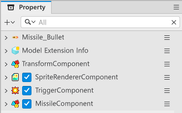
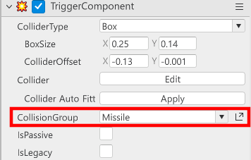
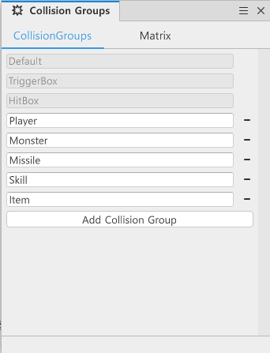

# [💡Basic Training] Creating Basic Attacks
<br>
<br>
<br>

## Video Timeline
- You can follow along by using the timeline under the training video.
- Creating Basic Attacks: `01:42:04`
<br>

## Learning Goals
- Use the TriggerComponent to learn about the Collision Group, which sets collision groups.
- Understand the Matrix that determines the collision relationship between Collision Groups and how to set them.
<br>

## Practical Exercises to Do After Watching the Video
- Learn about the Matrix for the TriggerComponent's Collision Group.
- Create your own Collision Group and proceed with the practical application of creating relationships using the Matrix.
<br>

## Composing Projectile Entities

- Create an empty entity in Hierarchy and compose the Components like the following.

<p align="center">

</p>

- **SpriteRendererComponent**: A Component used to output the projectile's image. Set and use an image of your choice for the projectile.
- **TriggerComponent**: A Component used to set the projectile's collisions.
- **MissileComponent**: A Component used to control the projectile's data and actions.
<br>

## Writing a MissileComponent Script
- Write the following script.
- This script is written based on Plain Text.

```lua
@Component
script MissileComponent extends Component

property number moveSpeed = 0 -- Property that saves the projectile's speed.

property number atkValue = 0 -- Property that saves the projectile's attack power.

property number lifeTime = 0 -- Property that saves the projectile's duration.

property boolean isShotPlayer = false -- Property that classifies the projectile's launching entity.

property string hitEffectRUID = "" -- Property that saves the effect that plays when the projectile lands.

property Vector2 fireDirection = Vector2(0,0) -- Property that saves the projectile's firing direction.

property number deltaTimer = 0 -- Property that calculates when the projectile was created.

property string missileID = "" -- Property that saves the current projectile's ID.

property any poolManager = nil

@ExecSpace("ClientOnly")
method void InitData(table MissileData)
-- Generates an error log and exits the code if the received MissileData is an unusable value.
if MissileData == nil or next(MissileData) == nil then
	log("MissileData is empty.")
	return
end

-- Saves the ID of the projectile from the received data.
self.missileID = MissileData.MissileID
-- Saves the attack power of the projectile from the received data.
self.atkValue = MissileData.AtkValue
-- Saves the speed of the projectile from the received data.
self.moveSpeed = MissileData.MoveSpeed
-- Saves the duration of the projectile from the received data.
self.lifeTime = MissileData.LifeTime
-- Saves the effect ID that will play when the projectile from the received data collides with a target.
self.hitEffectRUID = MissileData.HitEffectRUID 
end

@ExecSpace("ClientOnly")
method void OnUpdate(number delta)
-- Immediately exits the code if the entity is unusable.
if self.Entity.Enable == false then
	return
end
-- Immediately exits if the game's play state isn't in-play.
if not _GameLogic.IsStillPlay then
	return
end

-- Fetches the projectile's current position.
local transform = self.Entity.TransformComponent
-- Calculates the speed and the distance that must be traveled over the duration.
local moveVec = Vector3(self.fireDirection.x, self.fireDirection.y, 0) * self.moveSpeed * delta
-- Moves the projectile's current position up to the distance it must travel.
transform.Position = transform.Position + moveVec
    
-- Adds time equal to delta to the deltaTimer.
self.deltaTimer = self.deltaTimer + delta
-- Returns the projectile if the deltaTimer is larger than lifeTime.
if self.deltaTimer >= self.lifeTime then
	self:ReturnSelf()
end
end

@ExecSpace("ClientOnly")
method void ReturnSelf()
    -- Returns the projectile to ProjectileManager.
    if self.poolManager and isvalid(self.poolManager) then
        self.poolManager:ReturnMissile(self.Entity)
    else
		-- Destroys the projectile if the poolManager is nil.
        _EntityService:Destroy(self.Entity)
    end
end

@ExecSpace("Client")
method void FireMissile(Vector2 FireDirection, boolean IsShotPlayer, Vector3 FireStartPos)
-- Resets the deltaTimer to 0.
self.deltaTimer = 0 
-- Resets the projectile's launch redirection.
self.fireDirection = FireDirection
-- Resets the projectile's launch direction. If the player is the launching entity, it's saved as true.
self.isShotPlayer = IsShotPlayer
-- Changes the projectile's current position to the launch position.
self.Entity.TransformComponent.Position = FireStartPos
-- Converts the projectile's use state to true.
self.Entity.Enable = true
end

@ExecSpace("ClientOnly")
@EventSender("Self")
handler HandleTriggerEnterEvent(TriggerEnterEvent event)
-- Fetches the entity that has a detected collision.    
local trigger = event.TriggerBodyEntity
-- Resets hitSuccess to false to save the collidable status.
local hitSuccess = false
-- Proceeds with processing if the player-fired missile collides with the monster.
if isvalid(trigger.MonsterState) and self.isShotPlayer then
	-- Requests a damage calculation if the entity collided has a HitComponent and is still alive.
	if trigger.HitComponent and trigger.MonsterState.isAlive then
		trigger.HitComponent:OnHit(self.Entity, self.atkValue, false, self.hitEffectRUID, 1)
		hitSuccess = true
    end
        
-- Proceeds with processing if the player is hit by a missile fired by a monster.
elseif isvalid(trigger.PlayerState) and self.isShotPlayer == false then
    -- Determines whether the player has a HitComponent, whether it's alive, and whether it's currently invulnerable.
	if trigger.HitComponent and trigger.PlayerState.isAlive and not trigger.PlayerState.isInvincibility then
		-- Calls OnHit and requests damage calculation if damage can be taken.
		trigger.HitComponent:OnHit(self.Entity, self.atkValue, false, self.hitEffectRUID, 1)
		hitSuccess = true
    end
end

-- Deactivates the entity again if the damage calculation took place.
if hitSuccess then
	self:ReturnSelf()
end
end

end
```
<br>

## Setting a TriggerComponent

- Change the components of a TriggerComponent to change the collision relationship between Collision Groups.

<p align="center">

</p>

- Find the TriggerComponent of the created entity and click the Open Panel button on the right of CollisionGroup.

<p align="center">

</p>

- Click Add Collision Group from the Collision Groups window and add CollisionGroup.
    - **Player**: A Collision Group used to designate the player.
    - **Monster**: A Collision Group used to designate enemies.
    - **Missile**: A Collision Group used to designate projectiles.
    - **Skill**: A Collision Group used to designate skills.
    - **Item**: A Collision Group used to give benefits to the player.
- Complete the settings above and move to Matrix.

<p align="center">

</p>

- Set the Matrix like the above image.
- This Matrix sets the following collision relationship.
    - Player checks the collisions with Monster, Missile, and Item.
    - Monster checks the collisions with Player, Missile, and Skill.
    - Missile checks the collisions with Player, Monster, and Skill.
    - Skill checks the collisions with Monster and Missile.
    - Item checks the collisions with Player.

## Why a Matrix Should Be Set Up
- Collision calculations are one of the more frequent elements that are checked.
- Adding unnecessary CollisionGroups and checking the collisions of all CollisionGroups will increase the amount of unnecessary calculations.
- To optimize performance, you need re-remove unnecessary collision checks and only check those required for higher efficiency.
<br>

## Minimum Implementation Standards
Create a projectile Model to have at least 3 types of usable projectiles.
- The projectile data must be input normally through the projectile's InitData.
- When firing a projectile with a value that was input with InitData using FireMissile, the projectile must be fired normally.
- The projectile must disappear after colliding with the Monster.
<br>

## Usage and Extension Direction
- Create a pattern by adding various movements to a projectile.
- Create a new character using various projectiles.
- Create patterns by differentiating the projectiles fired by each enemy.