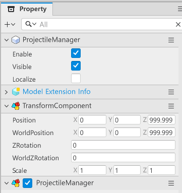

# [💡Basic Training] Creating an Object Pool
<br>
<br>
<br>

## Video Timeline
- You can follow along by using the timeline under the training video.
- Creating an Object Pool: `02:02:03`
<br>

## Learning Goals
- Learn about the principle behind an object pool.
- Manage and use projectiles using the object pool.
- Learn further optimization methods by managing memory usage through the object pool.
<br>

## Practical Exercises to Do After Watching the Video
- See for yourself the how the principles of an object pool functions and the results of the execution.
- Think about which elements can be utilized with object pools using this method.
- Design a structure that can manage those elements using the object pool method.
<br>

## What is an Object Pool?
- Many entities exist when executing the game.
- Of these entities, some units like monsters may die and disappear.
- If there are a high number of units, creating and eliminating all of those units may overload the computer's calculations.
- However, if the activation is removed instead of creating and eliminating entities, it can lower the load on your computer.
- This is because it only needs to be set as On or Off like a switch.
- The object pool can make usable entities in advance and deliver them to minimize the need to create and eliminate unnecessary entities.
<br>

## Creating an Object Pool
- Entities must be created in the Map to create an object pool.
- The ProjectileManager is used as an object pool that manages projectiles in the InGame map for the sample world.
- The object pool is made up of the following Components.

<p align="center">

</p>

- **TransformComponent**: A Component that is provided by default. However the Position value must be set to **0** so that it can be created in the correct position.
- **ProjectileManager**: A Component that was added to create an object pool. This Component must be created directly through New Component.
<br>

## Setting a ProjectileManager Component

- Write the following code.
- The target code is based on Plain Text.

```lua
@Component
script ProjectileManager extends Component

property table projectilePool = {} -- A table that contains the projectile entity.

@ExecSpace("ClientOnly")
method Entity GetMissile(string MissileKey)
-- Attempts a reset if there are no elements that use MissileKey as a Key value.
if self.projectilePool[MissileKey] == nil then
	self.projectilePool[MissileKey] = {}
end

-- Registers elements that use MissileKey from projectilePool as a Key to the Pool.
local pool = self.projectilePool[MissileKey]
-- Registers the entity to nil to register a usable entity.
local entity = nil

-- Starts a navigation if there are no elements from the pool.
if #pool > 0 then
	-- Navigates elements in the pool.
	for i = 1, #pool do
		-- Returns the target entity if the index i entity exists and if the current use state is false.
		if isvalid(pool[i]) and not pool[i].Enable then
			entity = pool[i]
			break
		end
	end
end

-- Attempts creation, since if the entity is still nill, the usable entity doesn't exist.
if entity == nil then
	-- Requests projectile data from the DataTableLogic based on the MissieKey value.
	local missileData = _DataTableLogic:GetMissileDataByMissileID(MissileKey)
	-- Creates a projectile through SpawnService.
    entity = _SpawnService:SpawnByModelId(missileData.ModelRUID, missileData.MissileID, Vector3.zero, self.Entity)
	-- Registers projectile data to the created projectile.
	entity.MissileComponent:InitData(missileData)
	-- Registers itself to the projectile's poolManager.
	entity.MissileComponent.poolManager = self
	-- Changes the projectile usage state to true.
	entity.Enable = true
	-- Registers the entity created to projectilePool.
	table.insert(self.projectilePool[MissileKey], entity)
else
    -- Changes the found entity's usage state to true, since there is a usable entity.
    entity.Enable = true
end
-- Returns the found or created entity.
return entity
end

@ExecSpace("ClientOnly")
method void ReturnMissile(Entity missile)
-- Immediately exits the code if the received entity is unusable.
if not isvalid(missile) then return end
-- Returns the received entity's usable state as false.
missile.Enable = false
end

@ExecSpace("Client")
method void ResetPool()
-- Searches for a child entity based on its own entity.
local childList = self.Entity.Children
-- Returns if there is no child entity.
if childList == nil then return end
-- Iterates the found child entity list and changes the entity's Enable to false.
for i, child in pairs(childList) do
	if isvalid(child) then
		child.Enable = false
	end
end
end

@ExecSpace("Client")
method Entity GetProjectileSkill(string SkillKey)
-- Attempts a reset if there is no Value with SkillKey from projectilePool.
if self.projectilePool[SkillKey] == nil then
	self.projectilePool[SkillKey] = {}
end

-- Registers elements that have SkillKey as a key to the pool.
local pool = self.projectilePool[SkillKey]
-- Registers the entity to nil for returns.
local entity = nil

-- Starts a navigation if there are no elements from the pool.
if #pool > 0 then
	-- Navigates elements in the pool.
	for i = 1, #pool do
		-- Returns the target entity if the index i entity exists and if the current use state is false.
		if isvalid(pool[i]) and not pool[i].Enable then
			entity = pool[i]
			break
		end
	end
end

-- Newly creates an entity if there is no usable skill projectile entity in the pool.
if entity == nil then
	-- Requests data from DataTableLogic based on SkillKey.
	local skillData = _DataTableLogic:GetSkillDataBySkillID(SkillKey)
	-- Requests a projectile skill model be created through SpawnService.
    entity = _SpawnService:SpawnByModelId(skillData.ModelRUID, skillData.SkillID, Vector3.zero, self.Entity)
	-- Requests projectile skill data entry.
	entity.ProjectileSkillComponent:InitData(skillData)
	-- Registers the entity created to projectilePool.
	table.insert(self.projectilePool[SkillKey], entity)
end
-- Changes the usage state of a entity that will be returned to true.
entity.Enable = true
-- Returns a found or created entity.
return entity
end

end
```

- The previously created PlayerState and Monster State refer to the ProjectileManager.
- The PlayerState is searched with ConnectMissilePool, and the MonsterState is searched with FindProjectileManager.
- Through this, the Player and Monster can fire projectiles with the object pool.
<br>

## Minimum Implementation Standards
- Implements the function so that projectile entities aren't repeatedly created and destroyed by using the object pool.
- Neither the player nor Monster makes projectile creation requests.
- All projectiles are implemented in the form of creating or returning usable entities from the object pool.
<br>

## Usage and Extension Direction
- Edit the code so that entities are **created in advance** and used as one of the principles of an object pool.
- Check if the projectiles are usable as intended based on the edited code.
- Implement the function so that the object pool only created **necessary entities** in advance.