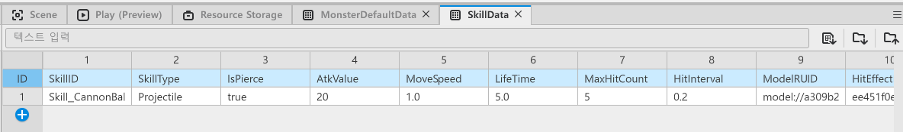
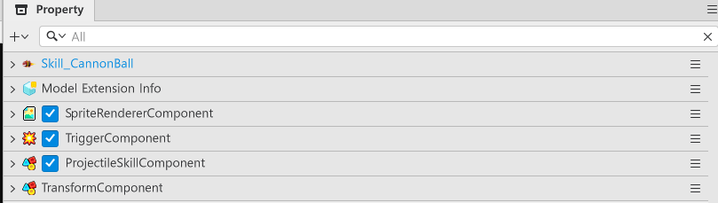

# [📖Advanced Training] Implementing Skills
<br>
<br>
<br>

## Video Timeline
- You can follow along by using the timeline under the training video.
- Creating Skills: `02:11:47`
<br>

## Learning Goals
- Learn about TriggerEvent types.
- Understand the trigger conditions for each event and create the functions required.
- Understand what the risks are when using the Stay TriggerEvent and which situations require the use of that Event.
<br>

## Practical Exercises to Do After Watching the Video
- Create a skill Model.
- Change a projectile-type skill provided in the video into a different type.
- Adjust SkillData to adjust and change the skill's functionality.
- Create one more projectile-type skill and change the player character's skill.
<br>

## Creating a DataSet
- Skills also need a DataSet to manage their data.
- The sample world has the following created DataSet.

<p align="center">

</p>

<table class="tg">
  <thead>
    <tr>
      <th class="tg-c3ow">Name</th>
      <th class="tg-c3ow">Description</th>
    </tr>
  </thead>
  <tbody>
    <tr>
      <td class="tg-lboi">SkillID</td>
      <td class="tg-lboi">The ID value needed to classify skills. The player's skills can be designated based on this value.</td>
    </tr>
    <tr>
      <td class="tg-lboi">SkillType</td>
      <td class="tg-lboi">The value needed to classify skill types. The sample world only created the projectile type, but the value was created with the possibility of other skill types being made in the future.</td>
    </tr>
    <tr>
      <td class="tg-lboi">IsPierce</td>
      <td class="tg-lboi">The value that determines the penetrative status of a projectile skill. This value was created so that the projectile skill disappears even after it collides with 1 enemy, even if the value is false.</td>
    </tr>
    <tr>
      <td class="tg-lboi">AtkValue</td>
      <td class="tg-lboi">The value that determines the skill's attack power.</td>
    </tr>
    <tr>
      <td class="tg-lboi">MoveSpeed</td>
      <td class="tg-lboi">The value that determines the projectile skill's speed.</td>
    </tr>
    <tr>
      <td class="tg-lboi">LifeTime</td>
      <td class="tg-lboi">The value that determines the projectile skill's duration.</td>
    </tr>
    <tr>
      <td class="tg-lboi">MaxHitCount</td>
      <td class="tg-lboi">The value that determines the number of hits for multi-hit-type skills.</td>
    </tr>
    <tr>
      <td class="tg-lboi">HitInterval</td>
      <td class="tg-lboi">The value that determines the amount of time until the subsequent hit is triggered for multi-hit-type skills.</td>
    </tr>
    <tr>
      <td class="tg-lboi">ModelRUID</td>
      <td class="tg-lboi">The value used to register a skill Model's Entry ID.</td>
    </tr>
    <tr>
      <td class="tg-lboi">HitEffectRUID</td>
      <td class="tg-lboi">The value used to register the RUID of the effect that is displayed when hit by the skill.</td>
    </tr>
  </tbody>
</table>

<br>

## Composing Skill Entities
- Entities must be composed to create a skill Model.
- Compose the following Components for the skill Entity.

<p align="center">

</p>

- **SpriteRendererComponent**: A Component used to output the skill's image.
- **TriggerComponent**: A Component used to check the skill's collision state. The CollisionGroup of the target Component must be set to Skill.
- **ProjectileSkillComponent**: A Component that controls the projectile skill's data and actions. Must be created through Add Component.
<br>

## Composing Scripts
- The `ProjectileSkillComponent` must be composed as follows.
- The following code is written based on Plain Text.

```lua
@Component
script ProjectileSkillComponent extends Component

property table collideTable = {} -- A table that manages entities that are colliding with skill projectiles.

property number atkValue = 0 -- A Property that saves the skill projectile's attack power.

property number hitInterval = 0 -- A Property that adjusts the projectile skill's multi-hit interval.

property number maxHitCount = 0 -- A Property that adjusts the projectile skill's max hit interval.

property boolean isPierce = false -- A Property that determines the projectile skill's penetration state.

property number lifeTime = 0 -- A Property that determines a projectile skill's duration.

property number moveSpeed = 0 -- A Property that determines the projectile skill's speed.

property string hitEffectRUID = "" -- A Property that saves the effect ID that will be displayed when hit by a projectile skill.

property number deltaTimer = 0 -- A Property needed for calculating the projectile skill's duration.

property Vector2 fireDirection = Vector2(0,0) -- A Property that saves which direction the projectile should travel in.

@ExecSpace("Client")
method void InitData(table SkillData)
-- Determines whether the received skill data is valid.
if not isvalid(SkillData) or next(SkillData) == nil then
	log("The received SkillData is nil!")
	return
end
-- Resets skill data.
-- Resets the deltaTimer that checks the projectile skill's lifespan.
self.deltaTimer = 0 
-- Resets the table that contains the collided monsters.
self.collideTable = {} 
-- Resets the skill's attack power value.
self.atkValue = SkillData.AtkValue 
-- Resets the skill's attack delay value.
self.hitInterval = SkillData.HitInterval
 -- Resets the skill's max attack count.
self.maxHitCount = SkillData.MaxHitCount
 -- Resets the skill's duration.
self.lifeTime = SkillData.LifeTime 
-- Resets the skill's speed.
self.moveSpeed = SkillData.MoveSpeed
 -- Determines whether the skill can penetrate the target.
self.isPierce = SkillData.IsPierce 
-- Resets the RUID of the effect that will be displayed when hit by the skill.
self.hitEffectRUID = SkillData.HitEffectRUID 
-- Deactivates the projectile skill's usage first.
self.Entity.Enable = false
end

@ExecSpace("Client")
method table GetOrCreateCollideEntity(Entity CollideEntity)
-- Executes the following code if the CollideEntity is usable.
if isvalid(CollideEntity) then
	-- Loads the CodeEntity's ID.
	local entityID = CollideEntity.Id
	-- Newly registers to collideTable if there are no entities that have ID values in the collideTable.
	if not isvalid(self.collideTable[entityID]) or not next(self.collideTable[entityID]) then
		self.collideTable[entityID] = {
			Target = CollideEntity,
			HitCount = 0,
			LastHitTime = nil
		}
	end
	-- Returns entities that have ID from CollideEntity.
	return self.collideTable[entityID]
end
end

@ExecSpace("Client")
method void ApplyDamage(table CheckData)
-- Changes the target ID's Table Value to nil if there are no entities due to being already dead.
if not isvalid(CheckData.Target) then
	self.collideTable[CheckData.Target.Id] = nil
	return
end

-- Proceeds with damage calculation to the component after checking the target's MonsterState component status.
if isvalid(CheckData.Target.MonsterState) then
	CheckData.Target.HitComponent:OnHit(self.Entity, self.atkValue, false, self.hitEffectRUID, 1)
end

-- Registers the last hit time.
CheckData.LastHitTime = _UtilLogic.ElapsedSeconds
-- Increases the damage count that the target entity can take by 1.
CheckData.HitCount = CheckData.HitCount + 1
end

@ExecSpace("ClientOnly")
method void OnUpdate(number delta)
- Halts the following code if the game's Play state is false.
if not _GameLogic.IsStillPlay then
	return
end
-- Directs the projectile skill to move.
self:Move(delta)
-- Requests the calculation of the projectile's duration.
self:RunLifeTimer(delta)

end

@ExecSpace("Client")
method void RunLifeTimer(number DeltaTime)
-- Increases the projectile skill's deltaTimer by DeltaTime.
self.deltaTimer = self.deltaTimer + DeltaTime
-- Deactivates usage if the deltaTimer goes over lifeTime.
if self.deltaTimer >= self.lifeTime then
	self.Entity.Enable = false
end

end

@ExecSpace("Client")
method void Move(number DeltaTime)
-- Loads the entity's current position.
local transform = self.Entity.TransformComponent
-- Calculates the projectile skill's position by adding the speed and DeltaTime.
local moveVec = Vector3(self.fireDirection.x, self.fireDirection.y, 0) * self.moveSpeed * DeltaTime
-- Changes the projectile skill's position.
transform.Position = transform.Position + moveVec
end

@ExecSpace("Client")
method void FireSkill(Vector2 FireDirection, Vector3 FireStartPos)
-- Resets the deltaTimer value that's needed to calculate a projectile skill's duration to 0.
self.deltaTimer = 0
-- Resets the projectile skill's launch direction.
self.fireDirection = FireDirection
-- Resets the projectile skill's launch position.
local transform = self.Entity.TransformComponent  
if transform then
	transform.Position = FireStartPos
end
-- Converts the projectile's usage to true.
self.Entity.Enable = true
end

@EventSender("Self")
handler HandleTriggerStayEvent(TriggerStayEvent event)
-- Determines whether the colliding Entity exists normally.
if isvalid(event.TriggerBodyEntity) then
	-- Deletes the enemy projectile if the colliding Entity is a projectile.
	if isvalid(event.TriggerBodyEntity.MissileComponent) and not event.TriggerBodyEntity.MissileComponent.isShotPlayer then
		event.TriggerBodyEntity.MissileComponent:ReturnSelf()
		return
	end
	-- Proceeds with damage calculation as long as the hit count is satisfied when the colliding entity is an enemy.
	if isvalid(event.TriggerBodyEntity.MonsterState) then
		-- Returns an entity that is the same as the colliding entity in the collideTable.
		local collideTable = self:GetOrCreateCollideEntity(event.TriggerBodyEntity)
		-- Halts code execution if the returned entity is unusable.
		if not isvalid(collideTable) then
			return
		end
		-- Halts code execution if the HitCount goes over the max amount.
		if collideTable.HitCount >= self.maxHitCount then
			return
		end
		-- Loads the current time.
		local currentTime = _UtilLogic.ElapsedSeconds
		-- Immediately applies the damage if damage calculation has never taken place.
		if collideTable.LastHitTime == nil then
			self:ApplyDamage(collideTable)
		-- Attempts damage calculation if the time when the damage was taken is larger than the multi-hit time.
		elseif currentTime - collideTable.LastHitTime >= self.hitInterval then
			self:ApplyDamage(collideTable)
		end
	end
end
end

@EventSender("Self")
handler HandleTriggerEnterEvent(TriggerEnterEvent event)
-- Generates an error log if the event is abnormal.
if not isvalid(event) then
	log("The event is an abnormal event!")
	return
end
-- Deactivates the collided entity if the collided entity has a MissileComponent and if the launching entity isn't the player.
if isvalid(event.TriggerBodyEntity.MissileComponent) and not event.TriggerBodyEntity.MissileComponent.isShotPlayer then 
	event.TriggerBodyEntity.MissileComponent:ReturnSelf()
	return
end
-- Executes the following code if the collided entity has a MonsterState.
if isvalid(event.TriggerBodyEntity.MonsterState) then
	-- Determines whether there is an entity that is the same as the collided entity in the collideTable.
	local findList = self:GetOrCreateCollideEntity(event.TriggerBodyEntity)

	-- Halts code execution if received damage count of the collided entity goes over the max value.
	if findList.HitCount >= self.maxHitCount then return end

	-- Immediately requests damage processing from the collided entity.
	self:ApplyDamage(findList)
end
end

@EventSender("Self")
handler HandleTriggerLeaveEvent(TriggerLeaveEvent event)
-- Halts code execution if an entity that is outside the collision range is in an unusable state.
if not isvalid(event) then 
	return
end
-- Determines whether an entity that is outside the collision range is in the collideTable.
local record = self.collideTable[event.TriggerBodyEntity.Id]
-- For entities that are in collideTable, resets the last hit time and immediately processes damage when it re-enters collision range.
if record then
    record.LastHitTime = nil
end
end

end
```

- If this work is all done, turn the skill entity into a Model and register the Model's EntryID to the SkillData's ModelRUID.
<br>

## Call Timing for the HandleTrigger Event
- **EnterEvent**: Called the moment when 2 or more entities with TriggerComponents have overlapping collision areas.
- **StayEvent**: Called for each frame the collision areas of 2 or more entities with TriggerComponents remain overlapped.
- **LeaveEvent**: Called the moment when 2 or more entities with TriggerComponents with overlapping collision areas separate.
<br>

## Minimum Implementation Standards
- The player can use a skill entity.
- A skill entity can remove an enemy's projectile.
- The projectile skill attacks multiple enemies and can attack enemies based on a set number of times.
<br>

## Usage and Extension Direction
- You can create skill types other than projectile types.
- You can create a projectile skill that fires with varied movement, not just one that travels in a straight line.