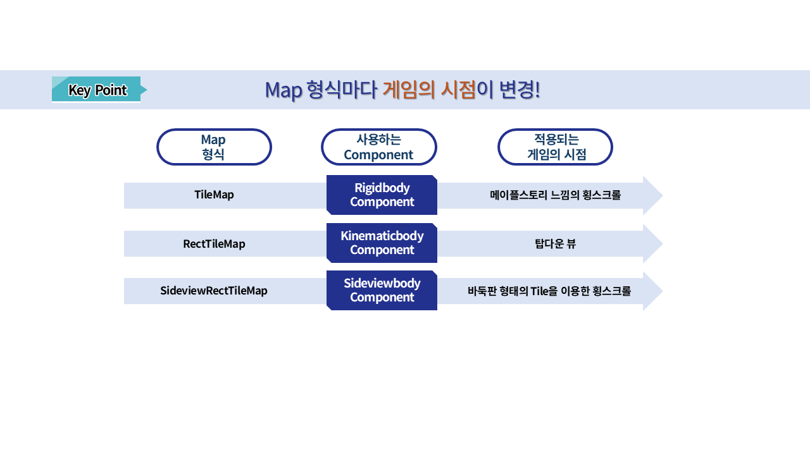

# [💡기초 학습]맵 설정하기
 
 
 

## 영상 타임라인
- 강의 영상내 아래의 타임라인에서 학습할 수 있습니다.
- 맵 타입 이해하기: `00:01:29`
 

## 학습 목표
- 메이플스토리 월드의 맵 방식에 대하여 학습하고, 월드를 제작할 때 자신이 필요한 맵 방식이 무엇인지 선택할 수 있습니다.
- 각 맵 방식에 따라 맵의 발판인 타일들과 상호작용 할 수 있는 컴포넌트가 무엇인지 설명할 수 있습니다.
- RectTileMap과 상호작용을 하기 위한 KinematicBodyComponent에 대하여 학습합니다.
- RectTileMap에 타일을 직접 배치하는 방법에 대하여 학습하고, 맵을 형성할 수 있습니다.
 

## 해당 영상 시청 후 수행해 볼 내용
- 슈팅 월드 제작을 위해 Map의 형식을 RectTileMap으로 변경하기.
- TileSet 제작하기.
- 제작한 TilSet을 활용하여 실제로 상호작용이 가능한 Map 제작하기.
 

## 맵의 종류

 

### TileMap

- 메이플스토리 월드에서 처음으로 월드를 생성하면 기본 지정되는 맵 형식입니다.
- 메이플스토리의 느낌을 가장 잘 살릴 수 있는 방식의 월드입니다.
- 메이플스토리 월드가 제공하는 Tile을 활용하여 발판을 생성하고, 엔티티를 배치하여 맵을 형성할 수 있습니다.
- 타일의 배치에 따라 경사로를 제작할 수 있습니다.
- 횡 스크롤 형태의 게임을 제작할 때, 메이플스토리의 느낌을 살리고 싶을 때 유용한 맵 방식입니다.
 

### RectTileMap

- 탑다운뷰 형태의 게임을 제작할 때 효과적인 방식의 맵 형식입니다.
- 직접 타일셋을 제작하거나, 메이플스토리 월드에서 제공하는 타일셋 리소스를 활용하여 맵을 형성할 수 있습니다.
- 바둑판 형태로 타일을 배치하여 맵을 형성할 수 있습니다.
- 타일마다 이동 가능과 이동 불가능한 성질을 부여할 수 있습니다.
- TileMap, SideViewRectTileMap 방식과 다르게 4방향, 8방향으로 이동하는 형태의 게임을 제작할 수 있습니다.
 

### SideViewRectTileMap

- 횡 스크롤 방식의 게임을 제작할 때 효과적인 방식의 맵 형식입니다.
- 직접 타일셋을 제작하거나, 메이플스토리 월드에서 제공하는 타일셋 리소스를 활용하여 맵을 형성할 수 있습니다.
- 바둑판 형태로 타일을 배치하여 맵을 형성할 수 있습니다.
- RectTileMap과는 다르게 이동 불가능한 타일셋이 아닐 경우, 캐릭터가 타일을 **통과**합니다.
- 따라서 SideViewRectTileMap으로 맵을 형성 할 경우, 이동 불가능한 타일셋을 **발판으로** 제작해야 합니다.

 

## BodyComponent

- 메이플스토리 월드에서 맵의 발판인 타일들과 상호작용 하기 위해서는 BodyComponent가 필요합니다.
- BodyComponent는 맵의 형식에 따라 다른 BodyComponent를 요구합니다.
- BodyComponent는 크게 3종류의 BodyComponent가 존재합니다.
 

### RigidBodyComponent

- 메이플스토리 월드의 TileMap 방식에서 캐릭터의 물리를 제어합니다.
- 맵이 TileMap인데 RigidBodyComponent가 없으면, 캐릭터가 타일과 상호작용을 할 수 없습니다.
- RigidBodyComponent내에 캐릭터의 점프 제어, 중력 제어 등 다양한 물리 프로퍼티값을 제공합니다.
- 해당 값을 변경하여 물리 방식을 변경할 수 있습니다.
 

### KinematicBodyComponent

- 메이플스토리 월드의 RectTileMap 방식일 때 캐릭터의 물리를 제어합니다.
- 맵이 RectTileMap일 때 KinematicBodyComponent가 없으면, RectTileMap의 타일들과 상호작용이 일어나지 않습니다.
- KinematicBodyComponent에서 캐릭터의 이동 속도, 점프 여부, 그림자 여부 등을 조절할 수 있습니다.
 

### SideViewRectTileMap

- 메이플스토리 월드에서 SideViewRectTileMap 방식을 사용할 경우, 캐릭터의 물리를 제어합니다.
- 해당 컴포넌트가 존재하지 않을 경우, 캐릭터는 맵의 타일들과 상호작용을 할 수 없습니다.
- 캐릭터의 점프 속도, 중력 가속도 등을 조절할 수 있습니다.

 

## 맵 형식 변경하기

- Hierarchy 창에서 변경하려는 맵을 우클릭합니다.
- Switch To RectTileMap, Switch To SideViewRectTileMap중 하나를 클릭합니다.
    - 만약 현재 맵이 TileMap이 아닐 경우, Swith To TileMap이 출력되며, 현재 맵 상태로의 전환이 숨김처리됩니다.
- 슈팅 월드 제작을 위해, Switch To RectTileMap을 클릭하여 맵을 RectTileMap으로 전환합니다.
 

## KinematicBodyComponent 요소 살펴보기

- **SpeedFactor**: 캐릭터의 이동속도를 조절할 수 있는 값입니다. X, Y의 값에 따라 좌우, 또는 상하의 이동속도를 조절할 수 있습니다.
- **EnableJump**: 캐릭터의 점프 허용 여부를 결정할 수 있습니다. 해당 값이 체크가 해제되어 있을 때, 캐릭터가 점프할 수 없습니다.
- **JumpSpeed**: 캐릭터의 점프 속도를 조절할 수 있습니다. 값이 클수록 빠른 속도로 점프하여 더 높이 점프할 수 있습니다.
- **JumpDrag**: 캐릭터의 중력 가속도를 조절할 수 있습니다. 값이 작을수록 중력의 힘이 작아져 캐릭터가 공중에서 천천히 지상으로 복귀합니다.
- **ApplyClimbableRotation**: 캐릭터가 사다리, 밧줄과 같은 요소와 상호작용을 할 경우, 사다리 또는 밧줄의 회전 여부에 맞춰 캐릭터를 회전시킬지 결정하는 값입니다.
- **EnableShadow**: 캐릭터의 그림자 출력 여부를 결정합니다. 해당 값이 해제되어 있을 때, 캐릭터의 그림자 출력을 제거합니다.
- **ShadowColor**: 그림자의 색상을 변경할 수 있습니다.
- **ShadowOffset**:  그림자의 출력 위치를 변경할 수 있습니다.
- **ShadowSize**: 그림자의 크기를 설정할 수 있습니다.
- **ShadowScalingRatio**: 캐릭터가 점프했을 때, 그림자의 축소율을 변경할 수 있습니다. 값이 작을수록 그림자의 축소율이 작아집니다.
- **EnableTileCollision**: 캐릭터가 RectTileMap의 타일중, 이동 불가능한 타일을 **무시**하고 이동할 수 있습니다.
 

## RectTileMap에 타일 배치하기
- 슈팅 월드의 이동 구역을 지정하기 위해 RectTileMap을 배치해야 합니다.
- 만약 처음 RectTileMap으로 변경했다면, 타일을 배치하기 위한 타일셋이 필요합니다.
- 샘플 월드에서는 메이플스토리 월드가 제공하는 리소스를 활용하여 타일셋을 제작하겠습니다.
- 만약 여러분들이 제작하거나 사용하려는 리소스가 이미 있다면, 직접 타일셋을 제작하여 사용할 수 있습니다.
 

### 타일셋 제작하기

- RectTileMap 상태에서 출력되는 타일셋 에디터 화면의 `+`버튼을 클릭합니다.

- Create TileSetFrom Template를 클릭합니다.
- 이후 원하는 리소스를 선택합니다.
    - 샘플 월드에서는 Henesys를 사용하였습니다.
- 만약 타일셋으로 사용하려는 리소스가 따로 있을 경우, Create Empty TileSet을 통해 타일셋을 직접 제작하시면 됩니다.

- Workspace에 추가된 NewTileSet의 이름을 변경하여 타일셋 제작을 마무리합니다.

- 정상적으로 타일셋 제작이 마무리되었다면, 타일셋 에디터 화면에 배치할 수 있는 타일들이 출력됩니다.
 

### 타일의 이동 가능 여부 변경하기

- 타일셋 에디터 화면의 우측에 있는 타일 편집 버튼을 클릭합니다.

- 편집 대상에서 이동 가능 여부를 클릭합니다.
- 이동 불가능한 타일로 변경하려는 타일의 초록색 십자 UI를 클릭하여 붉은색 십자 UI로 변경합니다.

- 정상적으로 변경이 되었다면, 타일 배치 상태에서 붉은색 십자가로 UI가 변경됩니다.
- 해당 타일을 맵에 배치한 뒤, 테스트 플레이를 통해 정상적으로 캐릭터가 이동하지 못하는지 점검합니다.
 

### 배치한 타일 맵에서 가리기

- Hierarchy 창에서 RectTileMap을 찾아 클릭합니다.
- Property 창에서 Visible을 클릭하여 체크 상태를 **해제**합니다.

- Visible이 정상적으로 해제되었다면, Scene 화면에서 타일들이 숨김처리된 화면이 출력됩니다.
 

### 배경 변경하기

- Hierarchy 창에서 Background를 찾아 클릭합니다.
- Property 창에서 BackgroundComponent를 찾습니다.
- Type을 클릭합니다.
- SolidColor에서 Template로 변경합니다.

- 정상적으로 변경이 완료되었다면, Scene 화면에서 단일 색상의 배경이 아닌, 메이플스토리 월드가 제공하는 배경으로 변경됩니다.

- 다른 배경을 사용하고자 할 경우, Property 창에서 BackgroundComponent를 찾습니다.
- TemplateRUID의 Resource Picker 버튼을 클릭합니다.
- 원하는 배경을 찾은 뒤 클릭하여 배경을 변경합니다.

- 정상적으로 변경이 완료되면, Scene 화면의 배경이 변경된 모습을 확인할 수 있습니다.
 

## 최소 구현 기준
- 실제로 사용하기 위한 슈팅 월드의 맵을 제작합니다.
    - TileSet을 활용하여 이동 가능한 구역과 그렇지 않은 구역을 구분해야 합니다.
 

## 응용 및 확장 방향
- 만약 메이플스토리 월드가 제공하는 리소스를 사용 할 경우, 스스로 리소스를 제작한 뒤 자신의 리소스를 활용한 TileSet을 제작합니다.
- 제작한 TileSet을 활용하여 메이플스토리 월드의 리소스가 아닌, 실제 사용 가능한 제작된 맵을 사용할 수 있습니다.
- CameraComponent를 학습하여 시점을 캐릭터에게 따라가지 않도록 고정하는 방법을 찾아서 적용합니다.
    - 메이플스토리 월드 공식 문서, 플레이어 카메라 제어 문서 [링크](https://maplestoryworlds-creators.nexon.com/ko/docs?postId=72)