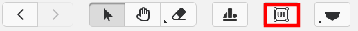
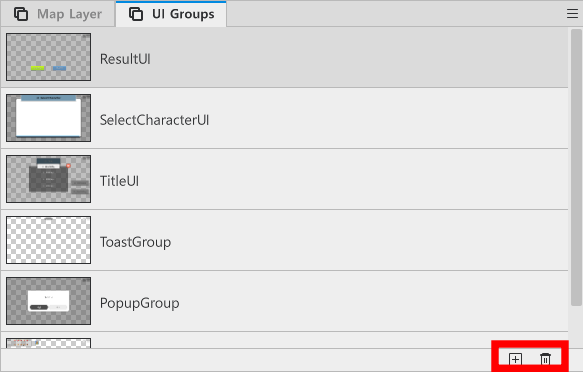
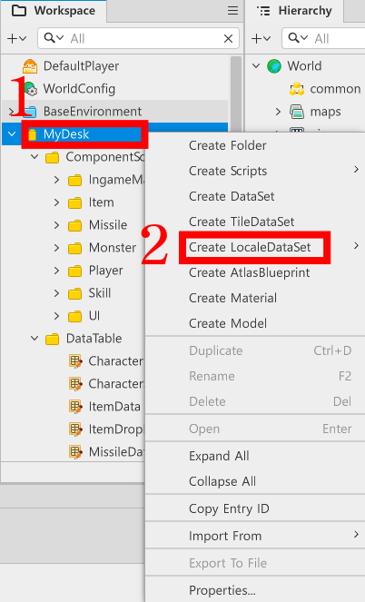
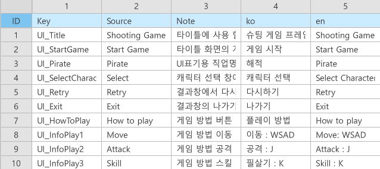
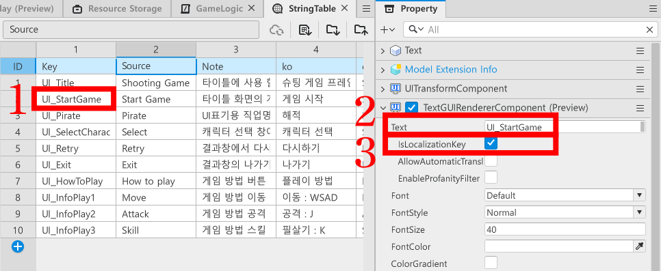

# [💡기초 학습]UI 구성하기
<br>
<br>
<br>

## 영상 타임라인
- 강의 영상내 아래의 타임라인에서 학습할 수 있습니다.
- UI 구현하기: `03:00:20`
<br>

## 학습 목표
- 메이플스토리 월드에서 UI를 구성하는 방법에 대해 학습합니다.
- 로컬라이징 기능에 대해 학습하고, 로컬라이징 적용 방법을 학습할 수 있습니다.
- UIManageLogic의 역할을 이해하고, 활용하는 방법을 학습합니다.
- 샘플월드의 코드를 참고하여 제작하려는 게임에 맞는 UI를 제작하고, 기능을 부여할 수 있습니다.
<br>

## 해당 영상 시청 후 수행해 볼 내용
- 샘플 월드에 구현되어 있는 기능들을 직접 구현합니다.
- 구현 과정에서 제작하는 월드의 개성을 살릴 수 있도록 UI를 변경합니다.
- 새로운 UIGroup을 제작하고 관리하여 필요한 정보를 전달하도록 UI를 추가합니다.
<br>

## UI Group의 이해

<p align="center">

</p>

- Hierarchy 창의 아래를 보면, ui라는 이름으로 구성된 엔티티들을 확인할 수 있습니다.
- 해당 엔티티는 ui를 출력하기 위해 구성된 ui group입니다.
- ui group을 수정하여 출력해야 하는 ui를 변경하거나 제작할 수 있습니다.

<br>

## UI Group 생성하기

<p align="center">

</p>

- 에디터 상단의 UI 버튼을 클릭하여 UI 편집상태로 변경합니다.

<p align="center">

</p>

- 에디터 창 하단의 UI Groups에서 + 버튼을 클릭해 새로운 UI Groups를 추가할 수 있습니다.
- 삭제해야 하는 UI Groups가 있을 경우, 삭제하려는 UI Group을 클릭한 뒤, 휴지통 버튼을 클릭해 삭제할 수 있습니다.

<br>

## 빈 UI 엔티티 제작하기

- UI에서도 기존의 엔티티를 제작하듯이 엔티티 제작이 가능합니다.
- 차이점은 빈 엔티티를 생성할 때, Create Empty가 아닌 **Create UIEmpty**를 사용한다는 차이점이 있습니다.

<p align="center">

</p>

- Hierarchy 창에서 엔티티를 추가하려는 ui group을 우클릭합니다.
- Create Entity를 클릭합니다.
- Create UIEmpty를 클릭하여 빈 UI 엔티티를 생성할 수 있습니다.

<br>

## UI 엔티티에 Component 부여하기

- UI 엔티티 역시 일반 엔티티처럼 Component를 부여하여 추가적인 기능들을 수행할 수 있습니다.
- Component를 부여하는 방법은 일반 엔티티에 Add Component를 하는 방식과 동일합니다.
- 해당 단원에서는 자주 사용되는 Component에 대해 설명드리겠습니다.
    - **SpriteGUIRendererComponent**: UI에서 이미지를 출력할 때 사용되는 Component입니다. UI에서 이미지를 출력할 땐 SpriteRendererComponent보다 해당 Component를 더 권장드립니다.
    - **TextGUIRendererComponent**: UI에서 텍스트를 출력할 때 사용되는 Component입니다.
    - **ButtonComponent**: UI가 버튼의 역할을 수행해야 하는 경우 사용되는 Component입니다.

<br>

## UIGroup에 Controller 부여하기
- Controller라는 개념은 Component를 제작하여 해당 UI를 관리하기 위한 개념입니다.
- 각 UIGroup마다 Controller Component를 부여하고, 해당 Component가 UI와 관련된 기능을 처리하도록 기능을 구성합니다.
- 각 Controller를 UIManageLogic에 등록하여, UIManageLogic을 호출하면 다른 UI에 UI와 관련된 기능을 요청할 수 있습니다.
- 샘플 월드에서는 다음과 같은 UIController들을 제작했습니다.
    - **DefaultUIController**: DefaultUI를 관리하기 위한 Component입니다. 주로 플레이어의 체력, 스킬 사용 횟수 업데이트를 담당하며 게임 시작 시 플레이어의 기본 공격, 스킬 사용 기능을 각 버튼에 등록하는 역할도 담당합니다.
    - **TitleUIController**: 타이틀 화면을 구성하기 위한 Component입니다. 해당 Component는 게임 시작 버튼과 게임 플레이 방법 UI를 출력하는 기능을 처리하기 위해 제작된 Component입니다.
    - **ResultUI**: GameLogic이 게임 결과를 UIManageLogic에 전달하면, UIManageLogic은 해당 Component에게 출력해야 하는 결과 UI를 요청합니다. 

<br>

## 로컬라이징 DataSet 제작하기

- 로컬라이징 기능은 다른 국가에 서비스해야 하는 경우 필수적인 기능입니다.
- 메이플스토리 월드는 Locale DataSet을 활용하여 해당 기능을 제작할 수 있습니다.

<p align="center">

</p>

- Workspace에서 MyDesk를 우클릭합니다.
- Create LocaleDataSet을 클릭합니다.
- Default를 클릭하여, Locale DataSet을 제작합니다.
- 샘플 월드에서는 StringTable로 제작되어 있습니다.

<p align="center">

</p>

<table class="tg">
  <thead>
    <tr>
      <th class="tg-c3ow">이름</th>
      <th class="tg-c3ow">설명</th>
    </tr>
  </thead>
  <tbody>
    <tr>
      <td class="tg-lboi">Key</td>
      <td class="tg-lboi">메이플스토리 월드가 로컬라이징을 진행할 때, 로컬라이징을 해야하는 텍스트를 찾기 위한 ID 값입니다.</td>
    </tr>
    <tr>
      <td class="tg-lboi">Source</td>
      <td class="tg-lboi">번역의 원본 텍스트를 담기 위한 값입니다. 메이플스토리 월드가 제공하는 자동 번역 기능을 사용할 경우, 해당 값을 기준으로 번역 값을 찾습니다.</td>
    </tr>
    <tr>
      <td class="tg-lboi">Note</td>
      <td class="tg-lboi">해당 텍스트가 어떤 의미, 용도로 작성되었는지 기재하기 위한 칸입니다.</td>
    </tr>
    <tr>
      <td class="tg-lboi">ko</td>
      <td class="tg-lboi">한국어로 출력될 텍스트를 담기 위한 값입니다.</td>
    </tr>
    <tr>
      <td class="tg-lboi">en</td>
      <td class="tg-lboi">영어로 출력될 텍스트를 담기 위한 값입니다.</td>
    </tr>
  </tbody>
</table>

- 이 외에도 메이플스토리 월드가 공식적으로 지원하는 다양한 언어를 추가하여 제작할 수 있습니다.

<br>

## 로컬라이징 적용하기

- 로컬라이징 기능을 적용하는 방법은 크게 2가지가 있습니다.
- TextGUIRendererComponent의 값을 활용하는 방법과, 스크립트를 통해 사용하는 방법 2가지가 있습니다.

### TextGUIRendererComponent를 활용하는 방법

<p align="center">

</p>

- 제작한 Locale DataSet에 로컬라이징을 적용하려는 값을 입력합니다
- TextGUIRendererComponent의 Text 값으로 Locale DataSet의 Key를 입력합니다.
- TextGUIRendererComponent의 isLocalizationKey값을 체크 상태로 변경합니다.
- 해당 상태를 통해 자동으로 로컬라이징 기능이 적용되도록 만들 수 있습니다.

<br>

### 스크립트를 활용하는 방법

- 샘플월드에서는 빠르게 사용할 수 있도록 LocalizeLogic을 제작해 두었습니다.
- 아래는 제작된 LocalizeLogic의 코드입니다.
- 해당 코드는 Plain Text로 작성되었습니다.

```lua
@Logic
script LocalizeLogic extends Logic

@ExecSpace("ClientOnly")
method string GetLocalizeStringByKey(string StringKey)
-- 전달받은 StringKey 값을 기준으로 StringTable내 값을 찾아 반환합니다.
return _LocalizationService:GetText(StringKey)
end

end
```

- 매개 변수인 StringKey로 Locale DataSet의 Key 값을 전달 할 경우, 현재 게임이 실행 중인 국가의 언어에 맞춰 텍스트를 반환합니다.
    - EX: 플레이 국가가 미국과 같은 영어권일 경우, en의 값을 반환합니다.

<br>

## UIManageLogic 활용하기

- 모든 UI의 설정이 마무리되었다면, 각각의 Controller를 관리하기 위해 UIManageLogic에 등록하고, 기능을 설정해야 합니다.
- 아래는 UIManageLogic의 코드입니다.
- 해당 코드는 Plain Text 환경에서 작성한 코드입니다.

```lua
@Logic
script UIManageLogic extends Logic

property TitleUIController titleUIController = nil

property SelectCharacterUIController selectCharacterUIController = nil

property ResultUIController resultUIController = nil

property DefaultUIController defaultUIController = nil

@ExecSpace("ClientOnly")
method void OnBeginPlay()
-- 게임이 시작될 경우 TitleUIController를 찾아 등록합니다.
self:InitTitleUIController()
-- 게임이 시작될 경우 SelectCharacterUIController를 찾아 등록합니다.
self:InitSelectCharacterUIController()
-- 게임이 시작될 경우 ResultUIController를 찾아 등록합니다.
self:InitResultUIController()
-- 게임이 시작될 경우 DefaultUIController를 찾아 등록합니다.
self:InitDefaultUIController()
end

@ExecSpace("ClientOnly")
method void InitTitleUIController()
--TitleUIController가 등록되어 있지 않을 경우, 해당 컴포넌트를 등록합니다.
if not isvalid(self.titleUIController) then
	local titleUIEntity = _EntityService:GetEntityByPath("/ui/TitleUI")
	--titleUIGroup을 찾는데 성공했을 경우, 해당 엔티티의 컴포넌트를 등록합니다.
	if isvalid(titleUIEntity) then
		local component = titleUIEntity.TitleUIController
		-- 정상적으로 컴포넌트가 등록되어있는지 검색한 뒤, 이를 할당합니다.
		if isvalid(component) then
			self.titleUIController = component
		end 
	end
end
end

@ExecSpace("ClientOnly")
method void InitSelectCharacterUIController()
--SelectCharacterUIController가 등록되어 있지 않을 경우, 해당 컴포넌트를 등록합니다.
if not isvalid(self.selectCharacterUIController) then
	local selectCharacterUIEntity = _EntityService:GetEntityByPath("/ui/SelectCharacterUI")
	--SelectCharacterUIController을 찾는데 성공했을 경우, 해당 엔티티의 컴포넌트를 등록합니다.
	if isvalid(selectCharacterUIEntity) then
		local component = selectCharacterUIEntity.SelectCharacterUIController
		-- 정상적으로 컴포넌트가 등록되어있는지 검색한 뒤, 이를 할당합니다.
		if isvalid(component) then
			self.selectCharacterUIController = component
		end 
	end
end
end

@ExecSpace("Client")
method void ShowTitle()
-- 타이틀 화면을 보여줍니다.
self.titleUIController:Show()
-- 이외의 UI들을 모두 가림처리합니다.
self.selectCharacterUIController:Hide()
self.resultUIController:Hide()
self.defaultUIController:Hide()
end

@ExecSpace("Client")
method void CallSelectCharacterUI()
-- 캐릭터 선택창을 보여줍니다.
self.selectCharacterUIController:Show()
-- 캐릭터 선택창 내 캐릭터 리스트를 초기화 시도합니다.
self.selectCharacterUIController:InitCharacterSelectFrame()
end

@ExecSpace("Client")
method void ShowInGame()
-- 게임 화면 UI인 defaultUI를 초기화합니다.
self.defaultUIController:Show()
-- 자동 공격 UI를 초기화하도록 요청합니다.
self.defaultUIController:UpdateAutoUI()
-- 이외의 UI들을 가림 처리합니다.
self.titleUIController:Hide()
self.selectCharacterUIController:Hide()
self.resultUIController:Hide()
end

@ExecSpace("Client")
method void InitResultUIController()
--ResultUIController가 등록되어 있지 않을 경우, 해당 컴포넌트를 등록합니다.
if not isvalid(self.resultUIController) then
	local resultUIEntity = _EntityService:GetEntityByPath("/ui/ResultUI")
	--ResultUIController을 찾는데 성공했을 경우, 해당 엔티티의 컴포넌트를 등록합니다.
	if isvalid(resultUIEntity) then
		local component = resultUIEntity.ResultUIController
		-- 정상적으로 컴포넌트가 등록되어있는지 검색한 뒤, 이를 할당합니다.
		if isvalid(component) then
			self.resultUIController = component
		end 
	end
end
end

@ExecSpace("Client")
method void ShowResultUI(boolean IsClear)
-- 결과 UI를 출력합니다.
self.resultUIController:Show(IsClear)
if IsClear then
	--축하 효과음 출력
	_SoundService:PlaySound("5d57b617cfc242cca347925e209c8e05", 1.0)
else
	--실패 효과음 출력
	_SoundService:PlaySound("52dccfb8889b4181b9181780dc7e9040", 1.0)
end
end

@ExecSpace("Client")
method void InitDefaultUIController()
--defaultUIController가 등록되어 있지 않을 경우, 해당 컴포넌트를 등록합니다.
if not isvalid(self.defaultUIController) then
	local titleUIEntity = _EntityService:GetEntityByPath("/ui/DefaultUI")
	--DefaultUIGroup을 찾는데 성공했을 경우, 해당 엔티티의 컴포넌트를 등록합니다.
	if isvalid(titleUIEntity) then
		local component = titleUIEntity.DefaultUIController
		-- 정상적으로 컴포넌트가 등록되어있는지 검색한 뒤, 이를 할당합니다.
		if isvalid(component) then
			self.defaultUIController = component
		end 
	end
end
end

@ExecSpace("Client")
method void UpdateLifeCountUI(number PlayerLife)
-- DefaultUI의 체력 UI를 PlayerLife 수에 맞춰 업데이트합니다.
self.defaultUIController:UpdateLifeUI(PlayerLife)
end

@ExecSpace("Client")
method void UpdateSkillCountUI(number LeftSkillCount)
-- LeftSkillCount의 수에 맞춰 DefaultUI의 스킬 UI를 업데이트합니다.
self.defaultUIController:UpdateSkillUI(LeftSkillCount)
end

end
```

- UI Group의 Controller를 모두 등록하고, 필요한 UI 업데이트에 맞춰 메소드를 제작했습니다.
- GameLogic 또는 PlayerState에서 UI 업데이트 요청이 있을 때, 담당 Controller를 호출하여 해당 작업을 실행합니다.
<br>

## 최소 구현 기준
- UI를 관리하는 Controller와, Controller의 기능을 외부에서 편하게 사용할 수 있도록 UIManageLogic을 구성합니다.
- UI에서 버튼과 같은 요소가 클릭했을 때 상호작용이 일어나야 합니다.
- UI가 게임을 진행하는데 있어 필요한 정보를 전달해야 합니다.
<br>

## 응용 및 확장 방향
- 플레이어가 피격당했을 때, UIManageLogic에게 업데이트를 요청하지 않고도 갱신되도록 Event를 제작합니다.
	- 해당 방식은 추후 Server와 Client간 통신을 제작할 때 동기화의 기초 처리가 됩니다.
- 필요에 따라 새로운 UI를 제작하거나 화면에 이펙트를 추가하여 유저에게 시각적 정보를 직관적으로 전달합니다.
<br>

## 마치며

- UI의 경우 제작하는 게임의 형식, 방향성에 따라 매우 다르게 구성될 수 있습니다.
- 샘플 월드의 경우 전체적인 흐름을 보여드리기 위해 제작된 UI이며 반드시 해당 방식을 따라 할 필요는 없습니다.
- 오히려 여러분들의 아이디어를 적극적으로 채용하고, 이를 녹여낸다면 훌륭한 게임으로 제작될 수 있습니다.