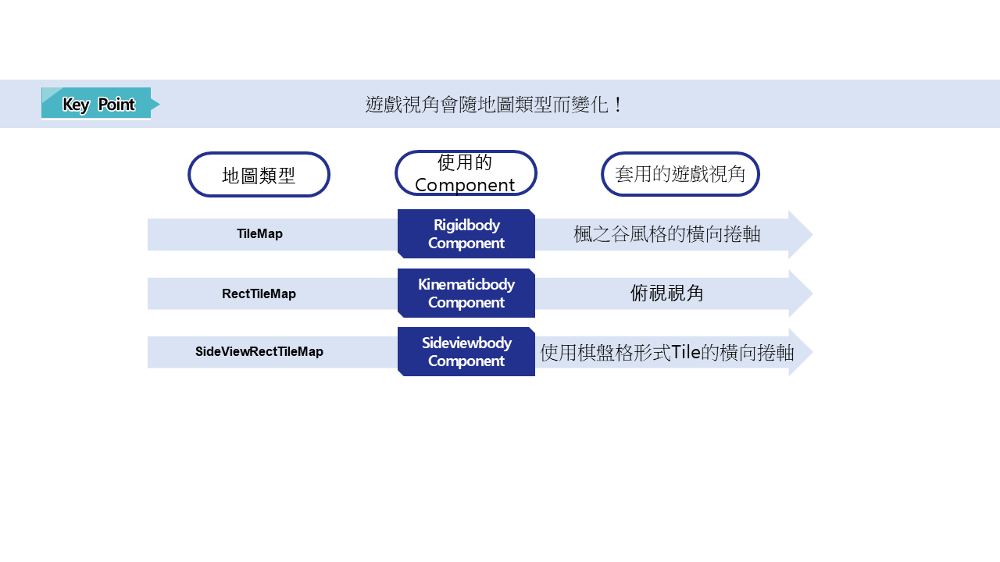

# [💡基礎學習] 地圖設定
 
 
 

## 影片時間軸
- 可在課程影片中以下時間點進行學習。
- 理解地圖類型：00:01:29
 

## 學習目標
- 學習楓之谷世界的地圖方式，並在製作世界時選擇自己需要的地圖方式。
- 可說明依各地圖方式，與地面圖塊互動的元件是什麼。
- 學習為了與RectTileMap互動所需的KinematicBodyComponent。
- 學習在RectTileMap上直接配置圖塊的方法，並能形成地圖。
 

## 觀看該影片後可嘗試執行的內容
- 為了製作射擊世界，將Map的形式變更為RectTileMap。
- 製作TileSet。 利用製作完成的TileSet實際製作可互動的Map。
- 利用製作完成的TileSet實際製作可互動的Map。
 

## 地圖種類

 

### TileMap

- 在楓之谷世界中初次建立世界時預設指定的地圖形式。
- 是最能展現楓之谷風格的世界方式。
- 利用楓之谷世界提供的Tile建立地面，並配置實體來形成地圖。
- 可依圖塊的配置製作斜坡。
- 在製作橫向捲軸形式的遊戲時，是能展現楓之谷風格的有用地圖方式。
 

### RectTileMap

- 在製作俯視視角形式的遊戲時，是有效的地圖形式。
- 可自行製作圖塊集，或使用楓之谷世界提供的圖塊集資源來形成地圖。
- 可透過棋盤格形式配置圖塊來形成地圖。
- 可為每個圖塊賦予可移動與不可移動的性質。
- 與TileMap、SideViewRectTileMap方式不同，可製作4方向、8方向移動形式的遊戲。
 

### SideViewRectTileMap

- 在製作橫向捲軸形式遊戲時，是有效的地圖形式。
- 可自行製作圖塊集，或使用楓之谷世界提供的圖塊集資源來形成地圖。
- 可透過棋盤格形式配置圖塊來形成地圖。
- 與RectTileMap不同，若不是不可移動的圖塊集，角色會**穿過**圖塊。
- 因此使用SideViewRectTileMap形成地圖時，必須將不可移動的圖塊集製作為**地面**。

 

## BodyComponent

- 在楓之谷世界中，為了與作為地面的圖塊互動，需要BodyComponent。
- BodyComponent會依地圖形式使用不同的BodyComponent。
- BodyComponent大致分為3種類型。
 

### RigidBodyComponent

- 在楓之谷世界的TileMap方式中控制角色的物理。
- 若地圖為TileMap但沒有RigidBodyComponent，角色無法與圖塊互動。
- 在RigidBodyComponent中提供角色跳躍控制、重力控制等多種物理屬性值。
- 可透過變更該數值來改變物理方式。
 

### KinematicBodyComponent

- 在楓之谷世界的RectTileMap方式中控制角色的物理。
- 當地圖為RectTileMap時，若沒有KinematicBodyComponent，將不會與RectTileMap的圖塊產生互動。
- 在KinematicBodyComponent中可調整角色的移動速度、是否可跳躍、是否顯示陰影等。
 

### SideViewRectTileMap

- 在楓之谷世界中使用SideViewRectTileMap方式時控制角色的物理。
- 若沒有該元件，角色無法與地圖圖塊互動。
- 可調整角色的跳躍速度與重力加速度等。

 

## 變更地圖形式

- 在Hierarchy視窗中對要變更的地圖按右鍵。
- 點擊Switch To RectTileMap或Switch To SideViewRectTileMap其中之一。
    - 若目前地圖不是TileMap，則會顯示Switch To TileMap，且切換到目前地圖狀態的選項會被隱藏。
- 為了製作射擊世界，點擊Switch To RectTileMap將地圖轉換為RectTileMap。
 

## KinematicBodyComponent要素查看

- **SpeedFactor**：可調整角色移動速度的數值。X、Y的數值可分別調整左右或上下移動速度。
- **EnableJump**：可決定是否允許角色跳躍。當該值未勾選時，角色無法跳躍。
- **JumpSpeed**：可調整角色跳躍速度。數值越大，跳躍速度越快且可跳得更高。
- **JumpDrag**：可調整角色的重力加速度。數值越小，重力影響越小，角色會在空中較慢下降。
- **ApplyClimbableRotation**：當角色與梯子、繩索等物件互動時，決定是否依其旋轉來讓角色旋轉。
- **EnableShadow**：決定是否顯示角色的陰影。當該值取消勾選時，將不顯示角色陰影。
- **ShadowColor**：可變更陰影顏色。
- **ShadowOffset**：可變更陰影顯示位置。
- **ShadowSize**：可設定陰影大小。
- **ShadowScalingRatio**：當角色跳躍時，可變更陰影縮放比例。數值越小，縮放比例越小。
- **EnableTileCollision**：可讓角色在RectTileMap中**無視**不可移動的圖塊進行移動。
 

## 在RectTileMap配置圖塊
- 為了指定射擊世界的移動區域，需要配置RectTileMap。
- 若初次變更為RectTileMap，則需要用於配置圖塊的圖塊集。
- 在範例世界中，將使用楓之谷世界提供的資源來製作圖塊集。
- 若已經有要使用的資源，也可以自行製作圖塊集使用。
 

### 製作圖塊集

- 在RectTileMap狀態下，點擊圖塊集編輯器畫面的「+」按鈕。

- 點擊Create TileSetFrom Template。
- 接著選擇想要的資源。
    - 在範例世界中使用Henesys。
- 若有要使用的其他資源，可透過Create Empty TileSet自行製作圖塊集。

- 變更Workspace中新增的NewTileSet名稱以完成圖塊集製作。

- 若圖塊集已正常製作完成，圖塊集編輯器畫面中會顯示可配置的圖塊。
 

### 變更圖塊是否可移動

- 點擊圖塊集編輯器右側的圖塊編輯按鈕。

- 在編輯對象中點擊是否可移動。
- 點擊要改為不可移動的圖塊的綠色十字UI，將其變為紅色十字UI。

- 若已正常變更，在圖塊配置狀態下，UI會變更為紅色十字。
- 將該圖塊配置到地圖後，透過測試確認角色無法移動。
 

### 在已配置的圖塊地圖中隱藏

- 在Hierarchy視窗中找到RectTileMap並點擊。
- 在Property視窗中點擊Visible並取消**勾選**。

- 若成功取消Visible，Scene畫面會顯示隱藏Tile的畫面。
 

### 變更背景

- 在Hierarchy視窗中找到Background並點擊。
- 在Property視窗中找到BackgroundComponent。
- 點擊Type。
- 從SolidColor變更為Template。

- 正常變更完成後，Scene畫面會從單色背景變為楓之谷世界提供的背景。

- 若要使用其他背景，在Property視窗中找到BackgroundComponent。
- 點擊TemplateRUID的Resource Picker按鈕。
- 找到並點擊想要的背景進行更換。

- 正常變更完成後，可在Scene畫面確認背景已變更。
 

## 最低實作標準
- 製作實際可使用的射擊世界地圖。
    - 必須利用TileSet區分可移動區域與不可移動區域。
 

## 應用與擴展方向
- 若使用楓之谷世界提供的資源，可自行製作資源後，利用自己的資源製作TileSet。
- 利用製作完成的TileSet，可以使用非楓之谷世界資源，而是實際可用的自製地圖。
- 學習CameraComponent，找出並套用讓視角不跟隨角色的方法。
    - 楓之谷世界官方文件，玩家相機控制文件[連結](https://maplestoryworlds-creators.nexon.com/zh-tw/docs?postId=72)