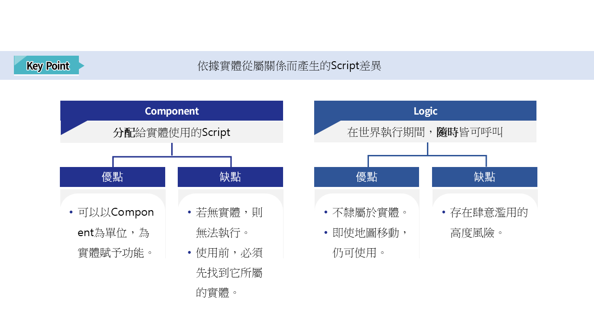
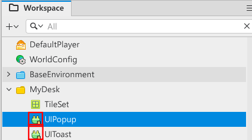
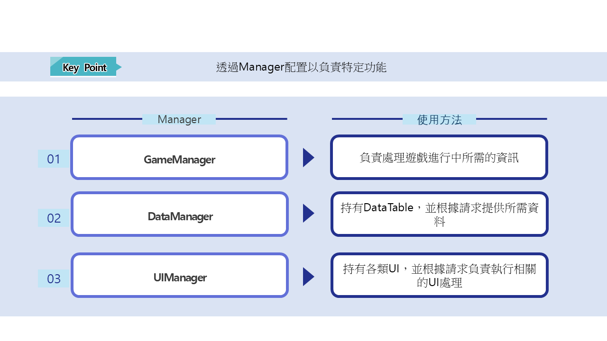
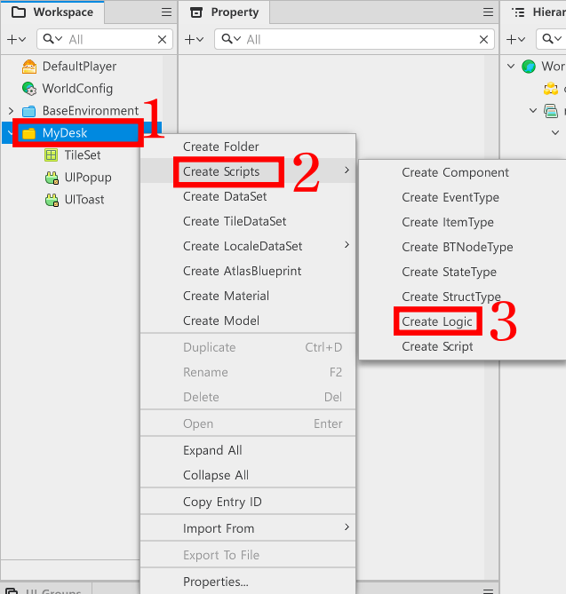
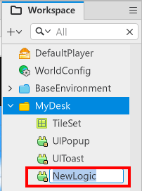
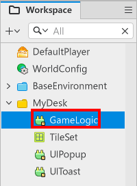
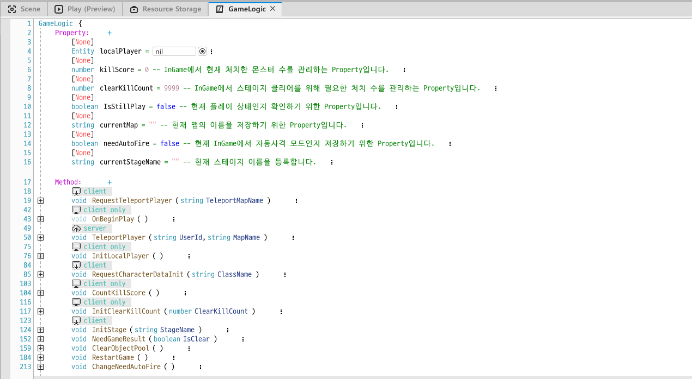

# [💡基礎學習]宣告Logic
<br>
<br>
<br>

## 影片時間軸
- 可在課程影片中以下時間點進行學習。
- Logic理解：00:23:57
<br>

## 學習目標
- 學習楓之谷世界提供的Logic功能。
- 理解Manager概念並設計以功能為單位的Logic。
- 利用Logic製作控制遊戲系統的Logic、管理資料的Logic等。
- 理解Logic的優缺點，並在之後製作Logic時加以考量設計。
<br>

## 觀看該影片後可嘗試執行的內容
- 在空的實體上新增Component後，呼叫製作好的Logic，直接體驗Logic的特性。
- 親自製作具有Manager性質的Logic，並思考如何管理該Manager並進行設計。
<br>

## Logic是什麼？

<p align="center">

</p>

- 是楓之谷世界提供的腳本形式之一。
- 建立Logic時，會在Workspace中以綠色插頭圖示顯示。
- 與Component不同，即使不附加在實體上也可以存取腳本。

<br>

## Manager概念

- Logic可以指定特定功能或角色，並以負責該功能的形式製作。
- 負責單一功能或角色的單位稱為Manager。
- 若特定功能發生問題，只需修改Manager內容即可快速解決。
    - Case 1：角色計算傷害並傳遞給怪物的情況
        - 每次變更傷害公式或新增計算要素時，都需要修改公式。
        - 需要逐一找到所有角色並修改輸入的程式碼。
    - Case 2：將傷害計算交由Logic製作的Manager處理
        - 在Logic中修改傷害計算公式。
        - 因為所有角色與怪物的傷害計算都由Logic負責，不需要再修改其他部分。
        - 即使之後傷害計算出現問題，也只需修改Manager即可解決。

<br>

## Logic製作方法

<p align="center">

</p>

- 在Workspace中對MyDesk按右鍵。
- 在選單畫面中點擊Create Scripts。
- 點擊Create Logic以建立新的Logic。

<p align="center">

</p>

- 將建立的Logic名稱修改為想要的名稱。

<p align="center">

</p>

- 完成名稱修改後，可在Workspace中看到Logic已建立。

<br>

## 範例世界中Manager Logic的使用用途

<table class="tg"><thead>
  <tr>
    <th class="tg-c3ow">姓名</th>
    <th class="tg-c3ow">使用用途</th>
  </tr></thead>
<tbody>
  <tr>
    <td class="tg-lboi">GameLogic</td>
    <td class="tg-lboi">為了管理隨著遊戲進行需要處理的功能而製作的Manager Logic。<br>負責遊戲通關判定、UI呼叫、角色瞬間移動等遊戲進行所需處理。</td>
  </tr>
  <tr>
    <td class="tg-lboi">DataTableLogic</td>
    <td class="tg-lboi">用於管理與使用DataSet的Logic。 <br>每次需要資料時逐一載入DataSet會很麻煩。 <br>當遊戲開始時，DataTableLogic會將所有DataSet進行快取，並在需要時回傳已快取的資料。</td>
  </tr>
  <tr>
    <td class="tg-lboi">UIManageLogic</td>
    <td class="tg-lboi">用於管理UIGroups的Manager Logic。 <br>若元件或GameLogic需要處理與UI相關的內容，就會將請求傳遞給該Manager Logic。 <br>由於UIManageLogic持有所有UIGroups的元件，因此會專責處理所有與UI相關的請求。</td>
  </tr>
</tbody>
</table>

- 像上述這樣，範例世界會建立並使用Logic。
- 當需要製作或擴充其他功能時，也可以宣告並製作屬於你們自己的Logic來使用。
<br>

## 範例世界內Logic使用範例
<br>

### GameLogic的情況

<p align="center">

</p>

- 正在處理用於變更使用者實體所在地圖位置的功能。
- 當遊戲開始時，會計算目前Stage還需要再處理多少敵人，並計算已處理的數量。
- 當遊戲通關或GameOver時，會判斷是否呼叫對應的UI演出。
- 可以宣告並變更玩家角色是否需要自動攻擊。
<br>

### DataTableLogic的情況

<p align="center">

</p>

- 當遊戲開始時，會自行快取所有DataSet。
- 會依照請求，將已快取的DataSet以加工後的形式再次回傳。

<br>

### UIManageLogic的情況

<p align="center">

</p>

- 當遊戲開始時，會把各個UIGroups中負責自行管理的Component全部註冊起來。
- 在遊戲進行期間，若有與UI相關的處理(顯示UI、隱藏UI、更新UI等)，便會接收請求並指示對應UI執行作業。
<br>

## 撰寫GameLogic程式碼
```lua
@Logic
script GameLogic extends Logic

property Entity localPlayer = nil

property number killScore = 0 -- 用來管理InGame中目前已擊殺怪物數量的Property。

property number clearKillCount = 9999 -- 用來管理InGame中Stage通關所需擊殺數的Property。

property boolean IsStillPlay = false -- 用來確認目前是否為遊玩中的Property。

property string currentMap = "" -- 用來儲存目前地圖名稱的Property。

property boolean needAutoFire = false -- 用來儲存目前InGame是否為自動射擊模式的Property。

property string currentStageName = "" -- 登錄目前Stage名稱。

@ExecSpace("Client")
method void RequestTeleportPlayer(string TeleportMapName)
log("GameManager RequestTeleportPlayer 開始")
    
-- 若目前沒有Player，則尋找LocalPlayer。
if not isvalid(self.localPlayer) then
    self:InitLocalPlayer()
	-- 若沒有LocalPlayer，則中斷程式執行。
	if not isvalid(self.localPlayer) then return end
end

    -- 讓UI能依目前地圖進行變更。
if TeleportMapName == "Title" then
	_UIManageLogic:ShowTitle()
elseif TeleportMapName == "InGame" then
    _UIManageLogic:ShowInGame()
end

self.currentMap = TeleportMapName
-- 在楓之谷世界中，玩家實體的Name與UserId相同。
self:TeleportPlayer(self.localPlayer.Name, TeleportMapName)
end

@ExecSpace("ClientOnly")
method void OnBeginPlay()
-- 當遊戲開始時，尋找並登錄本機玩家。
self:InitLocalPlayer()
end

@ExecSpace("Server")
method void TeleportPlayer(string UserId, string MapName)
-- 1.透過UserId再次從伺服器尋找實體。
log("成功進入TeleportPlayer")
    local playerEntity = _UserService:GetUserEntityByUserId(UserId)
    -- 若找不到playerEntity，則輸出錯誤日誌。
    if not isvalid(playerEntity) then
        log("瞬間移動失敗：找不到使用者。")
        return
    end

 	-- 指定要移動的路徑。   
    local targetPath = ""
    if MapName == "Title" then
        targetPath = "/maps/Title"
    elseif MapName == "InGame" then
        targetPath = "/maps/InGame"
    end
    -- 若移動路徑已正常登錄，則將玩家角色瞬間移動到該路徑。
    if targetPath ~= "" then
        _TeleportService:TeleportToEntityPath(playerEntity, targetPath)
        log("瞬間移動執行完成: " ..targetPath)
    end
end

@ExecSpace("ClientOnly")
method void InitLocalPlayer()
-- 尋找並登錄本機玩家。
if not isvalid(self.localPlayer) then
	self.localPlayer = _UserService.LocalPlayer
end
end

@ExecSpace("ClientOnly")
method void RequestCharacterDataInit(string ClassName)
-- 以傳入的CharacterDefaultData的ID值為基準，初始化PlayerState。
if ClassName ~= "" and ClassName ~= nil then
	-- 在DataTableManager中以ClassName尋找對應的資料表。
	local findPlayerData = _DataTableLogic:GetCharacterDefaultDataByCharacterID(ClassName)	
	-- 若找到，則以找到的資料初始化PlayerState。
	if isvalid(findPlayerData) and next(findPlayerData) ~= nil then
		log("完成CharacterDefaultData Init請求")
		self.localPlayer.PlayerState:InitPlayerData(findPlayerData)
	-- 若找不到，則留下log。
	else
		log("非正常的CharacterDefaultData Init失敗！")
	end
end
end

@ExecSpace("ClientOnly")
method void CountKillScore()
-- 若怪物死亡，killScore就增加1。
self.killScore = self.killScore + 1
-- 若killScore高於clearKillCount，則視為Stage通關。
if self.killScore >= self.clearKillCount then
	self.IsStillPlay = false
	self:NeedGameResult(true)
	log("遊戲通關")
end
end

@ExecSpace("ClientOnly")
method void InitClearKillCount(number ClearKillCount)
-- 以計算出的怪物數初始化Stage通關條件。
self.clearKillCount = ClearKillCount
end

@ExecSpace("ClientOnly")
method void InitStage(string StageName)
-- 以StageName值為基準，指定該地圖MonsterSpawnManager的路徑。
local spawnManagerPath = "/maps/"..StageName.."/MonsterSpawnManager"
-- 從預先指定的路徑中尋找MonsterSpawnManager實體。
local stageSpawnManager = _EntityService:GetEntityByPath(spawnManagerPath)
-- 若尋找MonsterSpawnManager失敗，則留下log並return。
if not isvalid(stageSpawnManager) then
	log(StageName.."中找不到MonsterSpawnManager物件！")
	return
end
-- 呼叫方法，讓ItemHelper登錄目前地圖的ItemSpawnManager。
_ItemHelper:InitData()
-- 若目前狀態不是遊戲進行中，則執行遊戲並將IsStillPlay的值改為true。
if not self.IsStillPlay then
	stageSpawnManager.MonsterSpawnManager:StartGame()
	self.IsStillPlay = true
end
-- 將目前怪物擊殺計數初始化為0。
self.killScore = 0
-- 由於已完成所有程序，因此登錄傳入的Stage名稱。
self.currentStageName = StageName
-- 暫時中斷所有BGM。
_SoundService:StopBGM(true)
-- 播放InGame中應輸出的BGM。
_SoundService:PlayBGM("d155c5573a3f46a7b2ffe38629441132", 1.0)
end

@ExecSpace("ClientOnly")
method void NeedGameResult(boolean IsClear)
-- 傳遞遊戲通關結果，並播放依結果對應的UI演出。
self.IsStillPlay = false
_UIManageLogic:ShowResultUI(IsClear)
end

@ExecSpace("ClientOnly")
method void ClearObjectPool()
--若在非InGame的其他地圖中呼叫該方法，則忽略以下程式碼。
if not self.currentMap == "InGame" then
	return
end
-- 指定InGame地圖內各ObjectPool管理Manager的路徑。
local missilePoolPath = "/maps/"..self.currentMap.."/ProjectileManager"
local monsterPoolPath = "/maps/"..self.currentMap.."/MonsterSpawnManager"

-- 依據上面指定的路徑尋找Manager。
local missilePoolEntity = _EntityService:GetEntityByPath(missilePoolPath)
local monsterPoolEntity = _EntityService:GetEntityByPath(monsterPoolPath)
-- 若成功找到，則將各物件池的實體設為非啟用狀態。
if isvalid(missilePoolEntity) then
	missilePoolEntity.ProjectileManager:ResetPool()
end
if isvalid(monsterPoolEntity) then
	monsterPoolEntity.MonsterSpawnManager:ClearAllChild()
end

-- 防止Helper類別在非InGame地圖中被呼叫而引發錯誤。
_ItemHelper:ReleaseData()
end

@ExecSpace("ClientOnly")
method void RestartGame()
-- 尋找本機玩家。
local findLocalPlayer = _UserService.LocalPlayer
-- 若找不到本機玩家，則輸出log後return。
if not isvalid(findLocalPlayer) then
	log("找不到LocalPlayer！")
	return
end
-- 若本機玩家實體上沒有PlayerState元件，則輸出log後return。
if not isvalid(findLocalPlayer.PlayerState) then
	log("找不到LocalPlayer的PlayerState元件！")
	return
end

--取得PlayerState後，尋找目前角色的ID值。
local currentPlayerCharacter = findLocalPlayer.PlayerState.characterID
-- 為了重新開始，初始化ObjectPool。
self:ClearObjectPool()
-- 初始化欲重新開始的Stage資料。
self:InitStage(self.currentStageName)
-- 為了將角色資訊恢復為初始狀態，再次初始化資料。
self:RequestCharacterDataInit(currentPlayerCharacter)
-- 將UI狀態切換為InGame開始狀態。
_UIManageLogic:ShowInGame()
-- 由於遊戲已重新開始，因此將IsStillPlay狀態切換為true。
self.IsStillPlay = true
end

@ExecSpace("ClientOnly")
method void ChangeNeedAutoFire()
-- 若呼叫該函式，則將目前needAutoFire的值改為相反值。
self.needAutoFire = not self.needAutoFire
end

end
```
<br>

## 撰寫DataTableLogic程式碼

```lua
@Logic
script DataTableLogic extends Logic

property table missileData = {} -- 用來管理MissileData DataSet的Property。

property table characterDefaultData = {} -- 用來管理CharacterDefaultData DataSet的Property。

property table characterSelectUIData = {} -- 用來管理CharacterSelectUIData DataSet的Property。

property table monsterDefaultData = {} -- 用來管理MonsterDefaultData DataSet的Property。

property table monsterSpawnData = {} -- 用來管理MonsterSpawnData DataSet的Property。

property table skillData = {} -- 用來管理SkillData DataSet的Property。

property table itemData = {} -- 用來管理ItemData DataSet的Property。

property table itemDropData = {} -- 用來管理ItemDropData DataSet的Property。

@ExecSpace("ClientOnly")
method void OnBeginPlay()
-- 初始化MissileData DataSet。
self:InitMissileData()
-- 初始化CharacterSelectUIData DataSet。
self:InitCharacterSelectUIData()
-- 初始化MonsterSpawnData DataSet。
self:InitMonsterSpawnData()
-- 初始化MonsterDefaultData DataSet。
self:InitMonsterDefaultData()
-- 初始化CharacterDefaultData DataSet。
self:InitCharacterDefaultData()
-- 初始化SkillData DataSet。
self:InitSkillData()
-- 初始化ItemData DataSet。
self:InitItemData()
-- 初始化ItemDropData DataSet。
self:InitItemDropData()
end

@ExecSpace("ClientOnly")
method void InitMissileData()
-- 檢查是否已完成投射體資料表解析。
if isvalid(self.missileData) == false or next(self.missileData) == nil then
	-- 因為需要解析投射體資料，所以尋找MissileData資料表。
	local missileDefaultData = _DataService:GetTable("MissileData")
	if isvalid(missileDefaultData) == nil then
		-- 由於找不到MissileData表，因此輸出日誌後Return。
		log("找不到MissileData資料表！")
		return
	end
	-- 計算全部Row數量。
	local rowCount = missileDefaultData:GetRowCount() 
	
    -- 先依序從資料表Row中由1開始代入作為Key的MissileID。
    for i = 1, rowCount do
        local missileID = missileDefaultData:GetCell(i, "MissileID")
        
        -- 檢查是否為有效ID。
        if missileID ~= nil and missileID ~= "" then
            
            -- 將該列的所有資訊綁成一個table。
            local rowData = 
			{
                MissileID = missileID,
                AtkValue = tonumber(missileDefaultData:GetCell(i, "AtkValue")),
                MoveSpeed = tonumber(missileDefaultData:GetCell(i, "MoveSpeed")),
                LifeTime = tonumber(missileDefaultData:GetCell(i, "LifeTime")),
				HitEffectRUID = tostring(missileDefaultData:GetCell(i, "HitEffectRUID")),
				ModelRUID = tostring(missileDefaultData:GetCell(i, "ModelRUID"))
            }
            
            -- 登錄到missileData Property中。(Key：MissileID, Value：資料)
            self.missileData[missileID] = rowData
        end
    end
	-- 輸出表示資料表快取完成的Log。
	log("MissileData資料表快取完成！")
	return
end
-- 由於尚未進行資料表快取，因此輸出提示該情況的日誌。
log("MissileData資料表已經快取過，或是找不到MissileData資料表。")
end

@ExecSpace("ClientOnly")
method void InitCharacterDefaultData()
-- 用於檢查玩家角色解析是否完成的項目
if isvalid(self.characterDefaultData) == false or next(self.characterDefaultData) == nil then
	local getTableData = _DataService:GetTable("CharacterDefaultData")
	--若取得資料表失敗則輸出警告訊息
	if getTableData == nil then
		log("取得CharacterDefaultData資料表失敗！")
		return
	end
	--開始解析
	local rowCount = getTableData:GetRowCount() -- 計算全部列數。
    
    for i = 1, rowCount do
        -- 先從資料表Row中代入一個作為Key的CharacterID。
        local characterID = tostring(getTableData:GetCell(i, "CharacterID"))
        
        -- 檢查是否為有效ID。
        if characterID ~= nil and characterID ~= "" then
            
            -- 將該列的所有資訊綁成table。
            local rowData = 
			{
                CharacterID = characterID,
                StartHP = tonumber(getTableData:GetCell(i, "StartHP")),
				StartSkillCount = tonumber(getTableData:GetCell(i, "StartSkillCount")),
                StartMoveSpeed = tonumber(getTableData:GetCell(i, "StartMoveSpeed")),
                DefaultMissile = tostring(getTableData:GetCell(i, "DefaultMissile")),
				DefaultSkill = tostring(getTableData:GetCell(i, "DefaultSkill")),
				AttackInterval = tonumber(getTableData:GetCell(i, "AttackInterval"))
            }
            
            -- 儲存到快取table中(Key：MissileID, Value：資料)
            self.characterDefaultData[characterID] = rowData
        end
    end
	-- 輸出表示資料表快取完成的Log。
	log("CharacterDefaultData資料表快取完成！")
	return
end
-- 由於尚未進行資料表快取，因此輸出提示該情況的日誌。
log("CharacterDefaultData資料表已經快取過，或是找不到CharacterDefaultData資料表。")
end

@ExecSpace("ClientOnly")
method void InitCharacterSelectUIData()
-- 檢查角色選擇視窗資訊表是否已快取。
if isvalid(self.characterSelectUIData) == false or next(self.characterSelectUIData) == nil then
	-- 因為角色選擇視窗資訊表尚未登錄，所以尋找資料表以快取該部分。
	local characterSelectData = _DataService:GetTable("CharacterSelectUIData")
	-- 若找不到角色選擇視窗資訊表，則以log輸出錯誤。
	if characterSelectData == nil then
		log("找不到CharacterSelectUIData資料表！")
		return
	end
	-- 若正常找到，則計算資料表的RowCount。
	local rowCount = characterSelectData:GetRowCount()
	    -- 先依序從資料表Row中由1開始代入作為Key的CharacterID。
    for i = 1, rowCount do
        local characterID = characterSelectData:GetCell(i, "CharacterID")
        
        -- 檢查是否為有效ID。
        if characterID ~= nil and characterID ~= "" then
            
            -- 將該列的所有資訊綁成一個table。
            local rowData = 
			{
                CharacterID = characterID,
                LocalizeNameID = tostring(characterSelectData:GetCell(i, "LocalizeNameID")),
                SpriteRUID = tostring(characterSelectData:GetCell(i, "SpriteRUID"))
            }
            
            -- 儲存到快取table中(Key：MissileID, Value：資料)
            self.characterSelectUIData[characterID] = rowData
        end
    end
	-- 輸出表示資料表快取完成的Log。
	log("CharacterSelectUIData資料表快取完成！")
	return
end
-- 由於尚未進行資料表快取，因此輸出提示該情況的日誌。
log("CharacterSelectUIData資料表已經快取過，或是找不到MissileData資料表。")
end

@ExecSpace("ClientOnly")
method void InitMonsterDefaultData()
-- 檢查怪物資料解析是否完成。
if isvalid(self.monsterDefaultData) == false or next(self.monsterDefaultData) == nil then
	local getTableData = _DataService:GetTable("MonsterDefaultData")
	--若取得資料表失敗則輸出警告訊息。
	if getTableData == nil then
		log("取得MonsterDefaultData資料表失敗！")
		return
	end
 		-- 計算全部列數。
		local rowCount = getTableData:GetRowCount()
    
    for i = 1, rowCount do
        -- 先從資料表Row中代入一個作為Key的MissileID。
        local monsterID = getTableData:GetCell(i, "MonsterID")
        
        -- 檢查是否為有效ID。
        if monsterID ~= nil and monsterID ~= "" then
            
            -- 將該列的所有資訊綁成table。
            local rowData = 
			{
                monsterID = monsterID,
                StartHP = tonumber(getTableData:GetCell(i, "StartHP")),
                StartMoveSpeed = tonumber(getTableData:GetCell(i, "StartMoveSpeed")),
                DefaultMissile = getTableData:GetCell(i, "DefaultMissile"),
				AttackInterval = tonumber(getTableData:GetCell(i, "AttackInterval")),
				ModelRUID = tostring(getTableData:GetCell(i, "ModelRUID"))
            }
            
            -- 儲存到快取table中(Key：MissileID, Value：資料)
            self.monsterDefaultData[monsterID] = rowData
        end
    end
	-- 輸出表示資料表快取完成的Log。
	log("MonsterDefaultData資料表快取完成！")
	return
end
-- 由於尚未進行資料表快取，因此輸出提示該情況的日誌。
log("MonsterDefaultData資料表已經快取過，或是找不到MonsterDefaultData資料表。")
end

@ExecSpace("ClientOnly")
method void InitMonsterSpawnData()
-- 檢查怪物產生資料解析是否完成。
if isvalid(self.monsterSpawnData) == false or next(self.monsterSpawnData) == nil then
	local getTableData = _DataService:GetTable("MonsterSpawnData")
	--若取得資料表失敗則輸出警告訊息
	if getTableData == nil then
		log("取得MonsterSpawnData資料表失敗！")
		return
	end
 		-- 計算全部列數。
		local rowCount = getTableData:GetRowCount()
    
    for i = 1, rowCount do
        -- 先從資料表Row中代入一個作為Key的MissileID。
        local stageID = getTableData:GetCell(i, "StageID")
        
        -- 檢查是否為有效ID。
        if stageID ~= nil and stageID ~= "" then
            
            -- 將該列的所有資訊綁成table。
            local rowData = 
			{
                StageID = getTableData:GetCell(i, "StageID"),
                MonsterID = tostring(getTableData:GetCell(i, "MonsterID")),
                SpawnPosX = tonumber(getTableData:GetCell(i, "SpawnPosX")),
                SpawnPosY = tonumber(getTableData:GetCell(i, "SpawnPosY")),
				EntranceTime = tonumber(getTableData:GetCell(i, "EntranceTime")),
				ItemDropRate = tonumber(getTableData:GetCell(i, "ItemDropRate")),
				MustDropItem = tostring(getTableData:GetCell(i, "MustDropItem"))
            }
			-- 將要登錄到key值的stageID轉換為number形式。
			stageID = tonumber(stageID)
            -- 儲存到快取table。(Key：MissileID, Value：資料)
			if self.monsterSpawnData[stageID] == nil then
				self.monsterSpawnData[stageID] = {}
			end
            table.insert(self.monsterSpawnData[stageID], rowData)
        end
    end
	-- 輸出表示資料表快取完成的Log。
	log("MonsterSpawnData資料表快取完成！")
	return
end
-- 由於尚未進行資料表快取，因此輸出提示該情況的日誌。
log("MonsterSpawnData資料表已經快取過，或是找不到MonsterSpawnData資料表。")
end

@ExecSpace("ClientOnly")
method void InitSkillData()
-- 若沒有已快取的skillData，則嘗試快取資料表。
if not isvalid(self.skillData) or not next(self.skillData) then
	local findData = _DataService:GetTable("SkillData")
	--若找不到SkillData，則留下日誌並離開程式碼。
	if not isvalid(findData) then
		log("SkillData載入失敗！")
		return
	end
 	-- 計算全部列數。
	local rowCount = findData:GetRowCount()
    
    for i = 1, rowCount do
        -- 先從資料表Row中代入一個作為Key的MissileID。
        local skillID = findData:GetCell(i, "SkillID")
        
        -- 檢查是否為有效ID。
        if skillID ~= nil and skillID ~= "" then
            
            -- 將該列的所有資訊綁成table。
            local rowData = 
			{
                SkillID = findData:GetCell(i, "SkillID"),
                SkillType = findData:GetCell(i, "SkillType"),
                IsPierce = findData:GetCell(i, "IsPierce"),
                AtkValue = tonumber(findData:GetCell(i, "AtkValue")),
				MoveSpeed = tonumber(findData:GetCell(i, "MoveSpeed")),
				LifeTime = tonumber(findData:GetCell(i, "LifeTime")),
				MaxHitCount = tonumber(findData:GetCell(i, "MaxHitCount")),
				HitInterval = tonumber(findData:GetCell(i, "HitInterval")),
				ModelRUID = findData:GetCell(i, "ModelRUID"),
				HitEffectRUID = findData:GetCell(i, "HitEffectRUID")
            }
            
            -- 儲存到快取table。(Key：MissileID, Value：資料)
            self.skillData[skillID] = rowData
        end
    end
	-- 輸出表示資料表快取完成的Log。
	log("SkillData資料表快取完成！")
	return
end
-- 由於尚未進行資料表快取，因此輸出提示該情況的日誌。
log("SkillData資料表已經快取過，或是找不到SkillData資料表。")
end

@ExecSpace("ClientOnly")
method void InitItemData()
-- 檢查是否已完成ItemData資料表解析。
if not isvalid(self.itemData) or not next(self.itemData) then
	-- 因為需要解析ItemData資料表，所以尋找ItemData資料表。
	local itemDefaultData = _DataService:GetTable("ItemData")
	if not isvalid(itemDefaultData) then
		-- 由於找不到ItemData資料表，因此輸出日誌後Return。
		log("找不到ItemData資料表！")
		return
	end
	-- 計算全部Row數量。
	local rowCount = itemDefaultData:GetRowCount() 
	
    -- 先依序從資料表Row中由1開始代入作為Key的ItemID。
    for i = 1, rowCount do
        local itemID = itemDefaultData:GetCell(i, "ItemID")
        
        -- 檢查是否為有效ID。
        if itemID ~= nil and itemID ~= "" then
            
            -- 將該列的所有資訊綁成一個table。
            local rowData = 
			{
                ItemID = itemID,
                ValueType = tonumber(itemDefaultData:GetCell(i, "ValueType")),
                TargetPlayerStateName = tostring(itemDefaultData:GetCell(i, "TargetPlayerStateName")),
                NumberValue = tonumber(itemDefaultData:GetCell(i, "NumberValue")),
				StringValue = tostring(itemDefaultData:GetCell(i, "StringValue")),
				SpriteRUID = tostring(itemDefaultData:GetCell(i, "SpriteRUID")),
				GainEffect = tostring(itemDefaultData:GetCell(i, "GainEffect"))
            }
            
            -- 儲存到快取table。(Key：ItemID, Value：資料)
            self.itemData[itemID] = rowData
        end
    end
	-- 輸出表示資料表快取完成的Log。
	log("ItemData資料表快取完成！")
	return
end
-- 由於尚未進行資料表快取，因此輸出提示該情況的日誌。
log("ItemData資料表已經快取過，或是找不到ItemData資料表。")
end

@ExecSpace("ClientOnly")
method void InitItemDropData()
-- 檢查是否已完成ItemDropData資料表解析。
if not isvalid(self.itemDropData) or not next(self.itemDropData) then
	-- 因為需要解析ItemDropData資料表，所以尋找ItemDropData資料表。
	local itemDropDefaultData = _DataService:GetTable("ItemDropData")
	if not isvalid(itemDropDefaultData) then
		-- 由於找不到ItemDropData資料表，因此輸出日誌後Return。
		log("找不到ItemDropData資料表！")
		return
	end
	-- 計算全部Row數量。
	local rowCount = itemDropDefaultData:GetRowCount() 
	
    -- 先依序從資料表Row中由1開始代入作為Key的ItemID。
    for i = 1, rowCount do
        local itemID = itemDropDefaultData:GetCell(i, "ItemID")
        
        -- 檢查是否為有效ID。
        if itemID ~= nil and itemID ~= "" then
            
            -- 將該列的所有資訊綁成一個table。
            -- 注意：用GetCell取得的數字可能是字串，因此若為數值建議使用tonumber()
            local rowData = 
			{
                ItemID = itemID,
                DropRate = tonumber(itemDropDefaultData:GetCell(i, "DropRate")),
            }
            
            -- 儲存到快取table。(Key：ItemID, Value：資料)
            self.itemDropData[itemID] = rowData
        end
    end
	-- 輸出表示資料表快取完成的Log。
	log("ItemDropData資料表快取完成！")
	return
end
-- 由於尚未進行資料表快取，因此輸出提示該情況的日誌。
log("ItemDropData資料表已經快取過，或是找不到ItemDropData資料表。")
end

@ExecSpace("ClientOnly")
method table GetMissileDataByMissileID(string MissileID)
-- 檢查missileData是否已正常快取。
if isvalid(self.missileData) or next(self.missileData) ~= nil then
	-- 若存在以MissileID為Key的Value，則回傳該值。
	if self.missileData[MissileID] then
		return self.missileData[MissileID]
	end
-- 若missileData尚未快取，則輸出錯誤日誌。
else
	log("目前沒有投射體資料解析！")
	return nil
end
end

@ExecSpace("ClientOnly")
method table GetCharacterDefaultDataByCharacterID(string CharacterID)
-- 若characterDefaultData尚未正常快取，則嘗試進行快取。
if self.characterDefaultData == nil then
	self:InitCharacterDefaultData()
end
-- 檢查目前CharacterDefaultData是否已正常登錄。
if isvalid(self.characterDefaultData) and next(self.characterDefaultData) ~= nil then
	-- 若存在擁有CharacterID值的資料，則回傳該資料。
	if self.characterDefaultData[CharacterID] then
		return self.characterDefaultData[CharacterID]
	end
-- 若沒有對應Key的資料，則輸出錯誤日誌。
else
	log("沒有PlayerDefaultData資料，或是不存在"..CharacterID.."值！")
	return nil
end
end

@ExecSpace("ClientOnly")
method table GetCharacterSelectUIDataTable()
-- 直接回傳整個角色選擇UI資料表。
if isvalid(self.characterSelectUIData) and next(self.characterSelectUIData) ~= nil then
	return self.characterSelectUIData
else
	-- 若沒有可回傳的值，則輸出錯誤日誌。
	log("CharacterSelectUIData資料表不存在，或是未正常完成快取！")
	return nil
end
end

@ExecSpace("ClientOnly")
method table GetMonsterSpawnDataTableByStageID(number StageID)
-- 若傳入的StageID不是1以上的正常值，則留下日誌並結束載入。
if StageID <= 0 then
	log("為了在DataTableManager中呼叫SpawnData而傳入的值不是1以上！")
	return
end
-- 若可正常傳遞怪物產生資料，則連同日誌一起回傳資料。
if self.monsterSpawnData[StageID] ~= nil then
	log("收到的產生資料值："..self.monsterSpawnData[StageID][1].MonsterID)
	return self.monsterSpawnData[StageID]
end
-- 若無法回傳產生資料，則輸出錯誤日誌。
log(StageID.."這個StageID值的資料無法在MonsterSpawnData資料表中找到！")
return nil
end

@ExecSpace("ClientOnly")
method table GetMonsterDefaultDataByMonsterID(string MonsterID)
-- 檢查monsterDefaultData是否已快取。
if isvalid(self.monsterDefaultData) or next(self.monsterDefaultData) ~= nil then
	-- 若能回傳擁有MonsterID值的資料，則回傳該資料。
	if self.monsterDefaultData[MonsterID] then
		return self.monsterDefaultData[MonsterID]
	end
-- 若無法回傳資料，則輸出錯誤日誌。
else
	log("目前沒有怪物資料解析！")
	return nil
end
end

@ExecSpace("ClientOnly")
method table GetSkillDataBySkillID(string SkillID)
-- 若skillData尚未快取，則嘗試進行快取。
if not isvalid(self.skillData) or not next(self.skillData) then
	self:InitSkillData()
end
-- 若可使用skillData，且存在以SkillID為Key的值，則回傳該值。
if isvalid(self.skillData[SkillID]) and next(self.skillData[SkillID]) then
	return self.skillData[SkillID]
end
-- 若無法回傳資料，則輸出錯誤日誌。
log("找不到名稱為"..SkillID.."的SkillData！")
return nil
end

@ExecSpace("ClientOnly")
method table GetItemDataByItemID(string ItemID)
-- 若itemData尚未快取，則嘗試進行快取。
if not isvalid(self.itemData) or not next(self.itemData) then
	self:InitItemData()
end
-- 若存在itemData中以ItemID為Key的Value，則回傳該值。
if isvalid(self.itemData[ItemID]) and next(self.itemData[ItemID]) then
	return self.itemData[ItemID]
end
-- 若無法回傳ItemID的值，則輸出錯誤日誌。
log("找不到名稱為"..ItemID.."的ItemData！")
return nil
end

@ExecSpace("ClientOnly")
method table GetItemDropData()
-- 若itemDropData尚未快取，則嘗試進行快取。
if not isvalid(self.itemDropData) or not next(self.itemDropData) then
	self:InitItemDropData()
end
-- 若可以回傳itemDropData，則全部回傳itemDropData。
if isvalid(self.itemDropData) and next(self.itemDropData) then
	return self.itemDropData
end
-- 若無法回傳，則連同錯誤日誌一起回傳nil。
log("DataTableLogic中未登錄ItemDropData值！")
return nil
end

end
```
<br>

## 撰寫UIManageLogic程式碼
```lua
@Logic
script UIManageLogic extends Logic

property TitleUIController titleUIController = nil

property SelectCharacterUIController selectCharacterUIController = nil

property ResultUIController resultUIController = nil

property DefaultUIController defaultUIController = nil

@ExecSpace("ClientOnly")
method void OnBeginPlay()
-- 當遊戲開始時，尋找並登錄TitleUIController。
self:InitTitleUIController()
-- 當遊戲開始時，尋找並登錄SelectCharacterUIController。
self:InitSelectCharacterUIController()
-- 當遊戲開始時，尋找並登錄ResultUIController。
self:InitResultUIController()
-- 當遊戲開始時，尋找並登錄DefaultUIController。
self:InitDefaultUIController()
end

@ExecSpace("ClientOnly")
method void InitTitleUIController()
--若未登錄TitleUIController，則登錄該元件。
if not isvalid(self.titleUIController) then
	local titleUIEntity = _EntityService:GetEntityByPath("/ui/TitleUI")
	--若成功找到titleUIGroup，則登錄該實體的元件。
	if isvalid(titleUIEntity) then
		local component = titleUIEntity.TitleUIController
		-- 搜尋是否已正常登錄元件後，將其指派。
		if isvalid(component) then
			self.titleUIController = component
		end 
	end
end
end

@ExecSpace("ClientOnly")
method void InitSelectCharacterUIController()
--若未登錄SelectCharacterUIController，則登錄該元件。
if not isvalid(self.selectCharacterUIController) then
	local selectCharacterUIEntity = _EntityService:GetEntityByPath("/ui/SelectCharacterUI")
	--若成功找到SelectCharacterUIController，則登錄該實體的元件。
	if isvalid(selectCharacterUIEntity) then
		local component = selectCharacterUIEntity.SelectCharacterUIController
		-- 搜尋是否已正常登錄元件後，將其指派。
		if isvalid(component) then
			self.selectCharacterUIController = component
		end 
	end
end
end

@ExecSpace("ClientOnly")
method void ShowTitle()
-- 顯示標題畫面。
self.titleUIController:Show()
-- 其餘UI全部設為隱藏。
self.selectCharacterUIController:Hide()
self.resultUIController:Hide()
self.defaultUIController:Hide()
end

@ExecSpace("ClientOnly")
method void CallSelectCharacterUI()
-- 顯示角色選擇視窗。
self.selectCharacterUIController:Show()
-- 嘗試初始化角色選擇視窗內的角色清單。
self.selectCharacterUIController:InitCharacterSelectFrame()
end

@ExecSpace("ClientOnly")
method void ShowInGame()
-- 初始化作為遊戲畫面UI的defaultUI。
self.defaultUIController:Show()
-- 請求初始化自動攻擊UI。
self.defaultUIController:UpdateAutoUI()
-- 將其餘UI設為隱藏。
self.titleUIController:Hide()
self.selectCharacterUIController:Hide()
self.resultUIController:Hide()
end

@ExecSpace("ClientOnly")
method void InitResultUIController()
--若尚未登錄ResultUIController，則登錄該元件。
if not isvalid(self.resultUIController) then
	local resultUIEntity = _EntityService:GetEntityByPath("/ui/ResultUI")
	--若成功找到ResultUIController，則登錄該實體的元件。
	if isvalid(resultUIEntity) then
		local component = resultUIEntity.ResultUIController
		-- 搜尋是否已正常登錄元件後，將其指派。
		if isvalid(component) then
			self.resultUIController = component
		end 
	end
end
end

@ExecSpace("ClientOnly")
method void ShowResultUI(boolean IsClear)
-- 顯示結果UI。
self.resultUIController:Show(IsClear)
if IsClear then
	--播放祝賀效果音
	_SoundService:PlaySound("5d57b617cfc242cca347925e209c8e05", 1.0)
else
	--播放失敗效果音
	_SoundService:PlaySound("52dccfb8889b4181b9181780dc7e9040", 1.0)
end
end

@ExecSpace("ClientOnly")
method void InitDefaultUIController()
--若尚未登錄defaultUIController，則登錄該元件。
if not isvalid(self.defaultUIController) then
	local titleUIEntity = _EntityService:GetEntityByPath("/ui/DefaultUI")
	--若成功找到DefaultUIGroup，則登錄該實體的元件。
	if isvalid(titleUIEntity) then
		local component = titleUIEntity.DefaultUIController
		-- 搜尋是否已正常登錄元件後，將其指派。
		if isvalid(component) then
			self.defaultUIController = component
		end 
	end
end
end

@ExecSpace("ClientOnly")
method void UpdateLifeCountUI(number PlayerLife)
-- 依照PlayerLife數量更新DefaultUI的體力UI。
self.defaultUIController:UpdateLifeUI(PlayerLife)
end

@ExecSpace("ClientOnly")
method void UpdateSkillCountUI(number LeftSkillCount)
-- 依照LeftSkillCount的數量更新DefaultUI的技能UI。
self.defaultUIController:UpdateSkillUI(LeftSkillCount)
end

end
```
<br>

## Logic的優點

- 具有可在任何地方方便存取的優點。
- 不需要像元件那樣去尋找特定實體，也不需要確認找到的實體是否持有該元件。
- 只要先建立好Logic，就可以明確地信任並使用該Logic。
- 此外，由於功能由Logic負責，因此當出現責任歸屬問題時，只要修改具有該責任的Logic即可解決問題。

## 使用Logic時的注意事項
- 有可能發生一個Logic負責所有功能的God Class化。
    - EX：負責傷害計算的Logic同時負責傷害計算、傷害值處理、聲音輸出、Hit特效輸出等
- 一旦發生God Class化，該Logic除了自己需要的資訊之外，還必須知道更多資訊。
- 這種方式偏離物件導向設計理論，也會成為大幅增加程式碼行數的原因。
- 增加的程式碼行數會降低可讀性，並且在進行除錯時，會產生無法快速找出問題原因的缺點。

<br>

## 最低實作標準
- 製作用來管理並使用之後要使用的DataSet的Logic。
    - 以範例世界為基準，製作DataTableLogic來管理DataSet。
- 製作可負責依遊戲進行而處理內容的Logic。
    - 以範例世界為基準，製作GameLogic來實作依遊戲狀態而處理的內容。
- 製作可管理所有UI的Logic。
    - 以範例世界為基準，製作UIManageLogic來實作可管理多個UI的功能。

<br>

## 應用與擴展方向
- 製作CalcDamageLogic，在接收到傷害值後，依攻擊計算公式計算最終傷害，以管理傷害計算功能。
- 利用Logic製作並使用ConfigLogic，以管理預定不會變更的固定值。
    - EX：若是生命不會超過5個的遊戲，可以製作並使用可登錄MaxHP以固定最大體力的Logic。