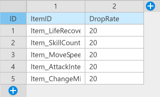
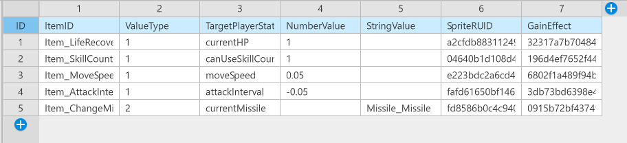
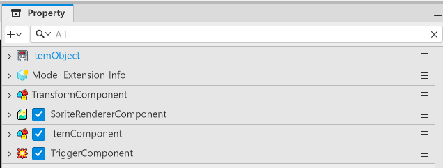

# [📖進階學習]實作道具
<br>
<br>
<br>

## 影片時間軸
- 可在課程影片中以下時間點進行學習。
- 實作道具：02:32:10
<br>

## 學習目標
- 學習利用Logic來使用負責特定功能的Logic的方法。
- 學習考量擴充性的設計，以便日後若想變更道具產生的功能時，只需變更Logic即可。
<br>

## 觀看該影片後可嘗試執行的內容
- 變更道具效果數值，並確認是否依變更後的數值套用。
- 除了已製作的道具外，也製作提供其他效果的Model。
<br>

## 製作DataSet
- 為了製作與道具掉落相關的功能，大致需要2種DataSet。
- 存在ItemData、ItemDropData這2種。
    - **ItemData**：用來決定道具效果或性能的DataSet。
    - **ItemDropData**：用來決定道具掉落機率的DataSet。
<br>

## ItemDropData DataSet構成

<p align="center">

</p>

<table class="tg">
  <thead>
    <tr>
      <th class="tg-c3ow">姓名</th>
      <th class="tg-c3ow">說明</th>
    </tr>
  </thead>
  <tbody>
    <tr>
      <td class="tg-lboi">ItemID</td>
      <td class="tg-lboi">這是用來區分是什麼道具的ID值。使用ItemData的ID值。</td>
    </tr>
    <tr>
      <td class="tg-lboi">DropRate</td>
      <td class="tg-lboi">這是用來決定道具掉落機率的值。</td>
    </tr>
  </tbody>
</table>

<br>

## ItemData DataSet構成

<p align="center">

</p>

<table class="tg">
  <thead>
    <tr>
      <th class="tg-c3ow">姓名</th>
      <th class="tg-c3ow">說明</th>
    </tr>
  </thead>
  <tbody>
    <tr>
      <td class="tg-lboi">ItemID</td>
      <td class="tg-lboi">這是用來區分道具的ID值。該值會作為ItemDropData的ItemID值使用。</td>
    </tr>
    <tr>
      <td class="tg-lboi">ValueType</td>
      <td class="tg-lboi">這是用來區分道具效果值是數值型還是文字型的要素。</td>
    </tr>
    <tr>
      <td class="tg-lboi">TargetPlayerStateName</td>
      <td class="tg-lboi">這是用來設定應影響PlayerState中哪個Property的值。必須與PlayerState的Property名稱完全相同。</td>
    </tr>
    <tr>
      <td class="tg-lboi">NumberValue</td>
      <td class="tg-lboi">若為具有數值型值的道具效果，則會依該值套用效果。</td>
    </tr>
    <tr>
      <td class="tg-lboi">StringValue</td>
      <td class="tg-lboi">若為具有文字型值的道具效果，則會依該值套用效果。在範例世界中，是以實作基本攻擊變更道具為目的而製作。</td>
    </tr>
    <tr>
      <td class="tg-lboi">SpriteRUID</td>
      <td class="tg-lboi">這是為了變更道具圖片而製作的值。透過該值變更道具圖片。</td>
    </tr>
    <tr>
      <td class="tg-lboi">GainEffect</td>
      <td class="tg-lboi">這是用來指定獲得道具時之道具獲得特效的值。</td>
    </tr>
  </tbody>
</table>

## 建立ItemSpawnManager
- 這是實際負責產生道具的Component。
- 該要素是以實體形式製作，並以範例世界為基準製作在InGame中。
- 在製作好實體與Component後，必須將以下程式碼登錄到ItemSpawnManager中。
- 程式碼是以Plain Text為基準撰寫。

```lua
@Component
script ItemSpawnManager extends Component

property string itemModelID = "model://0b6340f2-19d9-4a27-b18a-70feb94ce2ae" -- 這是在Workspace內作為道具使用的Model ID。 

property table itemObjectPool = {} -- 這是用來尋找並重複使用可用實體的table。

@ExecSpace("Client")
method void CreateItem(string ItemKey, Vector3 ItemSpawnPosition)
-- 檢查itemObjectPool是否為nil。
if self.itemObjectPool[ItemKey] == nil then
	-- 若itemObjectPool為nil，則初始化為{}。
	self.itemObjectPool[ItemKey] = {}
end

-- 將pool內傳入的ItemKey種類實體登錄到pool中。
local pool = self.itemObjectPool[ItemKey]
-- 為了登錄可用的實體，將returnEntity設為nil。
local returnEntity = nil

-- 當pool內要素至少有1個時，開始搜尋。
if #pool > 0 then
-- 依pool的要素數量開始搜尋。
	for i = 1, #pool do
		-- 若第i個實體可使用，則回傳第i個實體。
		if isvalid(pool[i]) and not pool[i].Enable then
			returnEntity = pool[i]
			break
		end
	end
end

-- 依據ItemKey值從DataTableLogic中尋找值。
local itemData = _DataTableLogic:GetItemDataByItemID(ItemKey)
-- 若直到目前returnEntity仍為nil，則判定為沒有可用實體。
if returnEntity == nil then
	-- 透過SpawnService，將已做成Model的道具實體建立到地圖中。
    returnEntity = _SpawnService:SpawnByModelId(self.itemModelID, itemData.ItemID, Vector3.zero, self.Entity)
	-- 為了讓已建立的道具可以再次被回收，將自己登錄到ItemComponent的poolManager中。
	returnEntity.ItemComponent.poolManager = self
	-- 為了防止道具處於不可使用狀態，將實體的Enable改為true。
	returnEntity.Enable = true
	-- 將建立的要素以ItemKey值作為Key、實體作為Value新增到itemObjectPool中。
	table.insert(self.itemObjectPool[ItemKey], returnEntity)
else
    -- 若returnEntity存在，則將Enable改為true，以便可再次使用。
    returnEntity.Enable = true
end
-- 初始化已建立的道具實體資料。
returnEntity.ItemComponent:InitData(itemData, ItemSpawnPosition)
end

@ExecSpace("Client")
method void ReturnItemEntity(Entity ItemEntity)
-- 若傳入的ItemEntity為不可使用的實體，則透過return離開程式碼。
if not isvalid(ItemEntity) then return end
-- 若ItemEntity可使用，則停用Enable，切換為可再次使用的待機狀態。
ItemEntity.Enable = false
end

end
```
<br>

## 製作道具實體

- 必須製作用來構成道具的實體，並將該實體登錄為Model。此時Model的EntryID值會作為ItemSpawnManager的itemModelID值使用。

<p align="center">

</p>

- **SpriteRendererComponent**：用來顯示道具圖片的Component。會將該Component的ImageRUID值套用為ItemData的SpriteRUID值來變更道具圖示。
- **TriggerComponent**：用來偵測道具碰撞的Component。新增該Component後，必須將Collision Group變更為Item。
- **ItemComponent**：用來承載道具移動與效果的Component。由於該Component必須自行製作，因此必須透過Add Component、New Component來製作。

<br>

## 撰寫ItemComponent腳本
- 必須將以下程式碼撰寫到ItemComponent中。
- 程式碼是以Plain Text為基準撰寫。

```lua
@Component
script ItemComponent extends Component

property SpriteRendererComponent imageSpriteRenderer = nil

property number itemID = 0 -- 用來儲存ItemData的ID值的Property。

property number valueType = 0 -- 用來區分ItemData套用類型的Property。

property string targetPlayerStateName = "" -- 用來承載應套用於PlayerState 元件之Property名稱的Property。

property number numberValue = 0 -- 若需套用數值型的值，用來承載數值的Property。

property string stringValue = "" -- 若需套用文字型的值，用來承載文字的Proeprty。

property number moveSpeed = 3.0 -- 用來儲存道具在地圖中移動速度的Property。

property number lifeTime = 3.0 -- 用來承載道具可留存在地圖上的時間的Property。

property string gainEffect = "" -- 用來承載取得道具時要顯示之特效ID的Property。

property any poolManager = nil

property number deltaTimer = 0 -- 用來計算道具持續時間的Property。

@ExecSpace("Client")
method void InitData(table ItemData, Vector3 SpawnPosition)
-- 若管理道具圖片Sprite的Property為nil，則開始初始化。
if not isvalid(self.imageSpriteRenderer) then
	-- 在附加該元件的實體中尋找SpriteRendererComponent。
	local findImageSpriteRenderer = self.Entity.SpriteRendererComponent
	if not isvalid(findImageSpriteRenderer) then
		--若找不到SpriteRendererComponent，則留下找不到的錯誤日誌。
		log("道具Model中不存在SpriteRendererComponent！")
		return
	end
	-- 若找到了SpriteRenderer，則將找到的元件登錄到Property中。
	self.imageSpriteRenderer = findImageSpriteRenderer
end

-- 若傳入的ItemData為nil，則回傳錯誤日誌且不嘗試初始化。
if not isvalid(ItemData) or not next(ItemData) then
	log("透過Init傳入的ItemData是nil！")
	return
end

-- 將deltaTimer初始化為0，以計算持續時間。
self.deltaTimer = 0
-- 將傳入的ItemData資料登錄到Component的Property中。
-- 登錄道具圖示圖片RUID。
self.imageSpriteRenderer.SpriteRUID = ItemData.SpriteRUID
-- 登錄決定道具影響力的Value值。 
self.valueType = ItemData.ValueType
-- 登錄與PlayerState的Property同名的值。
self.targetPlayerStateName = ItemData.TargetPlayerStateName 
-- 若為數值型變動道具，則登錄增加量。
self.numberValue = ItemData.NumberValue
-- 若為像基本投射體一樣會變更String型Key值的道具，則登錄String值。
self.stringValue = ItemData.StringValue
-- 登錄取得道具時要顯示的特效ID值。 
self.gainEffect = ItemData.GainEffect
 -- 接收怪物死亡的位置，並在該位置建立。
self.Entity.TransformComponent.Position = SpawnPosition 
-- 若實體處於停用狀態，則將其啟用。
if not self.Entity.Enable then
	self.Entity.Enable = true
end
end

@ExecSpace("ClientOnly")
method void OnUpdate(number delta)
-- 若實體處於停用狀態，則立即透過Return不執行以下腳本。
if not self.Entity.Enable then
	return
end

-- 若遊戲的Play狀態不是遊玩中，則透過Return不執行以下腳本。
if not _GameLogic.IsStillPlay then
	return
end
-- 若deltaTimer超過道具生存時間，則停用道具。
if self.deltaTimer > self.lifeTime then
	self:ReturnSelf()
	return
else
	-- 若deltaTimer尚未超過lifeTime，則依已經過的時間增加deltaTimer。
	self.deltaTimer = self.deltaTimer + delta	
end

-- 每幀呼叫道具的移動函式。
self:ItemMove(delta)
end

@ExecSpace("Client")
method void ItemMove(number DeltaTime)
-- 取得管理道具位置的TransformComponent。
local transform = self.Entity.TransformComponent

-- 計算道具應移動的距離。
local moveVec = Vector3(-1, 0, 0) * self.moveSpeed * DeltaTime

-- 將道具目前位置移動相應的距離。
transform.Position = transform.Position + moveVec
end

@ExecSpace("Client")
method void ReturnSelf()
    -- 若LifeTime結束，則將道具的Enable改為false。
    if self.poolManager and isvalid(self.poolManager) then
        self.poolManager:ReturnItemEntity(self.Entity)
    else
	-- 若沒有poolManager，則刪除道具實體。
        _EntityService:Destroy(self.Entity)
    end
end

@EventSender("Self")
handler HandleTriggerEnterEvent(TriggerEnterEvent event)
-- 當碰撞到的實體具有PlayerState時，進行使用道具處理。
if isvalid(event.TriggerBodyEntity.PlayerState) then
	-- 執行碰撞到的玩家實體之AppliedItem方法。
	event.TriggerBodyEntity.PlayerState:AppliedItem(self.valueType, self.targetPlayerStateName, self.stringValue, self.numberValue, self.gainEffect)
	-- 將該實體設為停用狀態。
	self:ReturnSelf()
end 
end

end
```

## 製作ItemHelper
- ItemHelper是在怪物死亡時，用來請求建立道具的Logic。
- 當ItemHelper收到請求後，會進行機率計算，若需掉落道具，則向ItemSpawnManager請求建立道具。
- 在範例世界中，是以ItemHelper這個名稱來製作Logic。
- 程式碼是以Plain Text為基準撰寫。

```lua
@Logic
script ItemHelper extends Logic

property ItemSpawnManager itemSpawnManager = nil

method void CalcDropItemData(number ItemDropRate, string MustDropItemKey, Vector3 SpawnPosition)
-- 由於道具掉落機率為0，因此不執行機率計算並回傳nil。
if not isvalid(ItemDropRate) or ItemDropRate <= 0.0 then
	return
end

-- 其他情況則判定是否會掉落道具。
if ItemDropRate >= 1.0 then
	-- 由於是必定掉落道具的情況，因此不執行額外運算。
else
	-- 依照ItemDropRate的值進行隨機。
	local randomValue = _UtilLogic:RandomDouble()
	if ItemDropRate < randomValue then
		-- 因隨機值高於道具掉落機率，因此視為掉落失敗並回傳nil。
		return
	end
end

-- 若指定了MustDropItemKey，則必定回傳該道具。
if not _UtilLogic:IsNilorEmptyString(MustDropItemKey) then
	-- 依據MustDropItemKey向DataTableLogic請求資料。
	local findData = _DataTableLogic:GetItemDataByItemID(MustDropItemKey)
	-- 當存在具有MustDropItemKey值的資料時，建立道具。
	if isvalid(findData) and next(findData) then
		self:SendSpawnItem(findData.ItemID, SpawnPosition)
		return
	else
		-- 若不存在，則留下找不到道具的錯誤日誌。
		log("找不到MustDropItemKey的道具！")
		return
	end
end

-- 若MustDropItemKey為空白，則進行隨機以提供隨機道具。
local getDropData = _DataTableLogic:GetItemDropData()
local totalValue = 0
-- 將道具掉落表中的所有機率相加後，在該機率中嘗試計算。
for _, data in pairs(getDropData) do
	totalValue = totalValue + data.DropRate
end
-- 在0到totalValue之間決定一個值後，從1開始累加DropRate，並在超過隨機值的時點將該道具視為中獎並回傳。
local randomValue = _UtilLogic:RandomIntegerRange(0, totalValue)
local resultValue = 0 
for _, result in pairs(getDropData) do
	-- 將DropRate加到resultValue中。
	resultValue = resultValue + result.DropRate
	-- 若resultValue的值大於決定出的randomValue，則視為中獎。
	if resultValue >= randomValue then
		-- 在DataTableLogic中以ItemID值尋找ItemData。
		local findData = _DataTableLogic:GetItemDataByItemID(result.ItemID)
		-- 若正常取得資料，則回傳找到的資料。
		if isvalid(findData) and next(findData) then
			self:SendSpawnItem(findData.ItemID, SpawnPosition)
			return
		else
		-- 若找到的資料為nil或不可使用的資料，則留下日誌並回傳nil。
			log("在ItemData中找不到名為"..result.ItemID.."的值！")
			return
		end
	end
end
end

method void SendSpawnItem(string ItemID, Vector3 SpawnPosition)
-- 若在InGame中找不到ItemSpawnManager，則輸出錯誤日誌。
if not isvalid(self.itemSpawnManager) then
	log("ItemHelper的itemSpawnManager是nil！")
	return
end
-- 向InGame的ItemSpawnManager請求建立道具。
self.itemSpawnManager:CreateItem(ItemID, SpawnPosition)
end

method void InitData()
-- 若找不到InGame的ItemSpawnManager，則尋找InGame的ItemSpawnManager。
if not isvalid(self.itemSpawnManager) then
	local findEntity = _EntityService:GetEntityByPath("/maps/InGame/ItemSpawnManager")
	-- 若找不到ItemSpawnManager，則輸出錯誤日誌。
	if not isvalid(findEntity.ItemSpawnManager) then
		log("InGame地圖中不存在ItemSpawnManager實體，或ItemSpawnManager 元件！")
		return
	end
	-- 將找到的ItemSpawnManager登錄到property中。
	self.itemSpawnManager = findEntity.ItemSpawnManager
end
end

method void ReleaseData()
-- 在Title畫面中解除對ItemSpawnManager的存取，以避免被使用。
self.itemSpawnManager = nil
end

end
```

## 最低實作標準
- ItemHelper必須能正常輸出隨機道具。
- ItemComponent必須能正常取得並套用ItemData的DataSet值。
<br>

## 應用與擴展方向
- 除了已製作的道具外，也要製作能提供其他效果的道具。
- 可依需求加入投射體強化功能與道具獲得效果，實作基本攻擊強化系統。