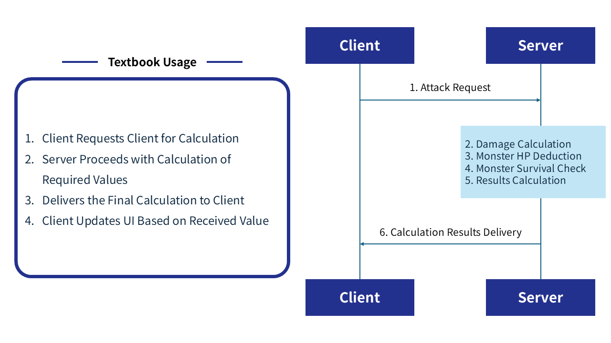
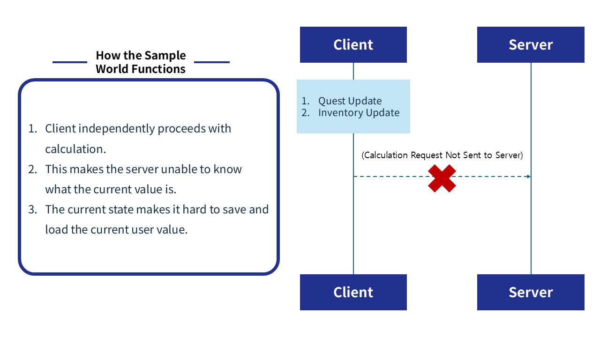
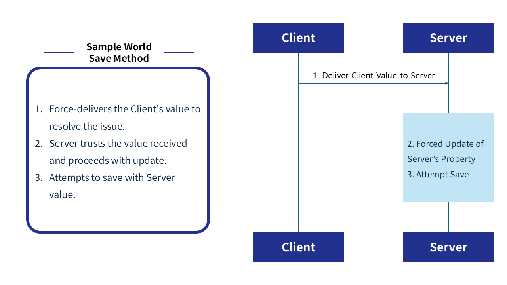

# [📖 Advanced Training] Saves Using DataStorage, Implementing Loading
<br>
<br>
<br>

## Video Timeline
- You can follow along by using the timeline under the training video.
- Utilizing DataStorage: `01:32:52`

<br>

## Learning Goals
- Implement a saving function for player data by using DataStorage.
- Implement a loading function for player data by using DataStorage.
- Implement a function so that the player can continue from their last save point once it's loaded.

<br>

## Practical Exercises to Do After Watching the Video
- Compose the Title screen and create a load function.
- Place an entity that serves the save function so that the function can be executed.
- Check if saving and loading of the player's quest information is working as intended by expanding quest.

<br>

## Implementing Saving and Loading

<p align="center">

</p>

> This is an AI image created with Gemini.

- If a player is unable to save their progress after a long gameplay session, it may discourage them.
- To address this concern, you must make a function that can save and load player information.
- MapleStory Worlds provides the DataStorage API so that saving and loading data is possible.

<br>

## DataStorageService
- `DataStorageService` provides various DataStorage access functions.
- The main function used in the sample world is `GetUserStorage`, `GetAndWait`, and `SetAndWait`.
    - `GetUserDataStorage`: The function that loads the UserDataStorage of a certain user.
    - `GetAndWait`: Fetches a specific key value from information loaded from `GetUserDataStorage`.
    - `SetAndWait`: Saves the value based on the key in `GetUserDataStorage`.
- If you want to see more functions, click on `Help`, `API Reference` from the top of the MapleStory Worlds editor and search for `DataStorageService` in the page to see more functions.

<br>

## Creating DataStorageLogic
- Right-click `MyDesk` from `Workspace`.
- Create Logic through `Create Scripts` and `Create Logic`.
- Change the created Logic's name to `DataStorageLogic`.

```lua
@Logic
script DataStorageLogic extends Logic

@Sync
property string lastMapName = ""

@Sync
property Vector3 lastPosition = Vector3.zero

property string localUserID = ""

property table userInventory = {}

@Sync
property string questID = ""

@ExecSpace("ClientOnly")
method void OnBeginPlay()
-- Saves a local player's user ID.
self.localUserID = _UserService.LocalPlayer.PlayerComponent.UserId
-- Delivers and registers a local player's user ID to the server script.
self:SendUserIDToServer(self.localUserID)
end

@ExecSpace("Server")
method void SavePlayerData()
-- Loads user data storage from the server.
local userDataStorage = _DataStorageService:GetUserDataStorage(self.localUserID)
-- Saves the name of the map the player is currently in.
userDataStorage:SetAndWait("lastMapName", self.lastMapName)
-- Saves the current player's position.
userDataStorage:SetAndWait("lastPosition", tostring(self.lastPosition))
-- Saves the quest ID that the current player is playing through.
userDataStorage:SetAndWait("QuestID", self.questID)
-- Saves the current user's inventory state as a JSON.
local jsonString = _HttpService:JSONEncode(self.userInventory)
userDataStorage:SetAndWait("InventoryData", jsonString)
log("Inventory Save Complete")
end

@ExecSpace("Server")
method void LoadPlayerData()
-- Loads user data storage from the server.
local userDataStorage = _DataStorageService:GetUserDataStorage(self.localUserID)
-- Halts code execution if the data storage received is empty.
if userDataStorage == nil then 
	return
end
-- Loads the lastMapName value storage from the server.
local errorCode, mapName = userDataStorage:GetAndWait("lastMapName")
-- Loads the lastPosition value, which is the saved value of the last position.
local errorCodePos, posString = userDataStorage:GetAndWait("lastPosition")
-- Loads the user's inventory information.
local itemErrorCode, jsonData = userDataStorage:GetAndWait("InventoryData")
-- Loads the quest information that the user is playing through.
local questErrorCode, questData = userDataStorage:GetAndWait("QuestID")

-- Please confirm whether the error code from each piece of data loaded is 0 (success).
-- Registers the last map position.
if errorCode == 0 then
	if _UtilLogic:IsNilorEmptyString(mapName) then
		return
	else
		self.lastMapName = mapName
	end
else
	log("Can't load lastMapName!")
	return
end
-- Loads the last character's position and registers that position.
if errorCodePos == 0 then
	self.lastPosition = Vector3(0, 0, 0)
	local clean_text, arr = string.gsub(posString, "[%(%)]", "")
	local coords = _UtilLogic:Split(clean_text, ",")
	if #coords == 3 then
		self.lastPosition.x = tonumber(coords[1])
		self.lastPosition.y = tonumber(coords[2])
		self.lastPosition.z = tonumber(coords[3])
	end
else
	log("Can't load lastPosition!")
end
-- Loads inventory data and then registers inventory data.
if #coords == 0 then
	-- Leaves a log if there is no loaded inventory data.
	if _UtilLogic:IsNilorEmptyString(jsonData) then
		log("There is no loaded item data!")
	else
		-- Registers item data if there is a normal value.
		local itemData = _HttpService:JSONDecode(jsonData)
    	log("Loaded Item ID: " .. itemData[1].ItemID)
		self.userInventory = itemData
		log("Inventory loaded.")
		self:UpdateClientUserInventory(self.userInventory)
	end    
else
	log("Failed to load inventory data.")
end
-- Registers quest data.
if questErrorCode == 0 then
	self.questID = questData
	self:UpdateClientQuestData(questData)
else
	log("Failed to load QuestData from the server.")
end

log("Data Load Complete: " .. self.lastMapName .. " / " .. tostring(self.lastPosition))
log("InventoryData loaded.")
-- Resets the inventory and quest information windows, since the data registration is complete.
self:SetUserInventoryData()
self:SetClientQuestData()
return
end

@ExecSpace("Client")
method void RequestSaveData()
-- Searches for a local player entity and pre-loads the necessary data.
local userEntity = _UserService.LocalPlayer
local userItemData = userEntity.PlayerItemComponent.playerInventory
self.userInventory = userItemData
local questID = userEntity.PlayerQuestComponent.currentQuestData
-- Updates values that will be saved in advance before executing the save to the server.
self:UpdateServerItemData(userItemData)
self:UpdateServerMapData(userEntity.CurrentMapName, userEntity.TransformComponent.Position)
self:UpdateServerQuestData(questID.QuestID)
-- Requests the server to save information.
self:SavePlayerData()
end

@ExecSpace("Client")
method void SendUserIDToServer(string UserID)
-- A Method used to deliver the local player's ID value to the server.
self:UpdateServerUserID(UserID)
end

@ExecSpace("Server")
method void UpdateServerUserID(string UserID)
-- Executed in the server to register the local player's ID value.
self.localUserID = UserID
end

@ExecSpace("Server")
method void UpdateServerMapData(string CurrentMapName, Vector3 CurrentPosition)
-- Registers the name of the map and the character's position in it to the server.
self.lastMapName = CurrentMapName
self.lastPosition = CurrentPosition
end

@ExecSpace("Server")
method void UpdateServerItemData(table ItemData)
-- Registers the current user's inventory information to the server.
self.userInventory = ItemData
end

@ExecSpace("Client")
method void SetUserInventoryData()
-- A Method that executes an inventory update when the server registers items to the inventory one at a time.
local localUser = _UserService.LocalPlayer
for i = 1, #self.userInventory do
	local addItemEvent = OnPlayerLootItem()
	addItemEvent.ItemID = self.userInventory[i].ItemID
	addItemEvent.ItemCount = self.userInventory[i].ItemCount
	localUser:SendEvent(addItemEvent)
end
end

@ExecSpace("Client")
method void UpdateClientUserInventory(table UserInventory)
-- A Method that requests the server to update user inventory information.
self.userInventory = UserInventory
end

@ExecSpace("Server")
method void UpdateServerQuestData(string QuestID)
-- Registers the current QuestID to the server.
self.questID = QuestID
end

@ExecSpace("Client")
method void SetClientQuestData()
-- Calls Logic, so the UI is updated in accordance with the current Quest in progress.
_QuestLogic:SetQuestDataByQuestID(self.questID)
end

@ExecSpace("Client")
method void UpdateClientQuestData(string QuestID)
-- Requests that the server register the current QuestID.
self.questID = QuestID
end

@ExecSpace("Client")
method string RequestLoadData()
if not (_UtilLogic:IsNilorEmptyString(self.lastMapName)) then
	return self.lastMapName
else
	-- Requests that the player's information be loaded.
	self:LoadPlayerData()
	wait(1)
	return self.lastMapName
end
end

end
```

> This code is written based on Plain Text.

- `SavePlayerData` and `LoadPlayerData` of this Logic execute the function of saving and loading player information to and from the server.
- The sample world works based on the Client, so the function is requested by `RequestSaveData` and `RequestLoadData`, so the Client can request the function from the Server.

<br>

## Problems in the Sample World

<br>

### The Ideal Server and Client Structure
<p align="center">

</p>

- When the Client requests a calculation, the Server proceeds with the calculation.
- Used as a form of the Client updating the value received from Server.
- The Server proceeds with the update, since this method has the Server calculate all values.

### ⚠️ Structure of the Sample World
<p align="center">

</p>

- The sample world is composed to function based on the Client.
- So no processing or changing of values requests are sent to the Server.
- This structure means that the Server doesn't hold or calculate any value.
- Since the Server has no value, there is the issue of only saving empty values when proceeding with a save.

### ⚠️ Sample World Solution
<p align="center">

</p>

- To solve this issue, the sample world forcefully delivers values to the Server.
- The following Methods are executed in `DataStorageLogic`.
    - `UpdateServerUserID`
    - `UpdateServerMapData`
    - `UpdateServerItemData`
    - `UpdateClientUserInventory`
    - `UpdateClientQuestData`
- It takes the form of executing the relevant Methods and then sends a save request for the values delivered to the Server.

<br>

### ⚠️ Problems and Solutions
- Problems
    - Since the Server uses an unverified value as-is, it is vulnerable to data manipulation.
    - This can prove to be an obstacle for proceeding with commercialization.
    - Also, since the Server doesn't proceed with calculations, the data security is quite low.
- Solutions
    - Compose a function that allows the Server to calculate various information, such as the player's quest, item, and other such information.
    - Compose a Client function that only updates the UI based on the Data received from the Server.

<br>

## Minimum Implementation Standards
- The player's information must be saved.
- Implement a function that enables a player to continue from the previous save point when they decide to load a previous save.


## Usage and Extension Direction
- Proceed with refactoring so that the values can be updated from Server by using the synchronization function between Server and Client.
- Optimize the save Method's processing method in accordance with the synchronization function.