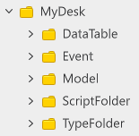

# 어드벤처 월드 학습 가이드 문서
 
 
 

## 학습 목표

- 가이드 문서와 샘플 월드를 통하여 어드벤처 월드의 핵심 기능들을 구현하는 방법에 대해 학습합니다.
- 메이플스토리 월드의 Event에 대해 학습하고 활용 방법에 대해 학습합니다.
- Event를 활용하여 각 스크립트간 연결성을 느슨하게 만드는 방법에 대해 학습합니다.
- 제작된 월드를 원하는 형태로 가공하고 제작할 수 있습니다.
 

---

 

## 학습 핵심 기능

- **Event 활용**: 제작자가 직접 커스텀 이벤트를 생성하여 Event를 수신했을 경우, 관련된 처리를 제작하는 방법에 대해 학습합니다.
- **퀘스트 시스템 제작**: 조건에 따라 Event를 통해 클리어 여부를 검사하고, 처리를 진행할 수 있도록 시스템을 제작할 수 있습니다.

 

## 폴더 구성

- DataTable: 어드벤처 월드에서 사용되는 데이터를 관리하기 위한 DataSet을 모아 둔 폴더입니다.
    - DataSet: 게임의 정보를 관리하는 DataSet을 담은 폴더입니다.
    - Localization: 번역과 관련된 테이블인 LocaleDataSet을 담은 폴더입니다.
- Event: 샘플 월드에서 직접 제작한 Event들을 담은 폴더입니다.
- Model: 샘플 월드에서 Model로 제작한 엔티티를 담은 폴더입니다.
- ScriptFolder: 월드에서 사용되는 모든 Script들을 담은 Folder입니다.
    - ComponentFolder: Component Script를 담은 폴더입니다.
    - LogicFolder: Logic Script를 담은 폴더입니다.
- TypeFolder: Type Script를 담은 폴더입니다.

 

## 구현 순서

- 💡 **기초 학습**: 메이플스토리 월드의 기초적인, 또는 해당 장르의 가장 기초적인 기능을 담은 학습 항목입니다.
- 📖 **심화 학습**: 샘플 월드에 구현된 기능을 학습하고 구현하는 항목입니다. 해당 과정의 학습을 통해 장르의 기능 확장과 학습 이해도를 넓힐 수 있습니다.

 

### [💡 기초 학습] 1. 월드 환경 구성하기
- 메이플스토리 월드에서 TileMap의 특징에 대해 학습합니다.
- TileMap에서 Tile을 배치하는 방법에 대해 학습합니다.
- RigidbodyComponent의 Property 구성에 대해 학습하고, 어떤 역할을 하는지 이해합니다.

 

### [💡 기초 학습] 2. 캐릭터 위치 이동 구현하기
- TeleportService를 통한 캐릭터의 이동 방법에 대해 학습합니다.
- PortalComponent를 활용하여 캐릭터를 이동하는 방법에 대해 학습합니다.
- TeleportService와 PortalComponent의 차이를 학습하여 어떤 상황에 어떤 형태로 이동을 구현해야 하는지 판단할 수 있습니다.

 

### [💡 기초 학습] 3. 스크립트 출력 기능 구현하기
- NPC 또는 퀘스트 진행 중 스토리를 출력하는 기능인 스크립트 출력 기능을 구현합니다.
- DataSet을 활용하여 추가적인 스크립트를 출력할 수 있습니다.
- 기능의 구성을 파악하고, 개선 방법을 구상하고 확장할 수 있습니다.

 

### [💡 기초 학습] 4. 엔티티 상호작용 기능 구현하기
- map에 배치된 엔티티와 플레이어가 상호작용을 할 수 있도록 기능을 구현합니다.
- 오브젝트와 상호작용을 통해 대화, 조사, 저장 등 상호작용 기능을 구현한 방법에 대해 학습합니다.
- 샘플 월드에서 구현한 기능 외에도 추가적인 기능을 개발하는 방법에 대해 학습합니다.

 

### [💡 기초 학습] 5. 인벤토리 기능 구현하기
- 플레이어가 습득한 아이템을 출력할 수 있는 인벤토리를 제작합니다.
- 아이템의 정보를 출력하고, 상세한 정보를 확인할 수 있는 기능을 구현합니다.

 

### [💡 기초 학습] 6. 퀘스트 시스템 구현하기
- 퀘스트를 구성하기 위한 DataSet의 구성에 대해 학습합니다.
- 플레이어의 행동에 따라 퀘스트의 클리어 여부를 검증할 수 있도록 기능을 구현합니다.
- 퀘스트 시스템을 구성하기 위해 Event를 활용하는 방법을 학습합니다.

 

### [📖 심화 학습] 7. 이벤트 기능 구현하기
- 메이플스토리 월드가 제공하는 기능인 Event에 대해 학습합니다.
- Event의 특성에 대해 학습하고, 활용 방법을 설계할 수 있습니다.
- Event의 장점과 단점을 학습하고, Event와 Logic중 조건 및 상황에 따라 선택할 수 있습니다.

 

### [📖 심화 학습] 8. DataStorage를 활용한 저장, 불러오기 기능 구현하기
- DataStorageService를 활용하여 플레이어의 정보를 저장, 불러오는 기능을 구현할 수 있습니다.
- DataStorageService의 기능을 이해하고, 제작하려는 월드의 형태에 따라 저장하는 방법을 설계할 수 있습니다.