# [💡 기초 학습] 월드 환경 구성하기
 
 
 

## 영상 타임라인
- 강의 영상내 아래의 타임라인에서 학습할 수 있습니다.
- 월드 환경 구성하기: `00:02:50`

 

## 학습 목표

- 메이플스토리 월드에서 TileMap의 특징에 대해 학습합니다.
- TileMap에서 Tile을 배치하는 방법에 대해 학습합니다.
- RigidbodyComponent의 Property 구성에 대해 학습하고, 어떤 역할을 하는지 이해합니다.

 

## 해당 영상 시청 후 수행해 볼 내용

- Tile을 직접 배치하여 어드벤처 월드를 구성할 발판을 배치하여 맵을 형성할 수 있습니다.
- RigidbodyComponent를 활용하여 제작하려는 월드의 특성에 맞춰 설정값을 변경할 수 있습니다.

 

## TileMap 설정하기

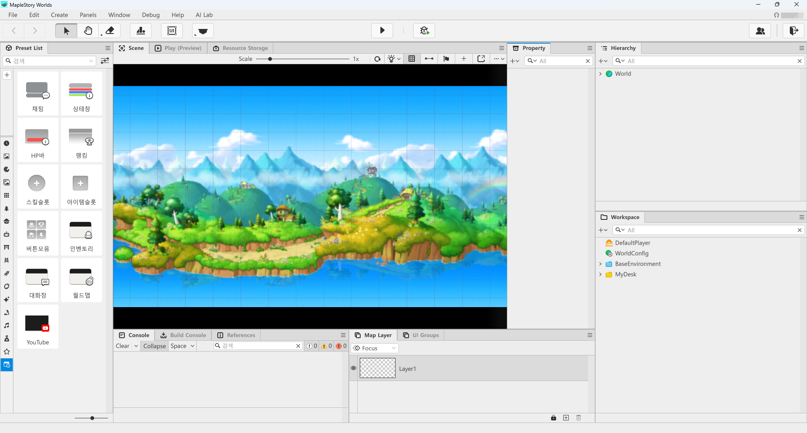

> 월드를 처음 만들 경우, 기본으로 설정된 맵 방식은 TileMap입니다.

- 메이플스토리 월드에서 월드를 처음 생성할 경우 기본 맵 방식은 TileMap으로 설정됩니다.
- TileMap을 사용하실 경우, 추가적인 설정이 필요하지 않습니다.

 

### ℹ️ 맵 형식 변경하기

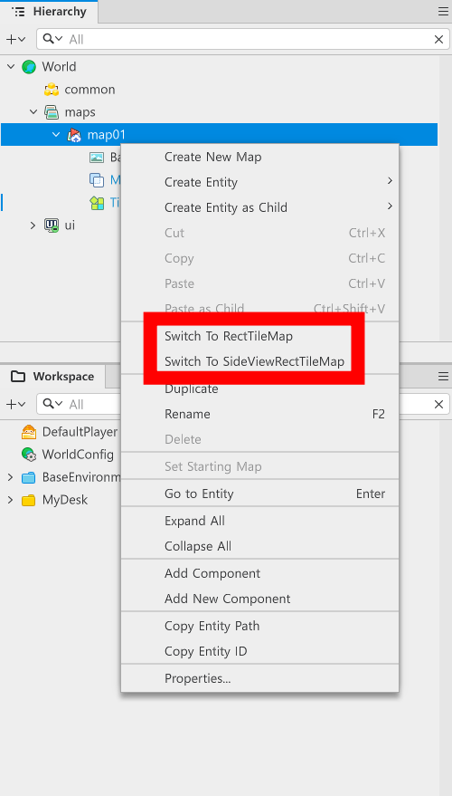

- 맵 형식을 변경해야 하는 경우, 또는 현재 맵의 상태를 확인하고 싶을 경우가 있습니다.
- `Hierarchy` 창에서 `maps` 안에 있는 map을 마우스 우클릭합니다.
- `Switch To ···`라 표기되는 메뉴에 따라 맵을 변경할 수 있습니다.
    - 이 때 출력되는 맵의 종류는 현재의 맵 상태를 제외한 맵들이 출력됩니다.
    - EX: 현재 맵이 TileMap일 경우
        - `Switch To RectTileMap`
        - `Switch To SideViewRectTileMap`

 

## TileMap의 특성

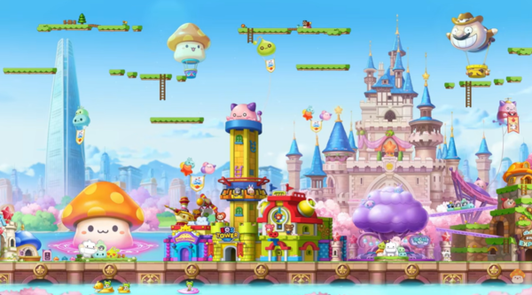

> 메이플스토리 23주년 기념 이벤트 맵 석촌호수, ©넥슨

- TileMap은 횡스크롤 형태의 게임을 제작할 때 특화된 맵 형식입니다.
- 메이플스토리와 가장 유사한 조작감을 제공하는 맵 형태입니다.
- 메이플스토리가 제공하는 Tile Preset을 활용하여 맵의 발판을 배치할 수 있습니다.
- Tile Preset을 활용하여 경사로를 제작하거나 벽을 제작할 수 있습니다.

 

### Tile 배치하기

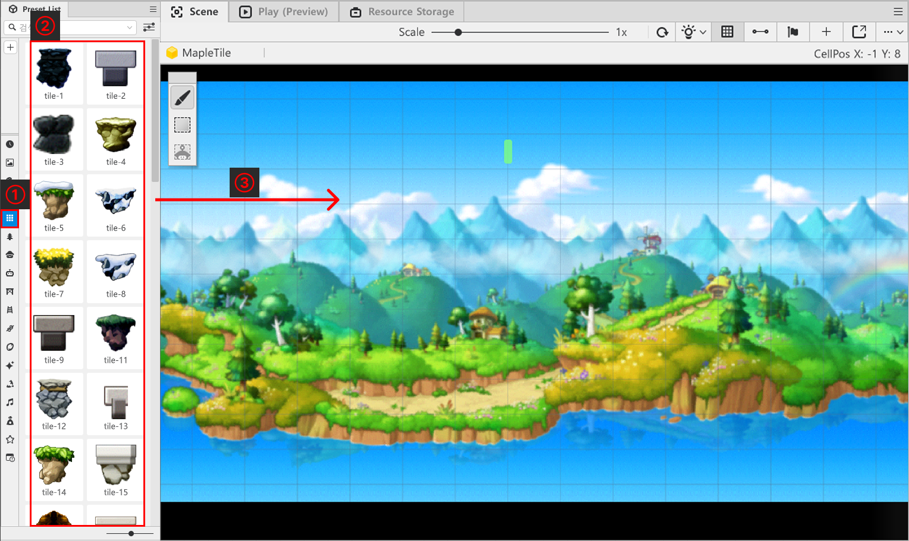

- 메이플스토리 월드 좌측에 있는 `Preset List`에서 `Tile`을 클릭합니다.
- 원하는 디자인의 `Tile`을 선택합니다.

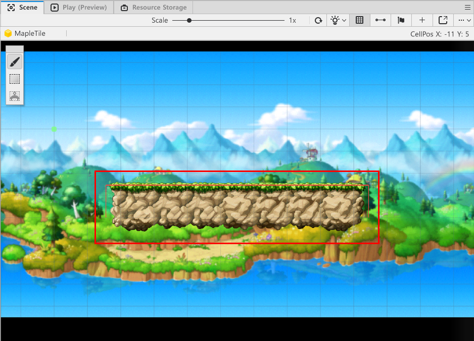

- `Scene` 화면에 마우스 클릭 또는 드래그를 통해 Tile을 배치할 수 있습니다.

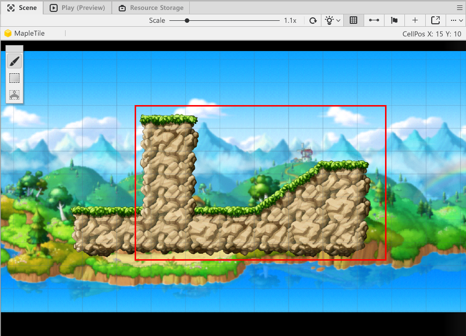

- 배치에 따라 벽 또는 경사로를 제작할 수 있습니다.

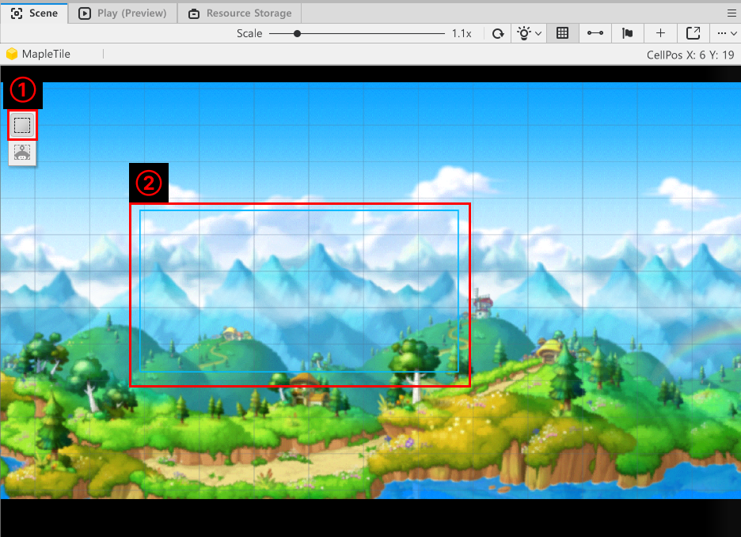
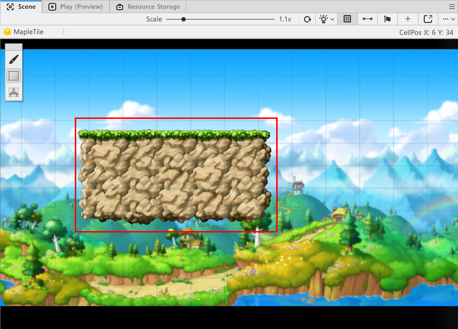

- `Scene` 화면의 좌측 상단의 네모 버튼을 클릭한 뒤, 마우스 드래그를 통해 범위로 Tile을 배치할 수 있습니다.

 

#### ⚠️ Preset List 창이 보이지 않습니다!

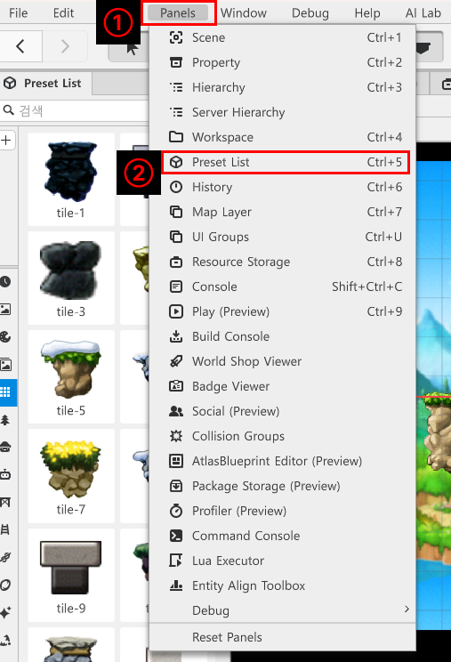

- 메이플스토리 월드 에디터의 상단 메뉴에서 `Panels`를 클릭합니다.
- 메뉴에서 `Preset List`를 클릭합니다.
- 생성된 `Preset List`창을 원하는 위치에 배치하여 마무리합니다.
    - 원하는 창이 보이지 않을 경우, `Panels`를 통하여 모두 찾을 수 있습니다.
    - 자주 사용되는 창일 경우, 단축키가 지정되어 있으니 단축키를 통해 창을 열 수 있습니다.

 

#### 💬 배치된 Tile을 지우려면 어떻게 해야 하나요?

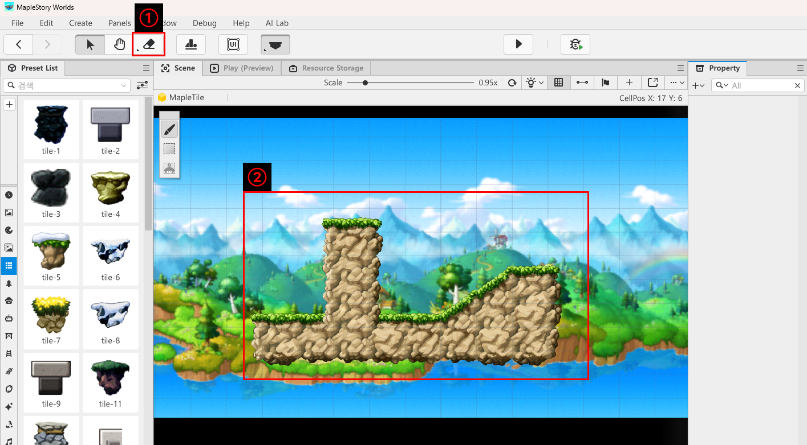

- 메이플스토리 월드 에디터 화면의 상단에 있는 지우개 버튼을 클릭합니다.
- `Scene`에 배치된 Tile을 클릭하여 배치된 Tile을 지울 수 있습니다.
    - 지우개가 아닌 마우스 포인터 상태일 경우, 마우스 우클릭을 통해서도 Tile을 제거할 수 있습니다.

 

## Tile 종류 확장하기

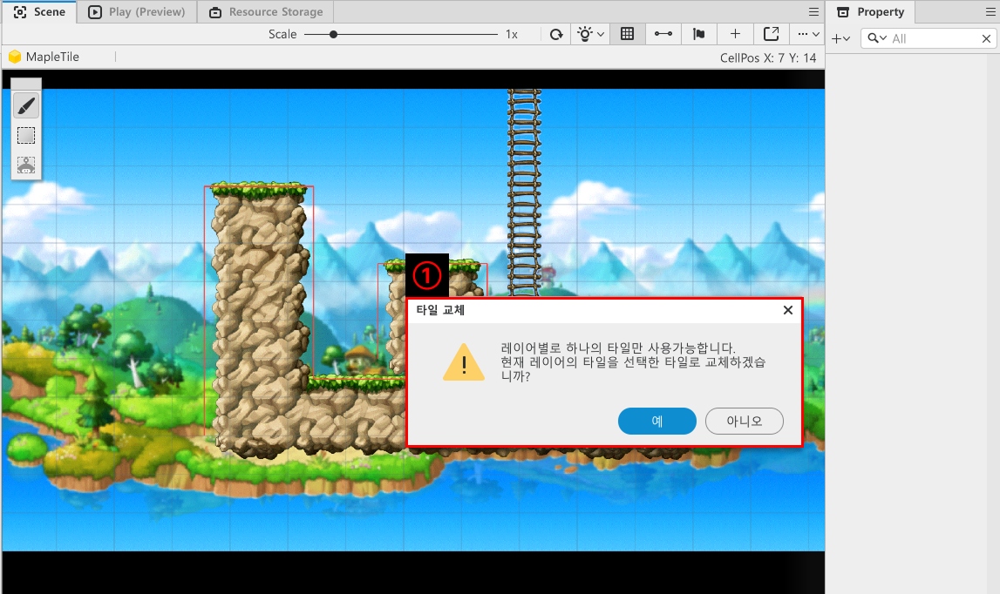

- 하나의 Layer에 2개 이상의 Tile을 사용할 수 없습니다.
- 따라서 하나의 맵에 2개 이상의 Tile을 사용하고 싶을 경우, Layer를 추가해야 합니다.

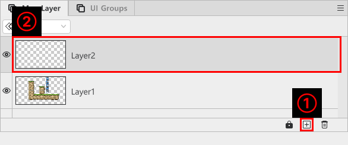

- 화면 하단의 `Map Layer`창에서 + 버튼을 클릭합니다.

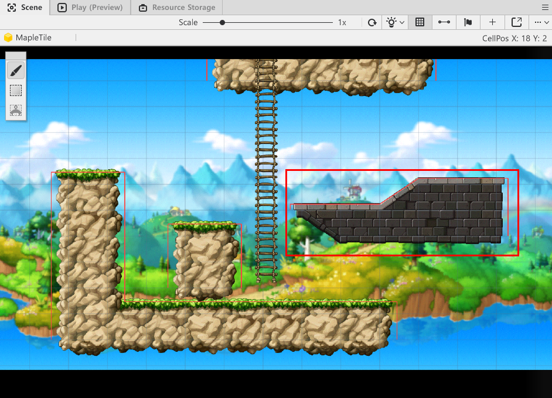

- 새롭게 생성된 `Layer2`를 클릭한 뒤, 원하는 Tile을 선택한 뒤 `Scene`화면에 배치합니다.

 

## RigidbodyComponent 이해하기

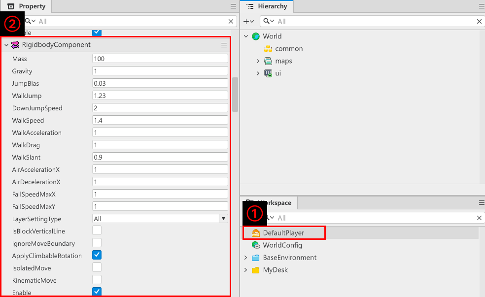

- 메이플스토리 월드에서 엔티티가 맵과 상호작용하기 위해서는 bodyComponent가 필요합니다.
- TileMap에서 Tile과 엔티티가 상호작용을 할 수 있도록 만드는 Component는 RigidbodyComponent입니다.
- 플레이어에게 부여된 Component를 살펴보기 위해서는 `Workspace`에서 `DefaultPlayer`를 클릭한 뒤 `Property`창에서 볼 수 있습니다.

 

### ☑️ RigidbodyComponent의 역할

- TileMap과 엔티티가 상호작용을 할 수 있도록 만드는 Component입니다.
- 또한 엔티티에 질량, 가속도, 중력값 등 맵과 상호작용하기 위한 물리 값들을 조절할 수 있습니다.
- 만약 엔티티에 `RigidbodyComponent`가 존재하지 않을 경우, 엔티티는 TileMap의 Tile과 상호작용할 수 **없습니다**.

### RigidbodyComponent 속성 이해하기

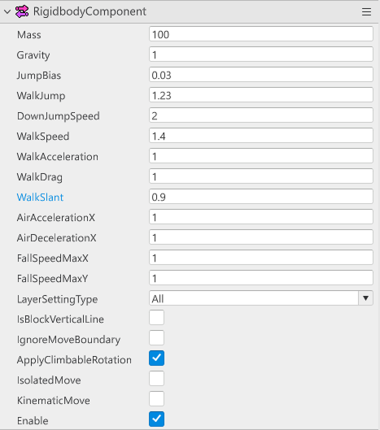

> Property창에서 볼 수 있는 RigidbodyComponent의 요소입니다.

<table class="tg"><thead>
  <tr>
    <th class="tg-9wq8">이름</th>
    <th class="tg-9wq8">설명</th>
  </tr></thead>
<tbody>
  <tr>
    <td class="tg-lboi">Mass</td>
    <td class="tg-lboi">질량을 설정하는 값입니다. 값이 작을수록 캐릭터가 이동 후 멈출 때 즉시 제자리에 정지합니다. 값이 클수록 빙판에 미끄러지듯 캐릭터가 멈춥니다.</td>
  </tr>
  <tr>
    <td class="tg-lboi">Gravity</td>
    <td class="tg-lboi">중력을 설정하는 값입니다. 값이 클 수록 캐릭터가 빠르게 공중에서 지상으로 내려옵니다. 값이 작을수록 캐릭터가 느리게 공중에서 지상으로 내려옵니다.</td>
  </tr>
  <tr>
    <td class="tg-lboi">JumpBias</td>
    <td class="tg-lboi">캐릭터의 점프 시작 위치를 설정합니다. 캐릭터가 점프 할 때 위치는 TransformComponent의 Position값 + JumpBias값입니다.</td>
  </tr>
  <tr>
    <td class="tg-lboi">WalkJump</td>
    <td class="tg-lboi">캐릭터의 점프 높이를 설정하는 값입니다. 값이 클수록 캐릭터가 높게 점프합니다.</td>
  </tr>
  <tr>
    <td class="tg-lboi">DownJumpSpeed</td>
    <td class="tg-lboi">캐릭터가 플랫폼 아래 방향으로 점프할 때 캐릭터가 뛰어 오르는 높이를 설정합니다. 값이 클수록 캐릭터가 아래 발판으로 점프할 때 높게 뛰어오릅니다.</td>
  </tr>
  <tr>
    <td class="tg-lboi">WalkSpeed</td>
    <td class="tg-lboi">캐릭터가 이동할 때 도달할 수 있는 최대 속도를 설정합니다. 값이 클 수록 캐릭터의 최대 이동속도가 빨라집니다.</td>
  </tr>
  <tr>
    <td class="tg-lboi">WalkAcceleration</td>
    <td class="tg-lboi">지형 이동 시 가감속을 결정하는 값입니다. 값이 클수록 빠르게 최대 속도에 도달합니다.</td>
  </tr>
  <tr>
    <td class="tg-lboi">WalkDrag</td>
    <td class="tg-lboi">지형 이동 시 미끄러짐에 저항하는 값입니다. 값이 클수록 미끄러지지 않고 빠르게 멈춥니다.</td>
  </tr>
  <tr>
    <td class="tg-lboi">WalkSlant</td>
    <td class="tg-lboi">지형 이동 시 경사로를 얼마나 잘 넘어가는지 설정하는 값입니다. 값이 작을수록 경사로를 올라가기 어려워집니다.</td>
  </tr>
  <tr>
    <td class="tg-lboi">AirAccelerationX</td>
    <td class="tg-lboi">공중에서 X축의 이동 속도를 설정합니다. 값이 클수록 공중에서 X축의 이동 속도가 빨라집니다.</td>
  </tr>
  <tr>
    <td class="tg-lboi">AirDecelerationX</td>
    <td class="tg-lboi">공중에서 X축의 입력이 없을 경우, 얼마나 빠르게 멈출지 설정하는 값입니다. 값이 클수록 공중에서 X축 입력이 없을 경우 빠르게 멈춥니다.</td>
  </tr>
  <tr>
    <td class="tg-lboi">FallSpeedMaxX</td>
    <td class="tg-lboi">공중에서 X축의 이동속도 최댓값을 제한합니다. 값이 클 수록 캐릭터가 공중에서 이동할 수 있는 속도의 최대치가 커집니다.</td>
  </tr>
  <tr>
    <td class="tg-lboi">FallSpeedMaxY</td>
    <td class="tg-lboi">공중에서 Y축의 이동속도 최댓값을 제한합니다. 값이 클 수록 공중에서 떨어지는 속도의 최대값이 증가합니다.</td>
  </tr>
  <tr>
    <td class="tg-lboi">LayerSettingType</td>
    <td class="tg-lboi">None, Climbable, All 3가지 형태의 값을 가집니다. 각 값에 따라 SortingLayer의 규칙을 변경할 수 있습니다.</td>
  </tr>
  <tr>
    <td class="tg-lboi">IsBlockVerticalLine</td>
    <td class="tg-lboi">수직으로 세워진 Tile이 있을 때, 캐릭터가 점프로 이동할 때 반드시 충돌하도록 설정하는 값입니다.</td>
  </tr>
  <tr>
    <td class="tg-lboi">IgnoreMoveBoundary</td>
    <td class="tg-lboi">맵 바운더리를 무시하고 캐릭터가 이동할 수 있게 설정하는 값입니다.</td>
  </tr>
  <tr>
    <td class="tg-lboi">ApplyClimbableRotation</td>
    <td class="tg-lboi">사다리, 로프와 같은 엔티티에 캐릭터가 매달릴 경우 캐릭터가 회전할지 결정하는 값입니다. 해당 값이 True일 경우, 사다리나 로프가 회전되어 있을 때 캐릭터도 같이 회전한 이미지가 출력됩니다.</td>
  </tr>
  <tr>
    <td class="tg-lboi">IsolatedMove</td>
    <td class="tg-lboi">발판 끝에 도달하더라도 캐릭터가 떨어지지 않도록 설정하는 값입니다. 해당 값이 True일 경우, 캐릭터가 Tile 발판의 끝에 도달해도 떨어지지 않습니다.</td>
  </tr>
  <tr>
    <td class="tg-lboi">KinematicMove</td>
    <td class="tg-lboi">TileMap 방식인 횡스크롤 형태의 이동이 아닌 4방향, 8방향 이동이 가능한 형태로 변경합니다.</td>
  </tr>
</tbody></table>

## 최소 구현 기준

- 플레이어 캐릭터가 맵을 돌아다닐 수 있는 Map을 구성합니다.
- 필요에 따라 제작하려는 게임의 의도에 맞게 플레이어 캐릭터의 물리 설정을 변경할 수 있습니다.

 

## 응용 및 확장 방향

- 다양한 Map을 제작하여 더 많은 공간을 설계합니다.
- Map이 특색을 가지고 있으며, 특색에 맞춰 다양한 Map을 구성할 수 있습니다.