# [💡 기초 학습] 스크립트 출력 기능 구현하기
<br>
<br>
<br>

## 영상 타임라인
- 강의 영상내 아래의 타임라인에서 학습할 수 있습니다.
- 스크립트 출력 기능 구현하기: `00:20:14`

<br>

## 학습 목표
- 플레이어가 NPC와의 대화 또는 스토리 진행을 위한 스크립트 출력 기능을 구현합니다.
- 대사를 출력하기 위한 DataSet의 제작 및 사용 방법을 학습합니다.
- UI를 구성하는 방법에 대해 학습하고 직접 구현합니다.
- 로컬라이징을 위한 방법에 대해 학습합니다.

<br>

## 해당 영상 시청 후 수행해 볼 내용
- 원하는 스토리가 출력될 수 있도록 DataSet의 내용 및 LocaleDataSet을 수정합니다.
- 제작한 UI의 이미지 리소스를 직접 교체하여 미관성 좋은 UI로 재편성합니다.
- 메이플스토리 월드가 제공하는 `Dialog` 패키지의 구성을 이해하고 사용합니다.

<br>

## 스크립트 기능이란?

<p align="center">
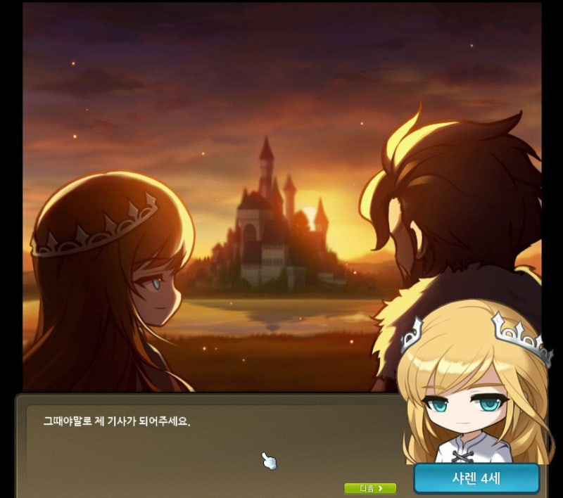
</p>

> 메이플스토리의 차원의 도서관 스토리, 샤레니안의 기사

- 스크립트 기능은 다양한 게임에서 사용되는 기능입니다.
- 캐릭터의 대사, 독백, 내레이션 등 다양한 화자를 통하여 게임의 세계관을 전달하는 역할을 수행합니다.
- 또한 캐릭터의 서사, 게임의 분위기 등을 직접적으로 풀어낼 수 있는 요소로도 사용됩니다.

<br>

### 스크립트의 구성 요소 살펴보기

- 스크립트의 기능은 어떻게 구성하는지에 따라 다양한 요소가 들어갈 수 있습니다.
- 따라서 제작하려는 게임이 스토리를 제공하려는 방식에 따라 제작의 방법이 바뀔 수 있습니다.
- 하지만 기초가 되는 요소는 다음의 구성 요소를 가지고 있습니다.

<p align="center">
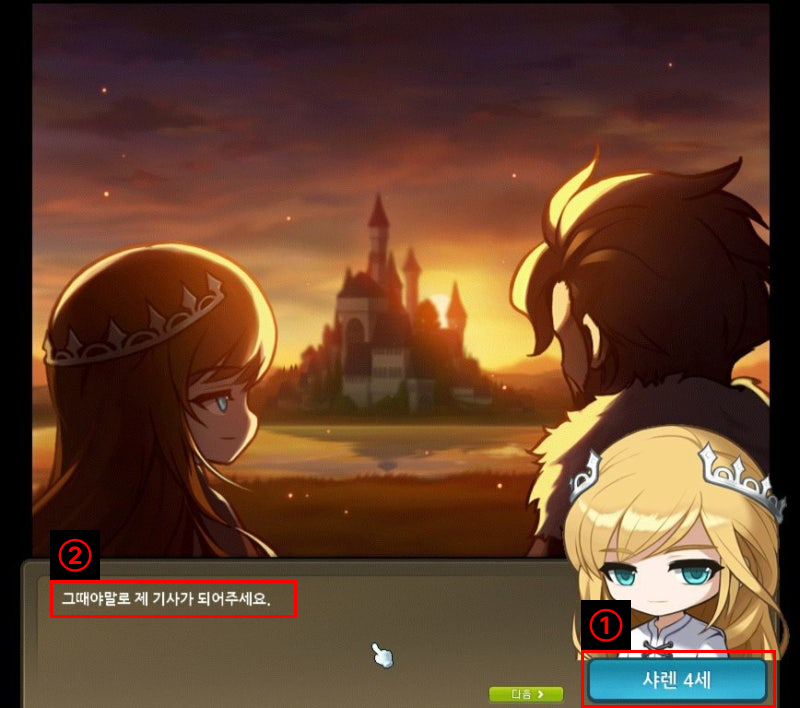
</p>

- **이름 출력**: 말하는 화자가 누구인지 표시하는 창입니다. NPC의 이름, 플레이어의 이름이 출력될 수 있으며 내레이션일 경우 출력하지 않는 등 다양한 방식으로 사용됩니다.
- **텍스트 출력창**: 화자가 말하려는 내용을 출력하는 창입니다. 캐릭터의 대사를 단순하게 출력하거나 특정 텍스트만 색상을 변경하여 특정 텍스트를 강조할 수 있습니다.
- 샘플 월드에서는 2가지의 내용이 출력될 수 있도록 기능을 구성할 예정입니다.

<br>

## UI 구성하기

<br>

### 프레임 생성하기
<p align="center">
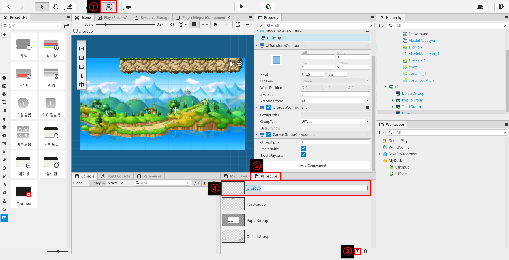
</p>

- 메이플스토리 월드 에디터 상단의 `UI`버튼을 클릭합니다.
- 화면 하단의 `UI Groups`를 클릭합니다.
- `UI Groups` 창 하단의 + 버튼을 클릭합니다.
- 새롭게 추가된 UIGroup의 이름을 DialogueUI로 변경합니다.

<p align="center">
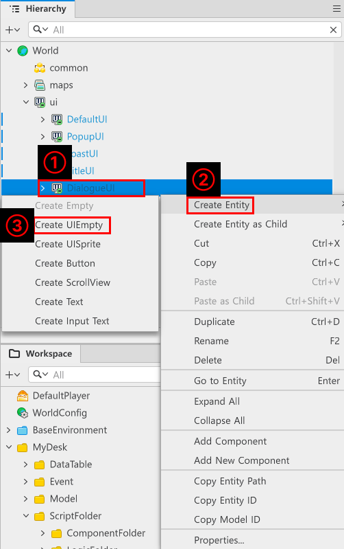
</p>

- `Hierarchy`창에서 `ui`, `DialogueUI`를 찾아 우클릭합니다.
- `Create Entity`, `Create UIEmpty`를 클릭하여 빈 UI 엔티티를 3개 생성합니다.
- 생성한 엔티티의 이름을 각각 `DialogueFrame`, `NameFrame`, `ClickArea`로 변경합니다.
- 생성된 UI 엔티티는 다음의 목적으로 사용됩니다.
    - **DialogueFrame**: 화자의 대사가 출력되는 창의 역할을 합니다.
    - **NameFrame**: 화자의 이름을 출력하는 창의 역할을 합니다.
    - **ClickArea**: 플레이어가 마우스 클릭 또는 터치 시 다음 대사를 출력하는 기능을 수행합니다.

<p align="center">
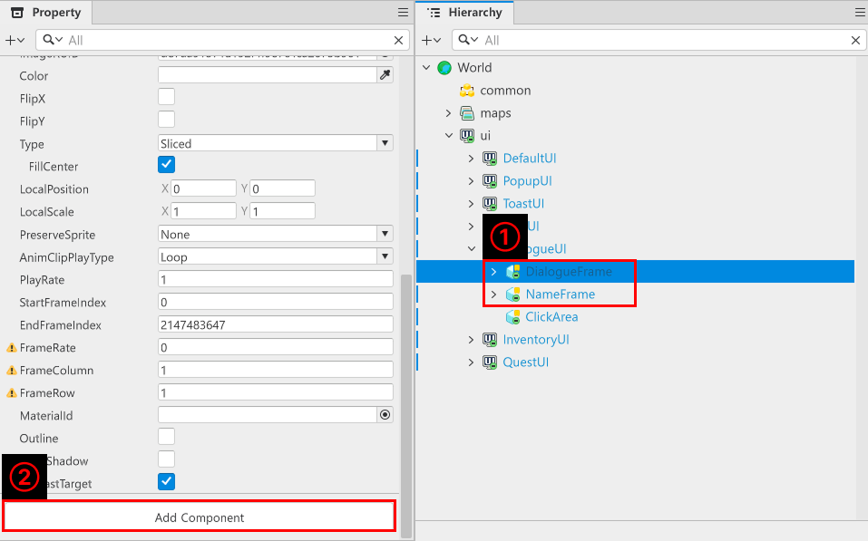
</p>

- 생선한 `DialogueFrame`과 `NameFrame`을 클릭한 뒤 `Property` 창에서 `Add Component`를 클릭합니다.
- 각 엔티티에 `SpriteGUIRendererComponent`를 추가합니다. 

<p align="center">
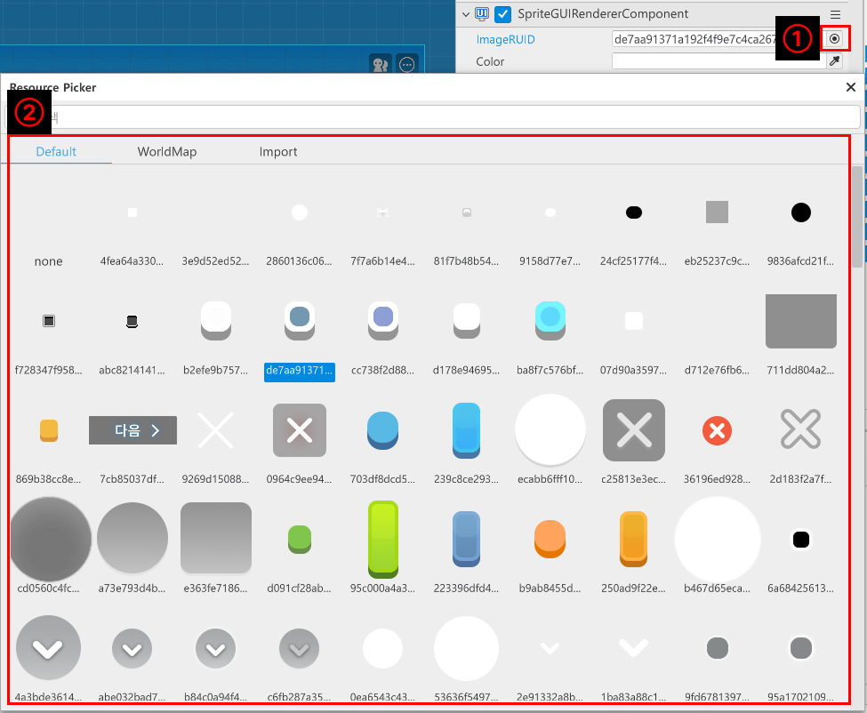
</p>

- `Property`창에서 `SpriteGUIRendererComponent`를 찾은 뒤 우측의 버튼을 클릭합니다.
- `Resource Picker`창에서 텍스트 배경, 이름 배경으로 사용 할 이미지 리소스를 찾아 클릭합니다.

<p align="center">
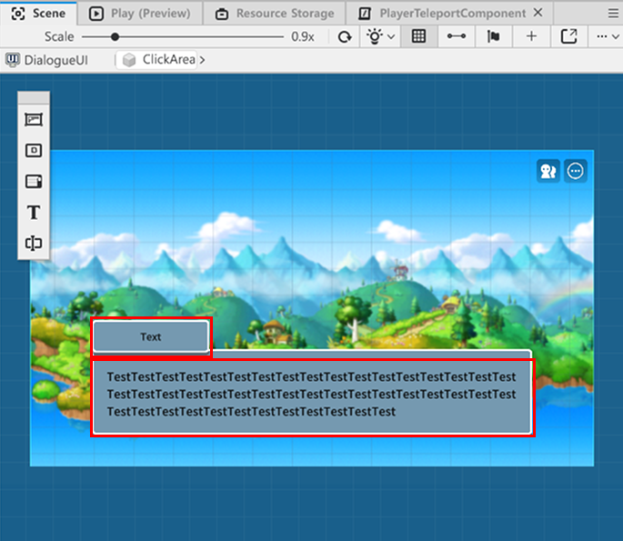
</p>

- 배경의 크기, 위치를 조정하여 텍스트와 이름 배경의 배치를 완료합니다.

<p align="center">
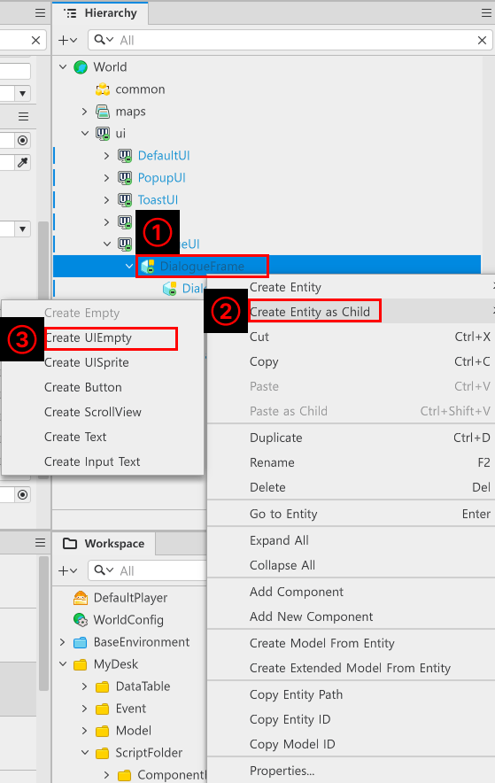
</p>

- 생성한 `DialogueFrame`, `NameFrame` 엔티티를 마우스 우클릭한 뒤 `Create Entity as Child`를 클릭합니다.
- Create UIEmpty를 클릭하여 빈 UI 엔티티를 자식 엔티티로 생성합니다.
- 생성한 자식 엔티티의 이름을 각각 `DialogueText`, `NameText`로 생성합니다.
- 생성한 엔티티에 `Add Component`를 활용하여 `TextGUIRendererComponent`를 추가합니다.

<p align="center">
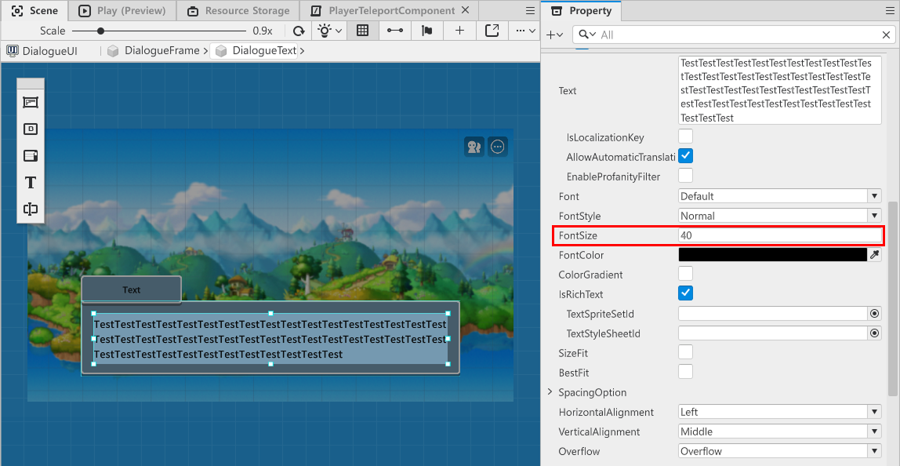
</p>

- 각 텍스트를 적당한 텍스트 크기가 되도록 `Property` 창에서 `FontSize`의 값을 수정합니다.

<p align="center">
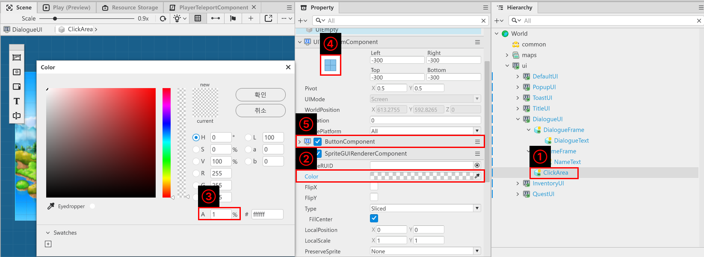
</p>

- `ClickArea` 엔티티에 AddComponent로 `SpriteGUIRendererComponent`를 추가합니다.
- `Color`를 클릭한 뒤 `Alpha`값을 1로 변경하여 투명하게 만듭니다.
- `UITransformComponent`의 Anchor를 화면 전체(파란색 박스로 찬 UI 버튼)로 선택한 뒤 Left, Right, Top, Bottom의 값을 모두 -300으로 설정합니다.
- 마지막으로 `ButtonComponent`를 추가하여 `ClickArea`가 버튼의 역할을 할 수 있도록 Component를 추가합니다.

- 샘플 월드 기준으로는 `Hierarchy`창에서 `World`, `ui`, `DialogueUI`에서 확인할 수 있습니다.

<br>

### DataSet 제작하기

<p align="center">
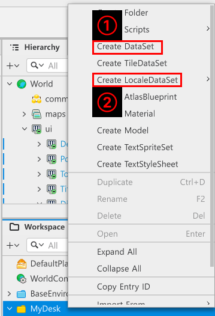
</p>

- `Workspace`, `MyDesk`를 우클릭 한 뒤 `Create DataSet`, `Create LocaleDataSet`을 제작합니다.
- 제작된 DataSet의 이름을 `DialogueData`로 수정합니다.
    - **DialogueData**: 출력해야 하는 데이터를 모아두는 DataSet입니다.
- `Create LocaleDataSet`으로는 `Default`로 2개의 LocaleDataSet을 제작합니다.
- 각 LocaleDataSet의 이름을 `CharacterNameStringData`, `DialogueLocalizeData`로 제작합니다.
    - **CharacterNameStringData**: 캐릭터의 이름을 로컬라이징 하기 위한 LocaleDataSet입니다.
    - **DialogueLocalizeData**: 출력해야 하는 텍스트를 로컬라이징 하기 위한 LocaleDataSet입니다.

<p align="center">
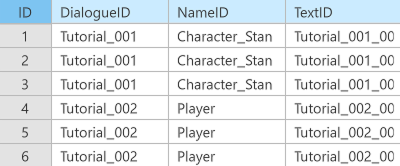
</p>

- `DialogueData`의 구성입니다.
<table class="tg"><thead>
  <tr>
    <th class="tg-9wq8">이름</th>
    <th class="tg-9wq8">설명</th>
  </tr></thead>
<tbody>
  <tr>
    <td class="tg-lboi">DialogueID</td>
    <td class="tg-lboi">해당 대사가 어떤 그룹의 대사인지 구분하기 위한 ID값입니다.<br>해당 값을 기준으로 동일한 ID값인 요소들 끼리 묶은 뒤 순차적으로 출력합니다.</td>
  </tr>
  <tr>
    <td class="tg-lboi">NameID</td>
    <td class="tg-lboi">CharacterNameStringData의 ID값을 등록하여 캐릭터의 이름을 출력하기 위한 ID값입니다.</td>
  </tr>
  <tr>
    <td class="tg-lboi">TextID</td>
    <td class="tg-lboi">DialogueLocalizeData의 ID값을 등록하여 대사를 출력하기 위한 ID값입니다.</td>
  </tr>
</tbody>
</table>

<p align="center">
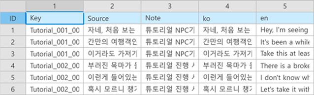
</p>

- `DialogueLocalizeData`의 구성입니다.
- LocaleDataSet의 구성은 모두 동일한 구성을 가지게 됩니다.
- Key, Source, ko, en의 값을 변경하여 출력해야 하는 데이터의 내용을 수정할 수 있습니다.
    - **Key**: LocaleDataSet에서 값을 구분하기 위한 ID값입니다. 해당 값을 기준으로 출력해야 하는 Dialogue를 찾습니다.
    - **Source**: LocaleDataSet을 제작할 때 `WebSync`로 제작 할 경우, 해당 값을 기준으로 메이플스토리 월드에서 제공하는 자동 변역을 출력하게 됩니다.
    - **Note**: 개발자간 해당 값이 어떤 값인지 설명을 적기 위한 값입니다.
    - **ko**: 한국어 환경에서 실행 시 출력되는 텍스트 내용입니다.
    - **en**: 영어 환경에서 실행 시 출력되는 텍스트 내용입니다.
- 스페인어(es), 간체(zh-cn), 번체(zh-tw), 일본어(ja)를 추가로 넣을 수 있습니다.

<p align="center">
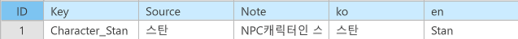
</p>

- `CharacterNameStringData`의 구성입니다.
- 샘플 월드에서는 `스탄`이라는 이름의 NPC이름만 사용하고 있습니다.

<br>

### DialogueUIController 제작하기
- 제작한 DialogueUI를 관리하기 위한 Component를 제작합니다.
- 해당 Component는 DialogueUI를 관리하기 위해 각 엔티티를 등록하고 관리합니다.

<p align="center">
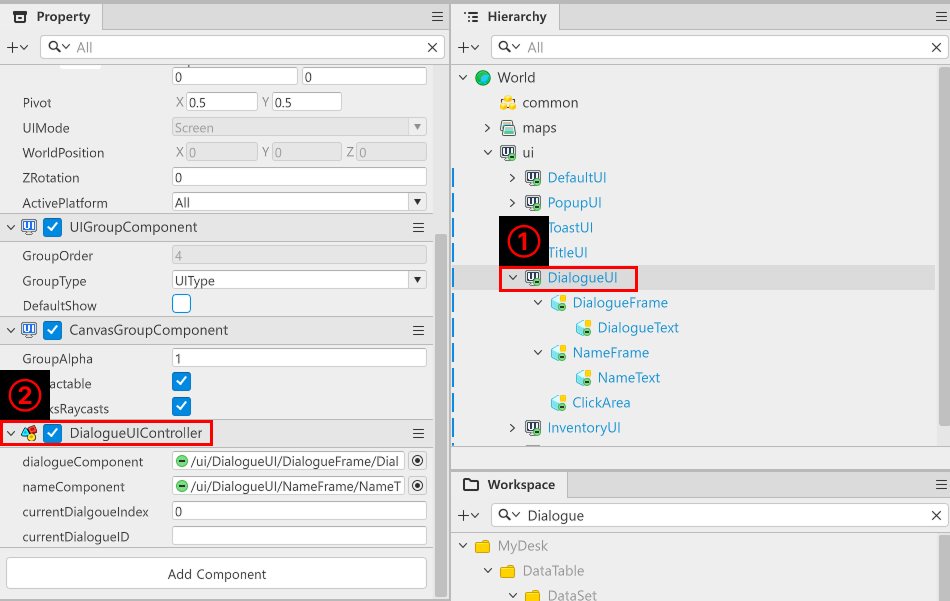
</p>

- `Hierarchy`에서 `DialogueUI`를 클릭합니다.
- `Workspace`에 `DialogueUIController`라는 이름으로 Component를 제작합니다.
- `Property`창에서 `Add Component`를 통해 `DialogueUIController`를 `DialogueUI`에 추가합니다.

<p align="center">
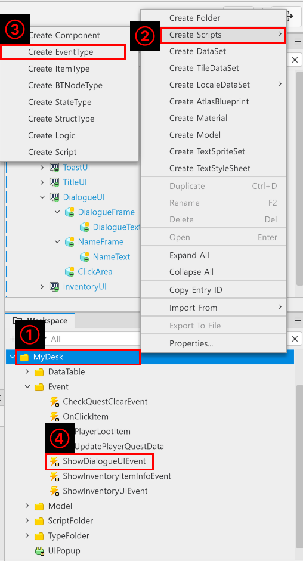
</p>

- `Workspace`에서 `MyDesk`를 우클릭 한 뒤 `Create Scripts`, `Create EventType`을 클릭합니다.
- 생성된 Event의 이름을 `ShowDialogueUIEvent`로 제작합니다.
- 생성된 `ShowDialogueUIEvent`의 Property로 `string DialogueID`를 추가합니다.

```lua
@Component
script DialogueUIController extends Component

property TextGUIRendererComponent dialogueComponent = "fd2aa18e-a624-4515-908d-b74bd78e454a"

property TextGUIRendererComponent nameComponent = "a25c1d68-5449-4a15-9e5c-44d6827eba50"

property number currentDialgoueIndex = 0

property table currentDialogueData = {}

property string currentDialogueID = ""

@ExecSpace("ClientOnly")
method void Show()
-- DialogueUI의 Enable을 true로 전환합니다.
self.Entity.Enable = true
end

@ExecSpace("ClientOnly")
method void Hide()
-- DialogueUI의 Enable을 false로 전환합니다.
self.Entity.Enable = false
end

@ExecSpace("ClientOnly")
method void InitDialogueData(table DialogueData)
-- 대화를 출력하기 위해 DialogueUI를 활성화 합니다.
self:Show()
-- 현재 대화 진행도를 1로 변경합니다.
self.currentDialgoueIndex = 1
-- 전달받은 DialogueData를 자기 자신의 Property에 등록합니다.
self.currentDialogueData = DialogueData
-- 전달받은 Data에서 이름값을 CharacterNameStringData에서 가져옵니다.
local nameText = _LocalizationService:GetText(DialogueData[self.currentDialgoueIndex].NameID)
-- 전달받은 Data에서 텍스트를 DialogueLocalizeData에서 가져옵니다. 
local dialogueText = _LocalizationService:GetText(DialogueData[self.currentDialgoueIndex].TextID)
-- 만약 가져온 이름 값이 nil 또는 ""일 경우, 텍스트를 공란으로 둡니다.
if _UtilLogic:IsNilorEmptyString(nameText) then
	self.nameComponent.Text = ""
else
	if nameText == "Player" then
		-- 만약 출력해야 하는 이름이 Player일 경우, 플레이어의 닉네임을 출력합니다.
		self.nameComponent.Text = _UserService.LocalPlayer.PlayerComponent.Nickname
	else
		-- 그렇지 않을 경우, 가져온 로컬라이징된 이름값을 이름 텍스트 컴포넌트에 적용합니다.
		self.nameComponent.Text = nameText
	end
end
-- 만약 가져온 대사 텍스트 값이 nil 또는 ""일 경우, 텍스트 출력창을 공란으로 둡니다.
if _UtilLogic:IsNilorEmptyString(dialogueText) then
	self.dialogueComponent.Text = ""
else
	-- 그렇지 않을 경우, 가져온 로컬라이징된 대사 텍스트를 출력합니다.
	self.dialogueComponent.Text = dialogueText
end
end

@ExecSpace("ClientOnly")
method void UpdateNextDialogue()
-- 현재 텍스트 진행 단계를 1 상승시킵니다.
self.currentDialgoueIndex = self.currentDialgoueIndex + 1
-- 만약 다음 대사 데이터가 존재할 경우 다음의 코드를 실행합니다.
if isvalid(self.currentDialogueData[self.currentDialgoueIndex]) then
	-- 다음 대사의 캐릭터 이름을 가져옵니다.
	local nameText = _LocalizationService:GetText(self.currentDialogueData[self.currentDialgoueIndex].NameID) 
	-- 다음 대사의 지문을 가져옵니다.
	local dialogueText = _LocalizationService:GetText(self.currentDialogueData[self.currentDialgoueIndex].TextID)
	-- 만약 가져온 이름값이 nil 또는 ""일 경우, 이름을 공란으로 출력합니다.
	if not isvalid(nameText) or nameText == "" then
		self.nameComponent.Text = ""
	else
		if nameText == "Player" then
			-- 만약 출력해야 하는 이름이 Player일 경우, 플레이어의 닉네임을 출력합니다.
			self.nameComponent.Text = _UserService.LocalPlayer.PlayerComponent.Nickname
		else
			-- 그렇지 않을 경우, 가져온 로컬라이징된 이름값을 이름 텍스트 컴포넌트에 적용합니다.
			self.nameComponent.Text = nameText
		end
	end
	-- 만약 가져온 대사 값이 nil 또는 ""일 경우, 대사를 공란으로 출력합니다.
	if not isvalid(dialogueText) or dialogueText =="" then
		self.dialogueComponent.Text = ""
	else
		-- 그렇지 않을 경우, 가져온 값을 출력합니다.
		self.dialogueComponent.Text = dialogueText
	end
else
	-- 만약 다음 대사 데이터가 없을 경우, 대사가 종료되었다고 판단하여 대사창을 종료합니다.
	self:Hide()
	-- 대사가 진행되는 동안 캐릭터 조작이 불가능하도록 막아놓은 Component를 다시 활성화합니다.
	_LocalPlayerControlLogic:EnablePlayerControl()
	-- 퀘스트 클리어 여부를 검사하도록 합니다.
	local checkClearQuest = CheckQuestClearEvent()
	checkClearQuest.ConditionType = "Talk"
	checkClearQuest.TargetID = self.currentDialogueID
	_UserService.LocalPlayer:SendEvent(checkClearQuest)
end
end

@ExecSpace("ClientOnly")
@EventSender("Entity", "a68947ee-8f88-43b5-b8a1-91aec780b578")
handler HandleButtonClickEvent(ButtonClickEvent event)
-- 플레이어가 화면을 터치했으므로 다음 대사를 출력하도록 메소드를 호출합니다.
self:UpdateNextDialogue()
end

@ExecSpace("ClientOnly")
@EventSender("Self")
handler HandleShowDialogueUIEvent(ShowDialogueUIEvent event)
-- 전달받은 event내 DialogueID값이 nil은 아닌지 체크합니다.
if not _UtilLogic:IsNilorEmptyString(event.DialogueID) then
	-- 대화창 출력를 위한 텍스트를 찾습니다.
	local findData = _DialogueLogic:GetDialogueDataByDialogueID(event.DialogueID)
	-- 데이터를 찾는데 성공했다면 해당 데이터를 등록합니다.
	self:InitDialogueData(findData)
	self.currentDialogueID = event.DialogueID
	-- 대화창을 출력해야 하므로 자기 자신을 보이는 Show Method를 실행합니다.
	self:Show()
end
end

end
```
- `DialogueUIController`에 위의 코드를 작성합니다.
- 해당 코드는 `Plain Text`를 기준으로 작성되었습니다.

<p align="center">
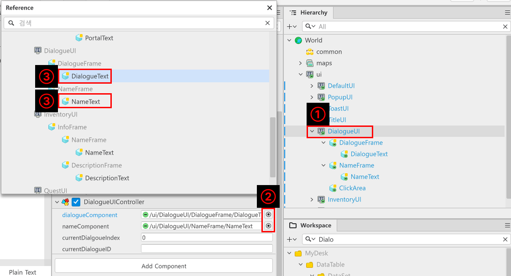
</p>

- `Hierarchy`에서 `DialogueUI`를 찾아 클릭합니다.
- `Property`창에서 `DialogueUIController`를 찾습니다.
- `dialgueComponent`, `nameComponent` 우측의 버튼을 클릭한 뒤 각각 `DialogueText`, `NameText` 엔티티를 찾아 등록합니다.

### DialogueLogic 제작하기
- `DialogueLogic`이라는 이름으로 새로운 Logic을 제작합니다.

```lua
@Logic
script DialogueLogic extends Logic

property DialogueUIController dialogueUIController = "71d644e3-4527-491e-9426-b02cbdbd46ae"

property table dialogueData = {}

@ExecSpace("ClientOnly")
method void OnBeginPlay()
-- 게임 시작 시 DialogueData 데이터셋을 캐싱합니다.
self:InitDialogueData()
end

@ExecSpace("ClientOnly")
method void InitDialogueData()
-- 만약 dialogueData가 초기화 되어있지 않을 경우, 초기화를 시도합니다.
if not isvalid(self.dialogueData) or not next(self.dialogueData) then
	-- Workspace에서 DialogueData라는 이름의 DataSet을 찾습니다.
	local getData = _DataService:GetTable("DialogueData")
	-- 만약 해당 이름의 DataSet이 없거나, 정상적으로 불러올 수 없을 경우 로그를 남기며 코드 실행을 중단합니다.
	if not isvalid(getData) then
		log("DialogueData DataSet을 찾을 수 없습니다!")
		return
	end
	
	local rowCount = getData:GetRowCount()
	-- 가져온 DataSet의 길이만큼 탐색을 시작합니다.
	for i = 1, rowCount do
		-- DialogueID값을 가져옵니다.
		local tableKey = tostring(getData:GetCell(i, "DialogueID"))
		-- 만약 DialogueID가 정상적이지 않을 경우, 잘못된 값이거나 비정상적인 테이블로 감지하고 코드 실행을 중단합니다.
		if tableKey == nil or tableKey == "" then
			log("DialogueID값이 nil이거나 비어있습니다!")
			return
		end
		-- Value에 넣기 위한 table을 제작합니다.
		local rowData = {
			-- DialogueData DataSet의 NameID값을 가져옵니다.
			NameID = tostring(getData:GetCell(i, "NameID")),
			-- DialogueData DataSet의 TextID값을 가져옵니다.
			TextID = tostring(getData:GetCell(i, "TextID"))
		}
		-- 만약 key값 형태의 self.dialogueData가 존재하지 않을 경우, 초기화를 진행합니다.
		if not isvalid(self.dialogueData[tableKey]) or not next(self.dialogueData[tableKey]) then
			self.dialogueData[tableKey] = {}
		end
		-- key값의 self.dialogueData에 Value인 rowData를 추가합니다.
		table.insert(self.dialogueData[tableKey], rowData)
	end
end
end

method table GetDialogueDataByDialogueID(string DialogueID)
-- 전달받은 DialogueID를 Key로 가지는 Value가 있는지 탐색합니다.
if isvalid(self.dialogueData[DialogueID]) and next(self.dialogueData[DialogueID]) then
	-- 존재하기 때문에 해당 Key값을 가지는 Value를 반환합니다.
	return self.dialogueData[DialogueID]
else
	-- 그렇지 않을 경우, 로그를 남기고 nil을 반환합니다.
	log("DialogueID를 Key로 가진 Value가 존재하지 않습니다!")
	return nil
end
end

end
```

> 해당 코드는 Plain Text를 기준으로 작성된 코드입니다.

- DialogueLogic에 위의 코드를 입력합니다.
- Method의 구성은 다음과 같습니다.
    - `OnBeginPlay`: 월드가 실행될 때 `InitDialogueData` Method를 실행하기 위한 Method입니다.
    - `InitDialogueData`: 앞서 제작한 DialogueData를 dialogueData를 등록하기 위한 Method입니다.
    - `GetDialogueDataByDialogueID`: 매개변수인 DialogueID값을 기준으로 해당 ID값을 가진 데이터 묶음을 반환합니다.

<br>

## 최소 구현 기준
- 스토리가 출력될 수 있는 UI와 기능을 제작합니다.
- NPC의 이름과 대사가 로컬라이징에 맞춰 출력되도록 기능을 구현합니다.

<br>

## 응용 및 확장 방향
- 스토리 중간에 카메라 무브, 화면 이펙트, 캐릭터 이동 등을 활용하여 연출을 제작합니다.
- 캐릭터의 일러스트가 출력되게 수정하여 캐릭터의 표정을 출력할 수 있도록 기능을 수정합니다.
- 스크립트의 연출을 위해 효과음, 배경음 등을 변경하여 출력할 수 있도록 기능을 수정합니다.
- 리치 텍스트의 개념을 학습하고 이를 활용하여 텍스트를 출력할 때 몰입감 있는 스토리를 제작할 수 있습니다.