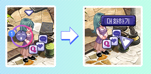
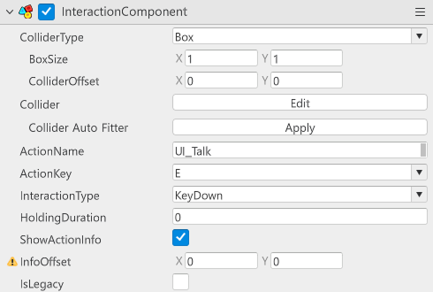
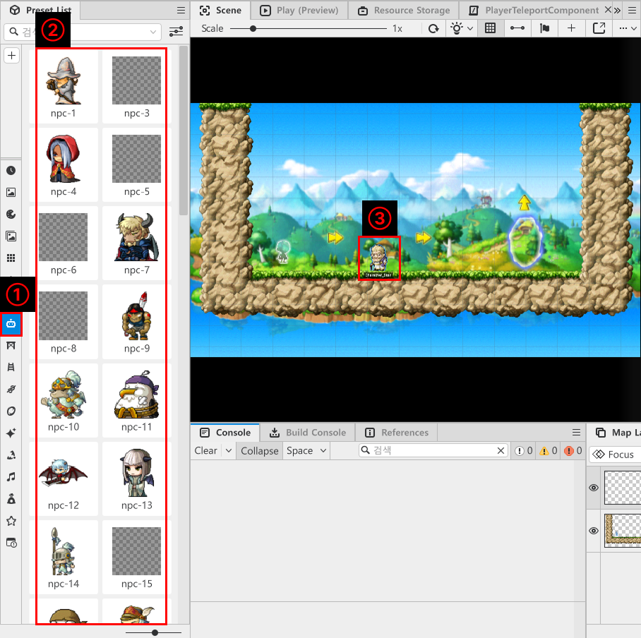
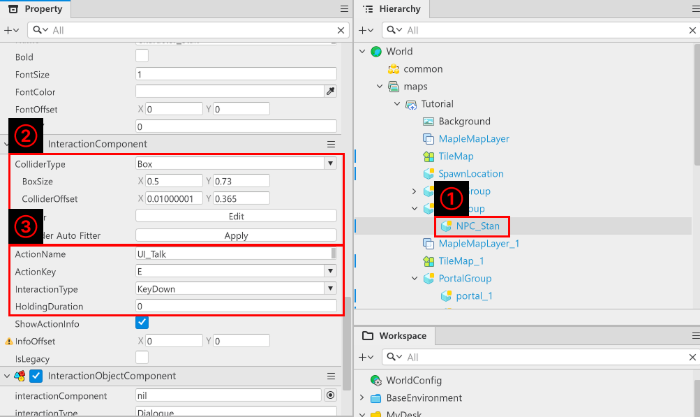
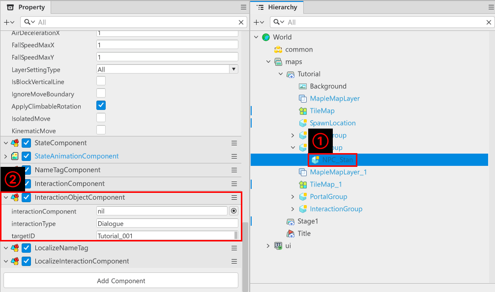
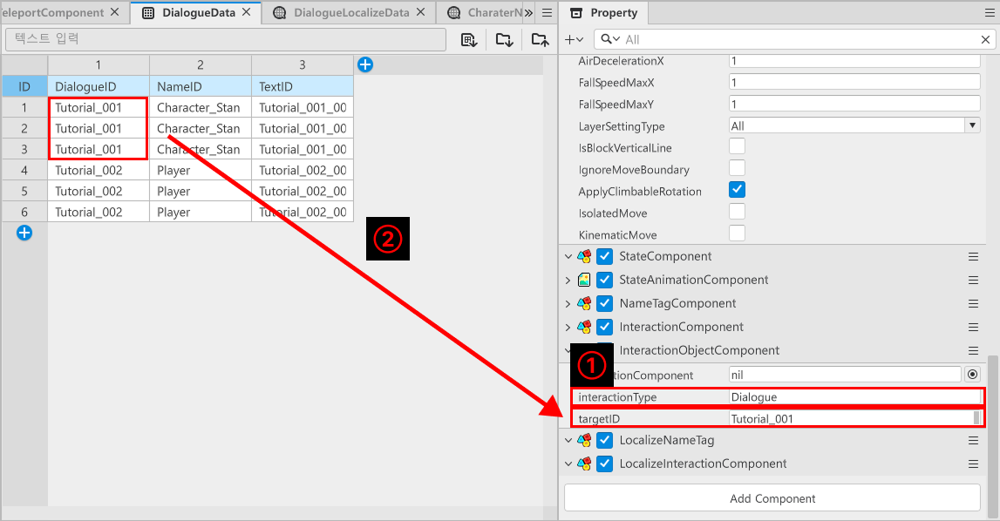
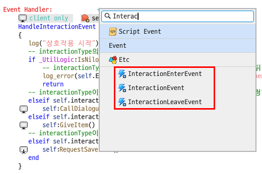

# [💡 기초 학습] 엔티티 상호작용 기능 구현하기
<br>
<br>
<br>

## 영상 타임라인
- 강의 영상내 아래의 타임라인에서 학습할 수 있습니다.
- 엔티티 상호작용 기능 구현하기: `00:36:42`

<br>

## 학습 목표
- 플레이어가 월드와 상호작용할 수 있도록 기능을 구현하는 방법에 대해 학습합니다.
- 메이플스토리 월드가 제공하는 Component인 InteractionComponent에 대해 학습합니다.
- 기능을 등록하기 위한 Component를 제작하는 방법에 대해 학습합니다.

<br>

## 해당 영상 시청 후 수행해 볼 내용
- InteractionComponent를 활용하여 상호작용이 가능한 엔티티를 맵에 배치합니다.
- 각각의 InteractionComponent가 대사를 출력할 수 있도록 기능과 DataSet을 제작합니다.

<br>

## 상호작용 기능이란?

<p align="center">

</p>

> 게임 테일즈위버의 NPC 상호작용 기능

- 상호작용은 플레이어가 게임의 세계관에 몰입할 수 있도록 만드는 장치입니다.
- 여러 엔티티와 상호작용을 통해 대화, 아이템 습득, 숨겨진 길 발견 등 다양한 기능들을 하도록 만들어 게임 내에 생동감을 제공합니다.

<br>

## InteractionComponent 살펴보기

<p align="center">

</p>

- InteractionComponent는 메이플스토리 월드가 제공하는 기본 Component입니다.
- 해당 Component 역시 Collide를 가지고 있으며, 플레이어와 충돌을 감지하면 상호작용이 가능합니다.

<table class="tg"><thead>
  <tr>
    <th class="tg-9wq8">이름</th>
    <th class="tg-9wq8">설명</th>
  </tr></thead>
<tbody>
  <tr>
    <td class="tg-lboi">ColliderType</td>
    <td class="tg-lboi">Collide의 형식을 변경할 수 있습니다.<br>Box, Circle, Polygon 3가지가 존재합니다.</td>
  </tr>
  <tr>
    <td class="tg-lboi">Collider</td>
    <td class="tg-lboi">Edit를 눌러 Collide의 크기나 위치를 조절할 수 있습니다.</td>
  </tr>
  <tr>
    <td class="tg-lboi">Collider Auto Fitter</td>
    <td class="tg-lboi">자동으로 Collider의 크기나 위치를 조정합니다.</td>
  </tr>
  <tr>
    <td class="tg-lboi">ActionName</td>
    <td class="tg-lboi">플레이어와 엔티티가 충돌했을 때 해당 텍스트를 출력합니다.</td>
  </tr>
  <tr>
    <td class="tg-lboi">ActionKey</td>
    <td class="tg-lboi">상호작용 진행시 눌러야 하는 키를 지정합니다.</td>
  </tr>
  <tr>
    <td class="tg-lboi">InteractionType</td>
    <td class="tg-lboi">상호작용을 위한 키 인식을 설정합니다.</td>
  </tr>
  <tr>
    <td class="tg-lboi">HoldingDuration</td>
    <td class="tg-lboi">InteractionType이 일정시간 눌러야 하는 경우, 인식하는 시간을 설정하는 값입니다.</td>
  </tr>
  <tr>
    <td class="tg-lboi">ShowActionInfo</td>
    <td class="tg-lboi">ActionName의 출력 여부를 결정하는 값입니다.</td>
  </tr>
</tbody></table>

<br>

## 엔티티 배치하기

<p align="center">

</p>

- `Preset List`에서 `NPC`를 클릭한 뒤 원하는 NPC를 선택합니다.
- 선택한 `NPC`를 `Scene` 화면에서 원하는 위치에 배치합니다.

<p align="center">

</p>

- `Hierarchy`에서 추가한 NPC를 클릭합니다.
- `Property`창에서 `InteractionComponent`가 있는지 체크한 뒤, `InteractionComponent`가 없을 경우 `Add Component`를 통해 추가합니다.
- Collide를 원하는 크기, 형태로 변경합니다.
- `ActionName`, `ActionKey`, `InteractionType`, `HoldingDuration`을 원하는 형식으로 변경합니다.

<br>

## InteractionObjectComponent 제작하기
- InteractionObjectComponent는 샘플 월드가 제작한 Component입니다.
- 해당 Component가 부여된 엔티티에서 `InteractionComponent`를 찾은 뒤, `InteractionComponent`와 상호작용시 처리해야 하는 기능을 부여하는 역할을 합니다.

<p align="center">

</p>

- `Hierarchy`에서 추가한 NPC를 클릭합니다.
- `Property`창에서 `InteractionObjectComponent`라는 이름의 Component를 제작하여 추가합니다.

```lua
@Component
script InteractionObjectComponent extends Component

property InteractionComponent interactionComponent = nil

property string interactionType = ""

property string targetID = ""

@ExecSpace("ClientOnly")
method void OnBeginPlay()
-- 자기 자신의 interactionComponent를 등록했는지 검사합니다.
if not isvalid(self.interactionComponent) then
	-- 만약 자기 자신의 interactionComponent가 등록되어 있지 않을 경우, 자기 자신의 Entity를 찾아 InteractionComponent를 찾습니다.
	local findComponent = self.Entity.InteractionComponent
	-- 만약 InteractionComponent를 찾지 못했다면, 에러 로그를 남기고 반환합니다.
	if not isvalid(findComponent) then
		log_error(self.Entity.Name.."이 InteractionComponent를 가지고 있지 않습니다!")
		return
	end
	-- 정상적으로 찾는데 성공했다면, 찾은 Component를 등록합니다.
	self.interactionComponent = findComponent
end
-- 상호작용 오브젝트의 텍스트를 현재 플레이중인 국가에 맞춰 언어를 수정 및 적용합니다.
self.interactionComponent.ActionName = _LocalizationService:GetText(self.interactionComponent.ActionName)
end

@ExecSpace("ClientOnly")
method void CallDialogue()
-- 플레이어의 이동을 임시적으로 해제합니다.
_LocalPlayerControlLogic:DisablePlayerControl()
-- DialogueUI호출을 위한 이벤트를 생성합니다.
local showDialogueEvent = ShowDialogueUIEvent()
-- 이벤트 내 매개변수로 사용할 dialogueID를 등록합니다.
showDialogueEvent.DialogueID = self.targetID
-- DialogueUI를 찾습니다.
local dialogueUI = _EntityService:GetEntityByPath("/ui/DialogueUI")
-- DialogueUI를 정상적으로 찾았다면, 해당 UI 엔티티에게 이벤트를 전달합니다.
if isvalid(dialogueUI) then
	dialogueUI:SendEvent(showDialogueEvent)
end
end

@ExecSpace("ClientOnly")
method void GiveItem()
-- 플레이어에게 아이템 지급을 위한 이벤트를 생성합니다.
local giveItemEvent = OnPlayerLootItem()
-- 지급할 아이템 ID, 개수를 등록합니다.
giveItemEvent.ItemID = self.targetID
giveItemEvent.ItemCount = 1
-- LocalPlayer를 찾은 뒤, 해당 Player에게 이벤트를 전달합니다.
local localPlayer = _UserService.LocalPlayer
localPlayer:SendEvent(giveItemEvent)
end

@ExecSpace("Server")
method void SaveData()
_DataStorageLogic:RequestSaveData()
end

@ExecSpace("Client")
method void RequestSaveData()
self:SaveData()
end

@ExecSpace("ClientOnly")
@EventSender("Self")
handler HandleInteractionEvent(InteractionEvent event)
log("상호작용 시작")
-- interactionType의 값에 따라 상호작용의 처리를 변경합니다.
if _UtilLogic:IsNilorEmptyString(self.interactionType) then
	-- interactionType이 지정되어 있지 않을 경우, 로그를 출력한 뒤 코드 실행을 중단합니다.
	log_error(self.Entity.Name.."엔티티의 InteractionObjectComponent 요소인 interactionType이 공란이거나 nil입니다!")
	return
-- interactionType이 Dialogue일 경우, DialogueUI를 출력하도록 요청합니다.
elseif self.interactionType == "Dialogue" then
	self:CallDialogue()
elseif self.interactionType == "GiveItem" then
	self:GiveItem()
-- interactionType이 Save일 경우, 저장을 진행하도록 요청합니다.
elseif self.interactionType == "Save" then
	self:RequestSaveData()
end
end

end
```
> 해당 코드는 Plain Text를 기준으로 작성되었습니다.

- `InteractionObjectComponent`의 코드를 위와 같이 작성합니다.
- 각각의 Method는 다음의 역할을 수행합니다.
    - **OnBeginPlay**: 월드가 실행되는 순간 엔티티에 부여된 `InteractionComponent`를 찾아 `interactionComponent` Property에 등록합니다. 찾는데 성공한다면 `InteractionComponent`의 `ActionName`을 찾은 뒤, `LocaleDataSet`에 등록된 Key가 있을 경우 찾아서 로컬라이징을 수행합니다.
        - 샘플 월드 기준 `MyDesk`, `Datatable`, `Localization`의 `UIStringDat`를 참고해 주세요.
    - **CallDialogue**: `targetID`값을 기준으로 Dialogue를 불러옵니다.
    - **GiveItem**: `targetID`값을 기준으로 플레이어에게 아이템을 지급합니다.
    - **SaveData**: 플레이어의 현재 위치, 맵, 보유 아이템 정보를 저장합니다.
    - **RequestSaveData**: `SaveData`를 실행시키기 위한 Method입니다.
    - **HandleInteractionEvent**: 상호작용 진행 시 `interactionType`값에 따라 대화, 아이템 지급, 저장 기능을 수행합니다.

<br>

## InteractionObjectComponent 값 설정하기

<p align="center">

</p>

- `interactionType` 값을 설정합니다.
    - 대화를 출력하고 싶을 경우 `Dialogue`, 아이템 지급은 `GiveItem`, 저장은 `Save`로 입력합니다.
- `targetID` 값을 설정합니다.
    - `interactionType` 값이 `Dialogue`일 경우, `DialogueData`에서 출력하려는 대화의 `DialogueID`를 입력합니다.
- 모든 설정이 완료되었다면 테스트 플레이를 실행합니다.

<p align="center">

</p>

- 정상적으로 상호작용이 이뤄지는걸 볼 수 있습니다.

<br>

## 상호작용 엔티티의 진입, 탈출시 이벤트 처리

<p align="center">

</p>

- `InteractionObjectComponent`의 `Event Handler`에 `InteractionEnterEvent`, `InteractionEvent`, `InteractionLeaveEvent`가 존재합니다.
- 현재 상호작용시 처리를 `InteractionEvent`에서 처리하고 있습니다.
- 하지만 `InteractionEnterEvent`, `InteractionLeaveEvent`를 통해 Collide의 진입, 탈출 타이밍에 기능을 추가할 수 있습니다.
    - `InteractionEnterEvent`: 플레이어가 엔티티와 충돌하는 순간 처리할 기능을 작성할 수 있습니다.
    - `InteractionLeaveEvent`: 플레이어가 엔티티와 충돌 범위에서 나가는 순간 처리할 기능을 작성할 수 있습니다.

<br>

## 최소 구현 기준
- 엔티티와 상호작용 진행 시 대화창을 출력하여 대사를 진행할 수 있습니다.
- 엔티티의 이미지에 따라 충돌 범위를 임의로 지정하고, 변경합니다.
- 각 NPC마다 다른 대사가 출력되도록 기능을 구현합니다.

## 응용 및 확장 방향
- `InteractionEnterEvent`, `InteractionLeaveEvent`를 활용하여 특정 NPC는 캐릭터가 떠나는 순간 사라지게 기능을 제작하거나 나타나게 할 수 있습니다.
- `InteractionObjectComponent`의 `interactionType` 값에 따라 다양한 역할을 수행할 수 있도록 기능을 확장합니다.