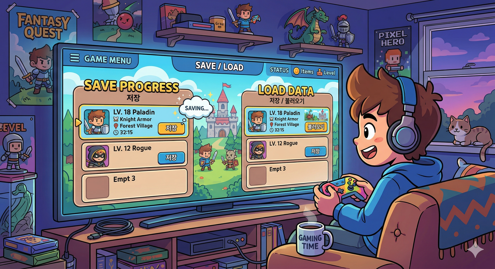
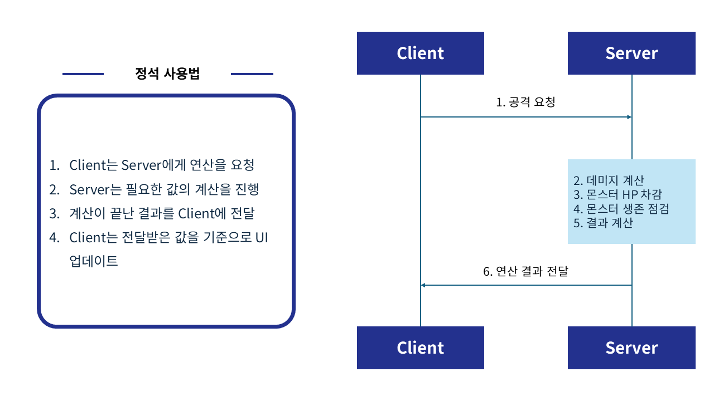
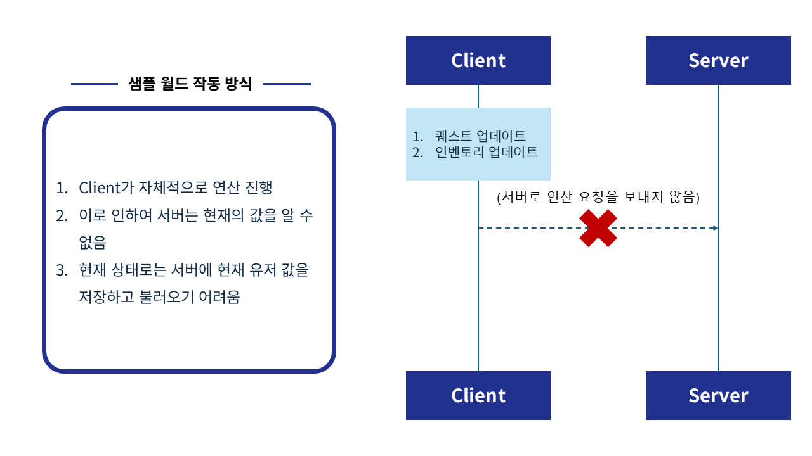
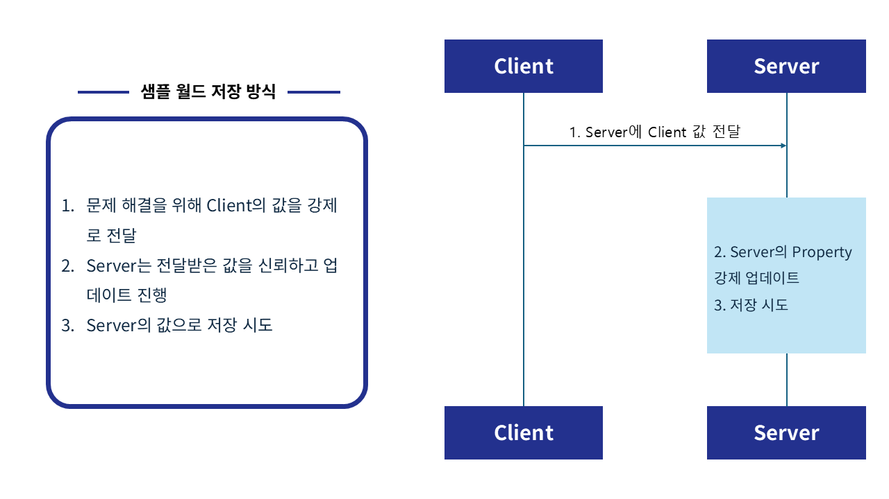

# [📖 심화 학습] DataStorage를 활용한 저장, 불러오기 구현하기
<br>
<br>
<br>

## 영상 타임라인
- 강의 영상내 아래의 타임라인에서 학습할 수 있습니다.
- DataStorage 활용하기: `01:32:52`

<br>

## 학습 목표
- DataStorage를 활용하여 플레이어의 플레이 정보를 저장하는 기능을 구현합니다.
- DataStorage를 활용하여 플레이어의 플레이 정보를 불러오는 기능을 구현합니다.
- 플레이어의 정보를 불러온 뒤 불러온 값에 맞춰 게임을 이어서 진행할 수 있도록 기능을 구현합니다.

<br>

## 해당 영상 시청 후 수행해 볼 내용
- Title화면을 구성하고, 불러오기 기능을 제작합니다.
- 저장 기능을 수행하는 엔티티를 배치하여 저장 기능을 수행하도록 기능을 제작합니다.
- 퀘스트를 확장하여 플레이어의 퀘스트 정보가 정상적으로 저장, 불러오기가 작동하는지 확인합니다.

<br>

## 저장, 불러오기 구현하기

<p align="center">

</p>

> Gemini로 제작된 AI 이미지입니다.

- 플레이어가 열심히 플레이를 했는데 그 결과물이 남지 않는다면 플레이어는 좌절감을 느끼게 됩니다.
- 이런 문제를 해결하기 위해 플레이어의 정보가 저장되고 불러오는 기능이 구현될 수 있도록 기능을 제작해야합니다.
- 메이플스토리 월드에서는 저장과 불러오기 기능을 구현하기 위해 DataStorage라는 API를 제공합니다.

<br>

## DataStorageService
- `DataStorageService`는 다양한 DataStorage 접근 기능을 제공합니다.
- 샘플 월드에서 주로 사용한 기능은 `GetUserDataStorage`와 `GetAndWait`, `SetAndWait`입니다.
    - `GetUserDataStorage`: 특정 유저용 UserDataStorage를 가져오는 기능입니다.
    - `GetAndWait`: `GetUserDataStorage`로 가져온 정보에서 특정 key의 값을 가져옵니다.
    - `SetAndWait`: `GetUserDataStorage`안에 key를 기준으로 값을 저장합니다.
- 더 많은 기능들을 확인하고 싶을 경우, 메이플스토리 월드 에디터 상단의 `Help`, `API Reference`를 클릭한 뒤 해당 페이지에서 `DataStorageService`를 검색하여 더 많은 기능을 확인할 수 있습니다.

<br>

## DataStorageLogic 제작하기
- `Workspace`에서 `MyDesk`를 우클릭합니다.
- `Create Scripts`, `Create Logic`을 통해 Logic을 생성합니다.
- 생성한 Logic의 이름을 `DataStorageLogic으로 변경합니다.

```lua
@Logic
script DataStorageLogic extends Logic

@Sync
property string lastMapName = ""

@Sync
property Vector3 lastPosition = Vector3.zero

property string localUserID = ""

property table userInventory = {}

@Sync
property string questID = ""

@ExecSpace("ClientOnly")
method void OnBeginPlay()
-- 로컬 플레이어의 유저 ID를 저장합니다.
self.localUserID = _UserService.LocalPlayer.PlayerComponent.UserId
-- 서버 스크립트에 로컬 플레이어의 유저 ID를 전달하고 등록합니다.
self:SendUserIDToServer(self.localUserID)
end

@ExecSpace("Server")
method void SavePlayerData()
-- 유저 데이터 스토리지를 서버에서 가져옵니다.
local userDataStorage = _DataStorageService:GetUserDataStorage(self.localUserID)
-- 현재 플레이어가 있는 맵의 이름을 저장합니다.
userDataStorage:SetAndWait("lastMapName", self.lastMapName)
-- 현재 플레이어가 있는 위치를 저장합니다.
userDataStorage:SetAndWait("lastPosition", tostring(self.lastPosition))
-- 현재 플레이어가 수행하고 있는 퀘스트의 ID를 저장합니다.
userDataStorage:SetAndWait("QuestID", self.questID)
-- 현재 유저의 인벤토리 상태를 JSON으로 저장합니다.
local jsonString = _HttpService:JSONEncode(self.userInventory)
userDataStorage:SetAndWait("InventoryData", jsonString)
log("인벤토리 저장 완료")
end

@ExecSpace("Server")
method void LoadPlayerData()
-- 서버에서 유저의 데이터 스토리지를 가져옵니다.
local userDataStorage = _DataStorageService:GetUserDataStorage(self.localUserID)
-- 만약 전달받은 데이터 스토리지가 비어있을 경우 코드 실행을 중단합니다.
if userDataStorage == nil then 
	return
end
-- lastMapName값을 서버에서 가져옵니다.
local errorCode, mapName = userDataStorage:GetAndWait("lastMapName")
-- 마지막 위치를 저장한 값인 lastPosition값을 가져옵니다.
local errorCodePos, posString = userDataStorage:GetAndWait("lastPosition")
-- 유저의 인벤토리 정보를 가져옵니다.
local itemErrorCode, jsonData = userDataStorage:GetAndWait("InventoryData")
-- 유저가 수행중이던 퀘스트의 정보를 가져옵니다.
local questErrorCode, questData = userDataStorage:GetAndWait("QuestID")

-- 각 데이터를 로드했을 때 에러 코드가 0(성공)인지 반드시 확인해야 합니다.
-- 마지막 맵 위치를 등록합니다.
if errorCode == 0 then
	if _UtilLogic:IsNilorEmptyString(mapName) then
		return
	else
		self.lastMapName = mapName
	end
else
	log("lastMapName을 불러올 수 없습니다!")
	return
end
-- 마지막 캐릭터 위치를 가져온 뒤, 해당 위치를 등록합니다.
if errorCodePos == 0 then
	self.lastPosition = Vector3(0, 0, 0)
	local clean_text, arr = string.gsub(posString, "[%(%)]", "")
	local coords = _UtilLogic:Split(clean_text, ",")
	if #coords == 3 then
		self.lastPosition.x = tonumber(coords[1])
		self.lastPosition.y = tonumber(coords[2])
		self.lastPosition.z = tonumber(coords[3])
	end
else
	log("lastPosition을 불러올 수 없습니다!")
end
-- 인벤토리 데이터를 불러온 뒤, 인벤토리 데이터를 등록합니다.
if itemErrorCode == 0 then
	-- 만약 불러온 인벤토리 데이터가 없을 경우, 로그를 남깁니다.
	if _UtilLogic:IsNilorEmptyString(jsonData) then
		log("불러온 아이템 데이터가 없습니다!")
	else
		-- 정상적으로 값이 있을 경우, 아이템 데이터를 등록합니다.
		local itemData = _HttpService:JSONDecode(jsonData)
    	log("불러온 아이템 ID: " .. itemData[1].ItemID)
		self.userInventory = itemData
		log("인벤토리 로드 완료")
		self:UpdateClientUserInventory(self.userInventory)
	end    
else
	log("인벤토리 데이터를 불러오는 데 실패했습니다.")
end
-- 퀘스트 데이터를 등록합니다.
if questErrorCode == 0 then
	self.questID = questData
	self:UpdateClientQuestData(questData)
else
	log("QuestData를 서버에서 불러오는데 실패했습니다.")
end

log("데이터 로드 완료: " .. self.lastMapName .. " / " .. tostring(self.lastPosition))
log("InventoryData 로드 완료")
-- 데이터 등록이 완료되었으므로 인벤토리와 퀘스트 정보창을 초기화합니다.
self:SetUserInventoryData()
self:SetClientQuestData()
return
end

@ExecSpace("Client")
method void RequestSaveData()
-- 로컬 플레이어 엔티티를 찾은 뒤, 필요한 데이터들을 미리 가져옵니다.
local userEntity = _UserService.LocalPlayer
local userItemData = userEntity.PlayerItemComponent.playerInventory
self.userInventory = userItemData
local questID = userEntity.PlayerQuestComponent.currentQuestData
-- 서버에 저장을 실행하기 전, 서버에 저장할 값들을 미리 업데이트합니다.
self:UpdateServerItemData(userItemData)
self:UpdateServerMapData(userEntity.CurrentMapName, userEntity.TransformComponent.Position)
self:UpdateServerQuestData(questID.QuestID)
-- 서버에 정보 저장을 요청합니다.
self:SavePlayerData()
end

@ExecSpace("Client")
method void SendUserIDToServer(string UserID)
-- 로컬 플레이어의 ID값을 서버에 전달하기 위한 Method입니다.
self:UpdateServerUserID(UserID)
end

@ExecSpace("Server")
method void UpdateServerUserID(string UserID)
-- 서버에서 실행되어 로컬 플레이어의 ID값을 서버에 등록합니다.
self.localUserID = UserID
end

@ExecSpace("Server")
method void UpdateServerMapData(string CurrentMapName, Vector3 CurrentPosition)
-- 서버에 캐릭터가 있는 맵의 이름, 위치를 등록합니다.
self.lastMapName = CurrentMapName
self.lastPosition = CurrentPosition
end

@ExecSpace("Server")
method void UpdateServerItemData(table ItemData)
-- 서버에 현재 유저의 인벤토리 정보를 등록합니다.
self.userInventory = ItemData
end

@ExecSpace("Client")
method void SetUserInventoryData()
-- 서버에서 아이템을 하나씩 인벤토리에 등록할 때 인벤토리 업데이트가 이뤄질 수 있도록 수행하는 Method입니다.
local localUser = _UserService.LocalPlayer
for i = 1, #self.userInventory do
	local addItemEvent = OnPlayerLootItem()
	addItemEvent.ItemID = self.userInventory[i].ItemID
	addItemEvent.ItemCount = self.userInventory[i].ItemCount
	localUser:SendEvent(addItemEvent)
end
end

@ExecSpace("Client")
method void UpdateClientUserInventory(table UserInventory)
-- 서버에 유저 인벤토리 정보를 업데이트하도록 요청하는 Method입니다.
self.userInventory = UserInventory
end

@ExecSpace("Server")
method void UpdateServerQuestData(string QuestID)
-- 서버에 현재 QuestID를 등록합니다.
self.questID = QuestID
end

@ExecSpace("Client")
method void SetClientQuestData()
-- 현재 진행중인 Quest에 맞춰 UI가 업데이트 되도록 Logic을 호출합니다.
_QuestLogic:SetQuestDataByQuestID(self.questID)
end

@ExecSpace("Client")
method void UpdateClientQuestData(string QuestID)
-- 서버에 현재 QuestID를 등록하도록 요청합니다.
self.questID = QuestID
end

@ExecSpace("Client")
method string RequestLoadData()
if not (_UtilLogic:IsNilorEmptyString(self.lastMapName)) then
	return self.lastMapName
else
	-- 플레이어의 정보를 불러오도록 요청합니다.
	self:LoadPlayerData()
	wait(1)
	return self.lastMapName
end
end

end
```

> 해당 코드는 Plain Text를 기준으로 작성된 코드입니다.

- 해당 Logic에서 `SavePlayerData`, `LoadPlayerData`는 서버에 플레이어의 정보를 저장, 불러오는 기능을 수행합니다.
- 샘플 월드에서는 Client 기반으로 작동하기 때문에 Client에서 Server에 기능을 요청할 수 있도록 `RequestSaveData`와 `RequestLoadData`를 통해서 기능을 요청하고 있습니다.

<br>

## 샘플 월드의 문제점

<br>

### 이상적인 Server, Client 구조
<p align="center">

</p>

- Client가 연산을 요청하면 Server에서 연산을 진행합니다.
- Server에서 전달받은 값을 Client가 업데이트하는 형태로 사용됩니다.
- 해당 방식은 Server에서 모든 값들이 연산되기 때문에 Server에서 업데이트를 진행합니다.

### ⚠️ 샘플 월드의 구조
<p align="center">

</p>

- 샘플 월드에서는 Client 기반으로 작동하도록 기능이 구성되어 있습니다.
- 따라서 Server에게 어떠한 값 처리 요청이나 값의 변경을 전달하지 않습니다.
- 이런 구조로 인해 Server는 게임의 어떠한 값도 가지거나, 연산하지 않습니다.
- Server가 어떠한 값도 가지고 있지 않기 때문에 저장을 수행 할 경우 빈 값만 저장되는 문제가 발생합니다.

### ⚠️ 샘플 월드의 해결 방식
<p align="center">

</p>

- 샘플 월드는 이런 문제를 해결하기 위해 Server에 강제로 값을 전달하고 있습니다.
- `DataStorageLogic`에서 다음의 Method들이 이를 수행합니다.
    - `UpdateServerUserID`
    - `UpdateServerMapData`
    - `UpdateServerItemData`
    - `UpdateClientUserInventory`
    - `UpdateClientQuestData`
- 해당 Method들을 실행한 뒤, Server에 전달된 값을 저장하도록 요청하는 형태를 가지고 있습니다.

<br>

### ⚠️ 문제점과 해결방안
- 문제점
    - Server가 검증되지 않은 값을 전달받아 그대로 사용하기 때문에 데이터 변조에 취약합니다.
    - 이는 상용화를 진행하는데 있어 가장 큰 걸림돌이 됩니다.
    - 또한 Server에서 연산을 진행하지 않기 때문에 데이터의 보안이 취약합니다.
- 해결방안
    - 플레이어의 퀘스트 정보, 아이템 정보 등 다양한 정보를 Server에서 연산하도록 기능을 구성합니다.
    - Client는 Server에서 전달받은 Data를 기반으로 UI의 업데이트만 수행하도록 기능을 구성합니다.

<br>

## 최소 구현 기준
- 플레이어의 정보가 저장되어야 합니다.
- 불러오기를 수행할 때 플레이어의 정보를 불러온 뒤 그에 맞춰 게임을 이어서 할 수 있도록 기능을 구현해야 합니다.


## 응용 및 확장 방향
- Server와 Client간의 동기화 기능을 활용하여 값들이 Server에서 업데이트 되도록 리팩토링을 진행합니다.
- 동기화 기능에 맞춰 저장 Method의 처리 방식을 최적화합니다.