# [💡基礎學習] 實作角色的位置移動
<br>
<br>
<br>

## 影片時間軸
- 可在課程影片中以下時間點進行學習。
- 實作角色位置移動：`00:15:25`

<br>

## 學習目標

- 學習如何運用角色位置移動的主要方式TeleportService和PortalComponent。
- 以學習的2種方法為基礎，設計要以哪個方法進行實作。
- 可以說明TeleportService和PortalComponent的特徵及運用方式。

<br>

## 觀看該影片後可嘗試執行的內容

- 設定能讓角色移動位置的PortalComponent。
- 製作運用UI按鈕和TeleportService的Component，使點擊按鈕時可以移動至特定位置。
- 運用製作的Component，實作從標題畫面移動至實際遊戲地圖的功能。

<br>

## 楓之谷世界的角色移動

<p align="center">
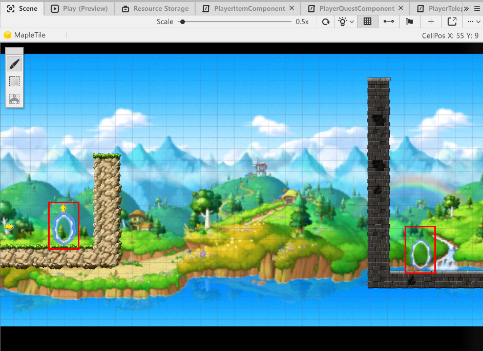
</p>

- 玩家可以藉由在冒險世界中直接移動來探索地圖。
- 但如果實作在所有地圖直接移動的型態，玩家有可能會感到疲憊。
- 此外，地圖製作者在製作地圖時，也會產生需要額外製作地圖之間邊界的製作成本。
- 為了解決此問題，需要可以使玩家立即移動至其他區域的功能。
- 楓之谷世界為了解決此問題，提供「TeleportService」和「PortalComponent」功能。

<br>

### 了解PortalComponent

<p align="center">
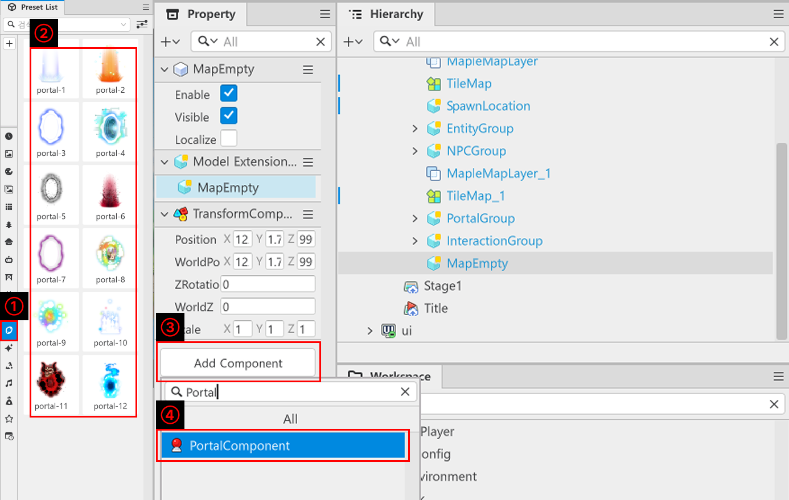
</p>

- 點擊楓之谷世界編輯器左側「Preset List」的「Portal」之後，即可配置想要的設計的Portal並使用。
- 此外，在「Hierarchy」視窗中建立實體後，可以新增「PortalComponent」並製作Portal。

<p align="center">
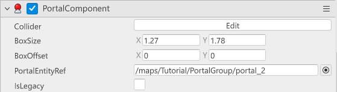
</p>

- 「PortalComponent」基本上跟TriggerComponent持有相同的Collider。
- 玩家的Collider和「PortalComponent」的Collider重疊的瞬間，玩家即可與「PortalComponent」進行互動。
- 因此玩家必須持有偵測碰撞的「TriggerComponent」。

<br>

#### ⚠️什麼是Collider?

<p align="center">
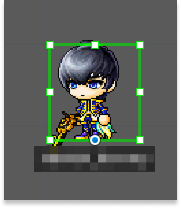
</p>

> 這是Collider的編輯畫面。綠色方形邊框是Collider的範圍。

- Collider的範圍主要以綠線顯示。
- 此範圍為偵測碰撞的範圍。
- 當與該範圍內其他持有Collide的實體重疊或碰撞時，則偵測到已發生碰撞。
- 可依據碰撞偵測新增功能，應用於攻擊、互動、事件觸發等多種用途。

<br>

#### 了解PortalComponent

<p align="center">

</p>

<table class="tg"><thead>
  <tr>
    <th class="tg-9wq8">名稱</th>
    <th class="tg-9wq8">說明</th>
  </tr></thead>
<tbody>
  <tr>
    <td class="tg-lboi">Collider</td>
    <td class="tg-lboi">Collider的大小可以調整。<br>按下Edit按鈕即可以視覺化直接看見碰撞範圍。</td>
  </tr>
  <tr>
    <td class="tg-lboi">BoxSize</td>
    <td class="tg-lboi">輸入數值可以調整Collider的大小。</td>
  </tr>
  <tr>
    <td class="tg-lboi">BoxOffset</td>
    <td class="tg-lboi">可以設定Collider的中心。</td>
  </tr>
  <tr>
    <td class="tg-lboi">PortalEntityRef</td>
    <td class="tg-lboi">使用此Portal時，用來指定角色移動位置的值。<br>可以透過指定其他具有PortalComponent的實體路徑來使用。</td>
  </tr>
</tbody>
</table>

<br>

### 運用PortalComponent

<p align="center">
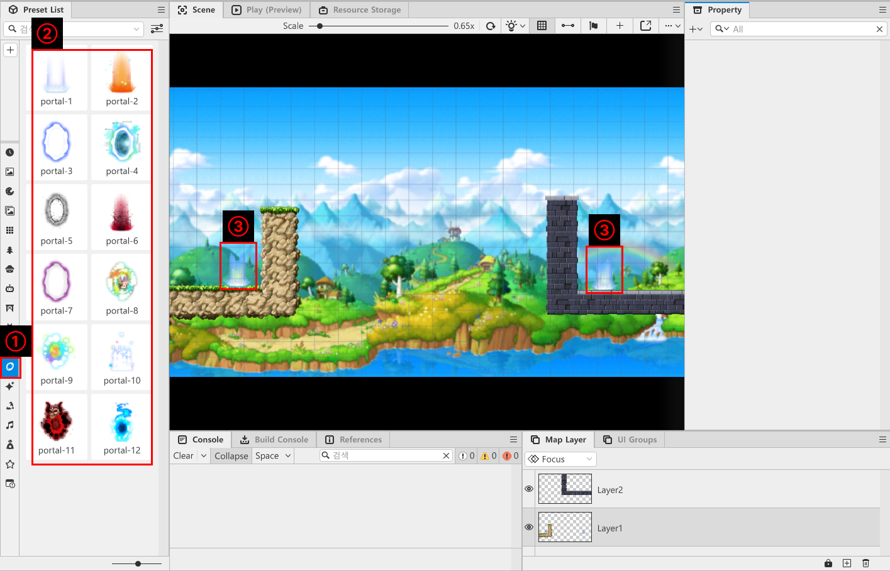
</p>

- 點擊「Preset List」中的「Portal」之後，再點擊想要的設計的Portal。
- 將Portal配置在「Scene」畫面中想要的位置。
    - 此時Portal配置入口、出口共2個。

<p align="center">
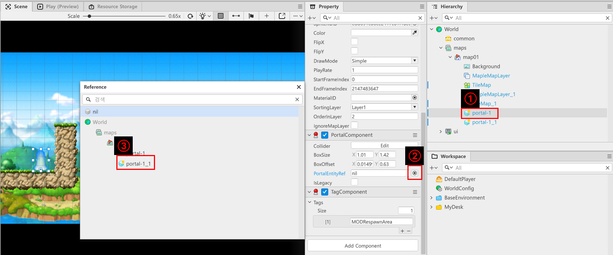
</p>

- 在「Hierarchy」視窗中點擊要指定為入口的Portal。
- 在「Property」視窗中，點擊「PortalComponent」裡面的「PortalEntityRef」右側按鈕。
- 在「Reference」視窗中點擊要指定為出口的Portal。

<p align="center">

</p>

- 即可看到Portal功能正常運作。

<br>

## 理解TeleportService

<p align="center">

</p>

- TeleportService是楓之谷世界提供的API。
- 提供預約角色移動、立即移動、以實體為基準移動等各種功能。
- 在範例世界中，學習以實體為基準移動，還有以地圖Position為基準移動。
    - 如果想學習額外功能，可以透過楓之谷世界編輯器上方「Help」選單中的API Reference來學習。

<br>

### 了解TeleportToEntityPath

<p align="center">
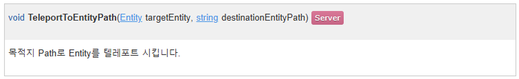
</p>

- 角色移動時，會移動至配置在「Hierarchy」的實體位置。
- 參數會請求以下值。
    - **targetEntity**：請求要移動的實體。
    - **destinationEntityPath**：請求要當作位置的實體。

<br>

### TeleportEntityPath使用範例

- 以下程式碼是以PlainText為基準編寫而成。
- 此程式碼是範例世界基準「TeleportLogic」的「TeleportPlayerForNewGame」Method。

```lua
@Logic
script TeleportLogic extends Logic

@ExecSpace("Server")
method void TeleportPlayerForNewGame(Entity LocalPlayerEntity)
-- 如果傳入的實體可以使用，則將其位置移動到Tutorial地圖的生成位置。
if isvalid(LocalPlayerEntity) then
	_TeleportService:TeleportToEntityPath(LocalPlayerEntity, "/maps/Tutorial/SpawnLocation")
end
end
end
```

- 以參數請求LocalPlayerEntity，意即進行遊戲的玩家。
- 目的地設定為Tutorial地圖中名稱為SpawnLocation的實體的位置。

<br>

## 理解TeleportToMapPosition

<p align="center">
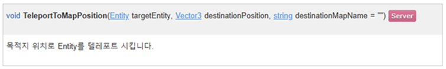
</p>

- 角色移動時，會移動至「Hierarchy」地圖中的指定位置。
- 參數會請求以下值。
    - **targetEntity**：請求要移動的實體。
    - **destinationPosition**：請求要移動的地圖位置。
    - **destinationMapName**：請求「Hierarchy」、「maps」中地圖要移動的地圖名稱。

<br>

### TeleportEntityPath使用範例

- 以下程式碼是以PlainText為基準編寫而成。
- 此程式碼是範例世界基準「TeleportLogic」的「TeleportContinueGame」Method。

```lua
@Logic
script TeleportLogic extends Logic

@ExecSpace("Server")
method void TeleportContinueGame(Entity LocalPlayerEntity, string MapName)
-- 如果傳入的實體可以使用，則將其位置移動至指定地圖的座標。
if isvalid(LocalPlayerEntity) then
	_TeleportService:TeleportToMapPosition(LocalPlayerEntity, _DataStorageLogic.lastPosition, MapName)
end
end

end
```
- 以參數請求LocalPlayerEntity，意即進行遊戲的玩家。
- 請求要移動的地圖名稱。
- 實際執行角色移動的「TeleportToMapPosition」中，將位置指定為玩家最後的位置值。

## TeleportService VS PortalComponent

<table class="tg"><thead>
  <tr>
    <th class="tg-9wq8">項目</th>
    <th class="tg-9wq8">TeleportService</th>
    <th class="tg-9wq8">PortalComponent</th>
  </tr></thead>
<tbody>
  <tr>
    <td class="tg-0pky">便利性</td>
    <td class="tg-lboi">由於必須直接實作程式碼，因此開發便利性優於PortalComponent。</td>
    <td class="tg-lboi">可以使用事先在Preset List中建立的Model，或僅在想要的實體PortalComponent並使用。</td>
  </tr>
  <tr>
    <td class="tg-0pky">時機調整</td>
    <td class="tg-lboi">由於是透過管理程式碼，開發者可以強制在想要的時機使角色移動。</td>
    <td class="tg-lboi">由於必須由玩家直接互動，因此具有限制。</td>
  </tr>
  <tr>
    <td class="tg-0pky">是否處理功能</td>
    <td class="tg-lboi">由於可以直接調整時機，因此使角色移動前，可以執行必要的計算或處理。</td>
    <td class="tg-lboi">由於無法直接調整時機，因此執行必要的計算或處理時，風險較高。</td>
  </tr>
</tbody>
</table>

<br>

## 製作TeleportLogic

- 製作用於範例世界中使玩家移動的TeleportLogic。
- 編寫程式碼使得玩家透過TeleportLogic首次開始世界，或繼續進行時，可以啟動個別功能。

<p align="center">
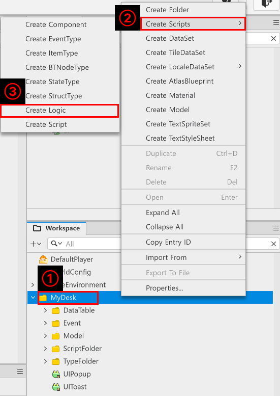
</p>

- 在「Workspace」中點擊「MyDesk」。
- 點擊「Create Scripts」之後再點擊「Create Logic」。
- 之後將建立在「Workspace」的Logic名稱變更為TeleportLogic。

```lua
@Logic
script TeleportLogic extends Logic

@ExecSpace("Server")
method void TeleportPlayerForNewGame(Entity LocalPlayerEntity)
-- 如果傳入的實體可以使用，則將其位置移動到Tutorial地圖的生成位置。
if isvalid(LocalPlayerEntity) then
	_TeleportService:TeleportToEntityPath(LocalPlayerEntity, "/maps/Tutorial/SpawnLocation")
end
end

@ExecSpace("Server")
method void TeleportContinueGame(Entity LocalPlayerEntity, string MapName)
-- 如果傳入的實體可以使用，則將其位置移動至指定地圖的座標。
if isvalid(LocalPlayerEntity) then
	_TeleportService:TeleportToMapPosition(LocalPlayerEntity, _DataStorageLogic.lastPosition, MapName)
end
end

end
```
> 此程式碼是以楓之谷世界的Plain Text為基準編寫而成。

-  各Method執行功能如下。
    - 「TeleportPlayerForNewGame」：在標題畫面中點擊重新開始按鈕時，移動至最初開始位置以開始遊戲。
    - 「TeleportContinueGame」：點擊繼續按鈕時，會讀取儲存的玩家存檔資料，並以最後儲存的位置為基準開始的Method。

<br>

## 製作PlayerTeleportComponent

- 防止玩家角色在標題畫面顯示的狀況。
- 判斷玩家角色是否在Title地圖，並決定是否顯示角色。

<p align="center">
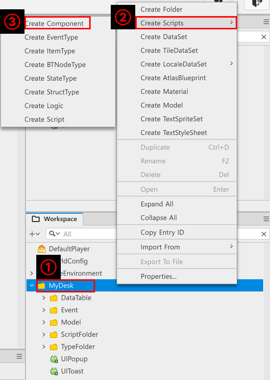
</p>

- 在「Workspace」中點擊「MyDesk」。
- 點擊「Create Scripts」之後再點擊「Create Logic」。
- 將建立的Component名稱變更為「PlayerTeleportComponent」。

<p align="center">
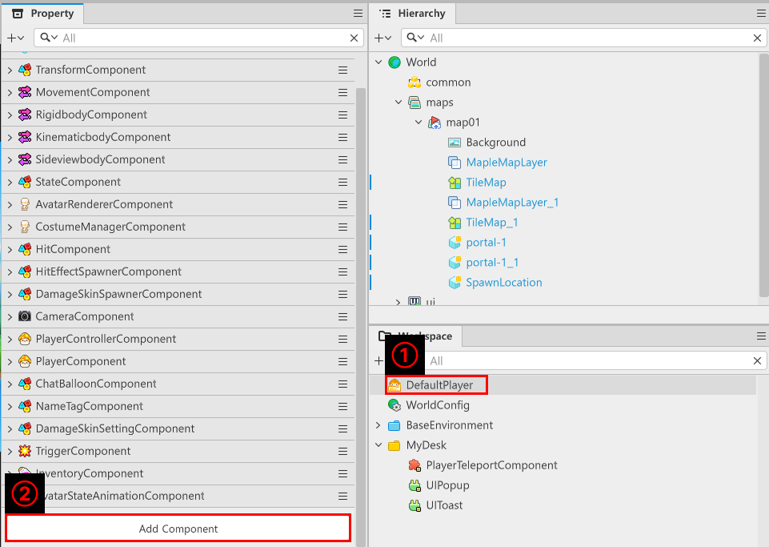
</p>

- 為了加入建立的Component，在「Workspace」中點擊「DefaultPlayer」。
- 點擊「Property」視窗最上方的「Add Component」之後，搜尋已建立的「PlayerTeleportComponent」並將其加入。

<p align="center">
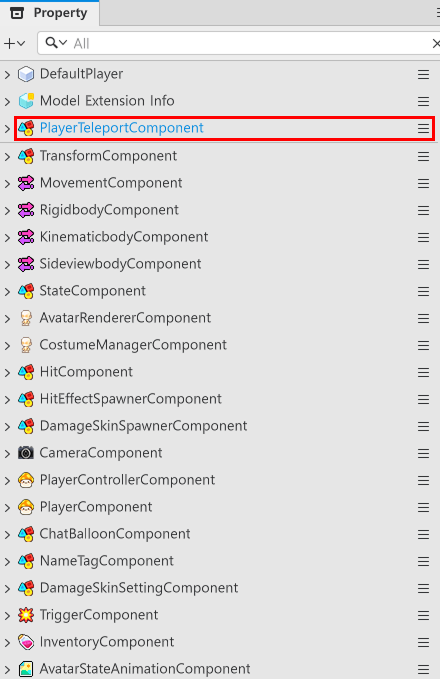
</p>

- 確認「PlayerTeleportComponent」是否正常載入至「Property」視窗。

```lua
@Component
script PlayerTeleportComponent extends Component

@ExecSpace("ServerOnly")
method void OnBeginPlay()
-- 此程式碼是首次開始遊戲時，避免角色顯示在標題畫面。
self.Entity.Enable = false
self.Entity.Visible = false
end

@EventSender("Self")
handler HandleEntityMapChangedEvent(EntityMapChangedEvent event)
-- 當目前地圖狀態不是Title時，會啟用角色。
if not(event.NewMap.CurrentMapName == "Title") then
	self.Entity.Enable = true
	self.Entity.Visible = true
-- 當目前地圖狀態為Title時，會停用角色。
else
	self.Entity.Enable = false
	self.Entity.Visible = false
end
end

end
```

> 此程式碼是以楓之谷世界的Plain Text為基準編寫而成。

- 各Method執行功能如下。
    - 「OnBeginPlay」：首次執行遊戲時，避免玩家角色顯示在標題畫面的Method。
    - 「HandleEntityMapChangeEvent」：當偵測到玩家角色實體在地圖間移動時，若移動至Title地圖，則停止角色顯示。

<br>

## 最低實作標準

- 配置使角色位置移動的PortalComponent，使角色能夠移動。
- 實作Component及功能使得點擊UI按鈕時角色能夠移動。
- 重新建立功能，使得製作的Component能夠在標題畫面中使用。

<br>

## 應用與擴展方向

- 配置只能單向移動的PortalComponent，並實作地圖使玩家能夠從孤立地區中逃脫。
- 運用TeleportService，在之後製作道具時製作村莊移動道具。
- 實作儲存及讀取功能，並在讀取儲存資訊時，讓玩家出現在最後儲存的位置。