# [📖進階學習] 實作背包功能
<br>
<br>
<br>

## 影片時間軸
- 可在課程影片中以下時間點進行學習。
- 實作背包功能：`00:45:23`

<br>

## 學習目標
- 製作能夠顯示玩家取得的道具的背包。
- 實作能夠顯示道具資訊並確認詳細資訊的功能。

<br>

## 觀看該影片後可嘗試執行的內容
- 可以將實體UI修改為製作者想要的型態。
- 修改功能，使得背包的欄位不再是固定數量，而是捲動型態以提供更多欄位。

<br>

## 什麼是背包功能?

<p align="center">
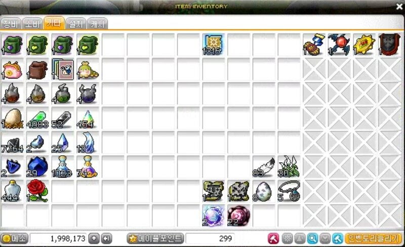
</p>

> 楓之谷世界的背包UI。可以儲存及確認各式各樣的道具。

- 如果玩家在冒險期間有獲得道具，就需要可以確認道具的UI。
- 背包是玩家取得道具時，透過UI顯示取得哪些道具的UI。
- 也可以依照遊戲特性，決定道具的使用功能。

<br>

## 製作背包UI

<br>

### 製作Frame UI
- 運用先前新增UI的方法來新增「InventoryUI」。

<p align="center">
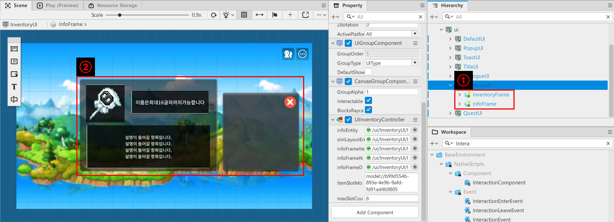
</p>

- 在建立的「InventoryUI」當中製作2個子實體。
    - 將製作的實體名稱設定為「InventoryFrame」、「InfoFrame」。
    - 在製作的實體中新增「SpriteGUIRendererComponent」之後，選擇要用來當作背景使用的圖片。
    - 之後在以想要的大小及型態配置在「Scene」畫面中。

<br>

### 製作InventoryFrame

<p align="center">
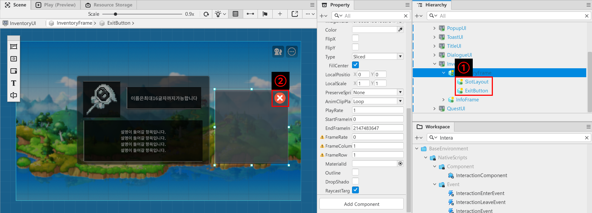
</p>

- 在製作的「InventoryFrame」當中建立2個子實體。
    - 將2個實體名稱分別建立為「SlotLayout」、「ExitButton」。
    - 在「ExitButton」中新增「SpriteGUIRendererComponent」、「ButtonComponent」。
    - 將「SpriteGUIRendererComponent」的「ImageRUID」登錄為關閉按鈕要使用的圖片。

<p align="center">
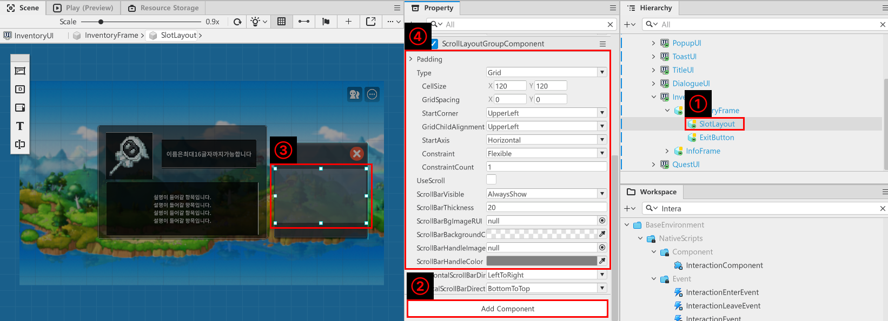
</p>

- 在「Hierarchy」中點擊「SlotLayout」。
- 在「SlotLayout」中新增「ScrollLayoutGroupComponent」。
- 在「Scene」畫面中，將適當範圍設定成顯示背包欄位的空間。
- 在「Property」視窗中變更「ScrollLayoutGroupComponent」的值。
    - **Type**：設定為Grid，使得以棋盤形式排列。
    - **CellSize**：指定子實體的大小。以之後要製作的「InventoryItemSlot」為基準調整大小。
    - **GridSpacing**：如果希望子實體之間有間隔，則輸入X及Y值。
    - **StartCorner**：設定為UpperLeft，使其從左上角開始對齊排列。
    - **GridChildAlignment**：即使實體留有空間，也設定為UpperLeft使其從左上角開始排列。
    - **StartAxis**：設定為Horizontal，使子實體子水平方式排列。
    - **Constraint**：設定為Flexible，使子實體的排列可以彈性調整。
    - **ConstraintCount**：當Constraint值不是Flexible值，而是設定為其他值的時候，輸入數值使其依照想要的數量排列。

<br>

### 製作InfoFrame

<p align="center">
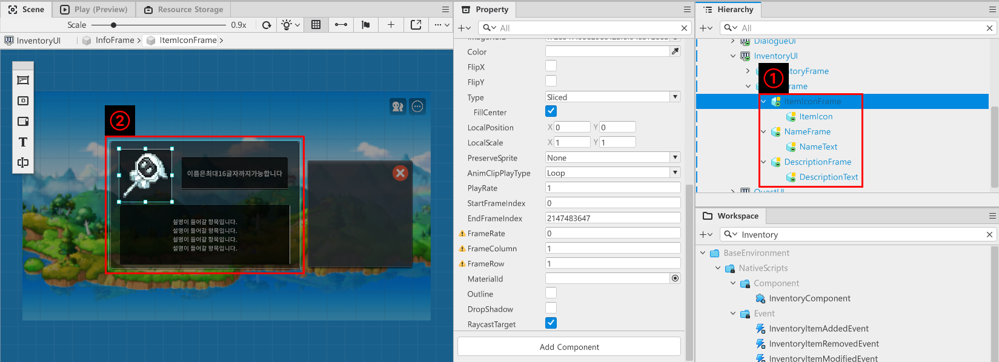
</p>

- 在「Hierarchy」中點擊前面製作的「InfoFrame」之後，建立子實體。
- 將建立的子實體變更為以下名稱。
    - 「ItemIconFrame」：用來作為道具圖示背景的實體。
    - 「NameFrame」：使用於顯示名稱位置背景的實體。
    - 「DescriptionFrame」：使用於顯示道具說明位置背景的實體。
    - 此3個實體必須具備「SpriteGUIRendererComponent」。
    - 將每個幀的圖片以適當大小進行配置。
- 分別在「ItemIconFrame」、「NameFrame」、「DescriptionFrame」逐一新增子實體。
    - 「ItemIcon」：「ItemIconFrame」的子實體，輸出道具的圖片。
        - 「ItemIcon」包含「SpriteGUIRendererComponent」這個Component。
        - 配合「ItemIconFrame」的大小設定圖片尺寸。
    - 「NameText」：「NameFrame」的子實體，輸出道具名稱。
    - 「DescriptionText」：「DescriptionFrame」的子實體，輸出道具說明。
        - 「NameText」和「DescriptionText」包含「TextGUIRendererComponent」。
        - 配合「Nameframe」和「DescriptionFrame」的大小設定顯示文字的範圍。

<br>

### 製作InventoryItemSlot

<p align="center">
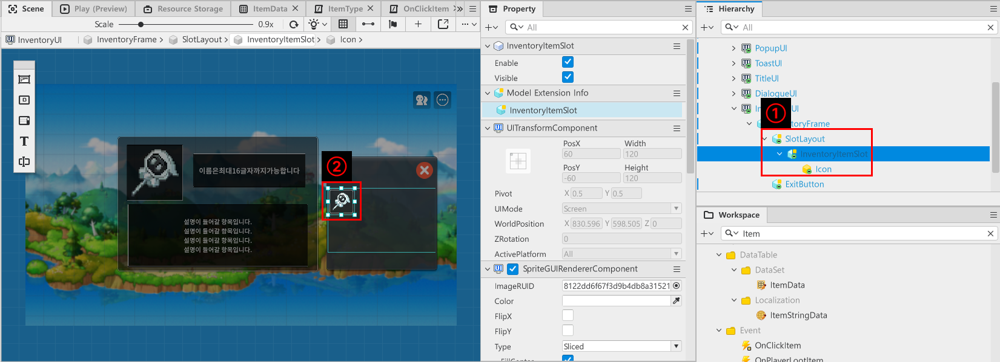
</p>

- 「InventoryItemSlot」是用來當作背包欄位的Model。
- 用來當作「InventoryUI」的「SlotLayout」實體的子實體。
- 在「InventoryUI」中製作子實體「InventoryItemSlot」。
- 「InventoryItemSlot」由自身和子實體「Icon」組成。
    - 「InventoryItemSlot」：負責顯示背包欄位、偵測點擊操作，以及持有物品資訊的功能。
    - 「Icon」：用來顯示指派給自身的道具圖片的實體。
- 在各實體中新增以下Component。
    - `InventoryItemSlot`: `SpriteGUIRendererComponent`, `ButtonComponent`
    - `Icon`: `SpriteGUIRendererComponent`
- 最後為了管理「InventoryItemSlot」，製作Component「InventorySlotComponent」並登錄。

<p align="center">
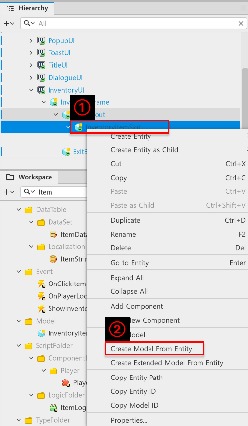
</p>

- 以滑鼠右鍵點擊製作完成的「InventoryItemSlot」之後，再點擊「Create Model From Entity」。
- 確認「Workspace」、「MyDesk」中是否順利製作Model。
- 若順利製作Model，則背包UI準備已完成。

<br>

## 製作Event

<p align="center">
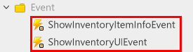
</p>

- 製作與背包相關的Event。
    - 「ShowInventoryUIEvent」：點擊背包鍵或按鈕時，用來顯示背包的Event。
    - 「ShowInventroyItemInfoEvent」：點擊背包中道具時，用來顯示道具資訊的Event。

<p align="center">
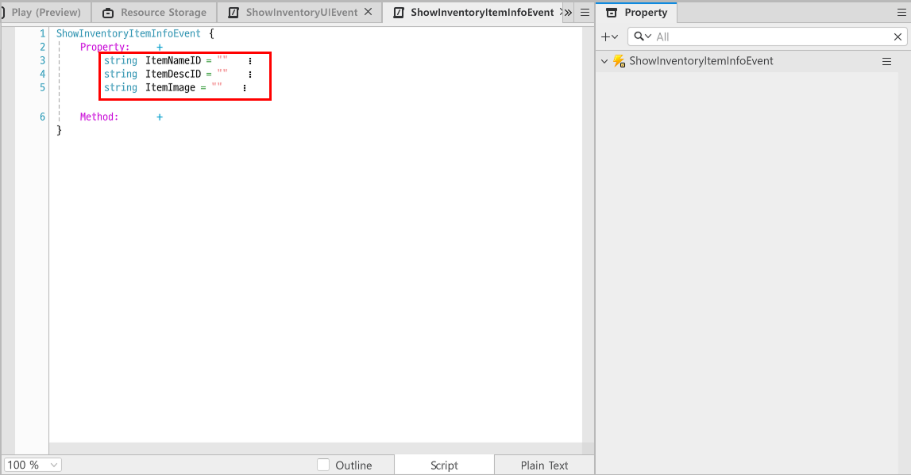
</p>

- 新增以下元素為「ShowInventoryItemInfoEvet」的Property。
    - **string ItemNameID**：用來傳遞道具ID的Property。
    - **string ItemDescID**：用來傳遞道具說明ID的Property。
    - **string ItemImage**：用來傳遞道具圖示RUID的Property。

<br>

- 另外製作用來偵測點擊道具時的「OnClickItem」事件。

<br>

## 製作DataSet
- 必須製作用來管理道具資訊的DataSet。
    - 範例世界提供的DataSet只具備能夠在背包中顯示道具的基本條件。
    - 各位在之後可以依照要製作的世界來新增DataSet的元素並實作處理功能，將DataSet轉換為可以管理各式各樣的道具。
- 在「Workspace」的「MyDesk」中製作DataSet。
<p align="center">
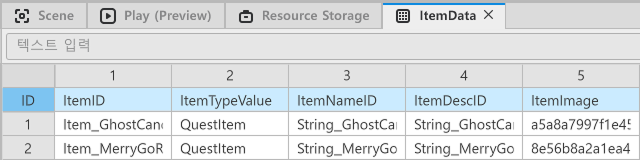
</p>

<table class="tg"><thead>
  <tr>
    <th class="tg-9wq8">名稱</th>
    <th class="tg-9wq8">說明</th>
  </tr></thead>
<tbody>
  <tr>
    <td class="tg-lboi">ItemID</td>
    <td class="tg-lboi">用來存放道具ID的值。</td>
  </tr>
  <tr>
    <td class="tg-lboi">ItemTypeValue</td>
    <td class="tg-lboi">用來指定道具形式的值。目前只有無效的QuestItem。<br>此新增欄位是之後可以用來新增Weapon、Armor的武器、防具等。</td>
  </tr>
  <tr>
    <td class="tg-lboi">ItemNameID</td>
    <td class="tg-lboi">用來存放道具名稱ID的值。<br>使用ItemStringData的Key值。</td>
  </tr>
  <tr>
    <td class="tg-0pky">ItemDescID</td>
    <td class="tg-0pky">用來存放道具說明ID的值。<br>使用ItemStringData的Key值。</td>
  </tr>
  <tr>
    <td class="tg-0pky">ItemImage</td>
    <td class="tg-0pky">用來存放道具圖片RUID的值。</td>
  </tr>
</tbody>
</table>

- ItemStringData在範例世界中可以至「Workspace」、「MyDesk」、「DataTable」、「Localization」中確認。

<br>

## 製作ItemType
- 為了方便管理道具的值，可以記錄通用的ItemData形式。
- 透過Type型態的Script來組成元素。

<p align="center">
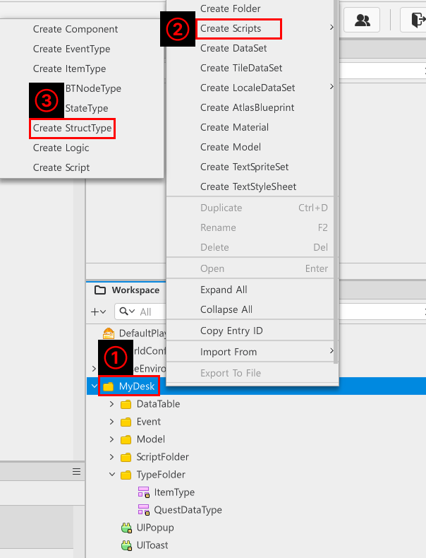
</p>

- 在「Workspace」中點擊「MyDesk」。
- 在「Create Scripts」中選擇「Create StructType」。
- 將製作的Type Script名稱設定為「ItemType」。

<p align="center">
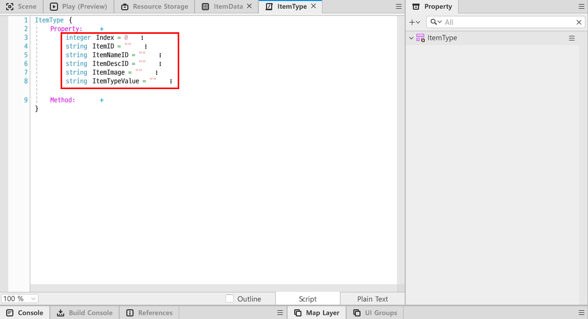
</p>

- 將前面製作的「ItemData」元素全部記錄至「ItemType」的Property中。
    - 「Index」是為了之後記錄進入背包的物品順序而製作的Property。

<br>

## 製作UIInventoryController
- 為了管理「InventoryUI」的元素，製作Component「UIInventoryController」。
- 透過「Add Component」將製作的Component記錄至「InventoryUI」。

```lua
@Component
script UIInventoryController extends Component

property Entity infoEntity = "21856f11-da9c-4d39-869f-38679e45396a"

property Entity slotLayoutEntity = "413114e4-bc44-4702-8c59-04c097ccab27"

property table itemSlotTable = {}

property SpriteGUIRendererComponent infoFrameItemIcon = "a114218d-e9af-4529-a361-c40ff4b026a0"

property TextGUIRendererComponent infoFrameName = "cfae0263-8821-4d04-9d51-7cbf70f1f963"

property TextGUIRendererComponent infoFrameDesc = "651d2c82-7c70-4f17-bf92-43ab69b4fa5d"

property string itemSlotModelID = "model://b99d554b-893e-4e9b-9afd-fd91ad4b9805"

property number maxSlotCount = 8

@ExecSpace("ClientOnly")
method void OnBeginPlay()
-- 驗證顯示道具資訊的InfoFrame是否可使用。
if not isvalid(self.infoEntity) then
	-- 如果顯示道具資訊的InfoFrame為nil，則顯示錯誤log之後中斷程式碼執行。
	log_warning("InventoryUI中未登錄用來顯示資訊的InfoFrame！")
	return
end
-- 如果可使用，則停用infoEntity。
self.infoEntity.Enable = false

-- 如果背包的欄位數量小於1，則建立背包欄位。
if #(self.itemSlotTable) < 1 then
	for i = 1, self.maxSlotCount do
		-- 建立1個空背包欄位。
		local slotEntity = _SpawnService:SpawnByModelId(self.itemSlotModelID, tostring("ItemSlot_"..i), Vector3.zero, self.slotLayoutEntity)
		-- 若順利建立實體，則嘗試重置為初始狀態。
		if isvalid(slotEntity) then
			slotEntity.InventorySlotComponent:SetDefault()
			--將建立的實體登錄至itemSlotTable。
			self.itemSlotTable[i] = slotEntity.InventorySlotComponent
		end
	end
end

-- 避免在遊戲開始時顯示背包UI，將停用背包UI。
self.Entity.Visible = false
self.Entity.Enable = false
end

@ExecSpace("ClientOnly")
method void ShowInventory()
-- 變更為顯示自身狀態。
self.Entity.Visible = true
self.Entity.Enable = true
end

@ExecSpace("ClientOnly")
method void HideInventory()
-- 變更為隱藏自身狀態。
self.infoEntity.Enable = false
self.Entity.Visible = false
self.Entity.Enable = false
end

@ExecSpace("ClientOnly")
method void UpdateItemSlot(OnPlayerLootItem event)
-- 如果玩家取得道具，則嘗試更新背包。
for i = 1, #(self.itemSlotTable) do
	-- 在目前的背包欄位中尋找是否存在相同道具。
	local slotItemName = self.itemSlotTable[i]:ReturnItemID()
	-- 檢查取得的ItemName是否為nil。
	if not _UtilLogic:IsNilorEmptyString(slotItemName) then
		-- 若ItemName正常存在，則增加傳入的itemID的Count。
		if slotItemName == event.ItemID then
			self.itemSlotTable[i]:UpdateItemCount(event.ItemCount)
			return
		end
	end
end
-- 如果全部搜尋之後也沒有相同名稱的ItemSlot，則尋找空欄位並更新。
for i = 1, #(self.itemSlotTable) do
	-- 取得第i個欄位中記錄的ItemID值。
	local slotItemName = self.itemSlotTable[i]:ReturnItemID()
	-- 如果取得的值為nil，表示為空欄位，因此進行寫入。
	if _UtilLogic:IsNilorEmptyString(slotItemName) then
		-- 以ItemLogic中的ItemID值為基準，取得Dataset的值。
		local getTableItemData = _ItemLogic:ReturnItemData(event.ItemID)
		-- 建立以ItemType型態傳遞的值。
		local inputItemData = ItemType()
		-- 登錄用來區分道具、背包內欄位數值的ItemID值。
		inputItemData.ItemID = event.ItemID
		-- 登錄用來顯示道具圖示的ItemImage值。
		inputItemData.ItemImage = getTableItemData.ItemImage
		-- 登錄用來顯示道具名稱的ItemName值。
		inputItemData.ItemNameID = getTableItemData.ItemNameID
		-- 登錄用來指定道具類型的ItemTypeValue值。
		inputItemData.ItemTypeValue = getTableItemData.ItemTypeValue
		-- 登錄用來顯示道具說明的ItemDescID值。
		inputItemData.ItemDescID = getTableItemData.ItemDescID
		-- 將儲存的資料登錄至欄位。
		self.itemSlotTable[i]:InitItemData(getTableItemData, event.ItemCount)
		self.itemSlotTable[i]:UpdateItemCount(event.ItemCount)
		return
	end
end
end

@ExecSpace("ClientOnly")
method void ShowItemInfo(ShowInventoryItemInfoEvent ItemData)
-- 啟用道具資訊視窗。
self.infoEntity.Enable = true
self.infoEntity.Visible = true
-- 顯示道具資訊視窗的道具圖片。
self.infoFrameItemIcon.ImageRUID = ItemData.ItemImage
-- 透過Localize道具資訊視窗的名稱，顯示翻譯後的值。
self.infoFrameName.Text = _LocalizationService:GetText(ItemData.ItemNameID)
-- 透過Localize道具資訊視窗的道具說明，顯示翻譯後的值。
self.infoFrameDesc.Text = _LocalizationService:GetText(ItemData.ItemDescID)
end

@ExecSpace("ClientOnly")
method void UpdateLoadData()

end

@EventSender("Entity", "cfbc60a4-3eb4-4d8b-968f-bb02558514c1")
handler HandleButtonClickEvent(ButtonClickEvent event)
-- 停用背包UI。
self:HideInventory()
end

@EventSender("LocalPlayer")
handler HandleShowInventoryEvent(ShowInventoryUIEvent event)
self:ShowInventory()
end

@EventSender("LocalPlayer")
handler HandleOnPlayerLootItem(OnPlayerLootItem event)
self:UpdateItemSlot(event)
end

@EventSender("Self")
handler HandleShowInventoryItemInfoEvent(ShowInventoryItemInfoEvent event)
self:ShowItemInfo(event)
end

end
```

> 此程式碼是以Plain Text為基準編寫而成。

- 將以上程式碼編寫進「UIInventoryController」。
- Property由以下元素組成。
- 將對應實體登錄至各元素。
  - **infoEntity**：用來登錄「InventoryUI」的「InfoFrame」實體的Property。
  - **slotLayoutEntity**：用來登錄「InventoryFrame」實體的「SlotLayout」實體的Property。
  - **infoFrameItemIcon**：登錄「InfoFrame」的「ItemIconFrame」、「ItemIcon」，使道具資訊視窗當中顯示道具圖示。
  - **infoFrameName**：登錄「InfoFrame」的「NameFrame」、「NameText」，使道具資訊視窗當中顯示道具名稱。
  - **infoFrameDesc**：登錄「InfoFrame」的「DescriptionFrame」、「DescriptionText」，使道具資訊視窗當中顯示道具資訊。
  - **itemSlotModelID**：用來登錄前面製作的「InventoryItemSlot」的Entry ID的Property。
    - 在「Workspace」、「MyDesk」中點擊製作的「InventoryItemSlot」的Model之後，點擊「Copy Entry ID」並登錄複製的值。
  - **maxSlotCount**：記錄要建立的背包欄位數量。在範例世界中要製作8個背包欄位，因此輸入了8。

<br>

## 製作InventorySlotComponent
- 負責管理用來背包欄位的「InventoryItemSlot」的Component。
- 如果該Component取得道具資訊，則會將道具資訊記錄至欄位並更新UI。
- 此外配置當自身被點擊時，會顯示道具資料視窗的功能。

```lua
@Component
script InventorySlotComponent extends Component

property SpriteGUIRendererComponent spriteComponent = "09988a83-db6c-4895-a2a8-f13daae52688"

property ItemType itemData = ItemType()

property number itemCount = 0

@ExecSpace("ClientOnly")
method void OnBeginPlay()
-- 遊戲開始時，重置為Default狀態。
self:SetDefault()
end

@ExecSpace("ClientOnly")
method void SetDefault()
-- 如果spriteComponent為空白，則在該實體的子實體中尋找Icon並登錄。
if self.spriteComponent == nil then
	local findIcon = self.Entity:GetChildByName("Icon")
	if isvalid(findIcon.SpriteGUIRendererComponent) then
		self.spriteComponent = findIcon.SpriteGUIRendererComponent
	end
end
-- 將用來顯示圖示的實體的Visible設定為false，使其只顯示空背包。
self.spriteComponent.Entity.Visible = false
-- 將存放道具資訊的itemData值重置為空狀態。
self.itemData = ItemType()
end

@ExecSpace("ClientOnly")
method string ReturnItemID()
-- 回傳該欄位的ItemID。
return self.itemData.ItemID
end

@ExecSpace("ClientOnly")
method void InitItemData(ItemType ItemData)
-- 驗證傳入的資料是否可以正常使用。
if not isvalid(ItemData) or ItemData.ItemID == "" or ItemData.ItemID == nil then
	-- 如果傳入的資料無法使用，則輸出錯誤log。
	log_error("傳入的道具資料為nil或無法使用！")
	return
end
-- 由於傳入的資料可以使用，因此根據取得的資訊取得資料。
self.itemData = ItemData
local getData = _ItemLogic:ReturnItemData(self.itemData.ItemID)
-- 在找到的DataSet中輸入圖片RUID之後，將顯示道具圖片。
self.spriteComponent.ImageRUID = getData.ItemImage
self.spriteComponent.Entity.Visible = true
self.spriteComponent.Entity.Enable = true
end

@ExecSpace("ClientOnly")
method void UpdateItemCount(number Count)
-- 依照傳入的數量增加目前的Count。
self.itemCount = self.itemCount + Count
end

@EventSender("Self")
handler HandleButtonClickEvent(ButtonClickEvent event)
-- 如果欄位中沒有記錄道具ID，則不顯示道具資訊視窗。
if _UtilLogic:IsNilorEmptyString(self.itemData.ItemID) then
	return
-- 如果欄位裡有道具ID，則呼叫Event使道具資訊視窗顯示。
else
	-- 輸入所有事件的Property值以進行傳遞。
	local itemData = ShowInventoryItemInfoEvent()
	itemData.ItemNameID = self.itemData.ItemNameID
	itemData.ItemImage = self.itemData.ItemImage
	itemData.ItemDescID = self.itemData.ItemDescID
	-- 找到InventoryUI之後，將事件傳遞至該UIGroup。
	local inventoryUI = _EntityService:GetEntityByPath("/ui/InventoryUI")
	inventoryUI:SendEvent(itemData)
end
end

end
```
> 此程式碼是以Plain Text為基準編寫而成。

- 將以上程式碼輸入InventorySlotComponent。
- Method負責執行以下功能。
- **OnBeginPlay**：用來在遊戲開始的瞬間執行SetDefault的Method。
- **SetDefault**：用來將背包欄位設定為起始狀態的Method。
- **ReturnItemID**：回傳該背包欄位擁有的ItemID的Method。
- **InitItemData**：以傳入的ItemData為基準，更新欄位的UI。
- **UpdateItemCount**：依照傳入的數量增加「itemCount」的值。
- **HandleButtonClickEvent**：點擊自身時，找到「InventoryUI」並將記錄的道具資訊傳遞至自身，並呼叫Event使道具資訊視窗顯示。

<br>

## 製作ItemLogic
- 「ItemLogic」是用來管理「ItemData」DataSet的Logic。
- 以「ItemData」為基準，傳入「ItemID」後，執行回傳對應值資訊的功能。
- 建立「ItemLogic」之後，編寫以下程式碼。
```lua
@Logic
script ItemLogic extends Logic

property table itemData = {}

@ExecSpace("ClientOnly")
method void OnBeginPlay()
-- 為了讀取ItemData DataSet，在遊戲開始時呼叫方法。
self:InitItemData()
end

@ExecSpace("ClientOnly")
method void InitItemData()
-- 檢查itemData是否為nil或是否無資料。
if not isvalid(self.itemData) or not next(self.itemData) then
	-- 如果itemData為nil或沒有資料時，則嘗試重置。
	local findData = _DataService:GetTable("ItemData")
	-- 如果findData為nil，則輸出錯誤log並中斷程式碼執行。
	if not isvalid(findData) then
		log_error("找不到ItemData DataSet！")
		return
	end
	-- 如果正常找到DataSet，則登錄資料。
	-- 取得ItemData的行數。
	local rowCount = findData:GetRowCount()
	-- 依照ItemData的行數，搜尋行並登錄資料。
	for i = 1, rowCount do
		-- 取得第i行的ItemID值。
		local itemKey = tostring(findData:GetCell(i, "ItemID"))
		-- 若取得的ItemID為nil或""，則輸出錯誤log並中斷程式碼執行。
		if not isvalid(itemKey) or itemKey == "" then
			log_error("第i行ItemData DataSet的Item ID值為nil或空白欄！")
			break
		end
		-- 若值正常存在，則嘗試登錄。
		local dataValue = ItemType()
		-- 將道具資訊的Index登錄為i值。
		dataValue.Index = i
		-- 將道具資訊的ItemID登錄為先前找到的Key值。
		dataValue.ItemID = itemKey
		-- 在第i行的Cell中尋找道具資訊的ItemTypeValue並登錄。
		dataValue.ItemTypeValue = tostring(findData:GetCell(i, "ItemTypeValue"))
		-- 在第i行的Cell中尋找道具資訊的ItemNameID並登錄。
		dataValue.ItemNameID = tostring(findData:GetCell(i, "ItemNameID"))
		-- 在第i行的Cell中尋找道具資訊的ItemDescID並登錄。
		dataValue.ItemDescID = tostring(findData:GetCell(i, "ItemDescID"))
		-- 在第i行的Cell中尋找道具資訊的ItemImage並登錄。
		dataValue.ItemImage = tostring(findData:GetCell(i, "ItemImage"))
		-- 登錄輸入的資料。
		self.itemData[itemKey] = dataValue
	end
	-- 如果登錄正常完成，則輸出log。
	log("完成登錄至ItemData ItemLogic！")
	return
end
-- 由於沒有嘗試道具解析，因此將該內容傳遞為log。
log("ItemData未登錄至ItemLogic。可能已經解析，或無法正常讀取DataSet！")
end

@ExecSpace("ClientOnly")
method table ReturnItemData(string ItemID)
-- 如果有以ItemID為Key的itemData，則return該值。
if isvalid(self.itemData[ItemID]) or next(self.itemData[ItemID]) then
	return self.itemData[ItemID]
else
	-- 如果沒有以ItemID為Key的itemData，則輸出錯誤log。
	log_error("沒有以"ItemID.."為Key的ItemData存在。")
	return nil
end
end

end
```

> 該程式碼是以Plain Text為基準編寫而成。

<br>

## 最低實作標準
- 實作顯示玩家獲得的道具資訊的功能。
- 實作玩家可以開啟及關閉背包的功能。
- 使背包欄位可以自動建立，並在取得道具資訊時進行更新。

<br>

## 應用與擴展方向
- 製作背包的各種形式道具，例如裝備、消耗道具等。
- 製作使用各道具時能夠套用效果的功能。
- 依照變更的道具形式，變更UI的資訊視窗並提供資訊。