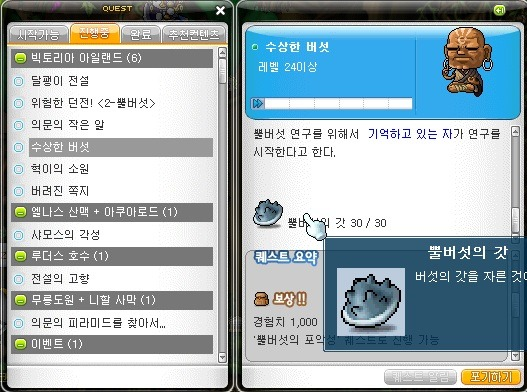
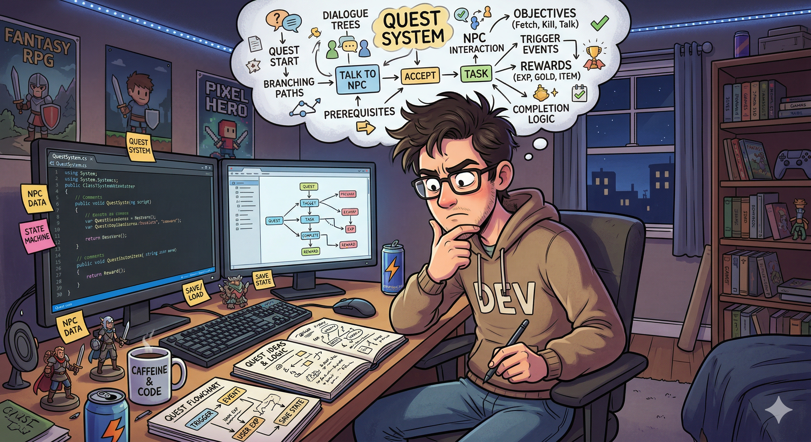
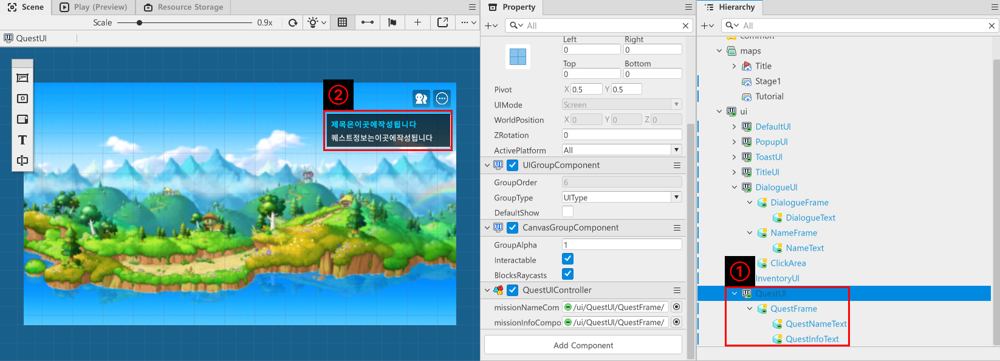
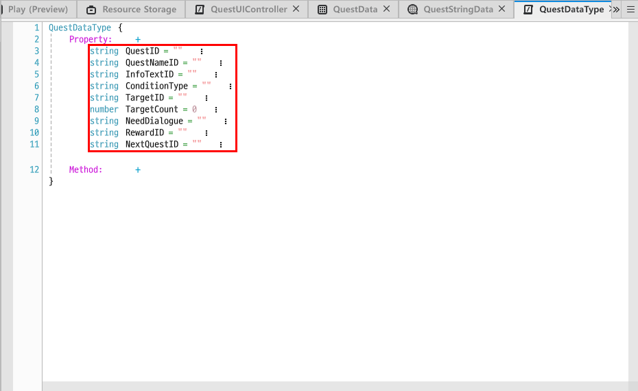
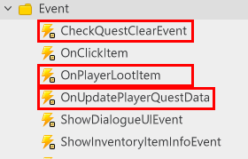
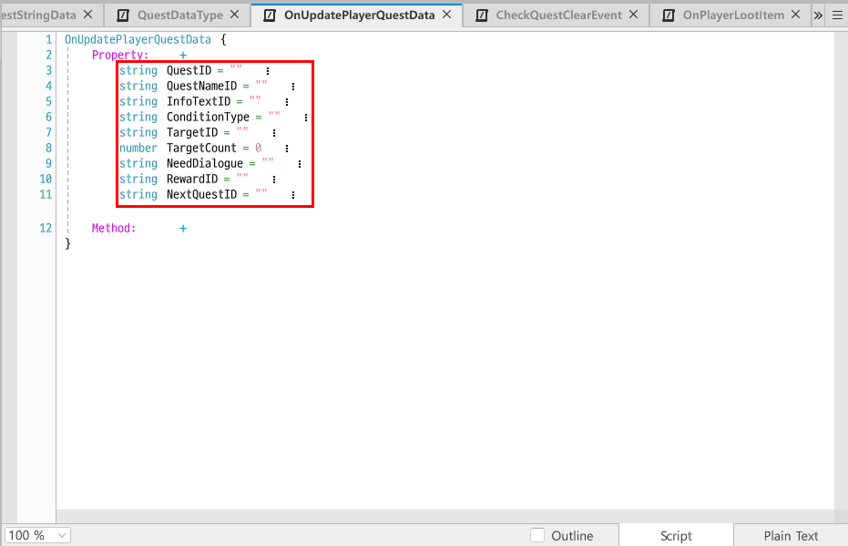
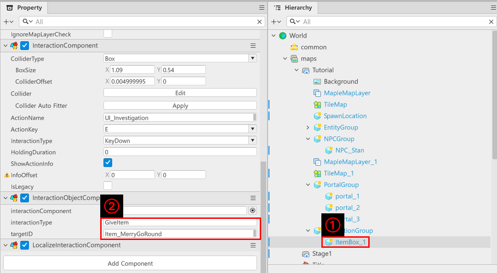

# [📖進階學習] 實作任務系統
<br>
<br>
<br>

## 影片時間軸
- 可在課程影片中以下時間點進行學習。
- 實作任務系統：`01:12:04`

<br>

## 學習目標
- 學習引導玩家行動的任務系統的製作方法。
- 學習此範例的提供方式，並學習製作遊戲時應該新增及變更哪些元素。
- 理解任務系統，並透過任務的彼此串聯，以控制遊戲的流程。
- 學習製作獎勵系統，以依照任務提供獎勵，並提升玩家進行任務的動力。

<br>

## 觀看該影片後可嘗試執行的內容
- 實作任務系統，並製作滿足條件時接續下一個任務的功能。
- 實作玩家完成任務時發放獎勵，並更新背包的功能。
- 調整用來顯示任務資訊的UI結構，使UI更加直覺。

<br>

## 什麼是任務系統?

<p align="center">

</p>

> 這是楓之谷世界的任務UI。會顯示玩家需要執行的行動和獎勵。

- 任務是控制或引導玩家行動的方式。
- 引導玩家學習應該進行哪些行為，以及如何透過行為獲得獎勵。
- 玩家以學習的經驗為基準，執行任務並獲得獎勵，形成透過角色成長以降低遊玩難度的行為循環。
- 因此任務越精密，玩家就越能投入遊戲，而開發者也能夠引導遊戲流程往想要的方向進行。

<p align="center">

</p>

> 在《薩爾達傳說：曠野之息》中，玩家只要進行某種行動就會給予相對應的獎勵。雖不具強制性，但玩家可以學習並重複相同行為。

- 雖然視覺上看不見，但可以運用任務系統來打造遊戲循環。
- 在《薩爾達傳說：曠野之息》中，如果要獲得克洛格果實，就必須解開拼圖或到達特定位置。透過克洛格果實可以增加背包欄位。
- 這個行為只適用於單一任務，因此如果玩家想增加背包欄位，就必須重複執行尋找克洛格果實與解拼圖的流程。

<br>

### ⚠️ 範例世界的任務系統

<p align="center">

</p>

> 此為使用Gemini產生的AI圖片。

- 任務系統會因為遊戲設計而呈現複雜且困難的架構。
- 此外也會因為遊戲的方向性、需要執行任務的角色而改變設計。
- 因此為了在範例世界中實作任務系統，首先說明最基礎的方式。
- 學習該方式的內容之後，再思考如何在遊戲中使用任務系統並進行設計。

<br>

## 製作任務資訊UI

<p align="center">

</p>

- 建立新的UI Group之後，將名稱建立為「QuestUI」。
- 「QuestUI」共具備3個實體。
    - 「QuestFrame」：用來顯示任務資訊視窗背景的實體。
        - 「QuestNameText」：用來顯示任務名稱的實體。
        - 「QuestInfoText」：用來顯示任務資訊的實體。
- 將以下Component至各實體。
    - 「QuestFrame」：為了顯示任務資訊背景，新增「SpriteGUIRendererComponent」。
    - 「QuestNameText」：為了顯示任務名稱，新增「TextGUIRendererComponent」。
    - 「QuestInfoText」：為了顯示任務資訊，新增「TextGUIRendererComponent」。
- 將各元素以適當大小配置在適當位置。

<br>

## 製作任務DataSet
- 為了管理任務資訊，必須製作DataSet。
- 在「Workspace」、「MyDesk」中製作新的DataSet之後，將名稱設定為「QuestData」。
- 依照以下形式記錄DataSet的欄位及值。

<table class="tg"><thead>
  <tr>
    <th class="tg-9wq8">名稱</th>
    <th class="tg-9wq8">說明</th>
  </tr></thead>
<tbody>
  <tr>
    <td class="tg-lboi">QuestID</td>
    <td class="tg-lboi">用來存放區分任務的ID的值。</td>
  </tr>
  <tr>
    <td class="tg-lboi">QuestNameID</td>
    <td class="tg-lboi">這個值是用來記錄管理任務名稱的QuestStringData的Key值。將Key和任務名稱記錄至QuestStringData並使用。<br>將Key和任務名稱記錄至QuestStringData並使用。</td>
  </tr>
  <tr>
    <td class="tg-lboi">InfoTextID</td>
    <td class="tg-lboi">這個值是用來記錄管理任務資訊文字的QuestStringData的Key值。<br>將Key和任務資訊記錄至QuestStringData並使用。</td>
  </tr>
  <tr>
    <td class="tg-lboi">ConditionType</td>
    <td class="tg-lboi">這個值是用來記錄任務完成條件。<br>若為Talk會檢查對話，Item的話則會檢查是否持有道具，以確認是否完成任務。</td>
  </tr>
  <tr>
    <td class="tg-lboi">TargetID</td>
    <td class="tg-lboi">這個值是記錄依照任務完成條件請求的ID。<br>若ConditionType值為Talk，會記錄DialogueID值，若為Item則會記錄ItemData的ItemID值。</td>
  </tr>
  <tr>
    <td class="tg-lboi">TargetCount</td>
    <td class="tg-lboi">如果ConditionType是Item，則此值用來記錄TargetID的請求數量。<br></td>
  </tr>
  <tr>
    <td class="tg-lboi">NeedDialogue</td>
    <td class="tg-lboi">如果即將完成任務，需要顯示對話時，將會輸出已記錄的DialogueID。</td>
  </tr>
  <tr>
    <td class="tg-lboi">RewardID</td>
    <td class="tg-lboi">如果任務完成時需要發放道具，將會記錄要發放的ItemData的ItemID值。</td>
  </tr>
  <tr>
    <td class="tg-lboi">NextQuestID</td>
    <td class="tg-lboi">此值是當該任務完成時，用來記錄下一個任務的值。</td>
  </tr>
</tbody></table>

<br>

## 製作QuestDataType
- 製作用來統一管理並使用QuestData的Type。
- 透過「Create Scripts」、「Create StructType」製作新的Type Script。
- 將製作的Type Script名稱記錄為「QuestDataType」。

<p align="center">

</p>

- 將先前製作的QuestData的欄位值全部記錄至「QuestDataType」的Property。

## 製作Quest相關Event

<p align="center">

</p>

- 製作Event使得任務及相關Event能夠使用。
- 在範例世界中總共使用3個Event。
<table class="tg"><thead>
  <tr>
    <th class="tg-9wq8">名稱</th>
    <th class="tg-9wq8">說明</th>
  </tr></thead>
<tbody>
  <tr>
    <td class="tg-lboi">CheckQuestClearEvent</td>
    <td class="tg-lboi">檢查是否完成任務的Event。<br>在範例世界中是對話結束時，取得道具的瞬間會呼叫的Event。</td>
  </tr>
  <tr>
    <td class="tg-lboi">OnPlayerLootItem</td>
    <td class="tg-lboi">發放道具給玩家時呼叫的Event。</td>
  </tr>
  <tr>
    <td class="tg-lboi">OnUpdatePlayerQuestData</td>
    <td class="tg-lboi">當玩家點擊任務時，呼叫Event以更新為下一個任務資訊。</td>
  </tr>
</tbody>
</table>

- 「CheckQuestClearEvent」擁有以下Property。
    - 「string ConditionType」：用來傳遞任務完成條件的Property。
    - 「string TargetID」：用來根據ConditionType傳遞要進行哪種道具、哪個對話的Property。
- 「OnPlayerLootItem」擁有以下Property。
    - 「string ItemID」：用來傳遞道具ID值的Property。
    - 「number ItemCount」：用來傳遞道具獲得數量的Property。

<p align="center">

</p>

- 「OnUpdatePlayerQuestData」擁有與QuestData相同形式的Property。

<br>

## 製作QuestLogic
- 需要製作Logic用來管理先前製作的「QuestData」DataSet。
- QuestLogic在快取「QuestData」之後，會依據QuestID值傳遞需要型態的資料。
- 在「Workspace」、「MyDesk」中建立Logic之後，將建立的Logic名稱設定為「QuestLogic」。
```lua
@Logic
script QuestLogic extends Logic

property table questData = {}

@ExecSpace("ClientOnly")
method void OnBeginPlay()
-- 嘗試重置以取得QuestData DataSet。
self:InitQuestData()
end

@ExecSpace("ClientOnly")
method void InitQuestData()
-- 檢查questData是否為空狀態。
if not isvalid(self.questData) or not next(self.questData) then
	-- 如果為空狀態，則從Workspace取得QuestData。
	local getData = _DataService:GetTable("QuestData")
	-- 如果getData為nil，由於無法找到DataSet，因此留下log並中斷程式碼執行。
	if not isvalid(getData) then
		log_error("無法找到QuestData！")
		return
	end
	-- 依照QuestData的RowCount，循環搜尋DataSet內的所有值。
	for i = 1, getData:GetRowCount() do
		local findQuestID = getData:GetCell(i, "QuestID")
		-- 如果找到的QuestID為Nil，則判斷DataSet中存在問題並離開。
		if _UtilLogic:IsNilorEmptyString(findQuestID) then
			log_error("QuestData內找不到QuestID！")
			return			
		end
		-- 除此之外則判斷值正常存在，並開始輸入值。
		local rowData = QuestDataType()
		rowData.QuestID = findQuestID
		rowData.QuestNameID = getData:GetCell(i, "QuestNameID")
		rowData.InfoTextID = getData:GetCell(i, "InfoTextID")
		rowData.ConditionType = getData:GetCell(i, "ConditionType")
		rowData.TargetID = getData:GetCell(i, "TargetID")
		rowData.TargetCount = tonumber(getData:GetCell(i, "TargetCount"))
		rowData.NeedDialogue = getData:GetCell(i, "NeedDialogue")
		rowData.RewardID = getData:GetCell(i, "RewardID")
		rowData.NextQuestID = getData:GetCell(i, "NextQuestID")
		-- 如果已取得所有值，則將該值儲存至questData。
		self.questData[findQuestID] = rowData
	end
	log("QuestData解析完成！")
end
end

@ExecSpace("ClientOnly")
method void SetQuestNewGame()
-- 尋找本機玩家。
local localPlayer = _UserService.LocalPlayer
-- 確認是否順利尋找。
if not isvalid(localPlayer) then
	-- 如果playerQuestController無法使用，則留下錯誤log並中斷程式碼執行。
	log_error("找不到localPlayer！")
	return
end
-- 檢查是否可以正常使用questData。
if not isvalid(self.questData) or not next(self.questData) then
	-- 如果無法正常使用，則嘗試重置。
	self:InitQuestData()
end
-- 在DataSet中尋找位於第一個的QuestID。
local firstQuestID = _DataService:GetTable("QuestData"):GetCell(1, "QuestID")
-- 以此ID值為基準，從questData中取得資料。
local findData = self.questData[firstQuestID]
-- 重置後，製作Event以進行傳遞。
local sendEvent = OnUpdatePlayerQuestData()
sendEvent.QuestID = findData.QuestID
sendEvent.QuestNameID = findData.QuestNameID
sendEvent.InfoTextID = findData.InfoTextID
sendEvent.ConditionType = findData.ConditionType
sendEvent.TargetID = findData.TargetID
sendEvent.NeedDialogue = findData.NeedDialogue
sendEvent.RewardID = findData.RewardID
sendEvent.NextQuestID = findData.NextQuestID
-- 將完成的Event傳遞至localPlayer。
localPlayer:SendEvent(sendEvent)
end

@ExecSpace("ClientOnly")
method void UpdateNextQuest(string NextQuestID)
-- 尋找LocalPlayer。
local localPlayer = _UserService.LocalPlayer
-- 確認是否順利尋找。
if not isvalid(localPlayer) then
	-- 如果playerQuestController無法使用，則留下錯誤log並中斷程式碼執行。
	log_error("找不到localPlayer！")
	return
end
-- 尋找下一個任務的資訊。
local findData = self.questData[NextQuestID]
local sendEvent = OnUpdatePlayerQuestData()
sendEvent.QuestID = findData.QuestID
sendEvent.QuestNameID = findData.QuestNameID
sendEvent.InfoTextID = findData.InfoTextID
sendEvent.ConditionType = findData.ConditionType
sendEvent.TargetID = findData.TargetID
sendEvent.NeedDialogue = findData.NeedDialogue
sendEvent.RewardID = findData.RewardID
sendEvent.NextQuestID = findData.NextQuestID
-- 將事件傳遞至LocalPlayer。
localPlayer:SendEvent(sendEvent)
end

@ExecSpace("ClientOnly")
method void SetQuestDataByQuestID(string QuestID)
-- 尋找本機玩家。
local localPlayer = _UserService.LocalPlayer
-- 確認是否順利尋找。
if not isvalid(localPlayer) then
	-- 如果playerQuestController無法使用，則留下錯誤log並中斷程式碼執行。
	log_error("找不到localPlayer！")
	return
end
-- 檢查是否可以正常使用questData。
if not isvalid(self.questData) or not next(self.questData) then
	-- 如果無法正常使用，則嘗試重置。
	self:InitQuestData()
end
-- 以此ID值為基準，從questData中取得資料。
local findData = self.questData[QuestID]
-- 重置後，製作Event以進行傳遞。
local sendEvent = OnUpdatePlayerQuestData()
sendEvent.QuestID = findData.QuestID
sendEvent.QuestNameID = findData.QuestNameID
sendEvent.InfoTextID = findData.InfoTextID
sendEvent.ConditionType = findData.ConditionType
sendEvent.TargetID = findData.TargetID
sendEvent.NeedDialogue = findData.NeedDialogue
sendEvent.RewardID = findData.RewardID
sendEvent.NextQuestID = findData.NextQuestID
-- 將完成的Event傳遞至localPlayer。
localPlayer:SendEvent(sendEvent)
end

end
```

> 下一個是以Plain Text為基準編寫的程式碼。

- 將以上程式碼編寫進「QuestLogic」。
- 各Method的負責角色如下。
    - 「OnBeginPlay」：世界啟動時，會執行「InitQuestData」Method。
    - 「InitQuestData」：找到製作的「QuestData」之後，執行記錄在「questData」Property中的功能。
    - 「SetQuestNewGame」：如果是首次執行遊戲，在「QuestData」最上方載入玩家須執行任務。
    - 「UpdateNextQuest」：以傳入的NextQuestID值為基準，將相同QuestID值載入為玩家須執行任務。
    - 「SetQuestDataByQuestID」：繼續遊玩時，取得先前資料之後，使用該Quest資訊載入為玩家須執行任務。

<br>

## 製作PlayerQuestComponent
- 用來使玩家擁有任務資訊的Component。
- 在「Workspace」中，於「MyDesk」製作「PlayerQuestComponent」之後，新增至「Workspace」的「DefaultPlayer」。

```lua
@Component
script PlayerQuestComponent extends Component

property QuestDataType currentQuestData = QuestDataType()

@EventSender("Self")
handler HandleOnUpdatePlayerQuestData(OnUpdatePlayerQuestData event)
-- 透過傳入的任務資料更新currentQuestData。
self.currentQuestData.QuestID = event.QuestID
self.currentQuestData.QuestNameID = event.QuestNameID
self.currentQuestData.InfoTextID = event.InfoTextID
self.currentQuestData.ConditionType = event.ConditionType
self.currentQuestData.TargetID = event.TargetID
self.currentQuestData.NeedDialogue = event.NeedDialogue
self.currentQuestData.RewardID = event.RewardID
self.currentQuestData.NextQuestID = event.NextQuestID
end

@EventSender("Self")
handler HandleCheckQuestClearEvent(CheckQuestClearEvent event)
-- 檢查傳入的event值是否滿足目前任務的完成條件。
if event.ConditionType == self.currentQuestData.ConditionType and event.TargetID == self.currentQuestData.TargetID then
	-- 如果滿足條件，則進行任務完成的處理。
	if not (_UtilLogic:IsNilorEmptyString(self.currentQuestData.NeedDialogue)) then
		-- 由於必須顯示對話視窗，因此尋找DialogueUI。
		local dialogueUIGroup = _EntityService:GetEntityByPath("/ui/DialogueUI")
		-- 輸入要顯示在Event的DialogueID。
		local eventValue = ShowDialogueUIEvent()
		eventValue.DialogueID = self.currentQuestData.NeedDialogue
		-- 將Event傳遞至DialogueUI。
		dialogueUIGroup:SendEvent(eventValue)
	end
	-- 如果有需要發放的獎勵，則發放該獎勵。
	if not _UtilLogic:IsNilorEmptyString(self.currentQuestData.RewardID) then
		local lootItemEvent = OnPlayerLootItem()
		lootItemEvent.ItemID = self.currentQuestData.RewardID
		lootItemEvent.ItemCount = 1
		self.Entity:SendEvent(lootItemEvent)
	end
	-- 如果有需要顯示的Dialogue，則顯示Dialogue。
	if not _UtilLogic:IsNilorEmptyString(self.currentQuestData.NeedDialogue) then
		local findDialogueUI = _EntityService:GetEntityByPath("/ui/DialogueUI")
		local showDialogueEvent = ShowDialogueUIEvent()
		showDialogueEvent.DialogueID = self.currentQuestData.NeedDialogue
		findDialogueUI:SendEvent(showDialogueEvent)
	end
	
	-- 如果有連動任務，則請求Quest更新。
	if not _UtilLogic:IsNilorEmptyString(self.currentQuestData.NextQuestID) then
		_QuestLogic:UpdateNextQuest(self.currentQuestData.NextQuestID)
	end
end
end

end
```

> 該程式碼是以Plain Text為基準編寫而成。

- 編寫的程式碼會執行以下功能。
    - 「HandleOnUpdatePlayerQuestData」：以傳入的event值重置「currentQuestData」Property。
    - 「HandleCheckQuestClearEvent」：以傳入的event為基準，檢查任務完成條件。如果滿足條件，則執行以下功能。
        - 如果必須顯示Dialogue，則請求顯示「DialogueID」。
        - 如果必須發放獎勵，則依照「RewardID」值發放對應道具。
        - 如果有連動任務，則請求更新任務。
<br>

## 製作PlayerItemComponent
- 使玩家能夠管理道具的Component。
- 當玩家取得道具時，透過接收「OnPlayerLootItem」並執行登錄道具的功能。
- 在「Workspace」的「MyDesk」製作Component。
- 將製作的Component名稱記錄為「PlayerItemComponent」。
- 將製作的Component新增至「Workspace」的「DefaultPlayer」。

```lua
@Component
script PlayerItemComponent extends Component

property table playerInventory = {}

@ExecSpace("ClientOnly")
@EventSender("Service", "InputService")
handler HandleKeyDownEvent(KeyDownEvent event)
-- 偵測按下i鍵的事件。
if event.key == KeyboardKey.I then
	-- 如果按下i鍵，則開啟背包UI。
	self.Entity:SendEvent(ShowInventoryUIEvent())
end
end

@EventSender("Self")
handler HandleOnPlayerLootItem(OnPlayerLootItem event)
log("獲得道具接收完成！")
local checkClearQuestEvent = CheckQuestClearEvent()
checkClearQuestEvent.ConditionType = "Item"
checkClearQuestEvent.TargetID = event.ItemID
self.Entity:SendEvent(checkClearQuestEvent)
-- 1.首先確認背包中有無相同道具。
for i = 1, #self.playerInventory do
    if self.playerInventory[i] and self.playerInventory[i].ItemID == event.ItemID then
        self.playerInventory[i].ItemCount = self.playerInventory[i].ItemCount + event.ItemCount
        return -- 由於已經找到道具並累加，因此結束函式。
    end
end

-- 2.如果沒有相同道具，則找到第一個空欄位(nil)並新增至其中。
-- 最多檢查到第8個欄位 (對應itemIndex < 9條件)
for i = 1, 8 do
    if self.playerInventory[i] == nil then
        self.playerInventory[i] = {ItemID = event.ItemID, ItemCount = event.ItemCount}
        return -- 由於已經新增道具，因此結束函式。
    end
end
end

end
```

> 該程式碼是以Plain Text為基準編寫而成。

- 「HandleKeyDownEvent」：當玩家按下鍵盤的I鍵時，請求用來顯示背包UI的Method。
- 「HandleOnPlayerLootItem」：將傳入的event值新增至玩家的背包並進行更新。

<br>

## 使實體發放道具

<p align="center">

</p>

- 在地圖上配置可互動的實體。
- 尋找實體的「InteractionObjectComponent」之後，在「interactionType」中輸入**GiveItem**。
- 在「targetID」中輸入要發放的道具ID值。

<p align="center">

</p>

- 進行測試確認是否正常運作。

<br>

## 最低實作標準
- 必須根據任務更新任務UI。
- 必須根據玩家的行為驗證任務是否完成，並載入下一個任務。
- 如果玩家取得道具，則必須更新背包UI，且點擊道具時必須顯示道具的說明視窗。

<br>

## 應用與擴展方向
- 製作裝備、消耗品等各式各樣型態的道具。
- 製作可以根據道具的形式，變更說明視窗UI的功能。
- 製作可以使用道具的功能。
- 根據需求調整背包UI，使其可以擁有更多道具欄位。