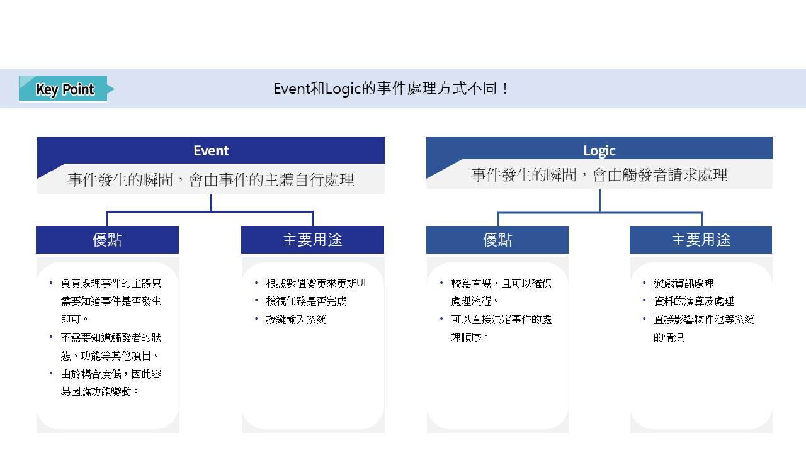
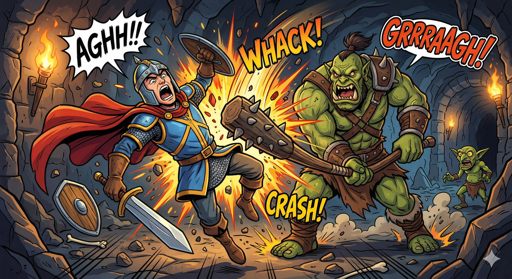
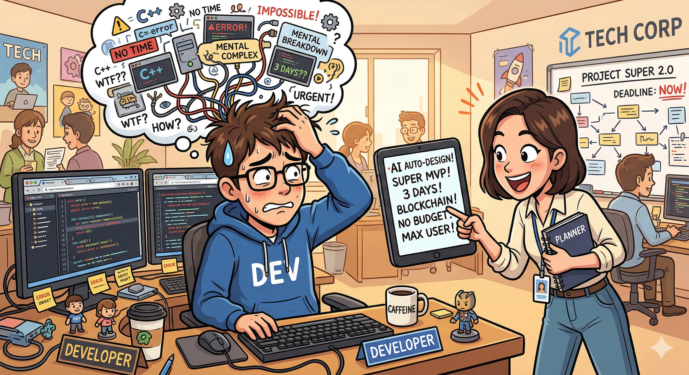
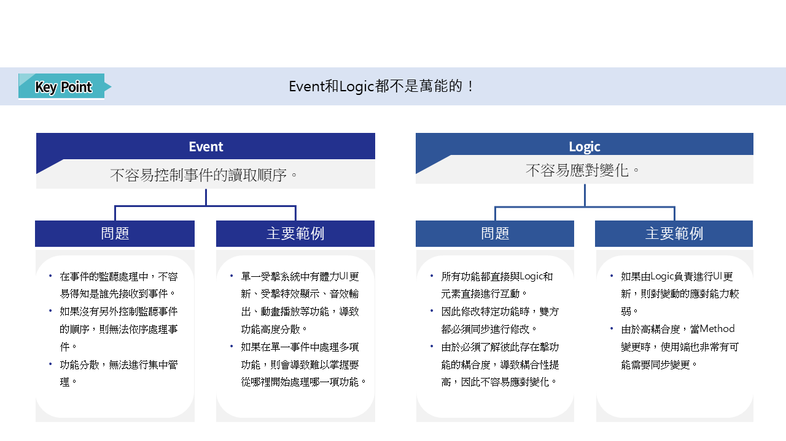

# [📖進階學習] 實作事件功能
<br>
<br>
<br>

## 影片時間軸
- 可在課程影片中以下時間點進行學習。
- 實作事件系統：`01:21:35`

<br>

## 學習目標
- 學習楓之谷世界的事件功能。
- 學習事件功能特色及優點，以便在製作遊戲系統時將事件功能納入考量。
- 學習事件與Logic的差異，以便在製作遊戲時能夠進行系統性的設計和開發。

<br>

## 觀看該影片後可嘗試執行的內容
- 運用Event，監測玩家行為並執行對應功能。
- 將遊戲的資訊處理等內容變更為Logic，以調整範例世界。
- 將範例世界依照要製作的遊戲特性進行系統化之後，以想要的形式來編輯世界。

<br>

## 事件系統
- 事件和Logic中，無論使用哪一種方式，都能達到相同結果。
- 舉個極端的例子，無論只運用Logic或只使用事件，都會執行相同的結果。
- 但在楓之谷世界中，則是設計為事件和Logic可以分別使用。

<br>

## Event和Logic的差異

<p align="center">

</p>

- 事件和Logic最大的差異在於由誰來處理請求。
- Event
    - 事件發生的瞬間，事件的主體會直接接收請求並處理。
    - 代表性的範例是當玩家的體力減少時，UI更新這類的方式就是使用Event的方式。
- Logic
    - 在腳本中呼叫直接執行功能的Logic並使用。
    - 由於是直接呼叫執行功能的Logic，因此較為直覺，也可以直接控制處理順序。

<br>

### 什麼是Event?

<p align="center">

</p>

> 此為使用Gemini產生的AI圖片。

- 玩遊戲時會發生各式各樣的狀況。
- 這些狀況就是各自的**Event**。
    - Event範例
        - 玩家遇到了敵人
        - 玩家使用體力恢復道具
        - 玩家消滅了怪物
        - ETC
- 當特定事件發生時，負責宣告此事件發生的就是Event。

<br>

### ☑️ 明明也可以用Logic來實作，為什麼還要使用Event呢?
<p align="center">

</p>

> 此為使用Gemini產生的AI圖片。

- 對於程式設計師而言，最困難的部分就是開發變化的請求事項。
- 但如果系統過於死板缺乏彈性，請求新功能的時候，就會發生必須修改系統的問題。
- 如果是運用Logic進行開發，雖然會因為可以直接進行呼叫，而能夠保證確實進行功能處理，但如果需要的處理逐漸增加，則必須調整的量也會跟著增加。

### 使用Logic處理UI的情況

```lua
@Component
script PlayerBattleComponent extends Component

@EventSender("Self")
handler HandleHitEvent(HitEvent event)
-- 如果玩家被怪物攻擊，則更新體力UI、輸出音效、顯示畫面特效。
_UIHPLogic.UpdateLife()
_SoundLogic.PlayEffect(event.PlayEffectSound)
_ScreenEffectLogic.PlayHitEffect()
end

end
```

> 此程式碼是以Plain Text編寫而成。此程式碼僅編寫供示範用，並未在範例世界中使用。

- 如果使用Logic處理，就必須呼叫負責各自功能的Logic。
- 但之後每次新增其他系統及功能時，就必須找到對應的Logic並進行登錄。
- 此外如果執行相同功能，而當其他角色需要同樣的功能時，則必須找到所有Script並進行登錄。
- 這種情況下，就會發生每次都必須找到所有功能並進行登錄的問題。

### 使用Event處理UI的情況
```lua
@Component
script PlayerBattleComponent extends Component

property number currentHP = 0

@EventSender("Self")
handler HandleHitEvent(HitEvent event)
-- 如果玩家被怪物攻擊，則會發生受到攻擊的事件。
local localPlayerHitEvent = LocalPlayerHitEvent()
self.currentHP = self.currentHP - event.Damages
localPlayerHitEvent.RemainHP = self.currentHP
self.Entity:SendEvent(localPlayerHitEvent)
end

end
```

> 該程式碼是以Plain Text為基準編寫而成。此程式碼僅編寫供示範用，並未在範例世界中使用。

- 玩家被攻擊時，不需要呼叫負責事件的所有Logic，而是傳送**LocalPlayerHitEvent**事件。
- 也就是玩家向整個系統宣告「我被攻擊了！好痛！」的狀態。

```lua
@Logic
script UIHPLogic extends Logic

@EventSender("LocalPlayer")
handler HandleLocalPlayerHitEvent(LocalPlayerHitEvent event)
local playerRemainHP = event.RemainHP
-- playerRemainHP是目前玩家的剩餘體力，因此會依照此資料來更新UI。
end

end
```

> 該程式碼是以Plain Text為基準編寫而成。此程式碼僅編寫供示範用，並未在範例世界中使用。

- 接收玩家事件的**UIHPLogic**會以傳入的剩餘體力為基準來更新HP的UI。
- 此外，SoundLogic和ScreenEffectLogic也將LocalPlayerHitEvent登錄至各自的Event Handler中，並執行必要的處理。
- 透過這樣設計的程式碼，即使日後新增功能，也只需要以LocalPlayer為核心進行功能新增即可。

<br>

## Event和Logic的問題
<p align="center">

</p>

- 但Event和Logic也都有各自的問題存在。
- Event的問題
    - Event無法得知負責處理者中，是誰先接收Event。
    - 因此當需要依序執行功能或演算時，就無法保證流程順序。
    - 由於Event具分散化特性，因此相較於使用Logic，可以用來管理更多Event。
- Logic的問題
    - 每次新增功能時，必須在使用該功能的所有Script中呼叫Logic。
    - 因此會產生單一Component必須掌握大量Logic，導致高耦合的問題。

<br>

## Event和Logic的適當分配
- 因此，使用Event和Logic的時候，必須適當分配比例。
- 以下是代表性的範例。
    - 使用Event的情況
        - UI更新之類在Client中執行功能的情況
    - 使用Logic的情況
        - 傷害計算、玩家經驗值總量計算等進行數值運算的情況

<br>

## 最低實作標準
- 運用Event進行功能重構，使UI更新為透過Event處理。
- 運用Logic實作處理數值運算項目的功能。

## 應用與擴展方向
- 設計Method的執行環境，使Logic化的項目可以在日後與Server連動。
- Event的設計是使Logic從伺服器中取得值，並使只有在Client驅動的UI根據此值進行更新。