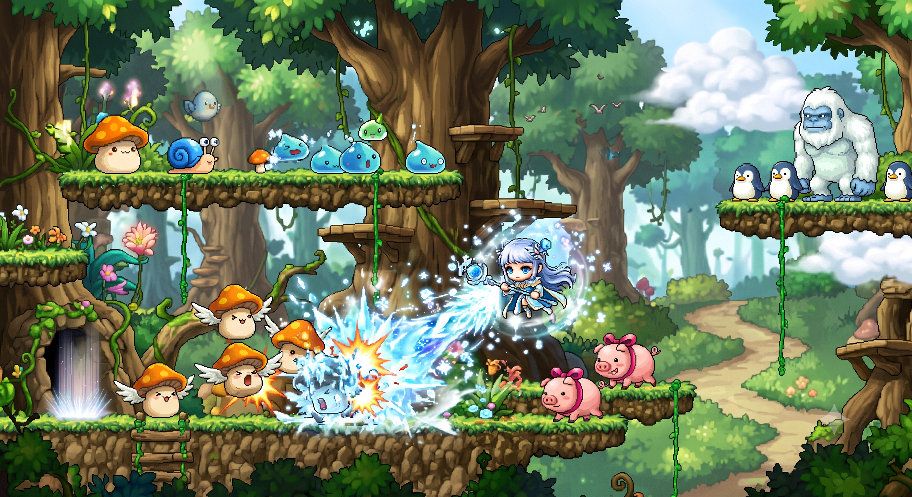
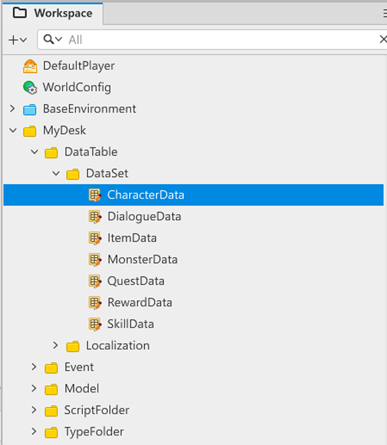
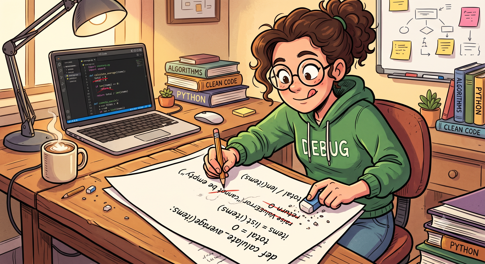
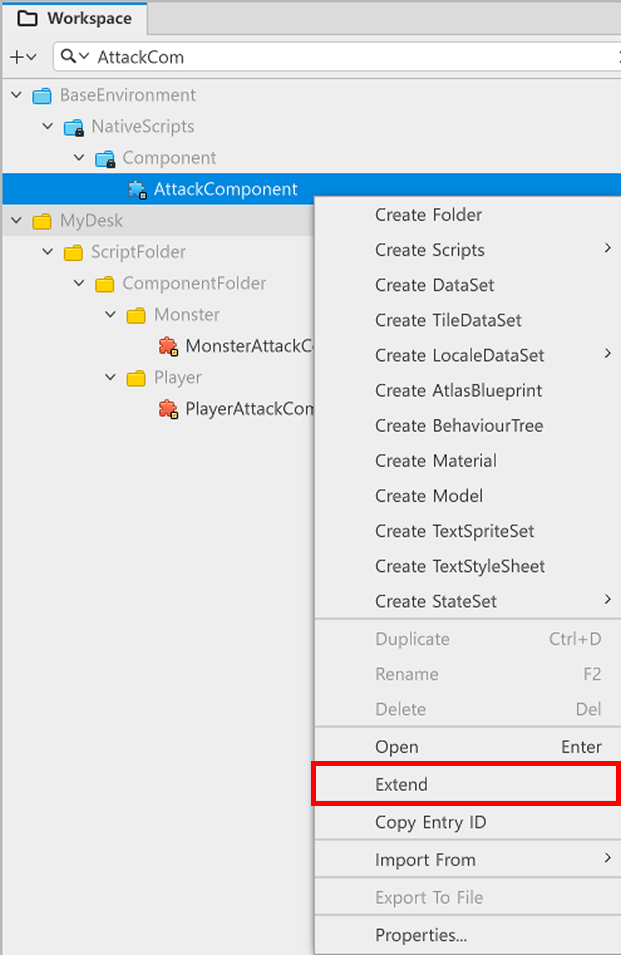
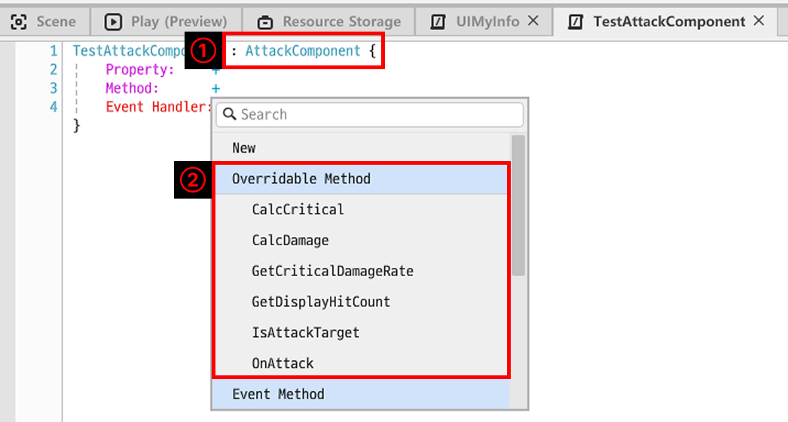
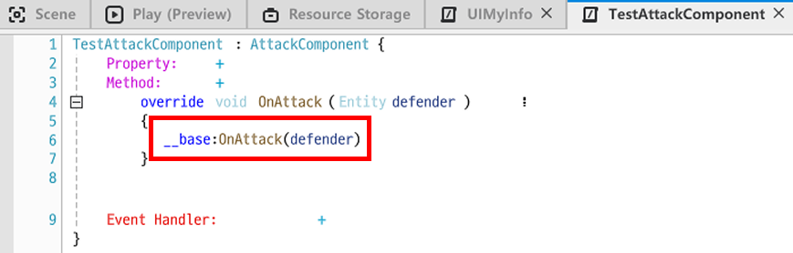
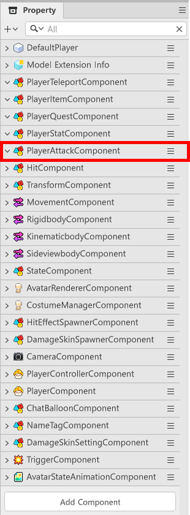

# [💡 Basic Training] Implementing Basic Attacks
<br>
<br>
<br>

## Video Timeline
- You can follow along by using the timeline under the training video.
- Implementing Basic Attacks: `00:01:22`

<br>

## Learning Goals
- Create a basic attack function using the Extend function.
- Learn about Extend's characteristics and how to use it.

<br>

## Practical Exercises to Do After Watching the Video
- You can use the Extend function to modify the Component's function in a form that you need it to be.
- You can implement basic attacks using the AttackComponent's function.

<br>

## Implementing a Combat System
<p align="center">

</p>

> This is an AI image utilizing Gemini.

- The combat system serves as a direct growth target and motivator for the player.
- There are various types of combat systems such as turn-based, real-time, auto-battlers, dynasty warriors, etc.
- Learn how to implement a combat system similar to MapleStory in the sample world.

<br>

### Composing Player DataSet
<p align="center">

</p>

- Combat stats are needed in order to have combat.
- The sample world created and uses **CharacterData** to craft the function.
- The configuration of CharacterData is as follows.

<table class="tg"><thead>
  <tr>
    <th class="tg-9wq8">Name</th>
    <th class="tg-9wq8">Content</th>
  </tr></thead>
<tbody>
  <tr>
    <td class="tg-lboi">CharacterID</td>
    <td class="tg-lboi">The ID value needed to differentiate player character jobs.</td>
  </tr>
  <tr>
    <td class="tg-lboi">MaxHP</td>
    <td class="tg-lboi">The value needed to set the player character's max HP.</td>
  </tr>
  <tr>
    <td class="tg-lboi">Def</td>
    <td class="tg-lboi">The value needed to set the player character's defense.</td>
  </tr>
  <tr>
    <td class="tg-lboi">CharacterAtkValue</td>
    <td class="tg-lboi">The value needed to set the player character's attack power.</td>
  </tr>
  <tr>
    <td class="tg-lboi">CriticalRes</td>
    <td class="tg-lboi">The value needed to set the player character's critical hit resistance.</td>
  </tr>
  <tr>
    <td class="tg-cly1">CriticalRate</td>
    <td class="tg-cly1">The value needed to set the player character's critical hit chance.</td>
  </tr>
  <tr>
    <td class="tg-cly1">SkillID</td>
    <td class="tg-cly1">The ID value needed to set the skills used by the player character.</td>
  </tr>
</tbody>
</table>

<br>

### Loading DataSet
- The **CharacterDataLogic** Script is performing this function.
- Please reference **Workspace**, **ScriptFolder**, and **LogicFolder** for pathing.

```lua
@Logic
script CharacterDataLogic extends Logic

property table characterData = {}

@ExecSpace("ClientOnly")
method void OnBeginPlay()
self:InitCharacterData()
end

@ExecSpace("ClientOnly")
method void InitCharacterData()
-- Checks whether characterData is nil.
if not isvalid(self.characterData) or not next(self.characterData) then
	-- Searches for DataSet if nil.
	local findData = _DataService:GetTable("CharacterData")
	if isvalid(findData) then
		for i = 1, findData:GetRowCount() do
			local rowData = CharacterData()
			rowData.CharacterID = findData:GetCell(i, "CharacterID")
			rowData.CharacterAtkValue = tonumber(findData:GetCell(i, "CharacterAtkValue"))
			rowData.MaxHP = tonumber(findData:GetCell(i, "MaxHP"))
			rowData.Def = tonumber(findData:GetCell(i, "Def"))
			rowData.CriticalRes = tonumber(findData:GetCell(i, "CriticalRes"))
			rowData.CriticalRate = tonumber(findData:GetCell(i, "CriticalRate"))
			rowData.SkillID = findData:GetCell(i, "SkillID")
			self.characterData[findData:GetCell(i, "CharacterID")] = rowData
		end
	end
end
end

method CharacterData GetCharacterDataByCharacterID(string CharacterID)
if isvalid(self.characterData[CharacterID]) then
	return self.characterData[CharacterID]
else
	log_error(CharacterID.." information can't be found!")
	return nil
end
end

end
```

> This code is written based on Plain Text.

- Save elements in **CharacterData** to **CharacterDataLogic** using the target code.
- Provide CharacterID to **GetCharacterDataByCharacterID** Method to load the character's information.
- If the CharacterData format or value is changed or deleted in the future, **InitCharacterData** Method is edited and used.

<br>

### Utilizing Extend
<p align="center">

</p>

- There are instances where you would want to use pre-created Scripts by changing their functions.
- MapleStory Worlds provides the **Extend** function to solve this issue.

<p align="center">

</p>

> You can use Extend by right-clicking a Script.

- The sample world uses the **AttackComponent** Component provided by MapleStory Worlds to implement basic attacks.
- **PlayerAttackComponent** was created after creating **AttackComponent** with **Extend**.

<br>

### Learning About ℹ️ Extend
<p align="center">

</p>

<table class="tg"><thead>
  <tr>
    <th class="tg-9wq8">Number</th>
    <th class="tg-9wq8">Content</th>
  </tr></thead>
<tbody>
  <tr>
    <td class="tg-9wq8">1</td>
    <td class="tg-lboi">Displays which Script was loaded with Extend.</td>
  </tr>
  <tr>
    <td class="tg-9wq8">2</td>
    <td class="tg-lboi">You can edit the Method of the loaded Script for use.</td>
  </tr>
</tbody>
</table>

- You can edit the Method of Scripts loaded with **Extend** using **Overridable Method**.

<p align="center">

</p>

- The Method loaded through **Overridable Method** includes an element called **__base:** as default.
- Once the code in **__base:** is executed, the Method of the Script loaded with **Extend** is executed.
- If you don't want the Method of the Script that was **Extended**, remove **__base:** and create the desired function for use.

<br>

### Creating a PlayerAttackComponent
<p align="center">

</p>

- You can see from the sample world's **DefaultPlayer** Property that the **PlayerAttackComponent** is registered.
- The following is the **PlayerAttackComponent** code.

```lua
@Component
script PlayerAttackComponent extends AttackComponent

property string usingSkillID = ""

property boolean isSkillPlaying = false

property any animEndHandler = nil

property number currentSkillValue = 0

@ExecSpace("ClientOnly")
method void InitUsingSkillID(string UsingSkillKey)
-- Inject a skill ID that will be used from the outside.
if not _UtilLogic:IsNilorEmptyString(UsingSkillKey) then
	self.usingSkillID = UsingSkillKey
	self:InitSkillKey()
else
	log("SkillKey is nil or empty!")
end
end

@ExecSpace("ClientOnly")
method void InitSkillKey()
local playerController = self.Entity.PlayerControllerComponent
if not isvalid(playerController) then
	log_error("PlayerAttackComponent: PlayerControllerComponent not found.")
	return
end
playerController:SetActionKey(KeyboardKey.K, "FullMoonSlash")
log("PlayerAttackComponent: K Key -> FullMoonSlash action registration complete.")
-- Register the FULLMOONSLASH state to StateComponent.
-- FullMoonSlashStateType directly blocks/restores PlayerControllerComponent from OnEnter/OnExit.
local stateComp = self.Entity.StateComponent
if isvalid(stateComp) then
	stateComp:AddState("FULLMOONSLASH", FullMoonSlash)
	log("PlayerAttackComponent: FULLMOONSLASH state registration complete.")
end
local avatarRenderer = self.Entity.AvatarRendererComponent
if not isvalid(avatarRenderer) then
	log_error("PlayerAttackComponent: AvatarRendererComponent not found.")
	return
end
local body = avatarRenderer:GetBodyEntity()
if not isvalid(body) then
	log_error("PlayerAttackComponent: BodyEntity not found.")
	return
end
self.animEndHandler = body:ConnectEvent(SpriteAnimPlayerEndEvent, self.OnSkillAnimationEnd)
log("PlayerAttackComponent: Skill animation end event connection complete.")
end

method void AttackNormal()
-- The Method needed for basic attack processing.
local attackSize = Vector2(1,1)
local playerController = self.Entity.PlayerControllerComponent
if playerController ~= nil then
	local attackOffset = Vector2(0.5 * playerController.LookDirectionX, 0.5)
	self:Attack(attackSize, attackOffset, nil, CollisionGroups.Monster)
end
end

method void OnAttack(Entity defender)
-- Displays the attack target log.
__base:OnAttack(defender)
log(defender.Name)
end

method integer CalcDamage(Entity attacker, Entity defender, string attackInfo)
-- Calculates skill damage for skills and basic damage for basic attacks.
if not _UtilLogic:IsNilorEmptyString(attackInfo) then
	return _DamageCalcLogic:CalculateSkillDamage(attacker, defender, self.currentSkillValue)
else
	return _DamageCalcLogic:CalculateNormalDamage(attacker, defender)
end
end

method boolean CalcCritical(Entity attacker, Entity defender, string attackInfo)
-- Returns whether a hit is a critical hit by calculating the critical hit chance.
---@type PlayerStatComponent
local attackerStat = attacker:GetComponent("script.PlayerStatComponent")
---@type MonsterStatComponent
local defenderStat = defender:GetComponent("script.MonsterStatComponent")
if not isvalid(attackerStat) or not isvalid(defenderStat) then return false end
local criRate = _UtilLogic:RandomIntegerRange(1, 100)
local calcValue = attackerStat.playerStat.CriticalRate - defenderStat.monsterStat.CriticalRes
if calcValue <= 0 then
	return false
elseif calcValue >= criRate then
	return true
else
	return false
end
end

method float GetCriticalDamageRate()
-- Returns the default critical multiplier.
return __base:GetCriticalDamageRate()
end

@ExecSpace("ClientOnly")
method void OnEndPlay()
-- Cancels the safety timer.
if self._T.safetyTimerId ~= nil then
	_TimerService:ClearTimer(self._T.safetyTimerId)
	self._T.safetyTimerId = nil
end
self.isSkillPlaying = false
-- Unlinks the body entity event.
if self.animEndHandler ~= nil then
	local avatarRenderer = self.Entity.AvatarRendererComponent
	if isvalid(avatarRenderer) then
		local body = avatarRenderer:GetBodyEntity()
		if isvalid(body) then
			body:DisconnectEvent(SpriteAnimPlayerEndEvent, self.animEndHandler)
		end
	end
	self.animEndHandler = nil
end
end

method void ResetSkillState()
-- Resets the skill state. Both the normal end and safety timer use this method.
if not self.isSkillPlaying then return end
self.isSkillPlaying = false
-- Cancels the safety timer.
if self._T.safetyTimerId ~= nil then
	_TimerService:ClearTimer(self._T.safetyTimerId)
	self._T.safetyTimerId = nil
end
-- Converts to the ATTACK_WAIT state.
-- FullMoonSlashStateType.OnExit() automatically restores PlayerControllerComponent.
-- Reverts JUMP/FALL ActionSheet.
local stateComp = self.Entity.StateComponent
if isvalid(stateComp) then
	stateComp:ChangeState("IDLE")
end
log("PlayerAttackComponent: Skill state reset complete.")
end

method void OnSkillAnimationEnd(SpriteAnimPlayerEndEvent event)
-- Resets the state only when a skill animation is playing.
if not self.isSkillPlaying then return end
log("PlayerAttackComponent: FullMoonSlash end - skill state reset.")
self:ResetSkillState()
end

method void AttackMeleeSkill()
-- Only executed during a duplicate execution prevention or IDLE/JUMP state.
if self.isSkillPlaying then return end
local stateComp = self.Entity.StateComponent
local stateName = stateComp.CurrentStateName

if stateName == "IDLE" or stateName == "JUMP" then
	local getData = _SkillLogic:GetSkillDataBySkillID(self.usingSkillID)
	if getData ~= nil then
		self.isSkillPlaying = true
		self.currentSkillValue = getData.SkillValue
		
		-- Converts to the FULLMOONSLASH state.
		stateComp:ChangeState("FULLMOONSLASH")
		
		-- Safety Timer: Forces a reset if SpriteAnimPlayerEndEvent is not fired.
		self._T.safetyTimerId = _TimerService:SetTimerOnce(function()
			if isvalid(self.Entity) and self.isSkillPlaying then
				log_warning("PlayerAttackComponent: Safety Timer - Force Reset Skill State")
				self:ResetSkillState()
			end
		end, 3.0)
		log("PlayerAttackComponent: Execute FullMoonSlash.")
		
		-- 1. Load the direction that the player is facing. (Right: 1, Left: -1)
		local lookDir = self.Entity.PlayerControllerComponent.LookDirectionX
		
		-- 2. Sets the 'centerpoint of the attack' by multiplying the skill data offset value by the correct direction.
		-- If the player is facing left (-1), the x-coordinate for the offset is also inverted, since the center will be on the left.
		local attackCenterOffset = Vector2(getData.CollideOffset.x * lookDir, getData.CollideOffset.y)
		
		-- 3. Uses the skill data's TargetRange as the 'attack range (size)'.
		local attackRange = getData.TargetRange
		
		-- 4. An actual attack detection based on the calculated range and centerpoint will be performed.
		self:Attack(attackRange, attackCenterOffset, self.usingSkillID, CollisionGroups.Monster)
		_SkillExecutionLogic:RunSkill(self.Entity, getData)
	end
end
end

method boolean IsAttackTarget(Entity defender, string attackInfo)
if not isvalid(defender.MonsterStatComponent) then
	return false
end

return __base:IsAttackTarget(defender,attackInfo)
end

@EventSender("LocalPlayer")
handler HandlePlayerActionEvent(PlayerActionEvent event)
-- Ctrl(Attack): Performs a basic attack.
if event.ActionName == "Attack" then
	self:AttackNormal()
-- K(FullMoonSlash): Uses the skill registered to PlayerControllerComponent.
elseif event.ActionName == "FullMoonSlash" then
	self:AttackMeleeSkill()
end
end

end
```

> This code is written based on Plain Text.

- The following Method that needs to be focused on at the current stage.
- **AttackNormal**
  - Sets the range and position to check the monster's state when performing a basic attack.
  - If there is an entity with a **Monster** CollisionGroups that is in the defined area, it executes **Attack**.
- **OnAttack**
  - The Method that is called when the **Attack** Method is executed.
  - Used for log outputs in the sample world.
  - Functions can be edited and added to the target Method if additional processing is needed when making an attack.
- **CalcDamage**
  - The Method needed for delivering damage to **Attack** Method.
  - When damage calculation is needed, the code can be composed so that the damage that needs to be delivered to the target Method is returned.
- **CalcCritical**
	- The method that verifies if the attack is a critical hit when the **Attack** Method is executed.
	- You can return and use **boolean** type values.
- **GetCriticalDamageRate**
	- The Method that returns a multiplier of the base damage if **CalcCritical** determines that it is a critical hit.
	- If there is no critical damage multiplier set, it will return a **2x** multiplier as a default.
- **IsAttackTarget**
	- The method that checks whether the target can be attacked before the **Attack** Method is executed.
	- When exception processing is needed for the attack target, it can be managed from this Method.

<br>

## Minimum Implementation Standards

- The attack must be called normally when the player makes an attack.
- The damage calculation must be possible using the Extend function.

<br>

## Usage and Extension Direction

- Create a management method through DataSet so that the character's basic attacks or method can be managed based on the character's traits.
- Edit **IsAttackTarget** so that the character can make an attack after determining whether an attack can be made.