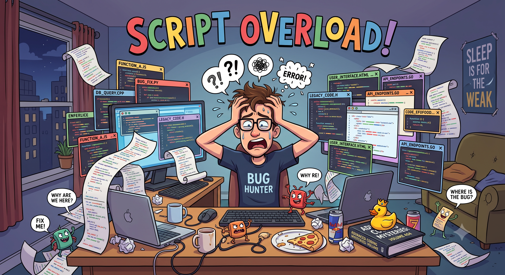

# [💡 Basic Training] Implementing Combat Support Logic
<br>
<br>
<br>

## Video Timeline
- You can follow along by using the timeline under the training video.
- Implementing Combat Support Logic: `00:21:16`

<br>

## Learning Goals
- Implement Helper that is in charge of calculating damage using Logic.
- Learn how to plan things with consideration for maintenance and repairs.

<br>

## Practical Exercises to Do After Watching the Video
- Compose a Logic that calculates damage during combat.
- Create a Logic that can change the damage calculation formula as needed and then return the result value.

<br>

## Utilizing Logic
<p align="center">

</p>

- The **Logic** in MapleStory Worlds is a Script that runs even though there is no entity.
- It can also be executed even if the **Map** changes.
- The sample world created uses a Logic that takes care of **damage calculation** using this trait.
- The following is the full code for **DamageCalcLogic**.

```lua
@Logic
script DamageCalcLogic extends Logic

method integer CalculateNormalDamage(Entity attacker, Entity defender)
-- Basic Atack Damage: Player Attack Power - Monster Defense
---@type PlayerStatComponent
local attackerStat = attacker:GetComponent("script.PlayerStatComponent")
---@type MonsterStatComponent
local defenderStat = defender:GetComponent("script.MonsterStatComponent")
if not isvalid(attackerStat) or not isvalid(defenderStat) then
	log_error("DamageCalcLogic: Stat Component not found.")
	return 0
end
local damage = attackerStat.playerStat.CharacterAtkValue - defenderStat.monsterStat.Def
if damage <= 0 then damage = 0 end
return damage
end

method integer CalculateSkillDamage(Entity attacker, Entity defender, number skillValue)
-- Skill Damage: SkillValue * Player Attack Power
---@type PlayerStatComponent
local attackerStat = attacker:GetComponent("script.PlayerStatComponent")
---@type MonsterStatComponent
local defenderStat = defender:GetComponent("script.MonsterStatComponent")
if not isvalid(attackerStat) then
	log_error("DamageCalcLogic: The attacker's PlayerStatComponent is not found.")
	return 0
end
local damage = skillValue * attackerStat.playerStat.CharacterAtkValue - defenderStat.monsterStat.Def
if damage <= 0 then damage = 0 end
return damage
end

method integer CalculateMonsterAttack(Entity attacker, Entity defender)
-- Basic Atack Damage: Monster Attack Power - Player Defense
---@type MonsterStatComponent
local attackerStat = attacker:GetComponent("script.MonsterStatComponent")
---@type PlayerStatComponent
local defenderStat = defender:GetComponent("script.PlayerStatComponent")
if not isvalid(attackerStat) or not isvalid(defenderStat) then
	log_error("DamageCalcLogic: Stat Component not found.")
	return 0
end
local damage = attackerStat.monsterStat.CharacterAtkValue - defenderStat.playerStat.Def
if damage <= 0 then damage = 0 end
return damage
end

end
```

> This code is written based on Plain Text.

<br>

### Learning About DamageCalcLogic
- **DamageCalcLogic** fulfills a total of 3 roles.
- **CalculateNormalDamage**
    - The Method that calculates the damage when the player makes a basic attack.
    - Returns the calculated result value based on the player and monster stats.
- **CalculateSkillDamage**
    - The Method that calculates the damage when the player makes a skill attack.
    - Returns the calculated result value based on the player's stats, skill damage coefficient, and monster stats.
- **CalculateMonsterAttack**
    - The Method that calculates the damage when the monster attacks the player.
    - Returns the calculated result value based on the monster's stats and player stats.

<br>

### The Goal of DamageCalcLogic
<p align="center">

</p>

- You will have to solve various issues when developing worlds.
- Changes to damage calculation can happen during the development stage for various reasons, such as adding affected items, changes of formulas, etc.
- However, when entering all items such as damage calculation to the Script, there could be room for human error, or things can disappear when making changes.
- When using a Logic like **DamageCalcLogic** that can manage certain functions, changing a single Script is enough to affect all Components, so you only need to manage a single Component.

<br>

## Minimum Implementation Standards
- Compose a Logic that can calculate damage using Logic.
- Use the created Logic in the Method that calculates and delivers damage in order to perform damage calculation.

<br>

## Usage and Extension Direction
- Create and manage items that need management other than damage calculation.
    - Example: Compose a Logic that manages and registers the resources used in the world.
    - Example: Compose a Logic that manages DataSet.
- Design a structure so that a single Logic can be in charge of and manage a specific function.