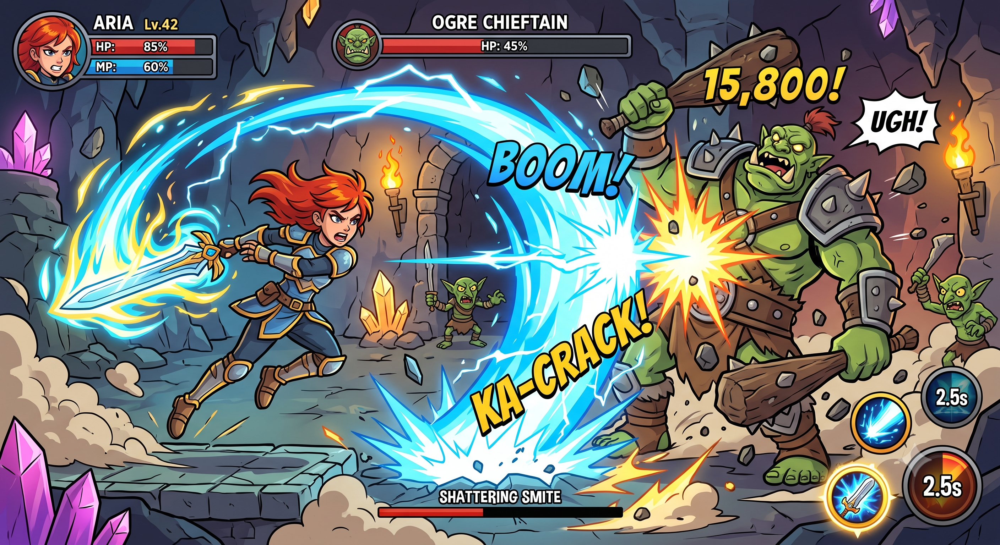
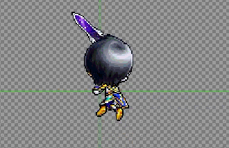
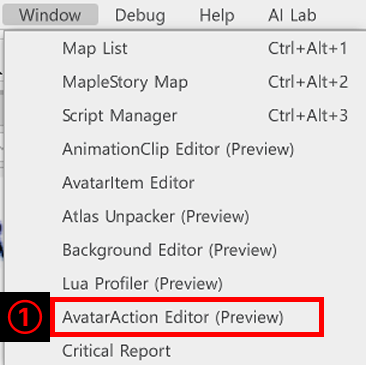
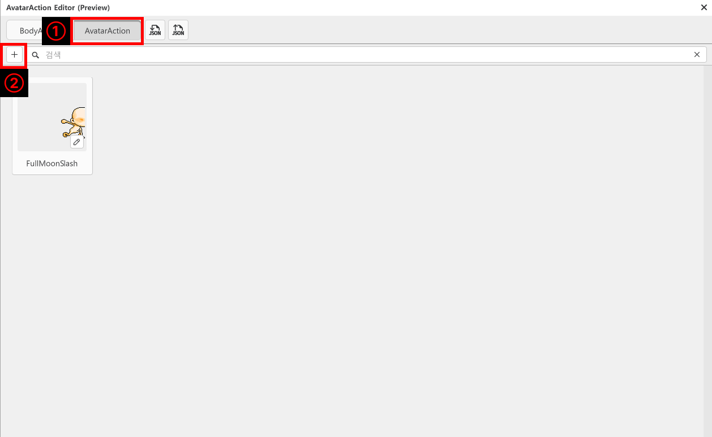
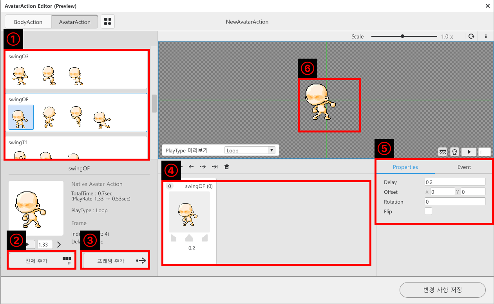
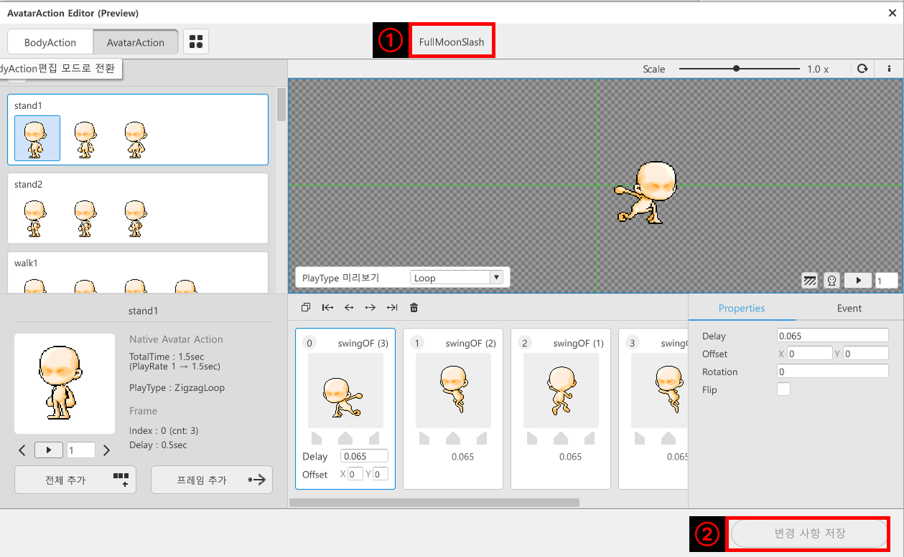
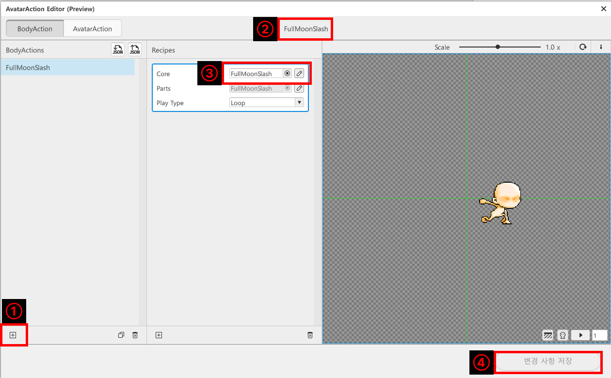
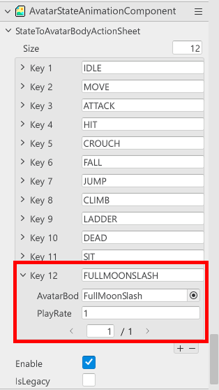
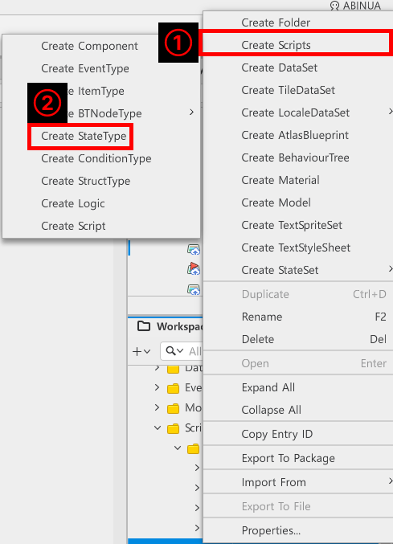
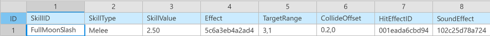

# [📖 심화 학습] 스킬 구현하기
<br>
<br>
<br>

## 영상 타임라인
- 강의 영상내 아래의 타임라인에서 학습할 수 있습니다.
- 스킬 구현하기: `00:24:33`
<br>

## 학습 목표
- AvatarActionEditor를 활용하여 캐릭터 애니메이션을 구성하는 방법에 대해 학습합니다.
- StateComponent를 활용하여 현재 상태에 따른 애니메이션 재생 방법에 대해 학습합니다.
- 실제 스킬이 적에게 판정을 일으킬 수 있도록 기능을 구현합니다.

<br>

## 해당 영상 시청 후 수행해 볼 내용
- 다양한 스킬 애니메이션을 제작한 뒤 이를 적용합니다.
- 스킬 애니메이션에 맞춰 이펙트의 출력, 데미지 계산 등 다양한 기능을 구성합니다.

<br>

## 스킬 제작하기
<p align="center">

</p>

- 스킬은 플레이어에게 단순한 공격 수단이 아닙니다.
- 상황을 역전하거나 강력한 일격을 가하는 전세를 역전하는 **수단**입니다.
- 이에 맞춰 화려한 애니메이션, 이펙트와 높은 공격력, 다양한 효과를 제공합니다.

<br>

###  애니메이션 제작하기
<p align="center">

</p>

- 메이플스토리 월드에서는 메이플스토리 캐릭터의 애니메이션을 조합하여 새로운 애니메이션을 만들 수 있습니다.
- 샘플 월드에서는 애니메이션을 조합하여 회전베기를 수행하는 스킬을 제작했습니다.

<p align="center">

</p>

- 메이플스토리 월드 에디터 상단의 **Window**, **AvatarAction Editor**를 클릭하여 편집 화면을 실행합니다.

<p align="center">

</p>

- **AvatarAction** 탭을 눌러 애니메이션 편집 화면으로 이동합니다.
- **+ 버튼**을 클릭해 아바타 애니메이션 편집 화면을 실행합니다.

<p align="center">

</p>

<table class="tg"><thead>
  <tr>
    <th class="tg-9wq8">번호</th>
    <th class="tg-9wq8">설명</th>
  </tr></thead>
<tbody>
  <tr>
    <td class="tg-9wq8">1</td>
    <td class="tg-lboi">메이플스토리 월드에서 제공하는 캐릭터 기본 애니메이션들을 볼 수 있는 구역입니다.</td>
  </tr>
  <tr>
    <td class="tg-9wq8">2</td>
    <td class="tg-lboi">선택된 애니메이션 그룹을 한 번에 등록합니다.</td>
  </tr>
  <tr>
    <td class="tg-9wq8">3</td>
    <td class="tg-lboi">선택한 프레임만 제작하려는 애니메이션에 등록합니다.</td>
  </tr>
  <tr>
    <td class="tg-9wq8">4</td>
    <td class="tg-lboi">제작하려는 애니메이션의 프레임 리스트를 보여주는 구역입니다.</td>
  </tr>
  <tr>
    <td class="tg-9wq8">5</td>
    <td class="tg-lboi">선택된 애니메이션의 출력 유지 시간, 좌우 반전 등의 값을 설정할 수 있습니다.</td>
  </tr>
  <tr>
    <td class="tg-9wq8">6</td>
    <td class="tg-lboi">편집한 애니메이션을 미리 볼 수 있습니다.</td>
  </tr>
</tbody>
</table>

<p align="center">

</p>

- 애니메이션 편집을 완료하셨다면 애니메이션의 이름을 변경합니다.
- 마지막으로 **변경 사항 저장**을 통해 변경된 내용을 저장합니다.

<br>

<p align="center">

</p>

- 애니메이션을 사용하기 위해 **+ 버튼**을 클릭해 **Body Action**을 제작합니다.
- 제작한 Body Action의 이름을 변경합니다.
- 앞서 제작한 애니메이션을 **Core**에 등록합니다.
- **변경 사항 저장**을 클릭하여 애니메이션을 등록합니다.

<p align="center">

</p>

- **Workspace**의 **DefaultPlayer**에 등록된 **AvatarStateAnimationComponent**를 클릭합니다.
- **StateToAvatarBodyActionSheet**의 Size를 늘린 뒤 **Key**에 **Body Action** 이름을 추가합니다.
- **AvatarBodyActionName**에 제작한 애니메이션을 등록합니다.

<br>

### 애니메이션 실행 준비하기
- 애니메이션을 실행하기 위해 스킬의 상태를 선언해야 합니다.
- 샘플 월드에서는 **State Component**를 사용하여 이를 선언, 사용하고 있습니다.

<p align="center">

</p>

- **Workspace**, **MyDesk**를 우클릭한 뒤 **Create Scripts**, **Create StateType**을 통해 상태를 생성합니다.
- 샘플 월드에서는 **FullMoonSlashStateType**을 등록하여 사용하고 있습니다.

<br>

#### ⚠️ StateType Script란?
- 각 상태마다 상태의 전이 여부, 탈출 조건 등 다양한 항목이 존재합니다.
- StateType Script는 상태에 대한 정의와 탈출 조건 등 특정한 상태를 직접 생성하고, 관리하기 위해 사용할 수 있습니다.

<br>

### 스킬 정보 구성하기
<p align="center">

</p>

- 스킬의 정보를 구현하기 위해 DataSet을 제작하고, 사용해야 합니다.
- 샘플 월드에서는 스킬의 정보를 관리하기 위해 **SkillData**를 사용하고 있습니다.

<table class="tg"><thead>
  <tr>
    <th class="tg-9wq8">이름</th>
    <th class="tg-9wq8">설명</th>
  </tr></thead>
<tbody>
  <tr>
    <td class="tg-lboi">SkillID</td>
    <td class="tg-lboi">스킬을 구분하기 위한 ID값입니다.</td>
  </tr>
  <tr>
    <td class="tg-lboi">SkillType</td>
    <td class="tg-lboi">스킬의 타입(근접 공격, 원거리 공격 등)을 구분하기 위한 값입니다.</td>
  </tr>
  <tr>
    <td class="tg-lboi">SkillValue</td>
    <td class="tg-lboi">스킬의 데미지 배율을 지정하기 위한 값입니다.</td>
  </tr>
  <tr>
    <td class="tg-lboi">Effect</td>
    <td class="tg-lboi">스킬의 효과 리소스 RUID를 등록하기 위한 값입니다.</td>
  </tr>
  <tr>
    <td class="tg-lboi">TargetRange</td>
    <td class="tg-lboi">스킬의 공격 범위를 지정하기 위한 값입니다.</td>
  </tr>
  <tr>
    <td class="tg-lboi">CollideOffset</td>
    <td class="tg-lboi">스킬의 범위 중심을 설정하기 위한 값입니다.</td>
  </tr>
  <tr>
    <td class="tg-0lax">HitEffectID</td>
    <td class="tg-0lax">스킬을 맞은 적이 출력해야 하는 이펙트 RUID를 등록하기 위한 값입니다.</td>
  </tr>
  <tr>
    <td class="tg-0lax">SoundEffect</td>
    <td class="tg-0lax">스킬 사용시 출력해야 하는 효과음을 등록하기 위한 값입니다.</td>
  </tr>
</tbody></table>

- 이어서 스킬 DataSet을 관리하기 위한 **SkillLogic**을 구성합니다.
- 아래는 **SkillLogic**의 코드입니다.

```lua
@Logic
script SkillLogic extends Logic

property table SkillData = {}

@ExecSpace("ClientOnly")
method void OnBeginPlay()
self:InitSkillData()
end

@ExecSpace("ClientOnly")
method void InitSkillData()
-- 초기화가 필요한지 검사합니다.
if self.SkillData == nil or next(self.SkillData) == nil then
	-- 만약 SkillData가 nil 또는 요소가 없을 경우 SkillData를 가져옵니다.
	local TableData = _DataService:GetTable("SkillData")
	-- 만약 SkillData를 찾지 못했다면 에러 로그를 출력합니다.
	if TableData == nil then
		log_warning("SkillData DataSet이 존재하지 않습니다!")
		return
	end
	for i = 1, TableData:GetRowCount() do
		-- 정상적으로 가져왔다면 값들을 등록합니다.
		local getData = SkillData()
		-- DataSet의 SkililID를 가져옵니다.
		getData.SkillID = TableData:GetCell(i, "SkillID")
		-- SkillID 값이 nil 또는 비어있지 않을 경우 다음의 코드를 실행합니다.
		if not _UtilLogic:IsNilorEmptyString(getData.SkillID) then
			-- DataSet에 등록한 Vector2의 X, Y값을 Split으로 가져옵니다.
			local tableTargetRange = _UtilLogic:Split(TableData:GetCell(i, "TargetRange"), ",")
			-- 순서대로 X, Y의 값을 임시 변수에 등록합니다.
			local targetRangeVector2 = Vector2(tonumber(tableTargetRange[1]), tonumber(tableTargetRange[2]))
			-- 임시로 등록한 targetRangeVector2를 값으로 등록합니다.
			getData.TargetRange = targetRangeVector2
			-- DataSet에 등록한 Offset Vector2의 X, Y값을 Split으로 가져옵니다.
			local tableOffsetPos = _UtilLogic:Split(TableData:GetCell(i, "CollideOffset"), ",")
			-- 순서대로 X, Y의 값을 임시 변수에 등록합니다.
			local targetOffsetPosVector2 = Vector2(tonumber(tableOffsetPos[1]), tonumber(tableOffsetPos[2]))
			-- 임시로 등록한 targetOffsetPosVector2를 값으로 등록합니다.
			getData.CollideOffset = targetOffsetPosVector2
			-- DataSet의 SkillType 값을 등록합니다.
			getData.SkillType = TableData:GetCell(i, "SkillType")
			-- DataSet의 SKillValue 값을 등록합니다.
			getData.SkillValue = tonumber(TableData:GetCell(i, "SkillValue"))
			-- DataSet의 Effect를 가져옵니다.
			getData.Effect = TableData:GetCell(i, "Effect")
			-- DataSet의 HitEffectID를 가져옵니다.
			getData.HitEffectID = TableData:GetCell(i, "HitEffectID")
			-- DataSet의 SoundEffect 값을 가져옵니다.
			getData.SoundEffect = TableData:GetCell(i, "SoundEffect")
			-- 모든 값을 가져오는데 성공했다면 table에 등록합니다.
			self.SkillData[getData.SkillID] = getData
		end
	end
end
end

@ExecSpace("ClientOnly")
method SkillData GetSkillDataBySkillID(string SkillID)
-- 정상적으로 SkillID를 Key로 가지는 값이 존재 할 경우 해당 값을 반환합니다.
if isvalid(self.SkillData[SkillID]) then
	return self.SkillData[SkillID]
else
	log_error(SkillID.."가 SKillData에 존재하지 않습니다!")
	return nil
end
end

end
```

> 해당 코드는 Plain Text를 기준으로 작성된 코드입니다.

<br>

### 스킬 공격 구현하기
- 앞서 제작한 PlayerAttackComponent에 Skill과 관련된 처리를 구현합니다.
- 아래는 **PlayerAttackComponent**의 코드입니다.

```lua
@Component
script PlayerAttackComponent extends AttackComponent

property string usingSkillID = ""

property boolean isSkillPlaying = false

property any animEndHandler = nil

property number currentSkillValue = 0

@ExecSpace("ClientOnly")
method void InitUsingSkillID(string UsingSkillKey)
-- 사용할 스킬 ID를 외부에서 주입합니다.
if not _UtilLogic:IsNilorEmptyString(UsingSkillKey) then
	self.usingSkillID = UsingSkillKey
	self:InitSkillKey()
else
	log("SkillKey가 nil 또는 비어있는 상태입니다!")
end
end

@ExecSpace("ClientOnly")
method void InitSkillKey()
local playerController = self.Entity.PlayerControllerComponent
if not isvalid(playerController) then
	log_error("PlayerAttackComponent: PlayerControllerComponent를 찾을 수 없습니다.")
	return
end
playerController:SetActionKey(KeyboardKey.K, "FullMoonSlash")
log("PlayerAttackComponent: K키 -> FullMoonSlash 액션 등록 완료")
-- StateComponent에 FULLMOONSLASH 상태를 등록합니다.
-- FullMoonSlashStateType이 OnEnter/OnExit에서 PlayerControllerComponent를 직접 차단/복원합니다.
local stateComp = self.Entity.StateComponent
if isvalid(stateComp) then
	stateComp:AddState("FULLMOONSLASH", FullMoonSlashStateType)
	log("PlayerAttackComponent: FULLMOONSLASH 상태 등록 완료")
end
local avatarRenderer = self.Entity.AvatarRendererComponent
if not isvalid(avatarRenderer) then
	log_error("PlayerAttackComponent: AvatarRendererComponent를 찾을 수 없습니다.")
	return
end
local body = avatarRenderer:GetBodyEntity()
if not isvalid(body) then
	log_error("PlayerAttackComponent: BodyEntity를 찾을 수 없습니다.")
	return
end
self.animEndHandler = body:ConnectEvent(SpriteAnimPlayerEndEvent, self.OnSkillAnimationEnd)
log("PlayerAttackComponent: 스킬 애니메이션 종료 이벤트 연결 완료")
end

method void AttackNormal()
-- 기본 공격 처리를 위한 Method입니다.
local attackSize = Vector2(1,1)
local playerController = self.Entity.PlayerControllerComponent
if playerController ~= nil then
	local attackOffset = Vector2(0.5 * playerController.LookDirectionX, 0.5)
	self:Attack(attackSize, attackOffset, nil, CollisionGroups.Monster)
end
end

method void OnAttack(Entity defender)
-- 공격 대상 로그를 출력합니다.
__base:OnAttack(defender)
log(defender.Name)
end

method integer CalcDamage(Entity attacker, Entity defender, string attackInfo)
-- 스킬 공격 시 스킬 데미지를, 일반 공격 시 기본 데미지를 계산합니다.
if not _UtilLogic:IsNilorEmptyString(attackInfo) then
	return _DamageCalcLogic:CalculateSkillDamage(attacker, defender, self.currentSkillValue)
else
	return _DamageCalcLogic:CalculateNormalDamage(attacker, defender)
end
end

method boolean CalcCritical(Entity attacker, Entity defender, string attackInfo)
-- 크리티컬 확률을 계산하여 크리티컬 여부를 반환합니다.
---@type PlayerStatComponent
local attackerStat = attacker:GetComponent("script.PlayerStatComponent")
---@type MonsterStatComponent
local defenderStat = defender:GetComponent("script.MonsterStatComponent")
if not isvalid(attackerStat) or not isvalid(defenderStat) then return false end
local criRate = _UtilLogic:RandomIntegerRange(1, 100)
local calcValue = attackerStat.playerStat.CriticalRate - defenderStat.monsterStat.CriticalRes
if calcValue <= 0 then
	return false
elseif calcValue >= criRate then
	return true
else
	return false
end
end

method float GetCriticalDamageRate()
-- 기본 크리티컬 배율을 반환합니다.
return __base:GetCriticalDamageRate()
end

@ExecSpace("ClientOnly")
method void OnEndPlay()
-- 안전 타이머를 취소합니다.
if self._T.safetyTimerId ~= nil then
	_TimerService:ClearTimer(self._T.safetyTimerId)
	self._T.safetyTimerId = nil
end
self.isSkillPlaying = false
-- body 엔티티 이벤트 연결을 해제합니다.
if self.animEndHandler ~= nil then
	local avatarRenderer = self.Entity.AvatarRendererComponent
	if isvalid(avatarRenderer) then
		local body = avatarRenderer:GetBodyEntity()
		if isvalid(body) then
			body:DisconnectEvent(SpriteAnimPlayerEndEvent, self.animEndHandler)
		end
	end
	self.animEndHandler = nil
end
end

method void ResetSkillState()
-- 스킬 상태를 초기화합니다. 정상 종료와 안전 타이머 모두 이 메서드를 사용합니다.
if not self.isSkillPlaying then return end
self.isSkillPlaying = false
-- 안전 타이머를 취소합니다.
if self._T.safetyTimerId ~= nil then
	_TimerService:ClearTimer(self._T.safetyTimerId)
	self._T.safetyTimerId = nil
end
-- ATTACK_WAIT 상태로 전환합니다.
-- FullMoonSlashStateType.OnExit()가 자동으로 PlayerControllerComponent를 복원하고
-- JUMP/FALL ActionSheet를 되돌립니다.
local stateComp = self.Entity.StateComponent
if isvalid(stateComp) then
	stateComp:ChangeState("IDLE")
end
log("PlayerAttackComponent: 스킬 상태 초기화 완료")
end

method void OnSkillAnimationEnd(SpriteAnimPlayerEndEvent event)
-- 스킬 애니메이션 재생 중인 경우에만 상태를 초기화합니다.
if not self.isSkillPlaying then return end
log("PlayerAttackComponent: FullMoonSlash 종료 - 스킬 상태 초기화")
self:ResetSkillState()
end

method void AttackMeleeSkill()
-- 중복 실행 방지 및 IDLE/JUMP 상태에서만 실행합니다.
if self.isSkillPlaying then return end
local stateComp = self.Entity.StateComponent
local stateName = stateComp.CurrentStateName

if stateName == "IDLE" or stateName == "JUMP" then
	local getData = _SkillLogic:GetSkillDataBySkillID(self.usingSkillID)
	if getData ~= nil then
		self.isSkillPlaying = true
		self.currentSkillValue = getData.SkillValue
		
		-- FULLMOONSLASH 상태로 전환합니다.
		stateComp:ChangeState("FULLMOONSLASH")
		
		-- 안전 타이머: SpriteAnimPlayerEndEvent 미발화 시 강제 초기화합니다.
		self._T.safetyTimerId = _TimerService:SetTimerOnce(function()
			if isvalid(self.Entity) and self.isSkillPlaying then
				log_warning("PlayerAttackComponent: 안전 타이머 - 스킬 상태 강제 초기화")
				self:ResetSkillState()
			end
		end, 3.0)
		log("PlayerAttackComponent: FullMoonSlash 실행")
		
		-- 1. 플레이어가 바라보는 방향 가져오기 (오른쪽: 1, 왼쪽: -1)
		local lookDir = self.Entity.PlayerControllerComponent.LookDirectionX
		
		-- 2. 스킬 데이터의 offset 값을 방향에 맞게 곱하여 '공격의 중심점'을 설정합니다.
		-- 플레이어가 왼쪽(-1)을 보면 오프셋의 X좌표도 반전되어 왼쪽에 중심이 잡힙니다.
		local attackCenterOffset = Vector2(getData.CollideOffset.x * lookDir, getData.CollideOffset.y)
		
		-- 3. 스킬 데이터의 TargetRange를 '공격 범위(크기)'로 사용합니다.
		local attackRange = getData.TargetRange
		
		-- 4. 계산된 범위와 중심점을 바탕으로 실제 공격 판정을 수행합니다.
		self:Attack(attackRange, attackCenterOffset, self.usingSkillID, CollisionGroups.Monster)
		_SkillExecutionLogic:RunSkill(self.Entity, getData)
	end
end
end

method boolean IsAttackTarget(Entity defender, string attackInfo)
if not isvalid(defender.MonsterStatComponent) then
	return false
end

return __base:IsAttackTarget(defender,attackInfo)
end

@EventSender("LocalPlayer")
handler HandlePlayerActionEvent(PlayerActionEvent event)
-- Ctrl(Attack): 기본 공격을 수행합니다.
if event.ActionName == "Attack" then
	self:AttackNormal()
-- K(FullMoonSlash): PlayerControllerComponent에 등록된 스킬을 사용합니다.
elseif event.ActionName == "FullMoonSlash" then
	self:AttackMeleeSkill()
end
end

end
```

> 해당 코드는 Plain Text를 기준으로 작성된 코드입니다.

- **InitSkillKey**
    - 스킬 사용 버튼 등록과 스킬 정보를 등록하는 Method입니다.
- **InitUsingSkillID**
    - 캐릭터가 사용해야 하는 스킬의 ID를 등록하는 Method입니다.
    - 해당 Method 실행시 **InitSkillKey**가 실행됩니다.
- **ResetSkillState**
    - 스킬 사용 종료시 처리해야 하는 기능을 담은 Method입니다.
- **OnSkillAnimationEnd**
    - 스킬 사용 종료시 상태를 초기화 하는 Method입니다.
- **AttackMeleeSkill**
    - 근접 공격 스킬을 구현하기 위한 Method입니다.
    - 해당 코드를 통해 상태 전환, 공격 범위 탐색 및 공격을 수행합니다.
- **HandlePlayerActionEvent**
    - 플레이어의 상태가 전환되었을 때 필요한 Method를 실행하기 위한 Method입니다.
- 마지막으로 스킬의 타입에 따라 처리를 수행하는 Logic인 **SkillExecutionLogic**으로 스킬 구현을 마무리합니다.

```lua
@Logic
script SkillExecutionLogic extends Logic

property any SkillHandlers = nil

@ExecSpace("ClientOnly")
method void OnBeginPlay()
self.SkillHandlers = {}
    
-- [중요] Lua에서는 함수 자체를 테이블에 넣을 때 self(로직 자신)를 잃어버리지 않도록 
-- 익명 함수(클로저)로 감싸서 호출하는 방식을 권장합니다.
self.SkillHandlers["Melee"] = function(caster, skillData) self:ExecuteMelee(caster, skillData) end
end

method void RunSkill(Entity caster, SkillData skillData)
-- 1. 전달받은 스킬 데이터에서 스킬 타입을 확인합니다.
local skillType = skillData.SkillType 
    
-- 2. 테이블에서 해당 타입에 맞는 함수(핸들러)를 꺼냅니다.
local skillHandler = self.SkillHandlers[skillType]
    
-- 3. 핸들러가 존재하면 실행하고, 없으면 에러 로그를 남깁니다.
if skillHandler ~= nil then
	skillHandler(caster, skillData)
else
	log("등록되지 않은 스킬 타입입니다: " .. tostring(skillType))
end
end

@ExecSpace("ClientOnly")
method void ExecuteMelee(Entity caster, SkillData skillData)
-- 이펙트를 출력합니다.
if not _UtilLogic:IsNilorEmptyString(skillData.Effect) then
	log("출력 이펙트 ID: "..skillData.Effect)
	local lookDirection = caster.PlayerControllerComponent.LookDirectionX
	local option = {["FlipX"] = lookDirection < 0}
	_EffectService:PlayEffect(skillData.Effect, caster, caster.TransformComponent.WorldPosition, 0, Vector3.one, false, option)	
end
-- 효과음을 출력합니다.
if not _UtilLogic:IsNilorEmptyString(skillData.SoundEffect) then
	_SoundService:PlaySound(skillData.SoundEffect, 1.0)
end
-- 애니메이션을 출력합니다.
local body = caster.AvatarRendererComponent:GetBodyEntity()
local event = ActionStateChangedEvent(skillData.SkillID, skillData.SkillID, 1, SpriteAnimClipPlayType.Onetime) 
body:SendEvent(event)
end

end
```

> 해당 코드는 Plain Text를 기준으로 작성된 코드입니다.

- **OnBeginPlay**를 통해 스킬의 Type을 미리 등록합니다.
- **RunSkill**을 통해 어떤 Type의 스킬을 실행하는지 구분, 실행합니다.
- **ExecuteMelee**를 제작하여 근접 공격 수행시 이펙트 출력등의 기능을 실행하고 있습니다.

<br>

## 스킬 기능 확장하기
- 현재 스킬 기능의 경우 캐릭터가 기본 상태, 점프시에만 스킬을 사용할 수 있습니다.
- 이를 세밀하게 제어하기 위해선 상태에 따른 키 입력을 조절할 수 있도록 기능을 구성해야 합니다.
- 혹은 상태에 따른 전이 가능 여부를 직접 관계 편집을 통해 제작해야 합니다.
- 나아가 각 Type별 스킬에 따라 데미지 계산 요청을 **SkillExecutionLogic**에서 수행하게 만들어 동일한 타입의 스킬의 경우 DataSet의 정보만으로 실행할 수 있도록 기능을 개선할 수 있습니다.

<br>

## 최소 구현 기준

- 플레이어가 지정한 스킬 키를 누를 경우 스킬을 사용합니다.
- 몬스터와 스킬이 충돌 할 경우, 스킬의 데미지가 정상적으로 전달되어야 합니다.
- 원하는 애니메이션이 정상적으로 실행되어 지정한 연출에 맞춰 이펙트, 데미지 처리가 이뤄져야 합니다.

<br>

## 응용 및 확장 방향
- 플레이어가 다양한 상태에서도 스킬을 사용할 수 있도록 상태의 관계를 형성합니다.
- 플레이어가 스킬 키를 지정할 수 있도록 기능을 구성, 확장합니다.
- 다양한 타입의 스킬을 구현하고, 이를 처리할 수 있도록 Logic을 개선합니다.