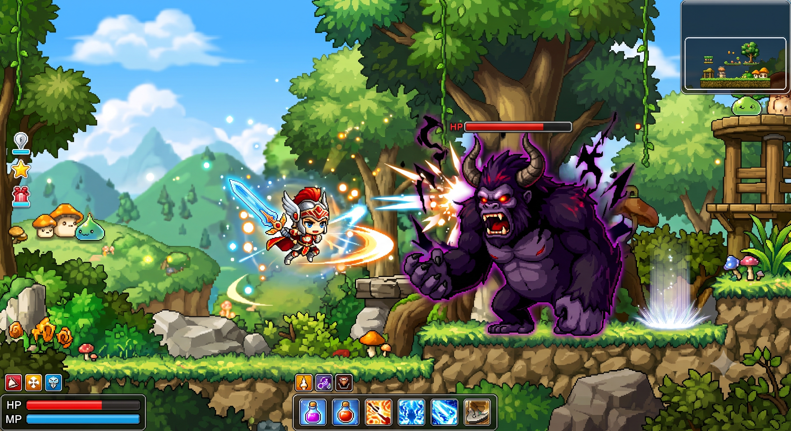
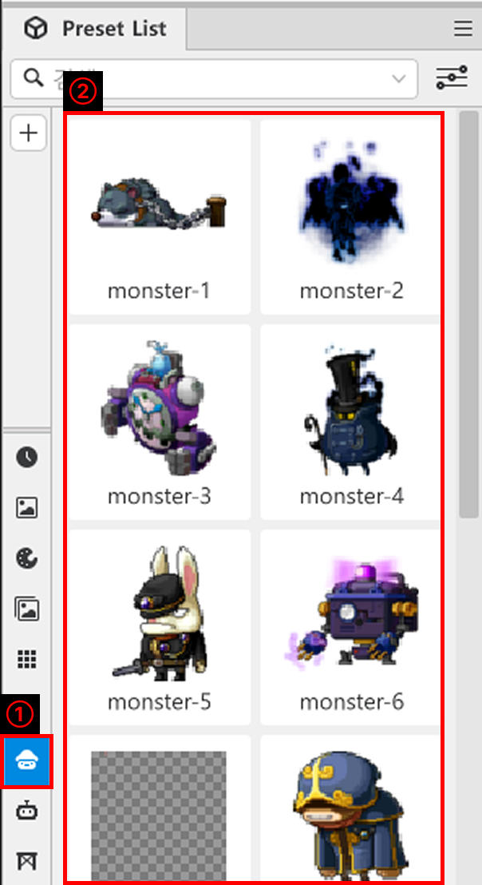
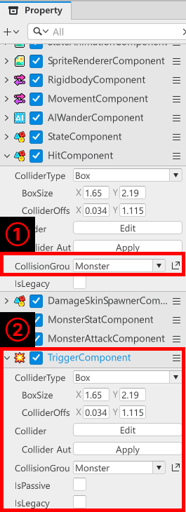
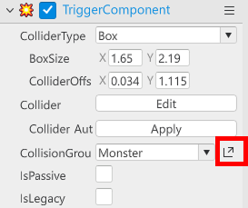
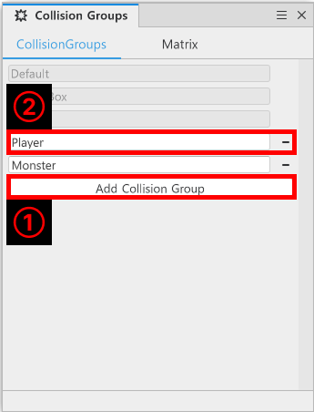
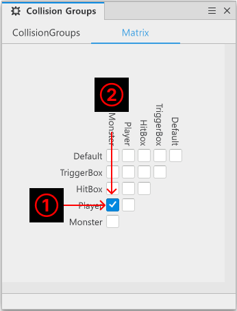
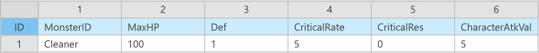

# [💡基礎學習] 製作敵人
<br>
<br>
<br>

## 影片時間軸
- 可在課程影片中以下時間點學習。
- 製作敵人：`00:12:54`

<br>

## 學習目標
- 學習使用Preset List的怪物製作敵人的方法。
- 學習組成讓敵人能受到攻擊的功能的方法。
- 學習組成怪物死亡時能執行處理的功能的方法。

<br>

## 觀看該影片後可嘗試執行的內容
- 製作怪物，使其能與自己設計的怪物進行戰鬥。
- 製作怪物與玩家可以互相攻擊的功能。

<br>

## 製作怪物
<p align="center">

</p>

- 在冒險世界中，玩家會體驗各種不同形式的危險。
- 怪物雖然是玩家直接面對的危險因素，但同時也是玩家克服並成長的要素。

<br>

### 組成怪物實體
<p align="center">

</p>

- 組成怪物的方法有很多種。
- 可以直接建立實體，並加入所需的Component來組成怪物。
- 範例世界中是使用**PresetList**中製作好的怪物來進行製作。
- 在**PresetList**中選擇想要的怪物後，可透過拖放(Drag & Drop)將怪物設定到**Scene**中。

<br>

### 準備怪物的攻擊&受擊
<p align="center">

</p>

- 以**Preset List**製作的怪物具有**HitComponent**。
- **HitComponent**是為了讓實體能夠受擊而製作的Component。
- 將**HitComponent**的**CollisionGroup**變更為Monster，將該實體的受擊群組設定為Monster。
- 新增**TriggerComponent**，準備讓玩家與怪物碰撞時玩家受到傷害。
- 調整**TriggerComponent**的BoxSize、ColliderOffset，指定怪物的攻擊範圍。
- 將**CollisionGroups**設定為Monster，設定攻擊主體為Monster。

<br>

#### 變更CollisionGroup
<p align="center">

</p>

- 可以在設定**CollisionGroups**的項目中，點擊右側的展開選單來管理**CollisionGroups**。
- 另一種方法是透過楓之谷世界編輯器上方的**Panels** - **Collision Groups**進行管理。

<p align="center">

</p>

- 可以透過**Add Collision Group**建立新的碰撞群組。
- 可以將建立好的群組名稱登錄為**Player**、**Monster**等，指定碰撞群組。

<p align="center">

</p>

- 可以透過**Matrix**分頁設定各**Collision Groups**之間是否進行碰撞檢查。
- 查看Matrix並設定碰撞關係的方法如下。
    - **1號**和**2號**群組是否需要互相碰撞?
    - 如果需要碰撞，則勾選核取方塊。
    - 如果彼此不碰撞，則取消勾選核取方塊。

<br>

### 製作怪物的屬性
<p align="center">

</p>

- 怪物同樣擁有攻擊力、防禦力、體力等數值。
- 範例世界中為了管理這些怪物的數值，使用了**MonsterData**。

<table class="tg"><thead>
  <tr>
    <th class="tg-baqh">名稱</th>
    <th class="tg-baqh">說明</th>
  </tr></thead>
<tbody>
  <tr>
    <td class="tg-0lax">MonsterID</td>
    <td class="tg-0lax">用來區分怪物的ID值。</td>
  </tr>
  <tr>
    <td class="tg-0lax">MaxHP</td>
    <td class="tg-0lax">用來設定怪物初始體力的值。</td>
  </tr>
  <tr>
    <td class="tg-0lax">Def</td>
    <td class="tg-0lax">用來設定怪物防禦力的值。</td>
  </tr>
  <tr>
    <td class="tg-0lax">CriticalRate</td>
    <td class="tg-0lax">用來設定怪物暴擊機率的值。</td>
  </tr>
  <tr>
    <td class="tg-0lax">CriticalRes</td>
    <td class="tg-0lax">用來設定怪物暴擊攻擊抵抗的值。</td>
  </tr>
  <tr>
    <td class="tg-0lax">CharacterAtkValue</td>
    <td class="tg-0lax">用來設定怪物攻擊力的值。</td>
  </tr>
</tbody>
</table>

- 接著，為了取得怪物資訊，製作用來管理**MonsterData** DataSet的Logic。
- 範例世界中使用名為**MonsterDataLogic**的Logic。
- 以下是**MonsterDataLogic**的程式碼。
```lua
@Logic
script MonsterDataLogic extends Logic

property table monsterData = {}

@ExecSpace("ClientOnly")
method void OnBeginPlay()
self:InitMonsterData()
end

@ExecSpace("ClientOnly")
method void InitMonsterData()
-- 檢查monsterData是否為空的狀態。
if not isvalid(self.monsterData) or not next(self.monsterData) then
	-- 如果是空的狀態，則讀取DataSet。
	local getData = _DataService:GetTable("MonsterData")
	-- 檢查DataSet是否正常存在。
	if not isvalid(getData) then
		-- 如果不存在，則留下錯誤日誌。
		log_error("MonsterData不存在！")
		return
	end
	for i = 1, getData:GetRowCount() do
		local rowData = StatData()
		local monsterID = getData:GetCell(i, "MonsterID")
		rowData.MaxHP = tonumber(getData:GetCell(i, "MaxHP"))
		rowData.Def = tonumber(getData:GetCell(i, "Def"))
		rowData.CharacterAtkValue = tonumber(getData:GetCell(i, "CharacterAtkValue"))
		rowData.CriticalRate = tonumber(getData:GetCell(i, "CriticalRate"))
		rowData.CriticalRes = tonumber(getData:GetCell(i, "CriticalRes"))
		self.monsterData[monsterID] = rowData
	end
end
end

@ExecSpace("ClientOnly")
method StatData GetMonsterDataByMonsterID(string MonsterID)
if isvalid(self.monsterData[MonsterID]) then
	return self.monsterData[MonsterID]
else
	log_error(MonsterID.."是不存在的MonsterData！")
	return nil
end
end

end
```

> 該程式碼是以Plain Text為基準編寫而成。

- 最後，為了讓怪物登錄並使用自己的屬性，必須將Component賦予給怪物實體。
- 範例世界中為了執行該功能，製作並使用了**MonsterStatComponent**。
- 以下是**MonsterStatComponent**的程式碼。

```lua
@Component
script MonsterStatComponent extends Component

property StatData monsterStat = StatData()

property integer currentHp = 100

property integer maxHp = 100

property any animEndHandler = nil

property boolean isDead = false

property string monsterID = ""

@ExecSpace("ClientOnly")
method void OnBeginPlay()
self:InitMonsterData()
end

method Entity GetSpriteEntity()
-- 回傳已儲存的spriteEntity。如果沒有，則回傳根實體。
if self._T.spriteEntity ~= nil and isvalid(self._T.spriteEntity) then
	return self._T.spriteEntity
end
return self.Entity
end

method void InitMonsterData()
-- 檢查monsterID是否為nil狀態。
if _UtilLogic:IsNilorEmptyString(self.monsterID) then
	log("monsterID為nil！")
	return
end
-- 從MonsterDataLogic取得資訊。
local getData = _MonsterDataLogic:GetMonsterDataByMonsterID(self.monsterID)
-- 如果正常取得數值，則更新資訊。
if isvalid(getData) then
	self.monsterStat = getData
	self.currentHp = self.monsterStat.MaxHP
end

self.Entity.StateComponent:ChangeState("IDLE")
end

@ExecSpace("ClientOnly")
@EventSender("Self")
handler HandleHitEvent(HitEvent event)
-- 處理受擊傷害。
local damage = event.TotalDamage
self.currentHp = self.currentHp - damage
log("MonsterStatComponent: [" ..self.Entity.Name .."] 受擊 - 傷害：" ..tostring(damage) .." / 剩餘HP：" ..tostring(self.currentHp))

local stateComp = self.Entity.StateComponent

-- HP為0以下時，執行死亡處理。
if self.currentHp <= 0 then
	self.currentHp = 0
	self.isDead = true
	log("MonsterStatComponent: [" ..self.Entity.Name .."] 死亡 - 切換為DEAD狀態")
	if isvalid(stateComp) then
		stateComp:ChangeState("DEAD")
	end
	return
end

-- 存活時切換為HIT狀態。
if isvalid(stateComp) then
	stateComp:ChangeState("HIT")
end
end

@EventSender("Self")
handler HandleSpriteAnimPlayerEndFrameEvent(SpriteAnimPlayerEndFrameEvent event)
-- 實體未啟用時，中斷程式碼執行。
if not isvalid(self.Entity) then return end
-- 為了取得目前狀態，取得StateComponent。
local stateComponent = self.Entity.StateComponent
-- 目前State為DEAD時，表示死亡動畫的最後一幀已播放，因此停用實體。
if stateComponent.CurrentStateName == "DEAD" then
	self.Entity:SetEnable(false)
end
end

end
```

> 該程式碼是以Plain Text為基準編寫而成。

- 最後，必須組成讓怪物可以攻擊玩家的功能。
- Extend**AttackComponent**製作**MonsterAttackComponent**。
- 以下是**MonsterAttackComponent*的程式碼。

```lua
@Component
script MonsterAttackComponent extends AttackComponent

method boolean CalcCritical(Entity attacker, Entity defender, string attackInfo)
-- 計算暴擊機率並回傳是否為暴擊。
---@type MonsterStatComponent
local attackerStat = attacker:GetComponent("script.MonsterStatComponent")
---@type PlayerStatComponent
local defenderStat = defender:GetComponent("script.PlayerStatComponent")
if not isvalid(attackerStat) or not isvalid(defenderStat) then return false end
local criRate = _UtilLogic:RandomIntegerRange(1, 100)
local calcValue = attackerStat.monsterStat.CriticalRate - defenderStat.playerStat.CriticalRes
if calcValue <= 0 then
	return false
elseif calcValue >= criRate then
	return true
else
	return false
end
end

method integer CalcDamage(Entity attacker, Entity defender, string attackInfo)
return _DamageCalcLogic:CalculateMonsterAttack(self.Entity, defender)
end

@ExecSpace("ClientOnly")
@EventSender("Self")
handler HandleTriggerEnterEvent(TriggerEnterEvent event)
-- 如果怪物為死亡狀態，則中斷執行。
if self.Entity.MonsterStatComponent.isDead then
	return
end
-- 將碰撞的實體(對象)放入變數。
local targetEntity = event.TriggerBodyEntity
-- 先檢查對象實體本身是否有效(是否未被刪除)。(最重要)
if isvalid(targetEntity) and targetEntity == _UserService.LocalPlayer then
	-- 如果Component正常存在，則準備造成傷害。
	local isCritical = self:CalcCritical(self.Entity, targetEntity, "")
	local getDamage = self:CalcDamage(self.Entity, targetEntity,"")
	-- 若已放入HitEvent所需的所有元素，則將事件傳遞給PlayerEntity。
	_UserService.LocalPlayer.HitComponent:OnHit(self.Entity, getDamage, isCritical, "", 1)
end
end

end
```
> 該程式碼是以Plain Text為基準編寫而成。

<br>

## 學習怪物的攻擊方式
- 範例世界中會檢查怪物與玩家碰撞的**瞬間*。
- 因此會造成一次性傷害，並不是持續攻擊。
- 但是玩家的攻擊是每次執行攻擊時都會進行傷害計算。
- 因此必須構想不單純依賴**TriggerComponent**的**TriggerEnterEvent**的其他傷害計算方式。
    - EX：玩家進入攻擊範圍時，讓其每隔一定週期執行攻擊。
    - EX2：玩家進入攻擊範圍時，使用Attack執行攻擊。
    - 玩家離開攻擊範圍時，將攻擊對象變更為nil，防止反覆對空攻擊的行為。

<br>

## 最低製作標準
- 怪物必須擁有並能使用自己的固有屬性。
- 玩家與怪物必須能互相執行攻擊，並進行傷害計算。

<br>

## 應用與進階應用
- 修改功能，讓怪物的攻擊方式也能執行持續攻擊。
- 玩家與怪物攻擊時，製作受擊時擊退等效果。
- 戰鬥進行時，加入鏡頭演出、畫面效果等各種裝置，形成打擊感。