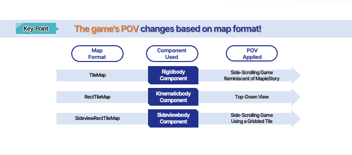
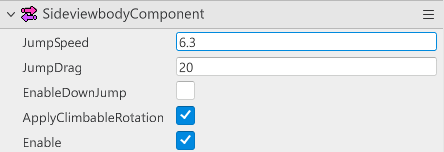
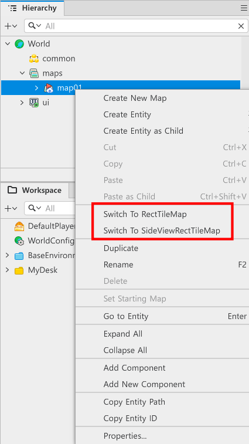
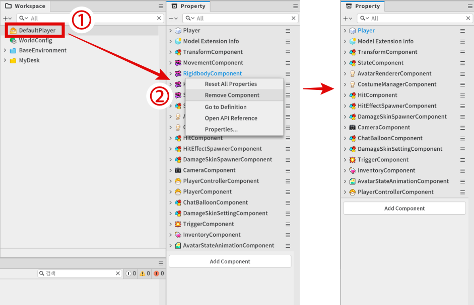
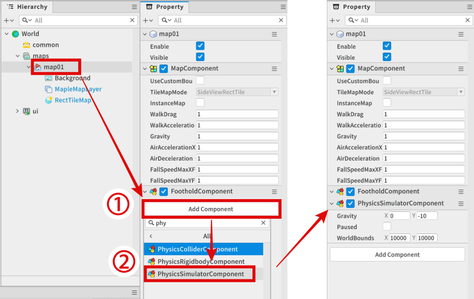
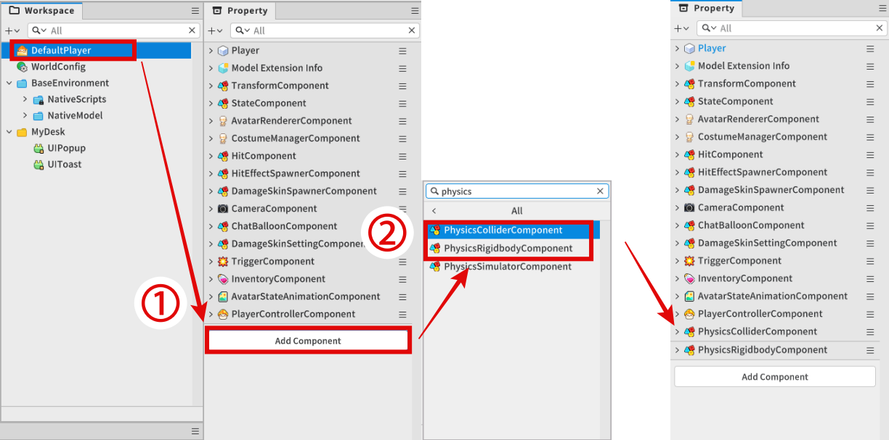
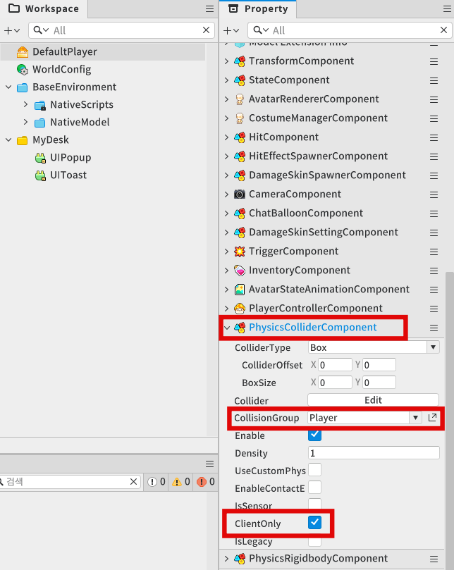
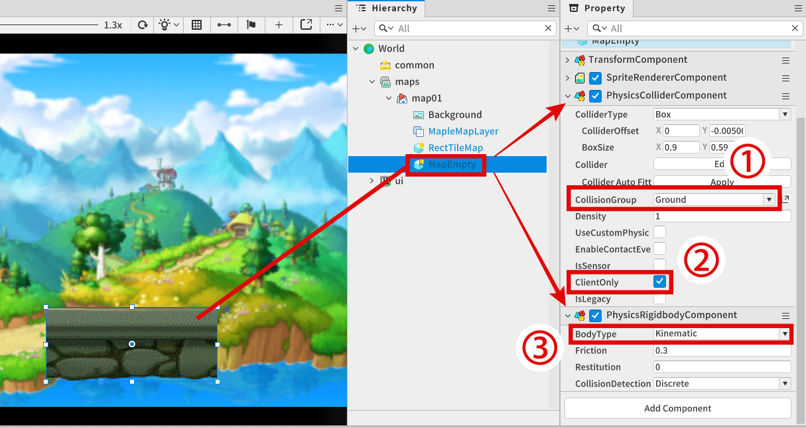
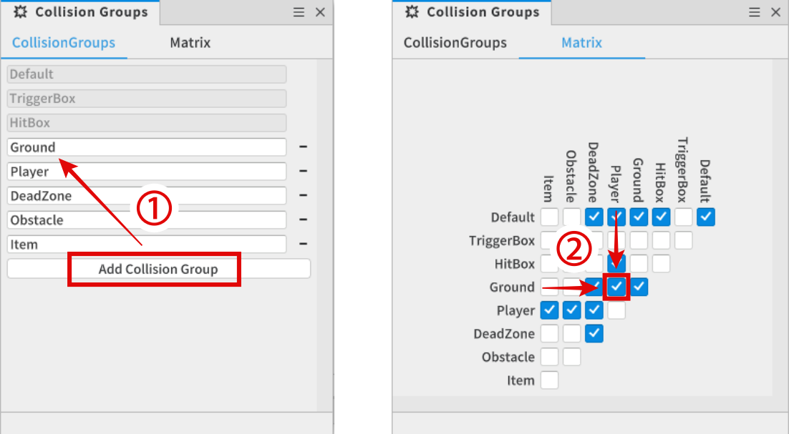
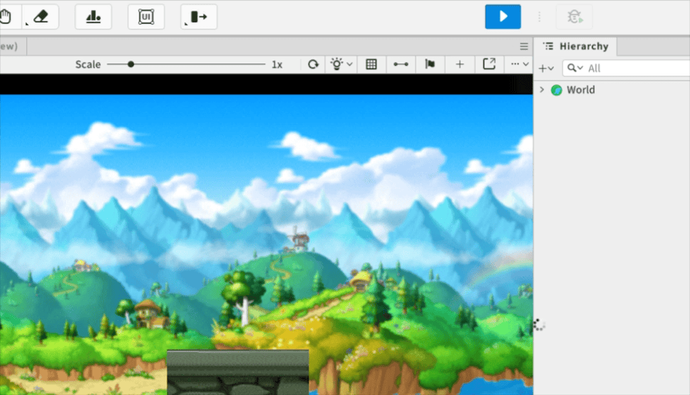

# [💡Basic Training] Implementing a World Environment
 
 
 

## Video Timeline
- You can follow along by using the timeline under the training video.
- Implementing a World Environment: 00:00:01
 

## Learning Goals
- Understand the traits of the various TileMap modes that are provided by MapleStory Worlds and the correlation of Body components appropriate for each map.
- Analyze the traits of the running platformer genre and compose the optimized game creation environment yourself.
- Learn the core functions and properties of the PhysicsRigidbody and PhysicsCollider components to implement the character movement and collision detection.
- Apply the learned physics system to actual entities and practice adjusting the physics setting values that fit the game design through test play.
 

## Practical Exercises to Do After Watching the Video
- Implement a map environment that fits a running platformer.
- Register components needed for the interaction between character and floor tiles.
- Test if the created tiles can be stepped on in order to allow for movement.
 

## MapleStory Worlds Map Mode

 

### TileMap

- A map format that is set up as the default when creating a world for the first time in MapleStory Worlds.
- A world that is best suited for the feel of MapleStory.
- Formulate a map by utilizing Tiles provided by MapleStory Worlds to create platforms and place entities.
- Create a ramp based on how the tiles are placed.
- A useful map format when you want to make a side scrolling-type game reminiscent of MapleStory.
 

### RectTileMap

- A map format that is effective in making top-down view type games.
- Create your own tile sets or use the tile set resources provided by MapleStory Worlds to formulate a map.
- You can formulate a map by placing tiles in a gridded format.
- You can create mobile and immobile areas through each tile.
- Create a game where you can move in 4 or 8 directions, unlike with the TileMap and SideViewRectTileMap methods.
 

### SideviewRectTileMap

- A map format that is effective in making side scrolling-type games.
- Create your own tile sets or use the tile set resources provided by MapleStory Worlds to formulate a map.
- You can formulate a map by placing tiles in a gridded format.
- The character moves **through** tiles if the tile set doesn't prevent it, unlike with RectTileMap.
- So if you formulate a map with SideViewRectTileMap, the tile set that prevents movement must be used to create **platforms**.
 

## BodyComponent
- The BodyComponent is required to interact with tiles that are platforms in MapleStory Worlds.
- Different BodyComponents are needed based on the map type.
- There are 3 main types of BodyComponents.
 

### RigidbodyComponent

- Controls the character's physics with MapleStory Worlds's TileMap method.
- If the map is a TileMap but doesn't have a RigidBodyComponent, the character and tiles will not interact.
- Provides various physics property values that control the jumps, gravity, and more for characters within RigidBodyComponent.
- The target values can be changed to change the physics methods.
 

### KinematicComponent

- Controls the character's physics for the MapleStory Worlds's RectTileMap type.
- If the map is RectTileMap but there is no KinematicBodyComponent, no interactions will happen with the RectTileMap tiles.
- You can adjust the speed, jump availability, shadow status, etc. for characters within KinematicBodyComponent.
 

### SideviewbodyComponent

- Controls the character's physics if MapleStory Worlds is using the SideViewRectTileMap method.
- If this component doesn't exist, the character won't be able to interact with the map's tiles.
- Controls the character's jump speed and gravitational acceleration.
 

## Changing Map Formats

- Right-click the map you want to change from the Hierarchy window.
- Click Switch To RectTileMap or Switch To SideViewRectTileMap.
    - If the current map isn't a TileMap, Switch To TileMap will be visible and the conversion to the current map state will be hidden.
- Click on Switch To SideViewRectTileMap to convert the map to SideViewRectTileMap to create a running platformer game.
 

## Removing the DefaultPlayer's Existing Component

1. Select the DefaultPlayer(Model) from WorkSpace that will be the template for the character that the player will control. 
2. To prevent interference of the physics and interaction function from the Property tab, remove the target component using Remove Component. (Rigidbody, Kinematicbody, Sideviewbody, Movement, Player)
  
 

## Apply a Physics System Utilizing the Physics Component
- With how the running platform game works, floor tiles need to be continuously created and destroyed. So in order to make management smooth and to apply independent functions, the floor tile itself will be implemented as a whole entity. 
- A separate Physics setting is needed, since it's not terrain created as a TileSet.
 

### Registering PhysicsSimulator to Map Entity

1. Select the Map entity from the Hierarchy tab after clicking AddComponent.
2. Register PhysicsSimulatorComponent.
 

### Registering Character PhysicsComponent

1. Select the original DefaultPlayer and click the AddComponent button from the Property tab.
2. Register PhysicsCollider and PhysicsRigidbodyComponent.
 

### Setting a PhysicsColliderComponent

- Add a 'Player' group to CollisionGroup to set collision targets.
- Check the ClientOnly item from the internal properties of PhysicsColliderComponent, since the game doesn't interact with other players.
 

## Floor Tile Entity Composition and Interaction Test

### Setting the Test Floor Tile

- Create entities for testing and register PhysicsRigidbody and PhysicsColliderComponent like with characters.

1. Set CollisionGroup to Ground, so it can interact with characters.
2. Check the ClientOnly item from the PhysicsColliderComponent internal properties, since it only works in a local environment like with characters.
3. Set BodyType to Kinematic from the PhysicsRigidbodyComponent internal properties, since the entity that will be used as the floor will have to execute movement whole in a static state. 
 

### Adding and Setting CollisionGroup

1. Create a new CollisionGroup item using the CollisionGroup's Add Collision Group.
2. Confirm whether the Player and Ground lines are checked in the Matrix tab, so the collision between Player and Ground can be detected.
 

### Testing Interactions

- Confirm if the character can stand on top of the tile entity while being affected by gravity as intended in a world environment that's launched through the play button on the top of the editor.
 

## Minimum Implementation Standards
- Compose the running platformer game map that a character can normally run in.
  - The character shouldn't be floating in the air or be going through the floor tile.
 

## Usage and Extension Direction
- Control the size of the character by adjusting the Scale value of the TransformComponent for the playable character and edit the collider size with the collider Edit button in PhysicsCollider. The game difficulty can be set through such settings.

