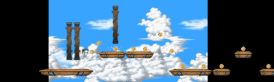
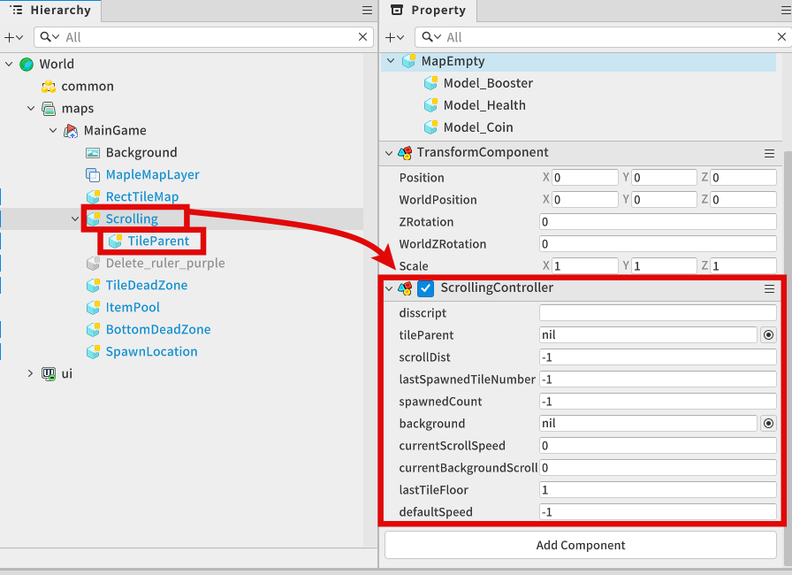
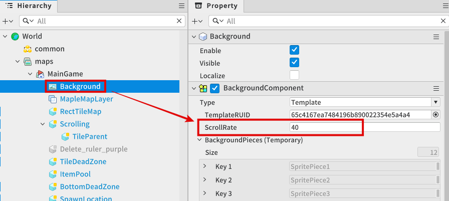
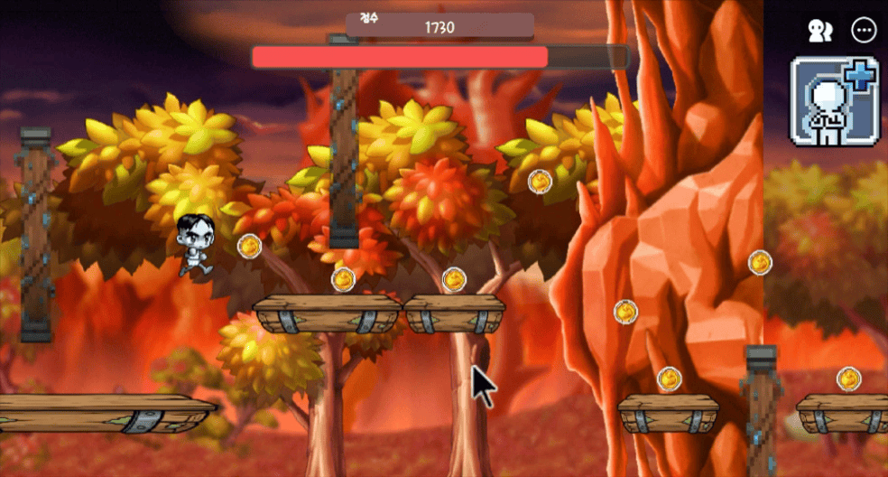
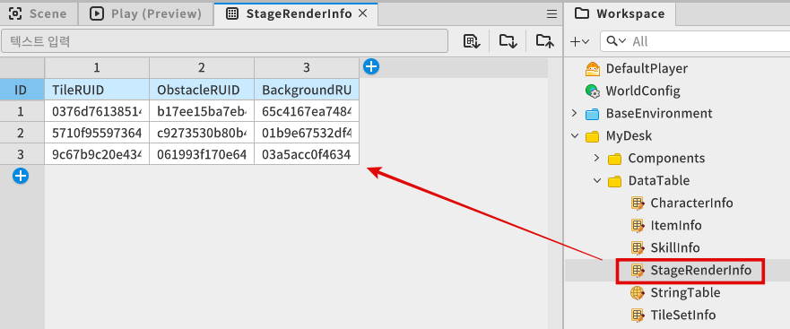
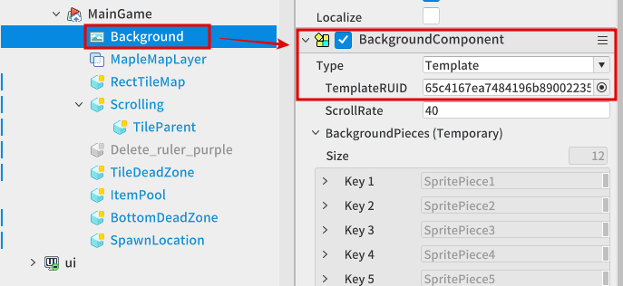
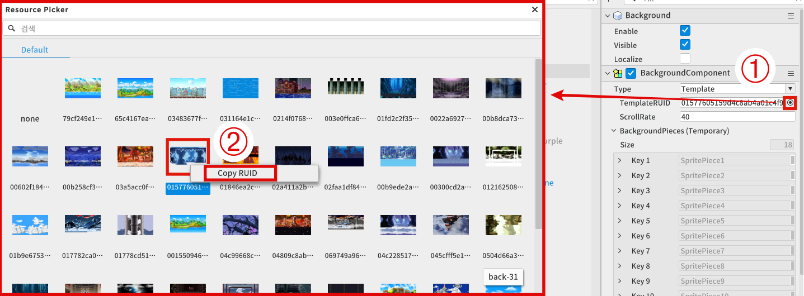

# [💡Basic Training] Implementing the Scroll System
<br>
<br>
<br>

## Video Timeline
- You can follow along by using the timeline under the training video.
- Implementing the Scroll System: 00:25:46
<br>

## Learning Goals
- Understand the core principles of the scroll system that moves the background in the opposite direction of the character to make it look like the character is continuously running.
- Write a script that can smoothly move the entity at a consistent speed over time without being affected by frames by utilizing the OnUpdate method and delta time.
- Adjust the game's difficulty by controlling the speed of the background and floor tiles.
- Understand how the stage environment changes dynamically based on the game's progress.
<br>

## Practical Exercises to Do After Watching the Video
- Change the BackgroundComponent's ScrollRate value in the Map entity's child Background entity to set the appropriate background movement speed.
<br>

## Understanding the Scroll System's Basic Structure and Principles
- If the character is allowed to endlessly run to the right in a running platformer game, you will be forced to create an infinitely long map.
- You may run into a critical error in the system if the character's coordinate values become infinitely larger.
- The scroll system needs to be implemented to overcome the physical limits and use the infinite map with stability.
<br>

### Relative Scrolling
<p align="Center">

</p>

- The camera and player character don't move and are placed in a fixed location.
- Instead, the floor tile that the character is standing on, obstacles, and background elements are continuously moved to the left, the opposite direction.
- This creates the illusion that the player character is moving to the right.
- As a result, you can create an environment where the character infinitely runs to the right while staying in place regardless of the size of the map.

<br>

## Creating ScrollingController
<p align="Center">

</p>

- Register the ScrollingController component to an empty entity.
  - ScrollingController is the subject that manages the game's overall scroll environment.
  - Set the created entity's TransformComponent Position value to (0,0,0).
- Create an empty entity and set it as the child entity of an entity that has an attached ScrollingController component.
  - This entity serves the role of a parent entity that's meant to move the entire tile set.
  - Set the created entity's TransformComponent Position value to (0,0,0) to place it on the same line as the parent.
<br>

### Composing ScrollingController Component
- The code is required to control the background and floor tile.
- Write the following code.
- The target code is based on Plain Text.

```lua
@Component
script ScrollingController extends Component

property string disscript = "" -- This logic is for the overall management of the side-scrolling movement in a running platformer game.

property Entity tileParent = nil

property number scrollDist = -1 -- This variable saves the current scroll distance. // The distance per tile set is 10 in config.

property number lastSpawnedTileNumber = -1 -- The tile number that was created very last.

property number spawnedCount = -1 -- This variable is a record of how many tiles are spawned.

property BackgroundComponent background = nil

property number currentScrollSpeed = 0 -- This variable saves the current scrolling speed value.

property number currentBackgroundScrollSpeed = 0 -- This variable saves the current background scrolling speed value.

property number lastTileFloor = 1 -- This variable saves the number of tile floors that was spawned last.

property number defaultSpeed = -1 -- The scroll speed value that's set upon character selection.

@ExecSpace("ClientOnly")
method void Scroll(number moveDistance)
-- Moves the activated TileSet object by the distance that received the currently-set scroll.

-- Moves the parent object (TileParent).
self.tileParent.TransformComponent:Translate(moveDistance,0)
end

@ExecSpace("ClientOnly")
method void ConnectRefs()
-- This method reference links members that are internally necessary.

-- Links the Entity of the object that will be the parent of all tile sets.
self.tileParent = _EntityService:GetEntityByPath("/maps/MainGame/Scrolling/TileParent")

-- Links the Background component.
self.background = _EntityService:GetEntityByPath("/maps/MainGame/Background").BackgroundComponent
end

@ExecSpace("ClientOnly")
method void Init()
-- This method proceeds with an internal reset for a Scrolling Controller component.

-- Proceeds with internal reference linking.
self:ConnectRefs()

-- Sets the background screen scrolling speed value to the background scrolling speed set in Config.
self.background.ScrollRate = _Config.backgroundScrollSpeed

-- Sets the scrolling speed value of the actual background object.
self.currentBackgroundScrollSpeed = _Config.backgroundScrollSpeed

-- Resets the number of created tile sets.
self.spawnedCount = 0
end

@ExecSpace("ClientOnly")
method void OnUpdate(number delta)
-- This method is called for each frame.

-- If the main game is closed,
if _GameLogic.isEnd == true then
	-- the Update method action is stopped.
	return
end

-- Executes the floor object movement with the set scrolling speed.
self:Scroll(-1 * delta * self.currentScrollSpeed)
end

@ExecSpace("ClientOnly")
method void SpawnRandomTile()
-- This method creates random tile sets.

-- Extracts a random, not duplicated number and the latest created tile number.
local randomNumber = self:GetRandomTileNumber()

-- Creates a tile with the randomly-extracted number.
self:SpawnTile(randomNumber)
end

@ExecSpace("ClientOnly")
method number GetRandomTileNumber()
-- This method extracts a random tile number.

-- This process loads the table that contains the tile set numbers that can be linked with the floor count of the tile set that was spawned last.
-- ex) End Point Floor Number: Fl. 2 / Table containing the tile set number starting with Fl. 2 O
-- ex) End Point Floor Number: Fl. 1 / Table containing the tile set number starting with Fl. 2 X
-- This is to create a linked tile set.

-- This is the core logic for sequential map creation.

-- When assuming that Fl. N was the end point of the tile that was spawned last,
-- a table that contains the tile set numbers that can start with Fl. N is loaded.
local tileSetFloorInfoTable = _DataSetLogic.tilesFloorInfoTable[self.lastTileFloor]

-- Confirms the target table's total count.
local tileSetTableTotalCount = #tileSetFloorInfoTable

-- Extracts a random number with a range from 1 to the number of tile types.
local randomNumber = math.random(1,tileSetTableTotalCount)

-- Extracts the 'randomNumber' tile set number from the table that only contains the relevant floor number.
local selectedTileNumber = tileSetFloorInfoTable[randomNumber]


-- This logic is to prevent consecutive tile spawn creations. (If you want to allow for consecutive tile set creations, don't execute the syntax below.)

-- If the randomly-drawn number is the same as the the previously-spawned tile number (another random draw takes place to prevent the same tile being selected again),
if selectedTileNumber == self.lastSpawnedTileNumber then
	
	-- a random number is extracted again. (Extracts a random element from the tile set elements that match the relevant floor number.)
	local tempNumber = math.random(1,tileSetTableTotalCount)
	
	-- If the random number is a duplicate number again,
	if tempNumber == randomNumber then
		-- the randomly-drawn number value is increased by 1 and then the remaining operator is utilized.
		tempNumber = (tempNumber + 1) % tileSetTableTotalCount+1
		
		-- This is why the first starting value of the data set is 1 and, if the product of remaining calculation is 0,
		if tempNumber == 0 then
			-- the tempNumber value is set to 1.
			tempNumber = 1
		end
		
	end
	-- Selects the randomly-drawn index 'tempNumber' element from the table that only contains the relevant floor number.
	selectedTileNumber = tileSetFloorInfoTable[tempNumber]
end

-- Returns the target tile set number.
return selectedTileNumber
end

@ExecSpace("ClientOnly")
method void SetScrollSpeed(number speed)
-- This method controls the floor tile object's speed.

-- Parameter 1 number speed: Receives the intended speed setting.

-- Sets the current speed value as the speed value that was received from a parameter.
self.currentScrollSpeed = speed
end

@ExecSpace("ClientOnly")
method void SetBackgroundScrollSpeed(number speed)
-- This method adjusts the background scroll speed.

-- Parameter 1 number speed: Receives the intended speed setting.

-- Sets the background scroll speed as the parameter value.
self.background.ScrollRate = speed
end

@ExecSpace("ClientOnly")
method void ReturnAllTiles()
-- This method returns (deactivates) all created tile set objects.

-- Stores 'TileSet' components into a table by accessing the tileParent children recursively.
local tileSetTable = self.tileParent:GetChildComponentsByTypeName("TileSet",true)

-- Traverses a number of times equal to the number of tables that contains 'TileSet' components.
for	i = 1, #tileSetTable, 1 do
	
	-- If the object of each element is on (activated) (to prevent only objects that are turned on from being returned),
	if tileSetTable[i].Entity.Enable == true then
			
		-- accesses as a tile set component for each element.
		local tempTileset = tileSetTable[i].Entity.TileSet
		-- Retrieves all items that were placed as the children of the tile set.
		tempTileset:ReturnAllItems()
		-- Returns the relevant tile set as an object pool again.
		_ObjectPoolLogic:ReturnTile(tempTileset.Entity)
	end
	
	
end
end

method void SpawnTile(number tileSetNumber)
-- This method spawns the tile set object.

-- Parameter 1 number tileSetNumber: Receives to create the target parameter number's tile set.

-- Receives the 'parameter' tile object from the object pool.
local spawnedTile = _ObjectPoolLogic:GetTile(tileSetNumber)

-- Records the floor of the end point for the tile set that was spawned from the object pool.
self.lastTileFloor = _DataSetLogic.tileSetInfoTable[tileSetNumber].LastFloor

-- Sets the X-axis distance from the parent object that act as the basis of the tile set.
-- spawnedCount(Previously-Created Tile Set Count) * 10(Tile Set Prefab's Standard Distance Unit)
spawnedTile.TransformComponent.Position = Vector3(self.spawnedCount * 10,0,0)

-- Increases the number of created tile set by 1.
self.spawnedCount += 1
-- Replaces the tile set number that was created last with the tile set number that was fetched from the object pool.
self.lastSpawnedTileNumber = tileSetNumber

-- Proceeds with a reset of a tile set that was fetched from the object pool.
spawnedTile.TileSet:Init()
end

@ExecSpace("ClientOnly")
method void Reset()
-- This method resets the member elements needed for game progression.

-- Resets the number of created tiles to 0.
self.spawnedCount = 0
-- Resets the position of the 'tileParent' object, which is the parent of all the tile set objects.
self.tileParent.TransformComponent.Position = Vector3(0,0,0)
-- Sets the background scrolling speed to the value that was set as a basis in Config.
self:SetBackgroundScrollSpeed(_Config.backgroundScrollSpeed)

-- Creates a tile set in sequence from 1 to 5 when the game starts.

-- Executes a loop from 1 to 5
for	i = 1, 5, 1 do
	-- and spawns tile index i.
	self:SpawnTile(i)
end
end

@ExecSpace("ClientOnly")
method void ChangeBackground()
-- This method changes the background.

-- Sets the background with the background RUID value that was saved in the data set referencing the current stage number that's registered to the game logic.
self.background:ChangeBackgroundByTemplateRUID(_DataSetLogic.stageRenderInfoTable[_GameLogic.currentStage].BackgroundRUID)
end

end
```

## BackgroundComponent's ScrollRate
<p align="Center">

</p>

- Access the Background entity to control the background image's scroll speed.
- Set the BackgroundComponent ScrollRate value.
- Even if the editor isn't in a play state, you can view directly from the Scene tab's screen. 

### Changing ScrollRate with Code
- The method to control the background scroll speed in real time while the game is running.
- References the SetBackgroundScrollSpeed method registered in the ScrollingController script.
```lua
void SetBackgroundScrollSpeed (number speed)
{
    self.background.ScrollRate = speed
}
```
<br>

## How to Change Stages in Real Time
<p align = "Center">

</p>

- Set so that the background, floor tile, and the appearances of obstacles change once a set amount of time passes after the game starts.
<br>

### Registering the Appearance DataSet that will be Applied to Each Stage
<p align = "Center">

</p>

<table class="tg"><thead>
  <tr>
    <th class="tg-7btt">Name</th>
    <th class="tg-7btt">Description</th>
  </tr></thead>
<tbody>
  <tr>
    <td class="tg-lboi">TileRUID</td>
    <td class="tg-0pky">The resource ID value of the floor tile which interacts with the character.</td>
  </tr>
  <tr>
    <td class="tg-lboi">ObstacleRUID</td>
    <td class="tg-0pky">The resource ID value of the obstacle element that appears with the floor tile.</td>
  </tr>
  <tr>
    <td class="tg-lboi">BackgroundRUID</td>
    <td class="tg-0pky">The resource ID value that will be applied as the background with the backgroundComponent's templateRUID value.</td>
  </tr>
</tbody>
</table>

- A DataSet is needed to save the RUID values that need to be applied to each stage.
- The sample world is divided in to stages 1, 2, and 3 like in the image, and the floor tile RUID, obstacle RUID, and background image RUID values are saved for each stage.
<br>

### How to Change Stages
- The GameLogic's currentStage number type variable manages the data that manages the stage numbers.
- The stage change function is called from GameLogic's OnUpdate method after a set amount of time.
- The sample world only has a total of 3 registered stages, but it is created with a structure of lopping stages with 1,2,3 -> 1,2 using the % operator.
- Confirms the GameLogic's currentStage number and applies the RUID value that corresponds to the current number for floor tiles and obstacles when the entity is activated.
- The following is a portion of the GameLogic code.

```lua
GameLogic
number currentStage = 1 -- The variable that records the current stage information.
number stageTimer = 0 -- Records how many seconds remain until the stage changes.

void OnUpdate(number delta) -- The method that's called every frame.
{
    if(stageTimer > 0) then -- If there is time remaining in the timer,
        self.stageTimer -= delta -- The delta value is deducted from the timer.

    else -- If there is no time left in the timer,
        self.StageChange() -- Calls the StageChange method.
        self.stageTimer = _Config.stageChagneTime -- Resets the timer to the earlier time value.
}

void StageChange() -- The method that changes stages.
{
    -- Create with a structure that can continuously loop the stage numbers in sequence of 1,2,3,1.
    self.currentStage = (self.currentStage % (totalStageCount+1))+1
    scrollingController:ChangeBackground()
}
```
<br>

### Floor Tile Appearance Application Example
- When an entity is activated in the component that executes the floor tile function as provided in the sample world, the appearance is applied from within the Init method.
- Learn about the TileSet component script in the next chapter, `Manage the Map Through Procedural Creation Methods`.

```lua
TileSet

void Init()
{
    local renderers = 
        self.Entity:GetChildComponentsByTypeName("SpriteRendererComponent",false)

    renderer.SpriteRUID = 
        _DataSetLogic.stageRenderInfoTable[_GameLogic.currentStage].TileID
}
```
<br>

## Changing Background Appearances
<p align = "Center">

</p>

- The method provided from BackgroundComponent must be used to change the RUID of the BackgroundComponent, which manages the background image.
- Confirm the current Background Type.
- Use the BackgroundComponent's ChangeBackgroundByTemplateRUID method, since the Template type is currently in use.
    - MapleStory Worlds official document, BackgroundComponent [Link](https://maplestoryworlds-creators.nexon.com/ko/apiReference/Components/BackgroundComponent)
<br>

### Confirming the backgroundTemplateRUID Value
<p align = "Center">

</p>

1. Open the BackgroundComponent's RUID resource picker window to check the background's TemplateRUID value.
2. Extract the value by right-clicking the target resource and then clicking Copy RUID.
<br>

### Changing backgroundTemplateRUID
- Change the background image through code from the ScrollingController component when GameLogic is calling the stage change function.
- Checks the registered background type and utilizes the RUID change method that's provided by the appropriate BackgroundComponent.
```lua
ScrollingController

BackgroundComponent background

void ChangeBackground()
{
    self.background:ChangeBackgroundByTemplateRUID(
        _DataSetLogic.stageRenderInfoTable[_GameLogic.currentStage].BackgroundRUID)
}
```
<br>

## Minimum Implementation Standards
- Implement the basic floor tile creation and movement functions.
<br>

## Usage and Extension Direction
- Add the RUID that manages the RUID for floor tiles, obstacles, and backgrounds to the DataSet to create a more varied stage.
- Adjust the stage change timer to change stages at the desired timing. 

