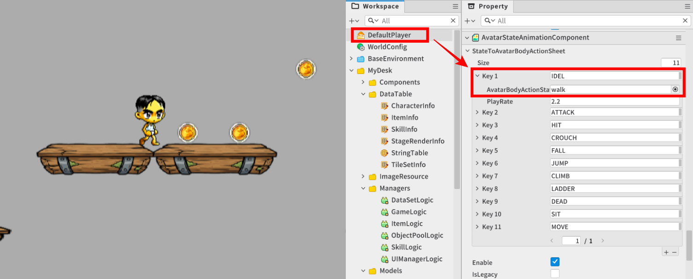
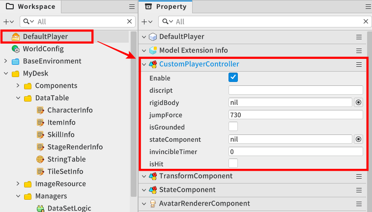
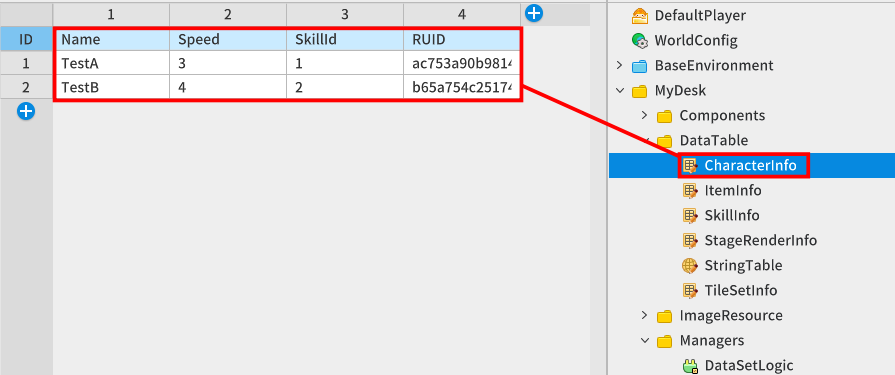
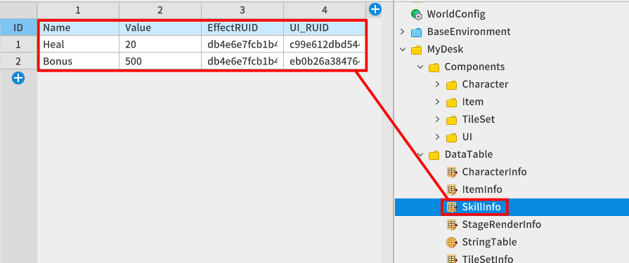
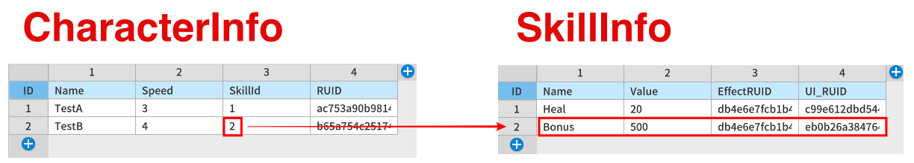
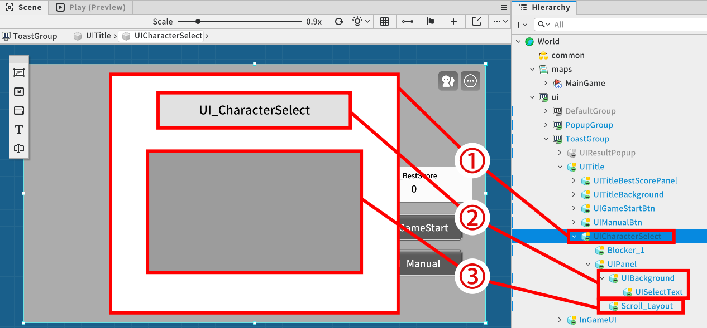
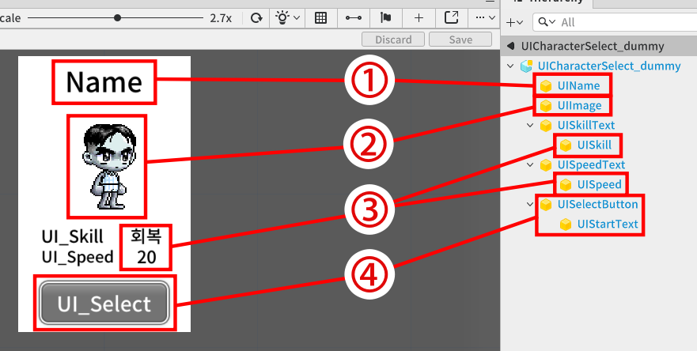
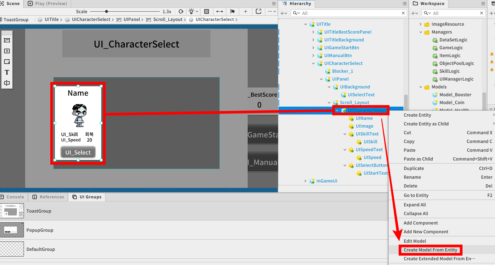
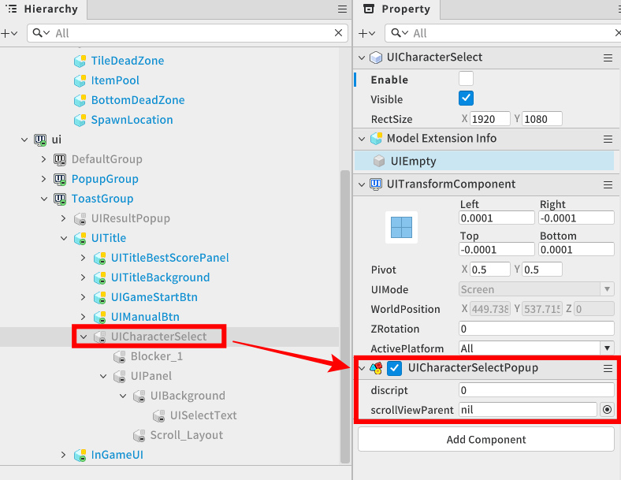
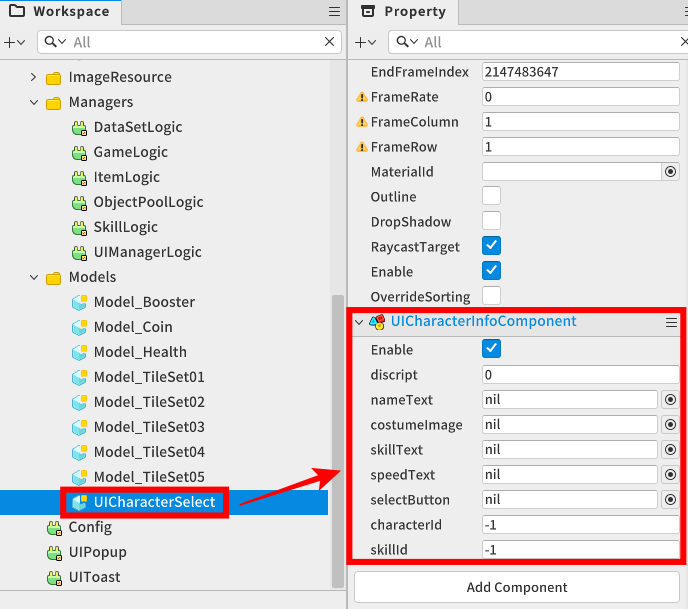

# [💡 Basic Training] Implementing Player Characters
<br>
<br>
<br>

## Video Timeline
- You can follow along by using the timeline under the training video.
- Implementing Player Characters: 00:57:50
<br>

## Learning Goals
- You can implement a jump function that detects keyboard input and applies a physical force to the character.
- Learn how to create various characters.
- Define the available skills for each character and learn how to implement their effects when using the skills.
- You can give your players an environment that allows them to select a variety of characters.
<br>

## Practical Exercises to Do After Watching the Video
- Try setting up your skills to be triggered by inputs other than the skill keys provided in the sample world.
- Try changing the force of your character's jump to change the physical appearance you want.
- Add a new character to the CharacterInfo DataSet and verify that you can play as the new character in the Character Selection window.
<br>

## Setting Character Default State
<p align = "Center">

</p>

- The game is running with the character in the sample world not actually moving, so by default, the running animation should play instead of the standing animation.
- In the AvatarStateAnimationComponent of the DefaultPlayer's component that is the character's model, change the animation that plays for the standing state (IDLE) by default to a (walk) animation.
<br>

## Controlling Character Functions

<p align = "Center">

</p>

- Create and attach a CustomPlayerController component script to control various features of the DefaultPlayer, which is the character's model, directly in code. 
<br>

## Writing a CustomPlayer Script

- Write the following code.
- The target code is based on Plain Text.

```lua
@Component
script CustomPlayerController extends Component

property string discript = "" -- The component needed to define a character's function and state.

property PhysicsRigidbodyComponent rigidBody = nil

property number jumpForce = 730 -- The strength value that's needed for a character jumping.

property boolean isGrounded = false -- The variable that checks if the character is currently on the ground.

property StateComponent stateComponent = nil

property number invincibleTimer = 0 -- The timer variable needed to control the invincibility duration after colliding with an obstacle.

property boolean isHit = false -- The variable that checks if the character is currently hit by an obstacle.

@ExecSpace("ClientOnly")
method void Init()
-- This method resets the CustomPlayerController controller.

-- Executes an internal variable reference link.
self:ConnectRefs()

-- Proceeds with the default state as MOVE.
self:ChangeState("MOVE")

end

@ExecSpace("ClientOnly")
method void ConnectRefs()
-- This method reference links the members that are internally required.

-- Links the Rigidbody component that's attached to the character.
self.rigidBody = self.Entity.PhysicsRigidbodyComponent
-- Links the State component that's attached to the character.
self.stateComponent = self.Entity.StateComponent
end

@ExecSpace("ClientOnly")
method void Jump()
-- This method executes the character's jump animation.

-- If the floor detection fails,
if self.isGrounded == false then
	-- it halts the jump execution.
	return
end

-- Sets the speed value applied on the character's Y-axis to 0 and removes the Y-axis activity.
self.rigidBody:SetLinearVelocityY(0)

-- Applies the Force value through rigidbody in the Y-axis direction.
self.rigidBody:ApplyForce(Vector2.up * self.jumpForce)

-- When not in a prone state while executing the jump logic,
if self.stateComponent.CurrentStateName ~= "CROUCH" then
	-- converts into the jump state.
	self:ChangeState("JUMP")
end

_SoundService:PlaySound("24ee4f2425924a1abd4f655e8faf2791",1)

-- Sets that the character isn't on the floor, since the jump was executed.
self.isGrounded = false
end

@ExecSpace("ClientOnly")
method void ChangeState(string state)
-- This method changes the character's state as the state that was received. (This is to control a character's animation.)

-- Parameter 1 string state: Receives the state that will be changed into string format.

-- Sets the state with the state component that was declared as a member.
self.stateComponent:ChangeState(state)

-- Trigger Collider Box Size Adjustment: This is needed to categorize the collider state for when the character is prone and when the character is standing.

-- If the state delivered from a parameter value is CROUCH,
if state == "CROUCH" then
	-- The trigger Box size of the Trigger component that's included in its own (character) entity is set to how it is in Config.	
	self.Entity.TriggerComponent.BoxSize = _Config.crouchTriggerSize
	-- Sets the offset value that indicates how far the Trigger component's trigger Box needs to be from the Pivot (base).
	self.Entity.TriggerComponent.BoxOffset = _Config.crouchTriggerOffset
	
-- If the state delivered from a parameter value is MOVE,
elseif state == "MOVE" then
	-- The trigger Box size of the Trigger component that's included in its own (character) entity is set to how it is in Config.
	self.Entity.TriggerComponent.BoxSize = _Config.standTriggerSize
	-- Sets the offset value that indicates how far the Trigger component's trigger Box needs to be from the Pivot (base).
	self.Entity.TriggerComponent.BoxOffset = _Config.standTriggerOffset
end
end

@ExecSpace("ClientOnly")
method void ContactGround()
-- This method is executed when the floor is detected.

-- /Branch 1/ If already touching the floor,
if self.isGrounded == true then
	-- nothing is executed and the method is ended.
		return
end
	
-- /Branch 2/ Upon touching the floor after previously not being on the floor,

-- changes the current state as being on the floor.
	self.isGrounded = true

-- Plays the move animation upon detecting the floor.
	self:ChangeState("MOVE")
end

@ExecSpace("ClientOnly")
method void ContactItem(Item item)
-- Proceeds with the actions that need to be executed for each item.

-- Parameter 1 Item item: Receives the Item component that was included in the item object.

-- Plays a sound effect upon obtaining an item.
_SoundService:PlaySound("ef4235b158414f5283c068bad71f403a",1)

-- If the name variable of the received item component is Coin,
if item.name == "Coin" then
	-- executes the game logic's score addition method and delivers the Value value of the received item.
	_GameLogic:AddScore(item.value)
end

-- If the name variable of the received item component is Health,
if item.name == "Health" then
	-- executes the game logic's HP addition method and delivers the Value value of the received item.
	_GameLogic:AddHP(item.value)
end

-- If the name variable of the received item component is Booster,
if item.name == "Booster" then
	-- calls the booster item usage method from item logic.
 	_ItemLogic:UseBooster()
end

-- Moves a far distance upon obtaining the item.
-- (Moves to a location where the item object position is temporarily not visible, since there was an issue with recreating from the object pool.)
item.Entity.TransformComponent.Position = Vector3.one * 100

-- Executes a method that returns the item object to the object pool.
_ObjectPoolLogic:ReturnItem(item.Entity)
end

@ExecSpace("ClientOnly")
method void ContactObstacle()
-- This method is executed upon colliding with an obstacle.

-- If there is still some invincibility time left,
if self.invincibleTimer > 0 then
	-- it ends without doing anything.
	return
end

-- Delivers the obstacle collision damage defined in Config to the game log's HP addition method.
_GameLogic:AddHP(_Config.obstacleDamage)

-- Sets the state to being hit.
self.isHit = true

-- Sets the invincibility duration timer to the default value set in Config.
self.invincibleTimer = _Config.invincibleTime

-- Plays the take hit effect.
self:PlayOnDamagedEffect()

-- Sets the avatar renderer's transparency. (To deliver the being hit state.)
self.Entity.AvatarRendererComponent:SetAlpha(0.5)
end

@ExecSpace("ClientOnly")
method void PlayOnDamagedEffect()
-- This method plays the effect that's triggered when being hit.

-- Saves the being hit effect resource ID value.
local effectRUID = "41e13add2ba746d9bbe624a31205a848"
-- Loads the map entity.
local mapEntity = _EntityService:GetEntityByPath("/maps/MainGame")
-- Sets the effect trigger point.
local position = self.Entity.TransformComponent.Position

-- Plays the effect using the effect service.
_EffectService:PlayEffect(effectRUID,mapEntity,position,0,Vector3.one * 3)
end

@ExecSpace("ClientOnly")
method void OnUpdate(number delta)
-- This method is called for each frame.


-- While being hit,
if self.isHit == true then
	-- if there is invincibility time left,
	if self.invincibleTimer > 0 then
		-- the duration of the being hit timer is reduced.
		self.invincibleTimer -= delta
	-- If there is no time left in the being hit timer,
	else
		-- changes to being hit removed state.
		self.isHit = false
		-- Resets the avatar renderer's transparency value to 1.
		self.Entity.AvatarRendererComponent:SetAlpha(1)
	end
end
end

@ExecSpace("ClientOnly")
method void ResetCharacter()
-- This method proceeds with setting the default values when restarting the game.

-- Sets the target entity's position values to absolute coordinates x = 0, y = 1.
self.Entity.TransformComponent.Position = Vector3(0,1,0)
-- Sets the Rigidbody's BodyType to Dynamic, so it can be flexible.
self.rigidBody.BodyType = BodyType.Dynamic

-- Sets the character as visible.
self.Entity.Visible = true
end

@ExecSpace("ClientOnly")
method void OnBeginPlay()
-- This method is called when the world is launched.

-- Resets the target component.
self:Init()
end

@EventSender("Service", "InputService")
handler HandleKeyDownEvent(KeyDownEvent event)
-- This method is called when the user makes a key input.

-- If the game is in the end state,
if _GameLogic.isEnd == true then
-- This method is halted.
	return
end

-- Saves the input key information.
local key = event.key

-- When the space bar is input, 
if key == KeyboardKey.Space then
	-- executes the jump animation.
	self:Jump()
end

-- When the down arrow key is input,
if key == KeyboardKey.DownArrow then
	-- sets the character state as 'CROUCH'.
	self:ChangeState("CROUCH")
end

-- When the 'K' key is input,
if key == KeyboardKey.K then
-- the character skill is used.
	_SkillLogic:UseSkill()
end


end

@EventSender("Service", "InputService")
handler HandleKeyUpEvent(KeyUpEvent event)
-- This method is called when the user's key input ends.

-- If the game is in the end state,
if _GameLogic.isEnd == true then
-- This method is halted.
	return
end

-- Saves the input key information.
local key = event.key
---------------------------------------------------------

-- When the down arrow key is no longer input,
if key == KeyboardKey.DownArrow then
	-- Crouch state is removed.
	self:ChangeState("MOVE")
end
end

@EventSender("Self")
handler HandleTriggerEnterEvent(TriggerEnterEvent event)
-- This method is called when the character's trigger box collides with another trigger.

-- If the game is in the end state,
if _GameLogic.isEnd == true then
-- This method is halted.
	return
end

-- Saves the target entity of the trigger collision.
local TriggerBodyEntity = event.TriggerBodyEntity
-- Saves the group name of the collided trigger.
local TriggerGroup = tostring(TriggerBodyEntity.TriggerComponent.CollisionGroup.Id)
---------------------------------------------------------

-- If the target trigger is the trigger of an item object,
if _Config.triggerGroup[TriggerGroup] == "Item" then
	-- the logic for when an item is detected is executed.
   self:ContactItem(TriggerBodyEntity.Item)
end

-- If the target trigger is an obstacle element object's trigger,
if _Config.triggerGroup[TriggerGroup] == "Obstacle" then
	-- the logic for when an obstacle is detected is executed.
	self:ContactObstacle()
end

-- If the target trigger is a DeadZone element object's trigger,
if _Config.triggerGroup[TriggerGroup] == "DeadZone" then
	
	-- since the condition which the current character meets the dead zone is when the character falls below the screen,
	-- the end game command logic is required.
	
	-- Sets the Rigidbody's BodyType to Static so no physics-based activities take place.
	self.rigidBody.BodyType = BodyType.Static
	-- Executes the game logic's end game method.
	_GameLogic:EndMainGame()
end
end

@EventSender("Self")
handler HandlePhysicsContactBeginEvent(PhysicsContactBeginEvent event)
-- This event is triggered when a physics collision is detected with a Physics rigid body.

-- Loads the entity of the collided rigid body.
local ContactedBodyEntity = event.ContactedBodyEntity

-- Loads the TileSet component of the parent object of the collided rigid body.
local tileSet = ContactedBodyEntity.Parent.TileSet

-- When a tile set is detected from the object that made contact,
if tileSet ~= nil then
	
	-- the Transform component of the object that made contact is loaded.
	local contactTransform = ContactedBodyEntity.TransformComponent
	-- Loads the character's Transform component.
	local playerTransform = self.Entity.TransformComponent
	
	-- If the colliding target's body object position has a Y-axis value that's higher than the character's Y-axis value,
	if contactTransform.Position.y >= playerTransform.Position.y then
		-- This method is halted.
		return
	end
	
	-- delivers that it's grounded.
	self.isGrounded = true
	-- If the current state is 'JUMP',
	if self.stateComponent.CurrentStateName == "JUMP" then
		-- converts to the 'MOVE' state.
		self:ChangeState("MOVE")
	end
end
end

end
```

### Understanding the Jump Function Execution Process
- One way to utilize jumping in a set environment is to utilize the physical functions of the PhysicsRigidbody registered to the character.
- To control the physics of the character within the CustomPlayerController component, you declare a variable of PhysicsRigidbodyComponent type and associate a component reference to it.
- To apply an upward force to an entity, utilize the ApplyForce method of the PhysicsRigidbody.
- Have the character play a jump animation to indicate that they are jumping.

```lua
Example of Implementing Character Jumping

PhysicsRigidbodyComponent rigidBody;
StateComponent state;

number jumpForce = 730
boolean isGrounded = false


void OnBeginPlay()
{
    -- Connect PhysicsRigidbodyComponent to apply the physical force.
    self.rigidBody = self.Entity.PhysicsRigidbodyComponent
    -- Connect StateComponent for the character's state transitions.
    self.state = self.Entity.StateComponent
}

void Jump()
{
    if self.isGround == false then 
        return -- If the character is not on the ground, exit without performing the jump function. 
    end

    -- At the beginning of the jump performance, the character's Y-axis velocity and force are canceled out.
    self.rigidBody:SetLinearVelocityY(0)

    -- Apply a force equal to jumpForce in the upward direction of the Vector2.up character.
    self.rigidBody:ApplyForce(Vector2.up * self.jumpForce)

    -- Ask the StateComponent to change to the Jump state to apply jump animation.
    self.state:ChangeState("Jump")

    -- Performs a jump, so the character switches state to not currently on the ground.
    self.isGround = false;
}

HandleKeyDownEvent(KeyDownEvent event)
{
    -- A method that is called when a key on the keyboard is pressed.

    -- Saves the input key information.
    local key = event.key

    -- If the key entered is the Space key
    if key == KeyboardKey.Space then
    -- Performs the Jump method.
        self:Jump()
    end
}

```
<br>

### How Character State Transitions upon Floor Detection
- The boolean isGround state variable is utilized to prevent the character from performing consecutive jumps.
- Toggle the variable to false when the character starts jumping.
- When the jump is complete and gravity has brought the character to the ground, isGrounded state variable needs to be transitioned back to true to restore the jumpable state.
- State transitions are possible through PhysicsCollider and EventHandler.

```lua
Example Code for Floor Collision State Transition

StateComponent state

void OnBeginPlay()
{
    -- Connect StateComponent for the character's state transitions.
    state = self.Entity.StateComponent
}

HandlePhysicsContactBeginEvent(PhysicsContactBeginEvent event)
{
    -- A method that is called when a collision with another collider is detected by the PhysicsCollider.

    -- Save the entity for the collider target.
    local ContactedBodyEntity = event.ContactedBodyEntity
    -- Retrieve the TileSet component from the collider target.
    local tileSet = ContactedBodyEntity.TileSet

    -- If you've checked the TileSet component (checked it's a floor tile):
    if tileSet ~= nil then
        -- Toggle the isGround state to true.
        isGround = true
        -- Switch the animation from a jumping state to a walking animation again.
        self.state.ChangeState("Move")
    end
}
```

## Creating Different Characters

### Create Information Tables per Character
<p align = "Center">

</p>

<table class="tg"><thead>
  <tr>
    <th class="tg-7btt">Target</th>
    <th class="tg-7btt">Description</th>
  </tr></thead>
<tbody>
  <tr>
    <td class="tg-lboi">Name</td>
    <td class="tg-0pky">The character name that will be given to the player.</td>
  </tr>
  <tr>
    <td class="tg-lboi">Speed</td>
    <td class="tg-0pky">This value is added to set different scrolling speeds for different characters.</td>
  </tr>
  <tr>
    <td class="tg-lboi">Skill id</td>
    <td class="tg-0pky">A skill number that is unique to each character.</td>
  </tr>
  <tr>
    <td class="tg-0lax">RUID</td>
    <td class="tg-0lax">The resource ID value that will be registered to the BodyParts of the character's registered CostumeManagerComponent.</td>
  </tr>
</tbody>
</table>

- The created CharacterInfo DataSet will store each character's information as a table using the InitCharacterInfoTable method in DataSetLogic.
<br>

## Registering Skill Data
<p align = "Center">

</p>

<table class="tg"><thead>
  <tr>
    <th class="tg-7btt">Target</th>
    <th class="tg-7btt">Description</th>
  </tr></thead>
<tbody>
  <tr>
    <td class="tg-lboi">Name</td>
    <td class="tg-0pky">The name of the skill that will be provided to the player.</td>
  </tr>
  <tr>
    <td class="tg-lboi">Value</td>
    <td class="tg-0pky">Unique value per effect for each skill.</td>
  </tr>
  <tr>
    <td class="tg-lboi">EffectRUID</td>
    <td class="tg-0pky">The effect resource ID value for each skill.</td>
  </tr>
  <tr>
    <td class="tg-0pky">UI_RUID</td>
    <td class="tg-0pky">The Sprite resource ID value that will be displayed in UI for each skill.</td>
  </tr>
</tbody>
</table>

- In the sample world, the features that a player can trigger by using specific skill keys includes additional points gain and HP recovery.
- The CharacterInfo Dataset will store each skill's information as a table using the InitSkillInfoTable method in DataSetLogic.

<br>

### Skill Link Method per Character
<p align = "Center">

</p>

- The SkillID for each character registered in the CharacterInfo DataSet refers to the respective ID number in the SkillInfo DataSet.
  - For example, if TestB character's SkillId is 2, the Bonus skill corresponding to index 2 in the SkillInfo dataset is assigned as the character's skill. 
<br>

## Skill Logic's UseSkill Operation Principles
- In the HandleKeyDownEvent method of the CustomPlayerController, UseSkill method of SkillLogic is called when inputting the skill activation key (K key).
- The CustomPlayerController clearly separates the roles so that it only takes key inputs and passes commands to SkillLogic to activate skills, but does not handle the specific skill implementation logic.
- Skill Logic activates the skill that matches the skillId number variable registered to it.
- The skillId number changes value when you select a character on the title screen.

```lua
The UseSkill Principle in Skill Logic

number skillId;

void UseSkill()
{
	local skillName = _DataSetLogic.skillInfoTable[self.skillId].Name

	if skillName == "Heal" then
	-- Define a specific sequence of actions when using the HP Recovery skill.
	elseif skillName == "Bonus" then
	-- Define a specific sequence of actions when using bonus skills.
	end 
}

```
<br>

## Writing a SkillLogic Script
- Write the following code.
- The target code is based on Plain Text.

```lua
@Logic
script SkillLogic extends Logic

property number discript = 0 -- The logic declared to execute the detailed actions when a character's unique skill is used.

property number skillId = 0 -- The variable needed to set the character's unique SkillId value.

property boolean useable = true -- The state variable that is used to save the skill availability state.

@ExecSpace("ClientOnly")
method void UseSkill()
-- This method executes the detailed actions of the currently registered (SkillId).

-- If not available when this method is called,
if self.useable == false then
	-- the method ends.
	return
end

-- Saves the current character skill name.
local skillName = _DataSetLogic.skillInfoTable[self.skillId].Name
-- Saves the unique value of the current character skill.
local skillValue = _DataSetLogic.skillInfoTable[self.skillId].Value

-- If the skill name is 'GetLife',
if skillName == "Heal" then
-- restores HP equal to the skill's unique value.
	_GameLogic:AddHP(skillValue)
	

-- If the skill name is 'GetScore',
elseif skillName == "Bonus" then
-- earns an additional score equal to the skill's unique value.
	_GameLogic:AddScore(skillValue)
end

-- Plays skill effect.
self:PlaySkillEffect()

-- Play Skill Sound Effect
_SoundService:PlaySound("56c1b5e3c7fc4abda561c1cc00813bda",1)

-- Converts the state to unavailable, since the skill was used.
self.useable = false

-- Sets the skill icon UI's renderer transparency value to be low.
_UIManagerLogic.skillRenderer.Color.a = 0.3
end

@ExecSpace("ClientOnly")
method void Reset()
-- This method resets the internal state.

-- Converts the skill to be usable.
self.useable = true
end

@ExecSpace("ClientOnly")
method void PlaySkillEffect()
-- This method is used to play skill effects.

-- Loads the skill effect RUID value that was saved to SkillInfoTable.
local effect = _DataSetLogic.skillInfoTable[self.skillId].EffectRUID

-- Plays the skill effect by attaching it to character objects using EffectService.
_EffectService:PlayEffectAttached(effect,_UserService.LocalPlayer,Vector3.zero,0,Vector3.one)
end

end
```
<br>

## Implementing Character Selection
<p align = "Center">

</p>

<table class="tg"><thead>
  <tr>
    <th class="tg-9wq8">Category</th>
    <th class="tg-nrix">Entity</th>
    <th class="tg-nrix">Description</th>
  </tr></thead>
<tbody>
  <tr>
    <td class="tg-9wq8">1</td>
    <td class="tg-cly1">UICharacterSelect</td>
    <td class="tg-cly1">The top-level parent of the character selection. Control the Enable value of the entity to make the character selection screen visible or invisible.</td>
  </tr>
  <tr>
    <td class="tg-9wq8">2</td>
    <td class="tg-cly1">UIBackground<br>UISelectText</td>
    <td class="tg-cly1">This is the section that shows the title text indicating that the popup is the character selection screen.</td>
  </tr>
  <tr>
    <td class="tg-9wq8">3</td>
    <td class="tg-cly1">Scroll_Layout</td>
    <td class="tg-cly1">This is a space that lists the 'UICharacterSelect' slots as the area where the various character windows will be displayed. When the item elements exceeds the range of this area, the view area can be controlled by dragging the mouse left and right.</td>
  </tr>
</tbody>
</table>

### Creating UI Slots to Represent Character Information
<p align = "Center">

</p>

<table class="tg"><thead>
  <tr>
    <th class="tg-9wq8">Category</th>
    <th class="tg-nrix">Entity</th>
    <th class="tg-nrix">Description</th>
  </tr></thead>
<tbody>
  <tr>
    <td class="tg-9wq8">1</td>
    <td class="tg-cly1">UIName</td>
    <td class="tg-cly1">Indicate the character name at the top of the Slot.</td>
  </tr>
  <tr>
    <td class="tg-9wq8">2</td>
    <td class="tg-cly1">UIImage</td>
    <td class="tg-cly1">Provides a visual representation of the character's appearance to the player.</td>
  </tr>
  <tr>
    <td class="tg-9wq8">3</td>
    <td class="tg-cly1">UISkill<br>UISpeed</td>
    <td class="tg-cly1">Indicates the available skills per character and the scroll speed per character.</td>
  </tr>
  <tr>
    <td class="tg-nrix">4</td>
    <td class="tg-cly1">UISelectButton</td>
    <td class="tg-cly1">If the player wants to play with a character registered to the Slot, provide a button that allows them to play the game as that character.</td>
  </tr>
</tbody>
</table>

- A UI Slot is a self-contained UI unit that holds an individual character's unique information (portrait, name, stats, etc.) in a single entity and displays it on screen.
- When listing multiple characters in a list, use this UI Item as a 'framework (module)' that is reused over and over again, replacing only the data.
<br>

### Creating Slot Item Model
<p align = "Center">

</p>

- When creating a single character slot, it is recommended to play around with the UI placement directly within the slot to get an intuitive feel for the actual UI placement or size.
- Once a single unit Slot is created, right-click the entity and select Create Model From Entity to register it as a model to reuse in Workspace.
<br>

## Registering Information per Character in Character Slot
- Generate all Slot items for all characters in advance when executing the world.
- Each slot must output all elements of the CharaterInfo DataSet and all of the character's data.
- The process for registering character information for a Slot is as follows.
  - Execute World -> Make sure to call the RegistCharacter method within the automatically called OnBeginPlay.
  - The RegistCharacter method features are as follows.

```lua
RegistCharacter Method of UICharacterSelectPopup

Entity scrollViewEntity; -- The parent entity where the Slot item should be placed.

void RegistCharacter()
{
	-- Stores the ModelID of the Slot item registered in Workspace.
	local modelId = _EntryService:GetModelIdByName("UICharacterSelect")
	-- Stored as a local variable to simplify writing code that calls the character information table.
	local characterTable = _DataSetLogic.characterInfoTable

	-- Iterates through the Character Info table a number of times corresponding to the registered count (the number of characters registered in the CharacterInfo DataSet).
	for i = 1, #characterTable, 1 do

		-- Create a single Slot item using the SpawnByModelID method of the SpawnService.
		local characterInfo = _SpawnService:SpawnByModelID(
			modelId,"characterInfoPopup",Vector3.zero,scrollViewEntity).UICharacterInfoComponent

		-- Sets the text in the UI that displays the character's name to the character name.
		characterInfo.nameText.Text = characterTable[i].Name

		-- Sets the resource ID value of the character appearance (CustomBodyEquip) pre-registered in the Slot.
		characterInfo.costumImage.CustomBodyEquip = characterTable[i].RUID

		-- Extract the SkillId number stored in the CharacterInfo DataSet.
		local skillId = tonumber(characterTable[i].SkillId)
		-- Retrieves the Skill information stored in the SkillInfo DataSet and registers the name of the skill.
		characterInfo.skillText.Text = _DataSetLogic.skillInfoTable[skillId].Name

		-- Set the text in the UI that indicates the character's scroll rate to the character's unique scroll rate.
		characterInfo.speedText.Text = characterTable[i].Speed

	end
}
```
<br>

### Creating a Character Selection Screen
<p align = "Center">

</p>

- In the top-level entity of the Character Selection window, register a component that performs the function of creating character slots when executing the world.
- When building is complete, leave the entity disabled, as the player shouldn't see the popup until they click the Start Game button.
- Write the following code.
- The target code is based on Plain Text.

```lua
@Component
script UICharacterSelectPopup extends Component

property number discript = 0 -- This component defines the function needed when displaying the character selection window pop-up.

property Entity scrollViewParent = nil

@ExecSpace("ClientOnly")
method void OnBeginPlay()
This method is called when the world starts.

Links the entity that will be the parent of the objects that were created from the model (prefab).
self.scrollViewParent = _EntityService:GetEntityByPath("/ui/ToastGroup/UITitle/UICharacterSelect/UIPanel/Scroll_Layout")

Proceeds with character information registration.
self:RegistCharacter()
end

@ExecSpace("ClientOnly")
method void RegistCharacter()
This method registers the character information from the character selection window.
This is to set the data values that are input internally when a pop-up displaying the character information is created from a model (prefab).

-- Loads the default model (prefab) element's model Id.
local modelId = _EntryService:GetModelIdByName("UICharacterSelect")
-- Loads the character information table from the data set.
local characterTable = _DataSetLogic.characterInfoTable

Executes a loop a number of times equal to the number of characters registered in the table.
for	i = 1, #characterTable, 1 do
	
	Creates a UI pop-up and saves the character info component using the spawn service.
	local characterInfo = _SpawnService:SpawnByModelId(modelId,"characterInfoPopup",Vector3.zero,self.scrollViewParent).UICharacterInfoComponent

	Loads the skillId value needed to classify the skill info table.
	local skillId = tonumber(characterTable[i].SkillId)
	Sets the character skill number that will be set inside character info.
	characterInfo.skillId = skillId
	
	Sets the character name that will be set in character info.
	characterInfo.nameText.Text = characterTable[i].Name
	Sets the costume body RUID value in character info.
	characterInfo.costumeImage.CustomBodyEquip = characterTable[i].RUID
	Sets the skill name in character info (loads skill name from the skill info table based on the saved SkillId number).
	characterInfo.skillText.Text = _DataSetLogic.skillInfoTable[skillId].Name
	Sets the speed text in character info.
	characterInfo.speedText.Text = characterTable[i].Speed
	
	Sets the character ID (index) value.
	characterInfo.characterId = i
end

end

end
```
<br>

### Creating a Character Slot
<p align = "Center">

</p>

- Create a script to trigger the function of a button placed at the bottom of the Slot that will perform the character selection function.
- Make the button's event able to call the CloseSelectPopup method.
- The CloseSelectPopup method performs the following actions.
  - Disables UI elements that make up the title screen that is visible at the start of the game.
  - Change the appearance of the character used by the player.
  - Pass the character's skill number to SkillLogic.
  - Conveys the current character's number to GameLogic and calls the game start function.
- Write the following code.
- The target code is based on Plain Text.

```lua
@Component
script UICharacterInfoComponent extends Component

property number discript = 0 -- The component needed to display each character's information in the character selection window.

property TextComponent nameText = nil

property CostumeManagerComponent costumeImage = nil

property TextComponent skillText = nil

property TextComponent speedText = nil

property ButtonComponent selectButton = nil

property number characterId = -1 -- The variable needed to classify the character index.

property number skillId = -1 -- The character's unique skill number.

@ExecSpace("ClientOnly")
method void OnBeginPlay()
This method is called when the world starts.

-- Resets the target component.
self:Init()
end

@ExecSpace("ClientOnly")
method void Init()
-- This method resets the CharacterInfo component.

-- Executes the model (prefab) child object component link.

-- Loads the text component that will enter the character name from the child object.
self.nameText = self.Entity:GetChildByName("UIName").TextComponent
-- Loads the costume component that will register the character image from the child object.
self.costumeImage = self.Entity:GetChildByName("UIImage").CostumeManagerComponent
-- Loads the text component that will input the skill name from the child object.
self.skillText = self.Entity:GetChildByName("UISkill",true).TextComponent
-- Loads the text component that will input the speed value from the child object.
self.speedText = self.Entity:GetChildByName("UISpeed",true).TextComponent
-- Loads the button component that will detect clicks from the child object.
self.selectButton = self.Entity:GetChildByName("UISelectButton").ButtonComponent

-- Registers the method (CloseSelectPopup) that will be executed when the character select button is clicked.
self.selectButton.Entity:ConnectEvent(ButtonClickEvent,self.CloseSelectPopup)

end

@ExecSpace("ClientOnly")
method void SetInfo(string name, string ruid, string skill, string speed)
-- This method is needed to set the required information and content needed for the character information window.

-- Parameter 1 string name: Receives the character name.
-- Parameter 2 sting ruid: Receives the character torso RUID value.
-- Parameter 3 string skill: Receives the character skill name.
-- Parameter 4 string speed: Receives the character scrolling speed value.

-- Sets the character name text.
self.nameText.Text = name
-- Sets the costume body part resource.
self.costumeImage.CustomBodyEquip = ruid
-- Sets the skill name text.
self.skillText.Text = skill
-- Sets the scrolling speed value text.
self.speedText.Text = speed
end

@ExecSpace("ClientOnly")
method void CloseSelectPopup()
-- This method deactivates the character selection window pop-up.

-- Loads the title panel (start button, controls, character selection window's parent) entity before the game starts.
local TitlePanel = _EntityService:GetEntityByPath("/ui/ToastGroup/UITitle")

-- Deactivates the panel object.
TitlePanel.Enable = false

-- Sets the character's costume body resource value.
_UserService.LocalPlayer.CostumeManagerComponent.CustomBodyEquip = self.costumeImage.CustomBodyEquip

-- The character that will be used in the game sets the unique skill Id.
_SkillLogic.skillId = self.skillId

-- Requests game progression with the selected character Id number to the game logic.
_GameLogic:GameStart(self.characterId)
end

end
```
<br>

## Minimum Implementation Standards
- The player character should correctly detect collisions with floor tiles, and the limiting feature should work correctly so that jumps are only performed while on the ground and not jump infinitely in the air.
- The character selection window should be built to tell GameLogic to call GameStart when a button registered to a character Slot is inputted.
<br>

## Usage and Extension Direction
- In addition to scrolling speeds for each character, add detailed stat columns to the CharacterInfo DataSet, such as Jump, Max HP, and invincibility time, to provide different play styles for different characters.
- Design and add a variety of action skills, such as 'invincible dash' to run through obstacles or allow players to grab nearby coins all at once.
- When selecting a character, go beyond swapping just a single body costume and bundle different parts data, such as hair, face, cape, and more, to make changes and advance the script.
