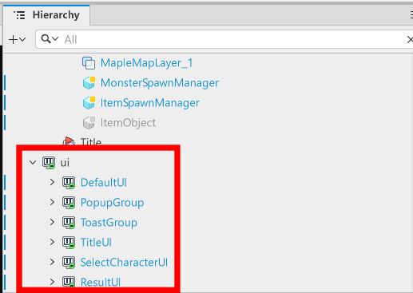
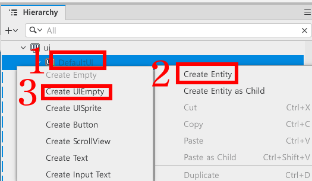
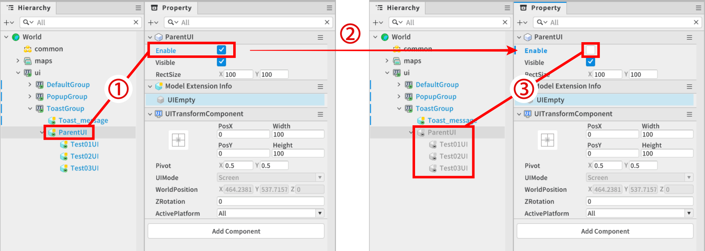
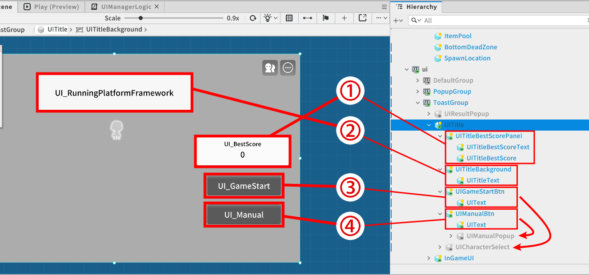
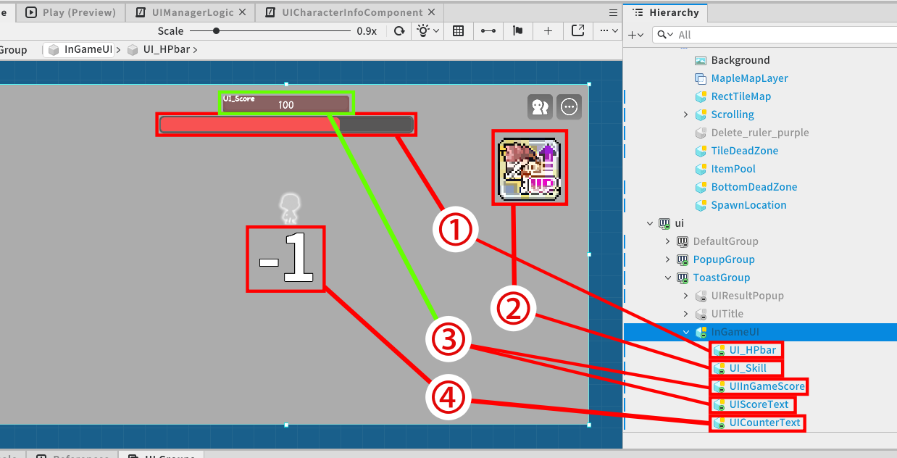
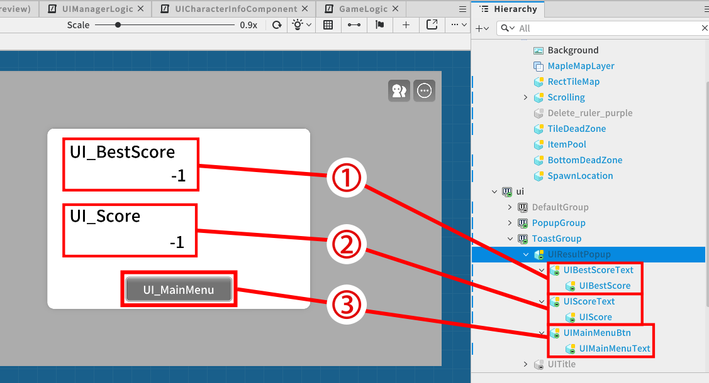

# [💡기초 학습]UI 구성하기
<br>
<br>
<br>

## 영상 타임라인
- 강의 영상 내 아래의 타임라인에서 학습할 수 있습니다.
- UI 구성하기: 01:31:40
<br>

## 학습 목표
- 개별 UI 요소들을 하나씩 제어하는 대신, 하나의 UI 엔티티 단위로 묶어 게임 상태(타이틀, 인게임, 결과)에 따라 화면을 효율적으로 전환하는 구조를 이해합니다.
- 게임 종료 시 호출되는 결과 화면(Result Popup)을 제작하고, GameLogic과 UIManagerLogic을 연동하여 현재 점수와 최고 점수를 UI 텍스트에 동기화하는 방법을 학습합니다.
<br>

## 해당 영상 시청 후 수행해 볼 내용
- 하이어라키 창에서 타이틀, 인게임, 결과 화면에 필요한 UI 요소들을 각각의 부모 엔티티(UI Group) 하위로 묶고, 최상위 엔티티의 Enable 속성을 켜고 끄며 화면이 정상적으로 전환되는지 테스트해 봅니다.
- 인게임에서 일부러 장애물에 부딪혀 게임을 종료시킨 뒤, 결과 팝업 창에 내가 방금 획득한 점수와 기존 최고 점수가 텍스트 UI에 올바르게 출력되는지 직접 확인해 봅니다.
<br>

## UI Group의 이해
<p align="center">

</p>

- 하이어라키 창의 아래를 보면, ui라는 이름으로 구성된 엔티티들을 확인할 수 있습니다.
- 해당 엔티티는 ui를 출력하기 위해 구성된 ui group입니다.
- ui group을 수정하여 출력해야 하는 ui를 변경하거나 제작할 수 있습니다.
<br>

### UI Gruop 생성하기
<p align="center">

</p>

- 에디터 상단의 UI 버튼을 클릭하여 UI 편집상태로 변경합니다.

<p align="center">

</p>

- 에디터 창 하단의 UI Groups에서 + 버튼을 클릭해 새로운 UI Group를 추가할 수 있습니다.
- 삭제해야 하는 UI Groups가 있을 경우, 삭제하려는 UI Group을 클릭한 뒤, 휴지통 버튼을 클릭해 삭제할 수 있습니다.

## 빈 UI 엔티티 제작하기
- UI에서도 기존의 엔티티를 제작하듯이 엔티티 제작이 가능합니다.
- 차이점은 빈 엔티티를 생성할 때, Create Empty가 아닌 **Create UIEmpty**를 사용한다는 차이점이 있습니다.

<p align="center">

</p>

- 하이어라키 창에서 엔티티를 추가하려는 ui group을 우클릭합니다.
- Create Entity를 클릭합니다.
- Create UIEmpty를 클릭하여 빈 UI 엔티티를 생성할 수 있습니다.
<br>

## UI 엔티티에 Component 부여하기

- UI 엔티티 역시 일반 엔티티처럼 Component를 부여하여 추가적인 기능들을 수행할 수 있습니다.
- Component를 부여하는 방법은 일반 엔티티에 Add Component를 하는 방식과 동일합니다.
- 해당 단원에서는 자주 사용되는 Component에 대해 설명드리겠습니다.
    - **SpriteGUIRendererComponent**: UI에서 이미지를 출력할 때 사용되는 Component입니다. UI에서 이미지를 출력할 땐 SpriteRendererComponent보다 해당 Component를 더 권장드립니다.
    - **TextGUIRendererComponent**: UI에서 텍스트를 출력할 때 사용되는 Component입니다.
    - **ButtonComponent**: UI가 버튼의 역할을 수행해야 하는 경우 사용되는 Component입니다.
<br>

### UI Groups를 활용한 그룹단위 제어
<p align = "Center">

</p>

1. 하나의 그룹의 가장 상위의 엔티티요소의 Enable 값이 true 상태로 체크가 되어있을땐, 자식 엔티티는 개별적으로 Enable을 true 또는 false 상태로 켜두거나 꺼둘수 있습니다.
2. 가장 상위의 엔티티요소의 Enable 상태를 false로 체크를 헤제합니다.
3. 부모 엔티티가 비활성화되면서 자동으로 자식 엔티티들 또한 비활성화되는것을 확인하실 수 있습니다.

- 엔티티 특성상 부모 엔티티를 비활성화 할 경우 자동으로 엔티티에 속한 자식 엔티티 또한 비활성화 됩니다.
- 이러한 특성을 활용하여 게임의 상황별로 화면에 표기되어야할 UI들을 각 요소 하나씩 제어하지 않고, 그룹 단위의 최상위 엔티티만 활성화, 비활성화하여 손쉽게 제어할 수 있습니다.
<br>

## Title UI Group 제작하기
<p align = "Center">

</p>

<table class="tg"><thead>
  <tr>
    <th class="tg-9wq8">항목</th>
    <th class="tg-nrix">그룹</th>
    <th class="tg-nrix">설명</th>
  </tr></thead>
<tbody>
  <tr>
    <td class="tg-9wq8">1</td>
    <td class="tg-cly1">UITitleBestScorePanel</td>
    <td class="tg-cly1">월드 시작 시 플레이어의 최고 점숫값을 나타내는 영역입니다.<br>UITitleBestScoreText - 패널 내 상단 '최고 점수'를 나타내는 텍스트입니다.<br>UITitleBestScore - 실제 최고 점숫값만 나타내는 용도의 텍스트입니다.</td>
  </tr>
  <tr>
    <td class="tg-9wq8">2</td>
    <td class="tg-cly1">UITitle</td>
    <td class="tg-cly1">월드 시작 시 게임의 제목, 타이틀을 나타내는 영역입니다.<br>UITitleText - 게임의 제목을 출력하는 텍스트입니다.</td>
  </tr>
  <tr>
    <td class="tg-9wq8">3</td>
    <td class="tg-cly1">UIGameStartBtn</td>
    <td class="tg-cly1">플레이어의 게임시작을 원할 경우 해당 버튼을 통해 게임을 진행할 수 있습니다.<br>해당 버튼은 캐릭터 선택창 팝업(UICharacterSelect)을 활성화 되도록 연결되어 있습니다.<br>UIText - '게임시작'을 나타내는 텍스트입니다.</td>
  </tr>
  <tr>
    <td class="tg-nrix">4</td>
    <td class="tg-cly1">UIManualBtn</td>
    <td class="tg-cly1">플레이어가 게임 조작방식을 학습하고 싶을때 해당 버튼을 통해 조작방식을 확인할 수 있습니다.<br>해당 버튼은 조작법 팝업(UIManualPopup)을 활성화 되도록 연결되어 있습니다.<br>UIText - '조작법'을 나타내는 텍스트입니다.</td>
  </tr>
</tbody></table>

- TitleUI 그룹의 경우 월드 시작 시 플레이어가 바로 확인할 수 있어야하므로 기본적인 Enable을 true 상태로 설정해 둡니다.
- TitleUI 그룹을 직접 활성화 하는 시점은 본격적인 게임이 종료되고, 결과창 화면에서 메인메뉴로 다시 전환되는 상태입니다.
- TitleUI 그룹을 직접 비활성화 하는 시점은 플레이어가 캐릭터를 선택하고 본격적인 게임상태로 진입할 경우입니다.

```lua
캐릭터 선택 창에서 캐릭터 Slot(UICharacterSelect)에서 캐릭터 선택 버튼을 통해 게임이 시작되는 상황
UICharacterInfoComponent의 CloseSelectPopup메서드

void CloseSelectPopup()
{
    -- 타이틀 UI 그룹의 최상위 엔티티를 저장합니다.
    local TitlePanel = _EntityService:GetEntityByPath("/ui/ToastGroup/UITitle")

    -- 최상위 엔티티를 비활성화 합니다.
    TitlePanel.Enable = false

    -- GameLogic에게 게임시작을 호출을 요청합니다.
    _GameLogic:GameStart(self.characterId)
}
```

```lua
게임 결과창에서 플레이어가 '메인메뉴'버튼을 통해 타이틀 화면으로 되돌아가는 상황
UIManagerLogic의 ReturnToMenu메서드

Entity mainTitlePanel
Entity resultPopup
Entity resultToMenuButton

void OnBeginPlay()
{
    -- 월드 실행 시, 결과 창 팝업의 '메인메뉴'버튼에 이벤트 등록합니다.
    self.resultToMenuButton:ConnectEvent(ButtonClickEvent,self.ReturnToMenu)
}

void ReturnToMenu()
{
    -- 결과창 팝업을 비활성화 합니다.
    self.resultPopup.Enable = false
    -- TitleUI 최상위 엔티티를 활성화 합니다.
    self.mainTitlePanel.Enable = true
}

```
<br>

## InGame UI Group 제작하기
<p align = "Center">

</p>

<table class="tg"><thead>
  <tr>
    <th class="tg-9wq8">항목</th>
    <th class="tg-nrix">그룹</th>
    <th class="tg-nrix">설명</th>
  </tr></thead>
<tbody>
  <tr>
    <td class="tg-9wq8">1</td>
    <td class="tg-cly1">UI_HPbar</td>
    <td class="tg-cly1">플레이어가 캐릭터의 현재 체력 상태를 확인할 수 있는 UI 입니다.</td>
  </tr>
  <tr>
    <td class="tg-9wq8">2</td>
    <td class="tg-cly1">UI_Skill</td>
    <td class="tg-cly1">캐릭터가 사용할 수 있는 스킬이 무엇인지 확인하고, 스킬이 사용되었는지 확인할 수 있는 UI 입니다.</td>
  </tr>
  <tr>
    <td class="tg-9wq8">3</td>
    <td class="tg-cly1">UI_Score</td>
    <td class="tg-cly1">UIInGameScore - 게임이 진행됨에 따라 플레이어가 습득한 실제 점수값을 나타나는 UI 입니다.<br>UIScoreText - 해당 패널 좌측 상단의 '점수' 텍스트를 나타내는 UI 입니다.</td>
  </tr>
  <tr>
    <td class="tg-nrix">4</td>
    <td class="tg-cly1">UICounterText</td>
    <td class="tg-cly1">본격적인 게임이 시작되기 직전, 플레이어에게 N초 뒤 스크롤링이 시작됨을 알립니다.</td>
  </tr>
</tbody>
</table>

- InGameUI 그룹을 직접 활성화 하는 시점은 플레이어가 캐릭터 선택을 완료하고 본격적인 게임이 시작되는 상황입니다.
- InGameUI 그룹을 직접 비활성화 하는 시점은 캐릭터가 사망한 뒤, 결과창에서 메인메뉴로 넘어가는 상황입니다.

```lua
플레이어가 캐릭터 선택을 마쳤을때, 인게임에 필요한 UI들을 호출하는 상황
UIManagerLogic의 ShowPlayerInfo메서드

SliderComponent hpSlider
Entity inGameCurrentScoreText
Entity inGameScoreText
SpriteGUIRendererComponent skillRenderer

void ShowPlayerInfo(boolean active)
{
    -- 체력 게이지를 나타내는 엔티티를 전달받는 active 상태로 전환합니다.
    self.hpSlider.Entity.Enable = active
    -- 플레이어의 점수값을 나타내는 엔티티를 전달받는 active 상태로 전환합니다.
    self.inGameCurrentScoreText.Entity.Enable = active
    -- '점수'텍스트를 표기하는 UI요소를 active 상태로 전환합니다.
    self.inGameScoreText.Enable = active
    -- 캐릭터의 스킬 정보를 나타내는 엔티티를 전달받는 active 상태로 전환합니다.
    self.skillRenderer.Entity.Enable = active
}

GameLogic의 GameStart메서드

void GameStart()
{
    _UIManagerLogic:ShowPlayerInfo(true)
    
    -- 인게임 시작전 필요한 초기화작업을 수행합니다.
}

```

```lua
게임 결과창에서 플레이어가 '메인메뉴'버튼을 통해 타이틀 화면으로 되돌아가는 상황
UIManagerLogic의 ReturnToMenu메서드

Entity mainTitlePanel

void OnBeginPlay()
{
    -- 월드 실행 시, 결과 창 팝업의 '메인메뉴'버튼에 이벤트 등록합니다.
    self.resultToMenuButton:ConnectEvent(ButtonClickEvent,self.ReturnToMenu)
}

void ReturnToMenu()
{
    -- 인게임에 필요한 UI 요소를 전부 비활성화 합니다.
    self:ShowPlayerInfo(false)
    -- TitleUI 최상위 엔티티를 활성화 합니다.
    self.mainTitlePanel.Enable = true
}
```
<br>

## Result Popup 제작하기
<p align = "Center">

</p>

<table class="tg"><thead>
  <tr>
    <th class="tg-9wq8">항목</th>
    <th class="tg-nrix">그룹</th>
    <th class="tg-nrix">설명</th>
  </tr></thead>
<tbody>
  <tr>
    <td class="tg-9wq8">1</td>
    <td class="tg-cly1">UIBestScoreText</td>
    <td class="tg-cly1">결과 창 내에 '최고 점수' 텍스트를 나타내는 UI 입니다.<br>UIBestScore : 실제 플레이어의 기존 최고 점숫값을 표기하는 텍스트 UI 입니다.</td>
  </tr>
  <tr>
    <td class="tg-9wq8">2</td>
    <td class="tg-cly1">UIScoreText</td>
    <td class="tg-cly1">결과 창 내에 '점수' 텍스트를 나타내는 UI 입니다.<br>UIScore : 실제 플레이어의 현재 종료된 시점의 점수를 표기하는 텍스트 UI 입니다.</td>
  </tr>
  <tr>
    <td class="tg-9wq8">3</td>
    <td class="tg-cly1">UIMainMenuBtn</td>
    <td class="tg-cly1">결과 창 팝업을 닫고 Title 상태로 되돌아가는 기능을 수행하는 버튼 UI 입니다.<br>UIMainMenuText : 버튼 내에 '메인 메뉴' 텍스트를 나타내는 UI 입니다.</td>
  </tr>
</tbody>
</table>

- ResultPopup 그룹을 직접 활성화 하는 시점은 인게임으로 본격적인 게임이 진행되고 이후 캐릭터가 더 이상 플레이가 불가능한 상황입니다.
- ResultPopup 그룹을 직접 비활성화 하는 시점은 결과창 내에서 '메인메뉴' 버튼을 선택해서 Title 상태로 전환되는 상황입니다.

```lua
인게임이 종료되고 결과창 팝업을 띄우는 상황
UIManagerLogic의 ShowResultPopup메서드

-- 결과창 내 등록된 실제 이전 최고 점숫값을 등록하는 Text 엔티티
Entity resultBestScoreText
-- 결과창 내 등록된 실제 현재 점숫값을 등록하는 Text 엔티티
Entity currentScoreText

void ShowResultPopup(string bestScore, string currentScore)
{
    -- 최고 점숫값 텍스트를 매개변수로 전달받은 텍스트로 변경합니다.
    self.resultBestScoreText.TextComponent.Text = bestScore

    -- 현재 점숫값 텍스트를 매개변수로 전달받은 텍스트로 변경합니다.
    self.currentScoreText.TextComponent.Text = currentScore

    -- 결과 창을 활성화 합니다.
    self.resultPopup.Enable = true;
}


캐릭터 사망 시점에서 호출되는 GameLogic의 EndMainGame메서드

number bestScore
number currentScore

void EndMainGame()
{
    -- 게임 종료시 필요한 기능 수행

    _UIManagerLogic:ShowResultPopup(tostring(self.bestScore),tostring(self.currentScore))
}
```

```lua
게임 결과창에서 플레이어가 '메인메뉴'버튼을 통해 타이틀 화면으로 되돌아가는 상황
UIManagerLogic의 ReturnToMenu메서드

Entity resultPopup
Entity mainTitlePanel

void OnBeginPlay()
{
    -- 월드 실행 시, 결과 창 팝업의 '메인메뉴'버튼에 이벤트 등록합니다.
    self.resultToMenuButton:ConnectEvent(ButtonClickEvent,self.ReturnToMenu)
}

void ReturnToMenu()
{
    -- 결과 창 팝업을 비활성화 합니다.
    self.resultPopup.Enable = false
    -- TitleUI 최상위 엔티티를 활성화 합니다.
    self.mainTitlePanel.Enable = true
}
```
<br>

## 최소 구현 기준
- TitleUI, InGameUI, ResultPopup 세 가지 상태로 전환할 수 있는 각 버튼 UI와 게임시작, 게임종료, 메인메뉴로 되돌아가는 기능이 정상적으로 동작해야 합니다.
- GameLogic에서 계산된 currentScore와 bestScore값이 각 UI 텍스트 컴포넌트에 정확하게 전달되어야 합니다.
<br>

## 응용 및 확장 방향
- ResultPopup이 나타낼 때 단순히 나타나는 것이 아니라, 크기가 커지거나 투명도가 변하며 서서히 나타나는 효과를 추가합니다.
- 버튼을 클릭할 때나 결과 창이 뜰 때 효과음을 재생하여 조작감을 높입니다.