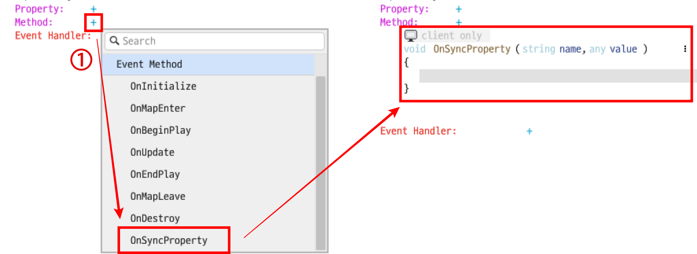

# [📖심화 학습]데이터 저장 시스템 구현하기
<br>
<br>
<br>

## 영상 타임라인
- 강의 영상 내 아래의 타임라인에서 학습할 수 있습니다.
- 데이터 저장 시스템 구현하기: 02:13:50
<br>

## 학습 목표
- DataStorageService를 활용하여 유저의 최고 점수를 서버에 저장하고, 재접속 시 이를 불러오는 방법을 이해합니다.
- 클라이언트와 서버 간의 데이터 동기화를 위해 변수의 Sync 속성을 설정하는 이유를 파악합니다.
- OnSyncProperty 이벤트를 활용하여 서버로부터 데이터를 성공적으로 불러온 시점을 정확히 파악하고, 이를 안전하게 사용하는 방법을 이해합니다.
<br>

## 해당 영상 시청 후 수행해 볼 내용
- 새로운 최고 점수값을 직접 기록한 뒤, 월드 재시작 시 정상적으로 이전 점수 정보가 불러와지는지 확인해 봅니다.
<br>

## 서버 측의 최고 점숫값 저장하기
- 매번 점수가 오를 때마다 서버와 통신하는 대신, 게임이 종료되는 시점 등 꼭 필요한 순간에만 데이터를 저장하여 서버 부하를 줄입니다.
- 서버 측에서 관리되는 BestScore 값은 게임 오버(체력 0) 시점에 현재 점수가 기존 최고 점수보다 높을 경우에만 새롭게 갱신됩니다.

```lua
서버 측에서 관리하는 BestScore값 갱신하는 방법
GameLogic에서 게임 종료시 호출되는 EndGame메서드

[Sync] number bestScore;
[None] number currentScore;

[client] -- 클라이언트 전용 메서드
void EndMainGame()
{
    -- 게임 종료시 호출되는 기능

    -- 현재 점수가 기존 최고 점수보다 높다면
    if self.currentScore > self.bestScore then
        -- 클라이언트(로컬 환경)에서 관리되는 bestScore 점수를 갱신
        self.bestScore = self.currentScore
        -- 서버 측으로도 점수 갱신을 요청
        self:UpdateScore(self.bestScore)

    end
}

[server] -- 서버 전용 메서드
void UpdateScore(number score)
{
    -- 로컬이 아닌 서버에서 관리중인 bestScore값을 갱신
    self.bestScore = score
}
```
<br>

## DataStorage로 유저 최고점숫값 저장하기
- 서버 측에서 관리되는 데이터 값이 있더라도, 이를 별도로 저장하지 않고 다시 월드에 접속할 경우 유저의 이전 데이터값은 불러올 수 없습니다.
- 유저의 데이터 또는 게임의 데이터를 저장하기 위해서는 DataStorage 서비스를 활용합니다.
- DataStorage의 기능은 HandleUserLeaveEvent, HandleUserEnterEvent 이벤트에서 활용하는 것을 권장합니다.

```lua
DataStorage를 활용한 유저 및 게임 데이터 저장
GameLogic의 SaveScore메서드

HandleUserLeaveEvent(UserLeaveEvent event)
{
    self:SaveScore(self.bestScore)
}

[server] -- 서버 전용 메서드
void SaveScore(number score)
{
    local data = _DataStorageService:GetGlobalDataStorage("MyData")
    local errorCode = data:SetAndWait("BestScore",tostring(score))
}
```
<br>

## 최고 점숫값 불러오기
- 데이터 저장과 마찬가지로, 월드에 처음 진입할 때 한 번만 데이터를 요청하여 불필요한 서버 통신을 방지합니다.
- 만약, 플레이어가 월드에 접속했을 때 이전에 기록되어 있던 최고 점숫값이 있다면 해당 점수값을 불러옵니다.
<br>

### DataStorage와 OnSyncProperty를 활용한 이전 점수값 불러오기
<p align = "Center">

</p>

1. 스크립트의 Method 탭에서 '+' 버튼 우클릭 후 OnSyncProperty를 통해 메서드를 생성할 수 있습니다.
<br>

- 유저의 데이터 또는 게임의 데이터를 불러오기 위해서는 DataStorage 서비스를 활용합니다.
- Sync로 설정된 변수는 OnSyncProperty 메서드를 통해 서버로부터 값이 동기화 완료된 시점을 정확히 감지할 수 있습니다.

```lua
DataStorage를 활용한 유저 및 게임 데이터 불러오기
GameLogic의 LoadData메서드

[Sync] number bestScore

HandleUserEnterEvent(UserEnterEvent event)
{
    self:LoadData()
}

[server] -- 서버 전용 메서드
void LoadData()
{
    -- 데이터스토리지 서비스를 활용해 'MyData'라는 데이터 스토리지를 가져옵니다.
    local data = _DataStorageService:GetGlobalDataStorage("MyData")

    -- 해당 데이터 스토리지 내에서 'BestScore' 키에 해당하는 Value 값을 가져옵니다.
    local errorCode,value = data:GetAndWait("BestScore")

    -- 임시 점수값 변수를 등록합니다.
    local tempScore

    -- 만약 저장된 데이터가 없다면
    if value == nil then
        -- 임시 점수값을 0으로 설정합니다.
        tempScore = 0
        
    -- 만약 저장된 데이터가 있다면
    else
        -- 임시 점수값을 기존 점수값으로 설정합니다.
        tempScore = tonumber(value)
    end

    -- bestScore값을 갱신합니다.
    -- Sync로 선언된 프로퍼티로써 값 변경이 일어날때,
    -- 클라이언트쪽에서도 값이 동기화되며 OnSyncProperty 메서드가 자동으로 호출됩니다.
    self.bestScore = tonumber(tempScore)
}

[client only]
void OnSyncProperty(string name, any value)
{
    -- 변수(프로퍼티)의 변경이 감지되었을 때

    -- 변경된 변수명이 "bestScore" 라면
    if name == "bestScore" then
    -- UIManagerLogic에게 메인 타이틀 화면의 최고 점수 텍스트 갱신을 요청합니다.
	_UIManagerLogic:UpdateTitleBestScore(tonumber(value))
    end
}
```
<br>

## 최소 구현 기준
- 플레이어가 게임에서 새로운 최고 점수를 달성하고 월드를 완전히 종료한 뒤 재접속했을 때, 타이틀 화면에 이전의 최고 점수가 0으로 초기화되지 않고 정상적으로 표기되어야 합니다.
- 서버로부터 점수 데이터 동기화가 완료되지 않은 시점에 UI 텍스트가 먼저 갱신되어 빈 값이나 에러가 표기되지 않도록, OnSyncProperty를 통한 시점 제어가 완벽히 동작해야 합니다.
<br>

## 응용 및 확장 방향
- bestScore뿐만 아니라 누적 재화, 캐릭터 목록, 진행한 스테이지 정보 등 다양한 데이터를 묶어 저장하는 시스템으로 확장해 볼 수 있습니다.