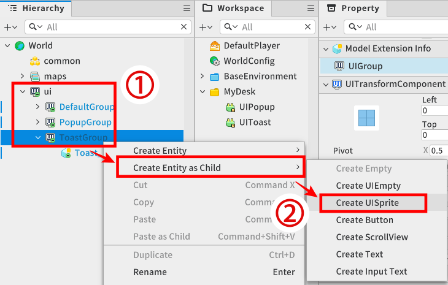
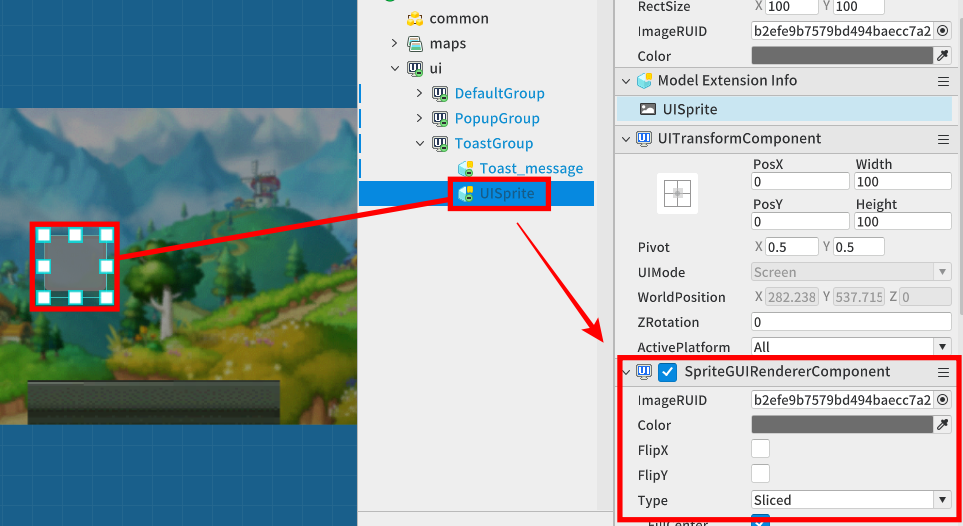
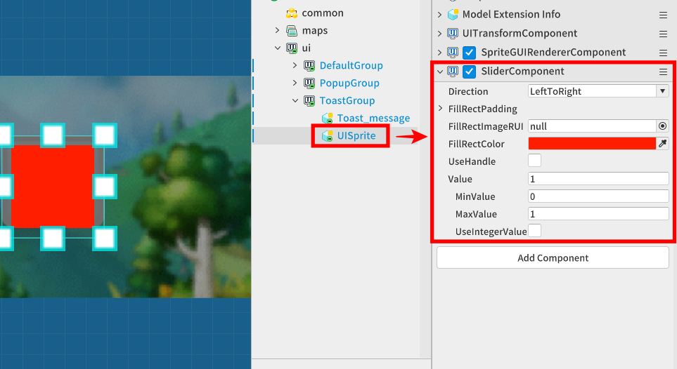

# [💡基礎學習]製作Life系統
<br>
<br>
<br>

## 影片時間軸
- 可在課程影片中以下時間點學習。
- 製作Life系統：01:20:58
<br>

## 學習目標
- 理解OnUpdate方法與delta時間的概念，並可製作不受裝置幀數影響、會隨時間穩定減少體力的邏輯。
- 學習當角色體力降至0以下時，偵測並執行Game Over處理的狀態控制流程。
- 透過在UI實體附加SliderComponent，製作可視化體力條，並掌握讓內部資料與畫面上的UI即時同步的方法。
<br>

## 觀看該影片後可嘗試執行的內容
- 變更Config Logic腳本中設定的decreaseHpValue變數值進行測試，並設定體力要多快減少。
- 在遊戲中按下播放按鈕進行測試，確認隨著時間經過，UI體力計量條是否平順下降，以及體力變成0時是否正常切換至結果視窗。
<br>

## 製作隨時間減少體力功能
<p align = "Center">

</p>

- 體力控制功能不只包含取得道具與碰撞障礙物時的即時變化，也一併製作了會隨時間經過而週期性減少體力的功能。
- 以程式碼減少體力的功能，是定義在GameLogic的AutoDecreaseHp與AddHP、SetHP方法中，各功能會在GameLogic的OnUpdate方法內執行。
- 若需要GameLogic程式碼內容，可參考「2.理解Logic」單元中附上的GameLogic腳本內容。
<br>

### 體力設定功能
- 增加或減少體力的功能，會使用GameLogic的AddHP方法。

```lua
GameLogic內的AddHP方法

number hp;

void AddHP(number addValue)
{
    -- 將參數傳入的值原樣加到目前體力上或從中扣除。
    -- 呼叫AddHP方法時，可傳入正數或負數，以靈活執行恢復與減少功能。

    self.hp += addValue;

    -- 因體力值發生變動，因此請求更新UIManagerLogic所管理的滑桿資訊。 
    _UIManagerLogic.SetHpSliderValue(self.hp)

    -- 當體力降至0以下時(滿足Game Over條件時)
    if self.hp <= 0 then
        -- 執行遊戲結束功能
    end
}

```
<br>

### 製作持續減少體力功能
- 使用每一幀呼叫的OnUpdate方法，就能製作體力緩慢減少的演出。
- 但此時若不乘上幀與幀之間的時間變化量delta，會發生依裝置幀率(FPS)不同而導致體力異常快速蒸發的致命問題。
- 若每秒幀率為60FPS，則幀間時間變化量delta值為1Sec/60FPS = 0.0167Sec。
- 若想每秒減少5點體力，則每一幀計算5 * delta值並減少即可。無論裝置以60幀還是30幀運作，經過1秒後的累積減少量都會精準為5。

```lua
GameLogic的OnUpdate方法中體力減少功能部分範例

void OnUpdate(number delta)
{
    -- Config：若是設定後不會變更的值，則會登錄在該Logic腳本中並加以管理。
    -- 更新設定好的每秒體力減少值 * delta 的體力量
    self:AddHP(delta * _Config.decreaseHpValue)
}

void AddHP(number addValue)
{
    -- 將作為參數傳入的值原樣加到體力值上或從中扣除。
    -- 使用AddHP方法時，可傳入正數值、負數值，以依照意圖執行功能。

    self.hp += addValue;

    -- 因體力值發生變動，因此請求更新UIManagerLogic所管理的滑桿資訊。 
    _UIManagerLogic.SetHpSliderValue(self.hp)

    -- 當體力值變成0時(無法再繼續進行遊戲時)
    if self.hp <= 0 then
        -- 執行遊戲結束功能
    end
}
```
<br>

## 使用SliderComponent連動體力條(UI)

### 製作體力條UI
<p align = "Center">

</p>

1. 在Ui子項目中選擇扮演畫布角色的實體。
2. 在Create Entity as Child中選擇Create UISprite，建立將作為Sprite使用的UI。
3. 該UI是作為體力條背景的Sprite圖片。
<br>

<p align = "Center">

</p>

- 在生成的實體中，在SpriteGUIRendererComponent設定作為體力條背景使用的圖片RUID與顏色。

✅如果看不到生成的UI實體，請確認是否是實體預設登錄的Component，也就是UITransformComponent的座標設定錯誤。
<br>

<p align = "Center">

</p>

- 為了能覆蓋在體力條背景上，建立SliderComponent。
- 設定FillRectColor顏色，並確認是否正常覆蓋背景圖片。
- 嘗試變更元件內部屬性的Value，確認是否正常執行計量條功能。
- 以範例世界為例，是在最大體力值為100的設定下製作。
<br>

### 透過UIManagerLogic控制體力條UI
- 作為計量條功能的實體已登錄在UIManagerLogic中。
- 若需要UIManagerLogic程式碼內容，可參考「2.理解Logic」單元附上的UIManagerLogic腳本內容。
- 連接附加了SliderComponent的實體參照，並在GameLogic中每當體力變化時呼叫此邏輯，將最新體力值即時覆寫到Slider的Value屬性。

```lua
UIManagerLogic的SetHpSliderValue方法製作範例

SliderComponent hpSlider;

void SetHpSliderValue(number value)
{   
    -- 利用math.clamp方法設定將要設定的滑桿值，使其不會低於0或超過100。
    self.hpSlider.Value = math.clamp(value, 0, 100)
}

```
<br>

## 最低製作標準
- 腳本內部的體力資料(hp)變化，必須透過UIManagerLogic傳遞，並即時同步到畫面上的SliderComponent計量條UI。
- 當體力一低於0時，必須立刻偵測到，避免體力繼續降到負值，並正常呼叫Game Over處理。
<br>

## 應用與進階應用
- 當體力降到一定數值以下(例如：20%)的危險狀態時，可以把SliderComponent的計量條顏色改成紅色閃爍，藉此提供玩家視覺上的緊張感與警告回饋。
