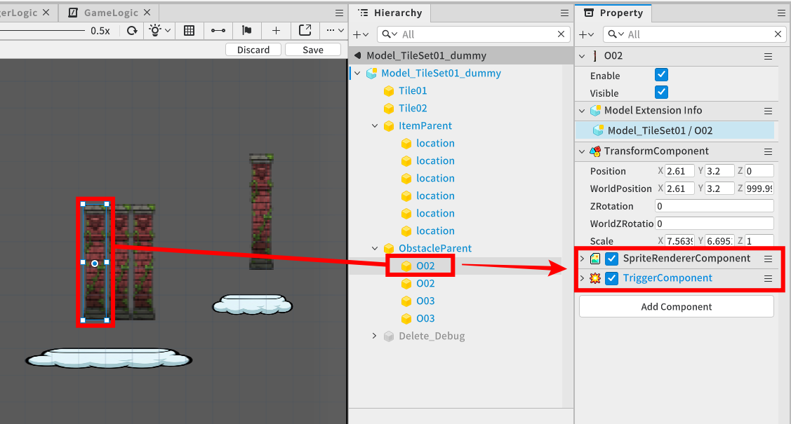
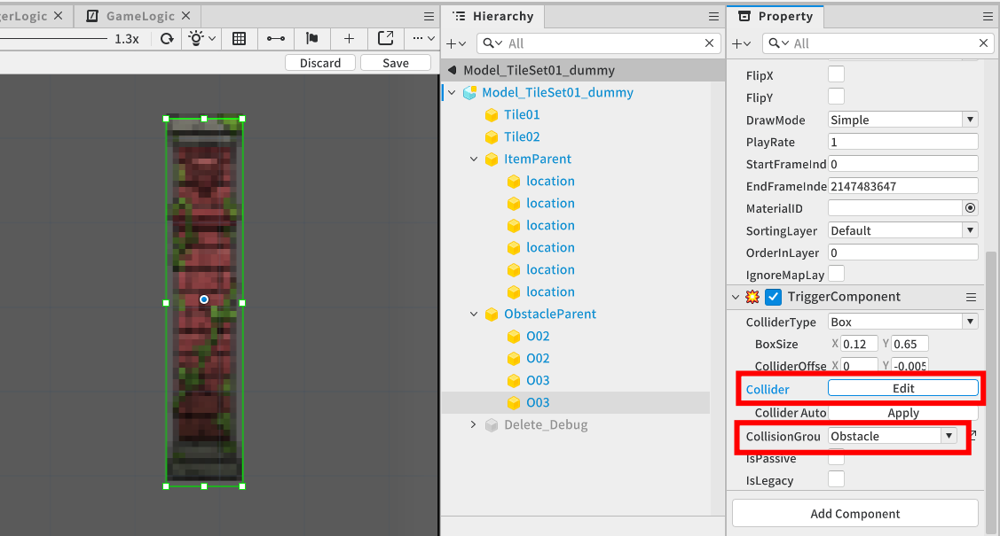
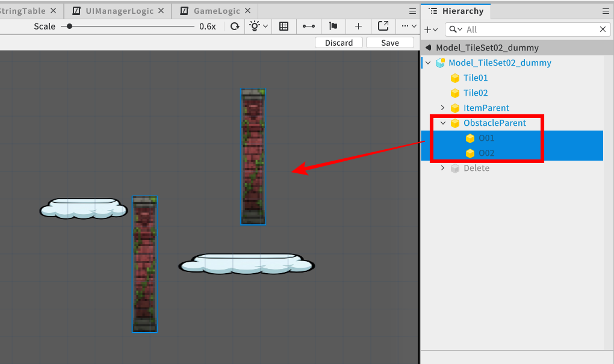
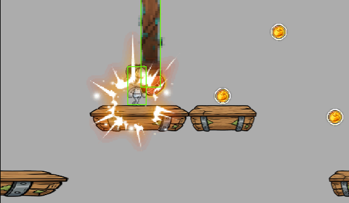
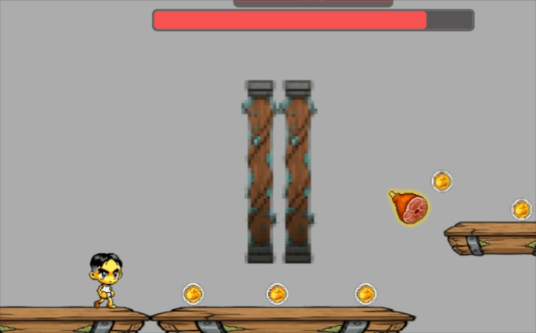

# [📖進階學習]製作障礙物物件
<br>
<br>
<br>

## 影片時間軸
- 可在課程影片中以下時間點學習。
- 製作障礙物物件：01:46:25
<br>

## 學習目標
- 理解預先在圖塊集內配置障礙物，並在遊戲進行時依機率啟用，以有效率管理資源的方式。
- 可製作在偵測障礙物碰撞時減少角色體力，並讓角色進入一段時間無敵狀態的功能。
<br>

## 觀看該影片後可嘗試執行的內容
- 可將障礙物實體配置為圖塊集的子實體，並確認當圖塊移動時，障礙物也會在不需額外程式碼的情況下正常一起移動。
- 測試角色與障礙物碰撞時體力是否減少，以及在設定的無敵時間內是否不會受到額外傷害。
<br>

## 製作障礙物
<p align = "Center">

</p>

- 障礙物實體所需元件為SpriteRendererComponent、TriggerComponent。
- SpriteComponent是用來顯示障礙物外型。
- TriggerComponent是用來偵測與角色的碰撞，並用來避免角色被阻擋、推開等實際物理碰撞發生。
<br>

### 設定TriggerComponent
<p align = "Center">

</p>

- 設定登錄在障礙物實體上的TriggerComponent之Collider範圍。
- 在CollisionGroup中新增新的碰撞群組「Obstacle」，並設定矩陣，讓他只偵測到與「Player」的碰撞。
- 可藉由擴大或縮小Collider範圍來調整遊戲難度。
<br>

## 障礙物配置方式
<p align = "Center">

</p>

-因為難以透過程式碼控制障礙物位置，所以會採用事先配置障礙物實體的方式製作。
- 會一邊測試玩家是否能閃避障礙物，一邊配置與修改。
- 為了讓障礙物實體管理更順暢，會先準備障礙物的父實體。
<br>

### 隨機配置障礙物
- 如果每個圖塊都固定配置準備好的障礙物，遊戲會變得單調，因此會使用亂數(Random)功能，製作成讓障礙物以不規則樣式出現。
- 將預先配置好的障礙物隨機配置的功能，會在登錄在地板圖塊集的TileSet元件腳本中，在圖塊集啟用時進行。
- 隨機配置障礙物功能可依下列程式碼處理。

```lua
TileSet腳本中的SpawnObstacle方法

-- 這是障礙物實體們的父實體。
Entity obstacleParent

void SpawnObstacle()
{
    -- 確認圖塊集內預先安裝的障礙物物件數量。
    -- 確認存放obstacle的父實體之子實體(障礙物實體)數量。
    local spawnLocationCount = self.obstacleParent.Children.Count

    -- 巡覽obstacleParent物件的子物件時
    for index , child in pairs(self.obstacleParent.Children) do
        
        -- 產生0到1之間的隨機數字。(製作意圖：若為0則配置障礙物O，若為1則配置障礙物X，機率50%)
        local randomNumber = math.random(0,1)
        
        -- /分支1/ 若數字為0
        if randomNumber == 0 then
            -- 啟用障礙物物件。
            child.Enable = true
            -- 覆蓋為符合階段編號的資源圖片。
            child.SpriteRendererComponent.SpriteRUID = _DataSetLogic.stageRenderInfoTable[_GameLogic.currentStage].ObstacleRUID
            
        
        -- /分支2/ 若數字不為0
        else
            -- 停用障礙物物件。
            child.Enable = false
        end	
    end
}

```

## 障礙物受擊處理
<p align = "Center">

</p>

- 若角色的TriggerComponent與障礙物的TriggerComponent皆已正常登錄，則可使用彼此之間的Trigger事件。
- 在為了直接控制角色功能與動作而製作的CustomPlayer腳本中，使用HandleTriggerEnterEvent事件方法。
- 若需要CustomPlayer程式碼內容，可參考「6.製作玩家角色」單元附上的CustomPlayer腳本內容。
- 碰撞處理功能可依下列程式碼處理。

```lua
使用CustomPlayer事件處理器的碰撞處理

HandleTriggerEnterEvent(TriggerEnterEvent event)
{
    -- 儲存碰撞對象的實體資訊。
    local TriggerBodyEntity = event.TriggerBodyEntity

    -- 取出目標實體在CollisionGroup中設定的碰撞體群組ID編號。
    local TriggerGroup = tostring(TriggerBodyEntity.TriggerComponent.CollisionGroup.Id)

    - -- 若該碰撞體的群組名稱與「Obstacle」相同
    if _Config.triggerGroup[TriggerGroup] == "Obstacle" then
        -- 則執行碰撞判定處理。
        self:ContactObstacle()
    end
}

void ContactObstacle()
{
    -- 要求GameLogic依照Config設定的障礙物受擊傷害值來減少體力。
    _GameLogic:AddHP(_Config.obstacleDamage)
}

```
<br>

## 新增角色無敵功能
<p align = "Center">

</p>

- 若未給予一定的無敵時間，而是以HandleTriggerStayEvent事件方法製作障礙物受擊處理，則可能會每一幀都受到傷害，導致體力瞬間歸零。
- 透過在撞到障礙物後短時間內阻擋額外傷害，可提供玩家認知狀況並重新調整動作的緩衝時間。
- 一定時間內無視受擊功能可依下列程式碼處理。

```lua
使用CustomPlayer的invincibleTimer

-- 宣告暫時無敵計時器變數。
number invincibleTimer
-- 宣告表示受擊狀態的變數。
boolean isHit

void ContactObstacle()
{
    -- 若暫時無敵計時器變數值大於0(暫時無敵計時器運作中的狀況)
    if self.invincibleTimer > 0 then
    -- 則不執行因障礙物造成的受擊處理並結束方法。
        return
    end

    -- 若上述條件式未被執行(暫時無敵計時器未運作的狀況)

    -- 則減少體力。
    _GameLogic:AddHP(_Config.obstacleDamage)
    
    -- 將受擊狀態切換為true。
    self.isHit = true;

    -- 為了讓玩家知道自己處於無敵狀態，將角色外型的alpha值減半，設為半透明狀態。
    self.Entity.AvatarRendererComponent:SetAlpha(0.5)

    -- 重新設定讓暫時無敵計時器可開始運作的無敵時間值。
    self.invincibleTimer = _Config.invincibleTime
}

void OnUpdate(number delta)
{
    -- 使用isHit值，避免在非isHit狀況下執行下方程式碼。
    if self.isHit == true then

        -- 若暫時無敵計時器值大於0，
        if self.invincibleTimer > 0 then
        -- 則將計時器值依delta值持續減少。 
            self.invincibleTimer -= delta
        
        -- 若暫時無敵計時器已無剩餘持續時間，
        else
        -- 則為了讓玩家知道無敵狀態結束，將角色外型的alpha值恢復為原始值(1)，設為不透明狀態。
            self.Entity.AvatarRendererComponent:SetAlpha(1);
        end
    end
}

```

## 最低製作標準
- 障礙物實體必須與地板圖塊同樣移動。
- 當玩家角色與障礙物碰撞時，必須發生受擊判定，且角色不能因障礙物而被往後推。
- 因障礙物受擊時，暫時無敵功能必須啟用，且在計時器運作期間內不得受到傷害。
<br>

## 應用與進階應用
- 除了固定外型的障礙物外，也可新增帶有原地上下突起之動態動畫的主動型障礙物。
- 可依遊戲進行度(時間流逝)提高或改變障礙物生成機率，以調整遊戲難度。