# [💡 Basic Training] Composing the World Environment
 
 
 

## Video Timeline
- You can follow along by using the timeline under the training video.
- Implementing a World Environment: 00:02:42

 

## Learning Goals

- Learn about the traits of the RectTileMap in MapleStory Worlds.
- Learn how to place Tiles in a RectTileMap.
- Learn about the KinematicbodyComponent's Property composition and learn what role it serves.

 

## Practical Exercises to Do After Watching the Video

- Place Tiles in RectTileMap to make up the map where gameplay will take place.
- Configure the map design to restrict player movement by placing non-movable tiles or obstacles.
- Adjust the KinematicbodyComponent's Properties to configure the sense of control to match the nature of the world you are creating.

 

---

## What is a RectTileMap?

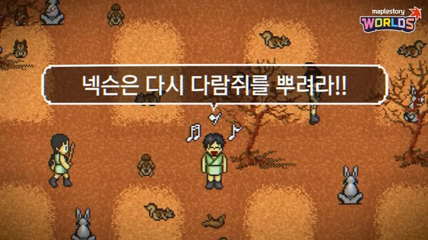

> The Kingdom of the Winds is a typical top-down view game.

- RectTileMap is the map format provided by MapleStory Worlds, and it is an effective map method for creating games with a top-down view.
- To construct a map, place Tiles in a square shape to form a single map.
- It requires a TileSet, a collection of Tiles with different designs, which can be utilized to place tiles on a map.
- You can use a Tile image with any design you like.

 

## One World, Many Maps

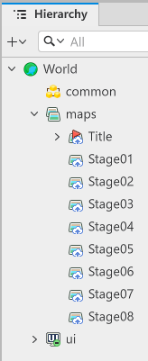

- Create and use multiple maps in a single world.
- Use any map format for each map, and each map can use a different format.

 

### Add Map

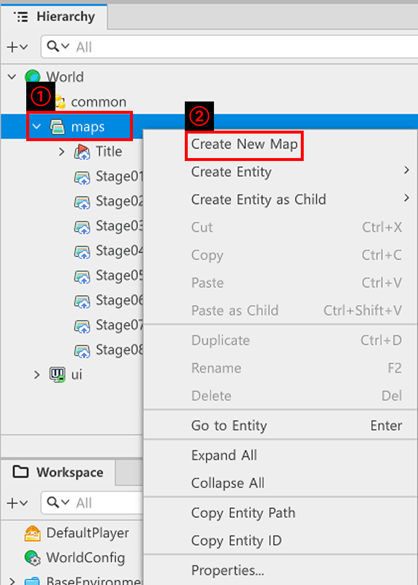

- Right-click maps in the Hierarchy window.
- Click "Create New Map" in the menu to create a new map.

 

#### 💬 Selecting a Different Map as the Starting Map at World Start

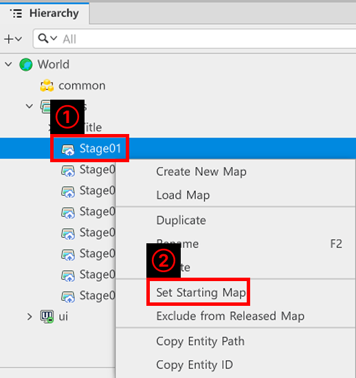

- Right-click the map you want to change to the starting map.
- From the menu, you can press Set Starting Map to set a specific map as what is displayed at world startup.
- Set a starting map to designate a map to display titles, a tutorial map, and more.

 

### Changing Map Formats

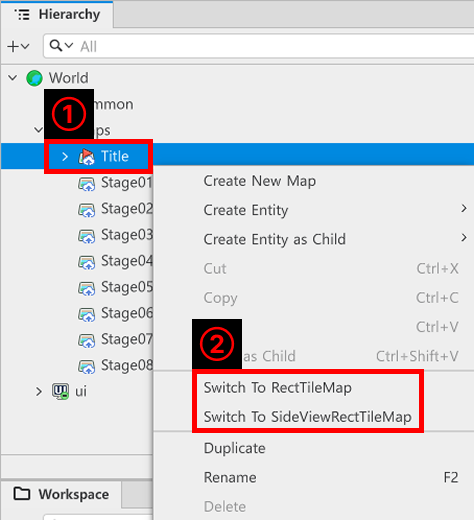

- Right-click the map you are currently editing.
- Change the map format by clicking Switch To RectTileMap or Switch To SideViewRectTileMap in the generated menu.
    - ⚠️ You can't change this to the format of the map you are editing, so a button to switch to a map that is identical to your own will not appear in the menu.
    - Example: The Switch To TileMap menu is not displayed if the map currently being edited is in TileMap format.

<table class="tg"><thead>
  <tr>
    <th class="tg-wp8o">Number</th>
    <th class="tg-wp8o">Name</th>
    <th class="tg-wp8o">Description</th>
  </tr></thead>
<tbody>
  <tr>
    <td class="tg-wp8o">1</td>
    <td class="tg-73oq">Switch To TileMap</td>
    <td class="tg-73oq">Switch the current map method to TileMap.</td>
  </tr>
  <tr>
    <td class="tg-wp8o">2</td>
    <td class="tg-0a7q">Switch To RectTileMap</td>
    <td class="tg-0a7q">Switch the current map method to RectTileMap.</td>
  </tr>
  <tr>
    <td class="tg-wp8o">3</td>
    <td class="tg-0a7q">Switch To SideViewRectTileMap</td>
    <td class="tg-0a7q">Switch the current map method to SideViewRectTileMap.</td>
  </tr>
</tbody>
</table>

 

## Configure RectTileMap

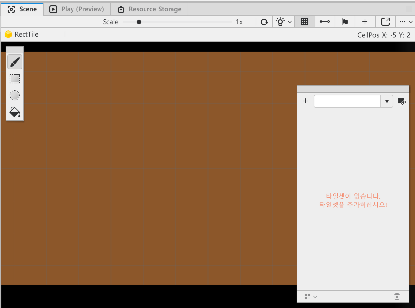

- To construct a Map from RectTileMap, you need to place Tiles.
- You can place Tiles in Scene to act as platforms to help players move around the map.
- To place Tiles, you need to create a bundle of Tiles called a TileSet.

 

### Create and Place TileSet

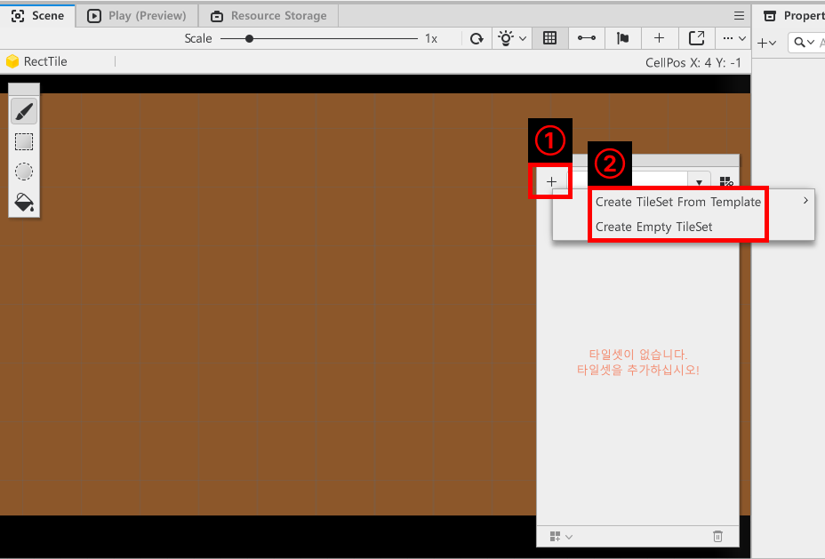

- The Scene screen for maps with a map format of RectTileMap has a TileSet editing UI.
- Click the + button in the Edit TileSet UI and build your TileSet the way you want to build it.
    - Create TileSet from Template**: Create a TileSet made from resources provided by MapleStory Worlds.
    - Create Empty TileSet: You can create your own TileSet by creating an empty TileSet with no tiles and then adding any images you want.

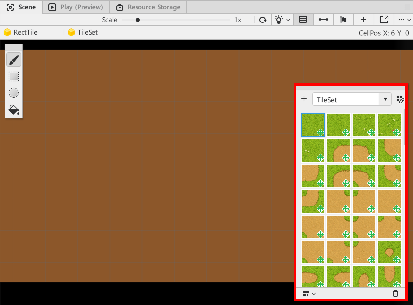

 

- If the TileSet was created successfully, the Edit TileSet UI will display the components of the TileSet.
- You can click on the desired Tiles and place them in the Scene screen to form a map.

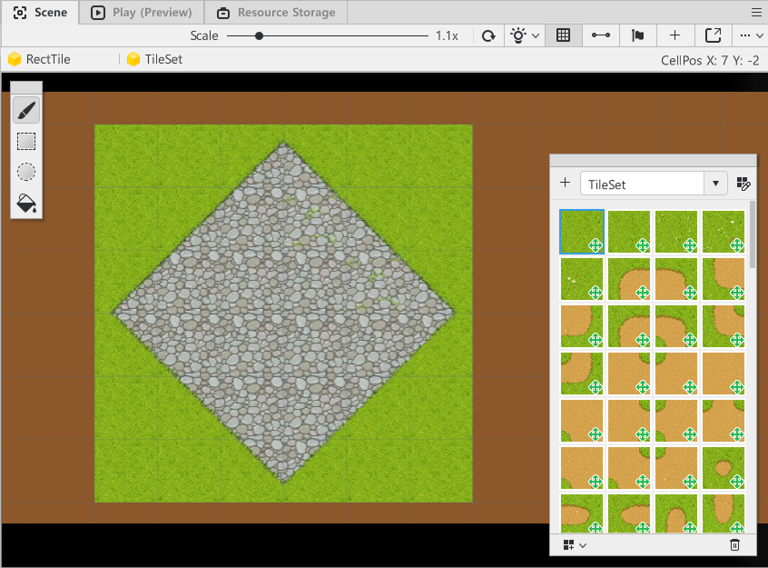

 

> The image is an example of a Tile placement.

- Complete the placement of Tiles to create a map that players can move around.

#### Place a Specific Tile as a Non-Movable Tile

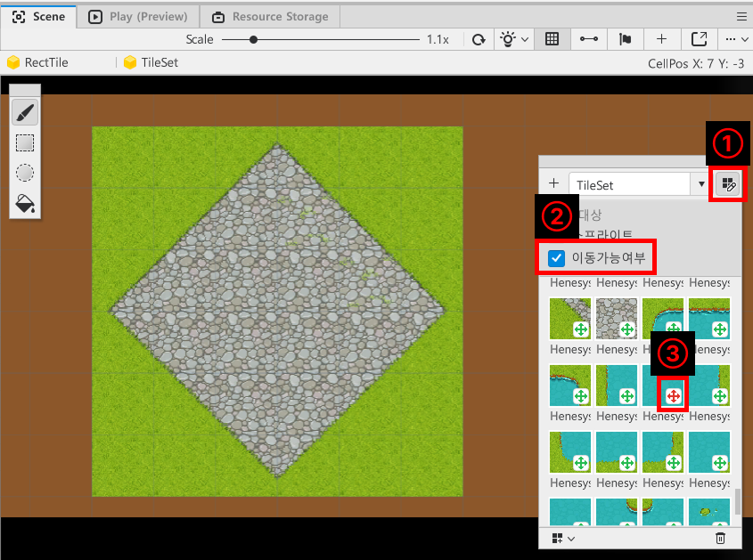

 

- In the Edit TileSet UI, click the Edit button.
- In the Edit Target menu, click Movability.
- Click the **green cross UI** on the Tile whose property you want to change to Unmovable and change it to a **red cross UI**.
- You can create unmovable zones by placing altered Tiles.

 

- Players cannot traverse Unmovable Tiles.
- Players can traverse Normal Tiles like a platform.
- Players can't move to areas where no Tiles have been placed.

## Use bodyComponent to move the character to the Map

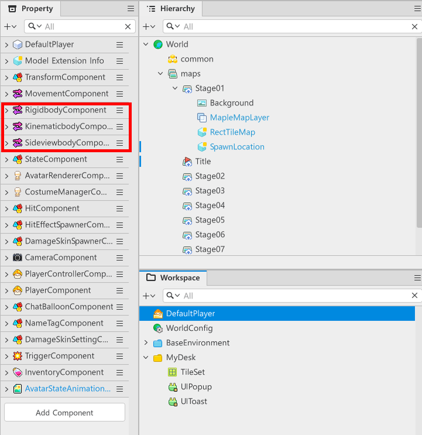

 

- In the Workspace, press DefaultPlayer, which manages the player's character.
- If you look in the Property window, you can see that there are three bodyComponents.

<table class="tg"><thead>
  <tr>
    <th class="tg-wp8o">Number</th>
    <th class="tg-wp8o">Name</th>
    <th class="tg-wp8o">Description</th>
  </tr></thead>
<tbody>
  <tr>
    <td class="tg-wp8o">1</td>
    <td class="tg-73oq">RigidbodyComponent</td>
    <td class="tg-73oq">This is a bodyComponent that can interact with a Tilemap map.</td>
  </tr>
  <tr>
    <td class="tg-wp8o">2</td>
    <td class="tg-0a7q">KinematicbodyComponent</td>
    <td class="tg-0a7q">This is a bodyComponent that can interact with a RectTileMap map.</td>
  </tr>
  <tr>
    <td class="tg-wp8o">3</td>
    <td class="tg-0a7q">SideviewbodyComponent</td>
    <td class="tg-0a7q">This is a bodyComponent that can interact with the SideviewRectTileMap.</td>
  </tr>
</tbody>
</table>

- If a corresponding bodyComponent does not exist for each map, the character may not be able to interact with the map and will become frozen in place.
- Therefore, you need to make sure that the bodyComponent that corresponds to the map's method you want to use exists normally.

 

### Learning About KinematicbodyComponent

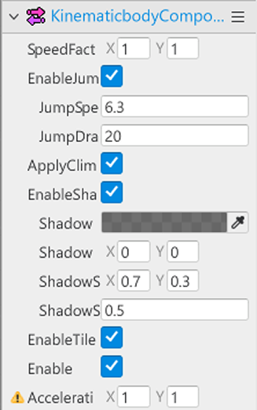

- The KinematicbodyComponent makes it possible for the entity with that Component to interact with the Tiles in the RectTileMap.
- By adjusting the Property values of the KinematicbodyComponent, you can set the speed, jump availability, jump speed, the acceleration of gravity, shadows, and more.

<table class="tg"><thead>
  <tr>
    <th class="tg-xwyw">Number</th>
    <th class="tg-xwyw">Name</th>
    <th class="tg-xwyw">Description</th>
  </tr></thead>
<tbody>
  <tr>
    <td class="tg-xwyw">1</td>
    <td class="tg-0a7q">SpeedFactor</td>
    <td class="tg-0a7q">You can adjust the speed when moving the X and Y axes.</td>
  </tr>
  <tr>
    <td class="tg-xwyw">2</td>
    <td class="tg-0a7q">EnableJump</td>
    <td class="tg-0a7q">Toggles whether the RectTileMap should be made jumpable.</td>
  </tr>
  <tr>
    <td class="tg-xwyw">3</td>
    <td class="tg-0a7q">JumpSpeed</td>
    <td class="tg-0a7q">You can adjust the speed at which the jump is performed: larger values will jump faster and higher.</td>
  </tr>
  <tr>
    <td class="tg-9wq8">4</td>
    <td class="tg-lboi">JumpDrag</td>
    <td class="tg-lboi">중력의 힘을 설정하는 값입니다. 값이 클 수록 빠르게 지상으로 내려옵니다. 값이 작을수록 공중에서 지상으로 내려오는 속도가 느려집니다.</td>
  </tr>
  <tr>
    <td class="tg-9wq8">5</td>
    <td class="tg-lboi">ApplyClimbableRotation</td>
    <td class="tg-lboi">배치된 사다리, 로프의 회전에 맞춰 플레이어 캐릭터를 회전시킬 것인지 설정하는 값입니다. 값이 해제되어 있을 경우 사다리, 로프의 회전 여부와 관계없이 캐릭터가 항상 수직으로 있습니다.</td>
  </tr>
  <tr>
    <td class="tg-9wq8">6</td>
    <td class="tg-lboi">EnableShadow</td>
    <td class="tg-lboi">This is the value that determines whether shadows are used.</td>
  </tr>
  <tr>
    <td class="tg-9wq8">7</td>
    <td class="tg-lboi">ShadowColor</td>
    <td class="tg-lboi">This adjusts the color of the shadow.</td>
  </tr>
  <tr>
    <td class="tg-9wq8">8</td>
    <td class="tg-lboi">ShadowOffset</td>
    <td class="tg-lboi">This specifies where the shadow will appear.</td>
  </tr>
  <tr>
    <td class="tg-9wq8">9</td>
    <td class="tg-lboi">ShadowSize</td>
    <td class="tg-lboi">This adjusts the size of the shadow.</td>
  </tr>
  <tr>
    <td class="tg-nrix">10</td>
    <td class="tg-cly1">ShadowScalingRatio</td>
    <td class="tg-cly1">This value controls how much the player character's shadow shrinks when they jump.</td>
  </tr>
  <tr>
    <td class="tg-nrix">11</td>
    <td class="tg-cly1">EnableTileCollision</td>
    <td class="tg-cly1">Tile의 충돌 성질을 검사하는 값입니다, 해당 값이 해제되어 있을 경우 이동 불가능한 타일을 무시하고 이동할 수 있습니다.</td>
  </tr>
</tbody></table>

---

## Minimum Implementation Standards
- Configure the map on which player characters perform combat.
- Adjust the KinematicbodyComponent to change the player's jump availability, shadow settings, and other values to suit the intent of the world you are creating.

 

## Usage and Extension Direction
- Create TileSets using your own resources in addition to the TileSets provided by MapleStory Worlds.
- Organize your map using the placement of TileSets, the placement of entities that decorate your map, and more.