# [💡 Basic Training] Implementing a Player's Attack
<br>
<br>
<br>

## Video Timeline
- You can follow along by using the timeline under the training video.
- Implementing the player's attack: 00:01:29

<br>

## Learning Goals
- Learn how to set up a Component that can manage the player's weapons.
- Learn how to utilize the TriggerComponent and CollisionService for each weapon.
- Understand the difference between TriggerComponent and CollisionService and learn how to use them.

<br>

## Practical Exercises to Do After Watching the Video
- Modify internal logic to have the projectile, Dart, target the closest enemy.
- Create your own weapons in addition to those provided by the sample world.

<br>

---

## Implementing Attack Features
<p align="center">

</p>

> Gameplay image of Vampire Survival, created by poncle.

- In order for players to survive enemies, they must kill the enemies.
- In order to defeat enemies, players need a means of dealing damage to them.
- In this lesson, learn how the attack feature is implemented and how to produce it.
- Personally undertake the **Application and Extension Directions** to create a world with more depth.

<br>

### Collision Detection
- There are several ways to determine if a particular entity is in a particular scope.
- In the sample world, the Weapon was created using the TriggerComponent's Collider and a CollisionService.

<br>

#### TriggerComponent VS CollisionService

<p align="center">
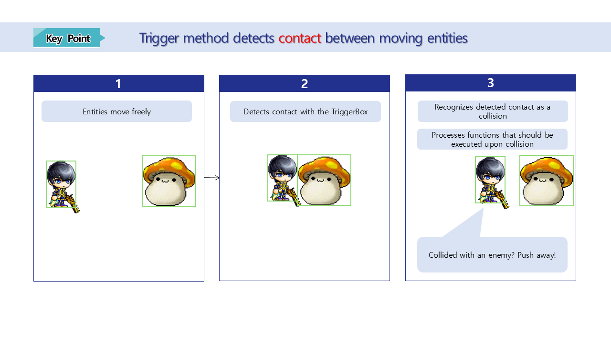
</p>

- The way TriggerComponent is utilized happens while the entities are present in the map.
- Determines whether Colliders are touching or overlapping based on the Collider scope of the TriggerComponent assigned to each entity.
- If the Collider touches or overlaps, it determines that the two entities have collided.
- The **Weapon_Dart** is used by utilizing this feature.

<br>

<p aling="center">
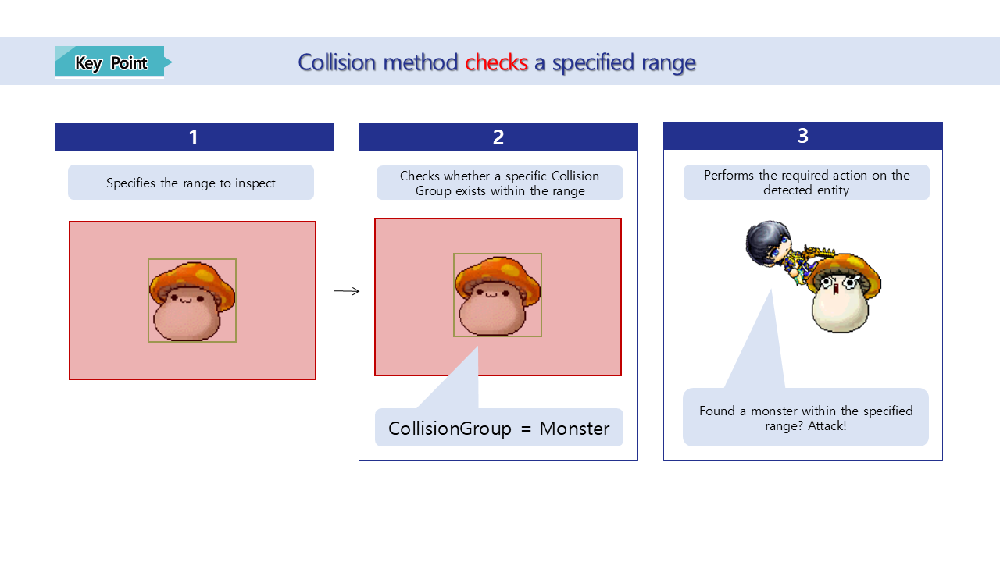
</p>

- The way CollisionService is utilized is executed through code.
- When you specify a location and a range via the CollisionService, it checks to see if a CollisionGroup specific to that range exists.
- If there are specific CollisionGroups in the specified scope, it determines that they are in conflict and returns the colliding CollisionGroups.
- **Weapon_Sword** and **Weapon_Thunder** utilize this feature to attack enemies within a certain range.

<br>

### Creating Attack Entities
<p align="center">
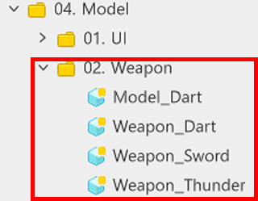
</p>

- There are three types of weapons created in the sample world.
<style type="text/css">
.tg  {border-collapse:collapse;border-spacing:0;}
.tg td{border-color:black;border-style:solid;border-width:1px;font-family:Arial, sans-serif;font-size:14px;
  overflow:hidden;padding:10px 5px;word-break:normal;}
.tg th{border-color:black;border-style:solid;border-width:1px;font-family:Arial, sans-serif;font-size:14px;
  font-weight:normal;overflow:hidden;padding:10px 5px;word-break:normal;}
.tg .tg-xwyw{border-color:currentcolor;text-align:center;vertical-align:middle}
.tg .tg-0a7q{border-color:currentcolor;text-align:left;vertical-align:middle}
</style>
<table class="tg"><thead>
  <tr>
    <th class="tg-xwyw">Name</th>
    <th class="tg-xwyw">Description</th>
  </tr></thead>
<tbody>
  <tr>
    <td class="tg-0a7q">Weapon_Sword</td>
    <td class="tg-0a7q">This weapon performs a short-range attack in the direction the player is facing.</td>
  </tr>
  <tr>
    <td class="tg-0a7q">Weapon_Thunder</td>
    <td class="tg-0a7q">This weapon attacks enemies at random locations, centered on the player within a certain range.</td>
  </tr>
  <tr>
    <td class="tg-0a7q">Weapon_Dart</td>
    <td class="tg-0a7q">This weapon targets one enemy within a certain range relative to the player by hurling Dart entities.</td>
  </tr>
</tbody>
</table>

- The **Weapon_weaponname** Models calculate their own cooldowns and perform their own attack logic once the attack cooldown is complete.
- For **Weapon_Dart**, it commands a **Model_Dart** for throwing entities to move in the specified direction.

<br>

#### Preparing Entities

<p align="center">
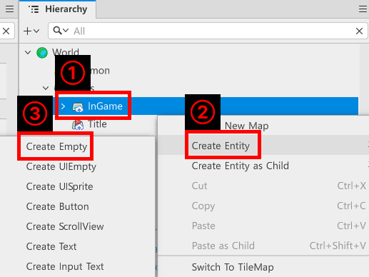
</p>

- Right-click on Hierarchy, maps, and the currently-edited map.
- Create a total of 3 entities in advance via **Create Entity**, **Create Empty**.
    - **Weapon_Sword**: An entity for implementing a Warrior character's close-range attack.
    - **Weapon_Thunder**: An entity for implementing a randomly-located area of effect attack from a Magician character.
    - **Weapon_Dart**: An entity for implementing ranged attacks for Thief characters.

<br>

#### Creating Weapon_Sword

<p align="center">
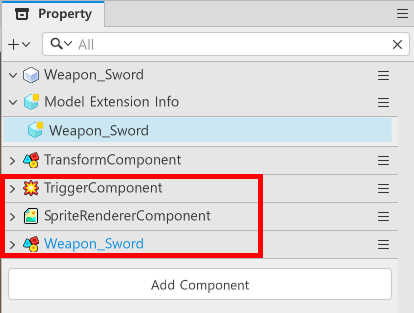
</p>

- The **Weapon_Sword** entity has the following components.
    - **TriggerComponent**: A Component for visually using the weapon's range.
    - **SpriteRendererComponent**: A Component for checking the effect and its actual scope. During development, only the effect's location is used, and you just toggle the **Enable** value to **false** before building it into the Model.
    - **Weapon_Sword**: Component for managing **Weapon_Sword** entities.

<p align="center">
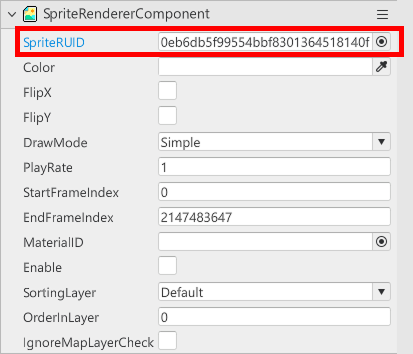
</p>

- Find and register the sword effect of **Weapon_Sword** to the SpriteRUID of the SpriteRendererComponent.
- If you don't find the SpriteRUID you need, click the button on the right to find and register it.

<p align="center">
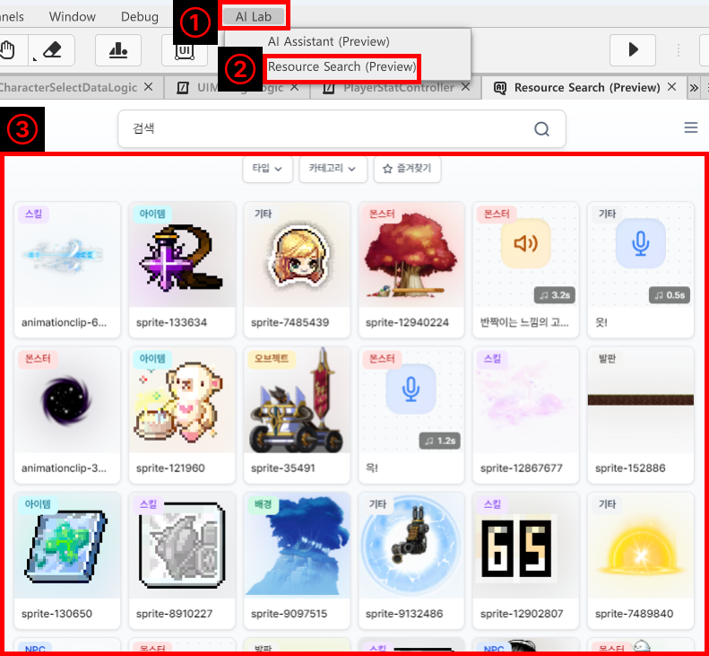
</p>

- If you're having trouble finding an image, click AI Lab at the top, then click Resource Search.
- On the Resource Search screen, find the resource you need and copy the RUID to use it.

<p align="center">
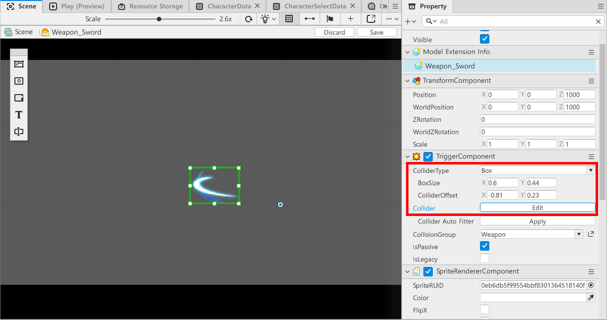
</p>

- Resize the **TriggerComponent** to match the scope of the effect.
- Set the ColliderType to Box, then adjust the BoxSize and ColliderOffset to set them to a similar range to the effect.
- If you don't see a green border, you can check the ColliderBox by pressing the Edit button.
- Once you're done setting up the Collider's scope, change the **Enable** value of the **SpriteRendererComponent** to **false**.
- Next, create a **Weapon_Sword** Component.

```lua
@Component
script Weapon_Sword extends Component

property TransformComponent transformComponent = nil

property TriggerComponent triggerComponent = nil

property Entity localPlayer = nil

property number deltaTimer = 0

property string AttackEffectRUID = "0005abfe9cd345e288a5a0faedb4b163"

property WeaponDataType weaponData = WeaponDataType()

@ExecSpace("ClientOnly")
method void OnBeginPlay()
-- Loads target entity's TransformComponent if transformComponent is nil.
if not isvalid(self.transformComponent) then
	self.transformComponent = self.Entity.TransformComponent
end
-- Loads target entity's TriggerComponent if triggerComponent is nil.
if not isvalid(self.triggerComponent) then
	self.triggerComponent = self.Entity.TriggerComponent
end
-- Searches for and registers LocalPlayer if localPlayer is nil.
if not isvalid(self.localPlayer) then
	self.localPlayer = _UserService.LocalPlayer
end
-- Loads the sword weapon's data.
local weaponData = _WeaponDataLogic:GetWeaponData("Weapon_Sword")
-- Registers the value if it's found normally.
if isvalid(weaponData) then
	self. weaponData = weaponData
end
end

@ExecSpace("ClientOnly")
method void RequestAttack()
-- Confirms which direction the player is looking.
local lookDirection = self.localPlayer.PlayerControllerComponent.LookDirectionX
    
-- Loads Weapon_Sword's TriggerComponent.
local trigger = self.Entity.TriggerComponent
if trigger == nil then 
	log("There is no TriggerComponent.")
	return 
end
-- Loads the BoxSize of the TriggerComponent from Weapon_Sword.
local boxSize = trigger.BoxSize
-- Loads the ColliderOffset of the TriggerComponent from Weapon_Sword.
local offset = trigger.ColliderOffset
-- Loads the WorldPosition of the Weapon_Sword that is the child of the current player.
local entityWorldPos = self.Entity.TransformComponent.WorldPosition:ToVector2()
    
-- Executes the inversion processing of the Offset X-axis based on direction.
local adjustedOffsetX = offset.x
if lookDirection < 0 and adjustedOffsetX > 0 then
	adjustedOffsetX = -adjustedOffsetX
elseif lookDirection > 0 and adjustedOffsetX < 0 then
	adjustedOffsetX = -adjustedOffsetX
end
    
-- Sets the actual collision box's centerpoint with the entity world's coordinates + adjusted Offset.
local boxCenter = entityWorldPos + Vector2(adjustedOffsetX, offset.y)
local overlapRange = BoxShape(boxCenter, boxSize, 0)

-- Confirms whether the attack effect is registered normally.
if self.AttackEffectRUID ~= "" then
	-- Checks whether the attack effect is flipped left to right and determines whether it will be applied.
	local options = { ["FlipX"] = false}
	if lookDirection == 1 then
		options = { ["FlipX"] = true }
	end
	-- Plays the sound effect.
	_SoundService:PlaySound("bbb8c45c0d21491a97deb363a9d95e0c", 1)
	-- Displays the effect in the attack range.
	_EffectService:PlayEffectAttached(self.AttackEffectRUID, self.Entity, Vector3.zero, 0, Vector3.one, false, options)
end
-- Loads Simulator using CollisionService.
local collisionService = _CollisionService:GetSimulator(self.Entity)
-- Begins the collision calculation based on the collision area that was created before.
local getResult = collisionService:OverlapAll("Monster", overlapRange)
-- Iterates a number of time equal to the amount received.
for i = 1, #getResult do
	local enemy = getResult[i].Entity
	-- Executes damage calculations.
	local resultDamage = _DamageCalcHelper:CalcDamageByPlayerAttack(self.weaponData.AtkValue)
	-- Delivers the calculated damage.
	enemy.MonsterController:GetDamage(resultDamage)
end
end

@ExecSpace("ClientOnly")
method void OnUpdate(number delta)
-- Executes an attack only when the game state is set to play.
if _GameLogic.isPlayingGame then
	-- Tests whether deltaTimer is larger than the CoolTime of the weaponData.
	if self.deltaTimer >= self.weaponData.CoolTime then
		-- Executes an attack if deltaTimer is larger than the CoolTime of the weaponData.
		self:RequestAttack()
		-- Resets the deltaTimer to 0.
		self.deltaTimer = 0
	else
		-- Adds the deltaTimer value by delta.
		self.deltaTimer = self.deltaTimer + delta
	end
end
end

end
```

> This code is written based on Plain Text.

- The **AttackEffectRUID** Property uses the SpriteRUID value from the **SpriteRendererComponent** that was found earlier.

<p align="center">
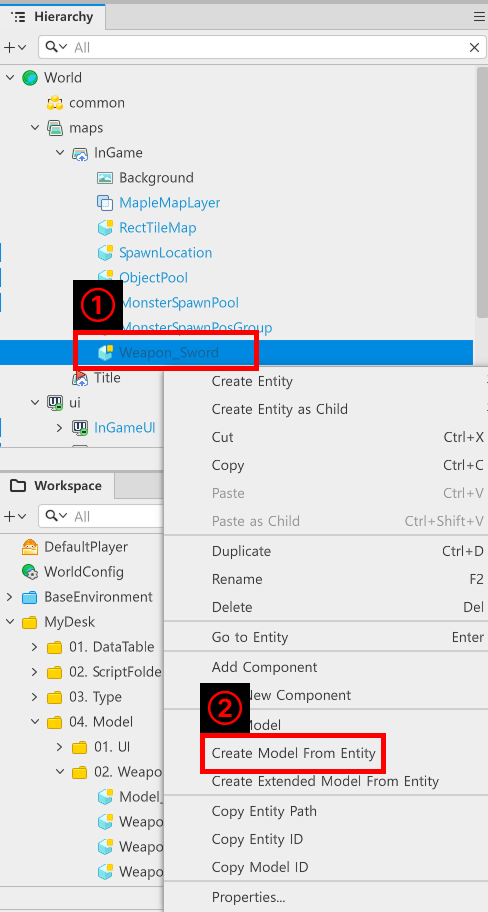
</p>

- In the Hierarchy, locate the **Weapon_Sword** entity and right-click on it.
- Click Create Model From Entity to create **Weapon_Sword** as a Model.
- Then delete the remaining **Weapon_Sword** entities in the Hierarchy.

#### Creating Weapon_Thunder

- The entity component of **Weapon_Thunder** is the same as **Weapon_Sword**.
- Create a **Weapon_Thunder** in the Hierarchy and add a **TriggerComponent** and a **SpriteRendererComponent** to the entity as Components, then set the effects, attack range, and so on.

```lua
@Component
script Weapon_Thunder extends Component

property string AttackEffectRUID = "57cbc4a4d5c34961947adca1a9e285c2"

property WeaponDataType weaponData = WeaponDataType()

property TransformComponent transformComponent = nil

property TriggerComponent triggerComponent = nil

property Entity localPlayer = nil

property number deltaTimer = 0

@ExecSpace("ClientOnly")
method void OnBeginPlay()
if not isvalid(self.transformComponent) then
	self.transformComponent = self.Entity.TransformComponent
end

if not isvalid(self.triggerComponent) then
	self.triggerComponent = self.Entity.TriggerComponent
end

if not isvalid(self.localPlayer) then
	self.localPlayer = _UserService.LocalPlayer
end
-- Loads the lightning weapon's data.
local weaponData = _WeaponDataLogic:GetWeaponData("Weapon_Thunder")
-- Registers the value if it's found normally.
if isvalid(weaponData) then
	self. weaponData = weaponData
end
end

@ExecSpace("ClientOnly")
method void RequestAttack()
-- Loads TriggerComponents BoxSize and ColliderOffset.
local trigger = self.triggerComponent
if trigger == nil then 
	log("There is no TriggerComponent.")
	return 
end
-- Sets the collision range.
local boxSize = trigger.BoxSize
-- Sets the center of the collision range.
local offset = trigger.ColliderOffset
-- Loads the entity's world position.
local entityWorldPos = self.transformComponent.WorldPosition:ToVector2()
-- Sets the area range for the random drop.
local randPosX = _UtilLogic:RandomIntegerRange(-1, 1)
local randPosY = _UtilLogic:RandomIntegerRange(-1, 1)

-- Adjusts the actual collision box's centerpoint (entity world coordinates + adjusted offset).
local boxCenter = entityWorldPos + Vector2(randPosX, randPosY)
local overlapRange = BoxShape(boxCenter, boxSize, 0)
local inGamePath = _EntityService:GetEntityByPath("/maps/InGame")
-- Displays the effect.
if self.AttackEffectRUID ~= "" then
	_EffectService:PlayEffectAttached(self.AttackEffectRUID, inGamePath, boxCenter:ToVector3(), 0, Vector3.one, false)
end
-- Plays the sound effect.
_SoundService:PlaySound("e8e38d3aaf5e4d5c9f9d735e92679835", 1)
-- Executes a collision test using CollisionService.
local collisionService = _CollisionService:GetSimulator(self.Entity)
local getResult = collisionService:OverlapAll("Monster", overlapRange)
    
for i = 1, #getResult do
	local enemy = getResult[i].Entity
	-- Executes damage calculations.
	local resultDamage = _DamageCalcHelper:CalcDamageByPlayerAttack(self.weaponData.AtkValue)
	-- Delivers the calculated damage.
	enemy.MonsterController:GetDamage(resultDamage)
end
end

@ExecSpace("ClientOnly")
method void OnUpdate(number delta)
-- Executes an attack only when the game state is set to play.
if _GameLogic.isPlayingGame then
	-- Confirms whether deltaTimer is larger than the CoolTime of the weaponData.
	if self.deltaTimer >= self.weaponData.CoolTime then
		-- Executes an attack if deltaTimer is larger than weaponData.
		self:RequestAttack()
		-- Resets deltaTimer value to 0.
		self.deltaTimer = 0
	else
		-- Adds time to deltaTimer equal to delta, so the cooldown can take place.
		self.deltaTimer = self.deltaTimer + delta
	end 
end
end

end
```

> This code is written based on Plain Text.

- The difference between **Weapon_Sword** and **Weapon_Thunder** is the difference in logic of the RequestAttack in the Component.
- The **Weapon_Sword** calls the **CollisionService** based only on its own position.
- However, **Weapon_Thunder** calls **CollisionService** based on the player's position plus a random value.

<br>

#### Creating Weapon_Dart
- The **Weapon_Dart** is different from previous weapons.
- A **Weapon_Dart** only has a **Weapon_Dart** Component to control itself.
- So, in order for the **Weapon_Dart** to fire projectiles, **Model_Dart** needs to be created.
- The configuration of **Model_Dart** is as follows.
    - **TriggerComponent**: Component for setting the collision range of the projectile, Dart.
    - **SpriteRendererComponent**: The image output Component for making the projectile visible.
    - **DartComponent**: Component for controlling the projectile to move on its own once it is fired.
- Set up the **SpriteRendererComponent** and **TriggerComponent** in the same way as the weapon created earlier.
- At this point, leave the **Enable** value of the **SpriteRendererComponent** set to **true**.
- Once the setting is complete, create a **DartComponent**.

```lua
@Component
script DartComponent extends Component

property WeaponDataType dartData = WeaponDataType()

property Vector3 moveDir = Vector3(0,0,0)

property number deltaTimer = 0

@ExecSpace("ClientOnly")
method void OnBeginPlay()
self:InitDefault()
end

method void InitDefault()
-- Resets dartData to an empty state.
self.dartData = WeaponDataType()
-- Resets the moveDir.
self.moveDir = Vector3.zero
-- Resets its own deltaTimer to 0.
self.deltaTimer = 0
-- Deactivates itself.
self.Entity.Enable = false
end

@ExecSpace("ClientOnly")
method void SetData(WeaponDataType DartData, Entity TargetEntity, TransformComponent StartPos)
-- Registers Pistol data.
self.dartData = DartData
-- Activates itself.
self.Entity.Enable = true
-- Resets its own position to the received StartPos.
self.Entity.TransformComponent.WorldPosition = StartPos.WorldPosition
-- Gets the comparative position between itself and TargetEntity.
local relativePos = TargetEntity.TransformComponent.WorldPosition - self.Entity.TransformComponent.WorldPosition        
-- Calculates the actual world direction vector between TargetEntity and itself.
local worldDir = self.Entity.TransformComponent:ToWorldDirection(relativePos)
-- Normalizes worldDir length to 1.
local dx = worldDir.x
local dy = worldDir.y
local distance = math.sqrt((dx * dx) + (dy * dy))

-- Registers the normalized direction to moveDir if the distance isn't 0.
if distance > 0.001 then
	self.moveDir = Vector3(dx / distance, dy / distance, 0)
else
    -- Exception processing occurs if the target and position completely overlap.
	self.moveDir = Vector3.zero
end
end

@ExecSpace("ClientOnly")
method void OnUpdate(number delta)
-- Checks the time if the projectile Dart can still be maintained.
if self.deltaTimer >= self.dartData.ProjectileLifeTime then
	-- Deactivates the entity if it is past the maintenance duration.
	self:InitDefault()
else
	-- Adds delta to deltaTimer if not.
	self.deltaTimer = self.deltaTimer + delta
end
-- Doesn't execute movement if the entity is inactive.
if not self.Entity.Enable then
	return
end
-- Sets the position for the next frame by calculating the set direction * speed * delta time.
local moveX = self.moveDir.x * self.dartData.ProjectileMoveSpeed * delta
local moveY = self.moveDir.y * self.dartData.ProjectileMoveSpeed * delta
-- Applies the calculated value.
self.Entity.TransformComponent:Translate(moveX, moveY)
end

@EventSender("Self")
handler HandleTriggerEnterEvent(TriggerEnterEvent event)
-- Checks whether the collided entity is a Monster.
if event.TriggerBodyEntity.MonsterController then
	-- Loads MonsterController if the collided entity is Monster.
	local monster = event.TriggerBodyEntity.MonsterController
	-- Executes damage calculations.
	local resultDamage = _DamageCalcHelper:CalcDamageByPlayerAttack(self.dartData.AtkValue)
	-- Delivers the calculated damage.
	monster:GetDamage(resultDamage)
	-- Deactivates entity as the collision concludes.
	self:InitDefault()
end
end

end
```

> This code is written in Plain Text.

- Once it's complete, switch **Model_Dart** to Model and remove the **Model_Dart** entity from the Hierarchy window.
- After that, create a **Model_Dart** Component.

```lua
@Component
script Weapon_Dart extends Component

property string dartModelID = "model://982ad54e-2057-4a39-98c7-3fd8df5dd68e"

property WeaponDataType dartData = WeaponDataType()

property number deltaTimer = 0

property ObjectPoolComponent objectPool = nil

@ExecSpace("ClientOnly")
method void OnBeginPlay()
self:InitDartData()
end

@ExecSpace("ClientOnly")
method void InitDartData()
-- Loads its own information from WeaponLogic.
local getData = _WeaponDataLogic:GetWeaponData("Weapon_Dart")
-- Checks whether weapon information was loaded normally.
if isvalid(getData) then
	-- Registers the value to dartData, since it is a normal value.
	self.dartData = getData
end
end

@ExecSpace("ClientOnly")
method void OnUpdate(number delta)
-- Executes an attack only when the game state is set to play.
if _GameLogic.isPlayingGame then
	-- Checks whether deltaTimer is past the cooldown.
	if self.deltaTimer >= self.dartData.CoolTime then
		-- Determines the current projectile availability if the deltaTimer is larger than the dartData's CoolTime.
		local findTarget = self:CheckCanThrow()
		if isvalid(findTarget) then
			-- Executes an attack if there is a target.
			self:ThrowDart(findTarget)
			-- Resets deltaTimer value to 0.
			self.deltaTimer = 0
		end
	else
		-- Adds time if the timer hasn't exceeded CoolTime yet.
		self.deltaTimer = self.deltaTimer + delta
	end
end
end

@ExecSpace("ClientOnly")
method void ThrowDart(Entity FindTarget)
-- Loads a single entity from objectPool.
local getEntity = self.objectPool:ReturnObject(self.dartModelID, self.dartData.WeaponID)
-- Checks whether getEntity was registered normally.
if isvalid(getEntity) then
	-- Plays the sound effect.
	_SoundService:PlaySound("afb9ac856edd416fa434c3d04eeb2d31", 1)
	-- Resets Dart's data.
	getEntity.DartComponent:SetData(self.dartData, FindTarget, self.Entity.TransformComponent)
end
end

@ExecSpace("ClientOnly")
method Entity CheckCanThrow()
-- Sets the range for the calculation.
local boxSize = Vector2(5, 5)
-- Sets the current position.
local entityWorldPos = self.Entity.TransformComponent.WorldPosition
-- Creates a BoxShape for collision calculations.
local overlapRange = BoxShape(entityWorldPos:ToVector2(), boxSize, 0)
-- Loads Simulator using CollisionService.
local getSimulator = _CollisionService:GetSimulator(self.Entity)
local getResult = getSimulator:OverlapBoxAll("Monster", entityWorldPos:ToVector2(), boxSize, 0)
--  Executes the loop a number of times equal to the received result count.
for i = 1, #getResult do
	local checkEntity = getResult[i].Entity
	-- Checks whether the received entity is usable.
	if isvalid(checkEntity) and isvalid(checkEntity.MonsterController)then
		-- Determines whether the target entity is a Monster and whether it survived.
		if checkEntity.Enable and checkEntity.MonsterController.isAlive then
			-- Delivers the target if all conditions have been met.
			return checkEntity
		end
	end
end
-- Returns nil if not all the conditions are met.
return nil
end

@EventSender("LocalPlayer")
handler HandleEntityMapChangedEvent(EntityMapChangedEvent event)
-- Searches for ObjectPool from InGame and registers it if the player moves into InGame.
if event.NewMap.Name == "InGame" then
	-- Searches for ObjectPool in the InGame map.
	local findObjectPool = _EntityService:GetEntityByPath("/maps/InGame/ObjectPool")
	-- Registers it if found normally.
	if isvalid(findObjectPool) then
		self.objectPool = findObjectPool.ObjectPoolComponent
	end
else
	-- Removes the registered objectPool, since the player is in a different map.
	self.objectPool = nil
end
end

end
```

> This code is written based on Plain Text.

- The value of **dartModelID** is copied from the Entry ID value of **Model_Dart** created earlier.

<br>

### Creating Weapons DataSet

- Once the Model for the weapons are created, a DataSet to store the values of weapons needs to be created.
- WeaponData is structured as follows.

<p align="center">
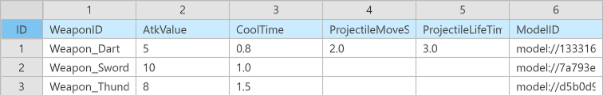
</p>

<style type="text/css">
.tg  {border-collapse:collapse;border-spacing:0;}
.tg td{border-color:black;border-style:solid;border-width:1px;font-family:Arial, sans-serif;font-size:14px;
  overflow:hidden;padding:10px 5px;word-break:normal;}
.tg th{border-color:black;border-style:solid;border-width:1px;font-family:Arial, sans-serif;font-size:14px;
  font-weight:normal;overflow:hidden;padding:10px 5px;word-break:normal;}
.tg .tg-cly1{border-color:currentcolor;text-align:left;vertical-align:middle}
.tg .tg-xwyw{border-color:currentcolor;text-align:center;vertical-align:middle}
.tg .tg-0a7q{border-color:currentcolor;text-align:left;vertical-align:middle}
</style>
<table class="tg"><thead>
  <tr>
    <th class="tg-xwyw">Name</th>
    <th class="tg-xwyw">Description</th>
  </tr></thead>
<tbody>
  <tr>
    <td class="tg-0a7q">WeaponID</td>
    <td class="tg-0a7q">This ID value is used to distinguish between weapons.</td>
  </tr>
  <tr>
    <td class="tg-0a7q">Atkvalue</td>
    <td class="tg-0a7q">The weapon's Attack Power value.<br>Summed with the Atk value in PlayerStat to deliver damage to the enemy.</td>
  </tr>
  <tr>
    <td class="tg-0a7q">CoolTime</td>
    <td class="tg-0a7q">This value sets the weapon's attack delay.</td>
  </tr>
  <tr>
    <td class="tg-cly1">ProjectileMoveSpeed</td>
    <td class="tg-cly1">For projectile-type attacks, such as Dart, this is a value to specify the speed.</td>
  </tr>
  <tr>
    <td class="tg-cly1">ProjectileLifeTime</td>
    <td class="tg-cly1">This value sets the disappearance time to prevent projectiles from remaining on the map indefinitely.</td>
  </tr>
  <tr>
    <td class="tg-cly1">ModelID</td>
    <td class="tg-cly1">This value is used to register the Entry ID of the created Weapon_WeaponName Model.</td>
  </tr>
</tbody>
</table>

- Once the DataSet is created, create a WeaponDataType.

### Creating WeaponDataLogic
- Once the DataSet is created, you must create Logic to manage the DataSet.

```lua
@Logic
script WeaponDataLogic extends Logic

property table weaponData = {}

@ExecSpace("ClientOnly")
method void OnBeginPlay()
self:InitWeaponData()
end

@ExecSpace("ClientOnly")
method void InitWeaponData()
-- Searches for a data set if weaponData is empty.
if not isvalid(self.weaponData) or not next(self.weaponData) then
	-- Searches for WeaponData in Workspace.
	local findData = _DataService:GetTable("WeaponData")
	-- Registers the data set if found normally.
	if isvalid(findData) then
		-- Loads the number of data set rows.
		local rowCount = findData:GetRowCount()
		-- Repeats a number of times equal to the number of data set rows.
		for i = 1, rowCount do
			-- Loads weapon ID value.
			local findID = tostring(findData:GetCell(i, "WeaponID"))
			-- Registers data if the normal ID value exists.
			if not _UtilLogic:IsNilorEmptyString(findID) then
				local dataType = WeaponDataType()
				dataType.AtkValue = tonumber(findData:GetCell(i, "AtkValue"))
				dataType.CoolTime = tonumber(findData:GetCell(i, "CoolTime"))
				dataType.ProjectileLifeTime = tonumber(findData:GetCell(i, "ProjectileLifeTime"))
				dataType.ModelID = tostring(findData:GetCell(i, "ModelID"))
				dataType.WeaponID = findID
				dataType.ProjectileMoveSpeed = tonumber(findData:GetCell(i, "ProjectileMoveSpeed"))
				self.weaponData[findID] = dataType
			end
		end
	end
end
end

@ExecSpace("ClientOnly")
method WeaponDataType GetWeaponData(string WeaponID)
-- Checks whether the requested WeaponID has a normal value.
if not _UtilLogic:IsNilorEmptyString(WeaponID) then
	-- Checks whether there is a weaponData value that has WeaponID as a Key.
	if isvalid(self.weaponData[WeaponID]) then
		-- Returns the value if it is a normal value.
		return self.weaponData[WeaponID]
	end
end
end

end
```

> This code is written based on PlainText.

<br>

## Creating an Object Pool
- Object pools are an optimization technique used when using large amounts of entities, such as projectiles and enemies.
- Create entities ahead of time, then leave them disabled when they're done being used or when they're first created.
- Use to pass entities that are in a deactivated state when needed.

<br>

### Creating Object Pool Entity

<p align="center">
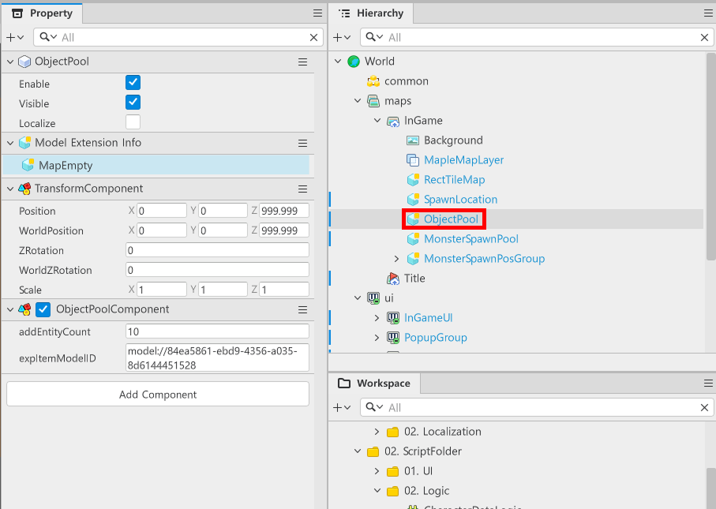
</p>

- In Hierarchy, create an **ObjectPool** entity for the map to use as an in-game map in maps.
- Modify the Position, WorldPosition value of the **TransformComponent** to the center of the map.
- Add **ObjectPoolComponent** as the Component.

```lua
@Component
script ObjectPoolComponent extends Component

property table entityTable = {}

property number addEntityCount = 10

property table expEntityTable = {}

property string expItemModelID = "model://84ea5861-ebd9-4356-a035-8d6144451528"

@ExecSpace("ClientOnly")
method void AddObject(string ModelID, string ObjectName)
-- Checks whether the ModelID value was input normally.
if not _UtilLogic:IsNilorEmptyString(ModelID) then
	for i = 1, self.addEntityCount do
		-- Copies Model.
		local getModel = _SpawnService:SpawnByModelId(ModelID, ObjectName, Vector3.zero, self.Entity)
		-- Checks whether there is an entityTable Key value that has a ModelID value.
		if not isvalid(self.entityTable[ObjectName]) or not next(self.entityTable[ObjectName]) then
			-- Resets the entityTable that has ModelID as a Key.
			self.entityTable[ObjectName] = {}
		end
		-- Adds created Model to entityTable[ModelID].
		table.insert(self.entityTable[ObjectName], getModel)
	end
end
end

@ExecSpace("ClientOnly")
method Entity ReturnObject(string ModelID, string ObjectName)
-- Checks whether the ModelID value is normally there.
if not _UtilLogic:IsNilorEmptyString(ModelID) then
	-- If there is a normal ModelID value, searches for entityTable with target Key value.
	if not isvalid(self.entityTable[ObjectName]) then
		-- Declares a new reset, since entityTable[ModelID] doesn't exist.
		self.entityTable[ObjectName] = {}
		-- Requests a creation after determining that there is no Entity in entityTable if there is no ModelID Key value in entityTable.
		self:AddObject(ModelID, ObjectName)
	end
	-- Creates local to register an entity that will be returned.
	local returnEntity = nil
	-- Searches for and registers the Value of the table's Key for iteration.
	local searchList = self.entityTable[ObjectName]
	-- Repeatedly executes registered searchList up to a set count.
	for i = 1, #searchList do
		local findEntity = searchList[i]
		-- Returns the entity if a registered entity isn't being used during the iteration.
		if findEntity.Enable == false then
			returnEntity = searchList[i]
			break
		end 
	end
	if not isvalid(returnEntity) then
		-- If no entity to be returned can be found after iterating the for statement, it creates a new one once it has determined that there is no usable entity.
		self:AddObject(ModelID, ObjectName)
		-- Returns the very last entity, since it was newly created and will always be usable.
		searchList = self.entityTable[ObjectName]
		-- Receives the total amount based on the newly-registered searchList as the last number.
		local lastCount = #searchList
		-- Receives the very last entity and registers it.
		returnEntity = searchList[lastCount]
	end
	-- Returns the found entity.
	return returnEntity
end
end

@ExecSpace("ClientOnly")
method void AddExpObject(string EXPModelID)
-- Checks whether the ModelID value was input normally.
if not _UtilLogic:IsNilorEmptyString(EXPModelID) then
	for i = 1, self.addEntityCount do
		-- Copies Model.
		local getModel = _SpawnService:SpawnByModelId(EXPModelID, "EXPItem", Vector3.zero, self.Entity)
		-- Checks whether there is an entityTable Key value that has a ModelID value.
		if not isvalid(self.expEntityTable["EXPItem"]) or not next(self.expEntityTable["EXPItem"]) then
			-- Resets the entityTable that has ModelID as a Key.
			self.expEntityTable["EXPItem"] = {}
		end
		-- Adds created Model to entityTable[ModelID].
		table.insert(self.expEntityTable["EXPItem"], getModel)
	end
end
end

@ExecSpace("ClientOnly")
method Entity ReturnEXPObject()
-- Checks whether the ModelID value is normally there.
if not _UtilLogic:IsNilorEmptyString("EXPItem") then
	-- If there is a normal ModelID value, searches for entityTable with target Key value.
	if not isvalid(self.expEntityTable["EXPItem"]) then
		-- Declares a new reset, since entityTable[ModelID] doesn't exist.
		self.expEntityTable["EXPItem"] = {}
		-- Requests a creation after determining that there is no Entity in entityTable if there is no ModelID Key value in entityTable.
		self:AddExpObject(self.expItemModelID)
	end
	-- Creates local to register an entity that will be returned.
	local returnEntity = nil
	-- Searches for and registers the Value of the table's Key for iteration.
	local searchList = self.expEntityTable["EXPItem"]
	-- Repeatedly executes registered searchList up to a set count.
	for i = 1, #searchList do
		local findEntity = searchList[i]
		-- Returns the entity if a registered entity isn't being used during the iteration.
		if findEntity.Enable == false then
			returnEntity = searchList[i]
			break
		end 
	end
	if not isvalid(returnEntity) then
		-- If no entity to be returned can be found after iterating the for statement, it creates a new one once it has determined that there is no usable entity.
		self:AddExpObject(self.expItemModelID)
		-- Returns the very last entity, since it was newly created and will always be usable.
		searchList = self.expEntityTable["EXPItem"]
		-- Receives the total amount based on the newly-registered searchList as the last number.
		local lastCount = #searchList
		-- Receives the very last entity and registers it.
		returnEntity = searchList[lastCount]
	end
	-- Returns the found entity.
	return returnEntity
end
end

end
```

> This code is written based on Plain Text.

- There are also items in the code example that are related to EXP.
- This is to ensure that EXP items are also managed within the ObjectPool in the EXP system to be developed later.

<br>

- Once everything is finalized, register each Model's Entry ID with ModelID in the DataSet of WeaponData.

---

<br>

## Minimum Implementation Standards
- When a player creates an attack weapon, the weapon performs a timed attack.
- Create a feature to automatically change the weapon based on the value of StartWeaponID in CharacterData.

<br>

## Usage and Extension Direction
- Give weapons the concept of levels so that they can later perform additional functions based on the weapon's level.
- Implement the ability to combine weapons indefinitely by creating a system that synthesizes certain combinations of weapons into new weapons.