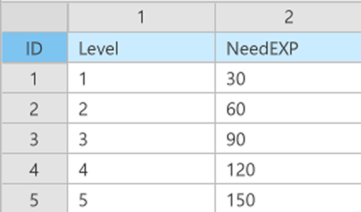
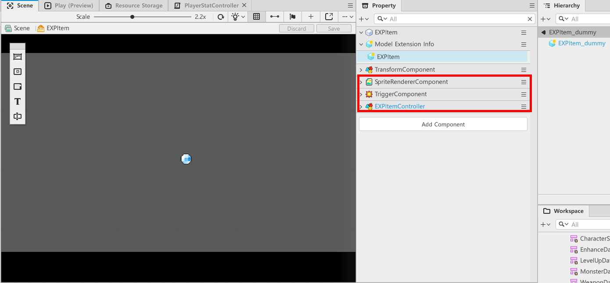

# [📖 Advanced Training] Implementing a Level System
<br>
<br>
<br>

## Video Timeline
- You can follow along by using the timeline under the training video.
- Understanding Map Types: 01:34:47

<br>

## Learning Goals
- Learn how to implement a level system, a means for players to become stronger.
- Learn how to adjust and manage the amount of EXP required for each level.
- Implement EXP gain as a means of leveling up players.

<br>

## Practical Exercises to Do After Watching the Video
- Configure a DataSet that allows players to get stronger over time by increasing the cap on levels.
- Provides a visual effect by displaying an effect as the player levels up.

<br>

---

## Level System
- This is an intuitive indicator that the player is getting stronger.
- This is a system where players gain EXP when they kill enemies and level up when they reach a certain amount of EXP.
- Implement a feature that allows players to become stronger by providing events that strengthen them as they level up.

<br>

### Creating a DataSet

<p align="center">

</p>

- In the sample world, the DataSet associated with levels is **LevelUpData**.
- The **LevelUpData** consisted of the following configuration
    - Level: A value to provide level-specific information.
        - Example: If the player's level is 1, use a NeedEXP value of 30.
    - NeedEXP: A value that specifies the amount of EXP the player requires to advance to the next level.
- Once you've finished creating your DataSet, create a **LevelUpDataType** that is a **StructType**.

<br>

### Creating EXP Items
- You need to configure EXP items for players to gain EXP when they kill enemies.
    - 💬 If you plan to create something that gives EXP directly when an enemy dies, you can call the **AddEXPValue** Method of the **PlayerStatController** Component without having to craft an EXP item.
- EXP items consist of the following components:

<p align="center">

</p>

- **SpriteRendererComponent**: Component for outputting images of EXP items.
    - Use an image resource that the player can recognize by registering it with a **SpriteRUID**.
- **TriggerComponent**: Component for setting the collision range for EXP items. 
    - Set the **BoxSize** and **ColliderOffset** to match the size of the **SpriteRendererComponent**. 
    - Set **CollisionGroup** to EXP.
- **EXPItemController**: Component for controlling the amount of EXP an EXP item gives out.
    - Create an **EXPItemController** as shown below.
```lua
@Component
script EXPItemController extends Component

property number addExpValue = 10

@ExecSpace("ClientOnly")
method void OnBeginPlay()
self:SetDefault()
end

@ExecSpace("ClientOnly")
method void SetDefault()
self.Entity.Enable = false
end

end
```

> This code is written based on Plain Text.

- The EXPItemController only needs to have the amount of EXP it pays out, so it's written as above.
- Once you've gotten this far, create an EXP item with a Model.

<br>

### Creating PlayerEXPCollider Entities
- It's time to create an entity that is a child of the Player entity that detects and acquires EXP items.
- Configure the feature to detect only those entities whose **CollisionGroup** is EXP and to gain them if detected successfully.
- The PlayerEXPCollider entity has the following configuration.
    - **TriggerComponent**: Has a **TriggerComponent** to specify the scope of the collision.
        - Change **CollisionGroup** to **PlayerEXPRange**.
    - **PlayerEXPColliderController**: Provides a method for handling collisions with EXP items and a function for updating the collision range based on the enhancement of the EXP item drop range.
- Create a **PlayerEXPColliderController** Component as follows.

```lua
@Component
script PlayerEXPCollideController extends Component

property PlayerStatController playerStateController = nil

@ExecSpace("ClientOnly")
method void SetPlayerStatController(PlayerStatController PlayerStat)
-- Registers received PlayerStatController.
self.playerStateController = PlayerStat
end

@ExecSpace("ClientOnly")
method void UpdateMagnetRange()
-- Changes the BoxSize of its TriggerComponent to PlayerStat value.
self.Entity.TriggerComponent.BoxSize = Vector2(self.playerStateController.magnetRange, self.playerStateController.magnetRange)
end

@EventSender("Self")
handler HandleTriggerEnterEvent(TriggerEnterEvent event)
-- Tests whether the collided entity is an EXP item.
if event.TriggerBodyEntity.EXPItemController then
	-- Adds EXP equal to the EXP item's value if it is an EXP item.
	self.playerStateController:AddEXPValue(event.TriggerBodyEntity.EXPItemController.addExpValue)
	-- Deactivates the EXP item, since the item was obtained.
	event.TriggerBodyEntity.EXPItemController:SetDefault()
end
end

end
```

> This code is written based on Plain Text.

- The **PlayerEXPCollider** now calls the **AddEXPValue** Method of the **PlayerStatController** when it collides with an **EXPItem** entity to increase the EXP value.

<br>

---

<br>

## Minimum Implementation Standards
- This is the means by which a player gains EXP and the EXP gained from acquiring it.
- Players level up when they reach a certain amount of EXP.


<br>

## Usage and Extension Direction
- Configure the player's required EXP to rise to a certain number so that it doesn't rely on a DataSet.
- Think about how you would set up the difficulty curve if you were keeping it as a DataSet and apply that.
