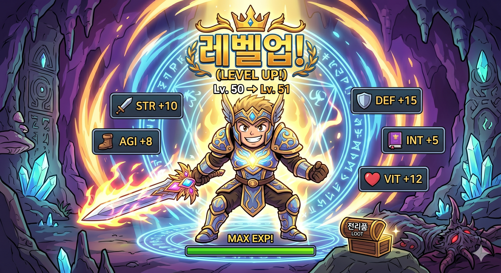
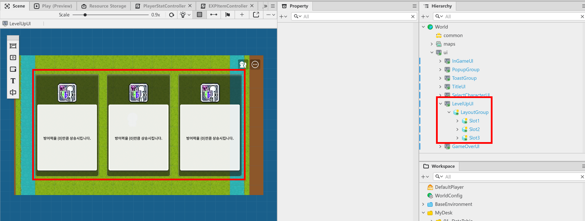
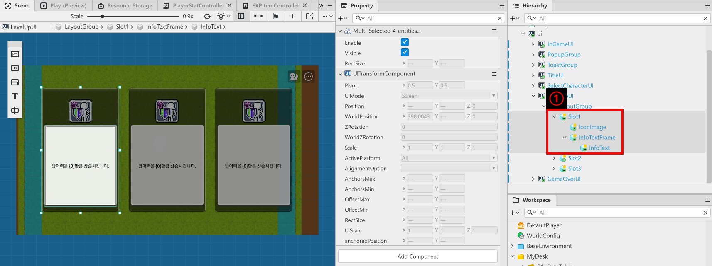
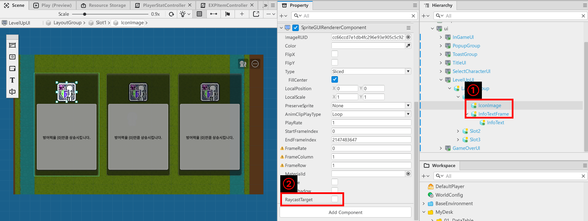
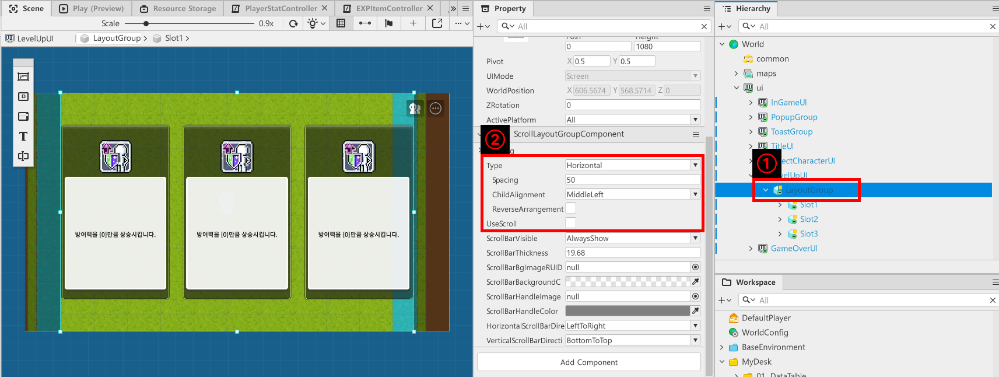
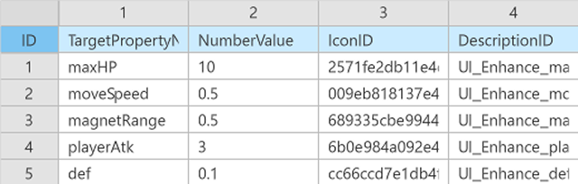
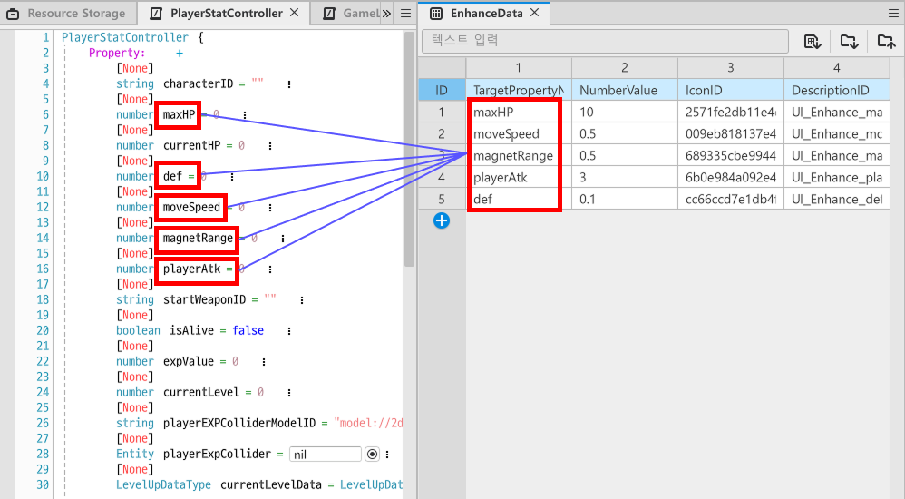

# [📖 Advanced Training] Implementing an Enhancement System
<br>
<br>
<br>

## Video Timeline
- You can follow along by using the timeline under the training video.
- Implementing an Enhancement System: 01:47:59

<br>

## Learning Goals
- Learn how to implement a feature that enhances players as they level up.
- Learn how to organize and use data to manage the enhance system.

<br>

## Practical Exercises to Do After Watching the Video
- Create a feature that outputs an enhancement UI if the player has enough EXP when the AddEXPValue Method of the **PlayerStatController** is executed.
- Configure the feature so that the effect is applied based on the selected enhancement.

---

## Player Enhancement

<p align="center">

</p>

- Configure the feature so that the player becomes stronger accordingly when the player levels up.
- In the sample world, the features are organized in the form of increasing stats as a means of becoming stronger.

<br>

### Creating Enhancement UI

<p align="center">

</p>

- If you look at the **LevelUpUI** in the sample world, it consists of the following components.
    - **LayoutGroup**: Fills the same role as the **LayoutGroup** used when **SelectCharacterUI** is created.
        - It is responsible for sorting the child entities Slot1, Slot2, and Slot3 at regular intervals.
    - **Slot**: There are a total of three entities, each providing a different enhancement.
- Create a **LevelUpUI** UI Group using the methods learned from earlier to create enhancement UI.
- Next, add a **LevelUpUIController** to the **LevelUpUI**.
<br>

#### Creating Slot Entity

<p align="center">

</p>

- The Slot entity has the following configuration.
    - **Slot**: The entity responsible for the enhancement slot.
        - Has a **SpriteGUIRendererComponent** that outputs the background of the enhancement slot.
        - Has a **ButtonComponent** to perform the functions of a button.
        - Has a **LevelUpSlotController** to update the UI based on the data of the slot.
    - **IconImage**: Has a **SpriteGUIRendererComponent** to display the enhancement image.
    - **InfoTextFrame**: Has a **SpriteGUIRendererComponent** to output a frame of **InfoText** that outputs a description of the enhancement.
    - **InfoText**: Has a **TextGUIRendererComponent** to describe the enhancement effect for that slot.

<p align="center">

</p>

- If you look at **IconImage** and **InfoTextFrame**'s **SpriteGUIRendererComponent**, you will see that there is a Property called **RaycastTarget**.
- This value must be cleared.
    - If left unchecked, the icon images, description window frames, etc. can be made to ignore the player's touches and clicks.
    - This can lead to problems with creating a selection screen that is cramped for the player.
- Once you've finished creating your **Slot**, duplicate it to make it three slots.

<p align="center">

</p>

- Once you have finished duplicating the three **Slots**, click on the **LayoutGroup** entity and change the value of the **ScrollLayoutGroupComponent**.
    - **Type**: Change to **Horizontal** to sort horizontally.
    - **Spacing**: Space the **Slots** apart by freely changing the value to suit your UI. In the sample world, it is set to 50.
    - **ChildAlignment**: Changes the sorting start point of **Slot** to **MiddleLeft** so that it starts at the center vertically and left horizontally.
    - **UseScroll**: Clears the value of **UseScroll**, since only 3 slots are used.

<br>

### Creating EnhanceData DataSet
- Create a DataSet to manage information related to enhancement.
- In the sample world, **EnhanceData** DataSet is created and used.

<p align="center">

</p>

<table class="tg"><thead>
  <tr>
    <th class="tg-xwyw">Name</th>
    <th class="tg-xwyw">Description</th>
  </tr></thead>
<tbody>
  <tr>
    <td class="tg-0a7q">TargetPropertyName</td>
    <td class="tg-0a7q">This value specifies a Property of the PlayerStatController.</td>
  </tr>
  <tr>
    <td class="tg-0a7q">NumberValue</td>
    <td class="tg-0a7q">This numeric value indicates how much to increase the TargetPropertyName.</td>
  </tr>
  <tr>
    <td class="tg-0a7q">IconID</td>
    <td class="tg-0a7q">This value registers the SpriteRUID for displaying the slot's image.</td>
  </tr>
  <tr>
    <td class="tg-cly1">DescriptionID</td>
    <td class="tg-cly1">This value is for registering the Key value of the UIStringData.</td>
  </tr>
</tbody>
</table>

<p align="center">

</p>

- You can see that an element with the same Property name in **PlayerStatController** is registered as **TargetPropertyName** in **EnhanceData**.
- By unifying the names of the two elements, it makes it easier to quickly add enhancement elements in a DataSet.
    - ⚠️ So the Property name in **PlayerStatController** and the **TargetPropertyName** in **EnhanceData** should not be different.
- Once you've finished creating the **EnhanceData** DataSet, create the **EnhanceDataType** StructType.

<br>

### Learning About LevelUpLogic

```lua
@Logic
script LevelUpLogic extends Logic

property table levelUpData = {}

property table enhanceData = {}

@ExecSpace("ClientOnly")
method void OnBeginPlay()
self:InitLevelUpData()
self:InitEnhanceData()
end

@ExecSpace("ClientOnly")
method void InitLevelUpData()
-- Checks whether levelUpData is nil.
if not isvalid(self.levelUpData) or not next(self.levelUpData) then
	-- Searches DataSet if nil.
	local dataSet = _DataService:GetTable("LevelUpData")
	-- Loads the RowCount of the found DataSet.
	local rowCount = dataSet:GetRowCount()
	-- Enters the data a repeat amount equal to the rowCount.
	for i = 1, rowCount do
		local levelData = LevelUpDataType()
		levelData.Level = tonumber(dataSet:GetCell(i, "Level"))
		levelData.NeedEXP = tonumber(dataSet:GetCell(i, "NeedEXP"))
		self.levelUpData[i] = levelData
	end
end
end

@ExecSpace("ClientOnly")
method LevelUpDataType GetLevelData(number CurrentLevel)
-- Checks whether levelUpData has the target level value.
if isvalid(self.levelUpData[CurrentLevel]) then
	-- Returns a value if the value exists normally.
	return self.levelUpData[CurrentLevel]
end
end

@ExecSpace("ClientOnly")
method number GetMaxLevel()
-- Returns the total number of levelUpData.
return #self.levelUpData
end

@ExecSpace("ClientOnly")
method void InitEnhanceData()
-- Tests whether enhanceData is nil.
if not isvalid(self.enhanceData) or not next(self.enhanceData) then
	-- Loads DataSet if enhanceData is nil.
	local findData = _DataService:GetTable("EnhanceData")
	-- Loads findData's RowCount.
	local rowCount = findData:GetRowCount()
	-- Repeatedly loads data a number of times equal to rowCount and registers them.
	for i = 1, rowCount do
		local data = EnhanceDataType()
		data.TargetPropertyName = tostring(findData:GetCell(i, "TargetPropertyName"))
		data.IconID = tostring(findData:GetCell(i, "IconID"))
		data.NumberValue = tonumber(findData:GetCell(i, "NumberValue"))
		data.DescriptionID = tostring(findData:GetCell(i, "DescriptionID"))
		self.enhanceData[i] = data
	end
end
end

@ExecSpace("ClientOnly")
method table GetRandomEnhanceTable()
-- Creates a dataList to be returned.
local dataList = {}
-- Declares count needed to set the order in the loop.
local count = 1
-- Executes the loop until the condition is met.
while count <= 3 do
	-- Loads a random value from enhanceData.
	local getNumber = _UtilLogic:RandomIntegerRange(1, #self.enhanceData)
	-- Registers the set value to data.
	local data = self.enhanceData[getNumber]
	-- If dataList is empty, registers the first selected value.
	-- Determines whether there is an identical value by repeating the for statement if there is already a value.
	local isDuplicate = false
	for i = 1, #dataList do
        if dataList[i] == data then
            isDuplicate = true
            break
        end
    end

	if not isDuplicate then
        dataList[count] = data
        count = count + 1
    end
end

return dataList
end

end
```

> This code is written based on Plain Text.

- If we look at the **LevelUpLogic** we created earlier, we can see the **GetRandomEnhanceTable** Method.
- It consists of delivering three randomized enhancement options through the method, with each slot being updated by the **LevelUpUiController** that will be created later.

<br>

### Creating a Component
- First, create a **LevelUpSlotController** to organize the Data that's been delivered.

```lua
@Component
script LevelUpSlotController extends Component

property SpriteGUIRendererComponent iconRenderer = nil

property TextGUIRendererComponent infoTextRenderer = nil

property EnhanceDataType enhanceData = EnhanceDataType()

@ExecSpace("ClientOnly")
method void OnBeginPlay()
self:InitDefault()
end

method void InitDefault()
-- Determines whether iconRenderer is nil.
if not isvalid(self.iconRenderer) then
	-- Determines and registers whether iconRenderer is nil.
	self.iconRenderer = self.Entity:GetChildByName("IconImage", false).SpriteGUIRendererComponent
end
-- Determines whether infoTextRenderer is nil.
if not isvalid(self.infoTextRenderer) then
	-- Determines and registers whether infoTextRenderer is nil.
	self.infoTextRenderer = self.Entity:GetChildByName("InfoText", true).TextGUIRendererComponent
end
-- Resets enhanceData.
self.enhanceData = EnhanceDataType()
end

@ExecSpace("ClientOnly")
method void InitSlotData(EnhanceDataType Data)
-- Registers received Data to enhanceDataType.
self.enhanceData = Data
-- Updates the icon image and description based on received Data.
self.iconRenderer.ImageRUID = self.enhanceData.IconID
self.infoTextRenderer.Text = _LocalizationService:GetTextFormat(self.enhanceData.DescriptionID, self.enhanceData.NumberValue)
end

@EventSender("Self")
handler HandleButtonClickEvent(ButtonClickEvent event)
-- Requests player enhancement by sending its information to GameLogic.
_GameLogic:RequestEnhancePlayer(self.enhanceData)
end

end
```

> This code is written based on Plain Text.

- The **LevelUpUIController** with Slot requests that the slot UI be updated via the **InitSlotData** of each slot's **LevelUpSlotController**.
- Next, create a **LevelUpUIController**.

```lua
@Component
script LevelUpUIController extends Component

property table slotTable = {}

@ExecSpace("ClientOnly")
method void OnBeginPlay()
self:InitSlot()
end

@ExecSpace("ClientOnly")
method void InitSlot()
-- Determines whether SlotTable is nil.
if not isvalid(self.slotTable) or not next(self.slotTable) then
	-- Attempts a reset if nil.
	for i = 1, 3 do
		-- Sets the name of the entity that will be searched.
		local targetEntityName = tostring("Slot"..i)
		-- Searches its own child entity by name.
		local entity = self.Entity:GetChildByName(targetEntityName, true)
		self.slotTable[i] = entity.LevelUpSlotController
	end
end
end

@ExecSpace("ClientOnly")
method void ShowLevelUpUI()
self.Entity.Enable = true
self:SetLevelUpUI()
end

@ExecSpace("ClientOnly")
method void HideLevelUpUI()
self.Entity.Enable = false
end

@ExecSpace("ClientOnly")
method void SetLevelUpUI()
-- Loads a random enhancement element from LevelUpLogic.
local getDataList = _LevelUpLogic:GetRandomEnhanceTable()
for i = 1, #self.slotTable do
	-- Attempts to reset each data by slot.
	self.slotTable[i]:InitSlotData(getDataList[i])
end
end

end
```

- The **LevelUpUIController** activates itself when **ShowLevelUpUI** is called.
- Then, through the **SetLevelUpUI**, request **LevelUpLogic** to call **GetRandomEnhancementTable** to get the randomized enhancement data.
- This updates the UI by applying the enhancement data passed to each Slot.

<br>

## Creating GameLogic
- Use GameLogic to communicate which enhancement options the player has selected to the player character.
- GameLogic acts as a middle bridge to deliver the information needed while the game is in progress.
- If we look at the **HandleButtonClickEvent** of the **LevelUpSlotController** Component, we can see the part that calls GameLogic.
- The GameLogic in the sample world is built as follows.

```lua
@Logic
script GameLogic extends Logic

property boolean isPlayingGame = false

property number killCount = 0

@ExecSpace("Client")
method void RequestStartGame(string CharacterID)
-- Checks whether the received CharacterID is a normal value.
if _UtilLogic:IsNilorEmptyString(CharacterID) then
	-- Generates an error log and halts code execution if CharacterID value is empty or is nil.
	log_error("The received CharacterID is nil or empty!")
	return
end

-- Loads data if CharacterID is normally received.
local getData = _CharacterDataLogic:GetCharacterDataByCharacterID(CharacterID)
-- Resets player character information with the loaded value.
local localPlayer = _UserService.LocalPlayer
localPlayer.PlayerStatController:SetPlayerStat(getData)
-- Directs UI to change to in-game UI.
_UIManageLogic:ShowInGameUI()
-- Converts current game status to true.
self.isPlayingGame = true
-- Resets killCount to 0.
self.killCount = 0
-- Moves LocalPlayer from Title Map to InGame.
self:RequestTeleportPlayer(localPlayer, "/maps/InGame/SpawnLocation")
end

@ExecSpace("Server")
method void RequestTeleportPlayer(Entity LocalPlayer, string TeleportMapPath)
_TeleportService:TeleportToEntityPath(LocalPlayer, TeleportMapPath)
end

@ExecSpace("ClientOnly")
method void RequestEnhancePlayer(EnhanceDataType EnhanceData)
-- Searches for local players.
local localPlayer = _UserService.LocalPlayer
-- Searches for local player's PlayerStatController.
local statComponent = localPlayer.PlayerStatController
-- Delivers the necessary enhancement value to PlayerStateController.
statComponent:EnhancePlayer(EnhanceData)
-- Covers LevelUpUI.
_UIManageLogic:HideLevelUpUI()
-- Converts isPlayingGame state to true.
self.isPlayingGame = true
end

@ExecSpace("ClientOnly")
method void NeedEnhancePlayer()
-- Converts isPlayingGame state to false upon receiving a level up UI request.
self.isPlayingGame = false
-- Calls UIManageLogic to open LevelUpUI.
_UIManageLogic:ShowLevelUpUI()
end

@ExecSpace("ClientOnly")
method void CountKillScore()
self.killCount = self.killCount + 1
end

@ExecSpace("Client")
method void CallResult()
-- Converts isPlayingGame to false.
self.isPlayingGame = false
-- Compares with DataStorageLogic's bestKillScore.
if self.killCount > _DataStorageLogic.clientBestKillScore then
	_DataStorageLogic:RequestSaveBestKillScore(self.killCount)
end
-- Displays the results window.
_UIManageLogic:ShowGameOverUI()

end

@ExecSpace("Client")
method void RequestGoToTitle()
local localPlayer = _UserService.LocalPlayer
-- Directs UI to change to title UI.
_UIManageLogic:ShowTitleUI()
-- Converts current game state to false.
self.isPlayingGame = false
-- Moves LocalPlayer from Title Map to Title.
self:RequestTeleportPlayer(localPlayer, "/maps/Title")
end

end
```

> This code is written based on Plain Text.

- The **LevelUpSlotController** is telling the **PlayerStatController** what enhancement has been selected via the **RequestEnhancePlayer** Method in **GameLogic**.

---

<br>

## Minimum Implementation Standards

- Randomized enhancement data should register in the UI as normal.
- The player's selected enhancement should be applied to the **PlayerStatController** Component.

<br>

## Usage and Extension Direction

- Adds a weapon's enhancement elements to the enhancement elements instead of just stats.
- Depending on the weapon's enhancement level, it adds different options, such as increased projectile count, increased attack range, and more.
- Placing a cap on the number of enhancements prevents players from only investing in specific stats.