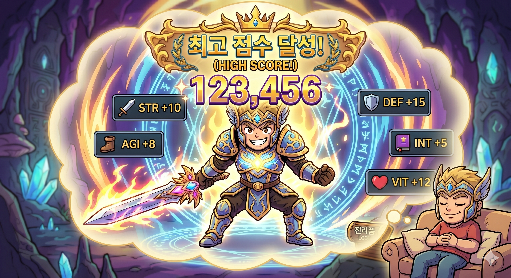
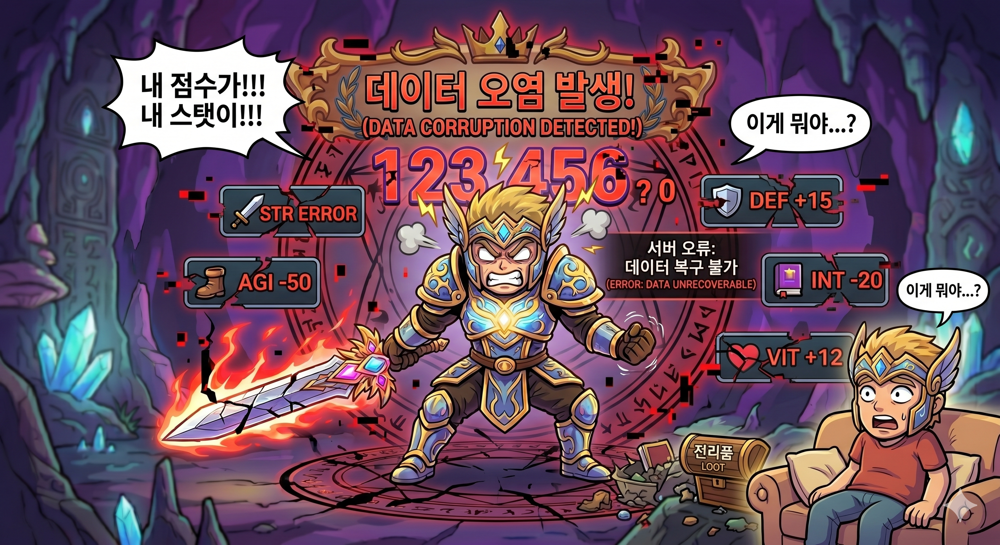

# [📖 Advanced Training] Learning DataStorage
<br>
<br>
<br>

## Video Timeline
- You can follow along by using the timeline under the training video.
- Understanding Map Types: 02:03:14

<br>

## Learning Goals
- Learn how to save a player's high score when they achieve it.
- Learn how to retrieve stored information.

<br>

## Practical Exercises to Do After Watching the Video
- Create a feature to output a player's best time to the UI.

---

<br>

## Save and Load System
<p align="center">

</p>

- Players reminisce about the moment they were at their very best.
- Preserving these moments as visual indicators encourages players to play the game over and over again to preserve them better.
- In this lesson, you'll learn how to save and load a player's high scores.

<br>

### Creating DataStorageLogic
```lua
@Logic
script DataStorageLogic extends Logic

@Sync
property number bestKillScore = 0

property number clientBestKillScore = 0

@ExecSpace("Client")
method void RequestBestKillScore()
-- Loads local player's ID value.
local localPlayerID = _UserService.LocalPlayer.PlayerComponent.UserId
-- Sets the returning value to 0.
local getValue = ""
self:GetPlayerBestScore(localPlayerID)
end

@ExecSpace("Server")
method void GetPlayerBestScore(string UserID)
-- Loads DataStorage to the received UserID.
local userDataStorage = _DataStorageService:GetUserDataStorage(UserID)
-- Sets return value to 0 if the result value is nil.
if userDataStorage == nil then
	self.bestKillScore = 0
end
-- Loads the value if the data is found normally.
local errorCode, bestScore = userDataStorage:GetAndWait("BestScore")
-- Updates bestKillScore if errorCode is 0, a normal result.
if errorCode == 0 then
	self.bestKillScore = tonumber(bestScore)
else
	self.bestKillScore = 0
end
end

@ExecSpace("Client")
method void RequestSaveBestKillScore(number KillScore)
-- Loads local player's ID value.
local localPlayerID = _UserService.LocalPlayer.PlayerComponent.UserId
-- Updates clientBestKillScore.
self.clientBestKillScore = KillScore
-- Attempts to save based on the received KillScore.
self:SaveBestKillScore(KillScore, localPlayerID)
end

@ExecSpace("Server")
method void SaveBestKillScore(number KillScore, string LocalPlayerID)
self.bestKillScore = KillScore
-- Loads DataStorage to the received UserID.
local userDataStorage = _DataStorageService:GetUserDataStorage(LocalPlayerID)
-- Attempts to save.
userDataStorage:SetAndWait("BestScore", tostring(self.bestKillScore))
end

@ExecSpace("ClientOnly")
method void OnSyncProperty(string name, any value)
if name == "bestKillScore" then
	if value ~= nil then
		self.clientBestKillScore = value
		_UIManageLogic:UpdateTitleBestScore()
	else
		self.clientBestKillScore = 0
		_UIManageLogic:UpdateTitleBestScoreZero()
	end
end
end

@ExecSpace("ClientOnly")
method void OnBeginPlay()
self:RequestBestKillScore()
end

end
```

> This code is written based on Plain Text.

- In the sample world, a Logic named **DataStorageLogic** is doing the saving and loading.
- When **RequestSaveBestKillScore** Method is called with the best score, the **DataStorageLogic** stores that value.
- Conversely, calling the **RequestBestKillScore** Method performs the function of loading a saved best score.

<br>

## Synchronizing with the Sample World
- Currently, the sample world works based on Client.
- Therefore, there is no Property that is updated on the server.
- To solve this problem, instead of the Client receiving and using the results computed by the Server, the **Client** delivers a value and the **Server** trusts and stores it.

<br>

## Data Tampering

<p align="center">

</p>

- The problem with the sample world's method is that it is vulnerable to data tampering.
- To prevent this, MapleStory Worlds provides its own server-to-client synchronization feature.
- To understand how this works, you need to understand Server and Client and the concept of synchronization.
    - [MSW Documents, Server and Client](https://maplestoryworlds-creators.nexon.com/ko/docs?postId=207)

---

<br>

## Minimum Implementation Standards
- The player's score should be saved and imported correctly.

<br>

## Usage and Extension Direction
- The highest kill count must be calculated and processed by the Server.
- The Client's functionality must be structured to update its state based on the results processed by the Server.
- Implement a feature that allows players to save their current state and continue playing.