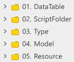

# 類吸血鬼倖存者世界學習指南文件
 
 
 

## 學習目標

- 透過指南文件與範例世界，學習製作類吸血鬼倖存者世界核心功能的方法。
- 學習在楓之谷世界中，活用用來偵測碰撞的TriggerComponent與CollisionService的方法。
- 學習活用物件池化技術管理大量實體的方法。
- 能將製作完成的世界調整成想要的形式並進行製作。

 

## 學習核心功能

- **理解TriggerComponent**：學習楓之谷世界中，用來檢查實體碰撞的方法TriggerComponent。
- **理解Collisionservice**：學習透過CollisionService，在特定位置、特定範圍內尋找特定項目的方法。

 

## 資料夾結構

<table class="tg"><thead>
  <tr>
    <th class="tg-wp8o">編號</th>
    <th class="tg-wp8o">名稱</th>
    <th class="tg-wp8o">說明</th>
  </tr></thead>
<tbody>
  <tr>
    <td class="tg-wp8o">1</td>
    <td class="tg-73oq">DataTable</td>
    <td class="tg-73oq">組成世界資料的DataSet、LocaleDataSet的資料夾。</td>
  </tr>
  <tr>
    <td class="tg-wp8o">2</td>
    <td class="tg-0a7q">ScriptFolder</td>
    <td class="tg-0a7q">組成世界功能的Component、Logic的資料夾。</td>
  </tr>
  <tr>
    <td class="tg-wp8o">3</td>
    <td class="tg-0a7q">Type</td>
    <td class="tg-0a7q">儲存DataSet格式之TypeScript的資料夾。</td>
  </tr>
  <tr>
    <td class="tg-wp8o">4</td>
    <td class="tg-0a7q">Model</td>
    <td class="tg-0a7q">儲存用來複製並使用已建立實體之Model的資料夾。</td>
  </tr>
  <tr>
    <td class="tg-wp8o">5</td>
    <td class="tg-0a7q">Resource</td>
    <td class="tg-0a7q">儲存資源的資料夾，在範例世界中則是儲存TileSet的資料夾。</td>
  </tr>
</tbody>
</table>

 

## 學習順序

- 💡 **基礎學習**：包含楓之谷世界或該類型最基礎功能的學習項目。
- 📖 **進階學習**：學習並製作範例世界中的功能項目。透過該過程的學習，可以擴展類型功能並提升學習理解度。

 

### [💡 基礎學習] 建立世界環境

- 學習楓之谷世界中RectTileMap的特徵。
- 學習在RectTileMap中配置圖塊的方法。
- 學習KinematicbodyComponent的Property結構，並理解其作用。

 

### [💡 基礎學習] 建立玩家角色選擇畫面

- 學習建立玩家可選擇角色之UI的方法。
- 學習隨著資料新增，讓UI能自動更新之功能建構方法。
- 學習建構功能，讓所選角色的資料能正常登錄。

 

### [💡 基礎學習] 製作玩家攻擊

- 建立可管理玩家武器之Component的方法。
- 學習各武器活用TriggerComponent與CollisionService的方法。
- 理解TriggerComponent與CollisionService的差異，並學習使用方法。

 

### [💡 基礎學習] 製作怪物系統
- 建立怪物的方法。
- 學習生成怪物的方法。
- 學習大量重複利用怪物的最佳化技術，也就是物件池。

 

### [📖 進階學習] 製作等級系統
- 學習製作讓玩家變強之手段，也就是等級系統的方法。
- 學習調整與管理各等級所需經驗值量的方法。
- 製作提升玩家等級的手段，也就是獲得經驗值。
 

### [📖 進階學習] 製作強化系統
- 學習製作玩家升級時進行強化之功能的方法。
- 建立並使用管理強化系統資料的方法。

 

### [📖 進階學習] 學習DataStorage
- 學習玩家達成最高紀錄時的儲存方法。
- 學習讀取已儲存資訊的方法。