# [💡 基礎學習] 建立玩家角色選擇畫面
<br>
<br>
<br>

## 影片時間軸
- 可在課程影片中以下時間點學習。
- 建立玩家角色選擇畫面：`00:15:13`

<br>

## 學習目標

- 學習建立玩家可選擇角色之UI的方法。
- 學習隨著資料新增，讓UI能自動更新之功能建構方法。
- 學習建構功能，讓所選角色的資料能正常登錄。

<br>

## 觀看該影片後可嘗試執行的內容

- 親自替換UI圖片資源，變更為視覺效果更好的資源。
- 任意新增數值至CharacterSelectData、CharacterData，確認是否正常新增至角色列表。
- 建立標題畫面後，按下開始遊戲按鈕時，使角色選擇視窗能夠顯示。

---

## 角色選擇系統

<p align="center">

</p>

> 楓之谷韓國伺服器的部分角色列表。

- 玩家不喜歡毫無意義的重複行為。
- 特別是當直接操作的角色相同，且必須反覆進行相同行為時，會很快失去對遊戲的興趣。
- 在重複性強的遊戲類型中，防止玩家失去興趣的方法之一就是提供具有個性的多樣角色。

<br>

### 建立UI Group

<p align="center">
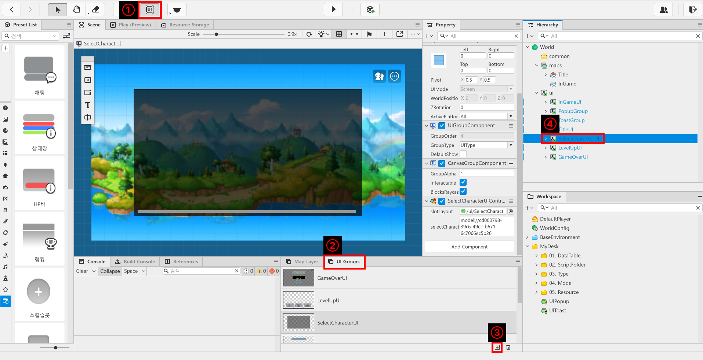
</p>

- 點擊楓之谷世界上方的「UI」按鈕。
- 點擊楓之谷世界畫面下方的「UI Groups」。
- 點擊「UI Groups」下方的「+」按鈕。
- 在「Hierarchy」視窗中修改已建立「UI Groups」的名稱，完成UI Group製作。

<br>

#### 在SelectCharacterUI新增實體

<p align="center">
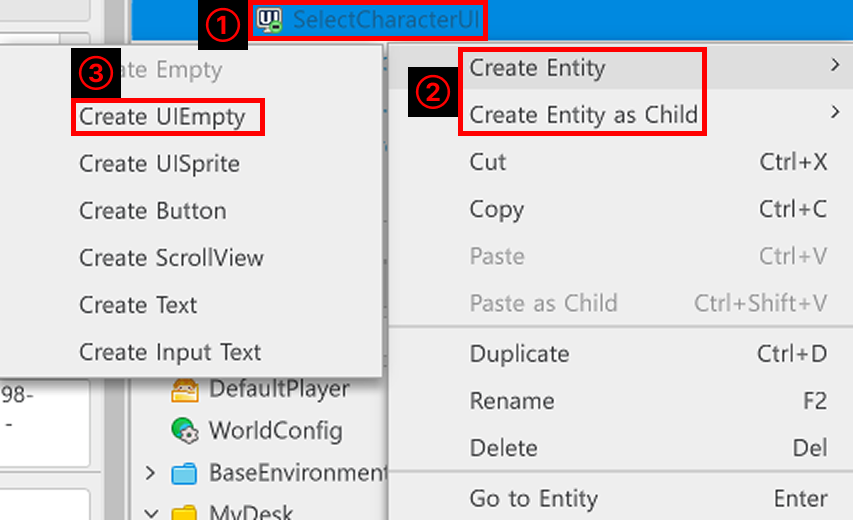
</p>

- 在「Hierarchy」視窗中對要新增實體的UI Group按滑鼠右鍵。
- 透過「Create Entity」或「Create Entity as Child」建立。
- 點擊「Create UIEmpty」建立空白UI實體。

<br>

#### 建立SelectCharacterUI

<p align="center">
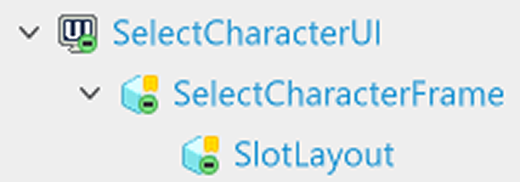
</p>

- SelectCharacterUI由2個實體組成。
    - **SelectCharacterFrame**：作為角色選擇欄位背景使用的實體。
    - **SlotLayout**：用於排列角色選擇欄位的實體。

<br>

#### 為實體新增Component

<p align="center">
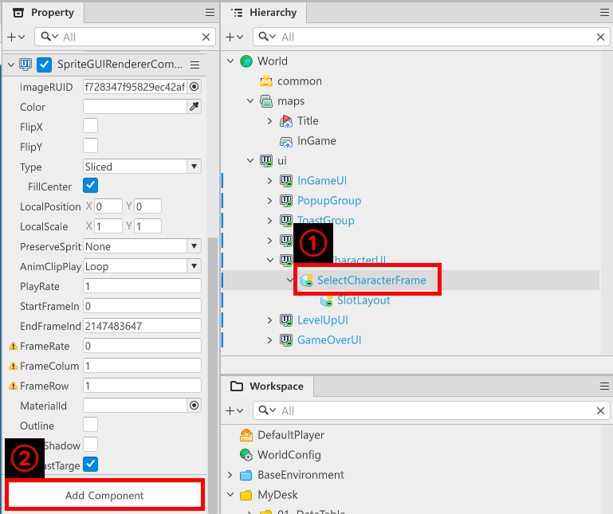
</p>

- 點擊想要新增Component的實體。
- 點擊「Property」視窗下方的「Add Component」註冊想要的Component。
    - **SelectCharacterFrame**實體新增「SpriteGUIRendererComponent」。
    - **SlotLayout**實體新增「ScrollLayoutGroupComponent」。

#### 編輯UI

<p align="center">
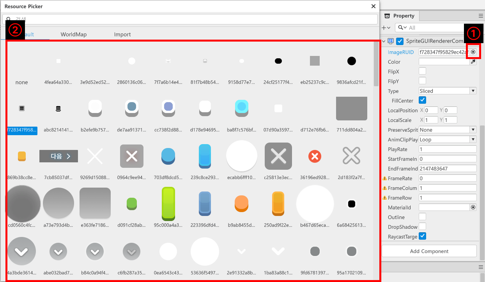
</p>

- 在「Hierarchy」視窗中點擊**SelectCharacterFrame**實體後，在「Property」視窗點擊**ImageRUID**旁的按鈕UI。
- 在「Resource Picker」視窗中選擇想要的圖片後關閉視窗。

<p align="center">
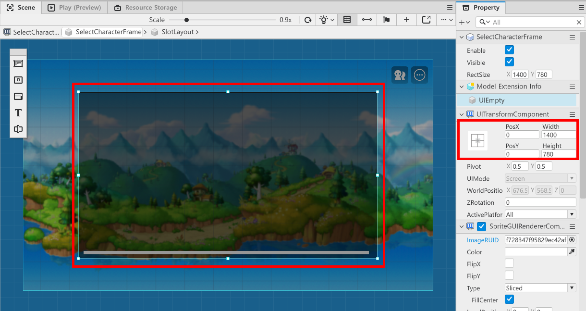
</p>

- 在「Property」視窗中調整「UITransformComponent」的Pos、Width、Height數值，或在「Scene」畫面中直接調整位置與範圍建立框架。

<p align="center">
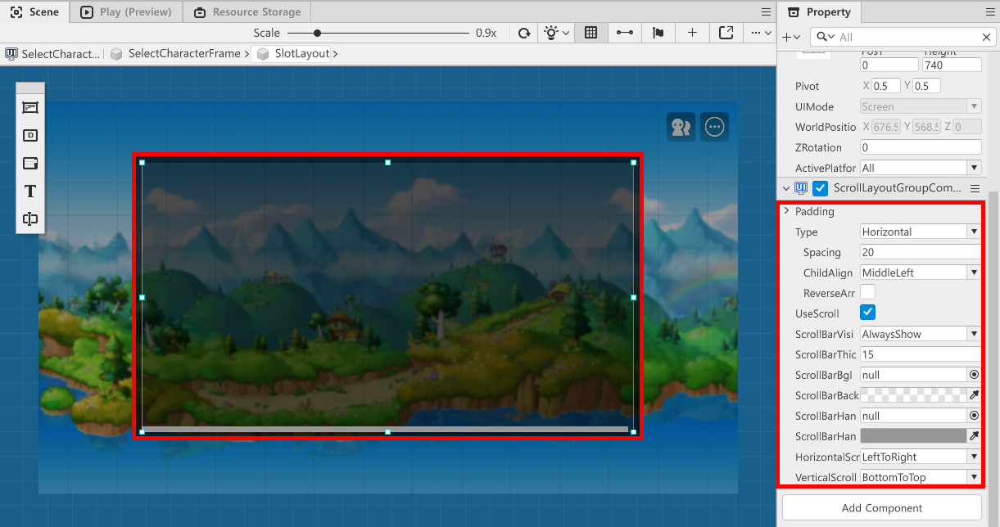
</p>

- 在「Hierarchy」視窗中點擊**SlotLayout**實體後，在「Property」視窗中的「UITransformComponen」或「Scene」畫面指定角色選擇欄位顯示範圍。
- 在「Property」視窗中找到「ScrollLayoutGroupComponent」後修改以下數值。
    - **Type**：將排列類型變更為Horizontal。
    - **Spacing**：指定欄位間距的數值。先設定為20，之後再修改數值來調整空間。
    - **ChildAlign**：指定欄位排列起始位置。設定為**MiddleLeft**，使垂直方向置中，水平從左側開始排列。

<br>

#### 建立角色選擇欄位UI

<p align="center">
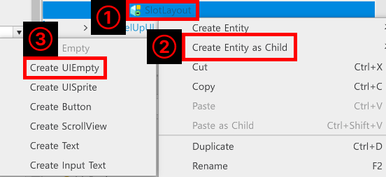
</p>

- 在「Hierarchy」視窗中對**SlotLayout**實體按滑鼠右鍵。
- 點擊「Create Entity as Child」後，點擊「Create UIEmpty」，在**SlotLayout**建立子實體。

<p align="center">
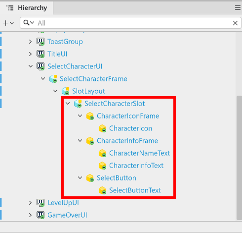
</p>

- 將建立的子實體名稱修改為**SelectcharacterSlot**後，為各項目新增實體與Component。

<style type="text/css">
.tg  {border-collapse:collapse;border-spacing:0;}
.tg td{border-color:black;border-style:solid;border-width:1px;font-family:Arial, sans-serif;font-size:14px;
  overflow:hidden;padding:10px 5px;word-break:normal;}
.tg th{border-color:black;border-style:solid;border-width:1px;font-family:Arial, sans-serif;font-size:14px;
  font-weight:normal;overflow:hidden;padding:10px 5px;word-break:normal;}
.tg .tg-cly1{border-color:currentColor;text-align:left;vertical-align:middle}
.tg .tg-lboi{border-color:currentColor;text-align:left;vertical-align:middle}
.tg .tg-xwyw{border-color:currentColor;text-align:center;vertical-align:middle}
.tg .tg-nrix{border-color:currentColor;text-align:center;vertical-align:middle}
.tg .tg-0a7q{border-color:currentColor;text-align:left;vertical-align:middle}
</style>
<table class="tg"><thead>
  <tr>
    <th class="tg-xwyw">名稱</th>
    <th class="tg-nrix">新增的Component</th>
    <th class="tg-xwyw">說明</th>
  </tr></thead>
<tbody>
  <tr>
    <td class="tg-0a7q">CharacterIconFrame</td>
    <td class="tg-cly1">SpriteGUIRendererComponent</td>
    <td class="tg-0a7q">作為角色職業圖示背景使用的實體。</td>
  </tr>
  <tr>
    <td class="tg-0a7q">CharacterIcon</td>
    <td class="tg-cly1">SpriteGUIRendererComponent</td>
    <td class="tg-0a7q">用於顯示角色職業圖示的實體。</td>
  </tr>
  <tr>
    <td class="tg-0a7q">CharacterInfoFrame</td>
    <td class="tg-cly1">SpriteGUIRendererComponent</td>
    <td class="tg-0a7q">作為角色資訊文字背景使用的實體。</td>
  </tr>
  <tr>
    <td class="tg-lboi">CharacterNameText</td>
    <td class="tg-cly1">TextGUIRendererComponent</td>
    <td class="tg-lboi">用於顯示角色名稱的實體。</td>
  </tr>
  <tr>
    <td class="tg-lboi">CharacterInfoText</td>
    <td class="tg-cly1">TextGUIRendererComponent</td>
    <td class="tg-lboi">用於顯示角色資訊的實體。</td>
  </tr>
  <tr>
    <td class="tg-lboi">SelectButton</td>
    <td class="tg-cly1">SpriteGUIRendererComponent<br>ButtonComponent</td>
    <td class="tg-lboi">用於偵測角色選擇的按鈕實體。</td>
  </tr>
  <tr>
    <td class="tg-lboi">SelectButtonText</td>
    <td class="tg-cly1">TextGUIRendererComponent</td>
    <td class="tg-lboi">用於顯示按鈕名稱的按鈕實體。</td>
  </tr>
</tbody></table>

<p align="center">
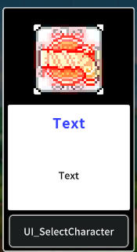
</p>

> 角色選擇欄位樣本範例。

### 製作DataSet

- 可以對每個角色套用不同能力值並進行管理，藉此調整角色平衡。
- DataSet是能以單一表格類型輸入並管理各角色能力值與資訊的功能。

<p align="center">
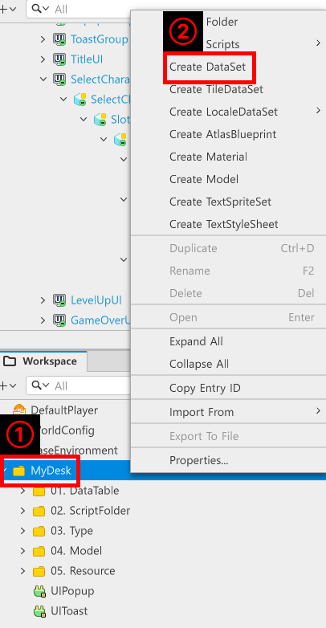
</p>

- 在「Workspace」視窗中對「MyDesk」按滑鼠右鍵後點擊**Create DataSet**建立新的DataSet。
- 將建立的DataSet名稱分別指定為**CharacterData**、**CharacterSelectData**。
    - **CharacterData**：用於管理角色遊戲內能力值等的DataSet。
    - **CharacterSelectData**：用於管理角色選擇畫面需顯示數值的DataSet。

<p align="center">
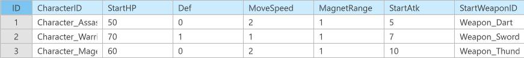
</p>

- CharacterDatad的結構如下。
<style type="text/css">
.tg  {border-collapse:collapse;border-spacing:0;}
.tg td{border-color:black;border-style:solid;border-width:1px;font-family:Arial, sans-serif;font-size:14px;
  overflow:hidden;padding:10px 5px;word-break:normal;}
.tg th{border-color:black;border-style:solid;border-width:1px;font-family:Arial, sans-serif;font-size:14px;
  font-weight:normal;overflow:hidden;padding:10px 5px;word-break:normal;}
.tg .tg-lboi{border-color:currentColor;text-align:left;vertical-align:middle}
.tg .tg-xwyw{border-color:currentColor;text-align:center;vertical-align:middle}
.tg .tg-0a7q{border-color:currentColor;text-align:left;vertical-align:middle}
</style>
<table class="tg"><thead>
  <tr>
    <th class="tg-xwyw">名稱</th>
    <th class="tg-xwyw">說明</th>
  </tr></thead>
<tbody>
  <tr>
    <td class="tg-0a7q">CharacterID</td>
    <td class="tg-0a7q">這是用來區分角色的ID值。</td>
  </tr>
  <tr>
    <td class="tg-0a7q">StartHP</td>
    <td class="tg-0a7q">遊戲開始時指定最大體力的數值。</td>
  </tr>
  <tr>
    <td class="tg-0a7q">Def</td>
    <td class="tg-0a7q">設定角色防禦力的數值。</td>
  </tr>
  <tr>
    <td class="tg-lboi">MoveSpeed</td>
    <td class="tg-lboi">遊戲開始時設定移動速度的數值。</td>
  </tr>
  <tr>
    <td class="tg-lboi">MagnetRange</td>
    <td class="tg-lboi">遊戲開始時指定角色經驗值道具取得偵測範圍的數值。</td>
  </tr>
  <tr>
    <td class="tg-lboi">StartAtk</td>
    <td class="tg-lboi">遊戲開始時指定玩家攻擊力的數值。</td>
  </tr>
  <tr>
    <td class="tg-lboi">StartWeaponID</td>
    <td class="tg-lboi">指定角色初始擁有武器的數值。</td>
  </tr>
</tbody>
</table>

<p align="center">
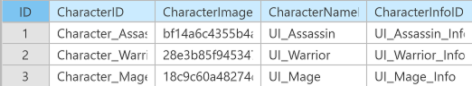
</p>

- CharacterSelectData的結構如下。
<style type="text/css">
.tg  {border-collapse:collapse;border-spacing:0;}
.tg td{border-color:black;border-style:solid;border-width:1px;font-family:Arial, sans-serif;font-size:14px;
  overflow:hidden;padding:10px 5px;word-break:normal;}
.tg th{border-color:black;border-style:solid;border-width:1px;font-family:Arial, sans-serif;font-size:14px;
  font-weight:normal;overflow:hidden;padding:10px 5px;word-break:normal;}
.tg .tg-lboi{border-color:currentColor;text-align:left;vertical-align:middle}
.tg .tg-xwyw{border-color:currentColor;text-align:center;vertical-align:middle}
.tg .tg-0a7q{border-color:currentColor;text-align:left;vertical-align:middle}
</style>
<table class="tg"><thead>
  <tr>
    <th class="tg-xwyw">名稱</th>
    <th class="tg-xwyw">說明</th>
  </tr></thead>
<tbody>
  <tr>
    <td class="tg-0a7q">CharacterID</td>
    <td class="tg-0a7q">用於區分角色的ID數值。<br>也會作為將選擇了哪個角色傳遞給CharacterData的數值。</td>
  </tr>
  <tr>
    <td class="tg-0a7q">CharacterImage</td>
    <td class="tg-0a7q">用於顯示角色圖示圖片的Image RUID數值。</td>
  </tr>
  <tr>
    <td class="tg-0a7q">CharacterNameID</td>
    <td class="tg-0a7q">用於儲存LocaleDataSet UIStringData的Key數值。</td>
  </tr>
  <tr>
    <td class="tg-lboi">CharacterInfoID</td>
    <td class="tg-lboi">用於儲存LocaleDataSet UIStringData的Key數值。</td>
  </tr>
</tbody>
</table>

<br>

#### 製作LocaleDataSet
- LocaleDataSet是為了本地化而製作的DataSet。
- 在LocaleDataSet輸入Key與各語言數值後，可依據Key數值取得目前需顯示的文字。

<p align="center">
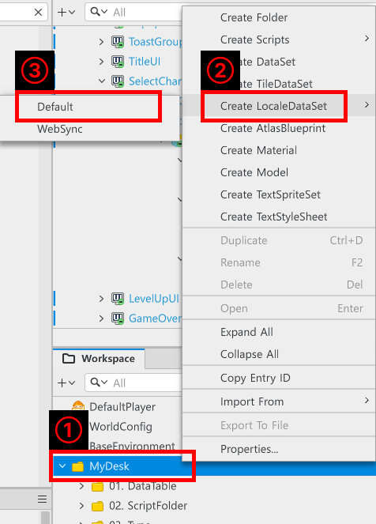
</p>

- 在「Workspace」中對「MyDesk」按滑鼠右鍵後點擊**Create LocaleDataSet**。
- 接著點擊Default即可製作LocaleDataSet。

<p align="center">
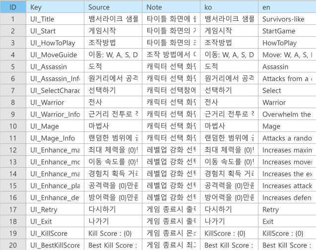
</p>

<style type="text/css">
.tg  {border-collapse:collapse;border-spacing:0;}
.tg td{border-color:black;border-style:solid;border-width:1px;font-family:Arial, sans-serif;font-size:14px;
  overflow:hidden;padding:10px 5px;word-break:normal;}
.tg th{border-color:black;border-style:solid;border-width:1px;font-family:Arial, sans-serif;font-size:14px;
  font-weight:normal;overflow:hidden;padding:10px 5px;word-break:normal;}
.tg .tg-lboi{border-color:currentColor;text-align:left;vertical-align:middle}
.tg .tg-xwyw{border-color:currentColor;text-align:center;vertical-align:middle}
.tg .tg-0a7q{border-color:currentColor;text-align:left;vertical-align:middle}
.tg .tg-0lax{border-color:currentColor;text-align:left;vertical-align:top}
</style>
<table class="tg"><thead>
  <tr>
    <th class="tg-xwyw">名稱</th>
    <th class="tg-xwyw">說明</th>
  </tr></thead>
<tbody>
  <tr>
    <td class="tg-0a7q">Key</td>
    <td class="tg-0a7q">需要本地化時，會利用此數值尋找所需數值。</td>
  </tr>
  <tr>
    <td class="tg-0a7q">Source</td>
    <td class="tg-0a7q">若為以WebSync製作的LocaleDataSet，則會依據此數值取得自動翻譯結果。</td>
  </tr>
  <tr>
    <td class="tg-0a7q">Note</td>
    <td class="tg-0a7q">用於開發者間留下此數值用途註解的欄位。</td>
  </tr>
  <tr>
    <td class="tg-lboi">ko</td>
    <td class="tg-lboi">在韓文環境執行時需顯示的數值輸入欄位。</td>
  </tr>
  <tr>
    <td class="tg-0lax">en</td>
    <td class="tg-0lax">在英文環境執行時需顯示的數值輸入欄位。</td>
  </tr>
</tbody>
</table>

- 除此之外，若是楓之谷世界支援的語言，也能新增欄位進行註冊。

<br>

### 製作Component
- 現在為**SelectCharacterUI**與**SelectCharacterSlot**新增Component。
- 各Component名稱分別製作為**SelectCharacterUIController**與SelectCharacterSlotController。

<br>

#### 撰寫SelectCharacterSlotController

```lua
@Component
script SelectCharacterSlotController extends Component

property SpriteGUIRendererComponent characterIcon = "83f3980e-976a-4278-9536-800256a3755a"

property TextGUIRendererComponent characterNameText = "e3c2461a-443e-49a1-aa73-3fc4d6f8ddab"

property TextGUIRendererComponent characterInfoText = "c2b30d2e-e18e-4c77-bb47-ac2cb5c30366"

property string characterID = ""

@ExecSpace("ClientOnly")
method void OnBeginPlay()
self:InitDefault()
end

@ExecSpace("ClientOnly")
method void InitDefault()
-- 檢查characterIcon是否為nil。
if not isvalid(self.characterIcon) then
	-- 在自身子實體中尋找CharacterIcon。
	local findIcon = self.Entity:GetChildByName("CharacterIcon", false)
	-- 若正常找到，則尋找並註冊characterIcon的SpriteGUIRendererComponent。
	if isvalid(findIcon.SpriteGUIRendererComponent) then
		self.characterIcon = findIcon.SpriteGUIRendererComponent
	else
		-- 若未找到，因屬錯誤情況，則輸出錯誤日誌。
		log_error("無法在SelectCharacterSlot中找到CharacterIcon實體或SpriteGUIRendererComponent！")
		return
	end
end
-- 檢查characterNameText是否為nil。
if not isvalid(self.characterNameText) then
	-- 在自身子實體中尋找CharacterNameText。
	local findName = self.Entity:GetChildByName("CharacterNameText", false)
	-- 若正常找到CharacterNameText，則尋找並註冊TextGUIRendererComponent。
	if isvalid(findName.TextGUIRendererComponent) then
		self.characterNameText = findName.TextGUIRendererComponent
	else
		-- 若未找到TextGUIRendererComponent，則輸出錯誤日誌。
		log_error("無法在SelectCharacterSlot中找到CharacterNameText實體或TextGUIRendererComponent！")
		return
	end	
end
-- 檢查characterInfoText是否存在。
if not isvalid(self.characterInfoText) then
	-- 在自身子實體中尋找CharacterInfoText。
	local findInfo = self.Entity:GetChildByName("CharacterInfoText", false)
	-- 若正常找到CharacterInfoText，則尋找並註冊TextGUIRendererComponent。
	if isvalid(findInfo.TextGUIRendererComponent) then
		self.characterInfoText = findInfo.TextGUIRendererComponent
	else
		-- 若未找到，則輸出錯誤日誌。
		log_error("無法在SelectCharacterSlot中找到CharacterInfoText實體或TextGUIRendererComponent！")
		return
	end
end
end

@ExecSpace("ClientOnly")
method void InitCharacterSlotData(CharacterSelectDataType SelectData)
-- 套用傳入SelectData的ID數值。
self.characterID = SelectData.CharacterID
-- 套用傳入SelectData的角色圖示圖片。
self.characterIcon.ImageRUID = SelectData.CharacterImage
-- 將傳入SelectData的角色名稱套用為UIStringData的本地化數值。
self.characterNameText.Text = _LocalizationService:GetText(SelectData.CharacterNameID)
-- 將傳入SelectData的角色資訊套用為UIStringData的本地化數值。
self.characterInfoText.Text = _LocalizationService:GetText(SelectData.CharacterInfoID)
-- 尋找子實體中是否存在選擇按鈕。
local selectButton = self.Entity:GetChildByName("SelectButton", false)
-- 註冊按下SelectButton時需執行的功能。
selectButton:ConnectEvent("ButtonClickEvent", self.ClickSelectCharacterButton)
end

@ExecSpace("ClientOnly")
method void ClickSelectCharacterButton()
-- 以指定資料初始化玩家，並呼叫開始遊戲。
_GameLogic:RequestStartGame(self.characterID)
end

end
```
> 該程式碼是以Plain Text為基準編寫而成。

<p align="center">
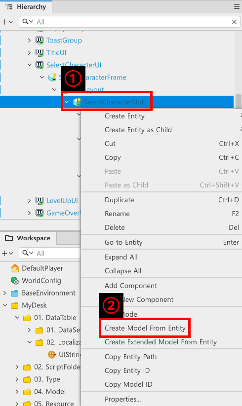
</p>

- 完成Component製作後，在「Hierarchy」視窗中對**SelectCharacterSlot**實體按滑鼠右鍵。
- 在選單中點擊「Create Model From Entity」，在「Workspace」中製作為Model。
- 之後移除殘留在「Hierarchy」中的**SelectCharacterSlot**。

<br>

#### 撰寫SelectCharacterUIController

```lua
@Component
script SelectCharacterUIController extends Component

property Entity slotLayout = "2302c518-0b07-4d82-85d8-d1655c483964"

property string selectCharacterSlotID = "model://cd000798-39c6-49ec-b671-6c7066ec5b26"

property table selectCharacterSlotTable = {}

@ExecSpace("ClientOnly")
method void OnBeginPlay()
self:InitDefault()
end

@ExecSpace("ClientOnly")
method void InitDefault()
-- 檢查slotLayout是否為nil。
if not isvalid(self.slotLayout) then
	-- 若slotLayout為nil，則在自身子實體中尋找SlotLayout。
	local findSlotLayout = self.Entity:GetChildByName("SlotLayout")
	-- 若正常找到SlotLayout實體，則註冊至slotLayout Property。
	if isvalid(findSlotLayout) then
		self.slotLayout = findSlotLayout
	-- 若未找到SlotLayout，則輸出錯誤日誌並中止程式執行。
	else
		log_error("無法在SelectCharacterUI中找到SlotLayout！")
		return
	end
end

-- 若slotLayout正常存在，則檢查selectCharacterSlotTable的數量。
if #self.selectCharacterSlotTable < 1 then
	-- 從CharacterSelectDataLogic取得所有資料。
	local getCharacterSelectData = _CharacterSelectDataLogic:GetCharacterSelectData()
	-- 依照getCharacterSelectData的數量建立SelectCharacterSlot Model，並設為SlotLayout的子實體。
	for i = 1, #getCharacterSelectData do
		local slotEntity = _SpawnService:SpawnByModelId(self.selectCharacterSlotID, "SelectCharacterSlot_"..i, Vector3.zero, self.slotLayout)
		slotEntity.SelectCharacterSlotController:InitCharacterSlotData(getCharacterSelectData[i])
		self.selectCharacterSlotTable[i] = slotEntity
	end
end
end

@ExecSpace("ClientOnly")
method void ShowSelectCharacterUI()
self.Entity.Enable = true
self.Entity.Visible = true
end

@ExecSpace("ClientOnly")
method void HideSelectCharacterUI()
self.Entity.Enable = false
self.Entity.Visible = false
end

end
```
> 該程式碼是以Plain Text為基準編寫而成。


<p align="center">
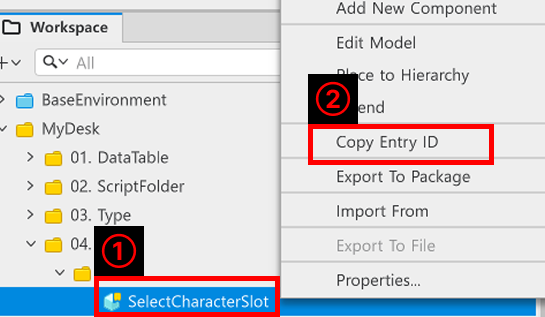
</p>

- 在「Workspace」內的「MyDesk」找到先前製作的**SelectCharacterSlot Model**後按滑鼠右鍵。
- 點擊**Copy Entry ID**後，註冊至**SelectCharacterUIController**的Property中的**selectCharacterSlotID**。

<br>

### 撰寫TypeScript

- TypeScript是用來方便存取DataSet多種數值的Script。
- 可透過TypeScript名稱進行宣告，並能以已宣告的Property名稱快速存取所需數值。
- EX：若在名為CharacterDataType的TypeScript中建立CharacterID，則可透過CharacterDataType.CharacterID進行存取。

<p align="center">
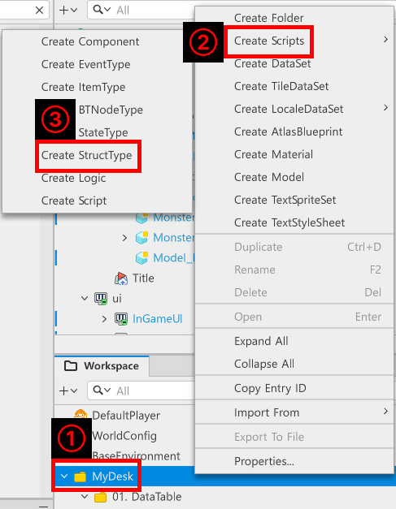
</p>

- 在「Hierarchy」、「MyDesk」按滑鼠右鍵。
- 點擊**Create Scripts**後，再點擊**Create StructType**。
- 將建立的Struct名稱指定為**CharacterDataType**、**CharacterSelectDataType**。

#### 撰寫CharacterDataType的StructType Script
```lua
@Struct
script CharacterDataType

@Sync
property string CharacterID = ""

@Sync
property number StartHP = 0

@Sync
property number Def = 0

@Sync
property number MoveSpeed = 0

@Sync
property number MagnetRange = 0

@Sync
property number StartAtk = 0

@Sync
property string StartWeaponID = ""

end
```

> 該程式碼是以Plain Text為基準編寫而成。

- 只需在Property中填入DataSet已註冊的數值名稱即可。

<br>

#### 撰寫CharacterSelectDataType Script

```lua
@Struct
script CharacterSelectDataType

@Sync
property string CharacterID = ""

@Sync
property string CharacterImage = ""

@Sync
property string CharacterNameID = ""

@Sync
property string CharacterInfoID = ""

end
```

> 該程式碼是以Plain Text為基準編寫而成。

- 之後每次製作DataSet時，都會一併撰寫DataType。

<br>

### 製作Logic
- 為了使用先前製作的DataSet，必須製作能載入DataSet並回傳可使用類型的Logic。

<p align="center">
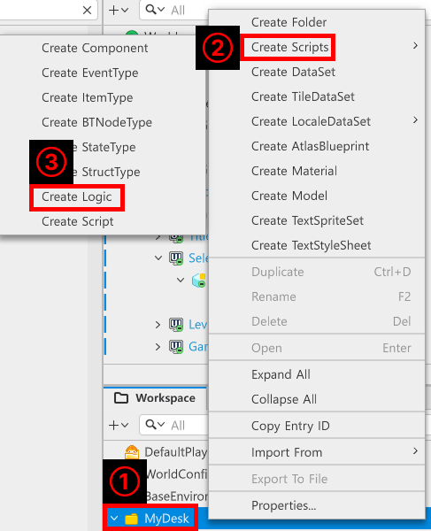
</p>

- 在「Workspace」中對「MyDesk」按滑鼠右鍵。
- 點擊**Create Scripts**後，再點擊**Create Logic**。
- 將各Logic名稱建立為**CharacterDataLogic**、**CharacterSelectdataLogic**。

#### 撰寫CharacterDataLogic
```lua
@Logic
script CharacterDataLogic extends Logic

property table characterData = {}

@ExecSpace("ClientOnly")
method void OnBeginPlay()
self:InitCharacterData()
end

@ExecSpace("ClientOnly")
method void InitCharacterData()
-- 檢查characterData是否為可使用狀態。
if not isvalid(self.characterData) or not next(self.characterData) then
	-- 若為不可使用狀態，則嘗試初始化。
	local findData = _DataService:GetTable("CharacterData")
	-- 若找到的資料可正常使用，則嘗試快取找到的DataSet數值。
	if isvalid(findData) then
		-- 取得CharacterData DataSet的欄位數量。
		local getDataCount = findData:GetRowCount()
		-- 將DataSet中註冊的數值逐一存入characterData。
		for i = 1, getDataCount do
			local characterID = findData:GetCell(i, "CharacterID")
			local dataType = CharacterDataType()
			dataType.CharacterID = characterID
			dataType.Def = tonumber(findData:GetCell(i, "Def"))
			dataType.MagnetRange = tonumber(findData:GetCell(i, "MagnetRange"))
			dataType.MoveSpeed = tonumber(findData:GetCell(i, "MoveSpeed"))
			dataType.StartAtk = tonumber(findData:GetCell(i,"StartAtk"))
			dataType.StartHP = tonumber(findData:GetCell(i, "StartHP"))
			dataType.StartWeaponID = tostring(findData:GetCell(i, "StartWeaponID"))
			self.characterData[characterID] = dataType
		end
	else
		-- 因未找到CharacterData DataSet，輸出錯誤日誌。
		log_error("找不到CharacterData DataSet！")
	end
end
end

@ExecSpace("ClientOnly")
method CharacterDataType GetCharacterDataByCharacterID(string CharacterID)
if isvalid(self.characterData[CharacterID]) then
	return self.characterData[CharacterID]
else
	log_error(CharacterID.."不存在以此為Key的資料！")
	return nil
end

end

end
```
> 該程式碼是以Plain Text為基準編寫而成。

<br>

#### 製作CharacterSelectDataLogic
```lua
@Logic
script CharacterSelectDataLogic extends Logic

property table characterSelectData = {}

@ExecSpace("ClientOnly")
method void OnBeginPlay()
self:InitCharacterSelectData()
end

@ExecSpace("ClientOnly")
method void InitCharacterSelectData()
-- 檢查characterSelectData是否為nil狀態。
if not isvalid(self.characterSelectData) or not next(self.characterSelectData)then
	-- 若characterSelectData為nil，則尋找並註冊CharacterSelectData DataSet。
	local findDataSet = _DataService:GetTable("CharacterSelectData")
	-- 若正常找到DataSet，則逐一註冊各數值。
	if isvalid(findDataSet) then
		local dataSetCount = findDataSet:GetRowCount()
		for i = 1, dataSetCount do
			local dataType = CharacterSelectDataType()
			dataType.CharacterID = findDataSet:GetCell(i, "CharacterID")
			dataType.CharacterImage = findDataSet:GetCell(i, "CharacterImage")
			dataType.CharacterNameID = findDataSet:GetCell(i, "CharacterNameID")
			dataType.CharacterInfoID = findDataSet:GetCell(i, "CharacterInfoID")
			self.characterSelectData[i] = dataType
		end
	else
		-- 因未找到DataSet，輸出錯誤日誌。
		log_error("CharacterSelectDataLogic中無法找到CharacterSelectData！")
		return
	end
	log("CharacterSelectData初始化完成："..#self.characterSelectData.."筆資料更新完成！")
end
end

@ExecSpace("ClientOnly")
method table GetCharacterSelectData()
return self.characterSelectData
end

end
```
- 此程式碼是以Plain Text為基準撰寫的程式碼。

### 製作UIManageLogic
- UIManageLogic是往後用來持有並管理UI Group Controller的Logic。
- 會以按下特定按鈕時，向對應Controller請求顯示UI的類型進行撰寫。
- 提供的程式碼為範例世界中撰寫的完整程式碼，可依照需求修改或追加後使用。

```lua
@Logic
script UIManageLogic extends Logic

property TitleUIController titleUIController = "6da59d9e-c7fc-4d42-94d4-1b8a938739db"

property SelectCharacterUIController selectCharacterUIController = "56c914d2-2cdb-460f-b3c2-f6c6b214584d"

property LevelUpUIController levelUpUIController = "86adf2d1-8621-4e93-a3ad-7918da098b76"

property GameOverUIController gameoverUIController = "c4b1db61-652c-44ea-9510-adb1615d2c6d"

property InGameUIController ingameUIController = "8eb1d1f8-9802-4c01-a46d-66c541ee7d0e"

@ExecSpace("ClientOnly")
method void OnBeginPlay()
self:InitTitleUIController()
self:InitSelectCharacterUIController()
self:InitLevelUpUIController()
self:InitGameOverUIController()
self:InitInGameUIController()
end

@ExecSpace("ClientOnly")
method void InitTitleUIController()
-- 檢查titleUIController是否為nil狀態。
if not isvalid(self.titleUIController) then
	-- 若為nil，則尋找titleUIController。
	local findController = _EntityService:GetEntityByPath("TitleUI").TitleUIController
	-- 若找到titleUIController，則進行註冊。
	if isvalid(findController) then
		self.titleUIController = findController
	else
		-- 若未找到，則輸出錯誤日誌。
		log_error("UIManageLogic無法找到TitleUI或titleUIController Component！")
		return
	end
end
end

@ExecSpace("ClientOnly")
method void InitSelectCharacterUIController()
-- 檢查selectCharacterUIController是否為nil狀態。
if not isvalid(self.selectCharacterUIController) then
	-- 若為nil，則尋找selectCharacterUIController。
	local findController = _EntityService:GetEntityByPath("SelectCharacterUI").SelectCharacterUIController
	-- 若找到selectCharacterUIController，則進行註冊。
	if isvalid(findController) then
		self.selectCharacterUIController = findController
	else
		-- 若未找到，則輸出錯誤日誌。
		log_error("UIManageLogic無法找到SelectCharacterUI或selectCharacterUIController Component！")
		return
	end
end
end

@ExecSpace("ClientOnly")
method void InitGameOverUIController()
-- 檢查gameoverUIController是否為nil狀態。
if not isvalid(self.gameoverUIController) then
	-- 若為nil，則尋找gameoverUIController。
	local findController = _EntityService:GetEntityByPath("GameOVerUI").GameOverUIController
	-- 若找到gameoverUIController，則進行註冊。
	if isvalid(findController) then
		self.gameoverUIController = findController
	else
		-- 若未找到，則輸出錯誤日誌。
		log_error("UIManageLogic無法找到GameOverUI或gameoverUIController Component！")
		return
	end
end
end

@ExecSpace("ClientOnly")
method void InitLevelUpUIController()
-- 檢查levelUpUIController是否為nil狀態。
if not isvalid(self.levelUpUIController) then
	-- 若為nil，則尋找levelUpUIController。
	local findController = _EntityService:GetEntityByPath("LevelUpUI").LevelUpUIController
	-- 若找到gameoverUIController，則進行註冊。
	if isvalid(findController) then
		self.levelUpUIController = findController
	else
		-- 若未找到，則輸出錯誤日誌。
		log_error("UIManageLogic無法找到LevelUpUI或levelUpUIController Component！")
		return
	end
end
end

method void InitInGameUIController()
-- 檢查ingameUIController是否為nil狀態。
if not isvalid(self.ingameUIController) then
	-- 若為nil，則尋找ingameUIController。
	local findController = _EntityService:GetEntityByPath("InGameUI").InGameUIController
	-- 若找到gameoverUIController，則進行註冊。
	if isvalid(findController) then
		self.ingameUIController = findController
	else
		-- 若未找到，則輸出錯誤日誌。
		log_error("UIManageLogic無法找到InGameUI或ingameUIController Component！")
		return
	end
end
end

@ExecSpace("ClientOnly")
method void ShowSelectCharacterUI()
-- 隱藏標題UI。
self.titleUIController:HideTitleUI()
-- 顯示角色選擇UI。
self.selectCharacterUIController:ShowSelectCharacterUI()
end

@ExecSpace("ClientOnly")
method void ShowInGameUI()
self.titleUIController:HideTitleUI()
self.selectCharacterUIController:HideSelectCharacterUI()
self.ingameUIController:ShowInGameUI()
end

@ExecSpace("ClientOnly")
method void ShowLevelUpUI()
self.levelUpUIController:ShowLevelUpUI()
end

@ExecSpace("ClientOnly")
method void HideLevelUpUI()
self.levelUpUIController:HideLevelUpUI()
end

@ExecSpace("ClientOnly")
method void UpdateTitleBestScore()
self.titleUIController:UpdateBestScore()
end

@ExecSpace("ClientOnly")
method void UpdateTitleBestScoreZero()
self.titleUIController:UpdateBestScoreZero()
end

@ExecSpace("ClientOnly")
method void ShowGameOverUI()
self.gameoverUIController:ShowResult()
end

@ExecSpace("ClientOnly")
method void ShowTitleUI()
self.titleUIController:ShowTitleUI()
self.gameoverUIController:HideResult()
self.levelUpUIController:HideLevelUpUI()
self.selectCharacterUIController:HideSelectCharacterUI()
self.ingameUIController:HideInGameUI()
end

end
```
> 該程式碼是以Plain Text為基準編寫而成。

## 製作PlayerStatController
- 需要用來套用並管理前面製作的**CharacterData**數值的Component。
- 在範例世界中，負責這些功能的Controller就是**PlayerStatController**。
- 將該Component新增至Workspace的DefaultPlayer。
```lua
@Component
script PlayerStatController extends Component

property string characterID = ""

property number maxHP = 0

property number currentHP = 0

property number def = 0

property number moveSpeed = 0

property number magnetRange = 0

property number playerAtk = 0

property string startWeaponID = ""

property boolean isAlive = false

property number expValue = 0

property number currentLevel = 0

property string playerEXPColliderModelID = "model://2df3f730-e5f0-4314-b171-ab5a47db0fd7"

property Entity playerExpCollider = nil

property LevelUpDataType currentLevelData = LevelUpDataType()

@ExecSpace("ClientOnly")
method void SetPlayerStat(CharacterDataType CharacterData)
-- 將角色ID值初始化至characterID。
self.characterID = CharacterData.CharacterID
-- 設定遊戲開始時的最大體力。
self.maxHP = CharacterData.StartHP
-- 在遊戲開始階段，將目前體力設定為最大體力。
self.currentHP = self.maxHP
-- 設定玩家的防禦力。
self.def = CharacterData.Def
-- 設定玩家的移動速度值。
self.moveSpeed = CharacterData.MoveSpeed
-- 變更玩家實體MovementComponent的InputSpeed值，初始化移動速度。
self.Entity.MovementComponent.InputSpeed = self.moveSpeed
-- 將玩家可獲得經驗值道具的範圍magnetRange初始化為傳入的值。
self.magnetRange = CharacterData.MagnetRange
self.playerAtk = CharacterData.StartAtk
-- 儲存玩家的初始武器值。
self.startWeaponID = CharacterData.StartWeaponID
-- 尋找玩家武器控制器。
local playerWeaponController = self.Entity.PlayerWeaponController
-- 若正常找到元件，則登錄武器。
if isvalid(playerWeaponController) then
	-- 初始化玩家的武器資訊。
	playerWeaponController:InitDefault()
	-- 登錄玩家所選角色的基本武器。
	playerWeaponController:AddPlayerWeapon(self.startWeaponID)
end
-- 將玩家經驗值初始化為0。
self.expValue = 0
-- 將玩家目前等級初始化為1。
self.currentLevel = 1
-- 取得目前玩家的等級資訊。
self.currentLevelData = _LevelUpLogic:GetLevelData(self.currentLevel)
-- 在玩家實體新增經驗值碰撞判定用實體。
if not isvalid(self.playerExpCollider) then
	self:AddPlayerEXPCollider()
end
-- 依照CharacterData更新玩家的經驗值碰撞範圍。
self.playerExpCollider.PlayerEXPCollideController:UpdateMagnetRange()
-- 啟用玩家的生存狀態。
self.isAlive = true
-- 透過事件傳遞玩家體力已變更。
local hpEvent = UpdatePlayerHP()
hpEvent.currentPlayerHP = self.currentHP
hpEvent.maxPlayerHP = self.maxHP
self.Entity:SendEvent(hpEvent)
-- 發送玩家經驗值已更新的事件。
local expEvent = UpdatePlayerEXP()
expEvent.currentPlayerEXP = self.expValue
expEvent.maxPlayerEXP = self.currentLevelData.NeedEXP
self.Entity:SendEvent(expEvent)
end

@ExecSpace("ClientOnly")
method void GetDamage(number ResultValue)
-- 檢查是否正在遊玩遊戲且玩家存活。
if self.isAlive and _GameLogic.isPlayingGame then
	-- 依照傳入的值減少currentHP。
	self.currentHP = self.currentHP - ResultValue
	-- 若currentHP為0以下，則執行死亡處理。
	if self.currentHP <= 0 then
		self:ChangeDisable()
		-- 向GameLogic請求結果視窗。
		_GameLogic:CallResult()
	end
end
-- 透過事件傳遞玩家體力已變更。
local event = UpdatePlayerHP()
event.currentPlayerHP = self.currentHP
event.maxPlayerHP = self.maxHP
self.Entity:SendEvent(event)
end

@ExecSpace("ClientOnly")
method void ChangeDisable()
-- 停用玩家實體。
self.Entity.Enable = false
-- 將isAlive轉換為false。
self.isAlive = false
end

@ExecSpace("ClientOnly")
method void AddEXPValue(number EXPValue)
-- 若目前等級已達最大值，則跳過經驗值計算。
if self.currentLevel >= _LevelUpLogic:GetMaxLevel() then
	return
end
-- 依照傳入的值增加經驗值。
self.expValue = self.expValue + EXPValue
-- 檢查目前經驗值是否高於升級所需經驗值。
if self.expValue >= self.currentLevelData.NeedEXP then
	-- 將玩家等級提升1。
	self.currentLevel = self.currentLevel + 1
	-- 依照所需經驗值量減少目前玩家的經驗值。
	self.expValue = self.expValue - self.currentLevelData.NeedEXP
	-- 取得下一等級資料。
	self.currentLevelData = _LevelUpLogic:GetLevelData(self.currentLevel)
	-- 向GameLogic請求升級相關處理。
	_GameLogic:NeedEnhancePlayer()
	-- 在強化期間停用movementComponent，使玩家無法移動。
	self.Entity.MovementComponent.Enable = false
end
-- 發送玩家經驗值已更新的事件。
local event = UpdatePlayerEXP()
event.currentPlayerEXP = self.expValue
event.maxPlayerEXP = self.currentLevelData.NeedEXP
self.Entity:SendEvent(event)
end

@ExecSpace("ClientOnly")
method void AddPlayerEXPCollider()
-- 在玩家實體中以子實體建立PlayerEXPCollider。
self.playerExpCollider = _SpawnService:SpawnByModelId(self.playerEXPColliderModelID, "PlayerEXPCollider", self.Entity.TransformComponent.Position, self.Entity)
-- 將自己(PlayerStatController)登錄至建立的expCollider。
self.playerExpCollider.PlayerEXPCollideController:SetPlayerStatController(self)
end

@ExecSpace("ClientOnly")
method void EnhancePlayer(EnhanceDataType EnhanceData)
-- 尋找擁有傳入EnhanceData名稱的Property。
local effectedProperty = self[EnhanceData.TargetPropertyName]
-- 檢查是否正常存在Property。
if isvalid(effectedProperty) then
	-- 依照對應數值登錄，使其套用效果。
	effectedProperty = EnhanceData.NumberValue
	-- 若強化值為maxHP，則處理該項強化。
	if EnhanceData.TargetPropertyName == "maxHP" then
		self.currentHP = self.maxHP
		-- 透過事件傳遞玩家體力已變更。
		local event = UpdatePlayerHP()
		event.currentPlayerHP = self.currentHP
		event.maxPlayerHP = self.maxHP
		self.Entity:SendEvent(event)
	-- 若強化值為moveSpeed，則更新MovementComponent中的數值。
	elseif EnhanceData.TargetPropertyName == "moveSpeed" then
		self.Entity.MovementComponent.InputSpeed = self.moveSpeed
	-- 若強化值為magnetRange，則更新PlayerExpCollideController的寬度。
	elseif EnhanceData.TargetPropertyName == "magnetRange" then
		self.playerExpCollider.PlayerEXPCollideController:UpdateMagnetRange()
	end
end
-- 解除玩家移動停用狀態。
self.Entity.MovementComponent.Enable = true
end

end
```
> 該程式碼是以Plain Text為基準編寫而成。

---

<br>

## 最低製作標準

- 角色選擇視窗會顯示。
- 若選擇想要的角色，角色資訊就會更新至PlayerStatController。

<br>

## 應用與進階應用

- 為了建立遊戲，新增更多資訊至DataSet，並修改Logic使其可使用。
- 改善UI組成項目中的資訊與UI，使其能更詳細查看角色資訊。