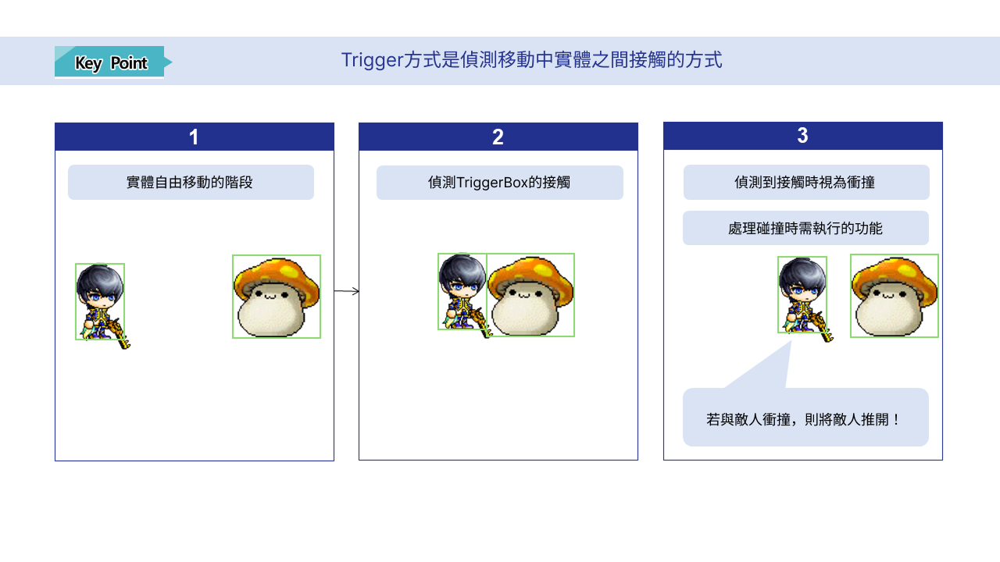
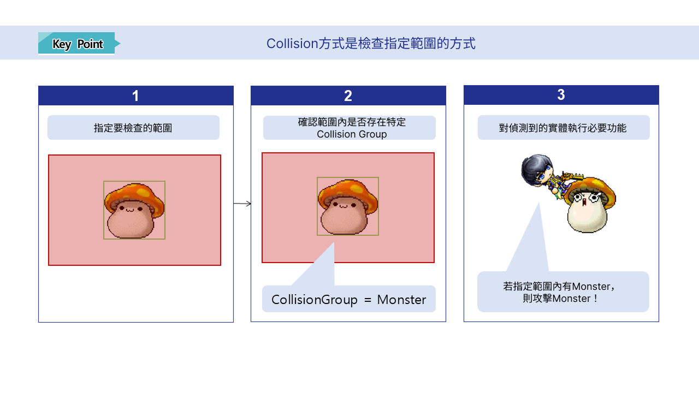

# [💡 基礎學習] 製作玩家攻擊
<br>
<br>
<br>

## 影片時間軸
- 可在課程影片中以下時間點學習。
- 製作玩家攻擊：`00:01:29`

<br>

## 學習目標
- 建立可管理玩家武器之Component的方法。
- 學習各武器活用TriggerComponent與CollisionService的方法。
- 理解TriggerComponent與CollisionService的差異，並學習使用方法。

<br>

## 觀看該影片後可嘗試執行的內容
- 修改內部邏輯，將投射體Dart的攻擊對象方式指定為最近的敵人。
- 除了範例世界提供的武器之外，親自製作其他武器。

<br>

---

## 製作攻擊功能
<p align="center">

</p>

> poncle製作的Vampire Survivors遊戲畫面圖片。

- 玩家若想從敵人手中生存，就必須擊敗敵人。
- 若想擊敗敵人，玩家就需要能對敵人造成傷害的手段。
- 本單元會一邊了解攻擊功能如何製作，一邊學習其製作方法。
- 若親自執行**應用與擴充**方向項目，便能製作出更有深度的世界。

<br>

### 偵測碰撞
- 要確認特定實體是否位於特定範圍內，有許多方法。
- 範例世界中使用了活用TriggerComponent的Collider的方法，以及活用CollisionService的方法來製作Weapon。

<br>

#### TriggerComponent VS CollisionService

<p align="center">

</p>

- 使用TriggerComponent的方式，會在實體存在於地圖中的狀態下發生。
- 以賦予各實體的TriggerComponent的Collider範圍為基準，檢查Collider是否接觸或重疊。
- 若Collider接觸或重疊，便判斷為兩個實體發生碰撞。
- **Weapon_Dart**正是活用此功能。

<br>

<p aling="center">

</p>

- 使用CollisionService的方式，則是透過程式碼執行的方式。
- 透過CollisionService指定位置與範圍後，會檢查該範圍內是否存在特定CollisionGrup。
- 若指定範圍內存在特定CollisionGroup，則判斷為發生碰撞，並回傳發生碰撞的CollisionGroups。
- **Weapon_Sword**與**Weapon_Thunder**正是活用此功能，攻擊一定範圍內敵人的Weapon。

<br>

### 製作攻擊實體
<p align="center">

</p>

- 範例世界中製作的武器共有3種。
<table class="tg"><thead>
  <tr>
    <th class="tg-xwyw">名稱</th>
    <th class="tg-xwyw">說明</th>
  </tr></thead>
<tbody>
  <tr>
    <td class="tg-0a7q">Weapon_Sword</td>
    <td class="tg-0a7q">朝玩家面向方向執行近距離攻擊的武器。</td>
  </tr>
  <tr>
    <td class="tg-0a7q">Weapon_Thunder</td>
    <td class="tg-0a7q">以玩家為中心，攻擊隨機位置與一定範圍內敵人的武器。</td>
  </tr>
  <tr>
    <td class="tg-0a7q">Weapon_Dart</td>
    <td class="tg-0a7q">以玩家為基準，指定一定範圍內1名敵人並投擲Dart實體攻擊的武器。</td>
  </tr>
</tbody>
</table>

- **Weapon_武器名稱**Model會自行計算冷卻時間，並在攻擊冷卻時間完成時自行執行攻擊邏輯。
- **Weapon_Dart**的情況，會命令用於投擲實體的Model_Dart朝指定方向移動。

<br>

#### 準備實體

<p align="center">

</p>

- 對「Hierarchy」、「maps」、編輯中的地圖按滑鼠右鍵。
- 透過**Create Entity**、**Create Empty**預先製作共3個實體。
    - **Weapon_Sword**：用於製作劍士角色近距離攻擊的實體。
    - **Weapon_Thunder**：用於製作魔法師角色隨機位置範圍攻擊的實體。
    - **Weapon_Dart**：用於製作盜賊角色遠距離攻擊的實體。

<br>

#### 製作Weapon_Sword

<p align="center">

</p>

- **Weapon_Sword**實體擁有以下Component。
    - **TriggerComponent**：用於視覺化使用武器範圍的Component。
    - **SpriteRendererComponent**：用於確認特效與實際範圍的Component。開發階段僅使用特效位置，製作成Model前會將**Enable**值轉換為**false**。
    - **Weapon_Sword**：用於管理**Weapon_Sword**實體的Component。

<p align="center">

</p>

- 在SpriteRendererComponent的SpriteRUID中尋找並登錄**Weapon_Sword**的劍特效。
- 若找不到需要的SpriteRUID，點擊右側按鈕尋找並登錄。

<p align="center">

</p>

- 若難以尋找圖片，點擊上方AI Lab後點擊Resource Search。
- 在Resource Search畫面中尋找所需資源後，複製RUID使用。

<p align="center">

</p>

- 依照特效範圍調整**TriggerComponent**的大小。
- 將ColliderType設定為Box後，調整BoxSize與ColliderOffset，設定為與特效相近的範圍。
- 若看不到綠色邊界線，可按下Edit按鈕確認ColliderBox。
- 完成Collider範圍設定後，將**SpriteRendererComponent**的**Enable**值變更為**false**。
- 接著撰寫**Weapon_Sword**Component。

```lua
@Component
script Weapon_Sword extends Component

property TransformComponent transformComponent = nil

property TriggerComponent triggerComponent = nil

property Entity localPlayer = nil

property number deltaTimer = 0

property string AttackEffectRUID = "0005abfe9cd345e288a5a0faedb4b163"

property WeaponDataType weaponData = WeaponDataType()

@ExecSpace("ClientOnly")
method void OnBeginPlay()
-- 若transformComponent為nil，則取得該實體的TransformComponent。
if not isvalid(self.transformComponent) then
	self.transformComponent = self.Entity.TransformComponent
end
-- 若triggerComponent為nil，則取得該實體的TriggerComponent。
if not isvalid(self.triggerComponent) then
	self.triggerComponent = self.Entity.TriggerComponent
end
-- 若localPlayer為nil，則尋找並登錄LocalPlayer。
if not isvalid(self.localPlayer) then
	self.localPlayer = _UserService.LocalPlayer
end
-- 取得劍武器的資料。
local weaponData = _WeaponDataLogic:GetWeaponData("Weapon_Sword")
-- 若正常找到數值，則進行登錄。
if isvalid(weaponData) then
	self. weaponData = weaponData
end
end

@ExecSpace("ClientOnly")
method void RequestAttack()
-- 確認玩家面向的方向。
local lookDirection = self.localPlayer.PlayerControllerComponent.LookDirectionX
    
-- 取得Weapon_Sword的TriggerComponent。
local trigger = self.Entity.TriggerComponent
if trigger == nil then 
	log("沒有TriggerComponent。")
	return 
end
-- 取得Weapon_Sword的TriggerComponent的BoxSize。
local boxSize = trigger.BoxSize
-- 取得Weapon_Sword的TriggerComponent的ColliderOffset。
local offset = trigger.ColliderOffset
-- 取得目前玩家子實體Weapon_Sword的WorldPosition。
local entityWorldPos = self.Entity.TransformComponent.WorldPosition:ToVector2()
    
-- 依照方向執行Offset X軸的反轉處理。
local adjustedOffsetX = offset.x
if lookDirection < 0 and adjustedOffsetX > 0 then
	adjustedOffsetX = -adjustedOffsetX
elseif lookDirection > 0 and adjustedOffsetX < 0 then
	adjustedOffsetX = -adjustedOffsetX
end
    
-- 將實際碰撞Box的中心點設定為實體世界座標+校正後的Offset。
local boxCenter = entityWorldPos + Vector2(adjustedOffsetX, offset.y)
local overlapRange = BoxShape(boxCenter, boxSize, 0)

-- 確認攻擊特效是否正常登錄。
if self.AttackEffectRUID ~= "" then
	-- 檢查攻擊特效是否左右反轉後，判斷是否套用。
	local options = { ["FlipX"] = false}
	if lookDirection == 1 then
		options = { ["FlipX"] = true }
	end
	-- 輸出效果音。
	_SoundService:PlaySound("bbb8c45c0d21491a97deb363a9d95e0c", 1)
	-- 在攻擊範圍輸出特效。
	_EffectService:PlayEffectAttached(self.AttackEffectRUID, self.Entity, Vector3.zero, 0, Vector3.one, false, options)
end
-- 活用CollisionService取得Simulator。
local collisionService = _CollisionService:GetSimulator(self.Entity)
-- 以前面製作的碰撞範圍為基準進行碰撞運算。
local getResult = collisionService:OverlapAll("Monster", overlapRange)
-- 依照傳入結果的數量進行迴圈。
for i = 1, #getResult do
	local enemy = getResult[i].Entity
	-- 執行傷害運算。
	local resultDamage = _DamageCalcHelper:CalcDamageByPlayerAttack(self.weaponData.AtkValue)
	-- 傳遞運算完成的傷害。
	enemy.MonsterController:GetDamage(resultDamage)
end
end

@ExecSpace("ClientOnly")
method void OnUpdate(number delta)
-- 僅在遊戲狀態為遊玩時執行攻擊。
if _GameLogic.isPlayingGame then
	-- 檢查deltaTimer是否大於weaponData的CoolTime。
	if self.deltaTimer >= self.weaponData.CoolTime then
		-- 若deltaTimer大於weaponData的CoolTime，則執行攻擊。
		self:RequestAttack()
		-- 將deltaTimer初始化為0。
		self.deltaTimer = 0
	else
		-- 將deltaTimer的值增加delta。
		self.deltaTimer = self.deltaTimer + delta
	end
end
end

end
```

> 該程式碼是以Plain Text為基準編寫而成。

- **AttackEffectRUID Property**使用前面找到的**SpriteRendererComponent**的SpriteRUID值。

<p align="center">

</p>

- 在「Hierarchy」中找到**Weapon_Sword**實體後按滑鼠右鍵。
- 點擊「Create Model From Entity」，將**Weapon_Sword**製作成Model。
- 之後刪除殘留在「Hierarchy」中的**Weapon_Sword**實體。

#### 製作Weapon_Thunder

- **Weapon_Thunder的實體結構與**Weapon_Sword**相同。
- 在「Hierarchy」中製作**Weapon_Thunder**後，將**TriggerComponent**與**SpriteRendererComponent**作為Component新增至實體，再設定特效、攻擊範圍。

```lua
@Component
script Weapon_Thunder extends Component

property string AttackEffectRUID = "57cbc4a4d5c34961947adca1a9e285c2"

property WeaponDataType weaponData = WeaponDataType()

property TransformComponent transformComponent = nil

property TriggerComponent triggerComponent = nil

property Entity localPlayer = nil

property number deltaTimer = 0

@ExecSpace("ClientOnly")
method void OnBeginPlay()
if not isvalid(self.transformComponent) then
	self.transformComponent = self.Entity.TransformComponent
end

if not isvalid(self.triggerComponent) then
	self.triggerComponent = self.Entity.TriggerComponent
end

if not isvalid(self.localPlayer) then
	self.localPlayer = _UserService.LocalPlayer
end
-- 取得閃電武器的資料。
local weaponData = _WeaponDataLogic:GetWeaponData("Weapon_Thunder")
-- 若正常找到數值，則進行登錄。
if isvalid(weaponData) then
	self. weaponData = weaponData
end
end

@ExecSpace("ClientOnly")
method void RequestAttack()
-- 取得TriggerComponent的BoxSize、ColliderOffset。
local trigger = self.triggerComponent
if trigger == nil then 
	log("沒有TriggerComponent。")
	return 
end
-- 設定碰撞範圍。
local boxSize = trigger.BoxSize
-- 指定碰撞範圍的中心。
local offset = trigger.ColliderOffset
-- 取得實體的世界位置。
local entityWorldPos = self.transformComponent.WorldPosition:ToVector2()
-- 指定隨機落下範圍。
local randPosX = _UtilLogic:RandomIntegerRange(-1, 1)
local randPosY = _UtilLogic:RandomIntegerRange(-1, 1)

-- 校正實際碰撞箱的中心點(實體世界座標+校正後的Offset)。
local boxCenter = entityWorldPos + Vector2(randPosX, randPosY)
local overlapRange = BoxShape(boxCenter, boxSize, 0)
local inGamePath = _EntityService:GetEntityByPath("/maps/InGame")
-- 輸出特效。
if self.AttackEffectRUID ~= "" then
	_EffectService:PlayEffectAttached(self.AttackEffectRUID, inGamePath, boxCenter:ToVector3(), 0, Vector3.one, false)
end
-- 輸出效果音。
_SoundService:PlaySound("e8e38d3aaf5e4d5c9f9d735e92679835", 1)
-- 活用CollisionService執行碰撞檢查。
local collisionService = _CollisionService:GetSimulator(self.Entity)
local getResult = collisionService:OverlapAll("Monster", overlapRange)
    
for i = 1, #getResult do
	local enemy = getResult[i].Entity
	-- 執行傷害運算。
	local resultDamage = _DamageCalcHelper:CalcDamageByPlayerAttack(self.weaponData.AtkValue)
	-- 傳遞運算完成的傷害。
	enemy.MonsterController:GetDamage(resultDamage)
end
end

@ExecSpace("ClientOnly")
method void OnUpdate(number delta)
-- 僅在遊戲狀態為遊玩時執行攻擊。
if _GameLogic.isPlayingGame then
	-- 確認deltaTimer是否大於weaponData的CoolTime。
	if self.deltaTimer >= self.weaponData.CoolTime then
		-- 若deltaTimer大於weaponData，則執行攻擊。
		self:RequestAttack()
		-- 將deltaTimer的值初始化為0。
		self.deltaTimer = 0
	else
		-- 將deltaTimer增加delta的時間，使冷卻時間進行。
		self.deltaTimer = self.deltaTimer + delta
	end 
end
end

end
```

> 該程式碼是以Plain Text為基準編寫而成。

- **Weapon_Sword**與**Weapon_Thunder**的差異在於Component內RequestAttack的邏輯差異。
- **Weapon_Sword**僅以自身位置為基準呼叫**CollisionService**。
- 但**Weapon_Thunder**會以玩家位置加上隨機值後的位置為基準呼叫**CollisionService**。

<br>

#### 製作Weapon_Dart
- **Weapon_Dart**與既有武器的方式不同。
- **Weapon_Dart**只持有用來控制自身的**Weapon_Dart**Component。
- 因此為了讓**Weapon_Dart**發射投射體，必須製作**Model_Dart**。
- **Model_Dart**的結構如下。
    - **TriggerComponent**：用來設定投射體Dart碰撞範圍的Component。
    - **SpriteRendererComponent用來讓投射體在視覺上顯示的圖片輸出Component。
    - **DartComponent**：用來在投射體發射後控制其自行移動的Component。
- **SpriteRendererComponent**、**TriggerComponent**依照前面製作武器時的相同方式進行設定。
- 此時，**SpriteRendererComponent**的**Enable**值維持為**true**。
- 完成設定後，撰寫**DartComponent**。

```lua
@Component
script DartComponent extends Component

property WeaponDataType dartData = WeaponDataType()

property Vector3 moveDir = Vector3(0,0,0)

property number deltaTimer = 0

@ExecSpace("ClientOnly")
method void OnBeginPlay()
self:InitDefault()
end

method void InitDefault()
-- 將dartData初始化為空狀態。
self.dartData = WeaponDataType()
-- 初始化moveDir。
self.moveDir = Vector3.zero
-- 將自身deltaTimer初始化為0。
self.deltaTimer = 0
-- 停用自身。
self.Entity.Enable = false
end

@ExecSpace("ClientOnly")
method void SetData(WeaponDataType DartData, Entity TargetEntity, TransformComponent StartPos)
-- 登錄Pistol的資料。
self.dartData = DartData
-- 啟用自身。
self.Entity.Enable = true
-- 將自身位置初始化為傳入的StartPos。
self.Entity.TransformComponent.WorldPosition = StartPos.WorldPosition
-- 求出自身與TargetEntity之間的相對位置。
local relativePos = TargetEntity.TransformComponent.WorldPosition - self.Entity.TransformComponent.WorldPosition        
-- 計算TargetEntity與自身之間的實際世界方向向量。
local worldDir = self.Entity.TransformComponent:ToWorldDirection(relativePos)
-- 將worldDir的長度正規化為1。
local dx = worldDir.x
local dy = worldDir.y
local distance = math.sqrt((dx * dx) + (dy * dy))

-- 若距離不為0，則將正規化方向登錄至moveDir。
if distance > 0.001 then
	self.moveDir = Vector3(dx / distance, dy / distance, 0)
else
    -- 目標與位置完全重疊時的例外處理。
	self.moveDir = Vector3.zero
end
end

@ExecSpace("ClientOnly")
method void OnUpdate(number delta)
-- 檢查投射體Dart是否仍在可維持時間內。
if self.deltaTimer >= self.dartData.ProjectileLifeTime then
	-- 若超過維持時間，則停用實體。
	self:InitDefault()
else
	-- 若否，則將deltaTimer增加delta。
	self.deltaTimer = self.deltaTimer + delta
end
-- 若實體為停用狀態，則不執行移動。
if not self.Entity.Enable then
	return
end
-- 以指定方向*速度*DeltaTime進行運算，指定下一幀需移動的位置。
local moveX = self.moveDir.x * self.dartData.ProjectileMoveSpeed * delta
local moveY = self.moveDir.y * self.dartData.ProjectileMoveSpeed * delta
-- 套用轉換後的值。
self.Entity.TransformComponent:Translate(moveX, moveY)
end

@EventSender("Self")
handler HandleTriggerEnterEvent(TriggerEnterEvent event)
-- 確認碰撞的實體是否為Monster。
if event.TriggerBodyEntity.MonsterController then
	-- 若碰撞的實體為Monster，則取得MonsterController。
	local monster = event.TriggerBodyEntity.MonsterController
	-- 執行傷害運算。
	local resultDamage = _DamageCalcHelper:CalcDamageByPlayerAttack(self.dartData.AtkValue)
	-- 傳遞運算完成的傷害。
	monster:GetDamage(resultDamage)
	-- 碰撞已結束，因此停用實體。
	self:InitDefault()
end
end

end
```

> 此程式碼是以Plain Text編寫而成。

- 撰寫完成後，將**Model_Dart**轉換為Model，並移除「Hierarchy」視窗中的**Model_Dart**實體。
- 之後，撰寫**Model_Dart**Component。

```lua
@Component
script Weapon_Dart extends Component

property string dartModelID = "model://982ad54e-2057-4a39-98c7-3fd8df5dd68e"

property WeaponDataType dartData = WeaponDataType()

property number deltaTimer = 0

property ObjectPoolComponent objectPool = nil

@ExecSpace("ClientOnly")
method void OnBeginPlay()
self:InitDartData()
end

@ExecSpace("ClientOnly")
method void InitDartData()
-- 從WeaponLogic取得自身資訊。
local getData = _WeaponDataLogic:GetWeaponData("Weapon_Dart")
-- 確認是否正常取得武器資訊。
if isvalid(getData) then
	-- 因為是正常值，將值登錄至dartData。
	self.dartData = getData
end
end

@ExecSpace("ClientOnly")
method void OnUpdate(number delta)
-- 僅在遊戲狀態為遊玩時執行攻擊。
if _GameLogic.isPlayingGame then
	-- 確認deltaTimer是否超過冷卻時間。
	if self.deltaTimer >= self.dartData.CoolTime then
		-- 若deltaTimer大於dartData的CoolTime，則檢查目前是否可投擲。
		local findTarget = self:CheckCanThrow()
		if isvalid(findTarget) then
			-- 若存在目標，則執行攻擊。
			self:ThrowDart(findTarget)
			-- 將deltaTimer值初始化為0。
			self.deltaTimer = 0
		end
	else
		-- 若時間尚未超過CoolTime，則增加時間。
		self.deltaTimer = self.deltaTimer + delta
	end
end
end

@ExecSpace("ClientOnly")
method void ThrowDart(Entity FindTarget)
-- 從objectPool取得一個實體。
local getEntity = self.objectPool:ReturnObject(self.dartModelID, self.dartData.WeaponID)
-- 確認getEntity是否正常登錄。
if isvalid(getEntity) then
	-- 輸出效果音。
	_SoundService:PlaySound("afb9ac856edd416fa434c3d04eeb2d31", 1)
	-- 初始化Dart的資料。
	getEntity.DartComponent:SetData(self.dartData, FindTarget, self.Entity.TransformComponent)
end
end

@ExecSpace("ClientOnly")
method Entity CheckCanThrow()
-- 指定想要運算的範圍。
local boxSize = Vector2(5, 5)
-- 指定目前位置。
local entityWorldPos = self.Entity.TransformComponent.WorldPosition
-- 為了碰撞運算製作BoxShape。
local overlapRange = BoxShape(entityWorldPos:ToVector2(), boxSize, 0)
-- 活用CollisionService取得Simulator。
local getSimulator = _CollisionService:GetSimulator(self.Entity)
local getResult = getSimulator:OverlapBoxAll("Monster", entityWorldPos:ToVector2(), boxSize, 0)
-- 依照傳入結果的數量執行迴圈。
for i = 1, #getResult do
	local checkEntity = getResult[i].Entity
	-- 確認傳入實體是否可使用。
	if isvalid(checkEntity) and isvalid(checkEntity.MonsterController)then
		-- 檢查該實體是否為Monster且是否存活。
		if checkEntity.Enable and checkEntity.MonsterController.isAlive then
			-- 若滿足所有條件，則傳遞Target。
			return checkEntity
		end
	end
end
-- 若未滿足所有條件，則回傳nil。
return nil
end

@EventSender("LocalPlayer")
handler HandleEntityMapChangedEvent(EntityMapChangedEvent event)
-- 若玩家移動至InGame，則尋找並登錄InGame的ObjectPool。
if event.NewMap.Name == "InGame" then
	-- 在InGame地圖中尋找ObjectPool。
	local findObjectPool = _EntityService:GetEntityByPath("/maps/InGame/ObjectPool")
	-- 若正常找到，則進行登錄。
	if isvalid(findObjectPool) then
		self.objectPool = findObjectPool.ObjectPoolComponent
	end
else
	-- 玩家位於其他地圖，因此解除已登錄的objectPool。
	self.objectPool = nil
end
end

end
```

> 該程式碼是以Plain Text為基準編寫而成。

- **dartModelID**的值會複製並使用前面製作的**Model_Dart**Entry ID值。

<br>

### 製作武器DataSet

- 完成武器Model製作後，必須製作用來登錄武器數值的DataSet。
- WeaponData是以下列結構製作而成。

<p align="center">

</p>

<table class="tg"><thead>
  <tr>
    <th class="tg-xwyw">名稱</th>
    <th class="tg-xwyw">說明</th>
  </tr></thead>
<tbody>
  <tr>
    <td class="tg-0a7q">WeaponID</td>
    <td class="tg-0a7q">用來區分武器的ID值。</td>
  </tr>
  <tr>
    <td class="tg-0a7q">Atkvalue</td>
    <td class="tg-0a7q">武器的攻擊力值。<br>會與PlayerStat的Atk值加總後，對敵人造成傷害。</td>
  </tr>
  <tr>
    <td class="tg-0a7q">CoolTime</td>
    <td class="tg-0a7q">用來設定武器攻擊延遲的值。</td>
  </tr>
  <tr>
    <td class="tg-cly1">ProjectileMoveSpeed</td>
    <td class="tg-cly1">若是Dart這種投射體型攻擊，則是用來指定移動速度的值。</td>
  </tr>
  <tr>
    <td class="tg-cly1">ProjectileLifeTime</td>
    <td class="tg-cly1">用來設定消失時間，防止投射體無限留在地圖上的值。</td>
  </tr>
  <tr>
    <td class="tg-cly1">ModelID</td>
    <td class="tg-cly1">用來登錄已製作Weapon_武器名稱Model Entry ID的值。</td>
  </tr>
</tbody>
</table>

- DataSet製作完成後，製作WeaponDataType。

### 製作WeaponDataLogic
- 製作DataSet後，必須製作用來管理DataSet的Logic。

```lua
@Logic
script WeaponDataLogic extends Logic

property table weaponData = {}

@ExecSpace("ClientOnly")
method void OnBeginPlay()
self:InitWeaponData()
end

@ExecSpace("ClientOnly")
method void InitWeaponData()
-- 若weaponData為空狀態，則尋找資料集。
if not isvalid(self.weaponData) or not next(self.weaponData) then
	-- 在Workspace中尋找WeapondData。
	local findData = _DataService:GetTable("WeaponData")
	-- 若正常找到，則登錄資料集。
	if isvalid(findData) then
		-- 取得資料集的欄位數。
		local rowCount = findData:GetRowCount()
		-- 依照資料集的欄位數重複。
		for i = 1, rowCount do
			-- 取得武器ID值。
			local findID = tostring(findData:GetCell(i, "WeaponID"))
			-- 若正常存在ID值，則登錄資料。
			if not _UtilLogic:IsNilorEmptyString(findID) then
				local dataType = WeaponDataType()
				dataType.AtkValue = tonumber(findData:GetCell(i, "AtkValue"))
				dataType.CoolTime = tonumber(findData:GetCell(i, "CoolTime"))
				dataType.ProjectileLifeTime = tonumber(findData:GetCell(i, "ProjectileLifeTime"))
				dataType.ModelID = tostring(findData:GetCell(i, "ModelID"))
				dataType.WeaponID = findID
				dataType.ProjectileMoveSpeed = tonumber(findData:GetCell(i, "ProjectileMoveSpeed"))
				self.weaponData[findID] = dataType
			end
		end
	end
end
end

@ExecSpace("ClientOnly")
method WeaponDataType GetWeaponData(string WeaponID)
-- 確認被請求的WeaponID是否正常存在值。
if not _UtilLogic:IsNilorEmptyString(WeaponID) then
	-- 確認weaponData中是否存在以WeaponID作為Key的值。
	if isvalid(self.weaponData[WeaponID]) then
		-- 若正常存在值，則回傳該值。
		return self.weaponData[WeaponID]
	end
end
end

end
```

> 該程式碼是以PlainText為基準撰寫的程式碼。

<br>

## 製作物件池
- 物件池是使用大量實體時採用的最佳化技術，例如投射體、敵人。
- 預先建立實體後，當使用結束或一開始建立時，會讓其保持停用狀態。
- 需要時，以傳遞停用狀態實體的類型使用。

<br>

### 建立物件池實體

<p align="center">

</p>

- 在「Hierarchy」中，在「maps」內作為遊戲內地圖使用的地圖製作**ObjectPool**實體。
- 將**TransformComponent**的Position、WorldPosition值修改為地圖中心。
- Component則新增**ObjectPoolComponent**。

```lua
@Component
script ObjectPoolComponent extends Component

property table entityTable = {}

property number addEntityCount = 10

property table expEntityTable = {}

property string expItemModelID = "model://84ea5861-ebd9-4356-a035-8d6144451528"

@ExecSpace("ClientOnly")
method void AddObject(string ModelID, string ObjectName)
-- 確認ModelID值是否正常傳入。
if not _UtilLogic:IsNilorEmptyString(ModelID) then
	for i = 1, self.addEntityCount do
		-- 複製Model。
		local getModel = _SpawnService:SpawnByModelId(ModelID, ObjectName, Vector3.zero, self.Entity)
		-- 確認entityTable中不存在擁有ModelID值的Key值。
		if not isvalid(self.entityTable[ObjectName]) or not next(self.entityTable[ObjectName]) then
			-- 初始化以ModelID作為Key的entityTable。
			self.entityTable[ObjectName] = {}
		end
		-- 將建立的Model新增至entityTable[ModelID]。
		table.insert(self.entityTable[ObjectName], getModel)
	end
end
end

@ExecSpace("ClientOnly")
method Entity ReturnObject(string ModelID, string ObjectName)
-- 確認是否正常存在ModelID值。
if not _UtilLogic:IsNilorEmptyString(ModelID) then
	-- 若正常存在ModelID值，則以該Key值尋找entityTable。
	if not isvalid(self.entityTable[ObjectName]) then
		-- 因entityTable[ModelID]不存在，故宣告新的初始化。
		self.entityTable[ObjectName] = {}
		-- 若entityTable中不存在ModelID的Key值，則判斷entityTable中沒有Entity並請求生成。
		self:AddObject(ModelID, ObjectName)
	end
	-- 建立用來登錄要回傳實體的local。
	local returnEntity = nil
	-- 尋找並登錄迴圈使用的的留下此數值用途註解的欄位table Key對應的Value。
	local searchList = self.entityTable[ObjectName]
	-- 依照已登錄searchList的數量重複執行。
	for i = 1, #searchList do
		local findEntity = searchList[i]
		-- 若迴圈中已登錄的實體為未使用狀態，則回傳該實體。
		if findEntity.Enable == false then
			returnEntity = searchList[i]
			break
		end 
	end
	if not isvalid(returnEntity) then
		-- 若跑完for迴圈後仍找不到可回傳的實體，則判斷沒有可用實體並請求新生成。
		self:AddObject(ModelID, ObjectName)
		-- 由於已新生成，最後一個實體必定可用，因此回傳最後一個實體。
		searchList = self.entityTable[ObjectName]
		-- 以新登錄的searchList為基準，將總數作為最後數字回傳。
		local lastCount = #searchList
		-- 接收並登錄最後一個實體。
		returnEntity = searchList[lastCount]
	end
	-- 回傳找到的實體。
	return returnEntity
end
end

@ExecSpace("ClientOnly")
method void AddExpObject(string EXPModelID)
-- 確認ModelID值是否正常傳入。
if not _UtilLogic:IsNilorEmptyString(EXPModelID) then
	for i = 1, self.addEntityCount do
		-- 複製Model。
		local getModel = _SpawnService:SpawnByModelId(EXPModelID, "EXPItem", Vector3.zero, self.Entity)
		-- 確認entityTable中不存在擁有ModelID值的Key值。
		if not isvalid(self.expEntityTable["EXPItem"]) or not next(self.expEntityTable["EXPItem"]) then
			-- 初始化以ModelID作為Key的entityTable。
			self.expEntityTable["EXPItem"] = {}
		end
		-- 將建立的Model新增至entityTable[ModelID]。
		table.insert(self.expEntityTable["EXPItem"], getModel)
	end
end
end

@ExecSpace("ClientOnly")
method Entity ReturnEXPObject()
-- 確認是否正常存在ModelID值。
if not _UtilLogic:IsNilorEmptyString("EXPItem") then
	-- 若正常存在ModelID值，則以該Key值尋找entityTable。
	if not isvalid(self.expEntityTable["EXPItem"]) then
		-- 因entityTable[ModelID]不存在，故宣告新的初始化。
		self.expEntityTable["EXPItem"] = {}
		-- 若entityTable中不存在ModelID的Key值，則判斷entityTable中沒有Entity並請求生成。
		self:AddExpObject(self.expItemModelID)
	end
	-- 建立用來登錄要回傳實體的local。
	local returnEntity = nil
	-- 尋找並登錄迴圈使用的的留下此數值用途註解的欄位table Key對應的Value。
	local searchList = self.expEntityTable["EXPItem"]
	-- 依照已登錄searchList的數量重複執行。
	for i = 1, #searchList do
		local findEntity = searchList[i]
		-- 若迴圈中已登錄的實體為未使用狀態，則回傳該實體。
		if findEntity.Enable == false then
			returnEntity = searchList[i]
			break
		end 
	end
	if not isvalid(returnEntity) then
		-- 若跑完for迴圈後仍找不到可回傳的實體，則判斷沒有可用實體並請求新生成。
		self:AddExpObject(self.expItemModelID)
		-- 由於已新生成，最後一個實體必定可用，因此回傳最後一個實體。
		searchList = self.expEntityTable["EXPItem"]
		-- 以新登錄的searchList為基準，將總數作為最後數字回傳。
		local lastCount = #searchList
		-- 接收並登錄最後一個實體。
		returnEntity = searchList[lastCount]
	end
	-- 回傳找到的實體。
	return returnEntity
end
end

end
```

> 該程式碼是以Plain Text為基準編寫而成。

- 程式碼範例中也存在與經驗值相關的項目。
- 這是為了在之後製作的經驗值系統中，也用ObjectPool管理經驗值道具。

<br>

- 所有製作完成後，在WeaponData的DataSet中，在ModelID登錄各Model的Entry ID。

---

<br>

## 最低製作標準
- 若玩家生成攻擊武器，該武器會依照一定時間執行攻擊。
- 製作功能，使武器會依照CharacterData的StartWeaponID值自動變更。

<br>

## 應用與進階應用
- 賦予武器等級概念，使之後能依照武器等級執行追加功能。
- 若存在特定武器組合，則製作合成為新武器的系統，製作武器間的組合功能。