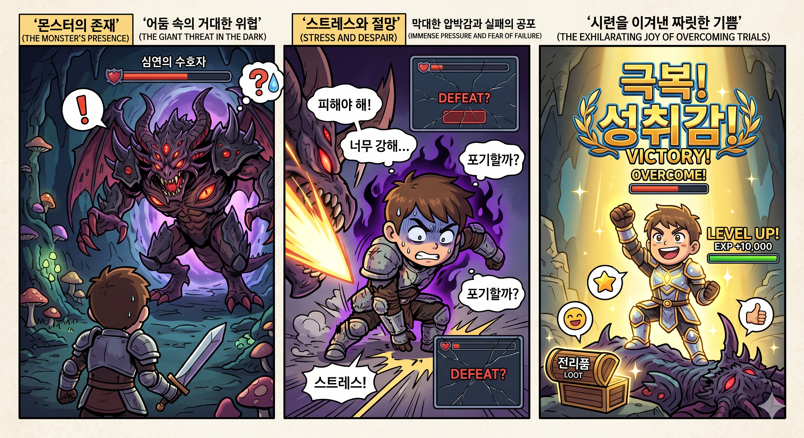
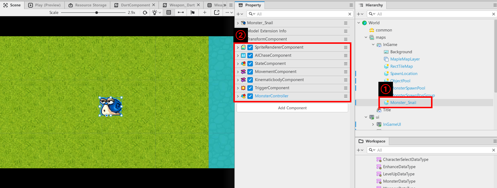
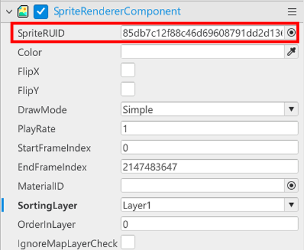
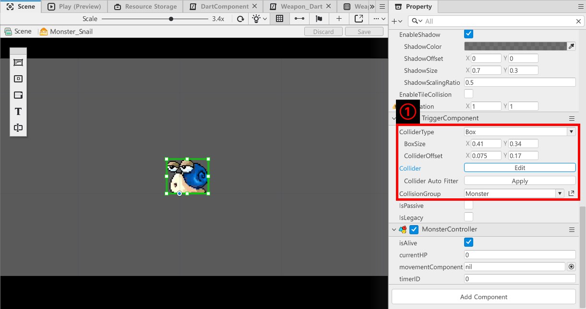
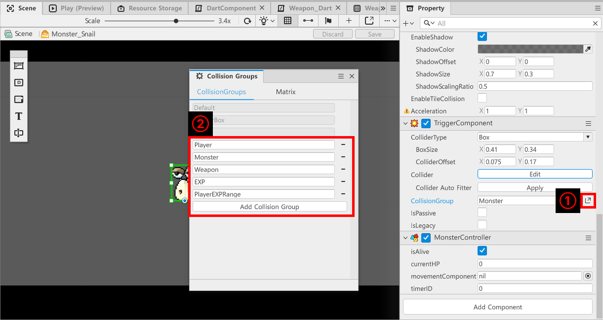
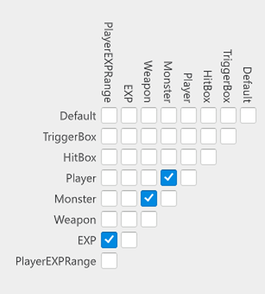
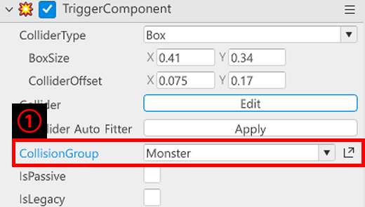
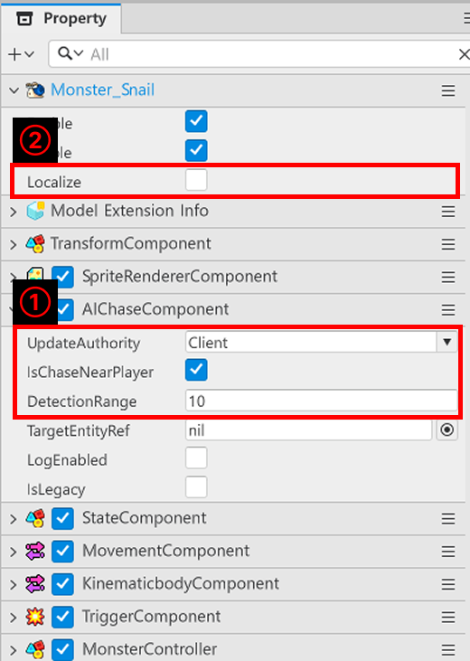
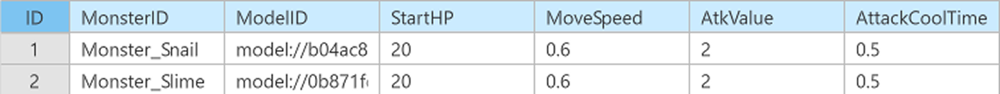
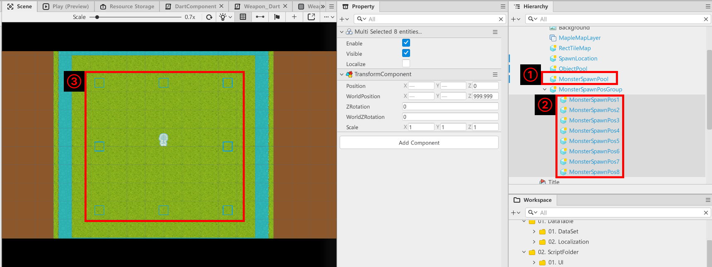

# [💡 基礎學習] 製作怪物系統
<br>
<br>
<br>

## 影片時間軸
- 可在課程影片中以下時間點學習。
- 製作怪物系統：`01:15:55`

<br>

## 學習目標
- 建立怪物的方法。
- 學習生成怪物的方法。
- 學習大量重複利用怪物的最佳化技術，也就是物件池。

<br>

## 觀看該影片後可嘗試執行的內容
- 製作各種怪物，使多樣化的怪物生成在地圖上。
- 製作功能，使各怪物執行各自固有的行為。
- 製作各種生成方法，製作每隔一定時間執行特殊生成的功能。


<br>

---

## 怪物系統

<p align="center">

</p>

> 怪物的存在會給玩家帶來壓力，但也是克服後提供成就感的手段。

- 若遊戲沒有威脅，玩家就會感到無聊。
- 怪物的存在是阻礙玩家生存的障礙物。
- 但擊敗怪物後，玩家會獲得經驗值，並藉此提升等級。
- 另外，若玩家隨著升級而強化，變強的成就感與體感就會作為獎勵發揮作用。

<br>

### 建立怪物

<p align="center">

</p>

- 在「Hierarchy」、「maps」、目前編輯中的地圖建立實體。
- 在製作的實體新增以下Component。

<style type="text/css">
.tg  {border-collapse:collapse;border-spacing:0;}
.tg td{border-color:black;border-style:solid;border-width:1px;font-family:Arial, sans-serif;font-size:14px;
  overflow:hidden;padding:10px 5px;word-break:normal;}
.tg th{border-color:black;border-style:solid;border-width:1px;font-family:Arial, sans-serif;font-size:14px;
  font-weight:normal;overflow:hidden;padding:10px 5px;word-break:normal;}
.tg .tg-cly1{border-color:currentColor;text-align:left;vertical-align:middle}
.tg .tg-xwyw{border-color:currentColor;text-align:center;vertical-align:middle}
.tg .tg-0a7q{border-color:currentColor;text-align:left;vertical-align:middle}
</style>
<table class="tg"><thead>
  <tr>
    <th class="tg-xwyw">名稱</th>
    <th class="tg-xwyw">說明</th>
  </tr></thead>
<tbody>
  <tr>
    <td class="tg-0a7q">SpriteRendererComponent</td>
    <td class="tg-0a7q">用來播放怪物圖片的Component。</td>
  </tr>
  <tr>
    <td class="tg-0a7q">AIChaseComponent</td>
    <td class="tg-0a7q">用來讓怪物能追擊玩家的Component。</td>
  </tr>
  <tr>
    <td class="tg-0a7q">MovementComponent</td>
    <td class="tg-0a7q">用來讓AIChaseComponent移動的Component。</td>
  </tr>
  <tr>
    <td class="tg-cly1">KinematicbodyComponent</td>
    <td class="tg-cly1">用來讓怪物能在RectTileMap的Tile上移動的Component。</td>
  </tr>
  <tr>
    <td class="tg-cly1">TriggerComponent</td>
    <td class="tg-cly1">作為怪物受擊範圍，且當玩家位於該範圍內時，用來對玩家執行攻擊的Component。</td>
  </tr>
  <tr>
    <td class="tg-cly1">MonsterController</td>
    <td class="tg-cly1">用來管理怪物行為與資訊的Component。</td>
  </tr>
</tbody>
</table>

<br>

#### 設定怪物外型、碰撞範圍

<p align="center">

</p>

- 變更**SpriteRendererComponent**的**SpriteRUID**值，登錄為怪物圖片。
- 若難以尋找想要的圖片或動畫，請參考**03.製作玩家攻擊**的**製作攻擊實體**項目中所述的圖片資源搜尋方法來登錄資源。

<p align="center">

</p>

- 調整**TriggerComponent**的**BoxSize**、**ColliderOffset**，依照取得怪物的尺寸修改。
- 也可以按下Edit按鈕，直接修改顯示的Collider。

<br>

#### ⚠️ 設定CollisionGroup
- 遊戲中會發生各種碰撞。
- 但若檢查與所有實體的碰撞，將大幅消耗電腦運算。
- 因此若存在不必要的碰撞運算，就必須將其解除。

<p align="center">

</p>

- 點擊**TriggerComponent**的**CollisionGroup**項目右側按鈕，開啟**Collision Groups**視窗。
- 在**Collision Groups**視窗中，透過Add Collision Group建立新群組並修改名稱。
- 新建立的**Collision Group**如下。

<style type="text/css">
.tg  {border-collapse:collapse;border-spacing:0;}
.tg td{border-color:black;border-style:solid;border-width:1px;font-family:Arial, sans-serif;font-size:14px;
  overflow:hidden;padding:10px 5px;word-break:normal;}
.tg th{border-color:black;border-style:solid;border-width:1px;font-family:Arial, sans-serif;font-size:14px;
  font-weight:normal;overflow:hidden;padding:10px 5px;word-break:normal;}
.tg .tg-cly1{border-color:currentcolor;text-align:left;vertical-align:middle}
.tg .tg-xwyw{border-color:currentcolor;text-align:center;vertical-align:middle}
.tg .tg-0a7q{border-color:currentcolor;text-align:left;vertical-align:middle}
</style>
<table class="tg"><thead>
  <tr>
    <th class="tg-xwyw">名稱</th>
    <th class="tg-xwyw">說明</th>
  </tr></thead>
<tbody>
  <tr>
    <td class="tg-0a7q">Player</td>
    <td class="tg-0a7q">用來檢查玩家角色是否與敵人碰撞的Collision Group。</td>
  </tr>
  <tr>
    <td class="tg-0a7q">Monster</td>
    <td class="tg-0a7q">用來檢查怪物是否與玩家的Weapon或玩家接觸的Collision Group。</td>
  </tr>
  <tr>
    <td class="tg-0a7q">Weapon</td>
    <td class="tg-0a7q">用來運算玩家攻擊是否碰到敵人的Collision Group。</td>
  </tr>
  <tr>
    <td class="tg-cly1">EXP</td>
    <td class="tg-cly1">用來確認經驗值道具是否進入PlayerEXPRange的Collision Group。</td>
  </tr>
  <tr>
    <td class="tg-cly1">PlayerEXPRange</td>
    <td class="tg-cly1">用來指定玩家經驗值道具辨識範圍的Collision Group。</td>
  </tr>
</tbody>
</table>

<br>

<p align="center">

</p>

- 為了指定**CollisionGroup**間的碰撞規則，移動至Matrix後看到的畫面。
- 範例世界中設定的規則如下。
  - 1：Player會與Monster這個CollisionGroup碰撞。
  - 2：Monster會與Weapon這個CollisionGroup碰撞。
  - 3：EXP會與PlayerEXPRange這個CollisionGroup碰撞。

<br>

<p align="center">

</p>

- 接著將附加在怪物上的**TriggerComponent**的**CollisionGroup**值變更為Monster。
- ⚠️ 將前面製作的武器、DefaultPlayer中的所有TriggerComponent的CollisionGruop分別變更為Weapon、Player。

<br>

#### 設定AIChaseComponent

<p align="center">

</p>

- 修改**AIChaseComponent**的值，使怪物能追蹤玩家。
    - **UpdateAuthority**：變更AIChaseComponent執行環境。變更為Client。
    - **IsChaseNearPlayer**：設定怪物是否自動追蹤玩家的值。變更為True。
    - **DetectionRange**：怪物可偵測玩家的範圍。範例世界中設定為10。
    - **Localize**：將管理實體變化的環境變更為Client。變更為True，使AIChaseComponent在Client更新。

<br>

#### 製作怪物Controller

```lua
@Component
script MonsterController extends Component

property boolean isAlive = true

property MonsterDataType monsterData = MonsterDataType()

property number currentHP = 0

property MovementComponent movementComponent = nil

property number timerID = 0

@ExecSpace("ClientOnly")
method void OnBeginPlay()
self:InitDefault()
end

@ExecSpace("ClientOnly")
method void InitDefault()
-- 檢查Monster的MovementComponent是否為nil。
if not isvalid(self.movementComponent) then
	-- 若為nil，則尋找並登錄自身的MovementComponent。
	self.movementComponent = self.Entity.MovementComponent
end
-- 將currentHP設定為0。
self.currentHP = 0
-- 將isAlive狀態轉換為false。
self.isAlive = false
-- 初始化monsterData。
self.monsterData = MonsterDataType()
-- 停用自身的實體狀態。
self.Entity.Enable = false
end

@ExecSpace("ClientOnly")
method void SpawnMonster(MonsterDataType MonsterData, Vector3 WorldSpawnPos)
-- 登錄怪物資訊。
self.monsterData = MonsterData
-- 將目前體力設定為最大體力。
self.currentHP = self.monsterData.StartHP
-- 將怪物的移動速度登錄至movementComponent。
self.movementComponent.InputSpeed = self.monsterData.MoveSpeed
-- 將isAlive狀態轉換為True。
self.isAlive = true
-- 將怪物的實體狀態轉換為使用。
self.Entity.Enable = true
end

@ExecSpace("ClientOnly")
method void GetDamage(number DamageValue)
-- 依照傳入傷害減少currentHP。
self.currentHP = self.currentHP - DamageValue
-- 若currentHP為0以下，則處理為死亡並停用。
if self.currentHP <= 0 then
	-- 向ObjectPool執行實體回傳請求。
	local objectPool = _EntityService:GetEntityByPath("/maps/InGame/ObjectPool")
	-- 向objectPool請求經驗值道具實體。
	local expItem = objectPool.ObjectPoolComponent:ReturnEXPObject()
	-- 將經驗值道具變更至自身位置。
	expItem.TransformComponent.WorldPosition = self.Entity.TransformComponent.WorldPosition
	-- 啟用expItem。
	expItem.Enable = true
	-- 解除所有已登錄的TimerService。
	_TimerService:ClearTimer(self.timerID)
	-- 請求GameLogic計算擊敗的怪物數量。
	_GameLogic:CountKillScore()
	-- 初始化實體狀態。
	self:InitDefault()
end
end

@ExecSpace("ClientOnly")
method void OnEndPlay()
-- 遊戲結束時，解除所有事先預約的TimerService。
_TimerService:ClearTimer(self.timerID)
end

@ExecSpace("ClientOnly")
method void OnUpdate(number delta)
-- 若GameLogic的isPlayingGame為false，則停止移動。
if not _GameLogic.isPlayingGame then
	self.movementComponent.Enable = false
else
	-- 若遊戲進行中，則啟用movementComponent。
	if self.movementComponent.Enable == false then
		self.movementComponent.Enable = true
	end
end
end

@EventSender("Self")
handler HandleTriggerEnterEvent(TriggerEnterEvent event)
-- 檢查碰撞物件是否為玩家。
if event.TriggerBodyEntity.PlayerStatController then
	-- 若碰撞物件為玩家，則取得PlayerStatController。
	local playerStat = event.TriggerBodyEntity.PlayerStatController
	-- 確認玩家是否處於存活狀態。
	if playerStat.isAlive then
		-- 計算要傳遞給玩家的傷害。
		local getDamage = _DamageCalcHelper:CalcDamageByMonsterAttack(self.monsterData.AtkValue)
		-- 若玩家存活，則執行攻擊。
		self.timerID = _TimerService:SetTimerRepeat(function() playerStat:GetDamage(getDamage) end, self.monsterData.AttackCoolTime)
	end
end
end

@EventSender("Self")
handler HandleTriggerLeaveEvent(TriggerLeaveEvent event)
-- 檢查離開的物件是否為玩家。
if event.TriggerBodyEntity.PlayerStatController then
	-- 若玩家離開，則解除已預約的TimerService。
	_TimerService:ClearTimer(self.timerID)
end
end

end
```

> 該程式碼是以Plain Text為基準製作的程式碼。

- 若已完成到此部分，可以將「Hierarchy」中的怪物實體製作為Model後，刪除「Hierarchy」中的怪物。

<br>

### 製作怪物DataSet

<p align="center">

</p>

<style type="text/css">
.tg  {border-collapse:collapse;border-spacing:0;}
.tg td{border-color:black;border-style:solid;border-width:1px;font-family:Arial, sans-serif;font-size:14px;
  overflow:hidden;padding:10px 5px;word-break:normal;}
.tg th{border-color:black;border-style:solid;border-width:1px;font-family:Arial, sans-serif;font-size:14px;
  font-weight:normal;overflow:hidden;padding:10px 5px;word-break:normal;}
.tg .tg-cly1{text-align:currentcolor;vertical-align:middle}
.tg .tg-xwyw{border-color:currentcolor;text-align:center;vertical-align:middle}
.tg .tg-0a7q{border-color:currentcolor;text-align:left;vertical-align:middle}
.tg .tg-0lax{border-color:currentcolor;text-align:left;vertical-align:top}
</style>
<table class="tg"><thead>
  <tr>
    <th class="tg-xwyw">名稱</th>
    <th class="tg-xwyw">說明</th>
  </tr></thead>
<tbody>
  <tr>
    <td class="tg-0a7q">MonsterID</td>
    <td class="tg-0a7q">用來區分怪物的ID值。</td>
  </tr>
  <tr>
    <td class="tg-0a7q">ModelID</td>
    <td class="tg-0a7q">用來登錄怪物Model Entry ID的值。</td>
  </tr>
  <tr>
    <td class="tg-0a7q">StartHP</td>
    <td class="tg-0a7q">用來登錄怪物生成時設定體力的值。</td>
  </tr>
  <tr>
    <td class="tg-cly1">MoveSpeed</td>
    <td class="tg-cly1">用來設定怪物移動速度的值。</td>
  </tr>
  <tr>
    <td class="tg-cly1">AtkValue</td>
    <td class="tg-cly1">用來登錄怪物攻擊力的值。</td>
  </tr>
  <tr>
    <td class="tg-0lax">AttackCoolTime</td>
    <td class="tg-0lax">用來設定怪物攻擊延遲的值。</td>
  </tr>
</tbody>
</table>

- 將前面製作的Monster Entry ID值登錄至ModelID。
- 若已完成DataSet製作，便以先前學習的內容為基礎撰寫MonsterData StructScript。

<br>

## 製作用來管理怪物資料的Logic


```lua
@Logic
script MonsterDataLogic extends Logic

property table monsterData = {}

@ExecSpace("ClientOnly")
method void OnBeginPlay()
self:InitMonsterData()
end

@ExecSpace("ClientOnly")
method void InitMonsterData()
-- 確認monsterData是否為nil。
if not isvalid(self.monsterData) or not next(self.monsterData) then
	-- 若為nil，則取得MonsterData。
	local getData = _DataService:GetTable("MonsterData")
	-- 確認是否正常完成getData。
	if isvalid(getData) then
		-- 取得getData的rowCount。
		local rowCount = getData:GetRowCount()
		-- 依照rowCount遍歷DataSet並取得資料。
		for i = 1, rowCount do
			-- 確認MonsterID值是否正常存在。
			local monsterID = tostring(getData:GetCell(i, "MonsterID"))
			if not _UtilLogic:IsNilorEmptyString(monsterID) then
				-- 若正常存在ID值，則登錄資料。
				local data = MonsterDataType()
				data.MonsterID = monsterID
				data.ModelID = tostring(getData:GetCell(i, "ModelID"))
				data.StartHP = tonumber(getData:GetCell(i, "StartHP"))
				data.AtkValue = tonumber(getData:GetCell(i, "AtkValue"))
				data.AttackCoolTime = tonumber(getData:GetCell(i, "AttackCoolTime"))
				data.MoveSpeed = tonumber(getData:GetCell(i, "MoveSpeed"))
				-- 將完成的資料輸入至monsterData。
				self.monsterData[monsterID] = data
			end
		end
	end
end
end

@ExecSpace("ClientOnly")
method MonsterDataType GetMonsterDataByMonsterID(string MonsterID)
-- 確認monsterData中是否存在以MonsterID作為Key的值。
if isvalid(self.monsterData[MonsterID]) then
	-- 回傳以MonsterID作為Key的值。
	return self.monsterData[MonsterID]
end
end

end
```

> 該程式碼是以Plain Text為基準編寫而成。

<br>

## 生成怪物

<p align="center">

</p>

- 製作負責怪物生成的**MonsterSpawnPool**，以及用來指定怪物生成位置的**MonsterSpawnPos**。
- **MonsterSpawnPool**配置在遊戲進行地圖的中央。
- 將**MonsterSpawnPos**配置在希望怪物生成的位置。
- 完成**MonsterSpawnPos**配置後，登錄至**MonsterSpawnPos**。 
- 在**MonsterSpawnPool**實體新增**MonsterSpawnPool **Component。

```lua
@Component
script MonsterSpawnPool extends Component

property table monsterSpawnPos = {}

property Entity monsterSpawnPosGroup = "b9c76cf1-8e3f-4db4-a133-5786869c73aa"

property string spawnMonsterID = "Monster_Snail"

property MonsterDataType spawnMonsterData = MonsterDataType()

property table monsterEntityTable = {}

property number createMonsterCount = 10

property number timerID = 0

property table spawnMonsterList = {"Monster_Snail", "Monster_Slime"}

property number spawnMonsterListCount = 0

@ExecSpace("ClientOnly")
method void OnBeginPlay()
-- 取得怪物的生成位置。
self:InitSpawnPosition()
-- 取得怪物資訊。
self:InitMonsterData()
end

@ExecSpace("ClientOnly")
method void InitSpawnPosition()
-- 檢查monsterSpawnPos是否為nil狀態。
if not isvalid(self.monsterSpawnPos) or not next(self.monsterSpawnPos) then
	-- 若為nil狀態，則判斷需要初始化並嘗試初始化。
	local PosCount = self.monsterSpawnPosGroup.Children.Count
	-- 依照PosCount重複執行。
	for i = 1, PosCount do
		-- 尋找從MonsterSpawnPos1開始，依照PosCount數量命名的實體。
		local findPosEntity = self.monsterSpawnPosGroup:GetChildByName("MonsterSpawnPos"..i)
		-- 若正常取得值，則登錄至monsterSpawnPos。
		if isvalid(findPosEntity) then
			self.monsterSpawnPos[i] = findPosEntity
		end
	end
end
end

@ExecSpace("ClientOnly")
method void InitMonsterData()
-- 依照spawnMonsterID值取得怪物資訊。
self.spawnMonsterData = _MonsterDataLogic:GetMonsterDataByMonsterID(self.spawnMonsterID)
self.spawnMonsterListCount = 1
end

@ExecSpace("ClientOnly")
method void SpawnMonster()
-- 從monsterEntityTable中取得以spawnMonsterID作為Key的值。
local monsterList = self.monsterEntityTable[self.spawnMonsterID]
-- 若monsterList無法使用，則執行ExpandMonsterPool。
if not monsterList then 
	self:ExpandMonsterPool()
	-- 以完成額外生成的monsterList為基準重新登錄。
	monsterList = self.monsterEntityTable[self.spawnMonsterID]
end
-- 收集目前池中可使用的(Enable = false)怪物。
local availableMonsters = {}
for _, entity in ipairs(monsterList) do
	-- 若為可使用實體，則取得實體。
	if isvalid(entity) and entity.Enable == false then
		-- 將找到的實體新增至availableMonster。
		table.insert(availableMonsters, entity)
	end
end

-- 若可使用怪物不足，則額外生成。
if #availableMonsters < #self.monsterSpawnPos then
	self:ExpandMonsterPool()
	-- 額外生成怪物後，再次嘗試收集。
	availableMonsters = {}
	-- 依照新建立的值初始化monsterList。
	monsterList = self.monsterEntityTable[self.spawnMonsterID]
	-- 重新開始遍歷，尋找可使用實體。
	for _, entity in ipairs(monsterList) do
		if isvalid(entity) and entity.Enable == false then
			table.insert(availableMonsters, entity)
		end
	end
end
-- 依照monsterSpawnPos的數量與要生成的隻數(9隻)中較小的數量啟用。
local posCount = #self.monsterSpawnPos
-- 計算怪物的生成數量。
local spawnCount = math.min(#self.monsterSpawnPos, posCount, #availableMonsters)
-- 依照spawnCount數量啟用怪物。
for i = 1, spawnCount do
	local monster = availableMonsters[i]
	local spawnPos = self.monsterSpawnPos[i].TransformComponent.WorldPosition
	monster.TransformComponent.WorldPosition = spawnPos
	monster.Enable = true
	monster.MonsterController:SpawnMonster(self.spawnMonsterData, self.monsterSpawnPos[i])
end
-- 將下次召喚怪物的資訊變更為下一個怪物。
self:UpdateNextMonster()
end

@ExecSpace("ClientOnly")
method void ResetSpawnPool()
-- 確認monsterEntityTable中是否存在實體。
if not isvalid(self.monsterEntityTable) or not next(self.monsterEntityTable) then
	self:ExpandMonsterPool()
end
end

@ExecSpace("ClientOnly")
method void ClearSpawnPool()
-- 確認self.monsterEntityTable[self.spawnMonsterID]是否不為nil且是否為有效table。
if isvalid(self.monsterEntityTable[self.spawnMonsterID]) then
    local getList = self.monsterEntityTable[self.spawnMonsterID]
    
    -- 資料表的索引從1開始，因此包含#getList，從後往前遍歷較安全。
    for i = #getList, 1, -1 do
        local entity = getList[i]
        
        -- 再次檢查entity是否有效後銷毀。
        if isvalid(entity) then
            _EntityService:Destroy(entity)
        end
    end
end
-- 解除事先預約的Timer。
_TimerService:ClearTimer(self.timerID)
end

@ExecSpace("ClientOnly")
method void ExpandMonsterPool()
-- 若monsterEntityTable中沒有以spawnMonsterID作為Key，則初始化。
if not self.monsterEntityTable[self.spawnMonsterID] then
	self.monsterEntityTable[self.spawnMonsterID] = {}
end
-- 依照需要生成的怪物數量生成Model。
for i = 1, self.createMonsterCount do
	local createModel = _SpawnService:SpawnByModelId(
	self.spawnMonsterData.ModelID, 
	self.spawnMonsterID, 
	self.Entity.TransformComponent.WorldPosition, 
	self.Entity)
	if isvalid(createModel) then
		createModel.Enable = false -- 生成時以停用狀態登錄至池中
		table.insert(self.monsterEntityTable[self.spawnMonsterID], createModel)
	end
end
end

@ExecSpace("ClientOnly")
method void OnEndPlay()
-- 遊戲結束時，解除所有已預約的Timer。
_TimerService:ClearTimer(self.timerID)
end

@ExecSpace("ClientOnly")
method void UpdateNextMonster()
-- 將spawnMonsterListCount增加1。
self.spawnMonsterListCount = self.spawnMonsterListCount + 1
-- 若目前spawnMonsterListCount大於spawnMonsterList，則回到1。
if self.spawnMonsterListCount > #self.spawnMonsterList then
	self.spawnMonsterListCount = 1
end
-- 以更新後的spawnMonsterList初始化資訊。
self.spawnMonsterID = self.spawnMonsterList[self.spawnMonsterListCount]
self.spawnMonsterData = _MonsterDataLogic:GetMonsterDataByMonsterID(self.spawnMonsterList[self.spawnMonsterListCount])
end

@EventSender("LocalPlayer")
handler HandleEntityMapChangedEvent(EntityMapChangedEvent event)
if event.NewMap.Name == "InGame" then
	-- 取得怪物的生成位置。
	self:InitSpawnPosition()
	-- 取得怪物資訊。
	self:InitMonsterData()
	-- 判斷玩家已進入地圖並嘗試初始化。
	self:ResetSpawnPool()
	-- 生成怪物並設定Timer，使遊戲開始。
	self.timerID = _TimerService:SetTimerRepeat(self.SpawnMonster, 5.0)
else
	self:ClearSpawnPool()
end

end

end
```

> 該程式碼是以Plain Text為基準編寫而成。

- **spawnMonsterList**的值會依照MonsterData中登錄的MonsterID值新增。
- **createMonsterCount**是詢問需要生成實體時，一次要生成幾個實體的值。
- 目前輸入為10，因此一次會生成10個怪物實體，並回傳其中可使用的實體來使用。
- 若將**createMonsterCount**的值增加為20，則一次會生成20個。

<br>

## DamageCalcHelper的存在
- 當玩家與怪物造成傷害時，對方必須知道傷害計算所需的對方資訊。
- 但若所有物件都知道玩家，且玩家也知道所有怪物資訊，依賴性問題會變得很強。
- 為了解決這類問題，會使用只傳遞必要資訊並提供計算結果值的**DamageCalcHelper**。
- **DamageCalcHelper**是以**Logic**製作而成。

```lua
@Logic
script DamageCalcHelper extends Logic

property PlayerStatController playerStat = nil

@ExecSpace("ClientOnly")
method void OnBeginPlay()
-- 若playerStat為nil，則取得玩家的PlayerStatController Component。
if not isvalid(self.playerStat) then
	self.playerStat = _UserService.LocalPlayer.PlayerStatController
end
end

@ExecSpace("ClientOnly")
method number CalcDamageByPlayerAttack(number WeaponDamage)
-- 加總玩家攻擊力與武器攻擊力。
local resultDamage = self.playerStat.playerAtk + WeaponDamage
-- 回傳加總後的結果值。
return resultDamage
end

@ExecSpace("ClientOnly")
method number CalcDamageByMonsterAttack(number MonsterDamage)
-- 從怪物攻擊力中扣除玩家防禦力。
local calcDamage = MonsterDamage - self.playerStat.def
-- 若結果值低於0，則將calcDamage轉換為0。
if calcDamage < 0 then
	calcDamage = 0
end
-- 回傳計算後的結果值。
return calcDamage
end

end
```

- 透過**DamageCalcHelper**傳遞攻擊力後，便會依照指定公式回傳結果。
- 之後若依照強化項目或武器選項需要各種計算式，或需要變更傷害計算式，只要修改**DamageCalcHelper**即可解決。

---

<br>

## 最低製作標準
- 怪物會在指定位置，以一定時間生成。
- 怪物會追蹤玩家，若玩家位於範圍內，便會每隔一定時間執行攻擊。

<br>

## 應用與進階應用
- 在地圖上生成各種怪物。
- 建立關卡系統，製作讓每個關卡可生成不同敵人的功能。
- 製作每隔一定時間以不同方式生成怪物。