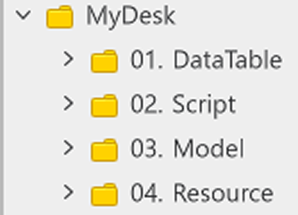

# Idle Genre Learning Guide Document
 
 
 

## Learning Goals

- Learn how to implement core idle game functions using the guide document and the sample world.
- Learn how to use TimeService to execute repetitive processes at regular intervals.
- Create and use the object pool technique and learn about the pros and cons of the object pool.
- Modify and create a world in the form of your choosing.

 

## Learning Core Functions

- **Understanding TimerService**: Learn about TimerService, which can execute functions based on a set time in MapleStory Worlds.
- **Understanding the Object Pool**: Understand the object pool technique that is used to optimize the game and learn how to utilize it.

 

## Folder Composition

<table class="tg"><thead>
  <tr>
    <th class="tg-nrix">Number</th>
    <th class="tg-xwyw">Name</th>
    <th class="tg-xwyw">Description</th>
  </tr></thead>
<tbody>
  <tr>
    <td class="tg-baqh">1</td>
    <td class="tg-0a7q">DataTable</td>
    <td class="tg-0a7q">The folder that contains the DataSet needed to compose the sample world.</td>
  </tr>
  <tr>
    <td class="tg-baqh">2</td>
    <td class="tg-0a7q">Script</td>
    <td class="tg-0a7q">The folder that contains the elements related to the Script such as Components and Logic.</td>
  </tr>
  <tr>
    <td class="tg-baqh">3</td>
    <td class="tg-0a7q">Model</td>
    <td class="tg-0a7q">The folder that manages the Models that were created in advance, like characters and monsters.</td>
  </tr>
  <tr>
    <td class="tg-baqh">4</td>
    <td class="tg-lboi">Resource</td>
    <td class="tg-lboi">The folder that manages the resources that will be used when creating the world.</td>
  </tr>
</tbody>
</table>

 

## Implementation Order

- 💡 **Basic Training**: These are the training materials for the most basic functions for MapleStory Worlds or for the relevant genre.
- 📖 **Advanced Training**: This category of training is for learning and implementing functions visible in the sample world. Using these materials can expand the functions for the genre and understanding of the training materials.

 

### [💡 Basic Training] Map Placement

- Learn how to exchange maps in MapleStory Worlds.
- Learn how to create a map using RectTileMap.
- Learn how to manage entities by using an entity's hierarchical structure.

 

### [💡 Basic Training] Creating Characters

- Learn how to create a DataSet to compose a character and create one.
- Create a Logic to use character information.
- Learn how to create and use a character Model.
- Implement a function so that a character can be moved to another slot.
- Implement a summoning function for testing.

 

### [💡 Basic Training] Creating Monsters

- Learn how to create a DataSet for managing monster information and then create one.
- Implement a function that can load monster information through Logic.
- Implement a function that uses a Model to summon multiples of the same monster.
- Implement a function that allows a monster to move down a set path.

 

### [💡 Basic Training] Implementing Character Attacks

- Implement a function that allows the character to detect monsters within a set range and register them as attack targets.
- Implement a function that allows the character to attack monsters to then deal damage.
- Implement a function that allows characters to use skills.
- Implement a function that allows characters to make attacks at regular intervals.

 

### [💡 Basic Training] Spawning Monsters

- Create a DataSet that manages monster spawns.
- Implement a function that allows monsters to be spawned in accordance with the created DataSet.

 

### [💡 Basic Training] Creating an Object Pool

- Understand the theory behind the object pool technique and how it functions.
- Learn the benefits of using object pools and what you should be careful of.

 

### [💡 Basic Training] Implementing a Summon System

- Implement buttons and functions that allows for players to summon characters.
- Change the function so that the currency and summons are verified to prevent infinite character summons.
- Change the function so that defeated monsters drop currency, making additional summons possible.

 

### [📖 Advanced Training] Implementing Saves and Loading

- Implement a function that can save a player's high score.
- Implement a function that can load a player's high score.
- Learn how to load information using DataStorageService.

 

### [📖 Advanced Training] Implementing Offline Rewards

- Implement a function that compares a player's last login time and the current time.
- Implement a function that can distribute currency based on a specified equation.

 

### [💡 Basic Training] Implementing UI

- Learn how to implement UI.
- Compose a UI that displays the currency a player needs to summon units and how much of the currency a player owns.
- Learn how to create the results UI.
- Learn how to create the information UI related to the current wave.
- Learn how to implement a timer UI that shows the remaining time.