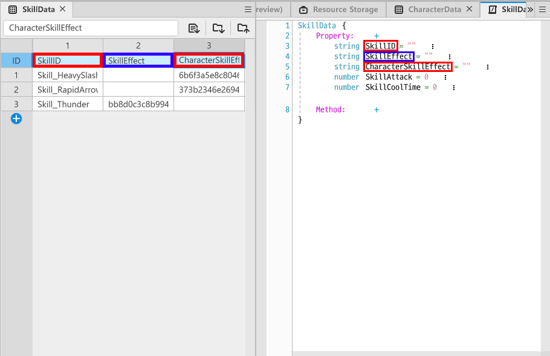

# [💡 Basic Training] Implementing Character Attacks
<br>
<br>
<br>

## Video Timeline
- You can follow along by using the timeline under the training video.
- Understanding Map Types: `00:56:53`

<br>

## Learning Goals

- Implement a function that allows the character to detect monsters within a set range and register them as attack targets.
- Implement a function that allows the character to attack monsters to then deal damage.
- Implement a function that allows characters to use skills.
- Implement a function that allows characters to make attacks at regular intervals.

<br>

## Practical Exercises to Do After Watching the Video

- The character can execute an attack against a monster.
- The character skill can change based on the value changes in the data table.

<br>

## Creating Skill Data

- Create a DataSet, so a character can use skills.
- Compose it in a way that ensures inputting a value as a SkillData item for the previously-created CharacterData DataSet will change the skill.
- Design a structure so that character skills can be assigned by simply editing the DataSet.

<br>

### DataSet Composition Elements
- `SkillID`
    - The value that distinguishes skills.
    - This value is used by inputting it into the SkillData of CharacterData DataSet.
- `SkillEffect`
    - The effect that is output at the enemy's position when the character uses a skill on an enemy.
    - The value needed to register a skill's effect resource ID.
- `CharacterSkillEffect`
    - The effect that is output to the character when the character uses a skill on an enemy.
    - The value needed to register a skill's effect resource ID.
- `SkillAttack`
    - The value needed to set a skill's attack power.
- `SkillCoolTime`
    - The value needed to set a skill's cooldown.

<br>

### Creating a StructType

<p align="center">

</p>

- Create a StructType with the same name as the SkillData's DataSet.
- In the sample world, the StructType is created to have the same name as DataSet.

<br>

## Exploring the Character's Attack Script

- Manage whether a monster is within or outside of a character's attack range using the character's Event Handler.
- The following is the UnitController Component code that manages a character.

```lua
@ExecSpace("ClientOnly")
@EventSender("Self")
handler HandleTriggerEnterEvent(TriggerEnterEvent event)
-- Registers an entity that entered the collision area if it is CollisionGroups or Monster.
if event.TriggerBodyEntity.TriggerComponent.CollisionGroup == CollisionGroups.Monster then
	if #self.enemyTable >= 1 then
		local isAlreadyHave = false
		for i = 1, #self.enemyTable do
			if self.enemyTable[i] == event.TriggerBodyEntity then
				isAlreadyHave = true
				break
			end
		end
		if isAlreadyHave == false then
			table.insert(self.enemyTable, event.TriggerBodyEntity)
		end
	else
		table.insert(self.enemyTable, event.TriggerBodyEntity)
	end
end
end

@ExecSpace("ClientOnly")
@EventSender("Self")
handler HandleTriggerLeaveEvent(TriggerLeaveEvent event)
-- If the entity that leaves the collision area is a Monster, it is removed from the attack list.
if event.TriggerBodyEntity.TriggerComponent.CollisionGroup == CollisionGroups.Monster then
	if #self.enemyTable >= 1 then
		local listCount = #self.enemyTable
		for i = listCount, 1, -1 do
			if self.enemyTable[i] == event.TriggerBodyEntity then
				table.remove(self.enemyTable, i)
				break
			end
		end
	end
end
end
```

> This code is written based on Plain Text.

- Checks if the monster has entered the character's attack range using `HandleTriggerEnterEvent` .
- If the monster is determined to have left the attack range with `HandleTriggerExitEvent`, it is removed from the attack list.

```lua
@ExecSpace("ClientOnly")
method void OnUpdate(number delta)
-- Delta time is always added without conditions.
self.skillDelta = self.skillDelta + delta
self.basicAtkDelta = self.basicAtkDelta + delta

-- Executes the skill attack after checking the skill attack cooldown if the conditions are met.
if self.skillDelta >= self.characterSkillData.SkillCoolTime then
	self:SkillAttack()
end

-- If the skill attack is successful and the cooldown has been reset to 0, the basic attack is skipped for this frame.
if self.skillDelta == 0 then
	return
end

-- Executes the basic attack after checking the basic attack cooldown if the conditions are met.
if self.basicAtkDelta >= self.characterData.BasicAttackCoolTime then
	self:BasicAttack()
end
end

@ExecSpace("ClientOnly")
method void BasicAttack()
-- Loads the character's StateComponent.
local bodySelector = self.Entity.StateComponent
-- Loads the character's current state name.
local currentState = bodySelector.CurrentStateName
-- Does not execute the basic attack if the current state isn't IDLE.
if currentState ~= "IDLE" then
	return
end
---@type Entity
local targetEntity = nil
-- Iterates the table in reverse and safely removes invalid entities.
for i = #self.enemyTable, 1, -1 do
	local enemy = self.enemyTable[i]
	-- Checks whether the entity still exists in the world.
	if isvalid(enemy) then
		-- Checks whether MonsterController exists in the entity and whether it's still alive.
		if enemy.MonsterController and enemy.MonsterController.isAlive then
			targetEntity = enemy
			break
		end
	else
		-- If the entity is already destroyed, it is removed from the table.
		table.remove(self.enemyTable, i)
	end
end
-- If the specified targetEntity is unusable, the attack isn't executed.
if not isvalid(targetEntity) then
	return
end
-- Sets the basicAtkDelta value as 0, assuming that the attack was executed.
self.basicAtkDelta = 0
-- Creates and delivers event to play the attack animation.
local event = ActionStateChangedEvent(self.characterData.AttackAnimationID, self.characterData.AttackAnimationID, 1, SpriteAnimClipPlayType.Onetime)
self.avatarBodyComponent:SendEvent(event)
-- Plays the character effect if there is one that needs to be displayed.
if not _UtilLogic:IsNilorEmptyString(self.characterData.BasicAttackEffectID) then
	_EffectService:PlayEffect(self.characterData.BasicAttackEffectID, self.Entity, self.Entity.TransformComponent.WorldPosition, 0, Vector3.one)	
end
-- Plays the effect that plays on the enemy if there is one that needs to be displayed.
if not _UtilLogic:IsNilorEmptyString(self.characterData.BasicAttackHitEffectID) then
	_EffectService:PlayEffect(self.characterData.BasicAttackHitEffectID, targetEntity, targetEntity.TransformComponent.WorldPosition, 0, Vector3.one)		
end
-- Requests the execution of GetDamage through the MonsterController of the enemy that became the target.
targetEntity.MonsterController:GetDamage(self.characterData.BasicAttackValue)
end

@ExecSpace("ClientOnly")
method void SkillAttack()
-- Searches for and registers bodySelector that is needed for playing the animation.
local bodySelector = self.Entity.StateComponent
-- Registers CurrentStateName to search for the current state.
local currentState = bodySelector.CurrentStateName
-- Halts code execution if the current state isn't IDLE.
if currentState ~= "IDLE" then
	return
end
---@type Entity
local targetEntity = nil
-- Iterates the table in reverse and safely removes invalid entities.
for i = #self.enemyTable, 1, -1 do
	local enemy = self.enemyTable[i]
	if isvalid(enemy) then
		if enemy.MonsterController and enemy.MonsterController.isAlive then
			targetEntity = enemy
			break
		end
	else
		table.remove(self.enemyTable, i)
	end
end
-- Halts code execution if targetEntity is nil.
if not isvalid(targetEntity) then
	return
end
-- Resets the skillDelta value to 0, assuming that the skill was successfully used.
self.skillDelta = 0
-- Plays attack animation.
local event = ActionStateChangedEvent(self.characterData.AttackAnimationID, self.characterData.AttackAnimationID, 1, SpriteAnimClipPlayType.Onetime)
self.avatarBodyComponent:SendEvent(event)
-- Plays an effect if there is one that needs to be played to itself when a skill is used.
if not _UtilLogic:IsNilorEmptyString(self.characterSkillData.CharacterSkillEffect) then
	_EffectService:PlayEffect(self.characterSkillData.CharacterSkillEffect, self.Entity, self.Entity.TransformComponent.WorldPosition, 0, Vector3.one)	
end
-- Plays an effect if there is one that needs to be played to the target that is hit.
if not _UtilLogic:IsNilorEmptyString(self.characterSkillData.SkillEffect) then
	_EffectService:PlayEffect(self.characterSkillData.SkillEffect, targetEntity, targetEntity.TransformComponent.WorldPosition, 0, Vector3.one)		
end
-- Requests that the MonsterController of the targetEntity that became the target executes GetDamage.
targetEntity.MonsterController:GetDamage(self.characterSkillData.SkillAttack)
end
```

> This code is written based on Plain Text.

- Calculates the basic attack cooldown and skill attack cooldown using OnUpdate.
- Prioritizes the skill attack if the skill cooldown reaches a set time.
- If the skill attack is currently being executed, the basic attack is processed as an exception, so it doesn't trigger.
- If the skill attack is on cooldown and a basic attack is available, the basic attack occurs.

<br>

## Exploring when Monsters Get Hit

- In MonsterController, which controls monster activity, there is a Method that is called when a monster is hit.
- This code is the MonsterController's code.

```lua
@ExecSpace("ClientOnly")
method void GetDamage(number AtkValue)
-- Displays damage taken.
_DamageSkinService:Play(self.Entity, "3271c3e79bf04ecba9a107d55495970d", 0.05, {AtkValue}, DamageSkinTweenType.Default, false)
-- Decreases the current by HP by the received damage.
self.currentHP = self.currentHP - AtkValue
-- Proceeds with the defeat-related processing if the current HP is 0 or lower.
if self.currentHP <= 0 then
	-- Resets to 0 to prevent overflow.
	self.currentHP = 0
	-- Changes the current survival state to false.
	self.isAlive = false
	-- Stops the monster's movement.
	self.tweenLineComponent:Pause()
	-- Changes the monster's animation to death.
	self.monsterSpriteRenderer.SpriteRUID = self.dieAnimationKey
	-- Resets the HPBar size to 0.
	self.hpBar.TransformComponent.Scale.x = 0
	-- Directs MonsterSpawnManager to decrease the number remaining since it was defeated.
	self.spawnController:UpdateRemainMonsterCount(-1)
	-- Directs GameLogic to increase summon tokens by 1.
	_GameLogic:UpdateSummonTokken(1)
else
	-- Applies the calculated value, so the UI is modified to fit the set size in exceptional cases.
	self.hpBar.TransformComponent.Scale.x = self.currentHP / self.monsterData.StartHP * 20
end
end
```

> This code is written based on Plain Text.

- The damage dealt by the character is received from AtkValue.
- The HP is decreased by the amount of damage received.
- When the current HP is 0, the death-related processing takes place.
- The remaining HP is displayed by decreasing the HPBar.

<br>

## Minimum Implementation Standards

- The character is able to detect and attack monsters.
- The monster's state can be converted between alive and dead based on damage calculation.
- The character can make attacks using skills.

<br>

## Usage and Extension Direction

- Create a character skill that has an area-type attack that attacks enemies that are within range.
- Enhance the visual and auditory effect by changing the output of sound and effect for the character's attack.
- Set a function, to ensure the attack prioritizes the monster that is closest to the character.