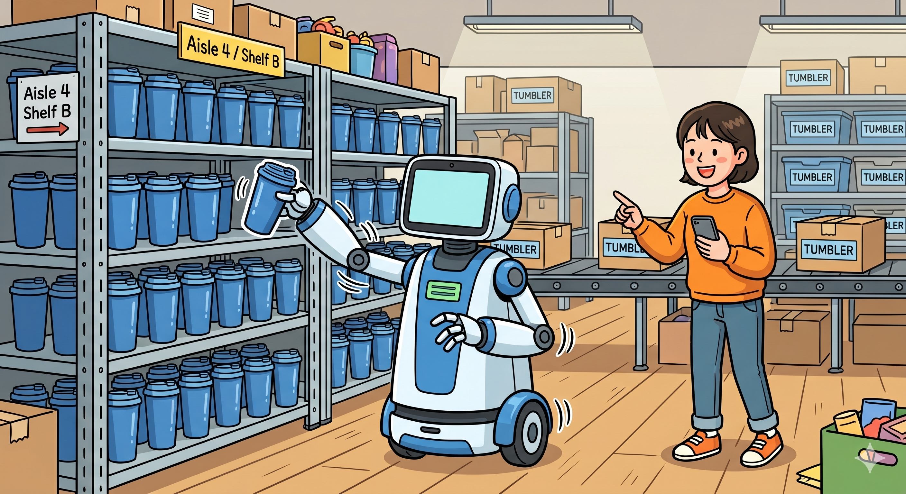
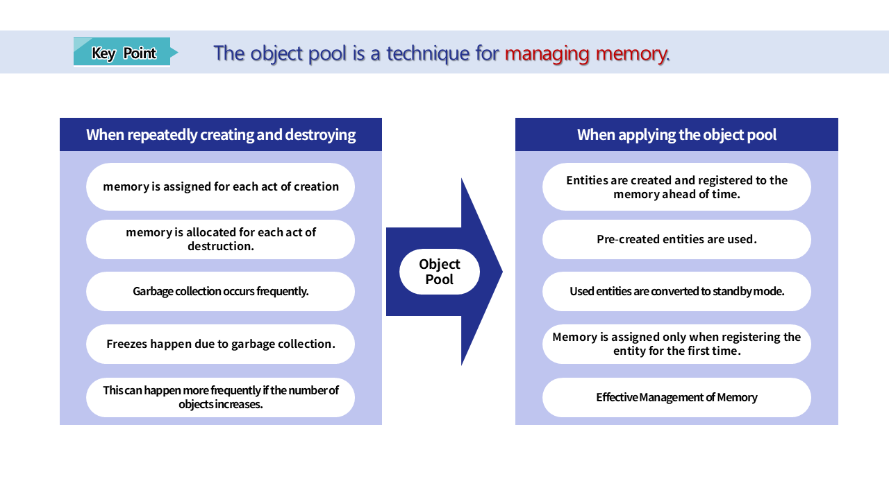
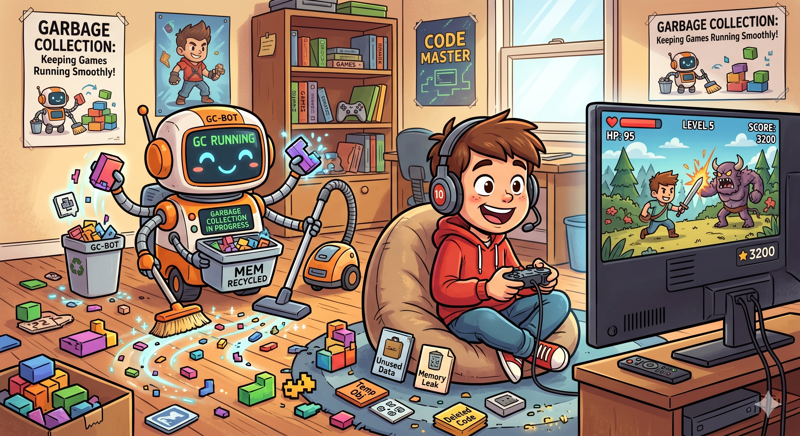
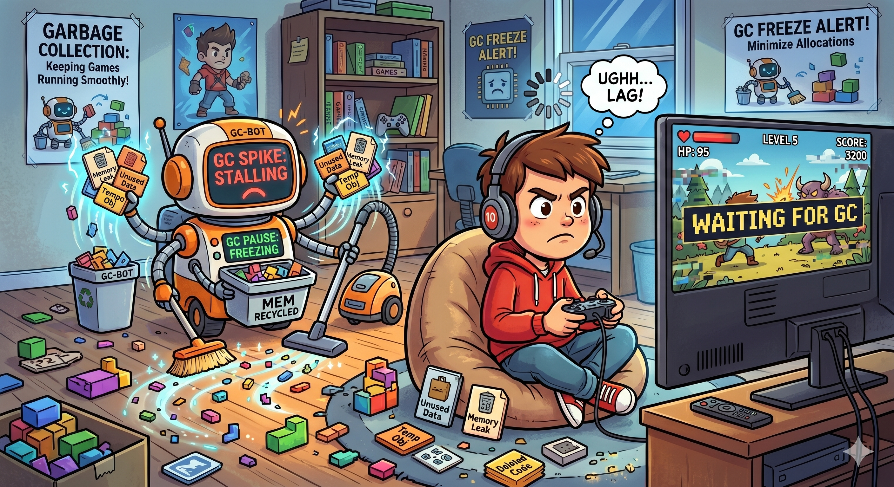
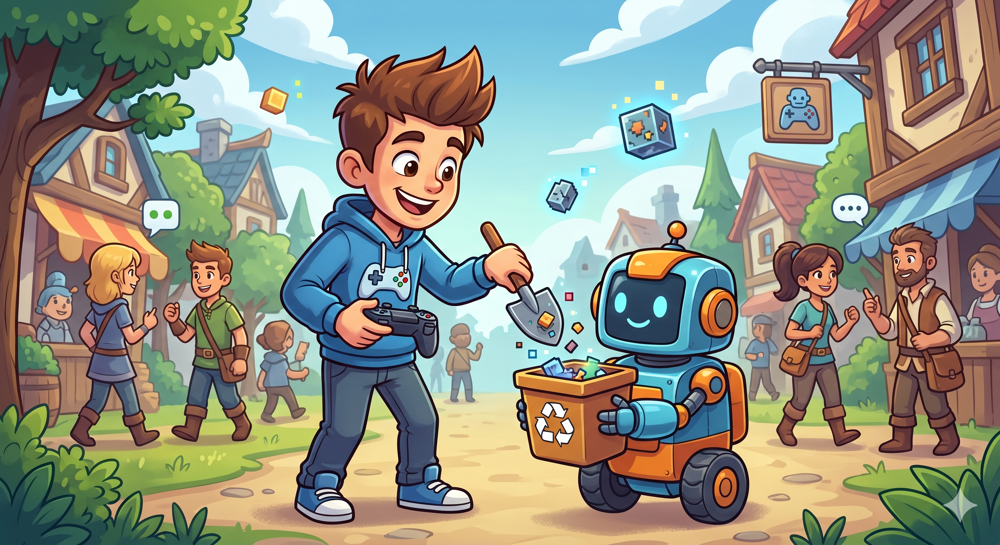
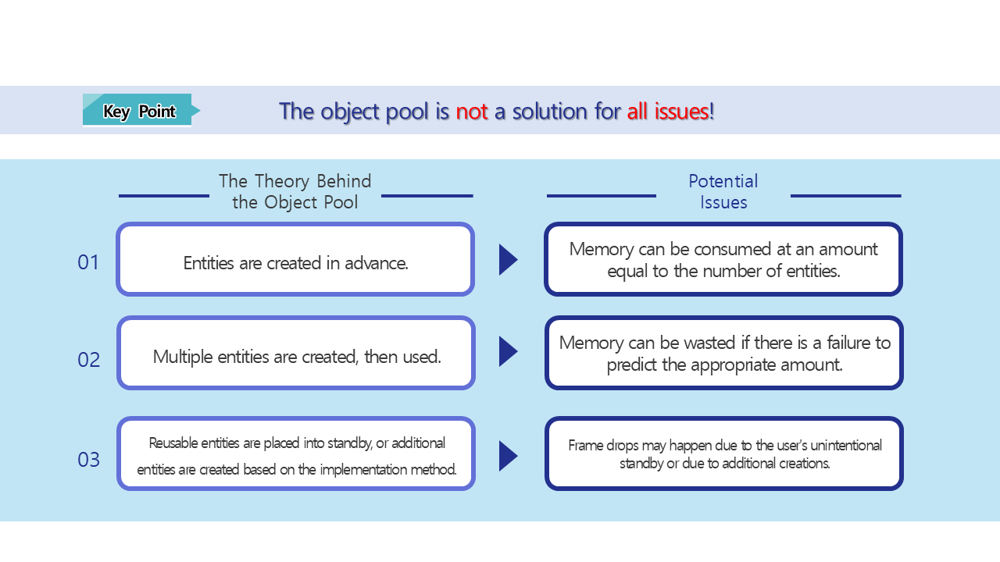

# [💡Basic Training] Creating an Object Pool
 
 
 

## Video Timeline
- You can follow along by using the timeline under the training video.
- Understanding Map Types: `01:10:50`

 

## Learning Goals
- Understand the theory behind the object pool technique and how it functions.
- Learn the benefits of using object pools and what you should be careful of.

 

## Practical Exercises to Do After Watching the Video

- Understand what object pools are and how to use them.
- Optimize the number of entities that must be created for a world in progress for optimization.

 

## What is an Object Pool?

- The object pool is a technique of creating the same entities **in advance**.
- If the same entity needs to be used repeatedly, the entity that is saved in the object poll will be used.
- The used entities will then be converted to **standby** in the object pool for later use.

 

## Strengths of the Object Pool

- **Improved Performance**
    - Creating and destroying objects each time repeatedly will cause the CPU to overload.
    - The higher the number of objects being created and destroyed, the more the CPU becomes overburdened, leading to framerate drops.
    - The object pool can load previously-created objects and save them again, which lowers the burden placed on the CPU that usually comes with creation and destruction.
- **Fast Activation and Deactivation**
    - Since previously-created objects are being turned on and off, it will be faster than creating and destroying objects.
- **Reduction in Garbage Collection (GC)**
    - When an object is destroyed, it leaves behind unnecessary memory.
    - Repeated creation and destruction, therefore, necessitates garbage collection very frequently.
    - The object pool reduces the amount of times garbage collection is called.
    - The less times garbage collection is called, the better the performance of the world.
- **Optimization of Memory Management**
    - The object pool places any objects into the memory for use.
    - As such, the memory usage becomes easier to predict, and it can easily prevent memory fragmentation.

 

### What is Garbage Collection (GC)?

- Garbage collection is an automatic function that removes objects that are part of an unused heap.
- By deleting unused objects, it secures more memory space.
- Garbage collection serves the role of preventing unnecessary memory usage.

- The thread is halted while garbage collection (GC) takes place, which can cause a decrease in performance.
- Also, the larger the memory that needs cleaning, the longer that standby time becomes.
- The longer the time the player has to wait while the world is running, the more inconvenient it will be for them.

- So it is imperative to minimize unnecessary memory usage rather than relying on garbage collection (GC) when it comes to memory management.
- When it comes to small amounts of memory, there isn't much for garbage collection (GC) to handle, so the game's performance can be greatly improved.

 

## Weaknesses of the Object Pool

- **Memory Usage from Object Registration**
    - The object pool creates object in advance and registers them to memory.
    - If an object is registered but isn't used, then it will only exist in the memory without ever being used, which means there is an unnecessary memory drain.
    - The more there are of these kinds of objects, the more memory will be wasted.
- **Using an Appropriate Amount**
    - The number of entities that are created to create an object pool must be appropriately controlled.
    - To achieve this, you need to predict the amount that will be used in the game and then consider if they will be frequently re-used and create accordingly.
- **Weaknesses to Exceptions**
    - If you fail to predict the amount of entities that should be used, then you may run into issues depending on implementation status.
        - Example: There are no usable objects in the object pool.
            - Stand by until a usable object appears.
            - Additionally create a new object.
    - If the object pool is placed on standby until a usable object appears, it may make the user's experience uncomfortable.
    - If a new object is created, it will increase the CPU usage, which can then lead to the game's performance dropping.
    - So the appropriate control of the amount is the most important aspect.

## The Usage State of the Sample World Object Pool

- Calling a monster will require a monster that exists in the object pool.
- If there are no monsters in the object pool, the object pool will create a monster.
- If there is a usable monster later, it will return a usable object.

 

## Minimum Implementation Standards
- The object pool must be able to manage monsters.
- If there is no usable object, then it should be able to create an additional object for use.

 

## Usage and Extension Direction
- Compose a function so that it is created in the object pool for use when the world starts.
- Create only the appropriate amount of monsters or characters so not too much memory is used.
- Edit the world, so additional loading won't be necessary after accessing the world through combined use with the resource loading function.