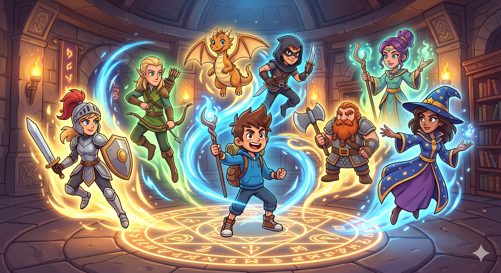
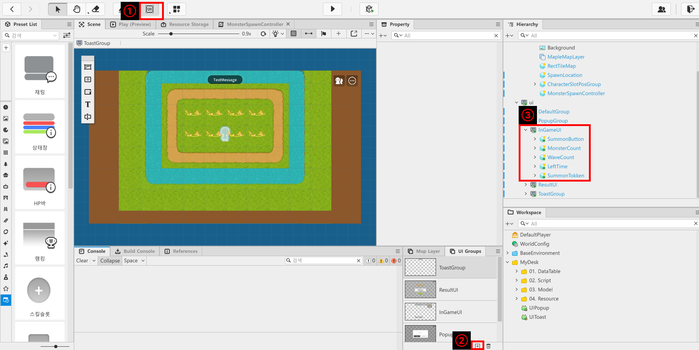
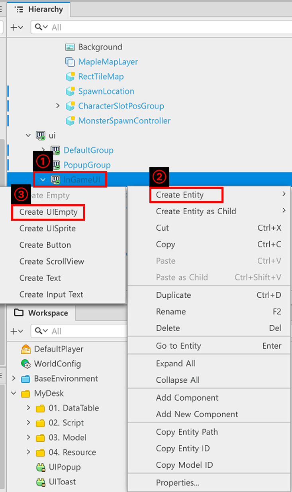
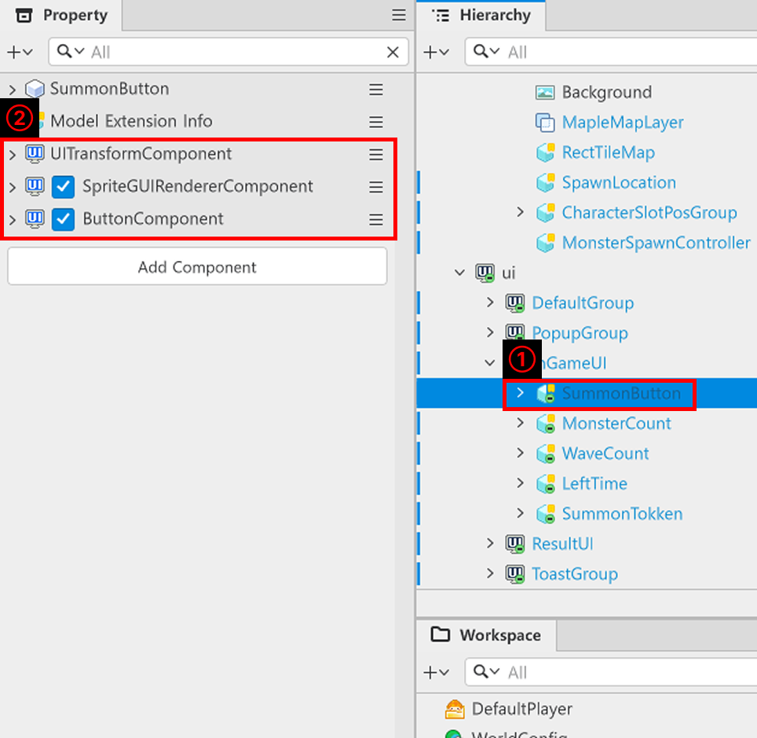
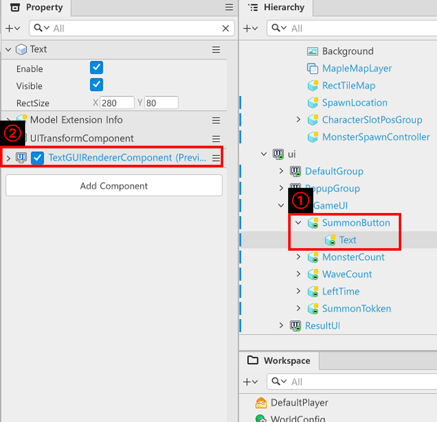
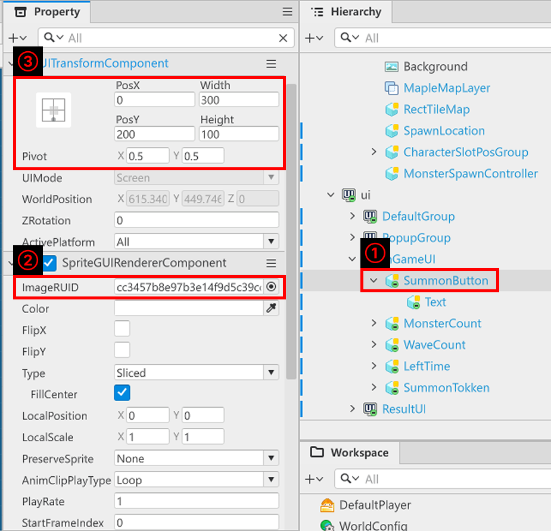
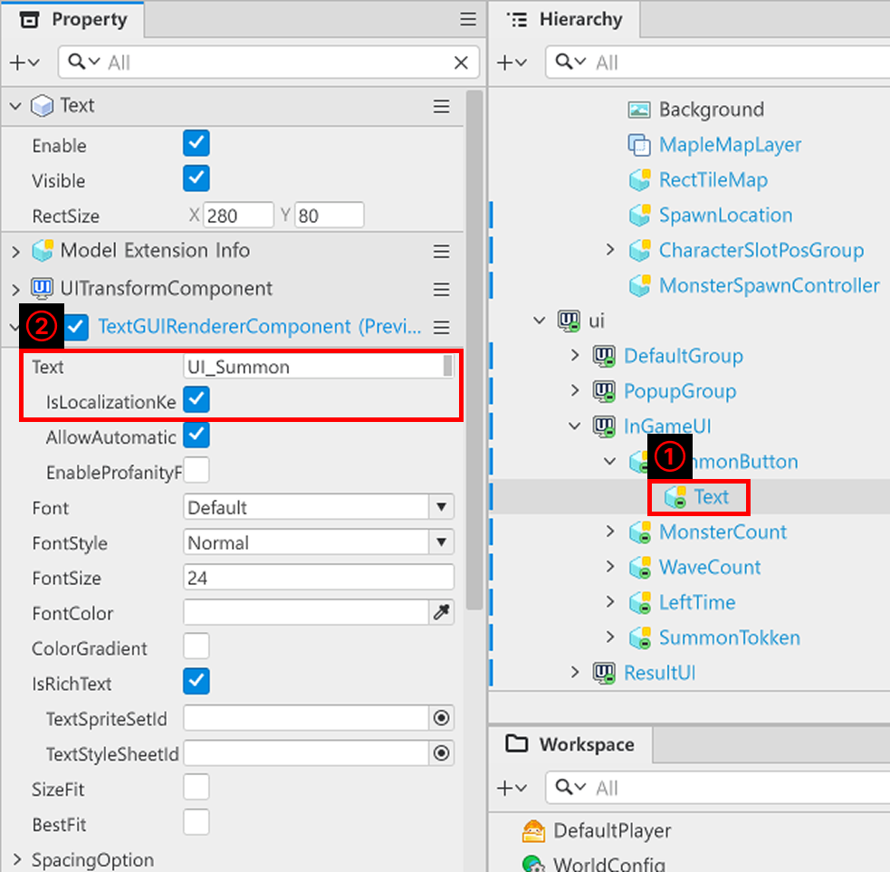
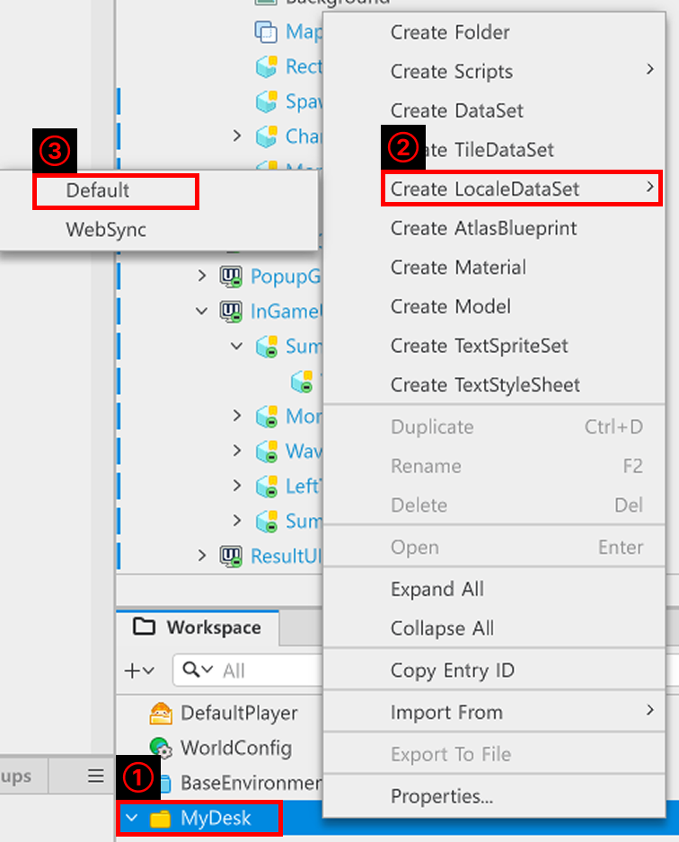
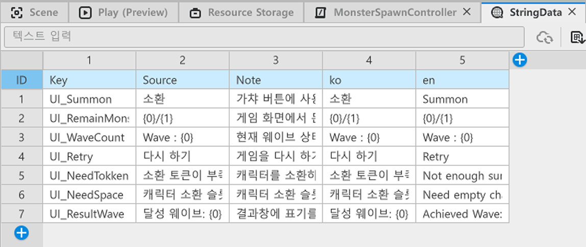
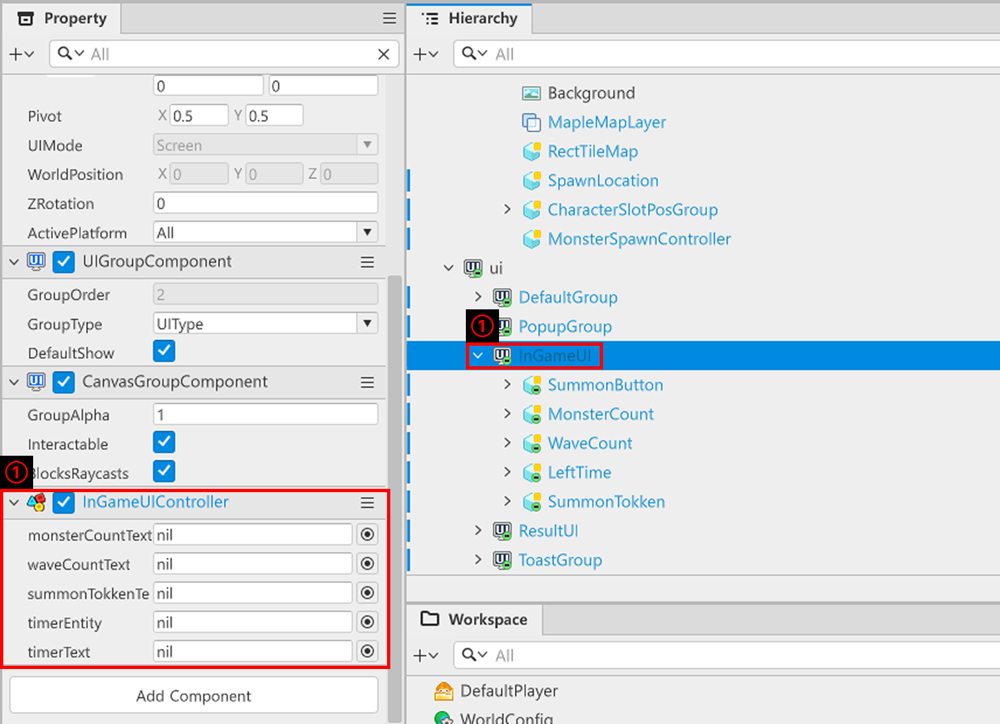

# [💡 Basic Training] Implementing a Summon System
<br>
<br>
<br>

## Video Timeline
- You can follow along by using the timeline under the training video.
- Understanding Map Types: `01:15:40`

<br>

## Learning Goals

- Implement buttons and functions that allows for players to summon characters.
- Change the function so that the currency and summons are verified to prevent infinite character summons.
- Change the function so that defeated monsters drop currency, making additional summons possible.

<br>

## Practical Exercises to Do After Watching the Video

- Compose a function, so the player can summon a character.
- Compose a function that displays a message when there isn't enough summoning currency or summoning slots.

<br>

## Implementing a Summon Function

<p align="center">

</p>

- Implement a function so that the player can summon a character to defeat monsters.
- Set conditions to summon characters and consume currency depending on the summon so that summons can't be done infinitely.
- The player will then feel the necessity of currency for summons and will play the world to collect said currency.

<br>

## Creating the UI
- The UI must be composed in a way that allows players to summon characters by pressing a button.
- Compose the function so that a summon is requested when a button is clicked on the UI and then proceed with the summon once the conditions have been met.

<br>

### Creating UI Groups

<p align="center">

</p>

- Click the UI button on the top of the MapleStory Worlds editor.
- Click the `+` button from the UI Groups window on the bottom of the MapleStory Worlds editor.
- When a new UI Group is created, change the name of the created UI Group from `Hierarchy`.
    - The sample world uses the name InGameUI.

<br>

### Creating Buttons

<p align="center">

</p>

- Right-click InGameUI from `Hierarchy`.
- Click `Create Entity` to open the menu.
- Click `Create UIEmpty` to create an empty entity.
- Set the created entity's name as SummonButton.

<p align="center">

</p>

- Assign the following Components to the created entity.
- `SpriteGUIRendererComponent`
    - The Component needed to output the button image.
- `ButtonComponent`
    - The Component needed to serve the function of a button.

<p align="center">

</p>

- Create Text as a child entity for SummonButton from `Hierarchy`.
- Add `TextGUIRendererComponent` to the created Text entity.

<br>

### Editing Components

<p align="center">

</p>

- Edit the SummonButton's Property from `Hierarchy`.
- Register the button image to ImageRUID from `SpriteGUIRendererComponent`.
- Edit the button design by adjusting the Width, Height, and Pos values of the `UITransformComponent`.

<p align="center">

</p>

- Edit the Text entity's `TextGUIRendererComponent`.
- Write the button name in Text.
    - The sample world has input the StringData Key value to output as a **summon**.
- Activates the IsLocalizationKey check if the LocaleDataSet value is going to be used.

<br>

#### LocaleDataSet

<p align="center">

</p>

- Right-click `MyDesk` from `Workspace`.
- Click `Create LocaleDataSet`.
- Click `Default` to create LocaleDataSet.
- LocaleDataSet is a DataSet needed for localization.

<p align="center">

</p>

- `Key`
    - The value used for translation.
    - Enter the target value in the Text of `TextGUIRendererComponent` and activate IsLocalizationKey to output the translation results such as Source, ko, en.
- `Source`
    - The value that is being translated.
    - When using MapleStory Worlds's automatic translation function, the resulting values will be based on this value.
- `Note`
    - The value used to deliver information to another world creator that the value is used for.
- `ko, en, zh-tw...`
    - Outputs the value that fits the language of the region that the world is launched in, such as Korean, English, Chinese, etc.

<br>

## Creating a Script

<p align="center">

</p>

- Register InGameUIController Component to InGameUI from `Hierarchy`.
- Then, write the following code.

```lua
@Component
script InGameUIController extends Component

property TextGUIRendererComponent monsterCountText = nil

property TextGUIRendererComponent waveCountText = nil

property TextGUIRendererComponent summonTokkenText = nil

property Entity timerEntity = nil

property TextGUIRendererComponent timerText = nil

@ExecSpace("ClientOnly")
method void OnBeginPlay()
self:InitMonsterCountText()
self:InitWaveCountText()
self:InitTimer()
self:InitSummonTokken()
end

@ExecSpace("ClientOnly")
method void InitMonsterCountText()
-- Determines whether monsterCountText is nil.
if not isvalid(self.monsterCountText) then
	-- Searches for a CountText entity based on the path.
	local findEntity = _EntityService:GetEntityByPath("/ui/InGameUI/MonsterCount/CountText")
	-- Registers the entity's TextGUIRendererComponent if the entity was successfully found.
	if isvalid(findEntity) then
		self.monsterCountText = findEntity.TextGUIRendererComponent
	end
end
end

@ExecSpace("ClientOnly")
method void CountLeftMonster(number CurrentMonsterCount, number MaxMonsterCount)
-- Receives the number of remaining monsters and the maximum number of monsters that are created in the current wave and updates the UI.
if not isvalid(self.monsterCountText) then
	self:InitMonsterCountText()
end
self.monsterCountText.Text = _LocalizationService:GetTextFormat("UI_RemainMonsterCount",CurrentMonsterCount, MaxMonsterCount)
end

@ExecSpace("ClientOnly")
method void InitWaveCountText()
-- Tests whether waveCountText is nil.
if not isvalid(self.waveCountText) then
	-- If it's nil, searches for the WaveCountText entity based on the path.
	local findText = _EntityService:GetEntityByPath("/ui/InGameUI/WaveCount/WaveCountText")
	if isvalid(findText) then
		-- If one was successfully found, registers the TextGUIRendererComponent of the found entity.
		self.waveCountText = findText.TextGUIRendererComponent
	end
end
end

@ExecSpace("ClientOnly")
method void UpdateWaveCount(number WaveCount)
-- Requests a reset if waveCountText is nil.
if not isvalid(self.waveCountText) then
	self:InitWaveCountText()
end
-- Updates the UI with the received current wave value.
self.waveCountText.Text = _LocalizationService:GetTextFormat("UI_WaveCount", WaveCount)
end

@ExecSpace("ClientOnly")
method void InitTimer()
-- Determines whether timerEntity is nil.
if not isvalid(self.timerEntity) then
	-- Searches the LeftTime entity through the path if it's nil.
	local findEntity = _EntityService:GetEntityByPath("/ui/InGameUI/LeftTime")
	-- If findEntity is True, the target value is applied to timerEntity.
	if isvalid(findEntity) then
		self.timerEntity = findEntity
	end
end
-- Determines whether timerText is nil.
if not isvalid(self.timerText) then
	-- If it's nil, searches for the TimerText entity.
	local findTextEntity = _EntityService:GetEntityByPath("/ui/InGameUI/LeftTime/TimerText")
	-- If the found findTextEntity is True, the target value is applied to timerText.
	if isvalid(findTextEntity) then
		self.timerText = findTextEntity.TextGUIRendererComponent
	end
end
if self.timerEntity.Enable == true then
	self.timerEntity.Enable = false
end
end

@ExecSpace("ClientOnly")
method void UpdateTimer(number deltaTimer)
-- Updates the remaining time UI based on the received deltaTimer value.
if self.timerEntity.Enable == false then
	self.timerEntity.Enable = true
end

local timeString = string.format("%.2f", deltaTimer)

self.timerText.Text = "LeftTime\n"..timeString
end

@ExecSpace("ClientOnly")
method void DisableTimer()
-- Requests the Timer to be deactivated.
self.timerEntity.Enable = false
end

@ExecSpace("ClientOnly")
method void InitSummonTokken()
-- Determines whether summonTokkenText is in a usable state.
if not isvalid(self.summonTokkenText) then
	-- If summonTokkenText is nil, searches for SummonTokkenText based on the path.
	local findEntity = _EntityService:GetEntityByPath("/ui/InGameUI/SummonTokken/IconImage/SummonTokkenText")
	if isvalid(findEntity) then
		-- Registers the target entity's TextGUIRendererComponent if SummonTokkenText is found.
		self.summonTokkenText = findEntity.TextGUIRendererComponent
	end
end
end

@ExecSpace("ClientOnly")
method void UpdateSummonTokkenUI(number TokkenValue)
-- Attempts a reset if summonTokkenText is nil.
if not isvalid(self.summonTokkenText) then
	self:InitSummonTokken()
end
-- Updates the remaining token count UI based on the received TokkenValue.
self.summonTokkenText.Text = tostring(math.floor(TokkenValue))
end

@EventSender("Entity", "b3964a11-f347-420c-a354-2698b88a6181")
handler HandleButtonClickEvent(ButtonClickEvent event)
-- Executes the character summon if the summon button is clicked.
_CharacterGachaLogic:RequestSpawnCharacter()
end

end
```

> This code is written based on Plain Text.

<br>

## Minimum Implementation Standards
- The player must be able to summon characters through the UI.
- The guide UI regarding the deduction of summoning currency and exceptions when summoning must be output.

<br>

## Usage and Extension Direction
- Add a way for the player to empty the character slot (selling characters, fusing characters, etc.) to add a function that allows them to keep summoning characters.
- Cultivate an environment where the currency is insufficient by making summoning currency incrementally more expensive.
- Add a character enhancement function along with the increasing summoning currency costs to allow the player to select the currency and use it in a strategic way.