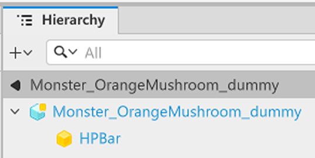
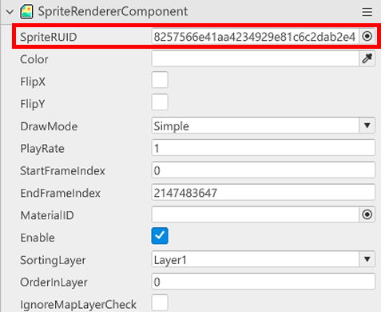
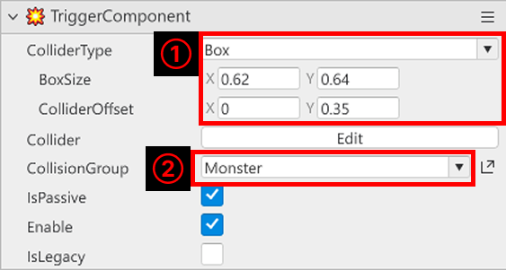
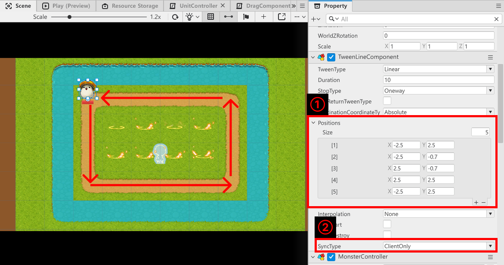

# [💡 기초 학습] 몬스터 제작하기
<br>
<br>
<br>

## 영상 타임라인
- 강의 영상내 아래의 타임라인에서 학습할 수 있습니다.
- 맵 타입 이해하기: `00:47:58`

<br>

## 학습 목표
- 몬스터의 정보를 관리하기 위한 DataSet을 제작하는 방법을 학습하고 제작합니다.
- Logic을 통해 몬스터의 정보를 불러올 수 있도록 기능을 구현합니다.
- Model을 활용하여 하나의 동일한 몬스터를 여러 마리로 소환할 수 있도록 기능을 구성합니다.
- 몬스터가 지정한 경로를 이동할 수 있도록 기능을 구현합니다.

<br>

## 해당 영상 시청 후 수행해 볼 내용
- 다양한 몬스터를 사용할 수 있도록 몬스터의 Model을 제작합니다.
- 각 몬스터들이 정보를 가질 수 있도록 DataSet을 확장 또는 추가합니다.
- 제작한 맵에 맞춰 몬스터가 경로를 이동할 수 있도록 TweenLine을 수정합니다.

<br>

## 몬스터의 구성 이해하기
- 샘플 월드에서 몬스터가 하는 역할은 총 2가지입니다.
    1. 지정된 경로를 따라 이동하기
    2. 자신이 처치될 때 소환 재화를 지급하기
- 따라서 몬스터는 체력과 이동, 그리고 피격과 사망에 대한 처리만으로 가볍게 구현할 수 있습니다.

<br>

### 몬스터 엔티티 제작하기

<p align="center">

</p>

- 샘플 월드의 몬스터 Model은 2개의 엔티티를 가지고 있습니다.
    - Monster_몬스터 이름 엔티티: 몬스터의 이미지 출력, 기능 처리를 담당하는 엔티티입니다.
    - HPBar: 몬스터의 남은 체력을 시각적으로 보여주기 위한 엔티티입니다.
    - Monster_엔티티에 다음의 Component를 부여합니다.
- `SpriteRendererComponent`
    - 몬스터의 애니메이션을 재생하기 위한 Component입니다.
- `StateComponent`
    - 몬스터의 상태를 확인하기 위한 Component입니다.
- `DamageSkinComponent`
    - 몬스터가 캐릭터에게 피격될 때 데미지를 출력하기 위한 Component입니다.
- `TriggerComponent`
    - 캐릭터의 공격 범위에 들어왔는지 판단 기준이 될 Collider Component입니다.
- `TweenLineComponent`
    - 몬스터가 지정된 경로로 이동하게 만드는 Component입니다.
- `MonsterController`
    - 직접 제작한 Component입니다.
    - 몬스터의 체력, 생존 여부 등을 처리하는 Component입니다.
- 이어서 HPBar 엔티티에는 `SpriteRendererComponent`를 추가합니다.
- 모든 Component의 추가가 완료되었다면 엔티티를 Model로 제작합니다.

<br>

### Component 편집하기

<p align="center">

</p>

- `SpriteRendererComponent`의 `SpriteRUID`에 값을 입력하여 애니메이션을 재생할 수 있습니다.
- 메이플스토리 월드가 제공하는 리소스 또는 직접 구한 리소스를 사용하여 몬스터 애니메이션을 재생합니다.
- 또한 HPBar의 `SpriteRendererComponent`를 체력표기를 위한 리소스로 `SpriteRUID`를 등록합니다.

<p align="center">

</p>

- `TriggerComponent`의 요소인 ColliderType을 Box로 변경합니다.
- BoxSize를 애니메이션 리소스에 맞춰 수정합니다.
- CollisionGroup을 Monster로 전환하여 CharacterAttackRange와 충돌이 일어나도록 수정합니다.

<p align="center">

</p>

- `TweenLineComponent`의 Positions를 설정하여 몬스터가 맵을 지정한 경로로 이동하도록 설정합니다.
- `SyncType`을 ClientOnly로 변경하여 클라이언트 환경에서 Component의 업데이트가 이뤄지도록 변경합니다.

<br>

#### ⚠️ TriggerComponent의 IsPassive

- TriggerComponent를 통한 충돌 연산은 연산 비용이 많이 드는 작업입니다.
- 모든 객체가 충돌을 감지하게 될 경우, 연산 비용이 크게 증가합니다.
- IsPassive를 활성화 할 경우, IsPassive가 활성화 된 객체는 충돌 연산을 실행하지 않습니다.
- 그러나 자기 자신과 충돌을 감지하는 다른 Collision Group은 IsPassive로 설정된 객체를 감지할 수 있습니다.
- 샘플 월드와 같이 충돌 감지가 1 : 1의 형식을 가질 경우, 다른 한 쪽을 IsPassive로 변경하여 연산 비용을 아낄 수 있습니다.

<br>

## 몬스터 Data 제작하기
- 몬스터를 관리하기 위한 Data와 이를 사용하기 위한 Logic, 그리고 값들을 하나의 요소로 관리할 수 있도록 StructType을 제작해야 합니다.
- 샘플 월드에서는 MonsterData DataSet, MonsterSpawnLogic, MonsterData StructType을 제작합니다.

<br>

### MonsterData DataSet 제작하기
- MonsterData DataSet은 다음과 같은 구조를 가지고 있습니다.
- `MonsterID`
    - 몬스터를 구분하기 위한 값입니다.
- `OneCycleMoveTime`
    - 몬스터 엔티티에 부여한 TweenLineComponent가 몇 초에 걸쳐 목적지에 도달하게 만들 것 인지 설정하는 값입니다.
- `StartHP`
    - 몬스터가 생성될 때 초기화하는 HP 값입니다.
- `ModelID`
    - 앞서 제작한 몬스터 Model의 Entry ID를 등록하여 사용하기 위한 값입니다.
- 해당 값들을 기반으로 DataSet을 구성하여 제작합니다.
- DataSet의 형식을 사용하기 위해 StructType을 제작합니다.

<br>

## 몬스터 Component 구성하기
- 몬스터의 기능들을 구현하기 위해 MonsterController를 작성해야 합니다.
- 아래는 MonsterController의 코드 전문입니다.

```lua
@Component
script MonsterController extends Component

property TweenLineComponent tweenLineComponent = nil

property string moveAnimationKey = "8257566e41aa4234929e81c6c2dab2e4"

property string dieAnimationKey = "65a2bfb039614f2e9e4ccc354340153d"

property SpriteRendererComponent monsterSpriteRenderer = nil

property boolean isAlive = false

property MonsterData monsterData = MonsterData()

property number currentHP = 0

property Entity hpBar = nil

property MonsterSpawnController spawnController = nil

@ExecSpace("ClientOnly")
method void OnBeginPlay()
-- tweenLineComponent가 nil인지 점검합니다.
if not isvalid(self.tweenLineComponent) then
	-- 만약 nil일 경우 자기 자신에 할당된 TweenLineComponent를 찾습니다.
	local findEntity = self.Entity.TweenLineComponent
	-- 정상적으로 Component를 찾았다면 이를 tweenLineComponent에 등록합니다.
	if isvalid(findEntity) then
		self.tweenLineComponent = findEntity
	else
		-- 정상적으로 Component를 찾지 못했으므로 에러 로그를 출력합니다.
		log_error("Monster의 TweenLine이 nil입니다!")
		return
	end	
end
-- monsterSpriteRenderer가 nil인지 체크합니다.
if not isvalid(self.monsterSpriteRenderer) then
	-- 자기 자신의 Component중 SpriterRenderer를 찾아 등록합니다.
	self.monsterSpriteRenderer = self.Entity.SpriteRendererComponent
end

-- 만약 hpBar가 nil일 경우 이를 찾아 등록합니다.
if not isvalid(self.hpBar) then
	local findEntity = self.Entity:GetChildByName("HPBar")
	if isvalid(findEntity) then
		self.hpBar = findEntity
	end
end

self.isAlive = true
end

@ExecSpace("ClientOnly")
method void OnUpdate(number delta)
-- 만약 몬스터가 한 바퀴를 돌았을 경우 다시 출발하도록 요청합니다.
if self.tweenLineComponent.CurrentState == TweenState.Idle then
	self.tweenLineComponent:RestartFromCurrentPosition()
end
end

@ExecSpace("ClientOnly")
method void InitData(MonsterData MonsterData, Vector3 StartPos, MonsterSpawnController MonsterSpawnController)
-- 자신의 monsterData를 전달받은 MonsterData로 초기화합니다.
self.monsterData = MonsterData
-- tweenLineComponent의 Duration을 전달받은 값으로 초기화합니다.
self.tweenLineComponent.Duration = self.monsterData.OneCycleMoveTime
-- 현재 체력을 전달받은 HP로 초기화합니다.
self.currentHP = self.monsterData.StartHP
-- 현재 상태를 활성화로 전환합니다.
self.isAlive = false
self.Enable = false
-- tweenLine을 최초 상태로 초기화합니다.
self.tweenLineComponent:Stop(true)
-- 현재 위치를 전달받은 위치로 수정합니다.
self.Entity.TransformComponent.WorldPosition = StartPos
-- 현재 hp에 맞춰 몬스터 체력바를 업데이트합니다.
self.hpBar.TransformComponent.Scale.x = self.currentHP / self.monsterData.StartHP * 20
-- MonsterSpawnController를 등록합니다.
self.spawnController = MonsterSpawnController
end

@ExecSpace("ClientOnly")
method void SetEnableState()
-- 몬스터가 행동할 수 있도록 필요한 값들을 초기화합니다.
self.tweenLineComponent:Stop(true)
self.tweenLineComponent:Play()
self.currentHP = self.monsterData.StartHP
self.monsterSpriteRenderer.SpriteRUID = self.moveAnimationKey
self.isAlive = true
self.Enable = true
end

@ExecSpace("ClientOnly")
method void GetDamage(number AtkValue)
-- 받은 데미지를 표기합니다.
_DamageSkinService:Play(self.Entity, "3271c3e79bf04ecba9a107d55495970d", 0.05, {AtkValue}, DamageSkinTweenType.Default, false)
-- 현재 체력에서 전달받은 데미지만큼 감소시킵니다.
self.currentHP = self.currentHP - AtkValue
-- 만약 현재 체력이 0 이하일 경우 처치 관련 처리를 진행합니다.
if self.currentHP <= 0 then
	-- 오버플로우 방지를 위해 0으로 초기화합니다.
	self.currentHP = 0
	-- 현재 생존 여부를 false로 변경합니다.
	self.isAlive = false
	-- 몬스터의 이동을 중단시킵니다.
	self.tweenLineComponent:Pause()
	-- 몬스터의 애니메이션을 사망으로 변경합니다.
	self.monsterSpriteRenderer.SpriteRUID = self.dieAnimationKey
	-- HPBar의 크기를 0으로 초기화합니다.
	self.hpBar.TransformComponent.Scale.x = 0
	-- 자기 자신이 처치되었으므로 MonsterSpawnManager에게 잔존 수를 감소하도록 요청합니다.
	self.spawnController:UpdateRemainMonsterCount(-1)
	-- GameLogic에게 소환 토큰을 1 증가시키도록 요청합니다.
	_GameLogic:UpdateSummonTokken(1)
else
	-- 이외의 경우에는 설정한 크기에 맞춰 UI가 변경되도록 계산한 값을 적용합니다.
	self.hpBar.TransformComponent.Scale.x = self.currentHP / self.monsterData.StartHP * 20
end
end

@EventSender("Self")
handler HandleSpriteAnimPlayerEndFrameEvent(SpriteAnimPlayerEndFrameEvent event)
-- 몬스터 사망 애니메이션이 끝까지 출력되었다면 엔티티를 비활성화 시킵니다.
if self.monsterSpriteRenderer.SpriteRUID == self.dieAnimationKey then
	self.Entity.Enable = false
end
end

end
```

> 해당 코드는 Plain Text를 기준으로 작성한 코드입니다.

<br>

### 몬스터의 정보를 불러오기 위한 Logic 제작하기
- 몬스터의 정보를 관리하고, 몬스터의 스폰을 관리하는 MonsterSpawnLogic을 제작합니다.
- MonsterSpawnLogic은 Logic Script로 제작된 Script입니다.
- 아래는 MonsterSpawnLogic의 코드 전문입니다.

```lua
@Logic
script MonsterSpawnLogic extends Logic

property table monsterData = {}

property table waveData = {}

@ExecSpace("ClientOnly")
method void OnBeginPlay()
self:InitMonsterData()
self:InitWaveData()
end

@ExecSpace("ClientOnly")
method void InitMonsterData()
-- monsterData가 사용 불가능한 상태인지 점검합니다.
if not isvalid(self.monsterData) or not next(self.monsterData) then
	-- MonsterData DataSet이 정상적으로 있는지 확인합니다.
	local findDataSet = _DataService:GetTable("MonsterData")
	-- 만약 불러오는데 실패했다면 에러 로그를 남깁니다.
	if not isvalid(findDataSet) then
		log_error("MonsterData DataSet을 불러오는데 실패했습니다.")
		return
	end
	-- 정상적으로 찾았다면 rowCount를 가져옵니다.
	local rowCount = findDataSet:GetRowCount()
	-- rowCount만큼 반복하면서 데이터를 순서대로 찾아 등록합니다.
	for i = 1, rowCount do
		local monsterID = tostring(findDataSet:GetCell(i, "MonsterID"))
		-- MonsterID가 정상적으로 있는지 점검합니다.
		if not _UtilLogic:IsNilorEmptyString(monsterID) then
			-- MonsterID가 정상적으로 존재한다면 정상적인 값이라고 판단하여 데이터 불러오기를 시작합니다.
			local getData = MonsterData()
			getData.MonsterID = monsterID
			getData.OneCycleMoveTime = tonumber(findDataSet:GetCell(i, "OneCycleMoveTime"))
			getData.StartHP = tonumber(findDataSet:GetCell(i, "StartHP"))
			getData.ModelID = tostring(findDataSet:GetCell(i, "ModelID"))
			if not isvalid(self.monsterData[monsterID]) then
				self.monsterData[monsterID] = {}
			end
			self.monsterData[monsterID] = getData
		end
	end
end
end

@ExecSpace("ClientOnly")
method void InitWaveData()
-- waveData가 사용 가능한 상태인지 점검합니다.
if not isvalid(self.waveData) or not next(self.waveData) then
	local findDataSet = _DataService:GetTable("WaveData")
	-- 정상적으로 DataSet을 찾았는지 확인합니다.
	if isvalid(findDataSet) then
		-- 정상적으로 데이터가 존재할 경우 rowCount를 가져옵니다.
		local rowCount = findDataSet:GetRowCount()
		-- rowCount 수 만큼 반복하여 데이터를 탐색합니다.
		for i = 1, rowCount do
			local getData = WaveData()
			getData.WaveIndex = tonumber(findDataSet:GetCell(i, "WaveIndex"))
			getData.SpawnMonster = tostring(findDataSet:GetCell(i, "SpawnMonster"))
			getData.SpawnMonsterCount = tonumber(findDataSet:GetCell(i, "SpawnMonsterCount"))
			if not isvalid(self.waveData[i]) then
				self.waveData[i] = {}
			end
			self.waveData[i] = getData
		end
	end
end
end

@ExecSpace("ClientOnly")
method MonsterData GetMonsterDataByMonsterID(string MonsterID)
-- MonsterID를 Key값으로 가지는 데이터가 있는지 확인합니다.
if isvalid(self.monsterData[MonsterID]) then
	-- 정상적으로 데이터가 존재할 경우 해당 데이터를 반환합니다.
	return self.monsterData[MonsterID]
end
-- 만약 데이터가 없을 경우, 에러 로그와 함께 nil을 반환합니다.
log_warning(MonsterID.."is Nil Data!")
return nil
end

@ExecSpace("ClientOnly")
method WaveData GetSpawnList(integer WaveIndex)
-- WaveIndex 값이 있는지 확인합니다.
if isvalid(self.waveData[WaveIndex]) then
	-- 정상적으로 값이 있을 경우 해당 Data를 반환합니다.
	return self.waveData[WaveIndex]
end
end

end
```

> 해당 코드는 Plain Text를 기준으로 작성된 코드입니다.

<br>

## 최소 구현 기준
- 몬스터의 정보를 불러오고 사용하기 위한 Logic과 Component를 구성합니다.
- 저장된 DataSet의 정보대로 몬스터의 정보가 파싱되어야 합니다.
- 몬스터의 이동 경로가 제작한 맵에 맞춰 이동해야 합니다.

<br>

## 응용 및 확장 방향
- 몬스터의 등급을 부여하고 이를 사용할 수 있도록 구조를 변경합니다.
- 다양한 몬스터가 스폰될 수 있도록 몬스터의 종류를 확장합니다.