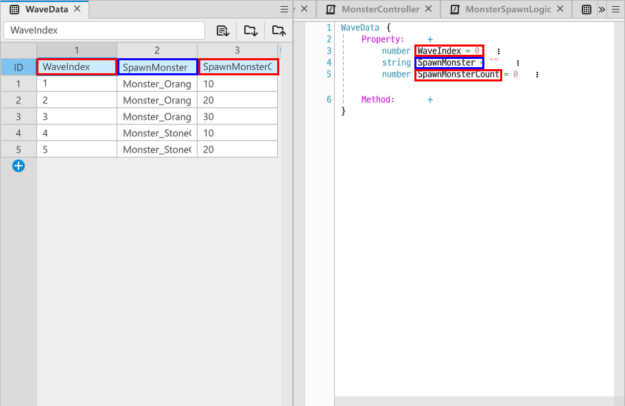
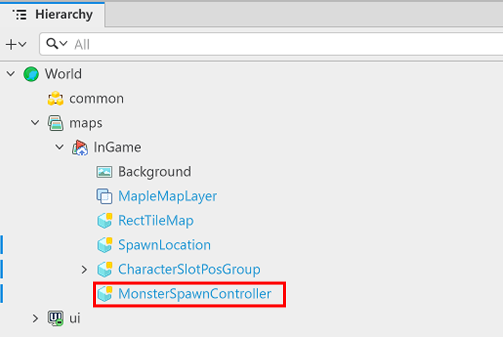
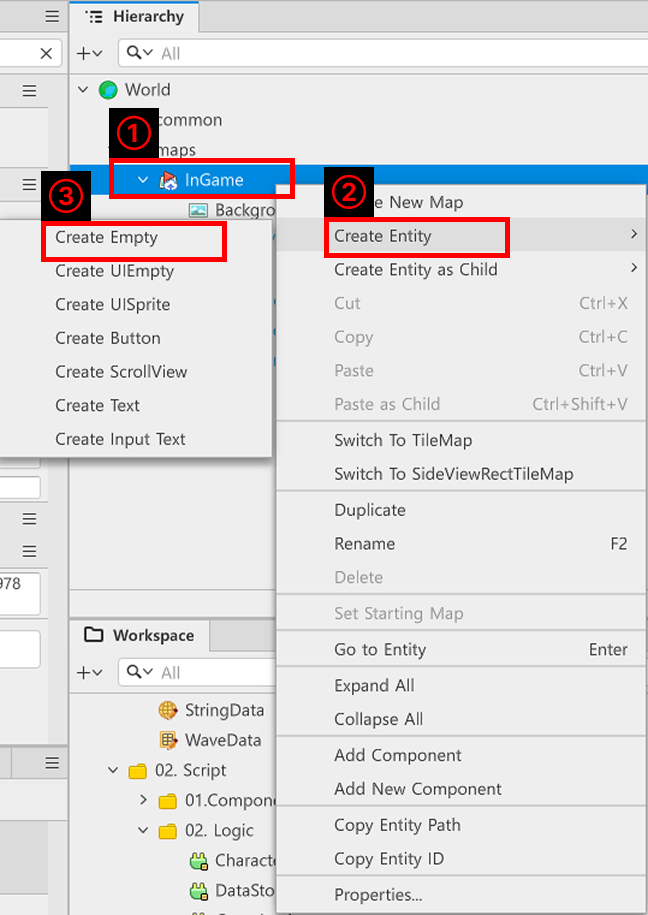
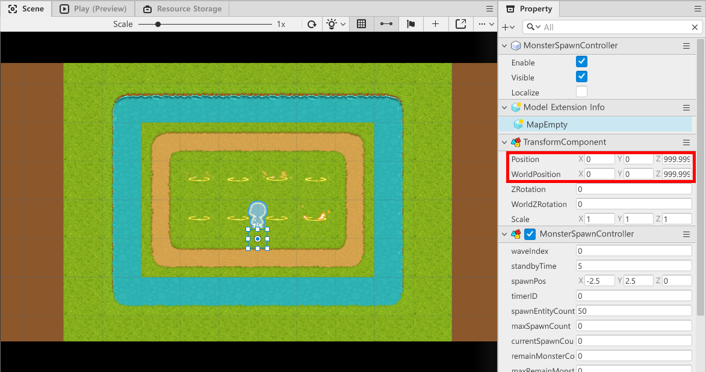

# [💡 기초 학습] 몬스터 스폰하기
<br>
<br>
<br>

## 영상 타임라인
- 강의 영상내 아래의 타임라인에서 학습할 수 있습니다.
- 맵 타입 이해하기: `01:03:48`

<br>

## 학습 목표
- 몬스터 스폰을 관리하는 DataSet을 제작합니다.
- 제작된 DataSet에 맞춰 몬스터가 스폰될 수 있도록 기능을 구현합니다.

<br>

## 해당 영상 시청 후 수행해 볼 내용
- 지정한 DataSet을 활용하여 몬스터가 스폰될 수 있도록 기능을 구성합니다.
- 웨이브의 단계에 따라 스폰되는 몬스터가 변경될 수 있도록 DataSet과 기능을 구성합니다.

<br>

## 몬스터 소환 DataSet 구성하기
- 각 웨이브에 따라 소환되어야 하는 몬스터를 지정하기 위한 DataSet을 구성합니다.
- 샘플 월드에서는 WaveData라는 이름으로 DataSet을 구성했습니다.
- WaveData는 다음의 구조로 제작되어 있습니다.
- `WaveIndex`
    - 웨이브의 단계를 지정하기 위한 값입니다.
- `SpawnMonster`
    - 해당 웨이브에 소환되어야 하는 몬스터를 지정하기 위한 값입니다.
    - MonsterData의 MonsterID값을 입력하여 사용합니다.
- `SpawnMonsterCount`
    - 해당 웨이브에 스폰되어야 하는 몬스터의 수를 결정하기 위한 값입니다.

<br>

### StructType 구성하기

<p align="center">

</p>

- WaveData의 값들과 동일하게 StructType을 구성합니다.
- Property에 WaveData의 요소들을 담을 수 있도록 동일한 이름을 사용하여 선언합니다.

<br>

### Logic 구성하기
- 앞서 제작했던 MonsterSpawnLogic에 제작된 SpawnData를 등록합니다.
- 몬스터의 스폰을 요청받으면 현재 웨이브의 정보에 맞는 몬스터를 반환하도록 기능을 구성합니다.
- 아래는 MonsterSpawnLogic의 코드입니다.

```lua
@Logic
script MonsterSpawnLogic extends Logic

property table monsterData = {}

property table waveData = {}

@ExecSpace("ClientOnly")
method void OnBeginPlay()
self:InitMonsterData()
self:InitWaveData()
end

@ExecSpace("ClientOnly")
method void InitMonsterData()
-- monsterData가 사용 불가능한 상태인지 점검합니다.
if not isvalid(self.monsterData) or not next(self.monsterData) then
	-- MonsterData DataSet이 정상적으로 있는지 확인합니다.
	local findDataSet = _DataService:GetTable("MonsterData")
	-- 만약 불러오는데 실패했다면 에러 로그를 남깁니다.
	if not isvalid(findDataSet) then
		log_error("MonsterData DataSet을 불러오는데 실패했습니다.")
		return
	end
	-- 정상적으로 찾았다면 rowCount를 가져옵니다.
	local rowCount = findDataSet:GetRowCount()
	-- rowCount만큼 반복하면서 데이터를 순서대로 찾아 등록합니다.
	for i = 1, rowCount do
		local monsterID = tostring(findDataSet:GetCell(i, "MonsterID"))
		-- MonsterID가 정상적으로 있는지 점검합니다.
		if not _UtilLogic:IsNilorEmptyString(monsterID) then
			-- MonsterID가 정상적으로 존재한다면 정상적인 값이라고 판단하여 데이터 불러오기를 시작합니다.
			local getData = MonsterData()
			getData.MonsterID = monsterID
			getData.OneCycleMoveTime = tonumber(findDataSet:GetCell(i, "OneCycleMoveTime"))
			getData.StartHP = tonumber(findDataSet:GetCell(i, "StartHP"))
			getData.ModelID = tostring(findDataSet:GetCell(i, "ModelID"))
			if not isvalid(self.monsterData[monsterID]) then
				self.monsterData[monsterID] = {}
			end
			self.monsterData[monsterID] = getData
		end
	end
end
end

@ExecSpace("ClientOnly")
method void InitWaveData()
-- waveData가 사용 가능한 상태인지 점검합니다.
if not isvalid(self.waveData) or not next(self.waveData) then
	local findDataSet = _DataService:GetTable("WaveData")
	-- 정상적으로 DataSet을 찾았는지 확인합니다.
	if isvalid(findDataSet) then
		-- 정상적으로 데이터가 존재할 경우 rowCount를 가져옵니다.
		local rowCount = findDataSet:GetRowCount()
		-- rowCount 수 만큼 반복하여 데이터를 탐색합니다.
		for i = 1, rowCount do
			local getData = WaveData()
			getData.WaveIndex = tonumber(findDataSet:GetCell(i, "WaveIndex"))
			getData.SpawnMonster = tostring(findDataSet:GetCell(i, "SpawnMonster"))
			getData.SpawnMonsterCount = tonumber(findDataSet:GetCell(i, "SpawnMonsterCount"))
			if not isvalid(self.waveData[i]) then
				self.waveData[i] = {}
			end
			self.waveData[i] = getData
		end
	end
end
end

@ExecSpace("ClientOnly")
method MonsterData GetMonsterDataByMonsterID(string MonsterID)
-- MonsterID를 Key값으로 가지는 데이터가 있는지 확인합니다.
if isvalid(self.monsterData[MonsterID]) then
	-- 정상적으로 데이터가 존재할 경우 해당 데이터를 반환합니다.
	return self.monsterData[MonsterID]
end
-- 만약 데이터가 없을 경우, 에러 로그와 함께 nil을 반환합니다.
log_warning(MonsterID.."is Nil Data!")
return nil
end

@ExecSpace("ClientOnly")
method WaveData GetSpawnList(integer WaveIndex)
-- WaveIndex 값이 있는지 확인합니다.
if isvalid(self.waveData[WaveIndex]) then
	-- 정상적으로 값이 있을 경우 해당 Data를 반환합니다.
	return self.waveData[WaveIndex]
end
end

end
```

> 해당 코드는 Plain Text를 기준으로 작성된 코드입니다.

<br>

## MonsterSpawnController 제작하기

<p align="center">

</p>

- MonsterController는 InGame 맵 안에 존재하는 엔티티입니다.
- InGame에서 Wave가 실행되는 동안 정해진 조건에 맞춰 몬스터의 생성 요청과 타이머의 요청을 수행합니다.

<br>

### 엔티티 준비하기

<p align="center">

</p>

- `Hierarchy`에서 `InGame`을 마우스 우클릭합니다.
- `Create Entity`를 클릭하여 메뉴를 엽니다.
- `Create Empty`를 클릭해 빈 엔티티를 생성합니다.

<p align="center">

</p>

- 생성한 엔티티의 `TransformComponent`의 Position, WorldPosition을 0으로 설정합니다.
- 그 후 몬스터의 생성을 담당하는 `MonsterSpawnController`를 제작, 추가합니다.

<br>

### MonsterSpawnController 제작하기
- MonsterSpawnController는 현재 자신의 웨이브 관리, 몬스터 생성, 남은 몬스터 수 관리를 수행합니다.
- 아래는 MonsterSpawnController Component의 전체 코드입니다.

```lua
@Component
script MonsterSpawnController extends Component

property table monsterList = {}

property integer waveIndex = 0

property number standbyTime = 5

property Vector3 spawnPos = Vector3(-2.5,2.5,0)

property number timerID = 0

property number spawnEntityCount = 50

property number maxSpawnCount = 0

property number currentSpawnCount = 0

property number remainMonsterCount = 0

property number maxRemainMonsterCount = 0

property boolean isFinishData = false

property boolean pauseSpawn = false

@ExecSpace("ClientOnly")
method void OnBeginPlay()
-- 시작시 waveIndex를 1로 초기화합니다.
self.waveIndex = 1
-- 현재 몬스터 수를 초기화합니다.
_UIManageLogic:UpdateMonsterCount(self.remainMonsterCount, self.maxRemainMonsterCount)
-- 웨이브 실행을 요청합니다.
self:InitWave()
end

@ExecSpace("ClientOnly")
method void InitWave()
-- 현재 웨이브 카운트를 UI 업데이트합니다.
_UIManageLogic:UpdateWaveCount(self.waveIndex)
-- 스폰 데이터를 가져옵니다.
local getSpawnData = _MonsterSpawnLogic:GetSpawnList(self.waveIndex)
if not isvalid(getSpawnData) then
	-- 만약 다음 스폰 데이터가 없을 경우 데이터가 없는 상태로 전환합니다.
	self.isFinishData = true
	-- 스폰 데이터가 없으므로 결과창을 호출합니다.
	_GameLogic:NeedResult()
	return 
end
-- 최대 스폰하는 몬스터의 수를 스폰 데이터의 몬스터 스폰 수로 등록합니다.
self.maxRemainMonsterCount = getSpawnData.SpawnMonsterCount
-- 몬스터를 스폰해야 하는 수를 스폰 데이터의 몬스터 스폰 수로 등록합니다.
self.maxSpawnCount = getSpawnData.SpawnMonsterCount
-- MonsterID를 스폰 데이터에서 가져옵니다.
local monsterID = getSpawnData.SpawnMonster
-- 스폰 가능한 수를 0으로 초기화합니다.
local canSpawnCount = 0
-- spawnList를 사용해야 하는 몬스터를 Key로 가지는 monsterList로 등록합니다.
local spawnList = self.monsterList[monsterID]

-- 몬스터 풀을 점검 및 생성합니다.
if not isvalid(spawnList) or not next(spawnList) then
	-- 풀이 아예 비어있다면 초기 세팅 개수만큼 생성합니다.
	for i = 1, self.spawnEntityCount do
		self:SpawnMonster(monsterID)
	end
else
	-- 이미 풀이 있다면 비활성화되어 당장 스폰 가능한 개수를 파악합니다.
	for i = 1, #spawnList do
		if not spawnList[i].Enable then 
			canSpawnCount = canSpawnCount + 1
            end
	end
        
	-- 가용 개수가 웨이브의 최대 스폰량보다 적다면 모자란 만큼 추가 생성합니다.
	if canSpawnCount < self.maxSpawnCount then
		local needCount = self.maxSpawnCount - canSpawnCount
		for i = 1, needCount do
			self:SpawnMonster(monsterID)
		end
	end
end

-- 몬스터 출력을 Timer를 이용하여 일정 시간에 맞춰 출력시킵니다.
self.timerID = _TimerService:SetTimerRepeat(function()
self:PlayMonster(monsterID) end, 1.0, self.standbyTime)	
end

@ExecSpace("ClientOnly")
method void SpawnMonster(string MonsterID)
-- 전달받은 MonsterID를 기준으로 몬스터 정보를 가져옵니다.
local getMonsterData = _MonsterSpawnLogic:GetMonsterDataByMonsterID(MonsterID)
-- 만약 사용 불가능한 MonsterData가 들어올 경우 코드 실행을 중단합니다.
if not isvalid(getMonsterData) then 
	return 
end
-- 찾은 데이터를 기준으로 몬스터 Model을 찾아 스폰합니다.
local modelEntity = _SpawnService:SpawnByModelId(getMonsterData.ModelID, getMonsterData.MonsterID, self.spawnPos, self.Entity)
    
-- 풀에 넣기 전 일단 화면에서 숨김 처리합니다.
modelEntity:SetEnable(false) 
-- 생성한 modelEntity에 몬스터 정보를 등록합니다.
modelEntity.MonsterController:InitData(getMonsterData, self.spawnPos, self)
-- 만약 MonsterID를 Key로 가지는 monsterList가 존재하지 않을 경우 초기화합니다.
if not isvalid(self.monsterList[MonsterID]) then
	self.monsterList[MonsterID] = {}
end
-- 생성한 몬스터 엔티티를 monsterList에 MonsterID를 Key로 등록합니다.
table.insert(self.monsterList[MonsterID], modelEntity)
end

@ExecSpace("ClientOnly")
method void PlayMonster(string MonsterID)
-- monsterList에서 전달받은 MonsterID를 Key로 하는 요소들을 spawnList에 등록합니다.
local spawnList = self.monsterList[MonsterID]
    
-- 타이머가 1초마다 호출될 때, 대기 중인 몬스터 한 마리를 찾아 스폰합니다.
for i = 1, #spawnList do
	local targetMonster = spawnList[i]
        
	-- 현재 화면에 없고 쉬고 있는 몬스터를 찾습니다.
	if not targetMonster.Enable then
		targetMonster:SetEnable(true)
		targetMonster.MonsterController:SetEnableState() 
		-- 스폰 카운트를 증가시켜 현재 몬스터 스폰 수를 증가시킵니다.
		self.currentSpawnCount = self.currentSpawnCount + 1 
		-- UI 표기를 위한 값인 remainMonsterCount를 증가시킵니다.
		self.remainMonsterCount = self.remainMonsterCount + 1
		-- UIManageLogic에게 현재 상태를 업데이트하도록 요청합니다.
		_UIManageLogic:UpdateMonsterCount(self.remainMonsterCount, self.maxRemainMonsterCount)
		-- 한 마리만 스폰하고 반복문을 종료합니다.
		break 
	end
end

-- 웨이브 목표량을 모두 스폰했다면 다음 웨이브 전환 조건을 확인합니다.
if self.currentSpawnCount >= self.maxSpawnCount then
	self.currentSpawnCount = 0
	-- 스폰을 담당하던 타이머를 정지합니다.
	_TimerService:ClearTimer(self.timerID)
        
	if self.remainMonsterCount <= 0 then
		-- 만약 필드에 남은 몬스터가 없다면 즉시 다음 웨이브로 넘어갑니다.
		self.waveIndex = self.waveIndex + 1
		self:InitWave()
	else
		-- 필드에 남은 몬스터가 있다면 스폰 대기 상태(pauseSpawn)로 진입합니다.
		self.pauseSpawn = true
		_GameLogic:NeedTimer()
	end
end
end

@ExecSpace("ClientOnly")
method void UpdateRemainMonsterCount(number ChangeValue)
-- 전달받은 값을 remainMonsterCount에 더합니다. (보통 몬스터 처치 시 -1 전달)
self.remainMonsterCount = self.remainMonsterCount + ChangeValue
    
-- 남은 몬스터 수가 0 밑으로 떨어지지 않도록 방어 코드를 추가해주는 것이 안전합니다.
if self.remainMonsterCount < 0 then 
	self.remainMonsterCount = 0 
end

-- 변경된 값을 UI에 업데이트하도록 요청합니다.
_UIManageLogic:UpdateMonsterCount(self.remainMonsterCount, self.maxRemainMonsterCount)

-- 스폰 대기 상태(pauseSpawn)이면서 남은 몬스터가 모두 처치(0)되었다면 다음 웨이브를 시작합니다.
if self.pauseSpawn == true and self.remainMonsterCount == 0 then
	self.pauseSpawn = false -- 대기 상태 해제
	self.waveIndex = self.waveIndex + 1 -- 웨이브 증가
	_GameLogic:DisableTimer()
	self:InitWave() -- 다음 웨이브 스폰 시작
end
end

@ExecSpace("ClientOnly")
method void ChangeResultUI()
-- monsterList 전체를 순회합니다.
for monsterID, spawnList in pairs(self.monsterList) do
	-- 각 ID 리스트 안에 담긴 엔티티들을 순회합니다.
	for i = 1, #spawnList do
		local monster = spawnList[i]
		-- 엔티티가 유효한지 확인 후 비활성화합니다.
		if isvalid(monster) then
			monster:SetEnable(false)
		end
	end
end
_TimerService:ClearTimer(self.timerID)
end

@ExecSpace("ClientOnly")
method void CallRestart()
-- 모든 값들을 초기화 한 뒤 InitWave를 실행합니다.
self.isFinishData = false
self.pauseSpawn = false
self.remainMonsterCount = 0
self.currentSpawnCount = 0
self.waveIndex = 1
self:InitWave()
end

end
```

> 해당 코드는 Plain Text를 기준으로 작성된 코드입니다.

<br>

## 최소 구현 기준
- 월드가 시작되면 일정 시간 뒤 몬스터가 DataSet에 등록한 값으로 스폰됩니다.
- DataSet의 값을 변경하여 스폰되는 몬스터의 수를 변경할 수 있습니다.

<br>

## 응용 및 확장 방향
- 웨이브에 따라 제한 시간을 제한할 수 있도록 DataSet을 확장합니다.
- 한 웨이브에 2종류 이상의 몬스터가 스폰될 수 있도록 기능을 수정합니다.
- 특정 웨이브의 경우 보스와 같이 강력한 몬스터가 스폰되도록 기능을 변경합니다.