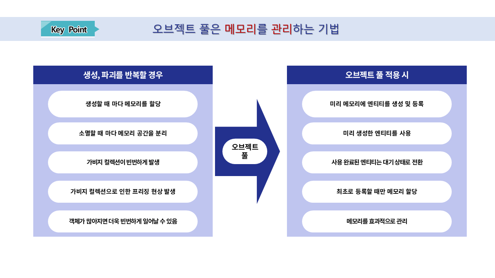
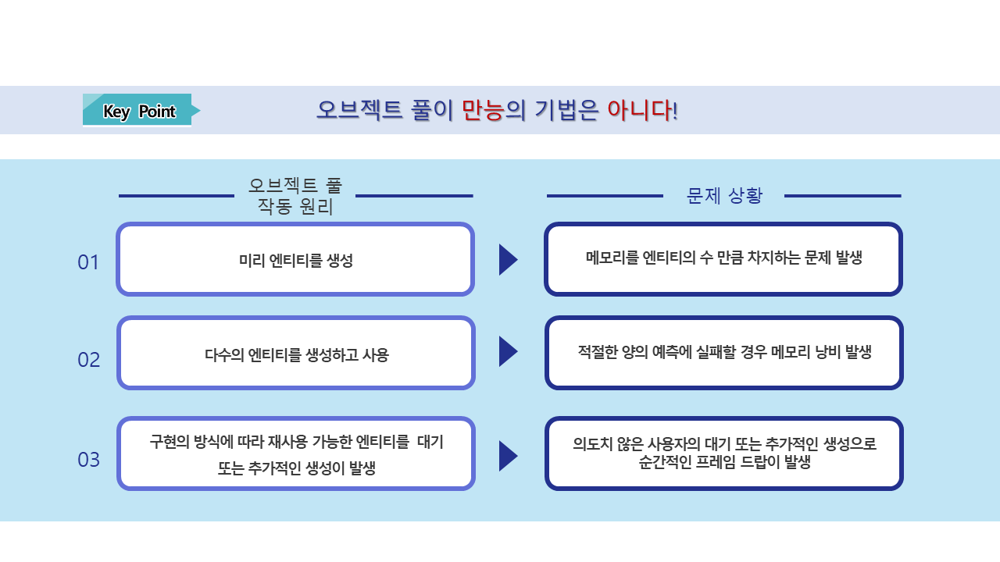

# [💡 기초 학습] 오브젝트 풀 생성하기
 
 
 

## 영상 타임라인
- 강의 영상내 아래의 타임라인에서 학습할 수 있습니다.
- 맵 타입 이해하기: `01:10:50`

 

## 학습 목표
- 오브젝트 풀 기법이 무엇인지 작동 원리를 이해합니다.
- 오브젝트 풀 기법을 통해 얻는 이점과, 주의해야 하는 항목에 대해 학습합니다.

 

## 해당 영상 시청 후 수행해 볼 내용

- 오브젝트 풀에 대한 이해와 사용 방법을 학습합니다.
- 최적화를 위해 제작중인 월드에서 생성해야 하는 엔티티의 개수를 최적화합니다.

 

## 오브젝트 풀이란?

- 오브젝트 풀은 동일한 엔티티를 **미리** 만들어 사용하는 기법입니다.
- 동일한 엔티티를 반복적으로 사용해야 할 경우 오브젝트 풀에 저장된 엔티티를 사용합니다.
- 사용이 완료된 엔티티는 다시 오브젝트 풀에 **대기** 상태로 전환됩니다.

 

## 오브젝트 풀의 강점

- **성능 향상**
    - 매번 객체를 새롭게 생성하고 파괴하는 행위를 반복할 경우 CPU의 부하가 강해집니다.
    - 객체가 많이 생성되고 파괴될 수록 CPU의 부하가 강해지며 프레임 저하의 문제로 이어지게 됩니다.
    - 오브젝트 풀은 미리 생성한 객체를 불러오고, 다시 저장하는 방식이므로 생성과 파괴를 반복하는 것 보다 CPU의 점유율이 크게 내려갑니다.
- **빠른 활성화, 비활성화**
    - 미리 생성된 객체를 켜고 끄는 행위를 하기 때문에 객체를 생성, 파괴하는 것 보다 속도가 빠릅니다.
- **가비지 컬렉션(GC) 감소**
    - 객체가 파괴되면 불필요한 메모리가 남게 됩니다.
    - 생성, 파괴의 방식으로 제작할 경우 가비지 컬렉션이 빈번하게 호출됩니다.
    - 오브젝트 풀은 가비지 컬렉션을 적게 호출하도록 만듭니다.
    - 가비지 컬렉션의 호출이 적을수록 월드의 성능은 향상됩니다.
- **메모리 관리 효율화**
    - 오브젝트 풀은 필요한 객체를 미리 메모리에 올려두고 사용합니다.
    - 따라서 메모리의 사용량을 예측하기 쉽고 메모리의 파편화를 방지할 수 있습니다.

 

### ℹ️ 가비지 컬렉션(GC)이란?

- 가비지 컬렉션은 메모리에서 사용되지 않는 힙(Heap) 영역의 객체를 자동으로 제거합니다.
- 사용되지 않는 객체를 제거함으로 메모리의 여유 공간을 확보합니다.
- 가비지 컬렉션은 불필요한 메모리가 지속적으로 쌓이는걸 방지하는 역할을 수행합니다.

- 가비지 컬렉션(GC)이 작동하는 동안 스레드가 멈추어 성능 저하가 발생할 수 있습니다.
- 또한 청소되는 메모리가 많을수록 대기 시간도 길어지게 됩니다.
- 월드가 진행되는 동안 플레이어가 대기해야 하는 시간이 길 수록 사용자는 불편함을 느끼게 됩니다.

- 따라서 메모리의 관리를 가비지 컬렉션(GC)에 의존하는게 아닌 불필요한 메모리를 최소화 하도록 만들어야 합니다.
- 적은 양의 메모리라면 가비지 컬렉션(GC)이 처리해야 하는 양이 적어지므로 게임의 성능을 크게 향상시킬 수 있습니다.

 

## 오브젝트 풀의 단점

- **객체의 등록으로 소모되는 메모리**
    - 오브젝트 풀은 미리 객체를 생성하여 메모리에 등록합니다.
    - 만약 등록은 되었으나 사용이 이뤄지지 않을 경우 메모리에 존재만 하고 사용은 안되는 불필요한 메모리가 발생할 수 있습니다.
    - 이런 객체가 많아질수록 낭비되는 메모리가 늘어나게 됩니다.
- **적절한 수량의 조절**
    - 오브젝트 풀을 생성하기 위해 생성하는 객체의 수를 적절하게 조절해야 합니다.
    - 이를 위해 게임에서 사용되는 양을 예측하고, 재사용성을 감안하여 적절한 수량을 생성하도록 제작해야 합니다.
- **예외 사항에 대한 취약점**
    - 만약 객체의 사용량 예측에 실패할 경우 구현 상태에 따라 문제가 발생할 수 있습니다.
        - EX: 사용 가능한 오브젝트 풀 내 객체가 없을 경우
            - 사용 가능한 객체가 나올 때 까지 대기한다.
            - 새롭게 객체를 추가로 생성한다.
    - 사용 가능한 객체가 나올 때 까지 대기할 경우 사용자는 불쾌한 경험을 하게 됩니다.
    - 새롭게 객체를 생성할 경우 CPU 사용량이 상승하기 때문에 게임의 성능이 저하될 수 있습니다.
    - 따라서 적절한 수량의 조절이 최우선의 과제입니다.

## 샘플 월드의 오브젝트 풀 사용 상태

- 몬스터를 호출하면 오브젝트 풀에 있는 몬스터를 요구합니다.
- 만약 오브젝트 풀에 몬스터가 없을 경우 오브젝트 풀은 몬스터를 생성합니다.
- 이후 사용 가능한 몬스터가 있을 경우, 사용 가능한 객체를 반환합니다.

 

## 최소 구현 기준
- 오브젝트 풀을 통해 몬스터가 관리될 수 있어야 합니다.
- 사용 가능한 객체가 없을 경우 추가적으로 객체를 생성하여 사용할 수 있어야 합니다.

 

## 응용 및 확장 방향
- 월드가 시작될 때 미리 오브젝트 풀에 생성하여 사용할 수 있도록 기능을 구성합니다.
- 몬스터 또는 캐릭터를 적절한 수 까지 생성하여 메모리가 과도하게 사용되지 않도록 생성 수량을 조절합니다.
- 리소스 로딩 기능과 함께 활용하여 월드에 진입한 이후에는 추가적인 로딩이 필요하지 않도록 월드를 수정합니다.