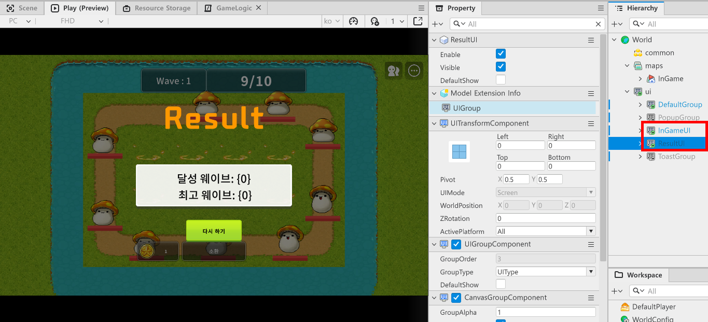
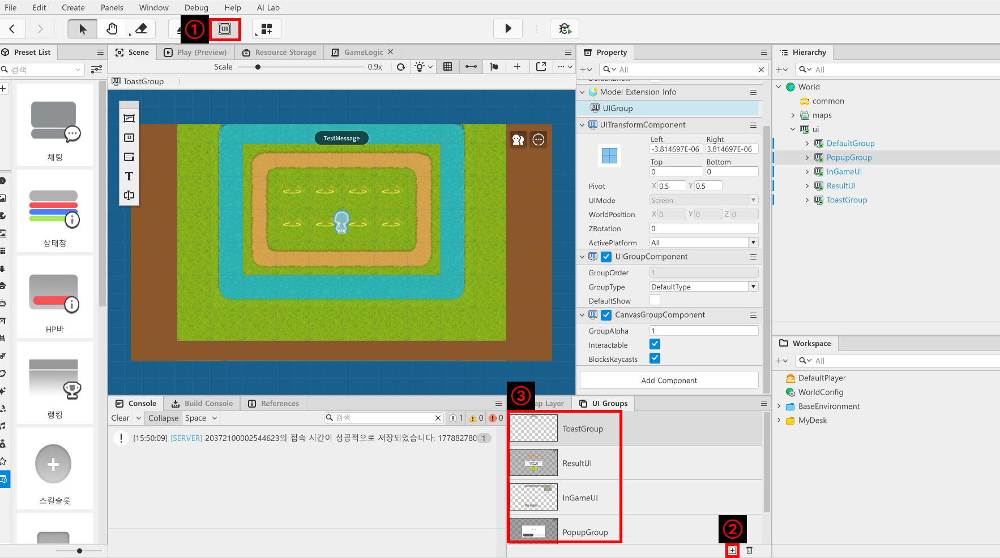
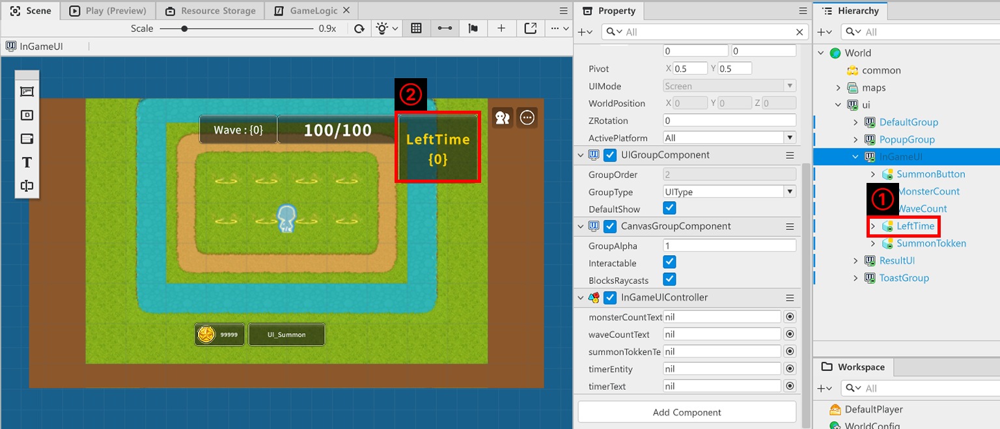
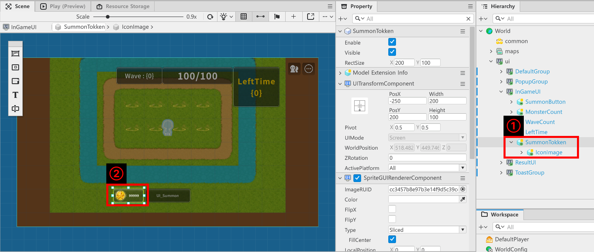
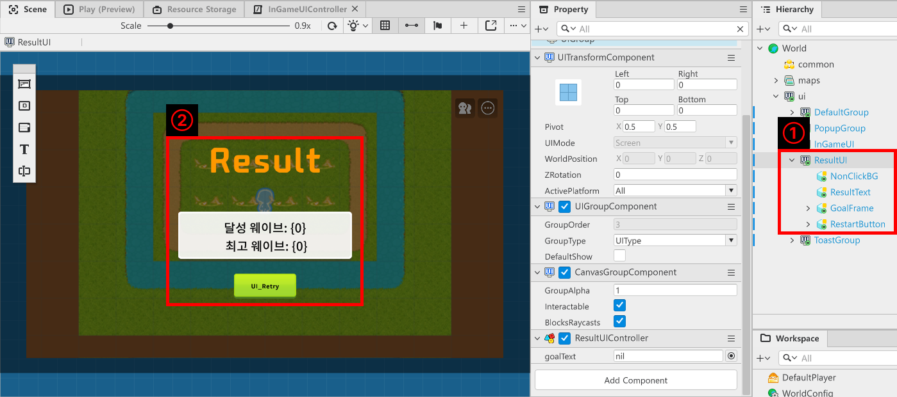

# [💡 기초 학습] UI 구성하기
<br>
<br>
<br>

## 영상 타임라인
- 강의 영상내 아래의 타임라인에서 학습할 수 있습니다.
- 맵 타입 이해하기: `01:33:06`

<br>

## 학습 목표
- UI를 구성하는 방법에 대해 학습합니다.
- 플레이어가 유닛을 소환하기 위한 재화의 보유량을 확인하기 위한 UI를 구성합니다.
- 결과 UI를 제작하는 방법을 학습합니다.
- 현재 웨이브와 관련된 정보 UI를 제작하는 방법에 대해 학습합니다.
- 남은 시간을 표기하는 타이머 UI를 구현하는 방법을 학습합니다.

<br>

## 해당 영상 시청 후 수행해 볼 내용
- 샘플 월드의 UI를 구성하여 플레이어에게 필요한 정보를 제공하도록 화면을 구성합니다.
- 샘플 월드에서 사용하는 UI 외에 다른 리소스를 사용하여 UI의 디자인을 변경합니다.

<br>

## UI 구성하기

<p align="center">

</p>

- UI를 구성하기 위해선 UI Group이 필요합니다.
- UI Group은 UI 엔티티를 담기 위한 단위이며 UI Group의 순서에 따라 화면에 출력되는 순서가 변경됩니다.
- 따라서 UI Group의 순서가 의도하는 순서대로 구성되어 있는지 확인이 필요합니다.

<br>

### UI Group 생성하기

<p align="center">

</p>

- 메이플스토리 월드 에디터 상단의 UI 버튼을 클릭합니다.
- `UI Groups` 창의 `+` 버튼을 클릭합니다.
- 새롭게 생성된 UI Gorup은 `UI Groups` 창에 추가됩니다.

<br>

### Timer 생성하기

<p align="center">

</p>

- 샘플 월드에서는 **InGameUI**내 LeftTime 엔티티가 남은 시간을 출력하는 기능을 수행합니다.
- LeftTime 엔티티는 남은 시간을 표기하는 타이머의 배경 이미지를 출력합니다.
- LeftTime의 자식 엔티티인 TimerText는 남은 시간을 출력합니다.
- 각 엔티티는 다음의 Component를 가지고 있습니다.
- **LeftTime**
    - `SpriteGUIRendererComponent`: 이미지 출력을 위한 Component입니다.
- **TimerText**
    - `TextGUIRendererComponent`: 남은 시간을 텍스트로 출력하기 위한 Component입니다.

<br>

- **InGameUIController**에 타이머를 작동하기 위한 스크립트를 작성합니다.
- 샘플 월드에서는 UpdateTimer를 통해 남은 시간을 표기하고 있습니다.
- 아래는 UpdateTimer 코드입니다.

```lua
@ExecSpace("ClientOnly")
method void UpdateTimer(number deltaTimer)
-- 전달받은 deltaTimer 값을 기준으로 남은 시간 UI를 갱신합니다.
if self.timerEntity.Enable == false then
	self.timerEntity.Enable = true
end

local timeString = string.format("%.2f", deltaTimer)

self.timerText.Text = "LeftTime\n"..timeString
end
```

> 해당 코드는 Plain Text를 기준으로 작성된 코드입니다.

<br>

- string.format을 통해 남은 시간을 15.5와 같이 남은 시간을 표시합니다.
- GameLogic에서 남은 시간을 연산하면 해당 Method를 통해 UI를 갱신합니다.

<br>

### 재화 UI 구성하기

<p align="center">

</p>

- 샘플 월드에서 InGameUI의 SummonTokken이 소환 토큰의 개수를 출력하는 UI를 담당합니다.
- 소환 토큰 UI의 구성은 다음과 같습니다.
- **SummonTokken**
    - 소환 토큰의 프레임을 출력하기 위한 엔티티입니다.
    - `SpriteGUIRendererComponent`를 보유하고 있으며 프레임을 출력합니다.
- **IconImage**
    - 소환 토큰의 아이콘을 출력하기 위한 엔티티입니다.
    - **SummonTokken**의 자식 엔티티입니다.
    - 소환 토큰 아이콘을 출력하기 위해 `SpriteGUIRendererComponent`를 가지고 있습니다.
- **SummonTokkenText**
    - 소환 토큰의 개수를 출력하기 위한 엔티티입니다.
    - **IconImage**의 자식 엔티티입니다.
    - 소환 토큰의 개수를 출력하기 위해 `TextGUIRendererComponent`를 가지고 있습니다.
- `InGameUIController`의 UpdateSummonTokkenUI를 통해 남은 소환 토큰의 개수를 출력합니다.
- 아래는 UpdateSummonTokkenUI의 코드입니다.

```lua
@ExecSpace("ClientOnly")
method void UpdateSummonTokkenUI(number TokkenValue)
-- summonTokkenText가 nil일 경우 초기화를 시도합니다.
if not isvalid(self.summonTokkenText) then
	self:InitSummonTokken()
end
-- 전달받은 TokkenValue를 기준으로 남은 토큰 수 UI를 갱신합니다.
self.summonTokkenText.Text = tostring(math.floor(TokkenValue))
end
```

> 해당 코드는 Plain Text로 작성된 코드입니다.

<br>

### 결과 UI 구성하기

<p align="center">

</p>

- 샘플 월드에서는 **ResultUI**를 통해 결과 UI를 출력합니다.
- **ResultUI**는 다음의 구성으로 이뤄져 있습니다.
- **NonClickBG**
    - 다른 UI를 시각적으로 가리기 위해 제작된 엔티티입니다.
    - `SpriteGUIRendererComponent`를 보유하고 있습니다.
- **ResultText**
    - 결과 UI임을 표기하기 위한 텍스트 엔티티입니다.
    - `TextGUIRendererComponent`를 가지고 있습니다.
- **GoalFrame**
    - 결과를 출력하기 위한 프레임 엔티티입니다.
    - `SpriteGUIRendererComponent`를 가지고 있습니다.
- **GoalText**
    - 결과를 텍스트로 출력하기 위한 엔티티입니다.
    - `TextGUIRendererComponent`를 가지고 있습니다.
- **RestartButton**
    - 다시 시작하기 기능을 실행하는 버튼 엔티티입니다.
    - `SpriteRendererComponent`와 `ButtonComponent`를 가지고 있습니다.
- **ButtonText**
    - 다시 시작하기 버튼의 이름을 출력하기 위한 엔티티입니다.
    - `TextGUIRendererComponent`를 가지고 있습니다.

- 해당 UI의 구성을 사용하기 위해 **ResultUI**는 **ResultUIController**를 가지고 있습니다.
- 아래는 **ResultUIController**의 코드입니다.

```lua
@Component
script ResultUIController extends Component

property TextGUIRendererComponent goalText = nil

@ExecSpace("ClientOnly")
method void OnBeginPlay()
self:InitGoalText()
end

@ExecSpace("ClientOnly")
method void InitGoalText()
-- goalText가 nil인지 검사합니다.
if not isvalid(self.goalText) then
	-- GoalText 엔티티를 찾아 등록합니다.
	local findEntity = _EntityService:GetEntityByPath("/ui/ResultUI/GoalFrame/GoalText")
	-- findEntity가 정상적으로 등록되었는지 확인합니다.
	if isvalid(findEntity) then
		-- findEntity의 TextGUIRendererComponent를 등록합니다.
		self.goalText = findEntity.TextGUIRendererComponent
	end
end
end

@ExecSpace("ClientOnly")
method void UpdateResultText(number AchieveGoalCount, number BestGoalCount)
-- 결과 텍스트를 전달받은 값으로 UI 갱신을 시도합니다.
self.goalText.Text = _LocalizationService:GetTextFormat("UI_ResultWave", AchieveGoalCount, BestGoalCount)
end

@ExecSpace("ClientOnly")
method void Show()
self.Entity.Enable = true
end

@ExecSpace("ClientOnly")
method void Hide()
self.Entity.Enable = false
end

@EventSender("Entity", "336d7e78-d49b-4d6e-8f66-4cec32b01c85")
handler HandleButtonClickEvent(ButtonClickEvent event)
-- 다시하기 버튼을 클릭할 경우 재시작을 GameLogic에게 요청합니다.
self:Hide()
_GameLogic:RestartGame()
end

end
```

> 해당 코드는 Plain Text를 기준으로 작성된 코드입니다.

<br>

## UI 관리를 위한 Logic 제작하기
- Component가 UI에 접근하기 위해 매번 UI 엔티티를 찾기엔 번거롭습니다.
- 따라서 UI를 관리하는 Component들을 하나의 Logic에 저장한 뒤, 해당 Logic을 통해 필요한 기능을 요청하거나 UI를 켜고 끌 수 있습니다.
- 샘플 월드에서는 **UIManageLogic**을 제작하여 사용하고 있습니다.


<br>

## 최소 구현 기준
- 게임의 결과를 알 수 있는 UI가 결과와 함께 출력되어야 합니다.
- 플레이어의 소환 토큰의 개수를 확인할 수 있도록 UI가 구성되어야 합니다.
- 웨이브의 몬스터 소환이 마무리되었다면 남은 시간을 표기하도록 기능이 구성되어야 합니다.
- 아래는 UIManageLogic의 코드입니다.

```lua
@Logic
script UIManageLogic extends Logic

property InGameUIController ingameUIController = nil

property ResultUIController resultUIController = nil

@ExecSpace("ClientOnly")
method void OnBeginPlay()
self:InitIngameUIController()
self:InitResultUIController()
end

@ExecSpace("ClientOnly")
method void InitIngameUIController()
-- UI 그룹에서 InGameUI를 찾아 Component를 등록합니다.
if not isvalid(self.ingameUIController) then
	local findUI = _EntityService:GetEntityByPath("/ui/InGameUI")
	if isvalid(findUI) then
		self.ingameUIController = findUI.InGameUIController
	end
end
end

@ExecSpace("ClientOnly")
method void UpdateMonsterCount(number CurrentMonsterCount, number MaxMonsterCount)
-- ingameUIController가 nil일 경우 초기화를 요청합니다.
if not isvalid(self.ingameUIController) then
	self:InitIngameUIController()
end
-- 전달받은 값을 기준으로 현재 몬스터의 현황 UI를 업데이트합니다.
self.ingameUIController:CountLeftMonster(CurrentMonsterCount, MaxMonsterCount)
end

@ExecSpace("ClientOnly")
method void UpdateWaveCount(number WaveCount)
-- ingameUIController가 nil일 경우 초기화를 요청합니다.
if not isvalid(self.ingameUIController) then
	self:InitIngameUIController()
end
-- 현재 Wave를 갱신하도록 요청합니다.
self.ingameUIController:UpdateWaveCount(WaveCount)
end

@ExecSpace("ClientOnly")
method void DisableTimer()
-- TimerUI를 가리도록 요청합니다.
self.ingameUIController:DisableTimer()
end

@ExecSpace("ClientOnly")
method void InitResultUIController()
-- resultUIController가 nil일 경우 ui에서 ResultUI를 찾아 등록합니다.
if not isvalid(self.resultUIController) then
	local findEntity = _EntityService:GetEntityByPath("/ui/ResultUI")
	self.resultUIController = findEntity.ResultUIController
end
end

@ExecSpace("ClientOnly")
method void ShowResultUI(number CurrentWave, number BestWave)
-- 여기서 현재 전달받은 WaveCount와 스토리지에서 동기화된 최고 Wave 값을 함께 넘겨줍니다.
self.resultUIController:UpdateResultText(CurrentWave, BestWave)
self.resultUIController:Show()
end

@ExecSpace("ClientOnly")
method void UpdateSummonTokken(number TokkenValue)
-- 소환 토큰 UI를 업데이트합니다.
self.ingameUIController:UpdateSummonTokkenUI(TokkenValue)
end

@ExecSpace("ClientOnly")
method void UpdateTimer(number TimerValue)
-- Timer를 업데이트 하도록 요청합니다.
self.ingameUIController:UpdateTimer(TimerValue)
end

end
```

> 해당 코드는 Plain Text로 작성된 코드입니다.

<br>

## 응용 및 확장 방향
- 오프라인 보상과 함께 추가된 재화가 있다면 이를 표기하는 UI를 제작합니다.
- 캐릭터의 정보를 출력할 수 있는 UI를 구성하고, 캐릭터의 정보를 출력할 수 있도록 기능을 구현합니다.