#[💡 基礎學習] 設計地圖
<br>
<br>
<br>


## 影片時間軸
- 可在課程影片中以下時間點進行學習。
- 理解地圖類型：`00:03:00`

<br>

## 學習目標

- 學習在楓之谷世界中更換地圖的方法。
- 學習運用RectTileMap製作地圖的方法。
- 學習運用實體階層結構管理實體的方法。

<br>

## 觀看該影片後可嘗試執行的內容

- 可以建立遊戲進行所需的地圖。
- 可以運用想要的TileSet建立地圖。
- 可以運用Hierarchy的階層結構管理實體。

<br>

## 理解地圖類型

- 楓之谷世界提供的地圖類型共有3種。
- 每種地圖配置作為地圖平台之Tile的方式都會有所變化。

<table class="tg"><thead>
  <tr>
    <th class="tg-nrix">編號</th>
    <th class="tg-xwyw">名稱</th>
    <th class="tg-xwyw">說明</th>
  </tr></thead>
<tbody>
  <tr>
    <td class="tg-baqh">1</td>
    <td class="tg-0a7q">TileMap</td>
    <td class="tg-0a7q">用來製作類似楓之谷的2D橫向捲軸類型地圖。可以透過MapleTile製作斜坡、牆壁等。</td>
  </tr>
  <tr>
    <td class="tg-baqh">2</td>
    <td class="tg-0a7q">RectTileMap</td>
    <td class="tg-0a7q">用來製作俯視視角類型地圖。可以配置棋盤狀Tile來建立地圖。</td>
  </tr>
  <tr>
    <td class="tg-baqh">3</td>
    <td class="tg-0a7q">SideViewRectTileMap</td>
    <td class="tg-0a7q">用來製作2D橫向捲軸類型地圖。可以像RectTileMap一樣配置棋盤狀Tile，建立2D橫向捲軸類型地圖。</td>
  </tr>
</tbody>
</table>

<br>

- 範例世界使用俯視視角形式地圖，因此使用RectTileMap方式。

<br>

## 切換地圖

<p align="center">
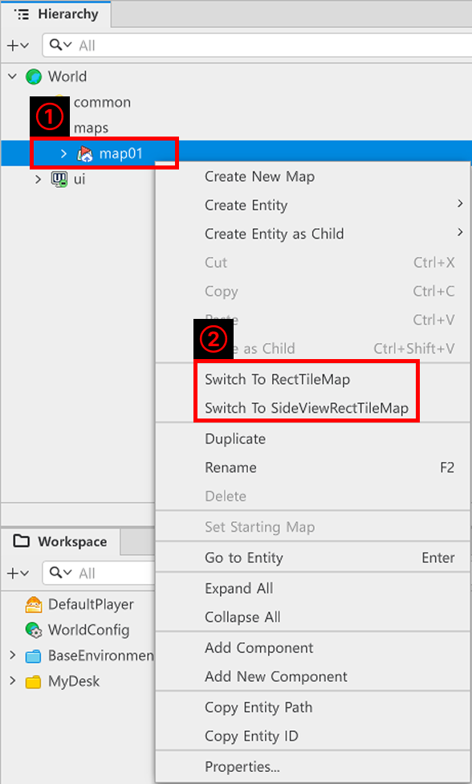
</p>

- 在「Hierarchy」視窗中，對正在編輯中的地圖按滑鼠右鍵。
- 可以透過「Switch To」選單按鈕切換為想要的地圖。
    - 「Switch To TileMap」：將目前正在編輯中地圖的類型更改為TileMap方式。
    - 「Switch To RectTileMap」：將目前正在編輯中地圖的類型更改為RectTileMap方式。
    - 「Switch To SideViewRectTileMap」：將目前正在編輯中地圖的類型更改為SideViewRectTileMap方式。

<br>

### ⚠️ 切換地圖時的注意事項

<p align="center">

</p>

- 若切換地圖類型，既有配置的Tile資訊會全部初始化。

<br>

<p align="center">
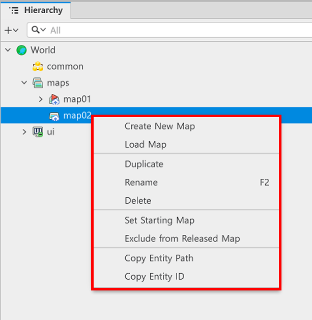
</p>

- 地圖類型只能更改目前正在編輯中的地圖。

<br>

<p align="center">
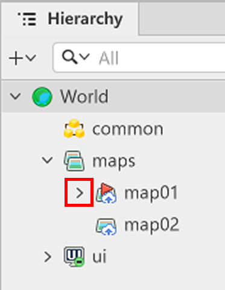
</p>

- 目前正在編輯中的地圖會有「>」標記。
- 可以更改有該標記之地圖的格式。

<br>

## 了解RectTileMap組成

<p align="center">
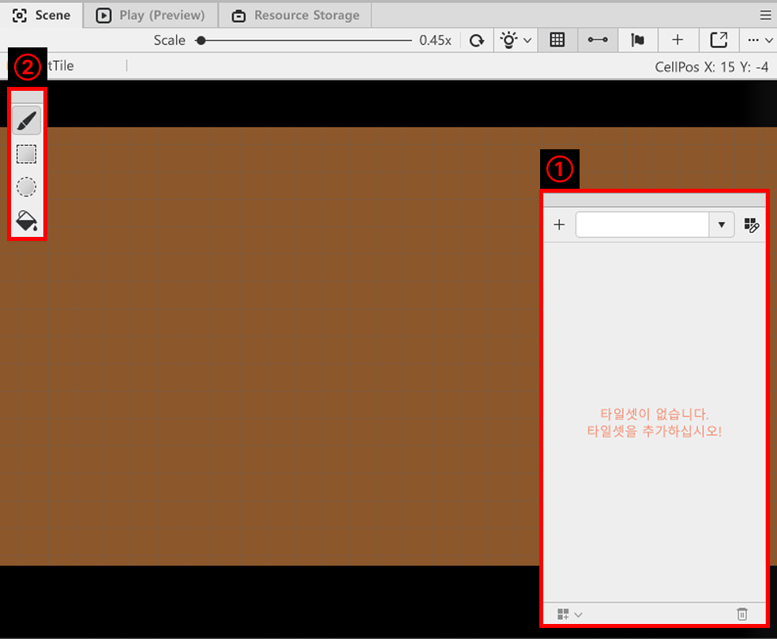
</p>

1.用於管理TileSet或更改Tile性質等Tile相關編輯的編輯器。
2.用來將選擇的Tile配置到Scene的工具。
    - 筆刷：可以像用筆刷畫圖一樣配置圖塊。可以點擊像點一樣放置，也可以拖曳連續配置Tile。
    - 矩形：透過滑鼠拖曳指定矩形範圍後，將選擇的圖塊配置到指定範圍。
    - 圓形：透過滑鼠拖曳指定圓形範圍後，將選擇的圖塊配置到指定範圍。

<br>

### 製作TileSet

<p align="center">
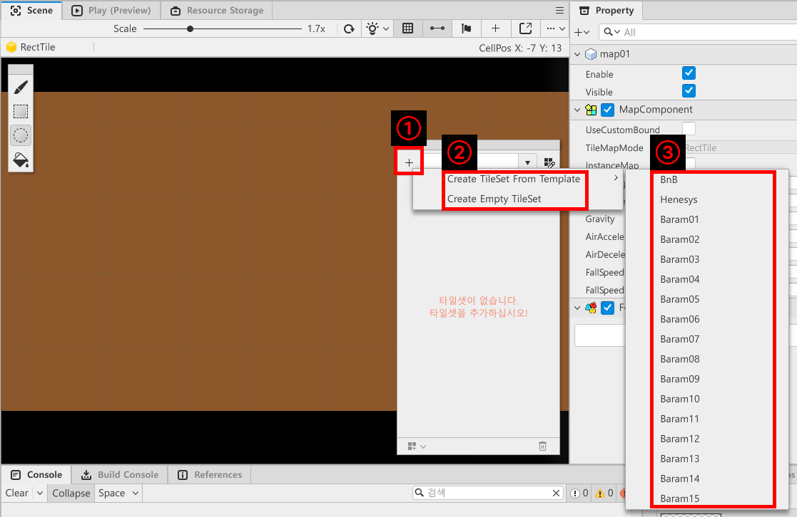
</p>

1.在TileSet Editor中點擊「+」按鈕。
2.在「Create」選單中點擊`Create TileSet From Template，使用楓之谷世界提供的Tile資源。
    - 若想製作自己的TileSet，可以透過「Create Empty TileSet」建立空TileSet。
3.選擇想要的資源製作TileSet。

<br>

#### 💬 什麼是TileSet?

<p align="center">

</p>

- **TileSet**是**Tile**集合而成的調色盤概念。
- 畫圖時會先把顏料擠在調色盤上，再使用擠好的顏料。
- 將各種顏料，也就是**Tile**，擠在名為**TileSet**的調色盤上。
- 開發者只需要取用放在**TileSet**調色盤中的**Tile**，塗到「Scene」上即可。

<p align="center">
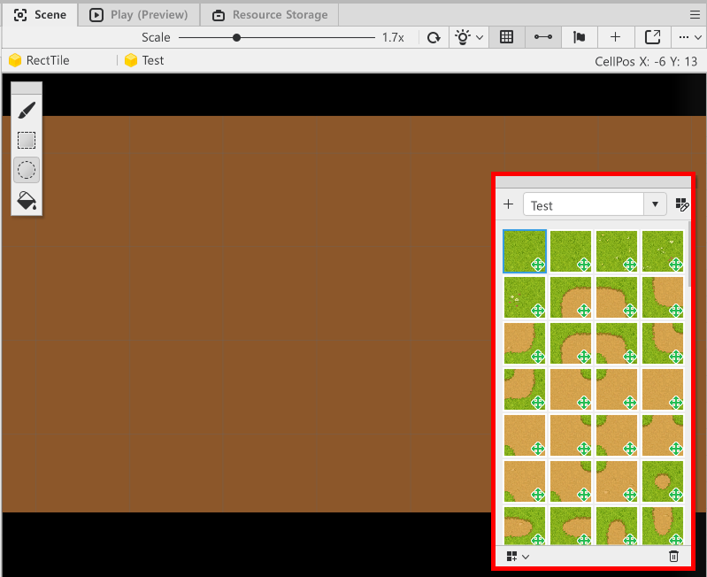
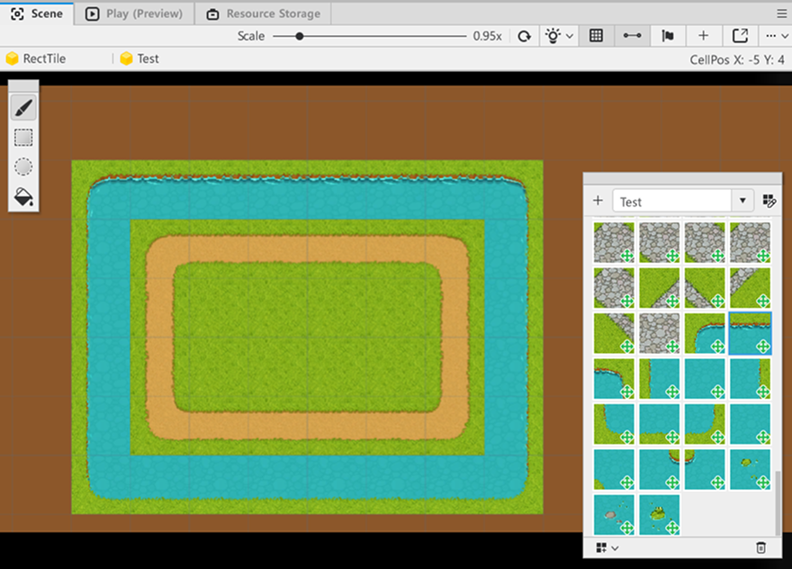
</p>

- 可以將各種Tile配置到Secene畫面上建立地圖。

<br>

## 配置欄位

<p align="center">
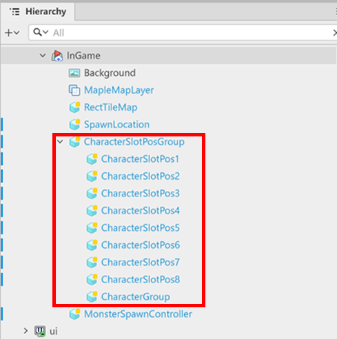
</p>

- 為了指定並使用角色配置位置，需要製作用於配置的欄位，因此必須建立實體。
- 若將多個實體排列在同一張地圖中，管理上會發生困難。
- 為了解決這類問題，可以用空實體的子實體來管理。

<br>

### 建立實體

- 建立實體的方法大致有2種。
    - 一般實體建立：可以將實體建立為目前正在編輯中地圖的子實體。
    - 建立為子實體：將實體配置為目前選取中實體的子實體。 
- 可依需求建立空實體後，將子實體設定為空實體的子實體，依照實體特性進行區分。
    - 範例世界中，將CharacterSlotPos設定為CharacterSlotPosGroup這個實體的子實體。
    - 透過這樣，CharacterSlotPosGroup實體可以收納自己的子實體CharacterSlotPos，扮演包裝紙的角色。

<p align="center">
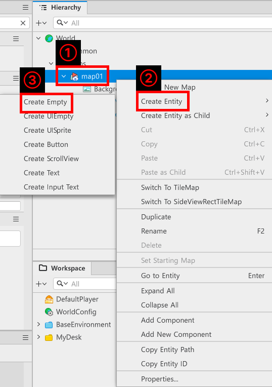
</p>

- 在「Hierarchy」視窗中，對正在編輯中的地圖按滑鼠右鍵。
- 點擊「Create Entity」開啟展開選單。
- 點擊「Create Empty」建立空實體。

<br>

#### 建立為子實體

<p align="center">
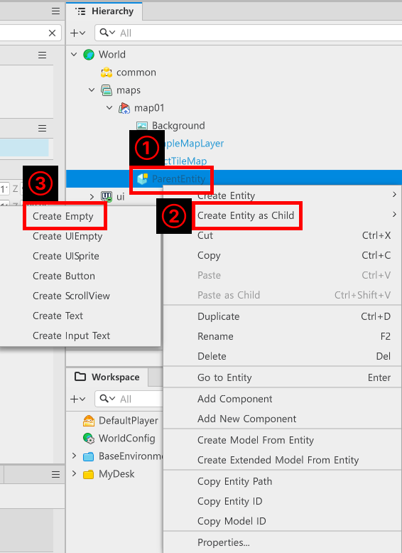
</p>

- 對要作為父層的實體按滑鼠右鍵。
- 點擊「Create Entity as Child」開啟展開選單。
- 可以透過「Create Empty」將空實體建立為子實體。

<br>

#### ⚠️ 以實體群組收納時的注意事項
<p align="center">

</p>

- 子實體可能會受到父實體位置影響。
- 因此若只是單純用於管理實體，應注意不要移動父實體座標。

<br>

### 設定欄位實體

<p align="center">
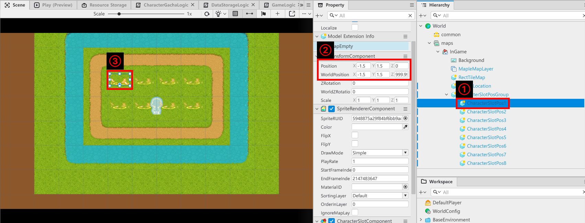
</p>

- 點擊已建立的實體。
- 在「Property」視窗中修改「TransformComponent」的Position或WorldPosition值，指定角色生成位置。
- 在Scene畫面中檢查是否配置在正常位置。

<br>

### 賦予欄位實體Component

- Component是楓之谷世界中讓實體執行特定功能的項目。
- 透過Component，實體可以執行顯示圖片、處理資料等各種功能。

<p align="center">
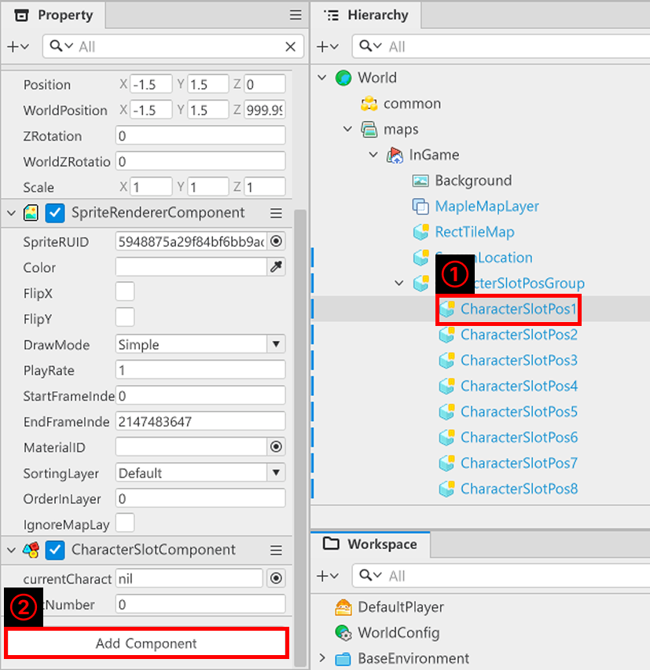
</p>

- 在「Hierarchy」中點擊想新增Component的實體。
- 點擊「Property」視窗最下方的「Add Component」。

<p align="center">
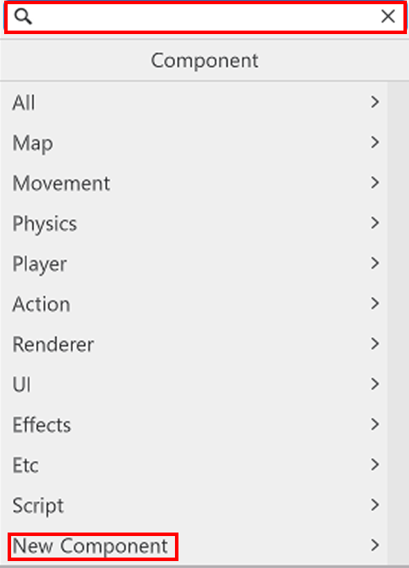
</p>

- 可以搜尋Component名稱來新增Componnet。
- 或者若需要全新製作，可以透過「New Componen」t製作並新增新的Component。
- 範例世界中製作為CharacterSlotComponent。
- 會將CharacterSlotGroupComponent賦予用來管理CharacterSlotPos的CharacterSlotPosGroup。
- 以下是CharacterSlotComponent、CharacterSlotPosGroup Component。

```lua
@Component
script CharacterSlotComponent extends Component

property Entity currentCharacterEntity = nil

property number slotNumber = 0

@ExecSpace("ClientOnly")
method boolean CheckCanSpawnCharacter()
-- 若欄位中沒有登錄角色，則將角色可生成與否回傳為true。
if not(self.currentCharacterEntity) then
	return true
else
-- 否則回傳false。
	return false
end
end

@ExecSpace("ClientOnly")
method void InitCharacterEntity(Entity CharacterEntity)
-- 將currentCharacterEntity登錄為傳入的實體。
self.currentCharacterEntity = CharacterEntity
end

@ExecSpace("ClientOnly")
method void InitSlotNumber(number SlotNumber)
-- 登錄遊戲開始時分配給自身的編號。
self.slotNumber = SlotNumber
end

@ExecSpace("ClientOnly")
method number GetSlotNumber()
-- 回傳分配給自身的SlotNumber。
return self.slotNumber
end

end
```

> 該程式碼是以Plain Text為基準編寫而成。

```lua
@Component
script CharacterSlotGroupComponent extends Component

property table characterSlotList = {}

property Entity characterGroup = nil

@Description(「確認目前是否有正在拖曳中的實體的鎖定變數」)
property boolean isDragging = false

@ExecSpace("ClientOnly")
method void OnBeginPlay()
-- 遊戲開始時尋找子欄位List。
self:InitCharacterSlotList()
-- 遊戲開始時尋找characterGroup。
self:InitCharacterGroup()
end

@ExecSpace("ClientOnly")
method void InitCharacterSlotList()
-- 遊戲開始時尋找characterGroup。
if not isvalid(self.characterSlotList) or not next(self.characterSlotList) then
	-- 取得目前實體的子實體。
	local childrenCount = self.Entity.Children.Count
	-- 從1開始重複執行至childrenCount。
	for i = 1, childrenCount do
		-- 指定子實體的名稱格式。
		local entityName = "CharacterSlotPos"..i
		-- 以名稱尋找自身子實體。
		local getChildEntity = self.Entity:GetChildByName(entityName)
		-- 若正常找到數值，則進行登錄。
		if isvalid(getChildEntity) then
			self.characterSlotList[i] = getChildEntity.CharacterSlotComponent
			self.characterSlotList[i]:InitSlotNumber(i)
			end
	end
end
end

@ExecSpace("ClientOnly")
method void InitCharacterGroup()
-- 確認characterGroup是否為空。
if not isvalid(self.characterGroup) then
	-- 若為空，則尋找並登錄CharacterGroup。
	local findEntity = self.Entity:GetChildByName("CharacterGroup")
	-- 若正常找到，則登錄CharacterGroup。
	self.characterGroup = findEntity
end
end

@ExecSpace("ClientOnly")
method number ReturnEmptySlotNumber()
-- 依照characterSlotList的數量開始搜尋。
for i = 1, #self.characterSlotList do
	-- 檢查第i個欄位是否為空。
	if self.characterSlotList[i]:CheckCanSpawnCharacter() then
		-- 若第i個欄位為空，則回傳i。
		return i
	end
end
-- 若沒有空欄位，則回傳0。
return 0
end

@ExecSpace("ClientOnly")
method void SpawnCharacter(number SlotNumber, CharacterData CharacterData)
-- 以傳入Data為基準複製Model。
local SpawnCharacter = _SpawnService:SpawnByModelId(CharacterData.ModelID, CharacterData.CharacterID, Vector3.zero, self.characterGroup)
-- 將生成的角色位置移至傳入的SlotNumber。
SpawnCharacter.TransformComponent.WorldPosition = self.characterSlotList[SlotNumber].Entity.TransformComponent.WorldPosition
-- 為生成的角色登錄角色資訊並啟用。
SpawnCharacter.UnitController:InitCharacterData(CharacterData, self.characterSlotList[SlotNumber].Entity)
-- 在傳入的SlotNumber登錄生成的角色。
self.characterSlotList[SlotNumber]:InitCharacterEntity(SpawnCharacter)
end

@ExecSpace("ClientOnly")
method void SwitchSlotCharacter(number TargetSlotNumber, Entity TargetEntity, number BeforeSlotNumber)
if not isvalid(self.characterSlotList[TargetSlotNumber].currentCharacterEntity) then
	-- 若是空欄位，表示要移動的欄位為空，因此執行移動。
	TargetEntity.UnitController:ChangeSlot(self.characterSlotList[TargetSlotNumber].Entity) 
	-- 將傳入的實體登錄至要移動的欄位。
	self.characterSlotList[TargetSlotNumber]:InitCharacterEntity(TargetEntity)
	-- 將既有欄位轉換為nil狀態。
	self.characterSlotList[BeforeSlotNumber]:InitCharacterEntity(nil)
else
	-- 若欄位中已存在其他實體，則將原本位於目標欄位中的既有實體儲存至變數。
	local existingEntity = self.characterSlotList[TargetSlotNumber].currentCharacterEntity
        
	-- 將既有實體移動至空的Before欄位位置。
	existingEntity.UnitController:ChangeSlot(self.characterSlotList[BeforeSlotNumber].Entity)
        
	-- 將拖曳過來的實體移動至目標欄位位置。
	TargetEntity.UnitController:ChangeSlot(self.characterSlotList[TargetSlotNumber].Entity)
        
	-- 交換各欄位的資訊。
	self.characterSlotList[BeforeSlotNumber]:InitCharacterEntity(existingEntity)
	self.characterSlotList[TargetSlotNumber]:InitCharacterEntity(TargetEntity)
end
end

@ExecSpace("ClientOnly")
method void ClearCharacterList()
-- 先確認characterGroup是否有效。
if isvalid(self.characterGroup) then
	local children = self.characterGroup.Children
        
	-- 從後方開始(反向)巡覽並刪除子實體。
	for i = children.Count, 1, -1 do
		local childEntity = children[i]
		if isvalid(childEntity) then
			childEntity:Destroy()
		end
	end
end

-- 將characterSlotList中殘留的Entity參照資料初始化為nil。
for i = 1, #self.characterSlotList do
	local slot = self.characterSlotList[i]
	if isvalid(slot) then
		slot:InitCharacterEntity(nil)
	end
end
end

end
```

> 該程式碼是以Plain Text為基準編寫而成。

<br>

## 播放BGM

- 不僅是實體，也可以將Component賦予地圖。
-在「Hierarchy」中，透過「Add Component」將新Component新增至正在編輯中的地圖。
- 將該Component名稱寫為BGMPlayer。
- 接著將程式碼撰寫如下。

```lua
@Component
script BGMPlayer extends Component

property string bgmID = ""

@ExecSpace("ClientOnly")
method void OnBeginPlay()
self:PlayBGM()
end

@ExecSpace("ClientOnly")
method void PlayBGM()
-- 以登錄的bgmID為基準播放背景音。
_SoundService:PlayBGM(self.bgmID, 1.0)
end

end
```

> 該程式碼是以Plain Text為基準編寫而成。

<br>

### 搜尋資源

- 若要播放BGM，必須指定要播放哪個音效檔。
- 楓之谷世界提供各種資源。

<p align="center">
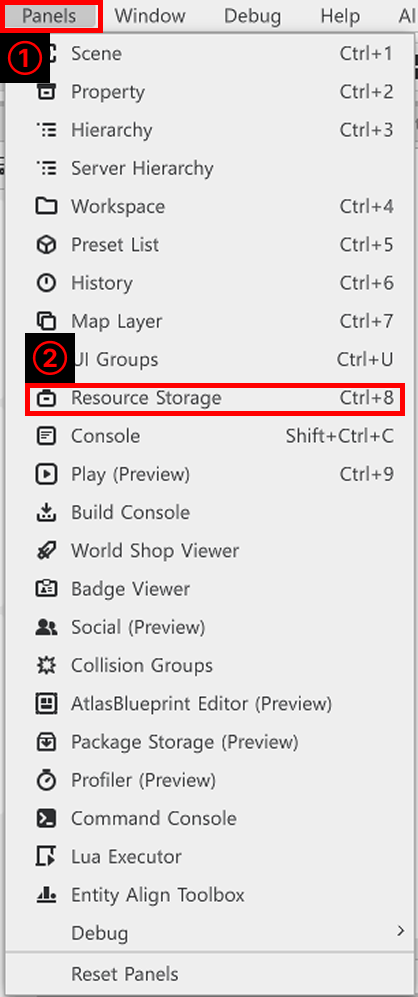
</p>

- 點擊楓之谷世界Editor上方的「Panels」。
- 點擊「Resource Storage」開啟「Resource Storage」視窗。

<p align="center">
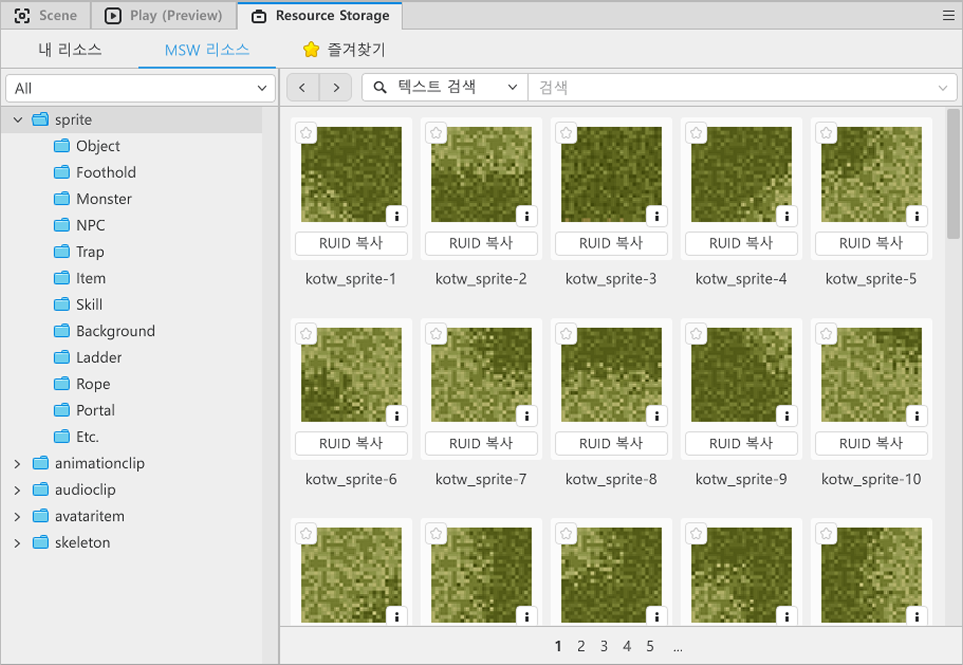
</p>

- 在顯示的「Resource Storage」視窗中複製所需資源的RUID。

<p align="center">
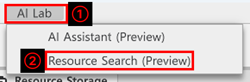
</p>

- 另一種方法是使用「AI Lab」的功能。
- 點擊楓之谷世界Editor上方的「AI Lab」。
- 點擊選單中的「Resource Search」。

<p align="center">

</p>

- 可以透過名稱、關鍵字、類型、分類等多種方法搜尋資源。
- 將找到的BGM資源ID登錄至前面製作的BGMPlayer bgmID。

<br>

## 最低製作標準

- 在一張地圖中建立實際遊戲運作的Map。
- 建立可配置角色的欄位與怪物移動的路徑。
- 製作讓玩家播放遊戲內背景音。

<br>

## 應用與進階應用

- 透過環境設定指定可調整背景音的變數。
- 製作讓背景音可依照地圖更改的功能。
- 以不同於範例世界的形式，建立角色所在位置與怪物移動路徑。