#[💡 基礎學習] 製作角色
<br>
<br>
<br>

## 影片時間軸
- 可在課程影片中以下時間點進行學習。
- 理解地圖類型：`00:20:06`

<br>

## 學習目標
- 學習並製作用來建立角色的DataSet建立方法。
- 製作用來使用角色資訊的Logic。
- 學習製作並使用角色Model的方法。
- 製作讓角色移動到其他欄位的功能。
- 製作用於測試的召喚功能。

<br>

## 觀看該影片後可嘗試執行的內容

- 每個等級各製作3名以上角色，具備角色多樣性。
- 擴充DataSet資料，準備讓製作的角色可被使用的資料。
- 製作欄位移動功能，使角色可移動。

<br>

## 製作角色Model

### 什麼是Model?

<p align="center">
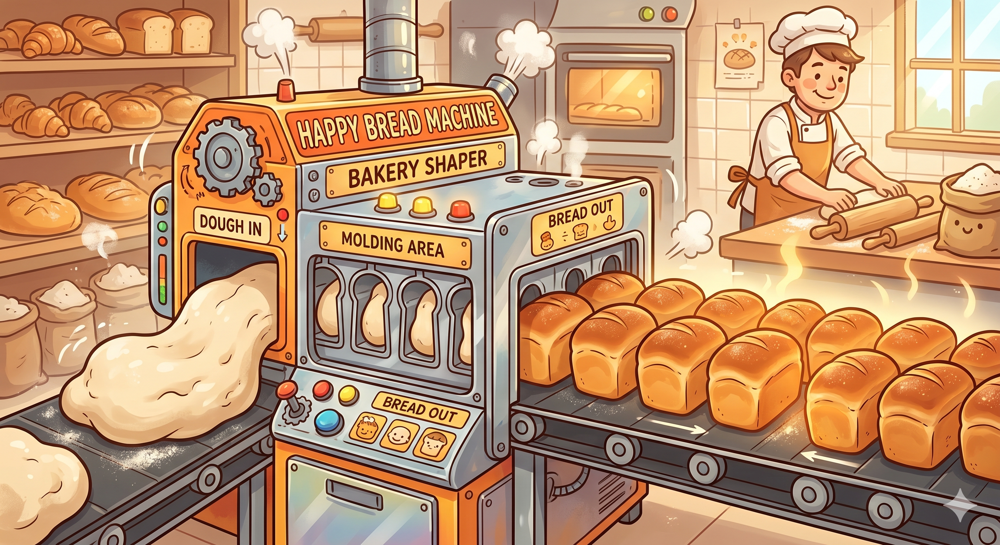
</p>

> 就像將麵團壓進模具中會出現相同形狀一樣，Model是用來使用相同形式實體的功能。

- Model是楓之谷世界中預先儲存相同形式、功能的一種格式。
- 適合在重複使用實體、實體階層結構、使用的Component、Property中分配的值等各種項目時使用。
- 特別是擁有相同外型與行動的怪物，製作Model後再複製使用的方式很有效。

<br>

### 為什麼要使用Model?
- 可重複使用性
  - 反覆配置相同怪物、道具、障礙物等時，不需要逐一建立物件並設定腳本與數值。 
  - 只要有一個完成的Model原本，就能無限複製使用。
- 批次更新
  - 調整遊戲平衡或更改設計時，不需要逐一修改配置在地圖上的大量物件。
  - 只要修改一個Model原本，Scene內存在的所有複製品都會立即自動套用更改事項。
- 遊戲執行中動態生成
  - 像子彈、技能效果、召喚獸這類無法預先配置在Scene中，且會在遊戲進行中即時產生的物件，可以透過程式碼在需要的瞬間立即讀取並管理。
- 安全且有效率的團隊協作
  - 若多名開發者同時修改同一個Scene，可能會發生衝突，導致遊戲損壞。
  - 將實體以Model為單位模組化後，企劃、設計師、程式設計師可各自獨立處理負責的Model檔案，進而安全協作且不發生衝突。

<br>

### 建立角色Model

<p align="center">
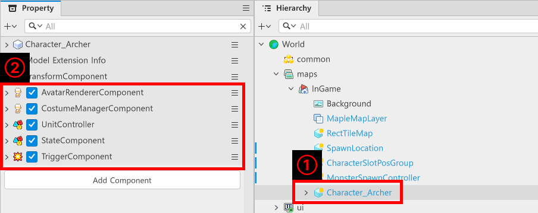
</p>

- 在「Hierarchy」建立空實體後更改名稱。
  - 範例世界中名稱規則使用**Character_角色名稱**。
- 將以下所有Component賦予已建立的實體。
- `AvatarRendererComponent`
  - 這是用來讓實體顯示楓之谷角色外型的Component。
- `CostumeManagerComponent`
  - 這是用來編輯角色外型的Component。
- `TriggerComponent`
  - 是用來指定角色攻擊範圍的Component。
- `StateComponent`
  - 這是用來確認角色目前狀態的Component。
- `UnitController`
  - 這是需要自行製作的Component。
  - 這是用來控制角色能力值、行動等的Component。

<p align="center">
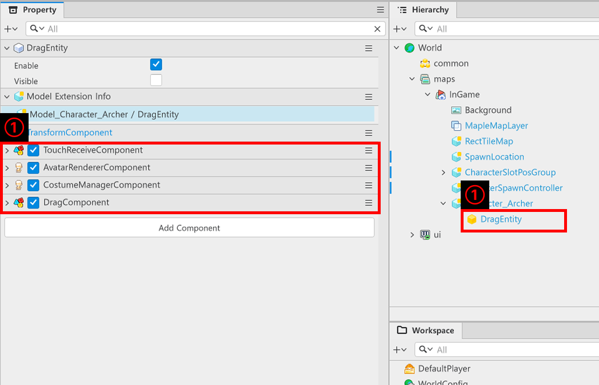
</p>

- 建立空實體作為子實體後，將名稱更改為**DragComponent**。
- 將以下Component賦予已建立的實體。
- `AvatarRendererComponent`
  - 這是用來相同顯示角色外型的Component。
- `CostumeManagerComponent`
  - 這是用來相同顯示角色外型的Component。
- `TouchReceiveComponent`
  - 這是用來讓角色對滑鼠點擊、觸碰產生反應的Component。
- `DragComponent`
  - 這是自行建立的Component。
  - 這是用來製作角色拖曳導致欄位移動的Component。

<p align="center">
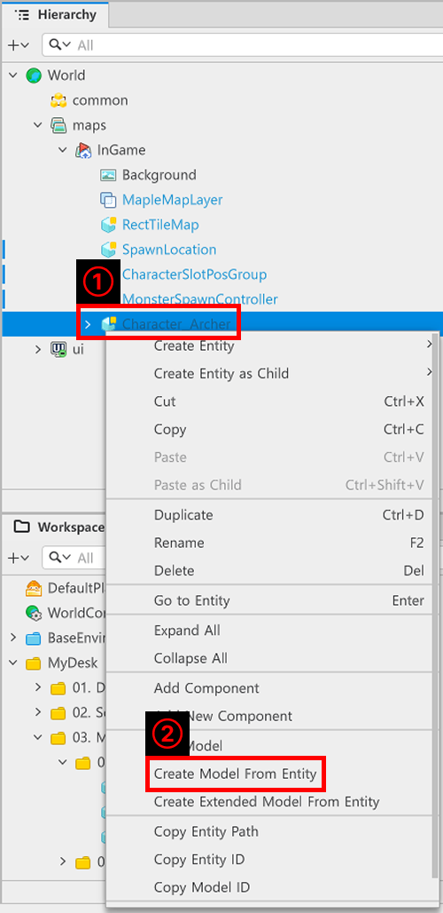
</p>

- 完成Component新增後，在Hierarchy中對要作為角色使用的實體按滑鼠右鍵。
- 點擊「Create Model From Entity」，將實體製作為Model。

<p align="center">
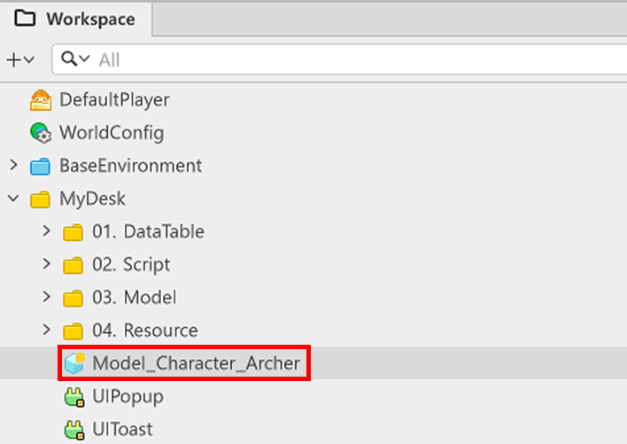
</p>

- 若「Workspace」、「MyDesk」內以**Model_實體名稱**建立實體，表示已正常Model化。

<br>

### 編輯Model

<p align="center">
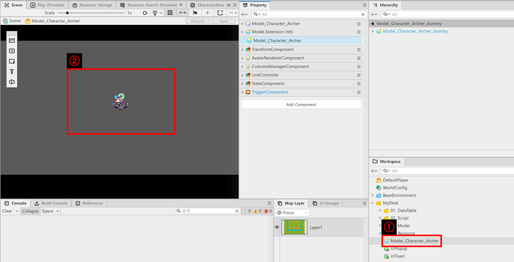
</p>

- 可在「Workspace」、「MyDesk」中雙擊Model，移動至Model編輯視窗。
- 移動至Model編輯視窗後，可以看到「Scene」畫面呈現灰色背景且只有實體。
- 在此狀態下編輯Model時，若使用相同Model，便能使用相同數值。
- 為了賦予角色特性，在「Property」視窗中修改以下Component。

<p align="center">
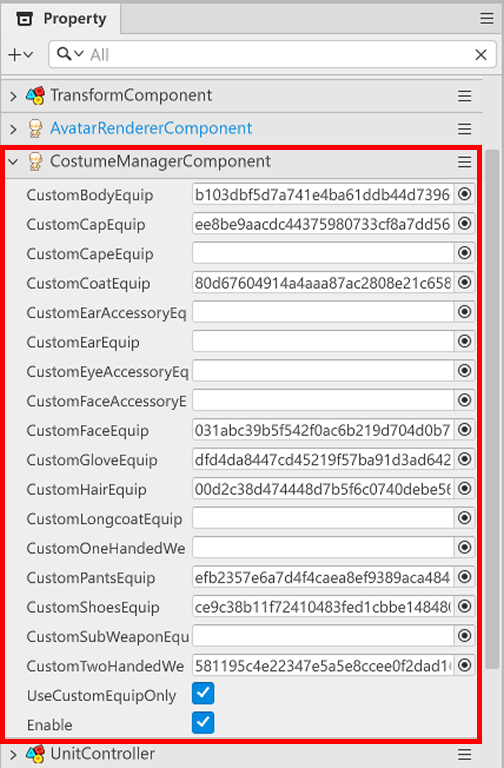
</p>

- `CostumeManagerComponent`
  - 這是用來裝飾角色外型的Component。
  - 更改「Property」視窗中的各項目，修改為想要外型的角色。
  - 完成所有修改後，將「UseCustomEquipOnly」轉換為勾選狀態。

<p align="center">
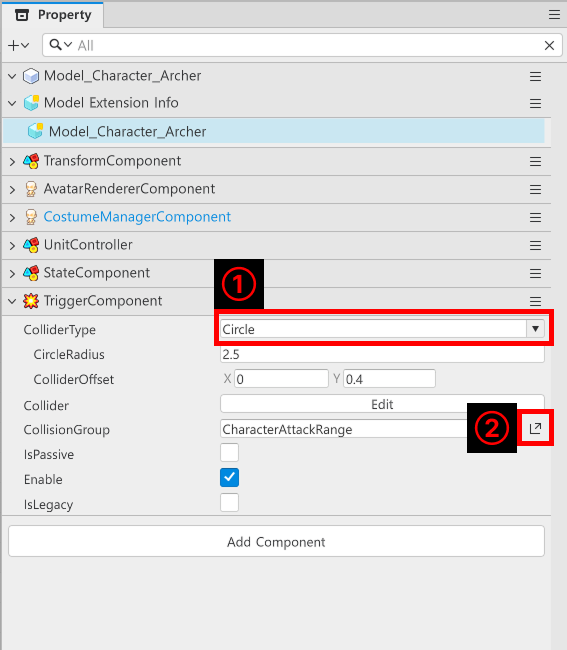
</p>

- 進行TriggerComponent的修改。
- 將ColliderType更改為**Circle**。
- 點擊CollisionGroup的面板按鈕，開啟「Collision Groups」視窗。

<p align="center">
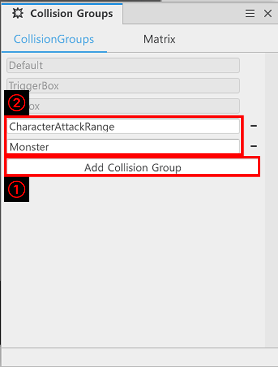
</p>

- 透過「Add Collision Group」建立新的Collision Group。
- 更改已建立Collision Group的名稱，建立2個Collision Group。
  - **CharacterAttackRange**：指定角色攻擊範圍的Collision Group。
  - **Monste**r：指定怪物碰撞範圍的Collision Group。

<p align="center">
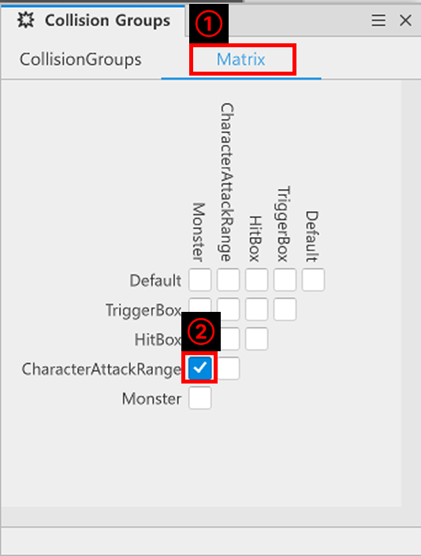
</p>

- 點擊「Collision Groups」視窗上方的「Matrix」。
- 取消所有勾選項目後，啟用「CharacterAttackRange」與「Monster」交叉之勾選項目的勾選。

<br>

#### ℹ️ Matrix的確認方法

<p align="center">
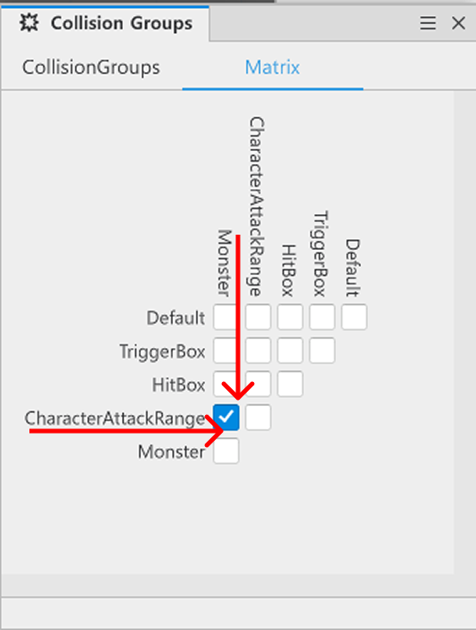
</p>

- 「Matrix」視窗中排列著Collision Group。
- 可以比較左側項目與上方項目，讓系統檢查Collision Group之間是否碰撞。
  - EX：**CharacterAttackRange**與**Monster**是否需要互相偵測碰撞?
    - 啟用勾選項目後，會成為碰撞偵測狀態。
    - 停用勾選項目後，兩個Collision Group不會互相偵測。

<br>

## 建立角色DataSet

### DataSet的目的
- 楓之谷世界中的DataSet，是以類似Excel或資料庫資料表的形式，儲存遊戲固定數值或資訊的功能。 
- 資料與邏輯分離
    - 不將體力、攻擊力等數值直接寫在腳本中，而是分離出來，藉此維持程式碼乾淨。
- 維護與平衡調整便利性
    - 修改角色能力值時不需要碰程式碼，只要在DataSet中更改數值，就會立即更新到遊戲中。
- 協作效率
    - 程式設計師可專注於邏輯開發，企劃則可透過DataSet獨立調整內容與平衡。
- 高擴充性
    - 新增新角色或怪物時，不需修改邏輯，只需在DataSet新增新列即可輕鬆製作。

<br>

### 製作DataSet

<p align="center">
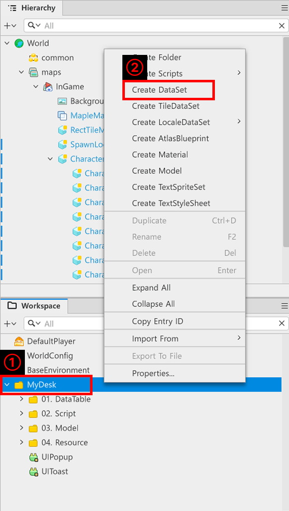
</p>

- 在「Workspace」中對「MyDesk」按滑鼠右鍵。
- 點擊「Create DataSet」製作DataSet。
- 範例世界中撰寫為**CharacterData**名稱。
- 以下是**CharacterData**的組成。

<table class="tg"><thead>
  <tr>
    <th class="tg-9wq8">編號</th>
    <th class="tg-9wq8">名稱</th>
    <th class="tg-9wq8">說明</th>
  </tr></thead>
<tbody>
  <tr>
    <td class="tg-lboi">1</td>
    <td class="tg-lboi">CharacterID</td>
    <td class="tg-lboi">用來分類角色的ID。</td>
  </tr>
  <tr>
    <td class="tg-lboi">2</td>
    <td class="tg-lboi">Grade</td>
    <td class="tg-lboi">用來分類角色等級的值。</td>
  </tr>
  <tr>
    <td class="tg-lboi">3</td>
    <td class="tg-lboi">BasicAttackValue</td>
    <td class="tg-lboi">用來指定角色基本攻擊力的值。</td>
  </tr>
  <tr>
    <td class="tg-lboi">4</td>
    <td class="tg-lboi">AttackAnimationID</td>
    <td class="tg-lboi">用來指定角色執行攻擊時需播放動畫Key的值。</td>
  </tr>
  <tr>
    <td class="tg-lboi">5</td>
    <td class="tg-lboi">BasicAttackEffectID</td>
    <td class="tg-lboi">基本攻擊執行時應顯示於角色身上的特效ID值。</td>
  </tr>
  <tr>
    <td class="tg-lboi">6</td>
    <td class="tg-lboi">BasicAttackHitEffectID</td>
    <td class="tg-lboi">基本攻擊執行時應顯示於敵人身上的特效ID值。</td>
  </tr>
  <tr>
    <td class="tg-lboi">7</td>
    <td class="tg-lboi">AttackRange</td>
    <td class="tg-lboi">用來設定角色偵測敵人範圍的值。</td>
  </tr>
  <tr>
    <td class="tg-lboi">8</td>
    <td class="tg-lboi">BasicAttackCoolTime</td>
    <td class="tg-lboi">用來指定基本攻擊冷卻時間的值。</td>
  </tr>
  <tr>
    <td class="tg-lboi">9</td>
    <td class="tg-lboi">ModelID</td>
    <td class="tg-lboi">用來指定角色Model Entry ID的值。</td>
  </tr>
  <tr>
    <td class="tg-lboi">10</td>
    <td class="tg-lboi">SkillData</td>
    <td class="tg-lboi">用來指定角色技能的值。</td>
  </tr>
</tbody></table>

<br>

- 接著為了製作召喚，製作GachaRateData。
- GachaRateData具有2個值。
    - **Grade**：用來區分角色等級的值。
    - **RateValue**：用來計算指定等級機率的值。

<br>

### 製作StructType

<p align="center">
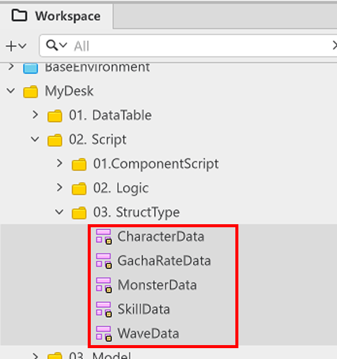
</p>

- StructType是將Property作為一個項目管理的方法。
- 宣告StructType後，若在Component或Logic中宣告為建立的StructType，即可存取StructType內宣告的Property。

<p align="center">
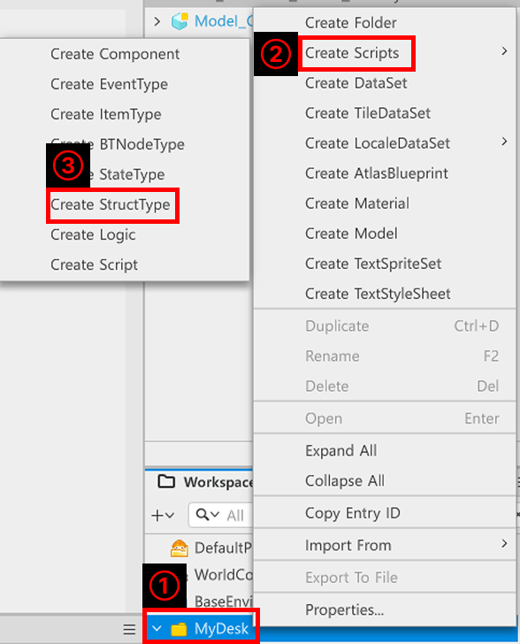
</p>

- 用滑鼠右鍵點擊「Workspace」、「MyDesk」。
- 點擊「Create Scripts」開啟腳本建立選單。
- 點擊「Create StructType」建立StructType Script。

<p align="center">
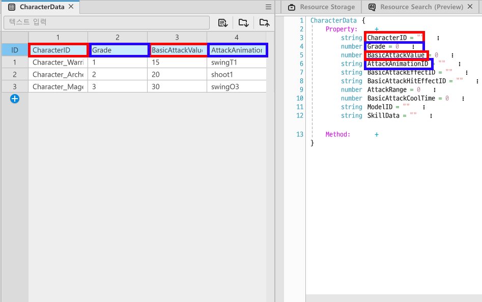
</p>

- 將先前製作的CharacterData項目名稱宣告為Property。
- 透過這個方式，使用DataSet的資訊時不必逐一宣告所有Property，可呼叫StructType進行管理。
- 之後製作DataSet時，會製作StructType進行管理。

<br>

## 製作角色Logic

- 製作隨機選定角色，並回傳所選角色資訊的Logic。

<p align="center">
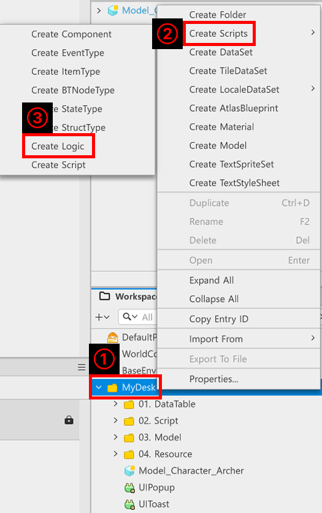
</p>

- 用滑鼠右鍵點擊「Workspace」、「MyDesk」。
- 點擊「Create Scripts」開啟選單。
- 透過「Create Logic」製作Logic。
- 在範例世界中，會將建立的Logic名稱宣告為CharacterGachaLogic。
- 以下是CharacterGachaLogic的程式碼。

```lua
@Logic
script CharacterGachaLogic extends Logic

property table characterData = {}

property table gachaRateData = {}

property table skillData = {}

property CharacterSlotGroupComponent characterSlotGroupController = nil

@ExecSpace("ClientOnly")
method void OnBeginPlay()
-- 登錄角色資訊DataSet。
self:InitCharacterData()
-- 登錄角色抽取資訊。
self:InitGachaRateData()
-- 嘗試初始化負責角色生成與欄位管理的characterSlotGroupController。
self:InitCharacterSlotGroup()
end

@ExecSpace("ClientOnly")
method void InitCharacterData()
-- 檢查是否擁有CharacterData DataSet。
if not isvalid(self.characterData) or not next(self.characterData) then
	-- 若characterData尚未登錄，則利用DataService尋找Workspace的CharacterData DataSet。
	local getData = _DataService:GetTable("CharacterData")
	-- 確認是否正常取得CharacterData。
	if not isvalid(getData) then
		log_error("找不到CharacterData DataSet！")
		return
	end
	-- 若正常找到CharacterData DataSet，則取得CharacterData的rowCount。
	local rowCount = getData:GetRowCount()
	-- 依rowCount數量巡覽DataSet，尋找並登錄資料。
	for i = 1, rowCount do
		local setData = CharacterData()
		setData.CharacterID = getData:GetCell(i, "CharacterID")
		setData.Grade = tonumber(getData:GetCell(i, "Grade"))
		setData.BasicAttackValue = tonumber(getData:GetCell(i, "BasicAttackValue"))
		setData.AttackAnimationID = tostring(getData:GetCell(i, "AttackAnimationID"))
		setData.BasicAttackEffectID = tostring(getData:GetCell(i, "BasicAttackEffectID"))
		setData.BasicAttackHitEffectID = tostring(getData:GetCell(i, "BasicAttackHitEffectID"))
		setData.AttackRange = tonumber(getData:GetCell(i, "AttackRange"))
		setData.SkillData = tostring(getData:GetCell(i, "SkillData"))
		setData.BasicAttackCoolTime = tonumber(getData:GetCell(i, "BasicAttackCoolTime"))
		setData.ModelID = tostring(getData:GetCell(i, "ModelID"))
		if not isvalid(self.characterData[setData.Grade]) or not next(self.characterData[setData.Grade])	then
			self.characterData[setData.Grade] = {}
		end
		table.insert(self.characterData[setData.Grade], setData)
	end
end
end

@ExecSpace("ClientOnly")
method void InitGachaRateData()
-- 檢查gachaRateData是否為空。
if not isvalid(self.gachaRateData) or not next(self.gachaRateData) then
	-- 若gachaRateData為空，則為了初始化而取得GachaRateData。
	local getData = _DataService:GetTable("GachaRateData")
	-- 若收到的getData值為nil，則顯示錯誤記錄並中斷程式碼執行。
	if not isvalid(getData) then
		log_error("找不到GachaRateData！")
		return
	end
	-- 若正常找到DataSet，則取得GachaRateData的rowCount。
	local GetRowCount = getData:GetRowCount()
	-- 依rowCount數量尋找並登錄Data。
	for i = 1, GetRowCount do
		local rateData = GachaRateData()
		rateData.Grade = tonumber(getData:GetCell(i, "Grade"))
		rateData.RateValue = tonumber(getData:GetCell(i, "RateValue"))
		table.insert(self.gachaRateData, rateData)
	end
end
end

@ExecSpace("ClientOnly")
method void InitCharacterSlotGroup()
-- 檢查目前地圖是否為InGame。
if _UserService.LocalPlayer.CurrentMapName == "InGame" then
	-- 若目前地圖為InGame，則根據路徑尋找CharacterSlotPosGroup。
	local findEntity = _EntityService:GetEntityByPath("/maps/InGame/CharacterSlotPosGroup")
	if isvalid(findEntity) then
		-- 若正常找到實體，則登錄CharacterSlotGroupComponent。
		self.characterSlotGroupController = findEntity.CharacterSlotGroupComponent
	end
end
end

@ExecSpace("ClientOnly")
method number GetRandomGrade()
-- 取得已儲存的gradeCount數量。
local gradeCount = #self.gachaRateData
-- 取得加總所有gradeCount機率後的值。
-- 此時GachaRateData必須只有整數值。
local totalValue = 0
for i = 1, gradeCount do
	totalValue = totalValue + self.gachaRateData[i].RateValue
end

-- 取得1到totalValue之間的隨機值。
local getRandomNumber = _UtilLogic:RandomIntegerRange(1, totalValue)
-- 從gachaRateData中逐一扣除值。
for i = 1, gradeCount do
	getRandomNumber = getRandomNumber - self.gachaRateData[i].RateValue
	if getRandomNumber <= 0 then
		return self.gachaRateData[i].Grade
	end
end
-- 若未正常得出值，則與錯誤記錄一同回傳最低等級。
log_error("取得正常的隨機等級值失敗！")
return 1
end

@ExecSpace("ClientOnly")
method CharacterData GetRandomCharacterData()
-- 回傳由GetRandomCharacterByGradeValue選出的隨機角色。
return self:GetRandomCharacterByGradeValue(self:GetRandomGrade())
end

@ExecSpace("ClientOnly")
method CharacterData GetRandomCharacterByGradeValue(number GradeValue)
-- 以收到的GradeValue值為基準，回傳該等級的一名隨機角色。
local getRandomList = self.characterData[GradeValue]

local getRandomCharacter = _UtilLogic:RandomIntegerRange(1, #getRandomList)
return getRandomList[getRandomCharacter]
end

@ExecSpace("ClientOnly")
method void RequestSpawnCharacter()
-- 檢查目前召喚詞元數量是否足夠。
if _GameLogic.summonToken >= 1 then
	-- 檢查目前是否有可召喚的欄位。
	local getSlotNumber = self.characterSlotGroupController:ReturnEmptySlotNumber()
	-- 若收到正常的欄位編號，則生成角色。
	if getSlotNumber >= 1 then
		local getData = self:GetRandomCharacterData()
		self.characterSlotGroupController:SpawnCharacter(getSlotNumber, getData)
		-- 將召喚詞元的值減少1，並請求更新UI。
		_GameLogic:UpdateSummonTokken(-1)
	else
		-- 若沒有空的角色欄位，則顯示提示訊息。
		_UIToast:ShowMessage(_LocalizationService:GetText("UI_NeedSpace"))
		log("目前角色欄位已滿！")
	end
else
	-- 若召喚詞元不足，則顯示提示訊息。
	_UIToast:ShowMessage(_LocalizationService:GetText("UI_NeedTokken"))
end

end

end
```

> 該程式碼是以PlainText為基準撰寫的程式碼。

<br>

## 製作用於角色控制的Component

- 必須組成用來取得角色行動與資料的UnitController，以及用來製作角色欄位移動的DragComponent。
- 以下是UnitController、DragComponent的全文。

```lua
@Component
script UnitController extends Component

property Entity avatarBodyComponent = nil

property table enemyTable = {}

property number basicAtkDelta = 0

property CharacterData characterData = CharacterData()

property DragComponent dragComponent = nil

property Entity currentSlot = nil

property number skillDelta = 0

property SkillData characterSkillData = SkillData()

property TriggerComponent triggerComponent = nil

@ExecSpace("ClientOnly")
method void OnBeginPlay()
-- 尋找並登錄用於播放紙娃娃的avatarBodyComponent。
if self.avatarBodyComponent == nil then
	local findComponent = self.Entity.AvatarRendererComponent:GetBodyEntity()
	if isvalid(findComponent) then
		self.avatarBodyComponent = findComponent
	end
end
-- 從子實體尋找並登錄dragComponent。
if not isvalid(self.dragComponent) then
	local findComponent = self.Entity:GetChildByName("DragEntity", true)
	if isvalid(findComponent) then
		self.dragComponent = findComponent.DragComponent
	end
end
-- 執行dragComponent的初始化與實體停用。
self:InitDragComponentSprite()
self.Entity.Enable = false
-- 若triggerComponent為空，則將其初始化。
if not isvalid(self.triggerComponent) then
	-- 從自身尋找TriggerComponent。
	local findComponent = self.Entity.TriggerComponent
	-- 若找到自身的TriggerComponent，則將其登錄到triggerComponent。
	if isvalid(findComponent) then
		self.triggerComponent = findComponent
	end
end
end

@ExecSpace("ClientOnly")
method void InitCharacterData(CharacterData Data, Entity SlotEntity)
-- 啟用角色。
self.Entity.Enable = true
-- 接收並登錄角色資訊。
self.characterData = Data
-- 尋找並登錄角色的技能資訊。
self.characterSkillData = _SkillDataLogic:GetSkillDataBySkillID(self.characterData.SkillData)
-- 將目前欄位登錄為收到的SlotEntity。
self.currentSlot = SlotEntity
-- 以收到的Data為基準更新攻擊範圍。
self.triggerComponent.CircleRadius = self.characterData.AttackRange
end

@ExecSpace("ClientOnly")
method void InitDragComponentSprite()
-- 為了讓DragEntity的紙娃娃與目前使用中的角色紙娃娃相同，初始化各項值。
local currentSprite = self.Entity.CostumeManagerComponent
local dragComponent = self.Entity:GetChildByName("DragEntity").CostumeManagerComponent
dragComponent.CustomBodyEquip = currentSprite.CustomBodyEquip
dragComponent.CustomCapeEquip = currentSprite.CustomCapeEquip
dragComponent.CustomCapEquip = currentSprite.CustomCapEquip
dragComponent.CustomCoatEquip = currentSprite.CustomCoatEquip
dragComponent.CustomEarAccessoryEquip = currentSprite.CustomEarAccessoryEquip
dragComponent.CustomEarEquip = currentSprite.CustomEarEquip
dragComponent.CustomEyeAccessoryEquip = currentSprite.CustomEyeAccessoryEquip
dragComponent.CustomFaceAccessoryEquip = currentSprite.CustomFaceAccessoryEquip
dragComponent.CustomFaceEquip = currentSprite.CustomFaceEquip
dragComponent.CustomGloveEquip = currentSprite.CustomGloveEquip
dragComponent.CustomHairEquip = currentSprite.CustomHairEquip
dragComponent.CustomLongcoatEquip = currentSprite.CustomLongcoatEquip
dragComponent.CustomOneHandedWeaponEquip = currentSprite.CustomOneHandedWeaponEquip
dragComponent.CustomPantsEquip = currentSprite.CustomPantsEquip
dragComponent.CustomShoesEquip = currentSprite.CustomShoesEquip
dragComponent.CustomSubWeaponEquip = currentSprite.CustomSubWeaponEquip
dragComponent.CustomTwoHandedWeaponEquip = currentSprite.CustomTwoHandedWeaponEquip
end

@ExecSpace("ClientOnly")
method void ChangeSlot(Entity SlotEntity)
-- 將目前欄位更改為收到的欄位。
self.currentSlot = SlotEntity
-- 將目前角色的位置初始化為收到的欄位位置。
self.Entity.TransformComponent.WorldPosition = SlotEntity.TransformComponent.WorldPosition
end

@ExecSpace("ClientOnly")
method void OnUpdate(number delta)
-- 不論條件為何都一律加上DeltaTime。
self.skillDelta = self.skillDelta + delta
self.basicAtkDelta = self.basicAtkDelta + delta

-- 檢查技能攻擊冷卻時間，若滿足條件則執行技能攻擊。
if self.skillDelta >= self.characterSkillData.SkillCoolTime then
	self:SkillAttack()
end

-- 若技能攻擊成功且冷卻時間初始化為0，則本影格略過基本攻擊。
if self.skillDelta == 0 then
	return
end

-- 檢查基本攻擊冷卻時間，若滿足條件則執行基本攻擊。
if self.basicAtkDelta >= self.characterData.BasicAttackCoolTime then
	self:BasicAttack()
end
end

@ExecSpace("ClientOnly")
method void BasicAttack()
-- 取得角色的StateComponent。
local bodySelector = self.Entity.StateComponent
-- 取得角色目前狀態名稱。
local currentState = bodySelector.CurrentStateName
-- 若目前狀態不是IDLE，則不執行基本攻擊。
if currentState ~= "IDLE" then
	return
end
---@type Entity
local targetEntity = nil
-- 以反向順序巡覽表格，安全移除無效實體。
for i = #self.enemyTable, 1, -1 do
	local enemy = self.enemyTable[i]
	-- 確認實體是否仍存在於世界中。
	if isvalid(enemy) then
		-- 確認實體是否有MonsterController且仍存活。
		if enemy.MonsterController and enemy.MonsterController.isAlive then
			targetEntity = enemy
			break
		end
	else
		-- 若是已被銷毀的實體，則從表格移除。
		table.remove(self.enemyTable, i)
	end
end
-- 若指定的targetEntity無法使用，則不執行攻擊。
if not isvalid(targetEntity) then
	return
end
-- 假設已執行攻擊，將basicAtkDelta值設定為0。
self.basicAtkDelta = 0
-- 為了播放攻擊動畫而建立並傳遞event。
local event = ActionStateChangedEvent(self.characterData.AttackAnimationID, self.characterData.AttackAnimationID, 1, SpriteAnimClipPlayType.Onetime)
self.avatarBodyComponent:SendEvent(event)
-- 若有要在角色端顯示的特效，則顯示該特效。
if not _UtilLogic:IsNilorEmptyString(self.characterData.BasicAttackEffectID) then
	_EffectService:PlayEffect(self.characterData.BasicAttackEffectID, self.Entity, self.Entity.TransformComponent.WorldPosition, 0, Vector3.one)	
end
-- 若有要在敵人身上顯示的特效，則顯示該特效。
if not _UtilLogic:IsNilorEmptyString(self.characterData.BasicAttackHitEffectID) then
	_EffectService:PlayEffect(self.characterData.BasicAttackHitEffectID, targetEntity, targetEntity.TransformComponent.WorldPosition, 0, Vector3.one)		
end
-- 透過成為目標的敵人的MonsterController，請求執行GetDamage。
targetEntity.MonsterController:GetDamage(self.characterData.BasicAttackValue)
end

@ExecSpace("ClientOnly")
method void SkillAttack()
-- 尋找並登錄用於播放動畫的bodySelector。
local bodySelector = self.Entity.StateComponent
-- 登錄CurrentStateName以尋找目前狀態。
local currentState = bodySelector.CurrentStateName
-- 若目前狀態不是IDLE，則中斷程式碼執行。
if currentState ~= "IDLE" then
	return
end
---@type Entity
local targetEntity = nil
-- 以反向順序巡覽表格，安全移除無效實體。
for i = #self.enemyTable, 1, -1 do
	local enemy = self.enemyTable[i]
	if isvalid(enemy) then
		if enemy.MonsterController and enemy.MonsterController.isAlive then
			targetEntity = enemy
			break
		end
	else
		table.remove(self.enemyTable, i)
	end
end
-- 若targetEntity為nil，則中斷程式碼執行。
if not isvalid(targetEntity) then
	return
end
-- 假設技能使用成功，將skillDelta值初始化為0。
self.skillDelta = 0
-- 播放攻擊動畫。
local event = ActionStateChangedEvent(self.characterData.AttackAnimationID, self.characterData.AttackAnimationID, 1, SpriteAnimClipPlayType.Onetime)
self.avatarBodyComponent:SendEvent(event)
-- 若技能使用時有要在自己身上顯示的特效，則顯示特效。
if not _UtilLogic:IsNilorEmptyString(self.characterSkillData.CharacterSkillEffect) then
	_EffectService:PlayEffect(self.characterSkillData.CharacterSkillEffect, self.Entity, self.Entity.TransformComponent.WorldPosition, 0, Vector3.one)	
end
-- 若有要在受擊對象身上顯示的特效，則顯示特效。
if not _UtilLogic:IsNilorEmptyString(self.characterSkillData.SkillEffect) then
	_EffectService:PlayEffect(self.characterSkillData.SkillEffect, targetEntity, targetEntity.TransformComponent.WorldPosition, 0, Vector3.one)		
end
-- 向成為對象的targetEntity的MonsterContorller請求執行GetDamage。
targetEntity.MonsterController:GetDamage(self.characterSkillData.SkillAttack)
end

@ExecSpace("ClientOnly")
@EventSender("Self")
handler HandleTriggerEnterEvent(TriggerEnterEvent event)
-- 若進入碰撞範圍的實體為CollisionGroups、Monster，則登錄該實體。
if event.TriggerBodyEntity.TriggerComponent.CollisionGroup == CollisionGroups.Monster then
	if #self.enemyTable >= 1 then
		local isAlreadyHave = false
		for i = 1, #self.enemyTable do
			if self.enemyTable[i] == event.TriggerBodyEntity then
				isAlreadyHave = true
				break
			end
		end
		if isAlreadyHave == false then
			table.insert(self.enemyTable, event.TriggerBodyEntity)
		end
	else
		table.insert(self.enemyTable, event.TriggerBodyEntity)
	end
end
end

@ExecSpace("ClientOnly")
@EventSender("Self")
handler HandleTriggerLeaveEvent(TriggerLeaveEvent event)
-- 若離開碰撞範圍的實體為Monster，則從攻擊列表移除。
if event.TriggerBodyEntity.TriggerComponent.CollisionGroup == CollisionGroups.Monster then
	if #self.enemyTable >= 1 then
		local listCount = #self.enemyTable
		for i = listCount, 1, -1 do
			if self.enemyTable[i] == event.TriggerBodyEntity then
				table.remove(self.enemyTable, i)
				break
			end
		end
	end
end
end

end
```

> 該程式碼是以Plain Text為基準編寫而成。

```lua
@Component
script DragComponent extends Component

@DisplayName("點擊輸入列表")
property table Index = {}

@DisplayName("Hold Handler")
@Description("點擊維持偵測檢查")
property any Handler = nil

@DisplayName("Release Handler")
@Description("點擊解除偵測檢查")
property any ReleaseHandler = nil

property Entity slotEntity = nil

property Entity parentEntity = "4bc00000-b6fa-481d-a049-aed3dea2d411"

property CharacterSlotGroupComponent characterSlotGroup = nil

@ExecSpace("ClientOnly")
method void OnBeginPlay()
-- 初始化characterSlotGroup。
self:InitCharacterSlotGroup()
end

@ExecSpace("ClientOnly")
method void InitCharacterSlotGroup()
-- 檢查characterSlotGroup是否為nil。
if not isvalid(self.characterSlotGroup) then
	-- 若characterSlotGroup為nil，則判斷目前地圖的狀態。
	if self.Entity.Parent.CurrentMapName == "InGame" then
		-- 若目前地圖為InGame，則尋找InGame中的CharacterSlotPosGroup。
		local findEntity = _EntityService:GetEntityByPath("/maps/InGame/CharacterSlotPosGroup")
		-- 驗證是否正常找到。
		if isvalid(findEntity) then
			-- 若正常找到實體，則登錄到characterSlotGroup。
			self.characterSlotGroup = findEntity.CharacterSlotGroupComponent
		end
	end
end
end

@ExecSpace("ClientOnly")
method void Move(any screenholdEvent)
-- 取得目前Hold狀態的Id值。
local touchId = screenholdEvent.TouchId
-- 取得目前Hold的位置值。
local touchPoint = screenholdEvent.TouchPoint
-- 探索所有點擊索引。
for i = 1, #self.Index do
	-- 若有與目前Hold中的Id相同的Index[touchId]，則將實體的位置移動至目前Hold的位置值。
	if self.Index[i] == touchId then
		self.Entity.TransformComponent.WorldPosition = _UILogic:ScreenToWorldPosition(touchPoint):ToVector3()
		break
	end
end
end

@ExecSpace("ClientOnly")
method void AddHandler(integer touchId)
-- 若Handler已存在，則為了防止重複處理而中斷程式碼執行。
if self.Handler ~= nil then
	return
end
    
-- 若已經在拖曳其他角色，則忽略以防止多重拖曳。
if isvalid(self.characterSlotGroup) then
	if self.characterSlotGroup.isDragging == true then
	return
end
-- 拖曳開始時，進行鎖定處理，避免其他欄位產生反應。
self.characterSlotGroup.isDragging = true
end

-- 若目前DragEntity處於隱藏狀態，則將其啟用。
if self.Entity.Visible == false then
	self.Entity.Visible = true
end
table.insert(self.Index, touchId)
    
-- 登錄為不只Hold，也在整個畫面偵測Release。
self.Handler = _InputService:ConnectEvent(ScreenTouchHoldEvent, self.Move)
self.ReleaseHandler = _InputService:ConnectEvent(ScreenTouchReleaseEvent, self.OnRelease)
end

@ExecSpace("ClientOnly")
method void OnRelease(any event)
local TouchId = event.TouchId
-- 因為拖曳已解除，所以探索所有TouchId並解除。    
for i = 1, #self.Index do
	if self.Index[i] == TouchId then
		table.remove(self.Index, i)
		if #self.Index <= 0 then
			-- 解除已新增的Hold與Release事件。
			_InputService:DisconnectEvent(ScreenTouchHoldEvent, self.Handler)
			_InputService:DisconnectEvent(ScreenTouchReleaseEvent, self.ReleaseHandler)
			self.Handler = nil
			self.ReleaseHandler = nil
                
			-- 因為拖曳已結束，所以解除鎖定。
			if isvalid(self.characterSlotGroup) then
				self.characterSlotGroup.isDragging = false
			end
                
			-- 取得掉落的位置。
			local dropPos = self.Entity.TransformComponent.WorldPosition
                
			-- 為了探索目前位置中最近的目標欄位，將目前欄位編號設定為不會重複的-1。
			local targetSlotNumber = -1
			-- 可視為欄位的最大半徑距離
			local closestDist = 1.5 
            -- 檢查characterSlotGroup與characterSlotGroup的characterSlotList是否可使用。
			if isvalid(self.characterSlotGroup) and self.characterSlotGroup.characterSlotList then
				-- 透過for迴圈探索characterSlotList。
				for slotIndex = 1, #self.characterSlotGroup.characterSlotList do
					-- 取得slotIndex的slotEntity。
					local slotEntity = self.characterSlotGroup.characterSlotList[slotIndex].Entity
					-- 取得slotPos的slotEntity的worldPosition。
					local slotPos = slotEntity.TransformComponent.WorldPosition
					-- 計算作為dragEntity的自己與欄位之間的距離。
					local dist = Vector2.Distance(dropPos:ToVector2(), slotPos:ToVector2())
					-- 若距離小於先前指定的closetDist，則判斷為進入範圍。
						if dist < closestDist then
							-- 設定為符合條件的Slot距離。
							closestDist = dist
							-- 將符合條件的slotIndex登錄為targetSlotNumber。
                            targetSlotNumber = slotIndex
                        end
                    end
			end
                
			-- 取得原本的欄位編號。
			local beforeSlotNumber = self.parentEntity.UnitController.currentSlot.CharacterSlotComponent:GetSlotNumber()
            -- 若targetSlotNumber不是-1，且targetSlotNumber與beforeSlotNumber不同，則執行移動。
			if targetSlotNumber ~= -1 and targetSlotNumber ~= beforeSlotNumber then
				self.characterSlotGroup:SwitchSlotCharacter(targetSlotNumber, self.parentEntity, beforeSlotNumber)
			end
		end
	break 
	end
end
    
    -- 移動處理結束後，執行返回原本位置及隱藏處理。
    self.Entity.TransformComponent.WorldPosition = self.parentEntity.TransformComponent.WorldPosition
    self.Entity.Visible = false
end

@ExecSpace("ClientOnly")
@EventSender("Self")
handler HandleTouchEvent(TouchEvent event)
-- 取得輸入的event的TouchId值。
local TouchId = event.TouchId
-- 透過AddHandler登錄需要的事件。
self:AddHandler(TouchId)
end

end
```

> 該程式碼是以Plain Text為基準編寫而成。

<br>

## 最低製作標準

- 將角色製作成可使用的Model形式。
- 製作用於使用製作成Model的角色的功能。
- 根據等級製作各等級至少1種以上角色，讓角色可被生成。

<br>

## 應用與進階應用

- 使用其他方式套用角色的召喚機率。
- 製作角色執行攻擊時可播放音效的功能。
- 新增依據攻擊速度調整各角色攻擊時播放的動畫速度的功能。